# Composio集成API

<cite>
**本文档引用的文件**   
- [composio.py](file://vibe_surf/backend/api/composio.py)
- [composio_client.py](file://vibe_surf/tools/composio_client.py)
- [composio_toolkits表](file://vibe_surf/backend/database/models.py#L192-L215)
- [credentials表](file://vibe_surf/backend/database/models.py#L217-L234)
- [v005_add_composio_integration.sql](file://vibe_surf/backend/database/migrations/v005_add_composio_integration.sql)
- [v006_add_credentials_table.sql](file://vibe_surf/backend/database/migrations/v006_add_credentials_table.sql)
- [encryption.py](file://vibe_surf/backend/utils/encryption.py)
- [composio_base.py](file://vibe_surf/langflow/base/composio/composio_base.py)
- [composio_api.py](file://vibe_surf/workflows/Integrations/composio_api.py)
- [gmail_composio.py](file://vibe_surf/workflows/Integrations/gmail_composio.py)
</cite>

## 目录
1. [简介](#简介)
2. [第三方服务连接管理](#第三方服务连接管理)
3. [集成服务查询接口](#集成服务查询接口)
4. [工作流中调用第三方服务](#工作流中调用第三方服务)
5. [凭证管理和安全存储](#凭证管理和安全存储)
6. [常见集成场景示例](#常见集成场景示例)
7. [API速率限制和错误恢复](#api速率限制和错误恢复)
8. [自定义集成扩展方法](#自定义集成扩展方法)

## 简介

Composio集成API为VibeSurf平台提供了与第三方服务（如Gmail、Notion、Slack等）的连接和集成能力。该API通过OAuth 2.0认证机制管理第三方服务的连接，允许用户安全地授权和使用各种外部工具。API提供了完整的端点来管理集成服务的生命周期，包括认证、授权、连接测试、工具查询和执行等功能。

系统通过Composio平台作为中间层，将各种第三方服务的API封装为标准化的工具，供VibeSurf的智能代理调用。这种架构实现了服务解耦，使得新增集成服务变得简单高效。所有敏感信息（如API密钥）都经过加密存储，确保了用户数据的安全性。

**Section sources**
- [composio.py](file://vibe_surf/backend/api/composio.py#L1-L25)
- [composio_api.py](file://vibe_surf/workflows/Integrations/composio_api.py#L1-L21)

## 第三方服务连接管理

Composio集成API提供了完整的端点来管理第三方服务的连接，包括认证、授权和连接测试功能。

### 认证端点

`/composio/verify-key`端点用于验证Composio API密钥的有效性。客户端需要发送一个包含API密钥的POST请求，服务器将验证密钥并将其安全地存储在数据库中。

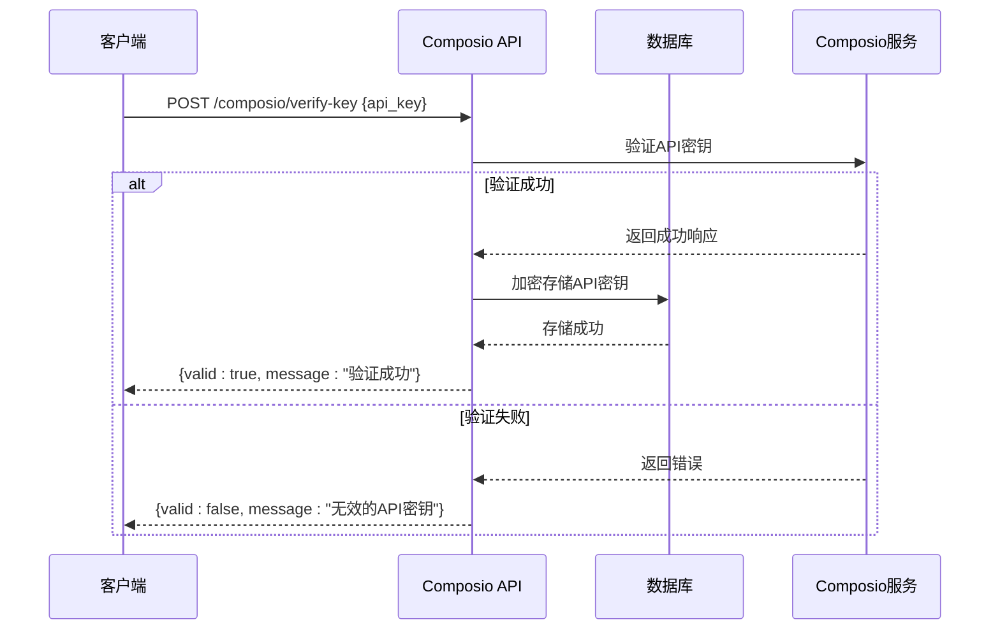

**Diagram sources**
- [composio.py](file://vibe_surf/backend/api/composio.py#L367-L421)

### 授权和连接管理

`/composio/toolkit/{slug}/toggle`端点用于启用或禁用特定的工具包（toolkit），并处理OAuth授权流程。

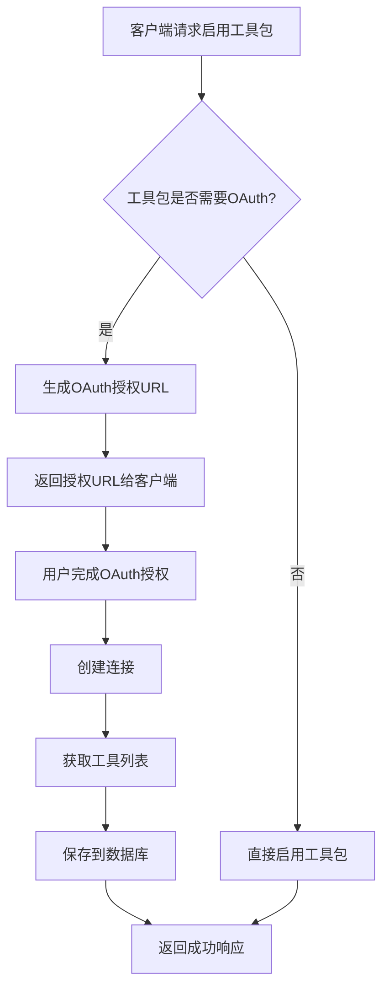

当启用一个需要OAuth的工具包时，API会检查是否存在有效的连接。如果不存在，它会生成一个OAuth授权URL，客户端需要引导用户访问该URL完成授权。授权完成后，系统会创建一个连接，并获取该工具包提供的所有工具。

**Section sources**
- [composio.py](file://vibe_surf/backend/api/composio.py#L531-L728)
- [composio_base.py](file://vibe_surf/langflow/base/composio/composio_base.py#L746-L789)

### 连接状态检查

`/composio/status`端点用于检查当前的Composio连接状态，包括API密钥是否有效、是否有有效的Composio实例等。

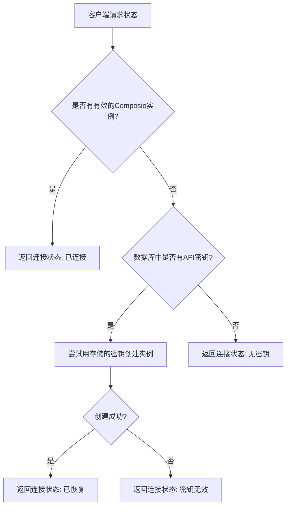

该端点不进行实际的API调用验证，而是检查内部状态，因此响应速度很快。

**Diagram sources**
- [composio.py](file://vibe_surf/backend/api/composio.py#L225-L364)

## 集成服务查询接口

Composio集成API提供了查询可用集成服务及其功能的接口。

### 获取工具包列表

`/composio/toolkits`端点返回所有可用的OAuth 2.0工具包列表。这些工具包代表了可以集成的第三方服务。

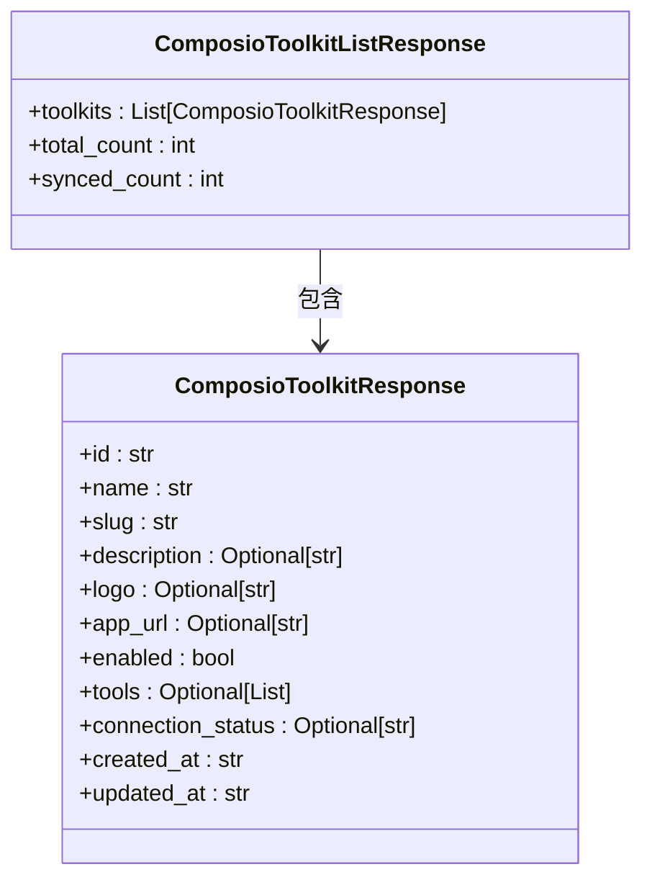

响应包含每个工具包的详细信息，如名称、描述、徽标URL和是否已启用。`sync_with_api`参数可以用于同步最新的工具包列表。

**Section sources**
- [composio.py](file://vibe_surf/backend/api/composio.py#L423-L529)
- [models.py](file://vibe_surf/backend/database/models.py#L192-L215)

### 获取工具列表

`/composio/toolkit/{slug}/tools`端点返回特定工具包中可用的工具列表。

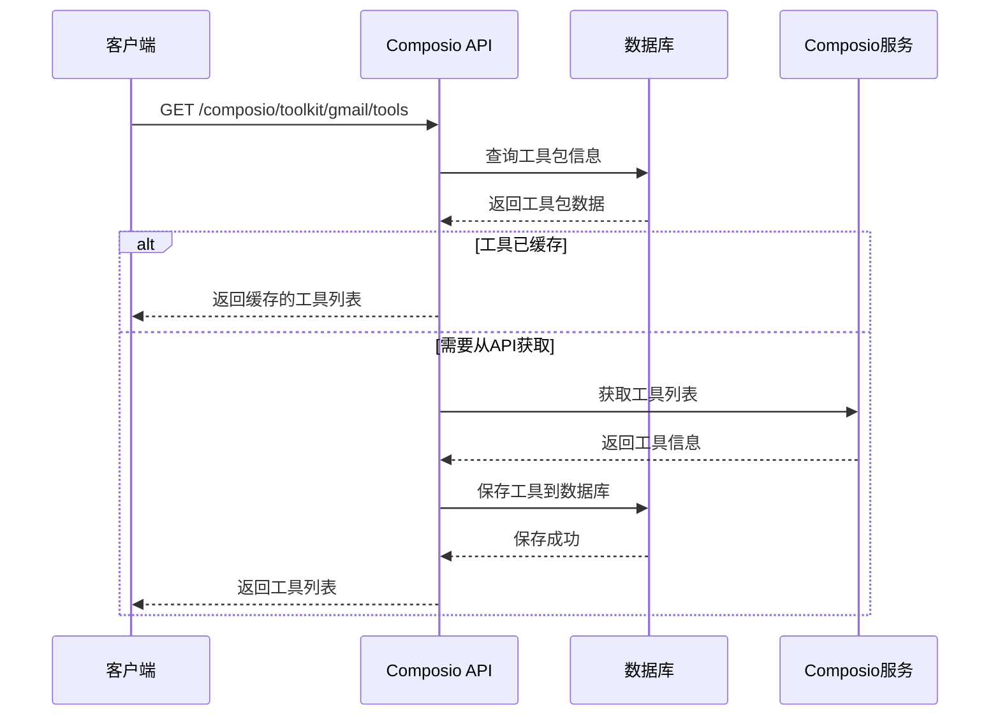

系统首先尝试从数据库获取工具列表，如果不存在或为空，则从Composio API获取并缓存到数据库中，以提高后续请求的性能。

**Diagram sources**
- [composio.py](file://vibe_surf/backend/api/composio.py#L731-L828)

## 工作流中调用第三方服务

Composio集成API允许在工作流中调用第三方服务的工具。

### 工具注册机制

当工具包被启用时，系统会自动将其中的工具注册为VibeSurf可调用的动作。

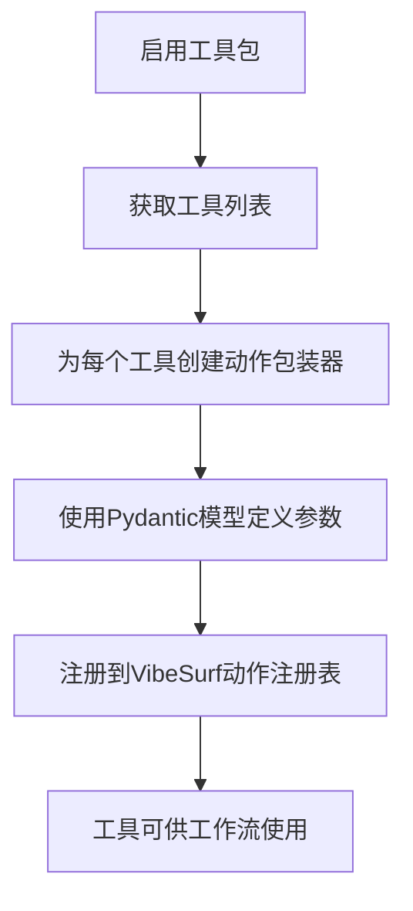

`ComposioClient`类负责将Composio工具注册为VibeSurf动作。它会为每个工具创建一个异步包装函数，并使用Pydantic模型来定义参数结构。

**Section sources**
- [composio_client.py](file://vibe_surf/tools/composio_client.py#L60-L296)
- [vibesurf_tools.py](file://vibe_surf/tools/vibesurf_tools.py#L2165-L2229)

### 工具调用流程

当工作流执行时，注册的动作会被调用以执行实际的第三方服务操作。

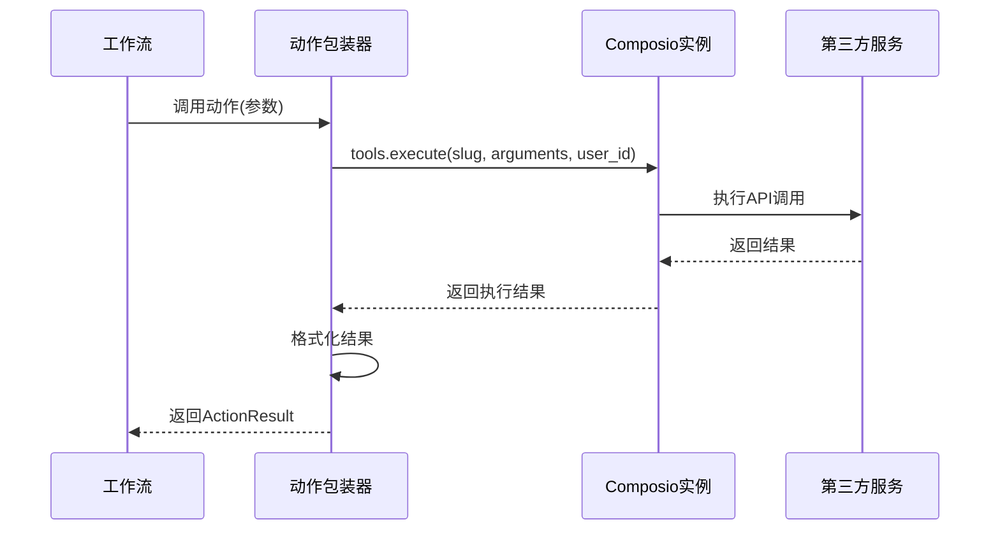

动作包装器会调用Composio实例的`tools.execute`方法来执行实际的API调用，并将结果格式化为`ActionResult`对象返回。

**Diagram sources**
- [composio_client.py](file://vibe_surf/tools/composio_client.py#L183-L290)

## 凭证管理和安全存储

Composio集成API实现了安全的凭证管理和存储机制。

### 数据库表结构

系统使用两个主要的数据库表来管理集成和凭证：

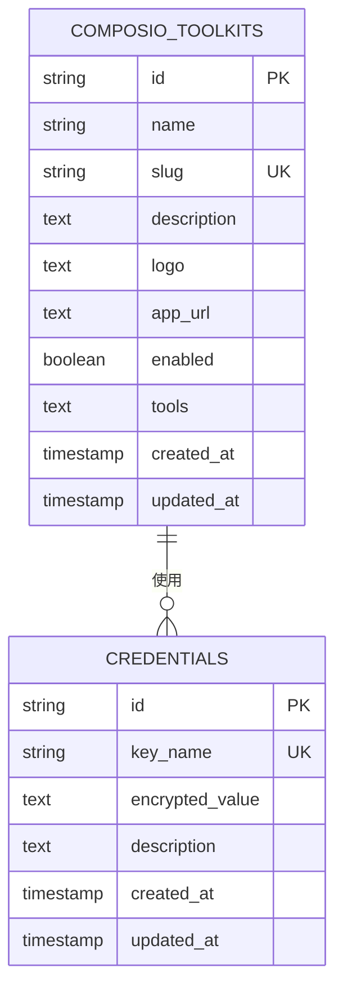

`composio_toolkits`表存储了所有可用工具包的信息，而`credentials`表则安全地存储了API密钥等敏感信息。

**Section sources**
- [v005_add_composio_integration.sql](file://vibe_surf/backend/database/migrations/v005_add_composio_integration.sql)
- [v006_add_credentials_table.sql](file://vibe_surf/backend/database/migrations/v006_add_credentials_table.sql)
- [models.py](file://vibe_surf/backend/database/models.py#L192-L234)

### 加密存储机制

所有敏感凭证都使用基于机器MAC地址的密钥进行加密存储。

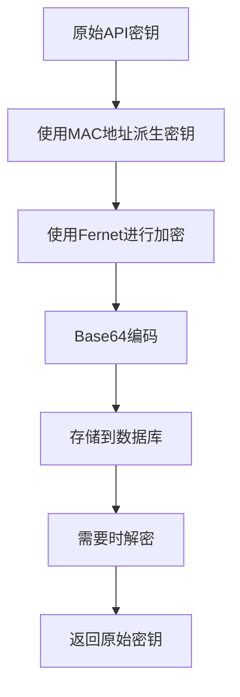

`encryption.py`模块实现了加密和解密功能。它使用PBKDF2-HMAC-SHA256算法从机器的MAC地址派生加密密钥，然后使用Fernet对称加密来加密API密钥。

**Diagram sources**
- [encryption.py](file://vibe_surf/backend/utils/encryption.py#L23-L127)

## 常见集成场景示例

以下是几个常见第三方服务的集成示例。

### Gmail集成

Gmail集成允许工作流发送和接收电子邮件。

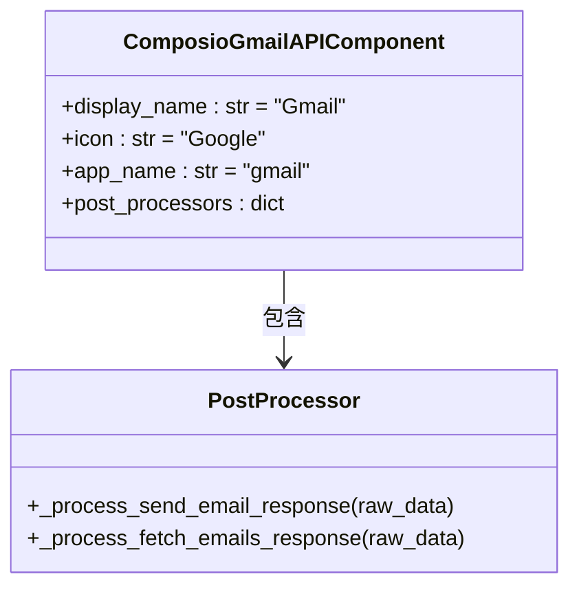

`ComposioGmailAPIComponent`类扩展了基础的Composio组件，为Gmail服务提供了特定的后处理器，用于格式化发送邮件和获取邮件的响应。

**Section sources**
- [gmail_composio.py](file://vibe_surf/workflows/Integrations/gmail_composio.py#L1-L39)

### Notion集成

Notion集成允许工作流创建和管理Notion页面。

```python
# 示例：在工作流中使用Notion工具
async def create_notion_page():
    # 假设已配置好Composio实例
    composio_client = ComposioClient(composio_instance)
    
    # 注册Notion工具
    await composio_client.register_to_tools(
        tools=vibesurf_tools,
        toolkit_tools_dict={"notion": notion_tools_list}
    )
    
    # 现在可以在工作流中使用notion工具
    result = await vibesurf_tools.execute_action("cpo.notion.create_page", {
        "title": "新页面",
        "content": "页面内容"
    })
    return result
```

### Slack集成

Slack集成允许工作流发送消息和管理频道。

```python
# 示例：发送Slack消息
async def send_slack_message():
    # 使用已注册的Slack工具
    result = await vibesurf_tools.execute_action("cpo.slack.send_message", {
        "channel": "general",
        "text": "Hello from VibeSurf!"
    })
    return result
```

## API速率限制和错误恢复

Composio集成API实现了速率限制处理和错误恢复策略。

### 错误处理

系统对各种可能的错误情况进行了处理：

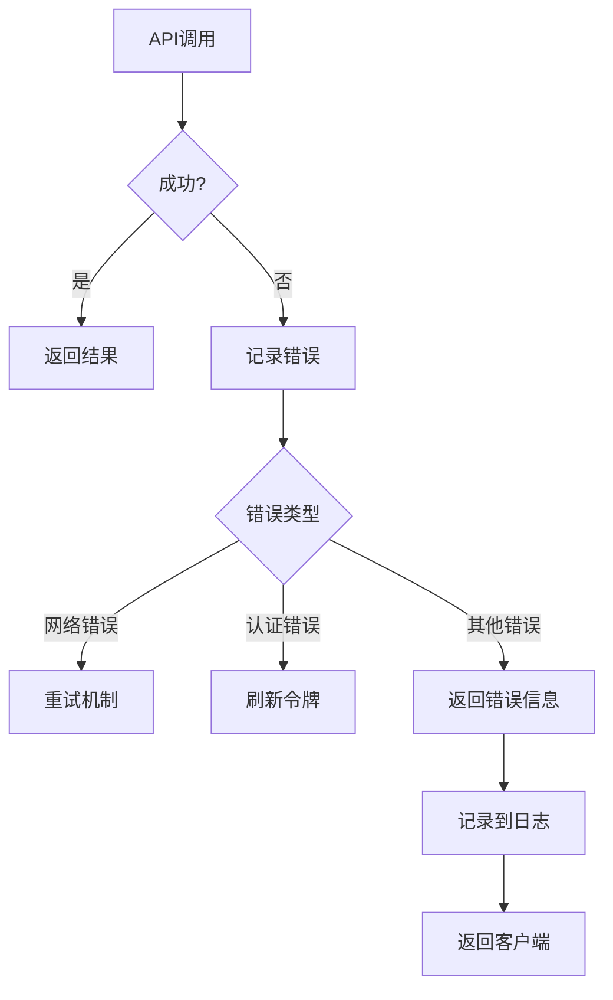

在`composio_client.py`中，每个工具调用都被包裹在try-catch块中，以捕获和处理异常。错误信息会被记录到日志中，并通过`ActionResult`对象返回给调用者。

**Section sources**
- [composio_client.py](file://vibe_surf/tools/composio_client.py#L217-L238)

### 重试机制

对于临时性错误（如网络问题），系统实现了重试机制。

```python
# 伪代码：重试逻辑
async def execute_with_retry(func, max_retries=3):
    for attempt in range(max_retries):
        try:
            return await func()
        except (ConnectionError, TimeoutError) as e:
            if attempt == max_retries - 1:
                raise e
            wait_time = 2 ** attempt  # 指数退避
            await asyncio.sleep(wait_time)
```

虽然具体的重试逻辑没有在提供的代码中实现，但这是一个推荐的最佳实践，可以根据需要添加。

## 自定义集成扩展方法

Composio集成API支持自定义集成的扩展。

### 创建新的集成组件

要添加新的第三方服务集成，可以创建一个新的组件类：

```python
from vibe_surf.langflow.base.composio.composio_base import ComposioBaseComponent

class ComposioCustomAPIComponent(ComposioBaseComponent):
    display_name: str = "自定义服务"
    icon = "CustomIcon"
    documentation: str = "https://docs.customservice.com"
    app_name = "custom_service"
    
    def __init__(self, **kwargs):
        super().__init__(**kwargs)
        self.post_processors = {
            "CUSTOM_ACTION": self._process_custom_action_response,
        }
    
    def _process_custom_action_response(self, raw_data):
        """处理自定义操作的响应"""
        # 自定义响应处理逻辑
        return raw_data
```

### 扩展功能

可以通过以下方式扩展Composio集成的功能：

1. **添加新的后处理器**：为特定服务的响应添加自定义格式化逻辑
2. **修改参数映射**：调整工具参数与前端输入的映射关系
3. **添加验证逻辑**：在工具执行前添加额外的验证步骤
4. **集成监控**：添加性能监控和使用统计

这些扩展方法使得Composio集成API具有很高的灵活性和可扩展性，能够适应各种不同的集成需求。

**Section sources**
- [composio_base.py](file://vibe_surf/langflow/base/composio/composio_base.py#L63-L800)
- [composio_api.py](file://vibe_surf/workflows/Integrations/composio_api.py#L25-L280)