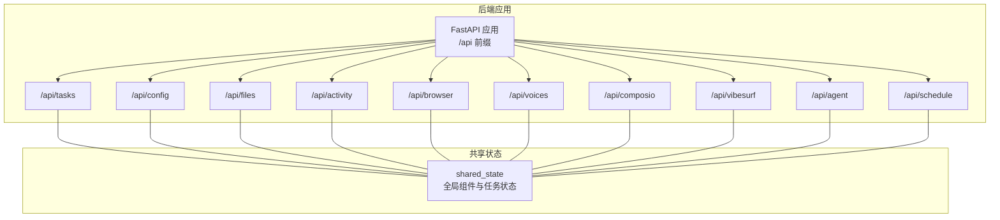
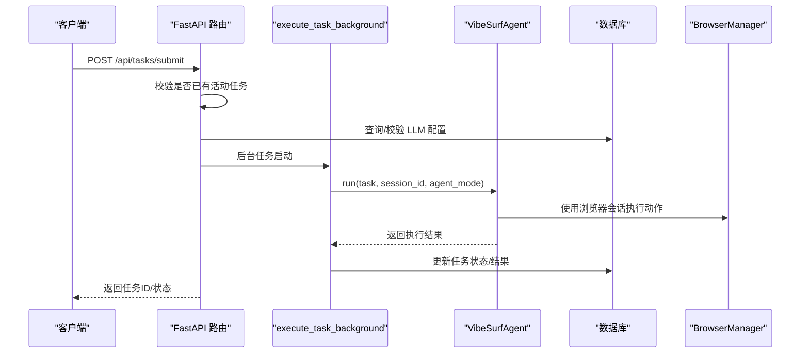
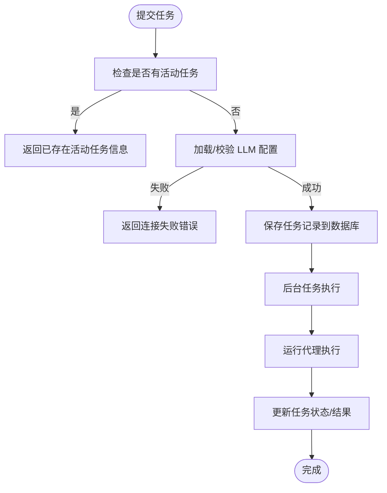
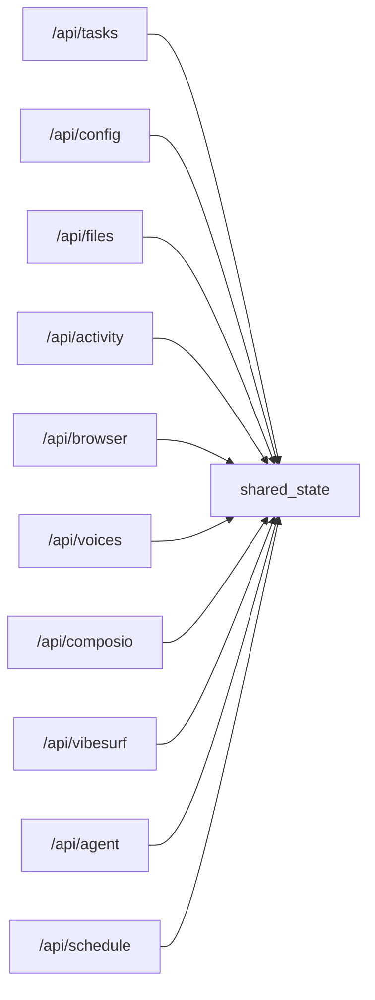

# 代理API

<cite>
**本文引用的文件**
- [main.py](file://vibe_surf/backend/main.py)
- [shared_state.py](file://vibe_surf/backend/shared_state.py)
- [task.py](file://vibe_surf/backend/api/task.py)
- [models.py](file://vibe_surf/backend/api/models.py)
- [config.py](file://vibe_surf/backend/api/config.py)
- [browser.py](file://vibe_surf/backend/api/browser.py)
- [activity.py](file://vibe_surf/backend/api/activity.py)
- [files.py](file://vibe_surf/backend/api/files.py)
- [schedule.py](file://vibe_surf/backend/api/schedule.py)
- [voices.py](file://vibe_surf/backend/api/voices.py)
- [composio.py](file://vibe_surf/backend/api/composio.py)
- [vibesurf.py](file://vibe_surf/backend/api/vibesurf.py)
- [agent.py](file://vibe_surf/backend/api/agent.py)
</cite>

## 目录
1. [简介](#简介)
2. [项目结构](#项目结构)
3. [核心组件](#核心组件)
4. [架构总览](#架构总览)
5. [详细组件分析](#详细组件分析)
6. [依赖关系分析](#依赖关系分析)
7. [性能考量](#性能考量)
8. [故障排查指南](#故障排查指南)
9. [结论](#结论)
10. [附录](#附录)

## 简介
本文件系统性梳理 VibeSurf 代理API的设计与实现，覆盖代理创建、配置、启动与监控的REST端点；代理状态管理（启动、暂停、恢复、终止）；代理配置项（LLM模型选择、提示词模板、执行模式等）；代理执行结果获取与流式传输支持；多代理并行处理的最佳实践；错误处理机制与常见故障场景；以及与浏览器自动化的集成配置参数。文档以“可读性优先”的原则组织，既适合开发者深入理解实现细节，也便于非技术读者快速上手。

## 项目结构
后端采用 FastAPI 应用，统一挂载在 /api 前缀下，按功能模块拆分路由：
- 任务执行：/api/tasks（提交、暂停、恢复、停止、追加任务、状态查询）
- 配置管理：/api/config（LLM/MCP 配置、环境变量、状态）
- 文件管理：/api/files（上传、下载、列举、删除）
- 活动日志：/api/activity（任务历史、会话活动、最新活动）
- 浏览器：/api/browser（当前标签页、全部标签页）
- 语音工具：/api/voices（ASR/TTS 配置与识别）
- Composio 集成：/api/composio（API Key 校验、工具包启用/禁用、OAuth）
- VibeSurf 服务：/api/vibesurf（API Key 管理、工作流导入导出、新闻源与内容）
- 代理技能：/api/agent（可用技能枚举）
- 定时调度：/api/schedule（工作流定时执行）

图表来源
- [main.py](file://vibe_surf/backend/main.py#L580-L648)
- [shared_state.py](file://vibe_surf/backend/shared_state.py#L1-L120)

章节来源
- [main.py](file://vibe_surf/backend/main.py#L580-L648)
- [shared_state.py](file://vibe_surf/backend/shared_state.py#L1-L120)

## 核心组件
- 任务执行器：单任务串行执行，通过后台任务队列触发代理执行，并持久化任务状态与结果。
- 全局共享状态：集中管理浏览器、工具集、LLM、工作空间目录、活动任务等。
- 配置中心：LLM/MCP 配置、默认配置、环境变量、代理能力清单。
- 文件系统：工作区内的上传/下载/列举/删除，支持会话隔离。
- 活动日志：数据库任务历史与实时代理活动日志。
- 浏览器自动化：标签页信息查询、浏览器连接监控。
- 语音工具：ASR/TTS 配置与识别。
- Composio 集成：API Key 管理、OAuth 连接、工具包启用/禁用与工具同步。
- VibeSurf 服务：API Key 管理、工作流导入导出、新闻源与内容获取。
- 代理技能：列出可用技能名称（去除前缀）。

章节来源
- [task.py](file://vibe_surf/backend/api/task.py#L1-L120)
- [shared_state.py](file://vibe_surf/backend/shared_state.py#L1-L120)
- [models.py](file://vibe_surf/backend/api/models.py#L1-L120)
- [files.py](file://vibe_surf/backend/api/files.py#L1-L120)
- [activity.py](file://vibe_surf/backend/api/activity.py#L1-L120)
- [browser.py](file://vibe_surf/backend/api/browser.py#L1-L71)
- [voices.py](file://vibe_surf/backend/api/voices.py#L1-L120)
- [composio.py](file://vibe_surf/backend/api/composio.py#L1-L120)
- [vibesurf.py](file://vibe_surf/backend/api/vibesurf.py#L1-L120)
- [agent.py](file://vibe_surf/backend/api/agent.py#L1-L38)

## 架构总览
后端应用在启动时初始化浏览器、工具集、LLM、数据库与调度器，并在生命周期内维护全局状态。任务提交后通过后台任务执行代理，期间更新活动任务状态并持久化到数据库。各模块通过共享状态解耦，避免循环依赖。

图表来源
- [main.py](file://vibe_surf/backend/main.py#L327-L482)
- [shared_state.py](file://vibe_surf/backend/shared_state.py#L118-L233)
- [task.py](file://vibe_surf/backend/api/task.py#L43-L152)

章节来源
- [main.py](file://vibe_surf/backend/main.py#L327-L482)
- [shared_state.py](file://vibe_surf/backend/shared_state.py#L118-L233)
- [task.py](file://vibe_surf/backend/api/task.py#L43-L152)

## 详细组件分析

### 任务执行与状态管理
- 提交任务：/api/tasks/submit（POST），接收会话ID、任务描述、LLM配置名、上传文件路径、MCP配置、执行模式，返回任务ID与工作区路径。
- 状态检查：/api/tasks/status（GET），快速判断是否存在活动任务。
- 详细状态：/api/tasks/detailed-status（GET），返回代理整体状态、步骤、进度、时间戳等。
- 控制操作：/api/tasks/pause（POST）、/api/tasks/resume（POST）、/api/tasks/stop（POST）、/api/tasks/add-new-task（POST），均支持传入原因字段。
- 并发策略：同一时刻仅允许一个活动任务；若已有活动任务，提交将被拒绝并返回当前活动任务信息。

图表来源
- [task.py](file://vibe_surf/backend/api/task.py#L43-L152)
- [task.py](file://vibe_surf/backend/api/task.py#L197-L333)
- [task.py](file://vibe_surf/backend/api/task.py#L335-L379)

章节来源
- [task.py](file://vibe_surf/backend/api/task.py#L34-L152)
- [task.py](file://vibe_surf/backend/api/task.py#L197-L333)
- [task.py](file://vibe_surf/backend/api/task.py#L335-L379)
- [models.py](file://vibe_surf/backend/api/models.py#L102-L159)

### 配置管理
- LLM 配置
  - 创建：/api/config/llm-profiles（POST），支持设置提供商、模型、温度、最大令牌数、Top-P、频率惩罚、种子、自定义基础URL、提供商特定配置、描述、是否设为默认。
  - 列表：/api/config/llm-profiles（GET），支持按活跃状态、分页过滤。
  - 查询：/api/config/llm-profiles/{profile_name}（GET），返回指定配置。
  - 更新：/api/config/llm-profiles/{profile_name}（PUT），支持部分字段更新。
  - 删除：/api/config/llm-profiles/{profile_name}（DELETE），禁止删除默认配置。
  - 设为默认：/api/config/llm-profiles/{profile_name}/set-default（POST）。
  - 当前默认：/api/config/llm-profiles/default/current（GET）。
  - 可用提供商：/api/config/llm/providers（GET），返回提供商清单、模型列表、元数据。
  - 指定提供商模型：/api/config/llm/providers/{provider_name}/models（GET）。
- MCP 配置
  - 创建：/api/config/mcp-profiles（POST），字段包含显示名、服务器名、服务器参数、描述。
  - 列表：/api/config/mcp-profiles（GET）。
  - 查询：/api/config/mcp-profiles/{mcp_id}（GET）。
  - 更新：/api/config/mcp-profiles/{mcp_id}（PUT）。
  - 删除：/api/config/mcp-profiles/{mcp_id}（DELETE）。
- 环境变量
  - 获取：/api/config/environments（GET）。
  - 更新：/api/config/environments（PUT），支持批量更新。
- 配置状态
  - 获取：/api/config/status（GET），返回 LLM 配置统计、工具初始化状态、浏览器管理器状态、代理工作区等。

章节来源
- [config.py](file://vibe_surf/backend/api/config.py#L77-L299)
- [config.py](file://vibe_surf/backend/api/config.py#L301-L401)
- [config.py](file://vibe_surf/backend/api/config.py#L403-L583)
- [config.py](file://vibe_surf/backend/api/config.py#L585-L620)
- [config.py](file://vibe_surf/backend/api/config.py#L621-L643)
- [config.py](file://vibe_surf/backend/api/config.py#L645-L689)
- [config.py](file://vibe_surf/backend/api/config.py#L690-L762)
- [models.py](file://vibe_surf/backend/api/models.py#L14-L66)
- [models.py](file://vibe_surf/backend/api/models.py#L71-L97)

### 文件管理
- 上传：/api/files/upload（POST，multipart/form-data），支持多文件上传，自动去重命名，记录元数据到数据库。
- 下载：/api/files/{file_id}（GET），安全路径校验后返回文件。
- 列表：/api/files（GET），支持按会话过滤、分页。
- 删除：/api/files/{file_id}（DELETE），软删除并清理磁盘文件。
- 会话文件：/api/files/session/{session_id}（GET），遍历会话目录返回文件/目录清单。

章节来源
- [files.py](file://vibe_surf/backend/api/files.py#L57-L154)
- [files.py](file://vibe_surf/backend/api/files.py#L156-L179)
- [files.py](file://vibe_surf/backend/api/files.py#L181-L230)
- [files.py](file://vibe_surf/backend/api/files.py#L232-L262)
- [files.py](file://vibe_surf/backend/api/files.py#L264-L332)

### 活动日志与任务历史
- 最近任务：/api/activity/tasks（GET），支持限制数量。
- 所有会话：/api/activity/sessions（GET），支持分页。
- 会话任务：/api/activity/sessions/{session_id}/tasks（GET）。
- 任务详情：/api/activity/{task_id}（GET）。
- 实时活动日志：/api/activity/sessions/{session_id}/activity（GET），支持按消息索引或限制条数。
- 最新活动：/api/activity/sessions/{session_id}/latest_activity（GET）。

章节来源
- [activity.py](file://vibe_surf/backend/api/activity.py#L24-L118)
- [activity.py](file://vibe_surf/backend/api/activity.py#L119-L151)
- [activity.py](file://vibe_surf/backend/api/activity.py#L154-L218)
- [activity.py](file://vibe_surf/backend/api/activity.py#L220-L246)

### 浏览器自动化
- 当前标签页：/api/browser/active-tab（GET），返回当前激活标签页的URL与标题。
- 全部标签页：/api/browser/all-tabs（GET），返回所有页面目标的URL与标题。

章节来源
- [browser.py](file://vibe_surf/backend/api/browser.py#L18-L45)
- [browser.py](file://vibe_surf/backend/api/browser.py#L47-L71)

### 语音工具（ASR/TTS）
- 语音配置
  - 创建：/api/voices/voice-profiles（POST），字段包含配置名、模型类型（ASR/TTS）、模型名、密钥、元参数、描述。
  - 更新：/api/voices/voice-profiles/{voice_profile_name}（PUT）。
  - 删除：/api/voices/voice-profiles/{voice_profile_name}（DELETE）。
  - 列表：/api/voices/voice-profiles（GET），支持按类型与活跃状态过滤。
  - 查询：/api/voices/{voice_profile_name}（GET）。
- 语音识别：/api/voices/asr（POST，multipart/form-data），需要指定语音配置名，返回识别文本与保存路径。
- 可用模型：/api/voices/models（GET），返回模型清单及是否需要密钥。

章节来源
- [voices.py](file://vibe_surf/backend/api/voices.py#L49-L222)
- [voices.py](file://vibe_surf/backend/api/voices.py#L224-L373)
- [voices.py](file://vibe_surf/backend/api/voices.py#L375-L481)

### Composio 集成
- 状态：/api/composio/status（GET），返回连接状态、密钥有效性、是否已存储。
- 验证密钥：/api/composio/verify-key（POST），验证并存储 API Key。
- 工具包：/api/composio/toolkits（GET），返回工具包列表，可选从 API 同步。
- 启用/禁用：/api/composio/toolkit/{slug}/toggle（POST），支持强制重新认证与 OAuth 流程。
- 工具列表：/api/composio/toolkit/{slug}/tools（GET），返回工具清单并缓存至数据库。

章节来源
- [composio.py](file://vibe_surf/backend/api/composio.py#L225-L365)
- [composio.py](file://vibe_surf/backend/api/composio.py#L367-L421)
- [composio.py](file://vibe_surf/backend/api/composio.py#L423-L529)
- [composio.py](file://vibe_surf/backend/api/composio.py#L531-L729)
- [composio.py](file://vibe_surf/backend/api/composio.py#L731-L800)

### VibeSurf 服务
- API Key 管理
  - 验证并存储：/api/vibesurf/verify-key（POST）。
  - 状态查询：/api/vibesurf/status（GET）。
  - 删除：/api/vibesurf/key（DELETE）。
  - 校验当前：/api/vibesurf/validate（GET）。
- 工作流
  - 导入：/api/vibesurf/import-workflow（POST），需要有效 API Key。
  - 导出：/api/vibesurf/export-workflow/{flow_id}（GET），需要有效 API Key。
- 其他
  - 版本：/api/vibesurf/version（GET）。
  - 扩展路径：/api/vibesurf/extension-path（GET）。
  - 录制保存：/api/vibesurf/workflows/save-recording（POST）。
  - 新闻源：/api/vibesurf/news/sources（GET）。
  - 新闻：/api/vibesurf/news（GET）。

章节来源
- [vibesurf.py](file://vibe_surf/backend/api/vibesurf.py#L92-L140)
- [vibesurf.py](file://vibe_surf/backend/api/vibesurf.py#L141-L178)
- [vibesurf.py](file://vibe_surf/backend/api/vibesurf.py#L179-L195)
- [vibesurf.py](file://vibe_surf/backend/api/vibesurf.py#L196-L215)
- [vibesurf.py](file://vibe_surf/backend/api/vibesurf.py#L227-L368)
- [vibesurf.py](file://vibe_surf/backend/api/vibesurf.py#L369-L468)
- [vibesurf.py](file://vibe_surf/backend/api/vibesurf.py#L470-L481)
- [vibesurf.py](file://vibe_surf/backend/api/vibesurf.py#L482-L574)
- [vibesurf.py](file://vibe_surf/backend/api/vibesurf.py#L616-L681)

### 代理技能
- 技能枚举：/api/agent/get_all_skills（GET），返回工具注册中以 skill_ 前缀的动作名称（去除前缀）。

章节来源
- [agent.py](file://vibe_surf/backend/api/agent.py#L14-L38)

### 定时调度
- 列表：/api/schedule（GET）。
- 创建：/api/schedule（POST），支持 Cron 表达式、启用状态、描述。
- 查询：/api/schedule/{flow_id}（GET）。
- 更新：/api/schedule/{flow_id}（PUT）。
- 删除：/api/schedule/{flow_id}（DELETE）。

章节来源
- [schedule.py](file://vibe_surf/backend/api/schedule.py#L77-L100)
- [schedule.py](file://vibe_surf/backend/api/schedule.py#L108-L149)
- [schedule.py](file://vibe_surf/backend/api/schedule.py#L159-L185)
- [schedule.py](file://vibe_surf/backend/api/schedule.py#L195-L280)
- [schedule.py](file://vibe_surf/backend/api/schedule.py#L290-L331)

## 依赖关系分析
- 组件耦合
  - 任务执行依赖共享状态中的代理、浏览器管理器、工具集与数据库。
  - 配置模块依赖数据库查询层与工厂函数创建 LLM 实例。
  - 文件模块依赖共享状态的工作区目录与数据库记录。
  - 活动日志模块依赖数据库查询与代理活动日志。
  - 浏览器模块依赖共享状态中的浏览器管理器。
  - 语音模块依赖数据库凭据查询与语音模型配置。
  - Composio 模块依赖数据库凭据与外部 SDK。
  - VibeSurf 模块依赖数据库凭据与 Langflow 接口。
- 外部依赖
  - FastAPI、SQLAlchemy、httpx、sseclient、EventSource 等。
- 循环依赖规避
  - 共享状态集中管理全局对象，路由模块通过延迟导入避免循环。

图表来源
- [main.py](file://vibe_surf/backend/main.py#L580-L648)
- [shared_state.py](file://vibe_surf/backend/shared_state.py#L1-L120)

章节来源
- [main.py](file://vibe_surf/backend/main.py#L580-L648)
- [shared_state.py](file://vibe_surf/backend/shared_state.py#L1-L120)

## 性能考量
- 单任务串行：当前实现为单任务串行执行，避免资源竞争与并发冲突，适合稳定可控的执行场景。
- 异步与后台任务：任务执行通过后台任务异步进行，避免阻塞主请求线程。
- 数据库事务：关键写操作使用事务与提交，确保一致性。
- 缓存与预热：Langflow 初始化与组件缓存异步后台执行，减少启动阻塞。
- 浏览器监控：后台轮询检测浏览器连接，异常时触发优雅关闭，避免僵尸进程。

章节来源
- [main.py](file://vibe_surf/backend/main.py#L103-L149)
- [main.py](file://vibe_surf/backend/main.py#L150-L316)
- [task.py](file://vibe_surf/backend/api/task.py#L120-L152)

## 故障排查指南
- 任务提交失败
  - 已存在活动任务：返回当前活动任务信息，需先结束或等待其完成。
  - LLM 连接失败：检查 LLM 配置、密钥与网络连通性。
  - 数据库异常：查看数据库连接与迁移状态。
- 控制操作失败
  - 无活动任务：暂停/恢复/停止前需确认当前存在活动任务。
  - 代理未初始化：检查浏览器与工具集初始化状态。
- 文件操作失败
  - 路径不安全：确保上传/下载路径在工作区内。
  - 文件不存在：确认文件ID与磁盘路径一致。
- 配置问题
  - 默认配置缺失：设置默认 LLM/MCP 配置后再提交任务。
  - 环境变量异常：通过 /api/config/environments 获取/更新。
- 浏览器自动化
  - 无可用浏览器：监控线程会触发优雅关闭，检查浏览器可执行路径与用户数据目录。
- 语音识别
  - 配置无效：确认语音配置类型与模型名正确，密钥有效。
- Composio
  - API Key 无效：先验证再启用工具包。
- VibeSurf 服务
  - 导入/导出失败：确认 API Key 有效且后端端口正确。

章节来源
- [task.py](file://vibe_surf/backend/api/task.py#L43-L152)
- [task.py](file://vibe_surf/backend/api/task.py#L197-L333)
- [files.py](file://vibe_surf/backend/api/files.py#L156-L179)
- [config.py](file://vibe_surf/backend/api/config.py#L645-L689)
- [browser.py](file://vibe_surf/backend/api/browser.py#L18-L45)
- [voices.py](file://vibe_surf/backend/api/voices.py#L224-L373)
- [composio.py](file://vibe_surf/backend/api/composio.py#L367-L421)
- [vibesurf.py](file://vibe_surf/backend/api/vibesurf.py#L227-L368)

## 结论
VibeSurf 代理API围绕“单任务串行执行”与“可配置的工具链”构建，提供从任务提交、控制、状态查询到文件、日志、浏览器、语音、Composio、工作流与调度的完整能力。通过共享状态与模块化设计，系统具备良好的可维护性与扩展性。对于多代理并行场景，建议在现有单任务模型基础上引入外部队列与任务编排，以满足高并发需求。

## 附录

### 代理执行模式
- 支持的执行模式：thinking、no-thinking、flash（通过任务创建请求的 agent_mode 字段传递）。

章节来源
- [models.py](file://vibe_surf/backend/api/models.py#L102-L111)
- [task.py](file://vibe_surf/backend/api/task.py#L120-L152)

### 代理配置选项清单
- LLM 配置
  - 提供商、模型、温度、最大令牌数、Top-P、频率惩罚、种子、基础URL、提供商特定配置、描述、是否默认。
- MCP 配置
  - 显示名、服务器名、服务器参数、描述、是否启用。
- 环境变量
  - 通过 /api/config/environments 获取/更新，支持动态生效。
- 代理技能
  - 通过 /api/agent/get_all_skills 获取可用技能名称集合。

章节来源
- [models.py](file://vibe_surf/backend/api/models.py#L14-L66)
- [models.py](file://vibe_surf/backend/api/models.py#L71-L97)
- [config.py](file://vibe_surf/backend/api/config.py#L690-L762)
- [agent.py](file://vibe_surf/backend/api/agent.py#L14-L38)

### 执行结果获取与流式传输
- 执行结果
  - 通过 /api/activity/{task_id} 获取任务结果与报告路径。
  - 通过 /api/files/session/{session_id} 查看会话生成的报告文件。
- 流式传输
  - 前端通过 EventSource 订阅 SSE URL（来自聊天消息的 stream_url），逐块推送 chunk。
  - 后端 MCP SSE 端点用于与 MCP 服务器建立长连接，处理断开与异常。

章节来源
- [activity.py](file://vibe_surf/backend/api/activity.py#L119-L151)
- [files.py](file://vibe_surf/backend/api/files.py#L264-L332)
- [vibesurf.py](file://vibe_surf/backend/api/vibesurf.py#L616-L681)
- [langflow/api/v1/mcp.py](file://vibe_surf/langflow/api/v1/mcp.py#L128-L137)

### 多代理并行处理最佳实践
- 当前实现为单任务串行执行，不支持同时运行多个代理实例。
- 若需并行：建议引入外部任务队列（如 Celery/Redis/RabbitMQ）与工作流引擎，将任务拆分为独立子任务并行执行，同时通过共享状态或数据库协调资源与结果聚合。
- 注意事项：并发场景下需严格控制 LLM 调用速率、浏览器会话隔离与文件系统互斥访问。

章节来源
- [task.py](file://vibe_surf/backend/api/task.py#L43-L152)
- [shared_state.py](file://vibe_surf/backend/shared_state.py#L118-L233)

### 错误处理机制
- 统一异常处理：应用级中间件捕获未处理异常并返回 JSON。
- 参数校验：Pydantic 模型负责请求/响应序列化与字段校验。
- HTTP 状态码：根据业务语义返回 2xx/4xx/5xx，错误响应包含错误信息与时间戳。
- 特殊场景：序列化异常、CORS/大小限制中间件、multipart 校验等。

章节来源
- [main.py](file://vibe_surf/backend/main.py#L695-L725)
- [main.py](file://vibe_surf/backend/main.py#L592-L636)
- [models.py](file://vibe_surf/backend/api/models.py#L178-L189)

### 浏览器自动化集成参数
- 关键环境变量
  - BROWSER_EXECUTION_PATH：浏览器可执行路径。
  - BROWSER_USER_DATA：浏览器用户数据目录。
  - VIBESURF_EXTENSION：Chrome 扩展路径。
  - VIBESURF_BACKEND_URL：后端服务地址。
- 初始化流程
  - 启动时加载工作区与数据库，创建浏览器会话并注入扩展，保持连接并在断开时优雅关闭。
- 标签页查询
  - 通过 /api/browser/active-tab 与 /api/browser/all-tabs 获取当前标签页信息。

章节来源
- [shared_state.py](file://vibe_surf/backend/shared_state.py#L453-L598)
- [browser.py](file://vibe_surf/backend/api/browser.py#L18-L71)
- [main.py](file://vibe_surf/backend/main.py#L103-L149)