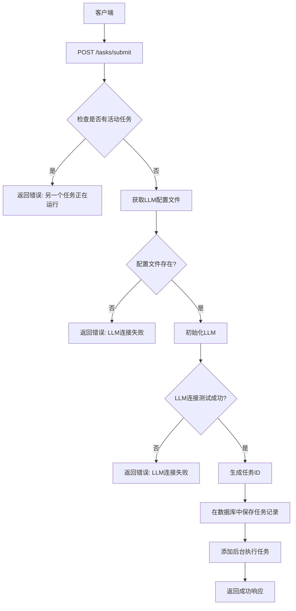
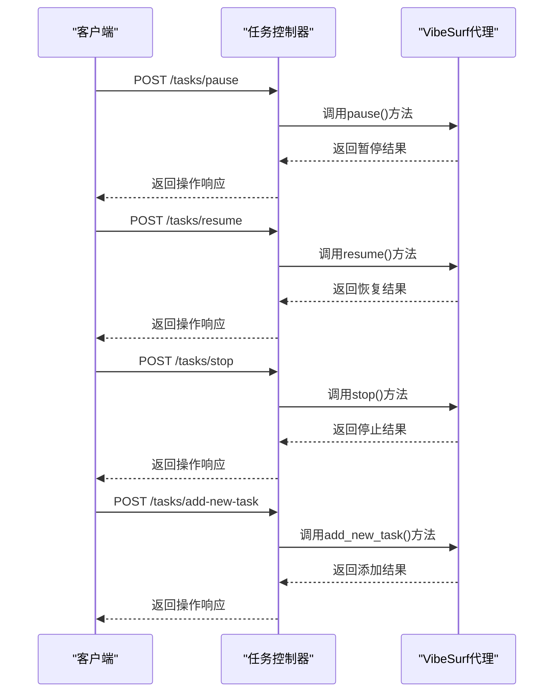
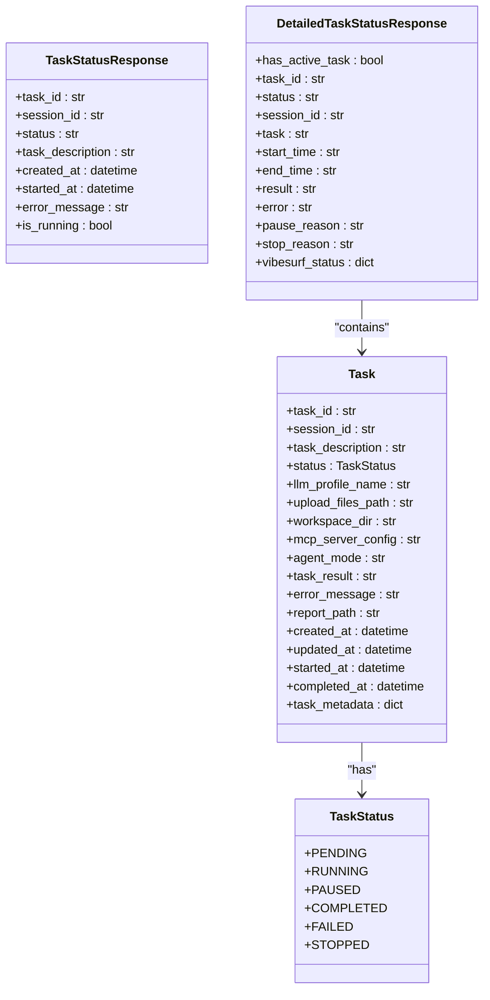
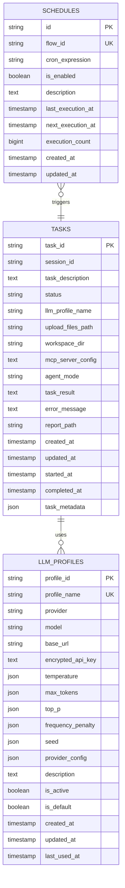
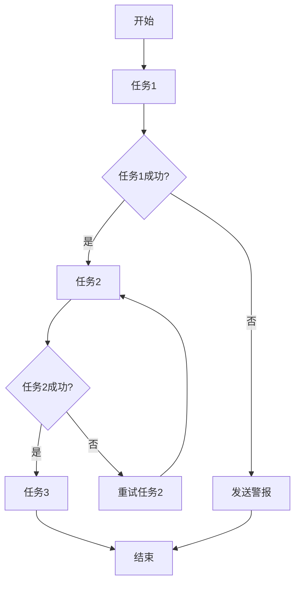

# 任务API

<cite>
**Referenced Files in This Document**   
- [task.py](file://vibe_surf/backend/api/task.py)
- [schedule.py](file://vibe_surf/backend/api/schedule.py)
- [models.py](file://vibe_surf/backend/database/models.py)
- [queries.py](file://vibe_surf/backend/database/queries.py)
- [shared_state.py](file://vibe_surf/backend/shared_state.py)
- [api/models.py](file://vibe_surf/backend/api/models.py)
</cite>

## 目录
1. [简介](#简介)
2. [任务创建与执行](#任务创建与执行)
3. [任务控制操作](#任务控制操作)
4. [任务状态查询](#任务状态查询)
5. [任务调度功能](#任务调度功能)
6. [任务结果存储与检索](#任务结果存储与检索)
7. [任务队列与优先级](#任务队列与优先级)
8. [批量任务处理](#批量任务处理)
9. [依赖关系与工作流](#依赖关系与工作流)
10. [性能优化建议](#性能优化建议)

## 简介
本API文档详细描述了VibeSurf平台的任务管理功能。该系统提供了一套完整的任务生命周期管理接口，包括任务的创建、执行、控制、查询和调度。API设计围绕单任务执行模型构建，确保任务执行的原子性和状态一致性。系统通过数据库持久化任务状态，并支持LLM配置文件、MCP服务器配置和Composio工具集成等高级功能。任务执行过程中的日志、结果和报告文件都会被妥善存储和管理。

## 任务创建与执行

### 任务创建端点
`POST /tasks/submit` 端点用于提交新任务进行执行。该操作是单任务模式，如果已有任务正在运行，则会拒绝新的提交请求。

**请求体结构 (TaskCreateRequest)**
- `session_id`: 会话标识符
- `task_description`: 任务描述
- `llm_profile_name`: 使用的LLM配置文件名称
- `upload_files_path`: 上传文件路径
- `mcp_server_config`: MCP服务器配置
- `agent_mode`: 代理模式（'thinking', 'no-thinking', 或 'flash'）

**响应格式**
成功响应包含任务ID、会话ID、状态和LLM配置文件信息。如果已有任务在运行，会返回当前活动任务的信息。



**Diagram sources**
- [task.py](file://vibe_surf/backend/api/task.py#L43-L145)

**Section sources**
- [task.py](file://vibe_surf/backend/api/task.py#L43-L145)
- [models.py](file://vibe_surf/backend/database/models.py#L94-L136)
- [api/models.py](file://vibe_surf/backend/api/models.py#L102-L110)

## 任务控制操作

### 任务控制端点
系统提供了一套完整的任务控制API，允许对正在运行的任务进行暂停、恢复、停止和添加新任务等操作。

#### 暂停任务
`POST /tasks/pause` 用于暂停当前正在执行的任务。

**请求体结构 (TaskControlRequest)**
- `reason`: 暂停原因（可选）

**响应格式**
```json
{
  "success": true,
  "message": "任务已暂停",
  "operation": "pause"
}
```

#### 恢复任务
`POST /tasks/resume` 用于恢复已暂停的任务。

**请求体结构 (TaskControlRequest)**
- `reason`: 恢复原因（可选）

**响应格式**
```json
{
  "success": true,
  "message": "任务已恢复",
  "operation": "resume"
}
```

#### 停止任务
`POST /tasks/stop` 用于停止当前正在执行的任务。

**请求体结构 (TaskControlRequest)**
- `reason`: 停止原因（可选）

**响应格式**
```json
{
  "success": true,
  "message": "任务已停止",
  "operation": "stop"
}
```

#### 添加新任务
`POST /tasks/add-new-task` 用于在任务执行过程中添加新的指令或任务。

**请求体结构 (TaskControlRequest)**
- `reason`: 新任务内容

**响应格式**
```json
{
  "success": true,
  "message": "新任务已成功添加",
  "operation": "add_new_task",
  "new_task": "新任务内容"
}
```



**Diagram sources**
- [task.py](file://vibe_surf/backend/api/task.py#L197-L332)

**Section sources**
- [task.py](file://vibe_surf/backend/api/task.py#L197-L332)
- [shared_state.py](file://vibe_surf/backend/shared_state.py#L118-L232)

## 任务状态查询

### 任务状态端点
系统提供了多个端点来查询任务的执行状态和相关信息。

#### 简要状态查询
`GET /tasks/status` 用于快速检查是否有任务正在运行。

**响应格式**
```json
{
  "has_active_task": true,
  "active_task": {
    "task_id": "string",
    "status": "string",
    "session_id": "string",
    "start_time": "string"
  }
}
```

#### 详细状态查询
`GET /tasks/detailed-status` 用于获取详细的执行状态信息，包括VibeSurf代理的内部状态。

**响应格式**
```json
{
  "has_active_task": true,
  "task_id": "string",
  "status": "string",
  "session_id": "string",
  "task": "string",
  "start_time": "string",
  "end_time": "string",
  "result": "string",
  "error": "string",
  "pause_reason": "string",
  "stop_reason": "string",
  "vibesurf_status": {
    "overall_status": "string",
    "active_step": "string",
    "agent_statuses": {},
    "progress": 0,
    "last_update": "string"
  }
}
```



**Diagram sources**
- [task.py](file://vibe_surf/backend/api/task.py#L34-L40)
- [task.py](file://vibe_surf/backend/api/task.py#L335-L378)
- [models.py](file://vibe_surf/backend/database/models.py#L17-L23)

**Section sources**
- [task.py](file://vibe_surf/backend/api/task.py#L34-L40)
- [task.py](file://vibe_surf/backend/api/task.py#L335-L378)
- [api/models.py](file://vibe_surf/backend/api/models.py#L161-L171)

## 任务调度功能

### 调度管理端点
`/schedule` 前缀的端点用于管理工作流的定时调度，支持基于cron表达式的周期性任务配置。

#### 创建调度
`POST /schedule` 用于创建新的调度。

**请求体结构 (ScheduleCreate)**
- `flow_id`: 要调度的工作流ID
- `cron_expression`: cron表达式（如 '0 9 * * 1-5'）
- `is_enabled`: 调度是否启用
- `description`: 调度描述

**响应格式 (ScheduleResponse)**
```json
{
  "id": "string",
  "flow_id": "string",
  "cron_expression": "string",
  "is_enabled": true,
  "description": "string",
  "last_execution_at": "string",
  "next_execution_at": "string",
  "execution_count": 0,
  "created_at": "string",
  "updated_at": "string"
}
```

#### 查询调度
`GET /schedule` 用于获取所有调度，`GET /schedule/{flow_id}` 用于获取特定调度。

**响应格式**
返回ScheduleResponse对象的列表或单个对象。

#### 更新调度
`PUT /schedule/{flow_id}` 用于更新现有调度。

**请求体结构 (ScheduleUpdate)**
- `cron_expression`: cron表达式
- `is_enabled`: 是否启用
- `description`: 描述

#### 删除调度
`DELETE /schedule/{flow_id}` 用于删除特定调度。

```mermaid
flowchart TD
A[客户端] --> B[POST /schedule]
B --> C[验证cron表达式]
C --> D{表达式有效?}
D --> |否| E[返回错误: cron表达式格式无效]
D --> |是| F[检查是否已存在调度]
F --> |是| G[返回错误: 调度已存在]
F --> |否| H[创建调度记录]
H --> I[提交事务]
I --> J[重新加载调度管理器]
J --> K[返回成功响应]
L[客户端] --> M[GET /schedule]
M --> N[从数据库获取所有调度]
N --> O[返回调度列表]
P[客户端] --> Q[PUT /schedule/{flow_id}]
Q --> R[验证cron表达式]
R --> S{表达式有效?}
S --> |否| T[返回错误: cron表达式格式无效]
S --> |是| U[准备更新数据]
U --> V[更新调度记录]
V --> W[提交事务]
W --> X[重新加载调度管理器]
X --> Y[返回成功响应]
Z[客户端] --> AA[DELETE /schedule/{flow_id}]
AA --> AB[检查调度是否存在]
AB --> AC{存在?}
AC --> |否| AD[返回错误: 调度未找到]
AC --> |是| AE[删除调度记录]
AE --> AF[提交事务]
AF --> AG[重新加载调度管理器]
AG --> AH[返回成功响应]
```

**Diagram sources**
- [schedule.py](file://vibe_surf/backend/api/schedule.py#L108-L288)

**Section sources**
- [schedule.py](file://vibe_surf/backend/api/schedule.py#L108-L288)
- [models.py](file://vibe_surf/backend/database/models.py#L258-L283)
- [shared_state.py](file://vibe_surf/backend/shared_state.py#L740-L1081)

## 任务结果存储与检索

### 任务结果管理
系统通过数据库和文件系统相结合的方式存储和管理任务执行结果。

#### 数据库存储
任务的核心信息存储在`tasks`表中，包括：
- 任务ID、会话ID和描述
- 执行状态和时间戳
- LLM配置文件引用
- 错误信息和最终结果
- 报告文件路径

#### 文件存储
任务执行过程中生成的文件（如HTML报告）存储在工作区目录中，结构如下：
```
workspace_dir/
├── session_id_1/
│   ├── reports/
│   │   └── report_1.html
│   └── uploads/
├── session_id_2/
│   ├── reports/
│   │   └── report_2.html
│   └── uploads/
```

#### 结果检索
通过`GET /tasks/detailed-status`端点可以获取任务的最终结果和报告路径。系统会自动在完成任务时查找生成的报告文件并更新数据库记录。



**Diagram sources**
- [models.py](file://vibe_surf/backend/database/models.py#L94-L136)
- [models.py](file://vibe_surf/backend/database/models.py#L258-L283)
- [models.py](file://vibe_surf/backend/database/models.py#L57-L92)

**Section sources**
- [models.py](file://vibe_surf/backend/database/models.py#L94-L136)
- [queries.py](file://vibe_surf/backend/database/queries.py#L444-L735)
- [shared_state.py](file://vibe_surf/backend/shared_state.py#L118-L232)

## 任务队列与优先级

### 任务队列机制
系统采用单任务执行模型，通过全局状态变量管理任务队列。当一个任务正在执行时，任何新的任务提交请求都会被拒绝。

#### 队列状态管理
通过`shared_state.py`中的全局变量管理任务状态：
- `active_task`: 当前活动任务的详细信息
- `is_task_running()`: 检查是否有任务正在运行
- `get_active_task_info()`: 获取当前任务信息
- `clear_active_task()`: 清除活动任务状态

#### 优先级设置
系统通过任务提交的顺序隐式实现优先级。由于是单任务模型，任务按提交顺序执行，先提交的任务优先执行。

```mermaid
flowchart LR
A[任务提交] --> B{is_task_running()?}
B --> |是| C[返回错误: 另一个任务正在运行]
B --> |否| D[设置active_task]
D --> E[执行任务]
E --> F{任务完成?}
F --> |是| G[更新任务状态为completed]
F --> |否| H{任务失败?}
H --> |是| I[更新任务状态为failed]
H --> |否| J{任务被停止?}
J --> |是| K[更新任务状态为stopped]
J --> |否| L[继续执行]
G --> M[clear_active_task()]
I --> M
K --> M
M --> N[任务执行结束]
```

**Diagram sources**
- [shared_state.py](file://vibe_surf/backend/shared_state.py#L59-L253)
- [task.py](file://vibe_surf/backend/api/task.py#L43-L145)

**Section sources**
- [shared_state.py](file://vibe_surf/backend/shared_state.py#L59-L253)
- [task.py](file://vibe_surf/backend/api/task.py#L43-L145)

## 批量任务处理

### 批量处理模式
虽然系统核心是单任务模型，但可以通过外部脚本或客户端实现批量任务处理。

#### 批量处理策略
1. **串行处理**: 按顺序提交任务，等待每个任务完成后提交下一个
2. **并行会话**: 使用不同的会话ID在多个会话中并行执行任务
3. **调度驱动**: 使用调度功能定期执行批量任务

#### 使用示例
```python
import asyncio
import httpx

async def process_batch_tasks(tasks, base_url="http://localhost:9335"):
    results = []
    async with httpx.AsyncClient() as client:
        for task in tasks:
            # 等待当前任务完成
            while True:
                status_response = await client.get(f"{base_url}/tasks/status")
                if not status_response.json()["has_active_task"]:
                    break
                await asyncio.sleep(1)
            
            # 提交新任务
            submit_response = await client.post(
                f"{base_url}/tasks/submit",
                json={
                    "session_id": task["session_id"],
                    "task_description": task["description"],
                    "llm_profile_name": task["llm_profile"]
                }
            )
            results.append(submit_response.json())
    
    return results
```

**Section sources**
- [task.py](file://vibe_surf/backend/api/task.py#L34-L40)
- [shared_state.py](file://vibe_surf/backend/shared_state.py#L235-L246)

## 依赖关系与工作流

### 依赖关系管理
系统通过调度功能和任务控制API实现工作流编排。

#### 工作流编排
1. **顺序工作流**: 通过串行任务提交实现
2. **条件工作流**: 根据任务结果决定后续操作
3. **周期性工作流**: 通过cron调度实现

#### 依赖配置
依赖关系主要通过调度配置实现：
- `flow_id`: 标识工作流
- `cron_expression`: 定义执行时间表
- `is_enabled`: 控制工作流是否激活



**Diagram sources**
- [schedule.py](file://vibe_surf/backend/api/schedule.py#L77-L288)
- [shared_state.py](file://vibe_surf/backend/shared_state.py#L740-L1081)

**Section sources**
- [schedule.py](file://vibe_surf/backend/api/schedule.py#L77-L288)
- [shared_state.py](file://vibe_surf/backend/shared_state.py#L740-L1081)

## 性能优化建议

### 性能优化策略
1. **连接池配置**: 对于生产环境的PostgreSQL/MySQL数据库，配置适当的连接池大小
2. **索引优化**: 确保关键字段有适当的数据库索引
3. **批量操作**: 尽可能使用批量查询和更新操作
4. **缓存策略**: 对频繁访问的静态数据使用缓存

### 数据库索引
系统已为关键字段创建了索引以提高查询性能：
- `idx_tasks_status`: 任务状态索引
- `idx_tasks_session`: 会话ID索引
- `idx_tasks_llm_profile`: LLM配置文件索引
- `idx_tasks_created`: 创建时间索引
- `idx_schedules_flow_id`: 调度工作流ID索引
- `idx_schedules_enabled`: 调度启用状态索引

### 最佳实践
1. **合理使用调度**: 避免过于频繁的调度，最小间隔建议30秒以上
2. **会话管理**: 为不同类型的任务使用不同的会话ID以便于管理
3. **错误处理**: 实现健壮的错误处理和重试机制
4. **资源监控**: 监控系统资源使用情况，及时发现性能瓶颈

**Section sources**
- [manager.py](file://vibe_surf/backend/database/manager.py#L163-L184)
- [models.py](file://vibe_surf/backend/database/models.py#L157-L289)