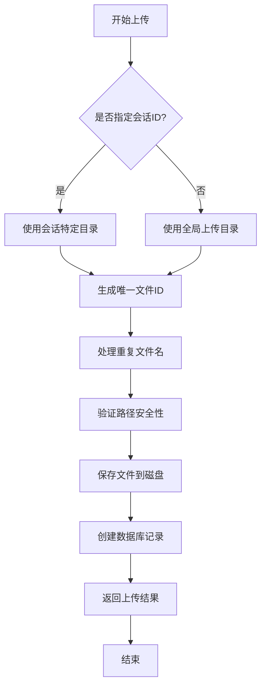
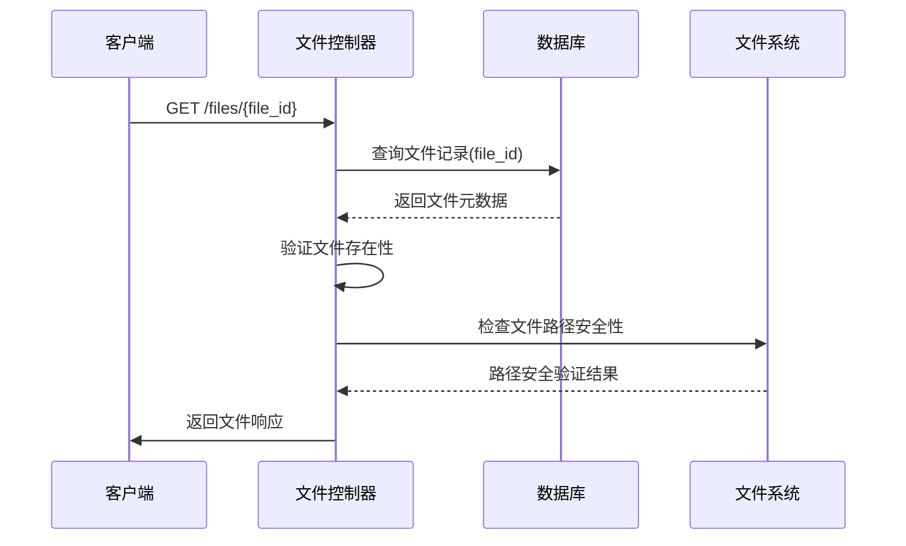
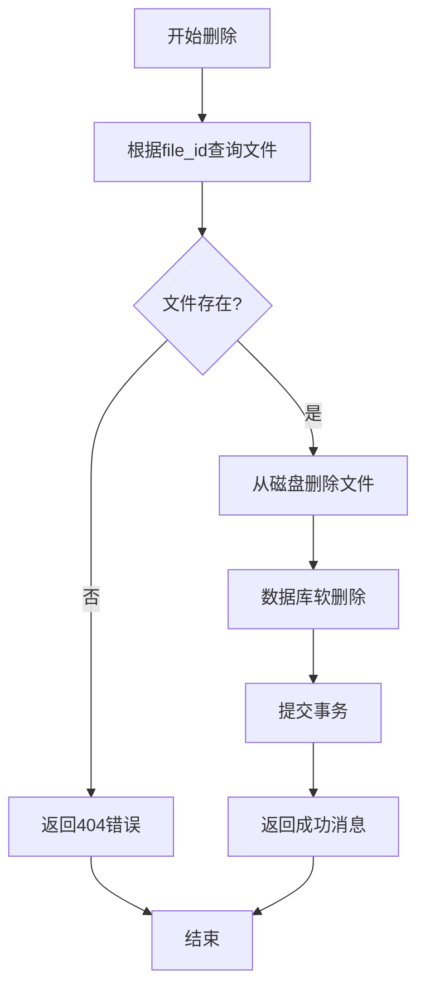
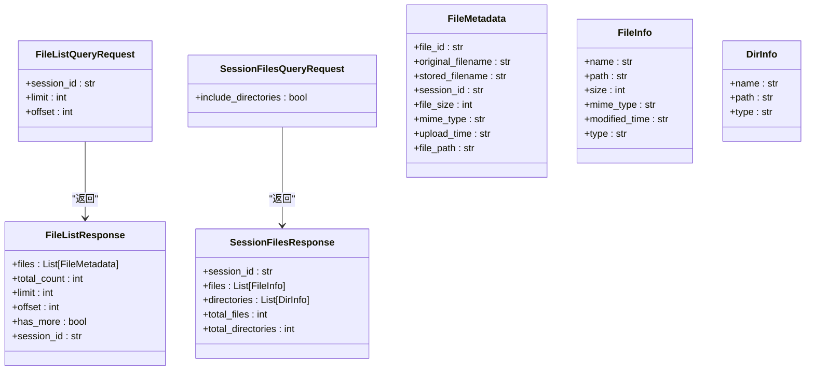
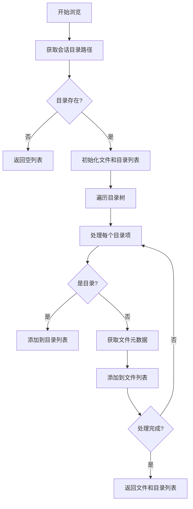
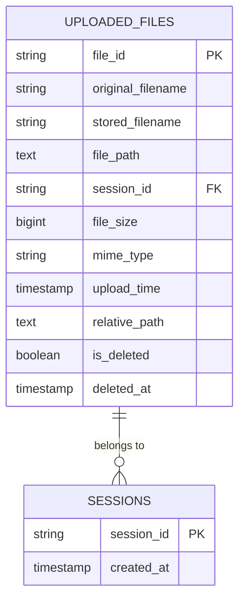
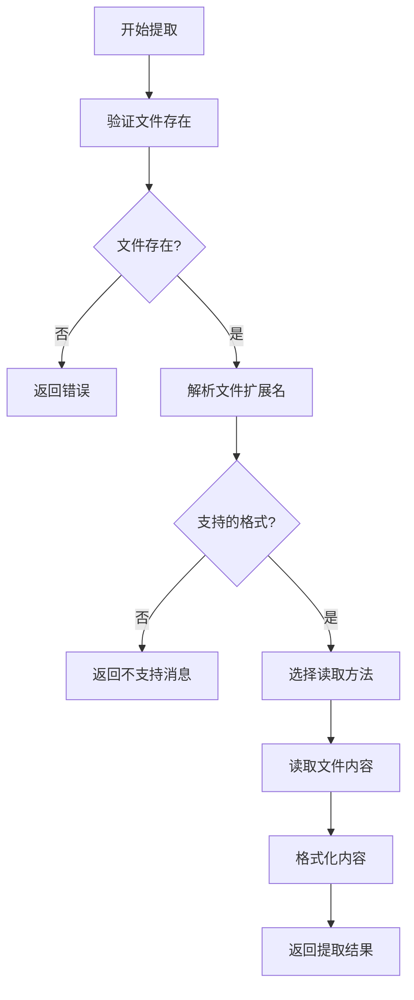
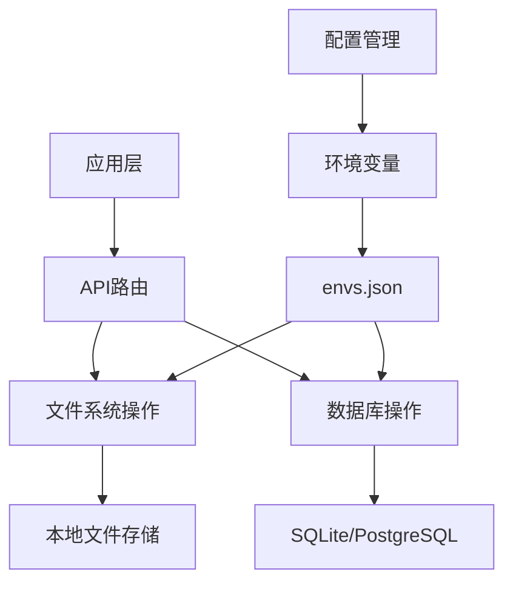
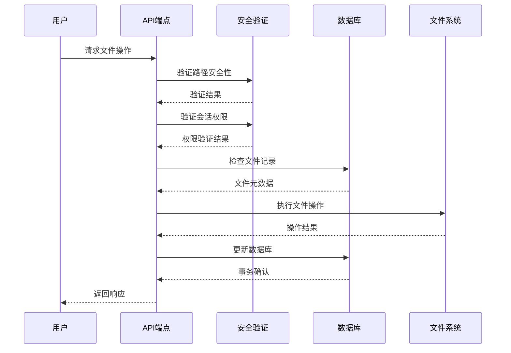

# 文件API

<cite>
**本文档引用的文件**   
- [files.py](file://vibe_surf/backend/api/files.py)
- [models.py](file://vibe_surf/backend/api/models.py)
- [queries.py](file://vibe_surf/backend/database/queries.py)
- [models.py](file://vibe_surf/backend/database/models.py)
- [shared_state.py](file://vibe_surf/backend/shared_state.py)
- [file_system.py](file://vibe_surf/tools/file_system.py)
- [use-post-upload-file.ts](file://vibe_surf/frontend/src/controllers/API/queries/file-management/use-post-upload-file.ts)
- [use-delete-file.ts](file://vibe_surf/frontend/src/controllers/API/queries/file-management/use-delete-file.ts)
- [use-duplicate-file.ts](file://vibe_surf/frontend/src/controllers/API/queries/file-management/use-duplicate-file.ts)
- [use-get-download-files.ts](file://vibe_surf/frontend/src/controllers/API/queries/file-management/use-get-download-files.ts)
- [use-post-folders.ts](file://vibe_surf/frontend/src/controllers/API/queries/folders/use-post-folders.ts)
- [use-delete-folders.ts](file://vibe_surf/frontend/src/controllers/API/queries/folders/use-delete-folders.ts)
</cite>

## 目录
1. [简介](#简介)
2. [文件上传端点](#文件上传端点)
3. [文件下载端点](#文件下载端点)
4. [文件删除端点](#文件删除端点)
5. [文件查询端点](#文件查询端点)
6. [文件夹结构管理](#文件夹结构管理)
7. [文件元数据管理](#文件元数据管理)
8. [文件内容提取和预览](#文件内容提取和预览)
9. [大文件分块上传和断点续传](#大文件分块上传和断点续传)
10. [文件存储后端配置](#文件存储后端配置)
11. [文件权限管理和共享机制](#文件权限管理和共享机制)

## 简介
文件API为VibeSurf系统提供全面的文件管理功能，支持文件上传、下载、删除和查询等核心操作。该API允许用户将文件上传到工作区目录或特定会话目录，通过文件ID下载文件，删除指定文件，并列出已上传的文件。系统通过数据库记录文件元数据，包括文件ID、原始文件名、存储文件名、会话ID、文件大小、MIME类型和上传时间。文件存储遵循安全路径验证机制，确保文件操作在指定目录范围内进行。

**Section sources**
- [files.py](file://vibe_surf/backend/api/files.py#L1-L332)
- [models.py](file://vibe_surf/backend/api/models.py#L218-L231)

## 文件上传端点
文件上传端点允许用户将文件上传到工作区的upload_files文件夹或特定会话的文件夹中。该功能通过POST请求实现，支持单个或多个文件上传，并可选择性地与特定会话关联。

### 请求参数
- **files**: 要上传的文件列表（表单数据）
- **session_id**: 可选参数，用于指定文件关联的会话ID（表单数据）
- **db**: 数据库会话依赖项

### 响应格式
成功上传后，API返回包含以下信息的JSON响应：
- **message**: 操作结果消息
- **files**: 上传文件的元数据列表
- **upload_directory**: 文件上传的目标目录

每个文件的元数据包括：
- **file_id**: 文件的唯一标识符
- **original_filename**: 原始文件名
- **stored_filename**: 存储文件名
- **session_id**: 关联的会话ID
- **file_size**: 文件大小（字节）
- **mime_type**: MIME类型
- **upload_time**: 上传时间戳
- **file_path**: 文件系统路径

### 上传流程
1. 系统根据是否存在session_id确定上传目录
2. 为每个文件生成唯一的file_id
3. 处理重复文件名，通过添加数字后缀避免覆盖
4. 验证文件路径安全性，防止路径遍历攻击
5. 将文件保存到磁盘
6. 在数据库中创建文件记录
7. 返回上传结果



**Diagram sources **
- [files.py](file://vibe_surf/backend/api/files.py#L57-L149)

**Section sources**
- [files.py](file://vibe_surf/backend/api/files.py#L57-L149)
- [use-post-upload-file.ts](file://vibe_surf/frontend/src/controllers/API/queries/file-management/use-post-upload-file.ts#L1-L35)

## 文件下载端点
文件下载端点允许用户通过文件ID下载已上传的文件。该功能通过GET请求实现，系统根据文件ID从数据库中检索文件记录，并返回文件内容。

### 请求参数
- **file_id**: 要下载的文件的唯一标识符（路径参数）
- **db**: 数据库会话依赖项

### 响应处理
系统执行以下步骤来处理下载请求：
1. 根据file_id查询数据库获取文件记录
2. 验证文件是否存在
3. 检查文件在磁盘上的物理存在
4. 验证文件路径的安全性
5. 返回文件响应，包含原始文件名和MIME类型



**Diagram sources **
- [files.py](file://vibe_surf/backend/api/files.py#L156-L178)

**Section sources**
- [files.py](file://vibe_surf/backend/api/files.py#L156-L178)
- [use-get-download-files.ts](file://vibe_surf/frontend/src/controllers/API/queries/file-management/use-get-download-files.ts#L1-L46)

## 文件删除端点
文件删除端点允许用户通过文件ID删除已上传的文件。该功能通过DELETE请求实现，执行软删除操作，既从文件系统中移除文件，也在数据库中标记为已删除。

### 请求参数
- **file_id**: 要删除的文件的唯一标识符（路径参数）
- **db**: 数据库会话依赖项

### 删除流程
1. 根据file_id查询数据库获取文件记录
2. 验证文件是否存在
3. 从磁盘删除物理文件
4. 在数据库中执行软删除操作
5. 提交数据库事务
6. 返回删除结果



**Diagram sources **
- [files.py](file://vibe_surf/backend/api/files.py#L232-L255)

**Section sources**
- [files.py](file://vibe_surf/backend/api/files.py#L232-L255)
- [use-delete-file.ts](file://vibe_surf/frontend/src/controllers/API/queries/file-management/use-delete-file.ts#L1-L40)

## 文件查询端点
文件查询端点提供多种方式来检索已上传的文件信息，包括列出所有上传文件和列出特定会话的文件。

### 列出上传文件
通过GET请求`/files`端点，可以获取已上传文件的列表。

#### 请求参数
- **session_id**: 可选，用于过滤特定会话的文件
- **limit**: 可选，限制返回的文件数量（-1表示不限制）
- **offset**: 可选，跳过的文件数量

#### 响应格式
返回包含以下字段的JSON对象：
- **files**: 文件元数据列表
- **total_count**: 总文件数量
- **limit**: 请求的限制数量
- **offset**: 请求的偏移量
- **has_more**: 是否有更多文件
- **session_id**: 过滤的会话ID

### 列出会话文件
通过GET请求`/files/session/{session_id}`端点，可以获取特定会话目录中的所有文件和文件夹。

#### 请求参数
- **session_id**: 会话ID（路径参数）
- **include_directories**: 查询参数，是否包含目录信息

#### 响应格式
返回包含以下字段的JSON对象：
- **session_id**: 会话ID
- **files**: 文件列表
- **directories**: 目录列表（如果请求包含）
- **total_files**: 文件总数
- **total_directories**: 目录总数



**Diagram sources **
- [files.py](file://vibe_surf/backend/api/files.py#L181-L225)
- [files.py](file://vibe_surf/backend/api/files.py#L264-L332)
- [models.py](file://vibe_surf/backend/api/models.py#L222-L231)

**Section sources**
- [files.py](file://vibe_surf/backend/api/files.py#L181-L225)
- [files.py](file://vibe_surf/backend/api/files.py#L264-L332)
- [models.py](file://vibe_surf/backend/api/models.py#L222-L231)

## 文件夹结构管理
系统提供完整的文件夹结构管理功能，允许用户创建、删除和浏览目录结构。

### 创建文件夹
通过POST请求`/folders`端点创建新文件夹。前端使用`usePostFolders`钩子处理创建操作，发送包含文件夹名称、描述和关联项目列表的请求体。

### 删除文件夹
通过DELETE请求删除指定文件夹。前端使用`useDeleteFolders`钩子处理删除操作，发送文件夹ID作为参数。

### 浏览文件夹
系统支持递归遍历会话目录，返回文件和子目录的完整结构。`list_session_files`函数使用`os.walk`遍历目录树，收集所有文件和目录信息。



**Diagram sources **
- [use-post-folders.ts](file://vibe_surf/frontend/src/controllers/API/queries/folders/use-post-folders.ts#L1-L37)
- [use-delete-folders.ts](file://vibe_surf/frontend/src/controllers/API/queries/folders/use-delete-folders.ts#L1-L40)
- [files.py](file://vibe_surf/backend/api/files.py#L264-L332)

**Section sources**
- [use-post-folders.ts](file://vibe_surf/frontend/src/controllers/API/queries/folders/use-post-folders.ts#L1-L37)
- [use-delete-folders.ts](file://vibe_surf/frontend/src/controllers/API/queries/folders/use-delete-folders.ts#L1-L40)
- [files.py](file://vibe_surf/backend/api/files.py#L264-L332)

## 文件元数据管理
系统通过数据库表`uploaded_files`管理文件元数据，提供标签、分类和自定义属性的设置功能。

### 元数据字段
- **file_id**: 文件唯一标识符（UUID7字符串）
- **original_filename**: 原始文件名
- **stored_filename**: 存储文件名
- **file_path**: 文件系统路径
- **session_id**: 关联的会话ID
- **file_size**: 文件大小（字节）
- **mime_type**: MIME类型
- **upload_time**: 上传时间
- **relative_path**: 相对于工作区目录的路径
- **is_deleted**: 软删除标志
- **deleted_at**: 删除时间

### 元数据操作
系统提供以下元数据管理功能：
- **创建**: 上传文件时自动创建元数据记录
- **查询**: 通过文件ID或会话ID检索元数据
- **更新**: 修改文件关联信息
- **删除**: 软删除标记



**Diagram sources **
- [models.py](file://vibe_surf/backend/database/models.py#L138-L156)
- [queries.py](file://vibe_surf/backend/database/queries.py#L1085-L1120)

**Section sources**
- [models.py](file://vibe_surf/backend/database/models.py#L138-L156)
- [queries.py](file://vibe_surf/backend/database/queries.py#L1085-L1120)

## 文件内容提取和预览
系统提供文件内容提取和预览功能，支持多种文件格式的内容读取和显示。

### 支持的文件格式
- Markdown (.md)
- 文本 (.txt)
- JSON (.json)
- CSV (.csv)
- PDF (.pdf)
- Python (.py)
- HTML (.html)
- JavaScript (.js)

### 内容提取流程
1. 验证文件是否存在
2. 根据文件扩展名选择适当的读取方法
3. 读取文件内容
4. 格式化内容以供显示

### 预览功能
前端组件`file-preview.tsx`提供文件预览功能，支持：
- 图像文件的缩略图显示
- 文本文件的内容预览
- 文件类型图标显示
- 加载状态指示



**Diagram sources **
- [file_system.py](file://vibe_surf/tools/file_system.py#L89-L124)
- [file-preview.tsx](file://vibe_surf/frontend/src/modals/IOModal/components/chatView/fileComponent/components/file-preview.tsx#L1-L39)

**Section sources**
- [file_system.py](file://vibe_surf/tools/file_system.py#L89-L124)
- [file-preview.tsx](file://vibe_surf/frontend/src/modals/IOModal/components/chatView/fileComponent/components/file-preview.tsx#L1-L39)

## 大文件分块上传和断点续传
虽然当前API实现主要支持常规文件上传，但系统架构为大文件分块上传和断点续传提供了基础支持。

### 分块上传设计考虑
- **前端支持**: 前端可以使用`FormData`对象分块发送文件数据
- **后端扩展**: 当前上传端点可以扩展以支持分块上传
- **状态跟踪**: 系统可以通过文件ID跟踪上传进度
- **恢复机制**: 服务器可以检查已接收的块并继续上传

### 使用示例
```javascript
// 前端分块上传示例
async function uploadInChunks(file, chunkSize = 1024 * 1024) {
  const totalChunks = Math.ceil(file.size / chunkSize);
  const fileId = generateFileId(); // 生成唯一文件ID
  
  for (let i = 0; i < totalChunks; i++) {
    const start = i * chunkSize;
    const end = Math.min(start + chunkSize, file.size);
    const chunk = file.slice(start, end);
    
    const formData = new FormData();
    formData.append('file', chunk);
    formData.append('file_id', fileId);
    formData.append('chunk_index', i);
    formData.append('total_chunks', totalChunks);
    
    await api.post('/files/upload-chunk', formData);
  }
}
```

**Section sources**
- [use-post-upload-file.ts](file://vibe_surf/frontend/src/controllers/API/queries/file-management/use-post-upload-file.ts#L1-L35)
- [files.py](file://vibe_surf/backend/api/files.py#L57-L149)

## 文件存储后端配置
系统采用混合存储策略，结合本地文件系统和数据库存储，确保文件数据的可靠性和可访问性。

### 存储架构
- **文件存储**: 使用本地文件系统存储实际文件内容
- **元数据存储**: 使用SQLite/PostgreSQL数据库存储文件元数据
- **工作区目录**: 由`workspace_dir`全局变量定义的根目录
- **会话隔离**: 每个会话有独立的文件夹结构

### 配置选项
- **workspace_dir**: 工作区根目录路径
- **database_url**: 数据库连接URL
- **BROWSER_EXECUTION_PATH**: 浏览器执行路径
- **BROWSER_USER_DATA**: 浏览器用户数据目录

### 跨平台兼容性
系统通过以下方式确保跨平台兼容性：
- 使用`os.path`和`pathlib`处理文件路径
- 统一使用正斜杠作为路径分隔符
- 处理Windows驱动器字母
- 支持URL编码的文件路径



**Diagram sources **
- [shared_state.py](file://vibe_surf/backend/shared_state.py#L47-L54)
- [shared_state.py](file://vibe_surf/backend/shared_state.py#L514-L533)

**Section sources**
- [shared_state.py](file://vibe_surf/backend/shared_state.py#L47-L54)
- [shared_state.py](file://vibe_surf/backend/shared_state.py#L514-L533)

## 文件权限管理和共享机制
系统实现多层次的文件权限管理和共享机制，确保数据安全和协作效率。

### 权限控制
- **路径安全验证**: 使用`is_safe_path`函数防止路径遍历攻击
- **会话隔离**: 文件与特定会话关联，限制跨会话访问
- **软删除**: 使用`is_deleted`标志实现文件软删除，保留元数据
- **访问控制**: 下载和删除操作需要验证文件所有权

### 共享机制
- **会话内共享**: 同一会话中的文件自动共享
- **文件复制**: 提供文件复制功能，支持跨会话共享
- **链接共享**: 通过文件ID生成可共享的下载链接

### 安全措施
- **输入验证**: 验证所有文件路径和参数
- **错误处理**: 详细的错误日志记录
- **事务管理**: 数据库操作使用事务确保一致性
- **日志记录**: 记录所有文件操作，便于审计



**Diagram sources **
- [files.py](file://vibe_surf/backend/api/files.py#L44-L54)
- [files.py](file://vibe_surf/backend/api/files.py#L90-L92)
- [files.py](file://vibe_surf/backend/api/files.py#L170-L172)

**Section sources**
- [files.py](file://vibe_surf/backend/api/files.py#L44-L54)
- [files.py](file://vibe_surf/backend/api/files.py#L90-L92)
- [files.py](file://vibe_surf/backend/api/files.py#L170-L172)