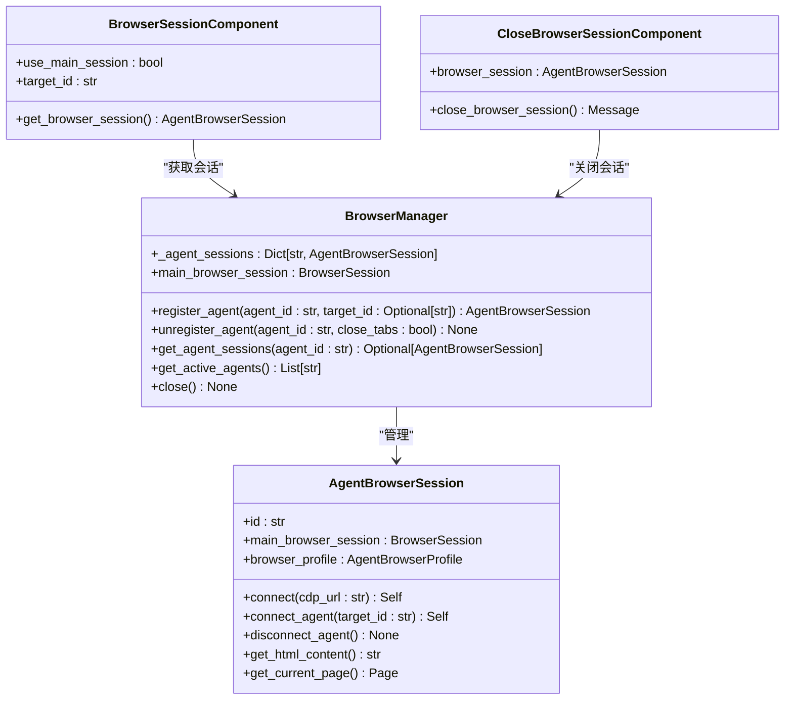
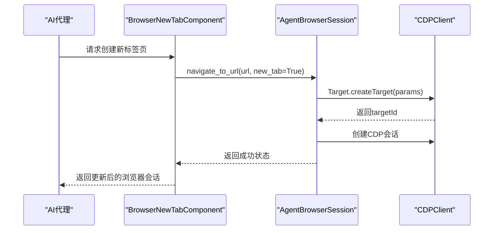
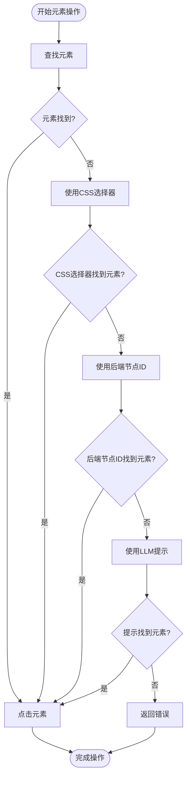
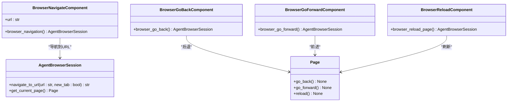
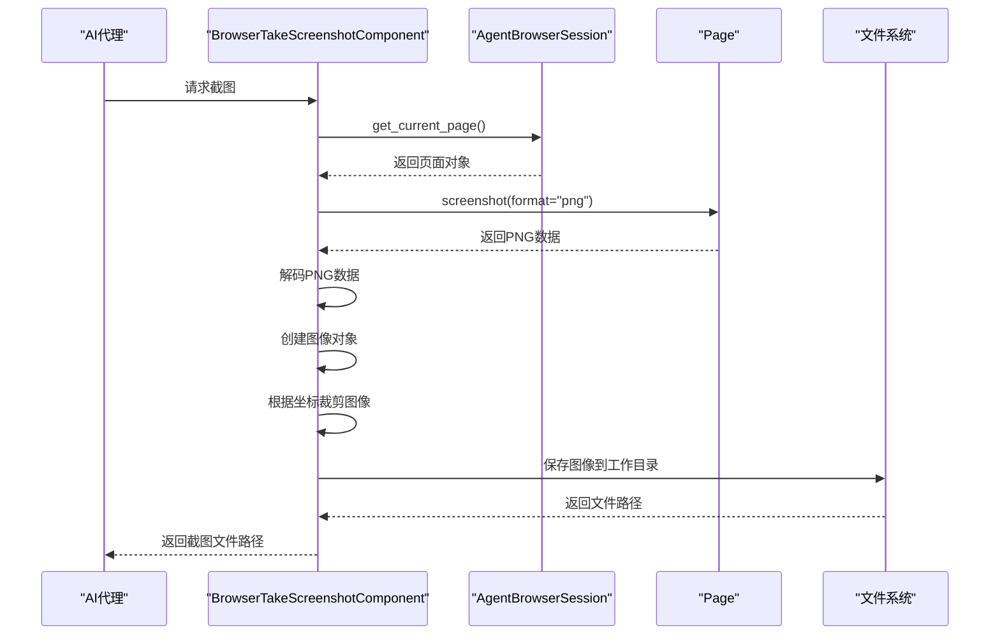
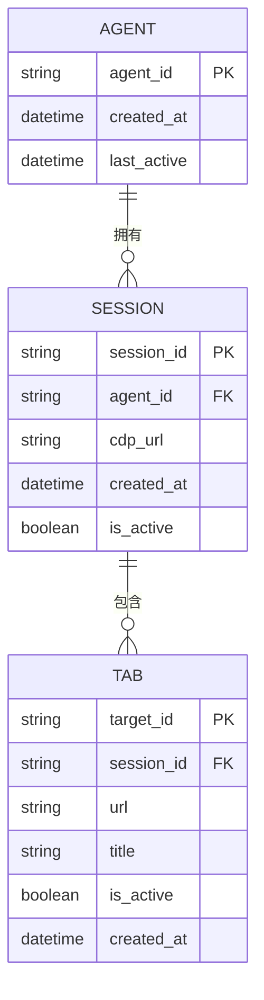

# 浏览器API

<cite>
**本文档中引用的文件**   
- [browser.py](file://vibe_surf/backend/api/browser.py)
- [browser_manager.py](file://vibe_surf/browser/browser_manager.py)
- [agent_browser_session.py](file://vibe_surf/browser/agent_browser_session.py)
- [browser_session.py](file://vibe_surf/workflows/Browser/browser_session.py)
- [close_browser_session.py](file://vibe_surf/workflows/Browser/close_browser_session.py)
- [browser_new_tab.py](file://vibe_surf/workflows/Browser/browser_new_tab.py)
- [browser_navigate.py](file://vibe_surf/workflows/Browser/browser_navigate.py)
- [browser_take_screenshot.py](file://vibe_surf/workflows/Browser/browser_take_screenshot.py)
- [browser_html_content.py](file://vibe_surf/workflows/Browser/browser_html_content.py)
- [browser_input_text.py](file://vibe_surf/workflows/Browser/browser_input_text.py)
- [browser_click_element.py](file://vibe_surf/workflows/Browser/browser_click_element.py)
- [browser_go_back.py](file://vibe_surf/workflows/Browser/browser_go_back.py)
- [browser_go_forward.py](file://vibe_surf/workflows/Browser/browser_go_forward.py)
- [browser_reload.py](file://vibe_surf/workflows/Browser/browser_reload.py)
- [find_page_element.py](file://vibe_surf/browser/find_page_element.py)
</cite>

## 目录
1. [简介](#简介)
2. [浏览器会话管理](#浏览器会话管理)
3. [标签页管理](#标签页管理)
4. [DOM元素操作](#dom元素操作)
5. [浏览器导航功能](#浏览器导航功能)
6. [截图与内容提取](#截图与内容提取)
7. [会话持久化与状态管理](#会话持久化与状态管理)

## 简介
本参考文档详细说明了VibeSurf浏览器自动化系统的API接口。该系统提供了一套完整的浏览器控制功能，包括会话管理、标签页操作、DOM元素交互、页面导航、内容提取和状态管理。API设计旨在为AI代理提供可靠的浏览器自动化能力，支持复杂的网页交互任务。

## 浏览器会话管理
浏览器会话管理API提供了创建、销毁和查询浏览器实例的功能。系统通过`BrowserManager`类管理多个代理的隔离会话，确保每个代理拥有独立的浏览器环境。

**Diagram sources**
- [browser_manager.py](file://vibe_surf/browser/browser_manager.py#L24-L186)
- [agent_browser_session.py](file://vibe_surf/browser/agent_browser_session.py#L51-L170)
- [browser_session.py](file://vibe_surf/workflows/Browser/browser_session.py#L11-L55)
- [close_browser_session.py](file://vibe_surf/workflows/Browser/close_browser_session.py#L11-L51)

### 创建浏览器会话
通过`BrowserSessionComponent`创建浏览器会话。可以指定使用主会话或为代理创建独立会话。

**Section sources**
- [browser_session.py](file://vibe_surf/workflows/Browser/browser_session.py#L42-L55)

### 销毁浏览器会话
通过`CloseBrowserSessionComponent`销毁浏览器会话。系统会清理代理的所有资源并关闭相关标签页。

**Section sources**
- [close_browser_session.py](file://vibe_surf/workflows/Browser/close_browser_session.py#L35-L51)

### 查询浏览器实例
通过API端点查询浏览器实例状态，包括活动标签页和所有标签页信息。

**Section sources**
- [browser.py](file://vibe_surf/backend/api/browser.py#L18-L71)

## 标签页管理
标签页管理API提供了新建、切换和关闭标签页的功能，使代理能够管理多个网页上下文。

**Diagram sources**
- [browser_new_tab.py](file://vibe_surf/workflows/Browser/browser_new_tab.py#L40-L50)
- [agent_browser_session.py](file://vibe_surf/browser/agent_browser_session.py#L231-L235)

### 新建标签页
通过`BrowserNewTabComponent`创建新标签页。可以指定新标签页的URL，或使用默认的chrome://newtab/页面。

**Section sources**
- [browser_new_tab.py](file://vibe_surf/workflows/Browser/browser_new_tab.py#L40-L50)

### 切换标签页
系统通过`BrowserManager`的`assign_target_to_agent`方法实现标签页切换，将代理的焦点切换到指定的目标标签页。

**Section sources**
- [browser_manager.py](file://vibe_surf/browser/browser_manager.py#L74-L107)

### 关闭标签页
通过`unassign_target`方法关闭标签页，系统会断开与目标标签页的CDP连接并清理相关资源。

**Section sources**
- [browser_manager.py](file://vibe_surf/browser/browser_manager.py#L108-L121)

## DOM元素操作
DOM元素操作API提供了查找、点击和输入文本等操作，使代理能够与网页元素进行交互。

**Diagram sources**
- [browser_click_element.py](file://vibe_surf/workflows/Browser/browser_click_element.py#L90-L196)
- [browser_input_text.py](file://vibe_surf/workflows/Browser/browser_input_text.py#L85-L170)

### 元素查找
系统通过多种方式查找DOM元素，包括语义映射、CSS选择器、后端节点ID和LLM提示。`SemanticExtractor`类负责从页面中提取交互元素的语义映射。

**Section sources**
- [find_page_element.py](file://vibe_surf/browser/find_page_element.py#L18-L800)
- [browser_click_element.py](file://vibe_surf/workflows/Browser/browser_click_element.py#L90-L196)

### 点击元素
通过`BrowserClickElementComponent`点击网页元素。系统会尝试多种查找方法确保找到正确的元素。

**Section sources**
- [browser_click_element.py](file://vibe_surf/workflows/Browser/browser_click_element.py#L90-L196)

### 输入文本
通过`BrowserInputTextComponent`向网页元素输入文本。可以指定是否在输入前清除现有文本。

**Section sources**
- [browser_input_text.py](file://vibe_surf/workflows/Browser/browser_input_text.py#L85-L170)

## 浏览器导航功能
浏览器导航API提供了页面跳转、后退、前进和刷新功能，使代理能够控制浏览器的导航行为。

**Diagram sources**
- [browser_navigate.py](file://vibe_surf/workflows/Browser/browser_navigate.py#L41-L51)
- [browser_go_back.py](file://vibe_surf/workflows/Browser/browser_go_back.py#L36-L46)
- [browser_go_forward.py](file://vibe_surf/workflows/Browser/browser_go_forward.py#L35-L44)
- [browser_reload.py](file://vibe_surf/workflows/Browser/browser_reload.py#L35-L45)

### 页面跳转
通过`BrowserNavigateComponent`导航到指定URL。系统会等待页面加载完成。

**Section sources**
- [browser_navigate.py](file://vibe_surf/workflows/Browser/browser_navigate.py#L41-L51)

### 后退与前进
通过`BrowserGoBackComponent`和`BrowserGoForwardComponent`实现浏览器的后退和前进功能。

**Section sources**
- [browser_go_back.py](file://vibe_surf/workflows/Browser/browser_go_back.py#L36-L46)
- [browser_go_forward.py](file://vibe_surf/workflows/Browser/browser_go_forward.py#L35-L44)

### 刷新页面
通过`BrowserReloadComponent`刷新当前页面。

**Section sources**
- [browser_reload.py](file://vibe_surf/workflows/Browser/browser_reload.py#L35-L45)

## 截图与内容提取
系统提供了截图和HTML内容提取功能，使代理能够捕获和保存网页状态。

**Diagram sources**
- [browser_take_screenshot.py](file://vibe_surf/workflows/Browser/browser_take_screenshot.py#L77-L118)
- [browser_html_content.py](file://vibe_surf/workflows/Browser/browser_html_content.py#L47-L64)

### 截图功能
通过`BrowserTakeScreenshotComponent`捕获当前页面的截图。支持指定裁剪区域，截图将保存到工作目录的screenshots子目录中。

**Section sources**
- [browser_take_screenshot.py](file://vibe_surf/workflows/Browser/browser_take_screenshot.py#L77-L118)

### HTML内容提取
通过`BrowserHtmlContentComponent`提取当前页面的HTML内容。提取的HTML将保存到工作目录的htmls子目录中。

**Section sources**
- [browser_html_content.py](file://vibe_surf/workflows/Browser/browser_html_content.py#L47-L64)

### 页面内容提取
通过`AgentBrowserSession`的`get_html_content`方法直接获取页面HTML内容，可用于实时分析。

**Section sources**
- [agent_browser_session.py](file://vibe_surf/browser/agent_browser_session.py#L1000-L1050)

## 会话持久化与状态管理
系统通过`BrowserManager`和`AgentBrowserSession`实现了会话持久化和跨请求状态管理，确保代理在多个操作间保持一致的浏览器状态。

**Diagram sources**
- [browser_manager.py](file://vibe_surf/browser/browser_manager.py#L24-L186)
- [agent_browser_session.py](file://vibe_surf/browser/agent_browser_session.py#L51-L170)

### 会话持久化
每个代理的浏览器会话在代理生命周期内保持持久化。`BrowserManager`维护代理会话的映射关系，确保代理在多次请求间使用相同的浏览器环境。

**Section sources**
- [browser_manager.py](file://vibe_surf/browser/browser_manager.py#L30-L32)
- [agent_browser_session.py](file://vibe_surf/browser/agent_browser_session.py#L162-L170)

### 跨请求状态管理
系统通过`_cdp_session_pool`管理代理的CDP会话池，确保代理在不同标签页间的操作状态一致。当代理切换标签页时，系统会复用现有的CDP连接。

**Section sources**
- [browser_manager.py](file://vibe_surf/browser/browser_manager.py#L152-L159)
- [agent_browser_session.py](file://vibe_surf/browser/agent_browser_session.py#L241-L245)