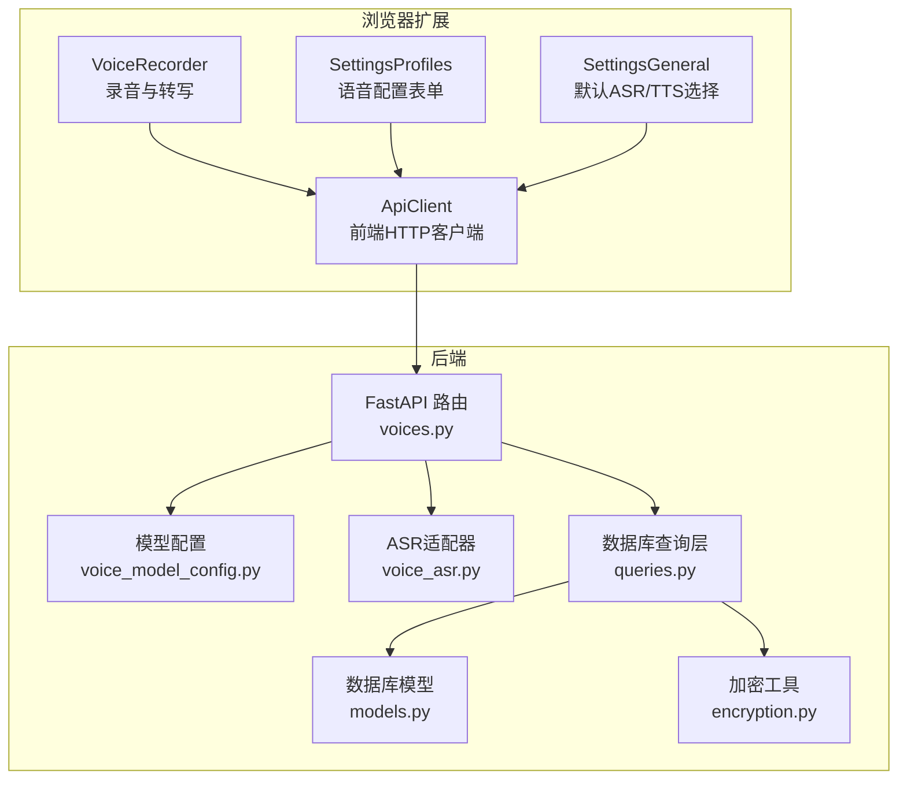
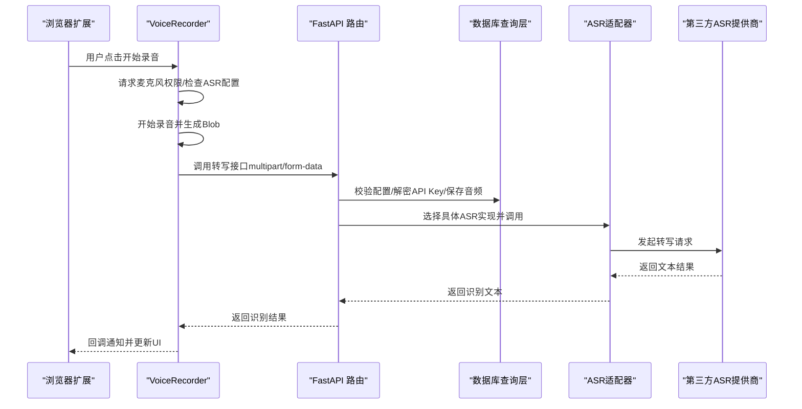
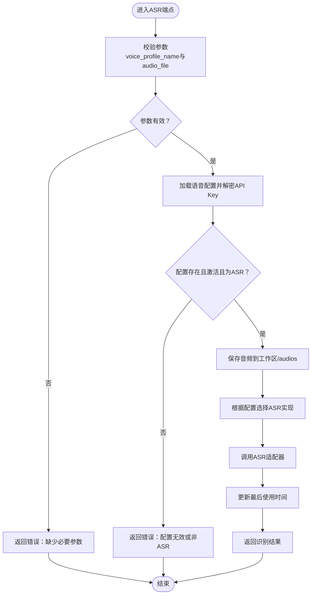
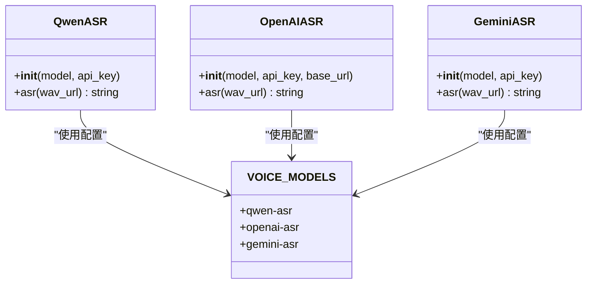
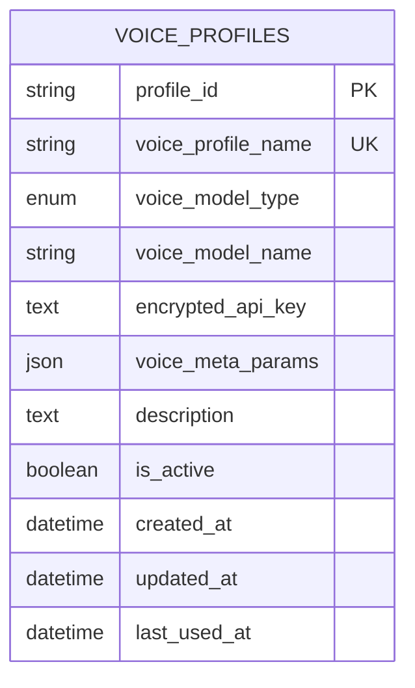
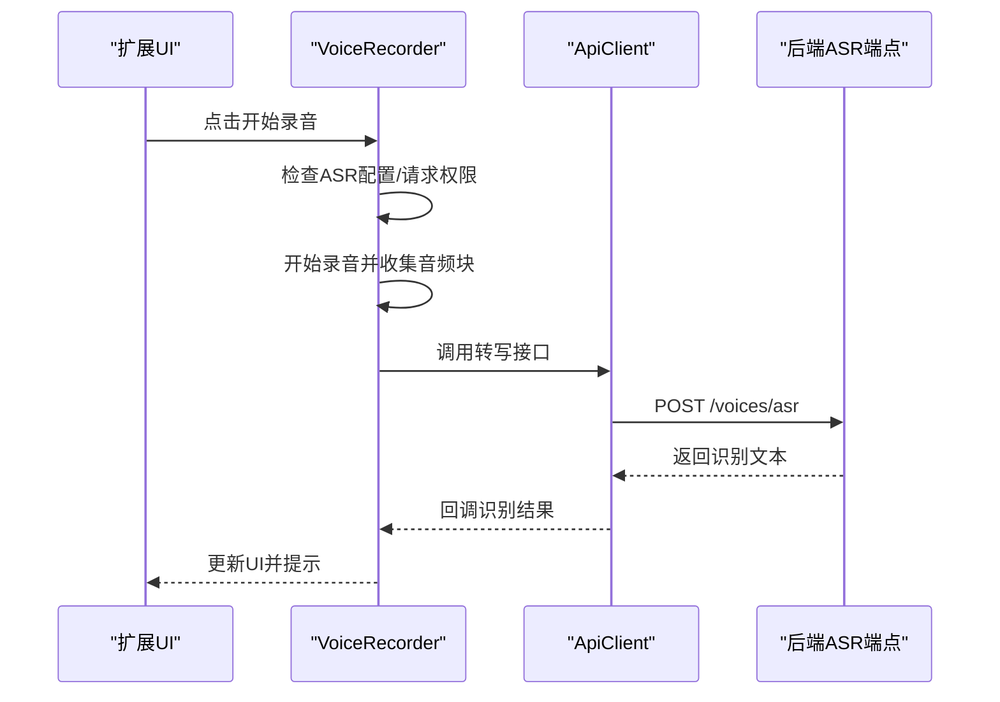
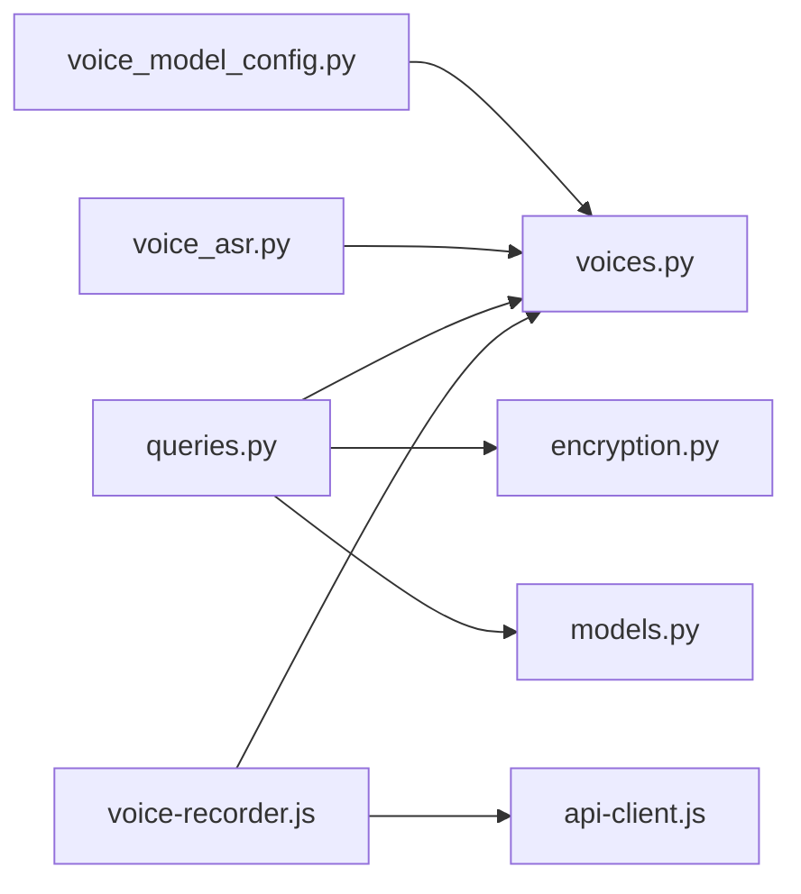

# 语音API

<cite>
**本文引用的文件**
- [voices.py](file://vibe_surf/backend/api/voices.py)
- [voice_asr.py](file://vibe_surf/tools/voice_asr.py)
- [voice_model_config.py](file://vibe_surf/backend/voice_model_config.py)
- [queries.py](file://vibe_surf/backend/database/queries.py)
- [models.py](file://vibe_surf/backend/database/models.py)
- [encryption.py](file://vibe_surf/backend/utils/encryption.py)
- [voice-recorder.js](file://vibe_surf/chrome_extension/scripts/voice-recorder.js)
- [api-client.js](file://vibe_surf/chrome_extension/scripts/api-client.js)
- [settings-profiles.js](file://vibe_surf/chrome_extension/scripts/settings-profiles.js)
- [settings-general.js](file://vibe_surf/chrome_extension/scripts/settings-general.js)
- [test_voice_api.py](file://tests/test_voice_api.py)
- [langflow voice_mode.py](file://vibe_surf/langflow/api/v1/voice_mode.py)
</cite>

## 目录
1. [简介](#简介)
2. [项目结构](#项目结构)
3. [核心组件](#核心组件)
4. [架构总览](#架构总览)
5. [详细组件分析](#详细组件分析)
6. [依赖关系分析](#依赖关系分析)
7. [性能与优化](#性能与优化)
8. [故障排查指南](#故障排查指南)
9. [结论](#结论)
10. [附录：端点规范与参数](#附录端点规范与参数)

## 简介
本文件为“语音API”的权威参考文档，覆盖语音识别（ASR）与语音合成（TTS）能力的后端API、前端集成与浏览器扩展实现。内容包括：
- ASR端点规格与请求/响应格式
- 语音模型选择与参数配置接口
- 音频文件上传与本地保存策略
- 浏览器扩展中的录音、权限与转写流程
- 与自然语言理解（NLU）的集成思路
- 实时语音交互的使用示例与性能优化建议
- 多语言支持与口音适应机制
- 语音数据隐私保护措施

## 项目结构
语音能力由后端FastAPI路由、数据库模型与查询层、工具层ASR适配器、以及前端与Chrome扩展共同组成。核心路径如下：
- 后端API：voices.py 提供ASR与语音配置管理端点
- 工具层：voice_asr.py 封装多家ASR提供商SDK调用
- 配置中心：voice_model_config.py 统一声明可用模型
- 数据层：models.py 定义VoiceProfile模型；queries.py 提供CRUD与加解密
- 加密：encryption.py 基于机器ID派生对称密钥，加密存储敏感信息
- 前端与扩展：Chrome扩展 voice-recorder.js 负责录音与转写；api-client.js 提供前端调用封装；settings-* 脚本负责配置界面

图表来源
- [voices.py](file://vibe_surf/backend/api/voices.py#L24-L481)
- [voice_asr.py](file://vibe_surf/tools/voice_asr.py#L1-L125)
- [voice_model_config.py](file://vibe_surf/backend/voice_model_config.py#L1-L25)
- [queries.py](file://vibe_surf/backend/database/queries.py#L934-L1077)
- [models.py](file://vibe_surf/backend/database/models.py#L25-L55)
- [encryption.py](file://vibe_surf/backend/utils/encryption.py#L65-L127)
- [voice-recorder.js](file://vibe_surf/chrome_extension/scripts/voice-recorder.js#L1-L514)
- [api-client.js](file://vibe_surf/chrome_extension/scripts/api-client.js#L402-L443)
- [settings-profiles.js](file://vibe_surf/chrome_extension/scripts/settings-profiles.js#L297-L330)
- [settings-general.js](file://vibe_surf/chrome_extension/scripts/settings-general.js#L62-L223)

章节来源
- [voices.py](file://vibe_surf/backend/api/voices.py#L24-L481)
- [voice_asr.py](file://vibe_surf/tools/voice_asr.py#L1-L125)
- [voice_model_config.py](file://vibe_surf/backend/voice_model_config.py#L1-L25)
- [queries.py](file://vibe_surf/backend/database/queries.py#L934-L1077)
- [models.py](file://vibe_surf/backend/database/models.py#L25-L55)
- [encryption.py](file://vibe_surf/backend/utils/encryption.py#L65-L127)
- [voice-recorder.js](file://vibe_surf/chrome_extension/scripts/voice-recorder.js#L1-L514)
- [api-client.js](file://vibe_surf/chrome_extension/scripts/api-client.js#L402-L443)
- [settings-profiles.js](file://vibe_surf/chrome_extension/scripts/settings-profiles.js#L297-L330)
- [settings-general.js](file://vibe_surf/chrome_extension/scripts/settings-general.js#L62-L223)

## 核心组件
- 语音配置与模型
  - 模型清单：统一在配置中心声明可用模型及其类型（ASR/TTS）、是否需要API Key等元信息
  - 语音配置模型：数据库模型定义了语音配置的字段，含加密存储的API Key、元参数、启用状态与时间戳
  - 查询层：提供创建、读取、更新、列表、最后使用时间更新等操作，并在读取时进行API Key解密
- ASR执行
  - FastAPI路由：接收音频文件与语音配置名，校验配置有效性，保存音频到工作区，调用对应ASR适配器完成转写
  - ASR适配器：封装多家提供商SDK（如Qwen、OpenAI Whisper、Gemini），屏蔽差异
- 前端与扩展
  - 录音器：负责麦克风权限、录音、媒体格式选择、自动停止、转写回调
  - API客户端：封装后端voices路由的GET/POST/PUT/DELETE方法
  - 设置页：生成语音配置表单，按模型类型过滤显示；支持默认ASR/TTS选择

章节来源
- [voice_model_config.py](file://vibe_surf/backend/voice_model_config.py#L1-L25)
- [models.py](file://vibe_surf/backend/database/models.py#L25-L55)
- [queries.py](file://vibe_surf/backend/database/queries.py#L934-L1077)
- [voices.py](file://vibe_surf/backend/api/voices.py#L224-L373)
- [voice_asr.py](file://vibe_surf/tools/voice_asr.py#L1-L125)
- [voice-recorder.js](file://vibe_surf/chrome_extension/scripts/voice-recorder.js#L166-L398)
- [api-client.js](file://vibe_surf/chrome_extension/scripts/api-client.js#L402-L443)
- [settings-profiles.js](file://vibe_surf/chrome_extension/scripts/settings-profiles.js#L297-L330)
- [settings-general.js](file://vibe_surf/chrome_extension/scripts/settings-general.js#L62-L223)

## 架构总览
下图展示从浏览器扩展到后端ASR服务的整体调用链路与数据流向。

图表来源
- [voice-recorder.js](file://vibe_surf/chrome_extension/scripts/voice-recorder.js#L166-L398)
- [api-client.js](file://vibe_surf/chrome_extension/scripts/api-client.js#L402-L443)
- [voices.py](file://vibe_surf/backend/api/voices.py#L224-L373)
- [voice_asr.py](file://vibe_surf/tools/voice_asr.py#L1-L125)

## 详细组件分析

### ASR端点与流程
- 端点：POST /voices/asr
  - 请求体：multipart/form-data，字段
    - audio_file：必填，音频文件（支持多种常见格式）
    - voice_profile_name：必填，目标语音配置名称
  - 响应：包含成功标志、识别文本、文件名与保存路径
- 关键处理逻辑
  - 参数校验：必须提供voice_profile_name与有效文件名
  - 配置校验：读取配置并解密API Key；仅允许ASR配置；检查是否激活
  - 文件持久化：保存到工作区目录下的audios子目录，文件名包含时间戳
  - 模型选择：根据配置中的voice_model_name与voice_meta_params选择具体ASR实现
  - 结果回传：返回识别文本与元信息；更新最后使用时间

图表来源
- [voices.py](file://vibe_surf/backend/api/voices.py#L224-L373)

章节来源
- [voices.py](file://vibe_surf/backend/api/voices.py#L224-L373)

### 语音配置管理端点
- 创建配置：POST /voices/voice-profiles
- 更新配置：PUT /voices/voice-profiles/{name}
- 删除配置：DELETE /voices/voice-profiles/{name}
- 列出配置：GET /voices/voice-profiles
- 获取单个配置：GET /voices/{name}
- 可用模型列表：GET /voices/models

这些端点均通过数据库查询层完成CRUD，并在读取时解密API Key，避免明文泄露。

章节来源
- [voices.py](file://vibe_surf/backend/api/voices.py#L49-L222)
- [queries.py](file://vibe_surf/backend/database/queries.py#L934-L1077)

### ASR适配器与模型选择
- 支持的ASR模型
  - qwen-asr：基于DashScope多模态对话接口
  - openai-asr：基于OpenAI Whisper音频转写
  - gemini-asr：基于Google Gemini生成内容接口
- 模型配置
  - 通过配置中心集中声明各模型的类型、是否需要API Key、是否支持自定义base_url等
- 元参数
  - voice_meta_params可携带模型特定参数（例如OpenAI的base_url）

图表来源
- [voice_asr.py](file://vibe_surf/tools/voice_asr.py#L1-L125)
- [voice_model_config.py](file://vibe_surf/backend/voice_model_config.py#L1-L25)

章节来源
- [voice_asr.py](file://vibe_surf/tools/voice_asr.py#L1-L125)
- [voice_model_config.py](file://vibe_surf/backend/voice_model_config.py#L1-L25)

### 数据库模型与加密
- 语音配置模型
  - 字段：配置名、类型（ASR/TTS）、模型名、加密API Key、元参数、描述、启用状态、时间戳
- 查询层
  - 创建/更新时对API Key进行加密存储
  - 读取时解密API Key用于调用第三方服务
- 加密机制
  - 基于机器MAC地址或本地用户ID派生对称密钥，使用Fernet进行加解密
  - 支持回退到本地用户ID以保证跨环境一致性

图表来源
- [models.py](file://vibe_surf/backend/database/models.py#L25-L55)

章节来源
- [models.py](file://vibe_surf/backend/database/models.py#L25-L55)
- [queries.py](file://vibe_surf/backend/database/queries.py#L934-L1077)
- [encryption.py](file://vibe_surf/backend/utils/encryption.py#L65-L127)

### 浏览器扩展：录音与转写
- 录音器职责
  - 权限请求：优先直接getUserMedia，失败则通过iframe或tab方式引导授权
  - 录音控制：自动最大时长限制、持续时长更新、错误处理与清理
  - 转写流程：录制完成后生成Blob，调用前端API客户端发起转写请求，回调返回识别文本
- 前端API客户端
  - 封装voices相关GET/POST/PUT/DELETE方法，便于扩展内调用
- 设置页面
  - 语音配置表单：按模型类型过滤显示；支持编辑元参数
  - 默认ASR/TTS选择：自动选择最新配置并持久化到用户设置

图表来源
- [voice-recorder.js](file://vibe_surf/chrome_extension/scripts/voice-recorder.js#L166-L398)
- [api-client.js](file://vibe_surf/chrome_extension/scripts/api-client.js#L402-L443)
- [voices.py](file://vibe_surf/backend/api/voices.py#L224-L373)

章节来源
- [voice-recorder.js](file://vibe_surf/chrome_extension/scripts/voice-recorder.js#L1-L514)
- [api-client.js](file://vibe_surf/chrome_extension/scripts/api-client.js#L402-L443)
- [settings-profiles.js](file://vibe_surf/chrome_extension/scripts/settings-profiles.js#L297-L330)
- [settings-general.js](file://vibe_surf/chrome_extension/scripts/settings-general.js#L62-L223)

### 自然语言理解（NLU）与语音命令
- 当前仓库中未发现直接的“语音命令识别+意图分类”端点
- 语音输入可通过ASR端点获得文本，后续可接入Langflow或其他NLU模块进行意图解析与槽位提取
- 在Langflow中存在TTS配置与会话参数，可用于将识别后的文本转换为语音输出，形成完整的语音交互闭环

章节来源
- [langflow voice_mode.py](file://vibe_surf/langflow/api/v1/voice_mode.py#L208-L245)
- [langflow voice_mode.py](file://vibe_surf/langflow/api/v1/voice_mode.py#L1285-L1305)

## 依赖关系分析
- 组件耦合
  - voices.py 依赖 queries.py（数据库操作）、voice_asr.py（ASR实现）、voice_model_config.py（模型配置）
  - voice_asr.py 依赖各平台SDK（dashscope、openai、google）
  - queries.py 依赖 models.py（模型定义）与 encryption.py（加解密）
- 外部依赖
  - DashScope、OpenAI、Google GenAI SDK
  - 媒体设备API（MediaRecorder、getUserMedia）
- 循环依赖
  - 未发现循环导入；模块职责清晰

图表来源
- [voice_model_config.py](file://vibe_surf/backend/voice_model_config.py#L1-L25)
- [voices.py](file://vibe_surf/backend/api/voices.py#L24-L481)
- [voice_asr.py](file://vibe_surf/tools/voice_asr.py#L1-L125)
- [queries.py](file://vibe_surf/backend/database/queries.py#L934-L1077)
- [models.py](file://vibe_surf/backend/database/models.py#L25-L55)
- [encryption.py](file://vibe_surf/backend/utils/encryption.py#L65-L127)
- [voice-recorder.js](file://vibe_surf/chrome_extension/scripts/voice-recorder.js#L1-L514)
- [api-client.js](file://vibe_surf/chrome_extension/scripts/api-client.js#L402-L443)

## 性能与优化
- 录音与转写
  - 采用浏览器端MediaRecorder录制webm/ogg/wav，尽量选择高兼容性格式
  - 控制最大录音时长，避免内存占用过高
- ASR调用
  - 优先使用本地文件路径而非HTTP URL，减少网络开销（OpenAI Whisper与Gemini适配器均支持本地路径）
  - 合理选择模型：大模型更准确但延迟更高；小模型更快但精度略低
- 存储与清理
  - 识别完成后可删除临时音频文件，降低磁盘压力
- 并发与缓存
  - 对模型列表与配置列表进行前端缓存，减少重复请求
- 网络与超时
  - 为ASR调用设置合理超时与重试策略，避免阻塞UI线程

[本节为通用建议，不直接分析具体文件]

## 故障排查指南
- 常见错误与定位
  - 缺少voice_profile_name或文件名：检查前端调用与后端参数校验
  - 配置不存在或未激活：确认配置已创建且is_active为true
  - 非ASR配置：确保voice_model_type为asr
  - API Key错误：检查加密存储与解密流程
  - 录音权限被拒：扩展内会引导授权，若仍失败检查浏览器设置
- 日志与调试
  - 后端记录请求日志与异常堆栈，便于定位问题
  - 扩展内提供详细错误回调，区分录音与转写阶段
- 单元测试
  - 提供ASR适配器的最小化测试样例，验证各模型调用路径

章节来源
- [voices.py](file://vibe_surf/backend/api/voices.py#L224-L373)
- [voice-recorder.js](file://vibe_surf/chrome_extension/scripts/voice-recorder.js#L400-L440)
- [test_voice_api.py](file://tests/test_voice_api.py#L1-L45)

## 结论
本语音API以“配置驱动+适配器模式”为核心设计，既统一了模型清单与参数管理，又屏蔽了不同提供商的差异。结合浏览器扩展的录音与转写流程，可快速构建端到端的语音识别体验。同时，通过数据库加密与最小化明文暴露策略，保障了语音数据的安全性。未来可在现有基础上扩展TTS端点、语音命令识别与NLU集成，进一步完善实时语音交互场景。

[本节为总结性内容，不直接分析具体文件]

## 附录：端点规范与参数

### ASR端点
- 方法与路径
  - POST /voices/asr
- 请求头
  - Content-Type: multipart/form-data
- 表单字段
  - audio_file：必填，音频文件
  - voice_profile_name：必填，语音配置名称
- 成功响应
  - 包含success、voice_profile_name、voice_model_name、recognized_text、filename、saved_audio_path
- 错误码
  - 400：参数缺失或配置无效
  - 404：配置不存在
  - 500：内部错误或ASR调用失败

章节来源
- [voices.py](file://vibe_surf/backend/api/voices.py#L224-L373)

### 语音配置管理端点
- 创建配置
  - POST /voices/voice-profiles
  - 请求体：voice_profile_name、voice_model_type、voice_model_name、api_key、voice_meta_params、description
- 更新配置
  - PUT /voices/voice-profiles/{name}
  - 请求体：可选字段同上
- 删除配置
  - DELETE /voices/voice-profiles/{name}
- 列出配置
  - GET /voices/voice-profiles
  - 查询参数：voice_model_type、active_only、limit、offset
- 获取单个配置
  - GET /voices/{name}
- 可用模型列表
  - GET /voices/models
  - 查询参数：model_type

章节来源
- [voices.py](file://vibe_surf/backend/api/voices.py#L49-L222)
- [api-client.js](file://vibe_surf/chrome_extension/scripts/api-client.js#L402-L443)

### 语音模型配置
- 模型清单
  - qwen-asr：ASR，需要API Key
  - openai-asr：ASR，需要API Key，支持自定义base_url
  - gemini-asr：ASR，需要API Key
- 元参数
  - openai-asr：可设置base_url
  - 其他模型：可根据需要扩展

章节来源
- [voice_model_config.py](file://vibe_surf/backend/voice_model_config.py#L1-L25)

### 前端调用示例（概念性）
- 录音与转写
  - 使用VoiceRecorder开始录音
  - 录制完成后调用ApiClient.transcribeAudio(audioBlob, voiceProfileName)
  - 监听onTranscriptionComplete回调获取识别文本
- 配置管理
  - 通过ApiClient.getVoiceProfiles/getVoiceModels管理配置与模型

章节来源
- [voice-recorder.js](file://vibe_surf/chrome_extension/scripts/voice-recorder.js#L166-L398)
- [api-client.js](file://vibe_surf/chrome_extension/scripts/api-client.js#L402-L443)

### 多语言与口音适应
- 多语言支持
  - QwenASR启用了语言检测（enable_lid），可辅助多语言识别
  - OpenAI Whisper与Gemini也具备多语言能力，具体取决于所选模型
- 口音适应
  - 可通过voice_meta_params传递模型侧的口音/方言参数（视具体提供商而定）
  - 建议在配置中为不同地区/口音建立独立的语音配置，便于切换

章节来源
- [voice_asr.py](file://vibe_surf/tools/voice_asr.py#L1-L125)
- [voice_model_config.py](file://vibe_surf/backend/voice_model_config.py#L1-L25)

### 语音数据隐私保护
- API Key加密
  - 数据库存储加密API Key，读取时才解密
- 最小化明文暴露
  - 仅在必要时（调用第三方ASR）解密并使用
- 临时文件清理
  - 识别完成后可删除工作区中的临时音频文件
- 权限与合规
  - 录音前需明确用户授权；遵循浏览器权限模型与隐私政策

章节来源
- [encryption.py](file://vibe_surf/backend/utils/encryption.py#L65-L127)
- [queries.py](file://vibe_surf/backend/database/queries.py#L934-L1077)
- [voices.py](file://vibe_surf/backend/api/voices.py#L290-L364)
- [voice-recorder.js](file://vibe_surf/chrome_extension/scripts/voice-recorder.js#L30-L163)