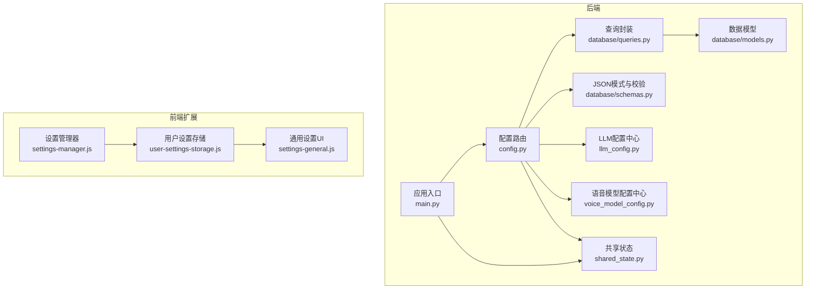
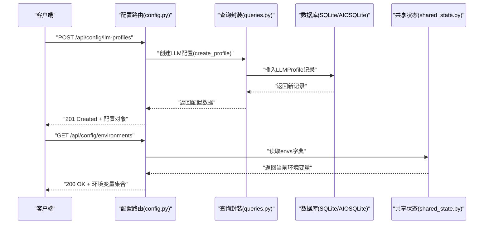
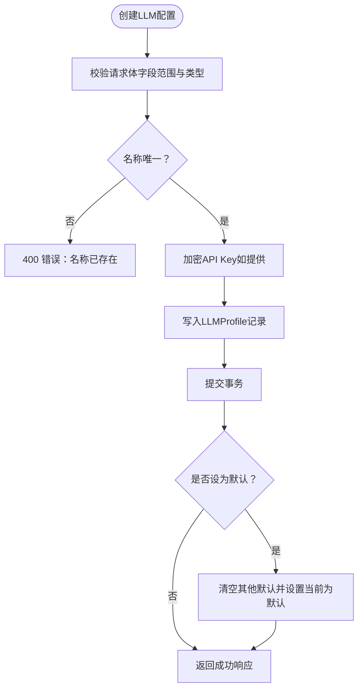
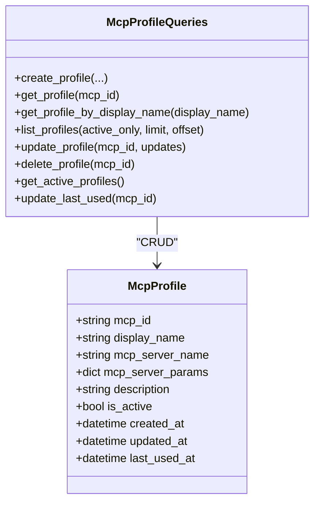
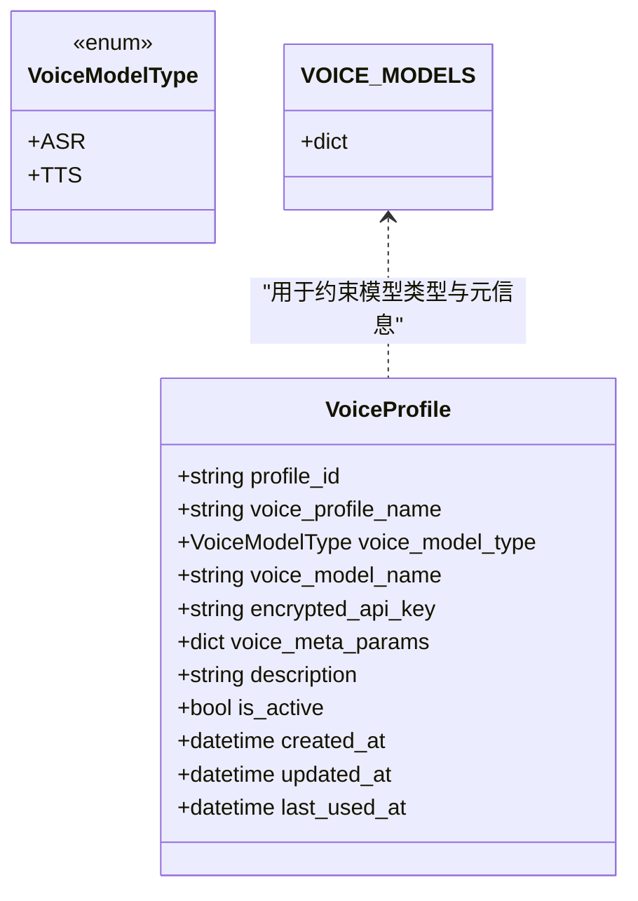
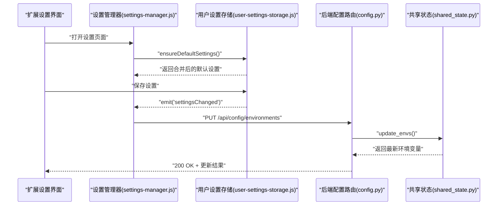
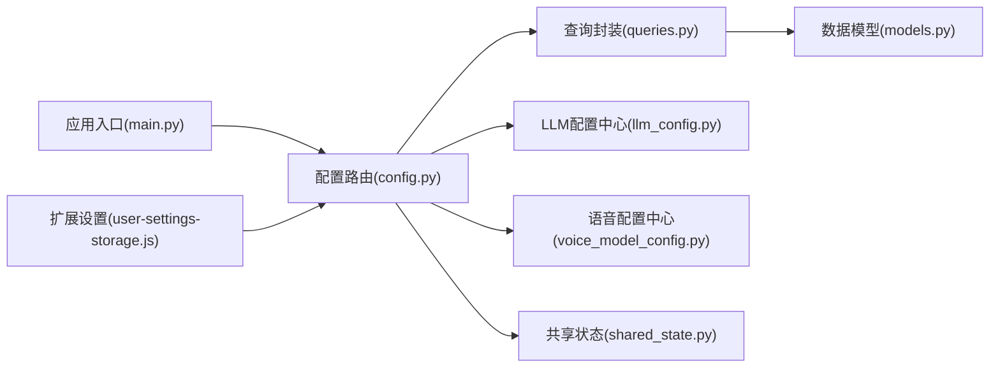

# 配置API

<cite>
**本文引用的文件**
- [vibe_surf/backend/api/config.py](file://vibe_surf/backend/api/config.py)
- [vibe_surf/backend/api/models.py](file://vibe_surf/backend/api/models.py)
- [vibe_surf/backend/database/models.py](file://vibe_surf/backend/database/models.py)
- [vibe_surf/backend/database/queries.py](file://vibe_surf/backend/database/queries.py)
- [vibe_surf/backend/database/schemas.py](file://vibe_surf/backend/database/schemas.py)
- [vibe_surf/backend/llm_config.py](file://vibe_surf/backend/llm_config.py)
- [vibe_surf/backend/voice_model_config.py](file://vibe_surf/backend/voice_model_config.py)
- [vibe_surf/backend/shared_state.py](file://vibe_surf/backend/shared_state.py)
- [vibe_surf/backend/main.py](file://vibe_surf/backend/main.py)
- [vibe_surf/chrome_extension/scripts/user-settings-storage.js](file://vibe_surf/chrome_extension/scripts/user-settings-storage.js)
- [vibe_surf/chrome_extension/scripts/settings-manager.js](file://vibe_surf/chrome_extension/scripts/settings-manager.js)
- [vibe_surf/chrome_extension/scripts/settings-general.js](file://vibe_surf/chrome_extension/scripts/settings-general.js)
</cite>

## 目录
1. [简介](#简介)
2. [项目结构](#项目结构)
3. [核心组件](#核心组件)
4. [架构总览](#架构总览)
5. [详细组件分析](#详细组件分析)
6. [依赖关系分析](#依赖关系分析)
7. [性能与可扩展性](#性能与可扩展性)
8. [故障排查指南](#故障排查指南)
9. [结论](#结论)
10. [附录：API规范与示例](#附录api规范与示例)

## 简介
本文件面向“配置管理API”的完整文档，覆盖以下主题：
- 全局设置与用户特定配置的读取与更新
- LLM配置管理端点（多模型提供商参数）
- 语音模型配置（ASR/TTS）API规格
- 浏览器配置选项的管理接口
- 配置文件的导入导出能力说明
- 配置版本控制与变更历史的使用建议
- 配置验证机制与默认值处理策略

该文档以仓库中的后端实现为基础，结合前端扩展脚本，提供从接口到数据模型、从验证到持久化的全链路说明，并辅以可视化图示帮助理解。

## 项目结构
配置API主要由以下模块构成：
- 后端路由与控制器：集中于配置路由，提供LLM/MCP配置、环境变量、状态查询等接口
- 数据层：数据库模型、查询封装、JSON字段校验
- 配置中心：LLM提供商清单与元数据、语音模型清单
- 共享状态：运行时组件与环境变量的加载与更新
- 前端扩展：浏览器扩展侧的用户设置存储与UI协调

图表来源
- [vibe_surf/backend/api/config.py](file://vibe_surf/backend/api/config.py#L1-L762)
- [vibe_surf/backend/database/models.py](file://vibe_surf/backend/database/models.py#L1-L289)
- [vibe_surf/backend/database/queries.py](file://vibe_surf/backend/database/queries.py#L1-L800)
- [vibe_surf/backend/database/schemas.py](file://vibe_surf/backend/database/schemas.py#L1-L100)
- [vibe_surf/backend/llm_config.py](file://vibe_surf/backend/llm_config.py#L1-L226)
- [vibe_surf/backend/voice_model_config.py](file://vibe_surf/backend/voice_model_config.py#L1-L25)
- [vibe_surf/backend/shared_state.py](file://vibe_surf/backend/shared_state.py#L1-L800)
- [vibe_surf/backend/main.py](file://vibe_surf/backend/main.py#L1-L794)
- [vibe_surf/chrome_extension/scripts/user-settings-storage.js](file://vibe_surf/chrome_extension/scripts/user-settings-storage.js#L1-L422)
- [vibe_surf/chrome_extension/scripts/settings-manager.js](file://vibe_surf/chrome_extension/scripts/settings-manager.js#L1-L25)
- [vibe_surf/chrome_extension/scripts/settings-general.js](file://vibe_surf/chrome_extension/scripts/settings-general.js#L465-L483)

章节来源
- [vibe_surf/backend/api/config.py](file://vibe_surf/backend/api/config.py#L1-L762)
- [vibe_surf/backend/main.py](file://vibe_surf/backend/main.py#L543-L750)

## 核心组件
- 配置路由（FastAPI）：提供LLM/MCP配置、环境变量、状态查询等端点
- 数据模型与查询：LLMProfile、McpProfile、VoiceProfile等模型及查询封装
- JSON模式与校验：对任务配置、MCP服务器配置等进行结构化校验
- 配置中心：LLM提供商清单、语音模型清单、默认模型选择
- 共享状态：运行时组件初始化、环境变量加载与保存、LLM实例切换
- 前端设置存储：浏览器扩展侧的用户设置持久化与迁移

章节来源
- [vibe_surf/backend/api/config.py](file://vibe_surf/backend/api/config.py#L1-L762)
- [vibe_surf/backend/database/models.py](file://vibe_surf/backend/database/models.py#L1-L289)
- [vibe_surf/backend/database/queries.py](file://vibe_surf/backend/database/queries.py#L1-L800)
- [vibe_surf/backend/database/schemas.py](file://vibe_surf/backend/database/schemas.py#L1-L100)
- [vibe_surf/backend/llm_config.py](file://vibe_surf/backend/llm_config.py#L1-L226)
- [vibe_surf/backend/voice_model_config.py](file://vibe_surf/backend/voice_model_config.py#L1-L25)
- [vibe_surf/backend/shared_state.py](file://vibe_surf/backend/shared_state.py#L1-L800)

## 架构总览
配置API采用“路由-查询-模型-校验-共享状态”的分层设计：
- 路由层负责请求解析、响应序列化与错误处理
- 查询层封装数据库操作，屏蔽异步会话与加密细节
- 模型层定义表结构与索引，确保数据一致性
- 校验层通过Pydantic模式保证JSON字段结构正确
- 共享状态在启动时加载默认配置，运行时动态更新

图表来源
- [vibe_surf/backend/api/config.py](file://vibe_surf/backend/api/config.py#L77-L140)
- [vibe_surf/backend/database/queries.py](file://vibe_surf/backend/database/queries.py#L21-L120)
- [vibe_surf/backend/shared_state.py](file://vibe_surf/backend/shared_state.py#L684-L712)

## 详细组件分析

### LLM配置管理端点
- 创建LLM配置：支持设置提供商、模型、温度、最大token、top_p、频率惩罚、种子、提供商特定配置、描述、是否设为默认等
- 列表/详情/更新/删除：支持按名称检索、条件过滤、部分字段更新、默认配置切换
- 默认配置：支持设置默认LLM配置，自动取消其他默认标记
- 提供商与模型查询：返回可用提供商列表、各提供商支持的模型与元信息（是否需要API Key、是否支持工具/视觉、默认模型等）

图表来源
- [vibe_surf/backend/api/config.py](file://vibe_surf/backend/api/config.py#L77-L140)
- [vibe_surf/backend/database/queries.py](file://vibe_surf/backend/database/queries.py#L21-L120)
- [vibe_surf/backend/database/models.py](file://vibe_surf/backend/database/models.py#L57-L93)

章节来源
- [vibe_surf/backend/api/config.py](file://vibe_surf/backend/api/config.py#L77-L367)
- [vibe_surf/backend/database/queries.py](file://vibe_surf/backend/database/queries.py#L144-L264)
- [vibe_surf/backend/database/models.py](file://vibe_surf/backend/database/models.py#L57-L93)
- [vibe_surf/backend/llm_config.py](file://vibe_surf/backend/llm_config.py#L1-L226)

### MCP配置管理端点
- 支持创建、列出、按ID查询、更新、删除MCP配置
- MCP配置包含显示名、服务器名、服务器参数（命令、参数、环境变量、工作目录、超时等）
- 运行时根据活动MCP配置动态注册/注销客户端

图表来源
- [vibe_surf/backend/database/models.py](file://vibe_surf/backend/database/models.py#L168-L191)
- [vibe_surf/backend/database/queries.py](file://vibe_surf/backend/database/queries.py#L266-L439)
- [vibe_surf/backend/shared_state.py](file://vibe_surf/backend/shared_state.py#L255-L351)

章节来源
- [vibe_surf/backend/api/config.py](file://vibe_surf/backend/api/config.py#L368-L584)
- [vibe_surf/backend/database/queries.py](file://vibe_surf/backend/database/queries.py#L266-L439)
- [vibe_surf/backend/database/models.py](file://vibe_surf/backend/database/models.py#L168-L191)
- [vibe_surf/backend/shared_state.py](file://vibe_surf/backend/shared_state.py#L255-L351)

### 语音模型配置（ASR/TTS）
- 语音模型清单：定义ASR/TTS模型及其提供商、是否需要API Key、是否支持自定义基础URL等
- 语音配置模型：包含模型类型（ASR/TTS）、模型名、加密API Key、模型参数（JSON）

图表来源
- [vibe_surf/backend/database/models.py](file://vibe_surf/backend/database/models.py#L29-L56)
- [vibe_surf/backend/voice_model_config.py](file://vibe_surf/backend/voice_model_config.py#L1-L25)

章节来源
- [vibe_surf/backend/voice_model_config.py](file://vibe_surf/backend/voice_model_config.py#L1-L25)
- [vibe_surf/backend/database/models.py](file://vibe_surf/backend/database/models.py#L29-L56)

### 浏览器配置选项管理
- 后端通过共享状态维护浏览器执行路径、用户数据目录、扩展路径、后端URL等
- 前端扩展提供用户设置存储与迁移、默认设置注入、设置变更事件通知
- 设置管理器协调通用设置、配置文件、集成与工作流设置模块

图表来源
- [vibe_surf/chrome_extension/scripts/settings-manager.js](file://vibe_surf/chrome_extension/scripts/settings-manager.js#L1-L25)
- [vibe_surf/chrome_extension/scripts/user-settings-storage.js](file://vibe_surf/chrome_extension/scripts/user-settings-storage.js#L92-L186)
- [vibe_surf/backend/api/config.py](file://vibe_surf/backend/api/config.py#L690-L762)
- [vibe_surf/backend/shared_state.py](file://vibe_surf/backend/shared_state.py#L684-L712)

章节来源
- [vibe_surf/chrome_extension/scripts/settings-manager.js](file://vibe_surf/chrome_extension/scripts/settings-manager.js#L1-L25)
- [vibe_surf/chrome_extension/scripts/user-settings-storage.js](file://vibe_surf/chrome_extension/scripts/user-settings-storage.js#L92-L186)
- [vibe_surf/backend/api/config.py](file://vibe_surf/backend/api/config.py#L690-L762)
- [vibe_surf/backend/shared_state.py](file://vibe_surf/backend/shared_state.py#L453-L598)

### 配置验证机制与默认值处理
- 请求体验证：Pydantic模型对LLM/MCP配置字段进行范围与类型校验（如温度范围、最大token必须大于0等）
- JSON字段校验：通过统一的JSON模式校验函数，对任务配置、MCP服务器配置等进行结构化校验与归一化
- 默认值策略：当未提供某些字段时，使用后端预设默认值；LLM默认模型来自配置中心

章节来源
- [vibe_surf/backend/api/models.py](file://vibe_surf/backend/api/models.py#L14-L100)
- [vibe_surf/backend/database/schemas.py](file://vibe_surf/backend/database/schemas.py#L1-L100)
- [vibe_surf/backend/llm_config.py](file://vibe_surf/backend/llm_config.py#L202-L226)

### 配置导入导出与版本控制
- 导入/导出：当前实现未提供专用的配置导入导出端点。建议通过以下方式实现：
  - 使用现有LLM/MCP配置端点批量创建/更新配置
  - 将环境变量通过“环境变量管理”端点进行批量更新
  - 在前端扩展侧，利用用户设置存储的“getAllSettings/saveSettings”能力进行本地备份/恢复
- 版本控制与变更历史：当前未内置版本控制或变更历史表。建议：
  - 引入变更日志表（记录操作者、时间戳、变更前/后快照）
  - 对敏感字段（如API Key）仅记录摘要或加密存储
  - 结合数据库迁移与审计日志，实现可追溯的配置演进

章节来源
- [vibe_surf/backend/api/config.py](file://vibe_surf/backend/api/config.py#L690-L762)
- [vibe_surf/chrome_extension/scripts/user-settings-storage.js](file://vibe_surf/chrome_extension/scripts/user-settings-storage.js#L129-L186)

## 依赖关系分析
- 路由依赖查询层，查询层依赖模型层与加密工具
- 配置路由依赖配置中心（LLM提供商与语音模型清单）
- 共享状态在应用生命周期内被初始化与更新，影响运行时组件行为
- 前端扩展与后端通过环境变量端点协同，实现跨端配置同步

图表来源
- [vibe_surf/backend/api/config.py](file://vibe_surf/backend/api/config.py#L1-L762)
- [vibe_surf/backend/database/queries.py](file://vibe_surf/backend/database/queries.py#L1-L800)
- [vibe_surf/backend/database/models.py](file://vibe_surf/backend/database/models.py#L1-L289)
- [vibe_surf/backend/llm_config.py](file://vibe_surf/backend/llm_config.py#L1-L226)
- [vibe_surf/backend/voice_model_config.py](file://vibe_surf/backend/voice_model_config.py#L1-L25)
- [vibe_surf/backend/shared_state.py](file://vibe_surf/backend/shared_state.py#L1-L800)
- [vibe_surf/backend/main.py](file://vibe_surf/backend/main.py#L543-L750)
- [vibe_surf/chrome_extension/scripts/user-settings-storage.js](file://vibe_surf/chrome_extension/scripts/user-settings-storage.js#L129-L186)

章节来源
- [vibe_surf/backend/main.py](file://vibe_surf/backend/main.py#L543-L750)

## 性能与可扩展性
- 数据访问：查询层对常用字段建立索引（如LLM/MCP活跃状态、创建时间、默认标记），提升筛选与排序性能
- 异步I/O：查询层基于异步会话，避免阻塞主线程
- 缓存与复用：共享状态在启动时加载默认LLM与MCP配置，减少重复初始化开销
- 可扩展性：新增提供商只需在配置中心添加条目；新增语音模型只需在语音配置中心补充清单

章节来源
- [vibe_surf/backend/database/models.py](file://vibe_surf/backend/database/models.py#L157-L289)
- [vibe_surf/backend/shared_state.py](file://vibe_surf/backend/shared_state.py#L539-L598)

## 故障排查指南
- 400错误（名称冲突/无效字段）：检查请求体字段是否符合范围与类型要求，确认名称唯一性
- 404错误（资源不存在）：确认LLM/MCP配置ID或名称正确
- 500错误（内部异常）：查看后端日志定位具体异常位置，关注数据库约束与加密流程
- 环境变量未生效：确认通过“环境变量管理”端点更新成功，并检查共享状态是否已写入系统环境

章节来源
- [vibe_surf/backend/api/config.py](file://vibe_surf/backend/api/config.py#L120-L140)
- [vibe_surf/backend/shared_state.py](file://vibe_surf/backend/shared_state.py#L684-L712)

## 结论
配置API围绕“LLM/MCP配置、环境变量、状态查询”构建了完整的配置管理体系。通过Pydantic校验、数据库模型与查询封装、共享状态与前端扩展协同，实现了从接口到持久化的闭环。建议后续增强导入导出、版本控制与变更历史能力，以满足更复杂的运维与合规需求。

## 附录：API规范与示例

### LLM配置端点
- 创建LLM配置
  - 方法与路径：POST /api/config/llm-profiles
  - 请求体字段：profile_name、provider、model、api_key（可选）、base_url（可选）、temperature、max_tokens、top_p、frequency_penalty、seed、provider_config（可选）、description（可选）、is_default（可选）
  - 响应：LLMProfileResponse
- 列出LLM配置
  - 方法与路径：GET /api/config/llm-profiles?active_only=true&limit=50&offset=0
  - 响应：LLMProfileResponse数组
- 获取指定LLM配置
  - 方法与路径：GET /api/config/llm-profiles/{profile_name}
  - 响应：LLMProfileResponse
- 更新LLM配置
  - 方法与路径：PUT /api/config/llm-profiles/{profile_name}
  - 请求体字段：provider、model、api_key（可选）、base_url（可选）、temperature、max_tokens、top_p、frequency_penalty、seed、provider_config（可选）、description（可选）、is_active（可选）、is_default（可选）
  - 响应：LLMProfileResponse
- 删除LLM配置
  - 方法与路径：DELETE /api/config/llm-profiles/{profile_name}
  - 响应：JSON消息
- 设置默认LLM配置
  - 方法与路径：POST /api/config/llm-profiles/{profile_name}/set-default
  - 响应：JSON消息
- 获取当前默认LLM配置
  - 方法与路径：GET /api/config/llm-profiles/default/current
  - 响应：LLMProfileResponse
- 获取可用LLM提供商
  - 方法与路径：GET /api/config/llm/providers
  - 响应：包含提供商列表与元信息
- 获取指定提供商的模型
  - 方法与路径：GET /api/config/llm/providers/{provider_name}/models
  - 响应：包含模型列表与元信息

章节来源
- [vibe_surf/backend/api/config.py](file://vibe_surf/backend/api/config.py#L77-L367)
- [vibe_surf/backend/llm_config.py](file://vibe_surf/backend/llm_config.py#L202-L226)

### MCP配置端点
- 创建MCP配置
  - 方法与路径：POST /api/config/mcp-profiles
  - 请求体字段：display_name、mcp_server_name、mcp_server_params（dict）、description（可选）
  - 响应：McpProfileResponse
- 列出MCP配置
  - 方法与路径：GET /api/config/mcp-profiles?active_only=true&limit=50&offset=0
  - 响应：McpProfileResponse数组
- 获取指定MCP配置
  - 方法与路径：GET /api/config/mcp-profiles/{mcp_id}
  - 响应：McpProfileResponse
- 更新MCP配置
  - 方法与路径：PUT /api/config/mcp-profiles/{mcp_id}
  - 请求体字段：display_name、mcp_server_name、mcp_server_params（dict）、description（可选）、is_active（可选）
  - 响应：McpProfileResponse
- 删除MCP配置
  - 方法与路径：DELETE /api/config/mcp-profiles/{mcp_id}
  - 响应：JSON消息

章节来源
- [vibe_surf/backend/api/config.py](file://vibe_surf/backend/api/config.py#L368-L584)

### 环境变量管理端点
- 获取环境变量
  - 方法与路径：GET /api/config/environments
  - 响应：environments字典与计数
- 更新环境变量
  - 方法与路径：PUT /api/config/environments
  - 请求体：environments字典或键值对
  - 响应：更新消息与最新环境变量

章节来源
- [vibe_surf/backend/api/config.py](file://vibe_surf/backend/api/config.py#L690-L762)
- [vibe_surf/backend/shared_state.py](file://vibe_surf/backend/shared_state.py#L684-L712)

### 语音模型配置端点
- 语音模型清单：通过LLM配置端点的“可用提供商”接口可间接获取语音模型元信息（ASR/TTS）
- 语音配置模型：VoiceProfile（模型类型、模型名、加密API Key、模型参数、描述、激活状态、时间戳）

章节来源
- [vibe_surf/backend/voice_model_config.py](file://vibe_surf/backend/voice_model_config.py#L1-L25)
- [vibe_surf/backend/database/models.py](file://vibe_surf/backend/database/models.py#L29-L56)

### 配置状态端点
- 获取整体配置状态
  - 方法与路径：GET /api/config/status
  - 响应：包含LLM配置统计、工具初始化状态、浏览器管理器状态、VibeSurf Agent状态与总体状态

章节来源
- [vibe_surf/backend/api/config.py](file://vibe_surf/backend/api/config.py#L645-L689)

### 前端设置与后端协同
- 用户设置存储：提供设置读取、保存、迁移与存储信息查询
- 设置管理器：协调通用设置、配置文件、集成与工作流设置模块
- 通用设置UI：更新后端URL等通用设置

章节来源
- [vibe_surf/chrome_extension/scripts/user-settings-storage.js](file://vibe_surf/chrome_extension/scripts/user-settings-storage.js#L129-L186)
- [vibe_surf/chrome_extension/scripts/settings-manager.js](file://vibe_surf/chrome_extension/scripts/settings-manager.js#L1-L25)
- [vibe_surf/chrome_extension/scripts/settings-general.js](file://vibe_surf/chrome_extension/scripts/settings-general.js#L465-L483)