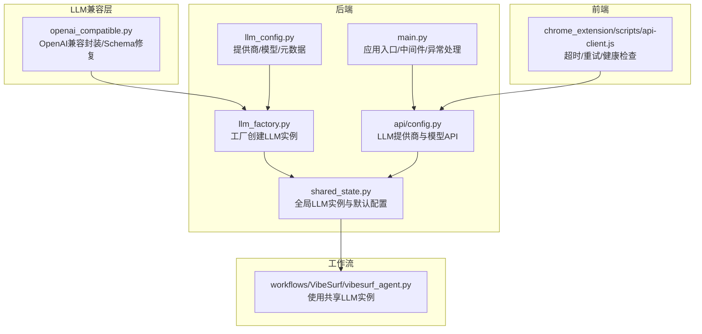
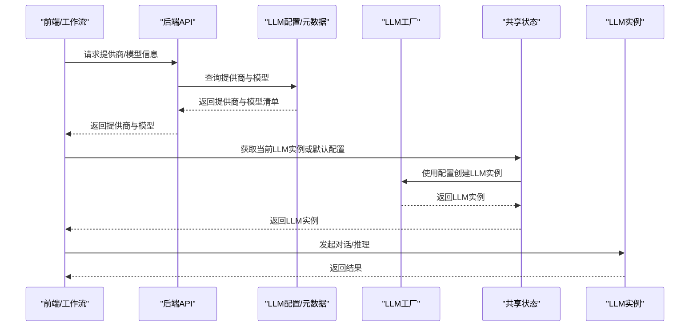
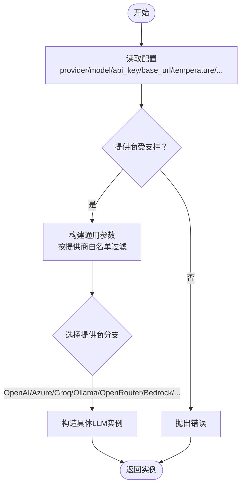
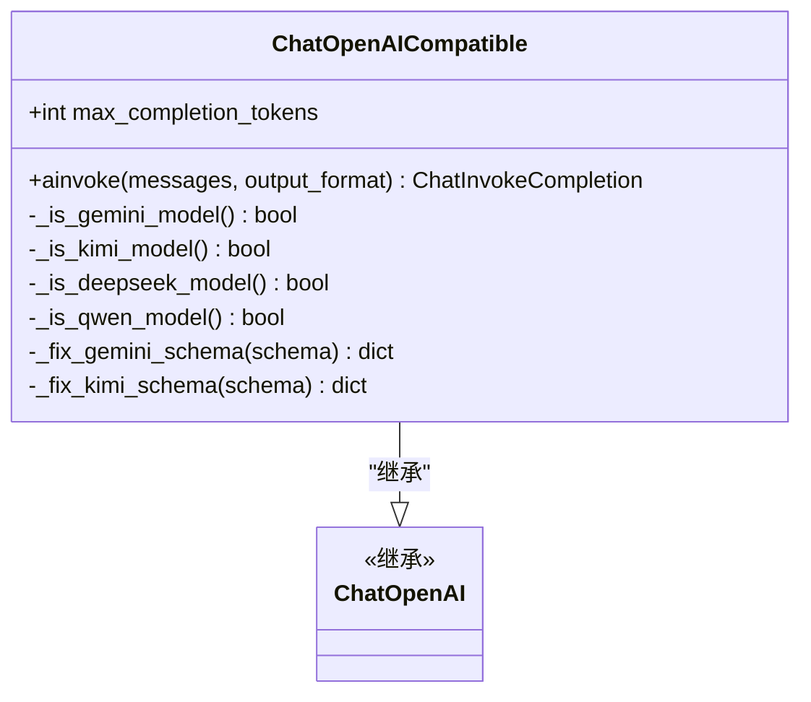
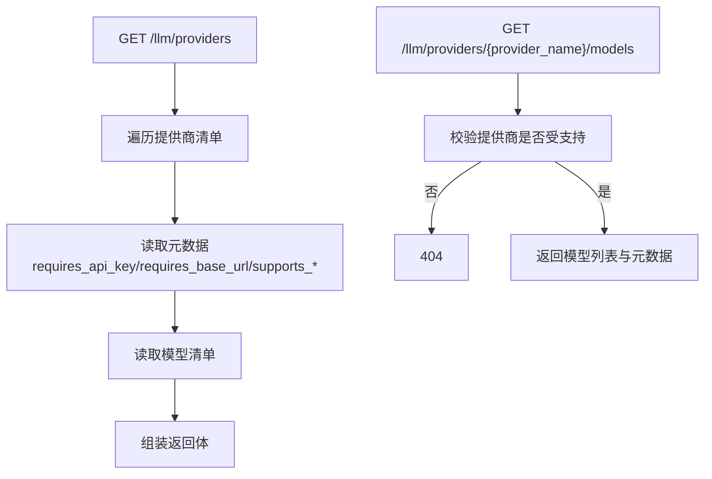
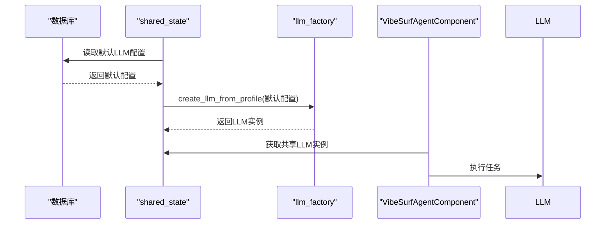
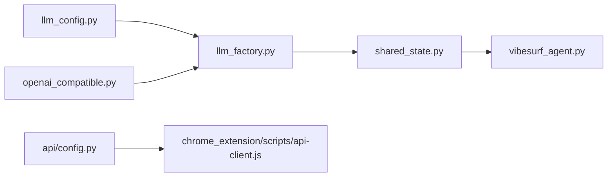

# LLM提供商支持

<cite>
**本文引用的文件列表**
- [llm_factory.py](file://vibe_surf/backend/utils/llm_factory.py)
- [openai_compatible.py](file://vibe_surf/llm/openai_compatible.py)
- [llm_config.py](file://vibe_surf/backend/llm_config.py)
- [config.py](file://vibe_surf/backend/api/config.py)
- [shared_state.py](file://vibe_surf/backend/shared_state.py)
- [main.py](file://vibe_surf/backend/main.py)
- [vibesurf_agent.py](file://vibe_surf/workflows/VibeSurf/vibesurf_agent.py)
- [api-client.js](file://vibe_surf/chrome_extension/scripts/api-client.js)
</cite>

## 目录
1. [引言](#引言)
2. [项目结构](#项目结构)
3. [核心组件](#核心组件)
4. [架构总览](#架构总览)
5. [详细组件分析](#详细组件分析)
6. [依赖关系分析](#依赖关系分析)
7. [性能考虑](#性能考虑)
8. [故障排查指南](#故障排查指南)
9. [结论](#结论)

## 引言
本文件系统性梳理 VibeSurf 对多 LLM 提供商的支持体系，重点覆盖以下方面：
- 工厂模式：基于配置动态创建不同提供商的 LLM 实例
- 兼容层设计：通过统一接口适配多家提供商的差异
- 主流提供商支持：OpenAI、Anthropic、Google Gemini、Mistral 等
- API 路由与负载均衡：如何在多个提供商之间分配请求
- 错误处理策略：超时、重试与故障转移

## 项目结构
围绕 LLM 支持的关键目录与文件：
- 后端工具与配置
  - utils/llm_factory.py：工厂方法，按配置创建 LLM 实例
  - backend/llm_config.py：提供商清单、模型清单与元数据
  - backend/api/config.py：LLM 提供商与模型查询接口
  - backend/shared_state.py：全局 LLM 实例管理与默认配置加载
  - backend/main.py：后端应用入口与中间件、异常处理
- LLM 兼容层
  - llm/openai_compatible.py：OpenAI 兼容模型封装，自动修复部分提供商的 schema 差异
- 前端与集成
  - chrome_extension/scripts/api-client.js：前端 HTTP 客户端，含超时、重试与健康检查
  - workflows/VibeSurf/vibesurf_agent.py：工作流组件，使用共享 LLM 实例

图表来源
- [llm_factory.py](file://vibe_surf/backend/utils/llm_factory.py#L1-L275)
- [llm_config.py](file://vibe_surf/backend/llm_config.py#L1-L226)
- [config.py](file://vibe_surf/backend/api/config.py#L585-L762)
- [shared_state.py](file://vibe_surf/backend/shared_state.py#L604-L712)
- [openai_compatible.py](file://vibe_surf/llm/openai_compatible.py#L1-L373)
- [api-client.js](file://vibe_surf/chrome_extension/scripts/api-client.js#L1-L162)
- [vibesurf_agent.py](file://vibe_surf/workflows/VibeSurf/vibesurf_agent.py#L1-L114)

章节来源
- [llm_factory.py](file://vibe_surf/backend/utils/llm_factory.py#L1-L275)
- [llm_config.py](file://vibe_surf/backend/llm_config.py#L1-L226)
- [config.py](file://vibe_surf/backend/api/config.py#L585-L762)
- [shared_state.py](file://vibe_surf/backend/shared_state.py#L604-L712)
- [openai_compatible.py](file://vibe_surf/llm/openai_compatible.py#L1-L373)
- [api-client.js](file://vibe_surf/chrome_extension/scripts/api-client.js#L1-L162)
- [vibesurf_agent.py](file://vibe_surf/workflows/VibeSurf/vibesurf_agent.py#L1-L114)

## 核心组件
- LLM 工厂（llm_factory.py）
  - 输入：LLM 配置（提供商、模型、密钥、base_url、温度、最大 token 等）
  - 输出：对应提供商的 LLM 实例（如 ChatOpenAI、ChatAnthropic、ChatGoogle、ChatOpenRouter、ChatAWSBedrock 等）
  - 特性：参数白名单校验、提供商特定参数映射、异常日志与统一错误抛出
- OpenAI 兼容层（openai_compatible.py）
  - 统一接口：继承自 ChatOpenAI，扩展结构化输出与 schema 修复
  - 模型识别：自动检测 Gemini/Kimi/Qwen/DeepSeek 等特殊模型并应用相应修复策略
  - 错误映射：将第三方错误转换为统一的 ModelProviderError
- 配置与元数据（llm_config.py）
  - 提供商清单、模型清单、是否需要 API Key、是否需要 base_url、默认模型等
- API 路由（backend/api/config.py）
  - /llm/providers：列出所有提供商及其元数据
  - /llm/providers/{provider_name}/models：查询指定提供商的可用模型
- 默认 LLM 初始化（shared_state.py）
  - 从数据库默认配置加载 LLM；若无则回退到环境变量
- 前端 HTTP 客户端（api-client.js）
  - 超时控制、指数回退重试、健康检查、错误分类（客户端错误不重试）

章节来源
- [llm_factory.py](file://vibe_surf/backend/utils/llm_factory.py#L23-L216)
- [openai_compatible.py](file://vibe_surf/llm/openai_compatible.py#L63-L373)
- [llm_config.py](file://vibe_surf/backend/llm_config.py#L1-L226)
- [config.py](file://vibe_surf/backend/api/config.py#L585-L762)
- [shared_state.py](file://vibe_surf/backend/shared_state.py#L604-L712)
- [api-client.js](file://vibe_surf/chrome_extension/scripts/api-client.js#L1-L162)

## 架构总览
下图展示从“配置”到“LLM 实例”的创建链路，以及“工作流”如何使用该实例：

图表来源
- [config.py](file://vibe_surf/backend/api/config.py#L585-L762)
- [llm_config.py](file://vibe_surf/backend/llm_config.py#L1-L226)
- [llm_factory.py](file://vibe_surf/backend/utils/llm_factory.py#L23-L216)
- [shared_state.py](file://vibe_surf/backend/shared_state.py#L604-L712)

## 详细组件分析

### LLM 工厂：工厂模式与参数映射
- 设计要点
  - 以配置为中心：从 LLMProfile 中读取 provider/model/api_key/base_url/temperature/max_tokens 等字段
  - 参数白名单：不同提供商支持的参数不同，工厂按 provider_param_support 进行过滤
  - 提供商特定逻辑：如 Azure OpenAI 需要 base_url（azure_endpoint），Ollama 默认 host，AWS Bedrock 使用不同的鉴权字段
  - 统一异常：捕获异常并记录日志，抛出统一错误
- 关键路径
  - 创建实例：create_llm_from_profile
  - 参数校验：validate_llm_configuration
  - 参数清单：get_llm_creation_parameters

图表来源
- [llm_factory.py](file://vibe_surf/backend/utils/llm_factory.py#L23-L216)

章节来源
- [llm_factory.py](file://vibe_surf/backend/utils/llm_factory.py#L23-L216)

### OpenAI 兼容层：统一接口与 Schema 修复
- 设计要点
  - 继承 ChatOpenAI，保持 OpenAI 风格调用
  - 结构化输出：当 output_format 存在时，自动注入 response_format 或将 schema 注入 system prompt
  - 模型识别与修复：
    - Gemini：移除不支持的属性、解析 $ref、处理空对象类型
    - Kimi/Moonshot：移除不支持的 min_items/default 等关键字
    - Qwen/DeepSeek：确保 response_format 的 json 关键字存在
  - 错误映射：RateLimitError/APIConnectionError/APIStatusError 映射为统一 ModelProviderError
- 关键路径
  - ainvoke：统一调用入口，按模型类型应用修复策略
  - _fix_*_schema：针对不同模型的 schema 修复函数

图表来源
- [openai_compatible.py](file://vibe_surf/llm/openai_compatible.py#L63-L373)

章节来源
- [openai_compatible.py](file://vibe_surf/llm/openai_compatible.py#L63-L373)

### 配置与元数据：提供商与模型清单
- 提供商清单与模型清单：集中定义各提供商支持的模型
- 元数据：是否需要 API Key、是否需要 base_url、默认模型、默认 base_url 等
- API 接口：
  - GET /llm/providers：返回提供商列表及元数据
  - GET /llm/providers/{provider_name}/models：返回指定提供商的模型列表与元数据

图表来源
- [llm_config.py](file://vibe_surf/backend/llm_config.py#L1-L226)
- [config.py](file://vibe_surf/backend/api/config.py#L585-L762)

章节来源
- [llm_config.py](file://vibe_surf/backend/llm_config.py#L1-L226)
- [config.py](file://vibe_surf/backend/api/config.py#L585-L762)

### 默认 LLM 初始化与工作流使用
- 默认初始化：优先从数据库默认配置加载；若不可用则回退到环境变量
- 更新 LLM：支持按配置名切换 LLM 实例，并更新成本统计服务注册
- 工作流使用：VibeSurfAgentComponent 在运行时直接使用共享 LLM 实例

图表来源
- [shared_state.py](file://vibe_surf/backend/shared_state.py#L604-L712)
- [vibesurf_agent.py](file://vibe_surf/workflows/VibeSurf/vibesurf_agent.py#L81-L114)

章节来源
- [shared_state.py](file://vibe_surf/backend/shared_state.py#L604-L712)
- [vibesurf_agent.py](file://vibe_surf/workflows/VibeSurf/vibesurf_agent.py#L81-L114)

## 依赖关系分析
- 组件耦合
  - llm_factory 依赖 llm_config 的提供商与模型清单
  - shared_state 依赖 llm_factory 创建实例，并在运行时暴露给工作流
  - openai_compatible 作为 ChatOpenAI 的子类，被工厂创建并注入到共享状态
  - api-client.js 通过后端 API 获取提供商与模型信息
- 外部依赖
  - 各大提供商 SDK（ChatOpenAI、ChatAnthropic、ChatGoogle、ChatAzureOpenAI、ChatOpenRouter、ChatAWSBedrock 等）
  - OpenAI 兼容层用于统一响应格式与 schema

图表来源
- [llm_config.py](file://vibe_surf/backend/llm_config.py#L1-L226)
- [llm_factory.py](file://vibe_surf/backend/utils/llm_factory.py#L1-L275)
- [shared_state.py](file://vibe_surf/backend/shared_state.py#L604-L712)
- [openai_compatible.py](file://vibe_surf/llm/openai_compatible.py#L1-L373)
- [config.py](file://vibe_surf/backend/api/config.py#L585-L762)
- [api-client.js](file://vibe_surf/chrome_extension/scripts/api-client.js#L1-L162)

章节来源
- [llm_config.py](file://vibe_surf/backend/llm_config.py#L1-L226)
- [llm_factory.py](file://vibe_surf/backend/utils/llm_factory.py#L1-L275)
- [shared_state.py](file://vibe_surf/backend/shared_state.py#L604-L712)
- [openai_compatible.py](file://vibe_surf/llm/openai_compatible.py#L1-L373)
- [config.py](file://vibe_surf/backend/api/config.py#L585-L762)
- [api-client.js](file://vibe_surf/chrome_extension/scripts/api-client.js#L1-L162)

## 性能考虑
- 参数白名单与最小化网络往返：仅传递提供商支持的参数，减少无效字段导致的错误与重试
- 兼容层的 schema 修复：在本地完成，避免多次往返与失败重试
- 默认 LLM 初始化：优先从数据库加载，减少首次调用延迟
- 前端超时与重试：合理设置超时与指数回退，降低用户等待时间

[本节为通用指导，无需源码引用]

## 故障排查指南
- 常见错误与定位
  - 提供商不受支持：检查 llm_config.py 中的提供商清单
  - 缺少 API Key 或 base_url：validate_llm_configuration 会校验元数据要求
  - 第三方错误映射：openai_compatible.py 将 RateLimitError/APIConnectionError/APIStatusError 映射为统一 ModelProviderError
  - 前端超时与重试：api-client.js 设置了超时与重试，且对 4xx 不重试、对 LLM 连接失败不重试
- 健康检查
  - 后端 /health：前端可定期调用进行健康检查
  - 前端健康检查：api-client.js.healthCheck 返回健康状态
- 日志与异常
  - 工厂层捕获异常并记录日志，便于定位配置问题
  - 应用层 main.py 对未处理异常进行统一响应

章节来源
- [llm_factory.py](file://vibe_surf/backend/utils/llm_factory.py#L222-L275)
- [openai_compatible.py](file://vibe_surf/llm/openai_compatible.py#L341-L373)
- [api-client.js](file://vibe_surf/chrome_extension/scripts/api-client.js#L139-L162)
- [main.py](file://vibe_surf/backend/main.py#L649-L725)

## 结论
VibeSurf 通过“配置驱动 + 工厂模式 + 兼容层”的架构，实现了对多家 LLM 提供商的一致接入与统一调用。工厂负责参数映射与实例创建，兼容层负责响应格式与 schema 修复，API 层提供提供商与模型查询，前端具备超时与重试能力。整体设计在保证易用性的同时，兼顾了可扩展性与稳定性。