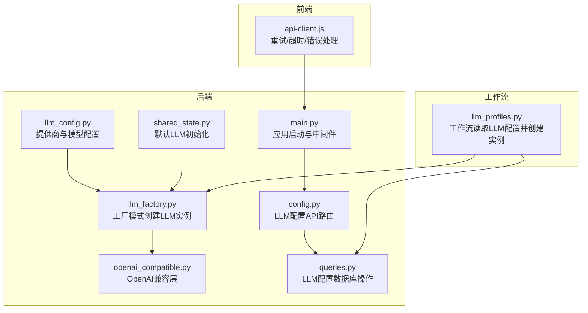
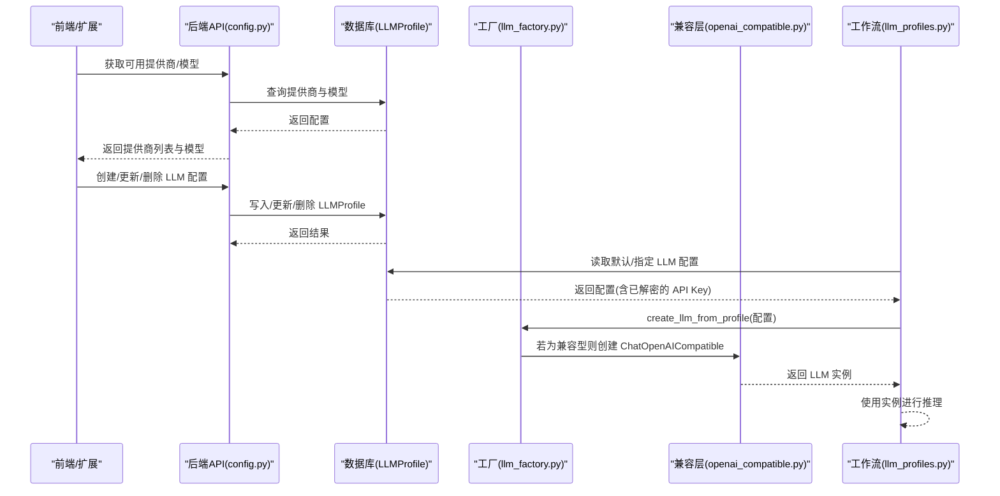
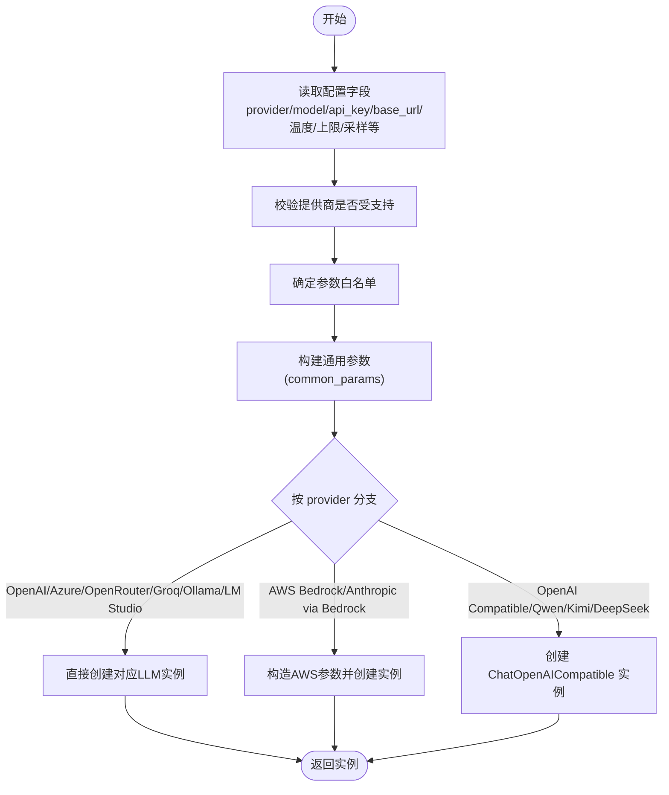
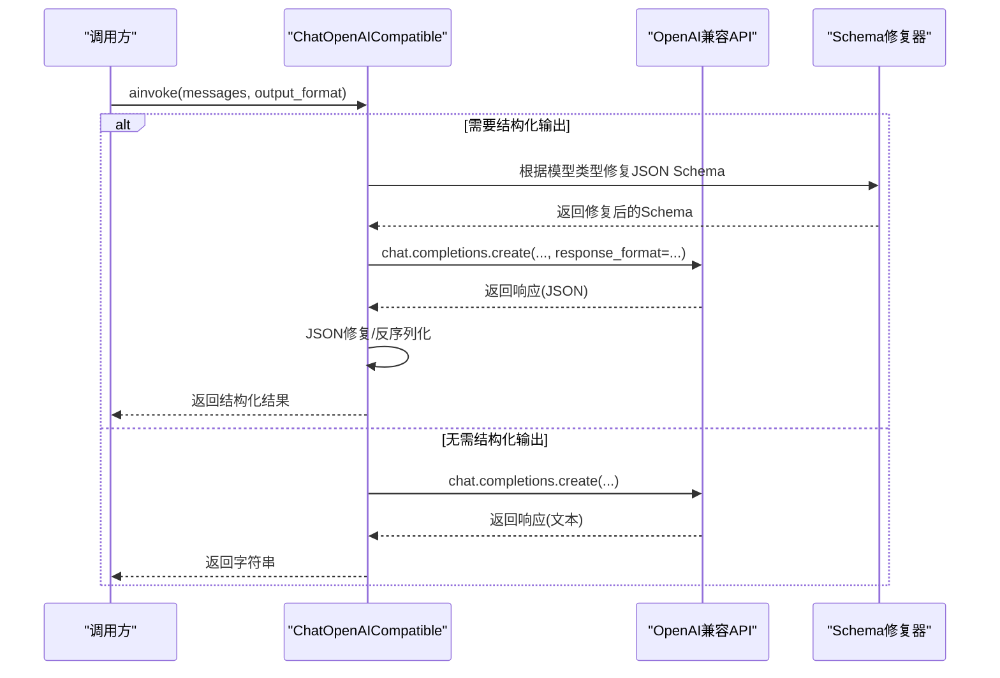
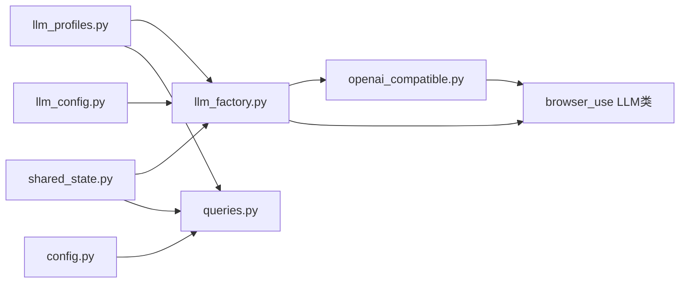

# 云提供商集成

<cite>
**本文引用的文件**
- [llm_factory.py](file://vibe_surf/backend/utils/llm_factory.py)
- [openai_compatible.py](file://vibe_surf/llm/openai_compatible.py)
- [llm_config.py](file://vibe_surf/backend/llm_config.py)
- [config.py](file://vibe_surf/backend/api/config.py)
- [queries.py](file://vibe_surf/backend/database/queries.py)
- [main.py](file://vibe_surf/backend/main.py)
- [shared_state.py](file://vibe_surf/backend/shared_state.py)
- [llm_profiles.py](file://vibe_surf/workflows/VibeSurf/llm_profiles.py)
- [v001_initial_schema.sql](file://vibe_surf/backend/database/migrations/v001_initial_schema.sql)
- [api-client.js](file://vibe_surf/chrome_extension/scripts/api-client.js)
</cite>

## 目录
1. [简介](#简介)
2. [项目结构](#项目结构)
3. [核心组件](#核心组件)
4. [架构总览](#架构总览)
5. [详细组件分析](#详细组件分析)
6. [依赖关系分析](#依赖关系分析)
7. [性能考量](#性能考量)
8. [故障排查指南](#故障排查指南)
9. [结论](#结论)
10. [附录：配置与使用示例](#附录配置与使用示例)

## 简介
本文件系统性文档化 VibeSurf 对主流云 LLM 提供商（OpenAI、Anthropic、Google Gemini、Mistral、Groq、Ollama、OpenRouter、AWS Bedrock、Azure OpenAI、LM Studio、DeepSeek、Qwen、Kimi 等）的集成方式。重点覆盖：
- 工厂模式在 llm_factory.py 中如何按配置创建不同提供商的 LLM 实例；
- openai_compatible.py 的兼容层如何将不同提供商的 API 调用标准化为统一接口，包括认证、请求格式、响应处理；
- API 路由机制与配置管理，如何基于数据库中的 LLM 配置进行请求分发；
- 具体配置示例（API 密钥管理、区域设置、模型版本选择等）；
- 错误处理策略（超时重试、故障转移与降级）；
- 性能优化（延迟优化、连接池管理、请求批处理思路）。

## 项目结构
围绕“云提供商集成”的关键目录与文件：
- 后端工具与工厂：vibe_surf/backend/utils/llm_factory.py
- 兼容层：vibe_surf/llm/openai_compatible.py
- 提供商配置：vibe_surf/backend/llm_config.py
- API 路由与配置管理：vibe_surf/backend/api/config.py
- 数据库查询与加密：vibe_surf/backend/database/queries.py
- 启动与中间件：vibe_surf/backend/main.py
- 共享状态与默认 LLM 初始化：vibe_surf/backend/shared_state.py
- 工作流中使用 LLM 配置：vibe_surf/workflows/VibeSurf/llm_profiles.py
- 数据库迁移（LLM 配置表）：vibe_surf/backend/database/migrations/v001_initial_schema.sql
- 前端 API 客户端（含重试与超时）：vibe_surf/chrome_extension/scripts/api-client.js

图表来源
- [llm_factory.py](file://vibe_surf/backend/utils/llm_factory.py#L1-L275)
- [openai_compatible.py](file://vibe_surf/llm/openai_compatible.py#L1-L373)
- [llm_config.py](file://vibe_surf/backend/llm_config.py#L1-L226)
- [config.py](file://vibe_surf/backend/api/config.py#L1-L762)
- [queries.py](file://vibe_surf/backend/database/queries.py#L1-L249)
- [shared_state.py](file://vibe_surf/backend/shared_state.py#L613-L633)
- [main.py](file://vibe_surf/backend/main.py#L543-L731)
- [llm_profiles.py](file://vibe_surf/workflows/VibeSurf/llm_profiles.py#L60-L103)
- [api-client.js](file://vibe_surf/chrome_extension/scripts/api-client.js#L43-L136)

章节来源
- [llm_factory.py](file://vibe_surf/backend/utils/llm_factory.py#L1-L275)
- [openai_compatible.py](file://vibe_surf/llm/openai_compatible.py#L1-L373)
- [llm_config.py](file://vibe_surf/backend/llm_config.py#L1-L226)
- [config.py](file://vibe_surf/backend/api/config.py#L1-L762)
- [queries.py](file://vibe_surf/backend/database/queries.py#L1-L249)
- [shared_state.py](file://vibe_surf/backend/shared_state.py#L613-L633)
- [main.py](file://vibe_surf/backend/main.py#L543-L731)
- [llm_profiles.py](file://vibe_surf/workflows/VibeSurf/llm_profiles.py#L60-L103)
- [v001_initial_schema.sql](file://vibe_surf/backend/database/migrations/v001_initial_schema.sql#L1-L28)
- [api-client.js](file://vibe_surf/chrome_extension/scripts/api-client.js#L43-L136)

## 核心组件
- LLM 工厂（llm_factory.py）
  - 依据 LLMProfile 字段（provider、model、api_key、base_url、temperature、max_tokens、top_p、frequency_penalty、seed、provider_config）创建对应提供商的 LLM 实例。
  - 支持参数白名单与差异化支持（如 OpenRouter 不支持 max_tokens）。
  - 对 Azure OpenAI、AWS Bedrock、Ollama、LM Studio、OpenAI Compatible 等特殊场景做参数映射与校验。
- OpenAI 兼容层（openai_compatible.py）
  - 统一结构化输出（JSON Schema）与响应格式，自动修复 Gemini/Kimi/Qwen/DeepSeek 的模式差异。
  - 暴露 ainvoke 接口，封装温度、惩罚、最大补全令牌、reasoning_effort 等参数。
  - 将第三方错误转换为统一的 ModelProviderError，并记录日志。
- 提供商配置（llm_config.py）
  - 维护支持的提供商列表、模型清单与元数据（是否需要 API Key、是否需要 base_url、默认模型、能力开关等）。
- API 路由与配置管理（config.py）
  - 提供 LLM 配置的增删改查、默认配置设置、可用提供商与模型查询接口。
- 数据库与加密（queries.py）
  - LLMProfile 表结构与 CRUD 操作；API Key 加密存储与解密使用。
- 默认 LLM 初始化（shared_state.py）
  - 应用启动时从数据库加载默认 LLM 配置并创建实例。
- 工作流集成（llm_profiles.py）
  - 在工作流中按名称读取 LLM 配置并创建实例，用于任务执行。
- 前端重试与超时（api-client.js）
  - 统一的 fetch 请求封装，内置超时、重试、错误分类与不重试策略。

章节来源
- [llm_factory.py](file://vibe_surf/backend/utils/llm_factory.py#L23-L216)
- [openai_compatible.py](file://vibe_surf/llm/openai_compatible.py#L212-L373)
- [llm_config.py](file://vibe_surf/backend/llm_config.py#L1-L226)
- [config.py](file://vibe_surf/backend/api/config.py#L77-L366)
- [queries.py](file://vibe_surf/backend/database/queries.py#L1-L249)
- [shared_state.py](file://vibe_surf/backend/shared_state.py#L613-L633)
- [llm_profiles.py](file://vibe_surf/workflows/VibeSurf/llm_profiles.py#L60-L103)
- [api-client.js](file://vibe_surf/chrome_extension/scripts/api-client.js#L43-L136)

## 架构总览
下图展示从“配置管理”到“LLM 实例创建”再到“工作流使用”的整体流程。

图表来源
- [config.py](file://vibe_surf/backend/api/config.py#L585-L642)
- [queries.py](file://vibe_surf/backend/database/queries.py#L1-L249)
- [llm_factory.py](file://vibe_surf/backend/utils/llm_factory.py#L23-L216)
- [openai_compatible.py](file://vibe_surf/llm/openai_compatible.py#L63-L110)
- [llm_profiles.py](file://vibe_surf/workflows/VibeSurf/llm_profiles.py#L60-L103)

## 详细组件分析

### 工厂模式：llm_factory.py
- 输入：LLMProfile（字典或对象），包含 provider、model、api_key、base_url、temperature、max_tokens、top_p、frequency_penalty、seed、provider_config 等字段。
- 参数白名单：针对不同提供商定义可接受参数集合，避免传递不支持的参数。
- 特殊场景处理：
  - Azure OpenAI：强制要求 base_url（azure_endpoint），并设置固定 api_version。
  - AWS Bedrock：使用 aws_access_key_id/secret 作为认证，支持 region/secret 配置。
  - Ollama：默认 host 为本地 11434，支持自定义 base_url。
  - LM Studio：默认 base_url 为本地服务，api_key 固定值。
  - OpenAI Compatible：要求 base_url，内部使用 ChatOpenAICompatible。
  - OpenRouter：不支持 max_tokens。
- 输出：返回浏览器用 LLM 类（如 ChatOpenAI、ChatAnthropic、ChatGoogle、ChatAzureOpenAI、ChatGroq、ChatOllama、ChatOpenRouter、ChatAWSBedrock、ChatAnthropicBedrock、ChatOpenAICompatible）的实例。

图表来源
- [llm_factory.py](file://vibe_surf/backend/utils/llm_factory.py#L23-L216)

章节来源
- [llm_factory.py](file://vibe_surf/backend/utils/llm_factory.py#L23-L216)

### 兼容层：openai_compatible.py
- 目标：将不同提供商的 OpenAI 兼容 API（如 Azure OpenAI、OpenRouter、Qwen、Kimi、DeepSeek）统一为一致的结构化输出体验。
- 关键能力：
  - 自动识别模型类型（Gemini/Kimi/Moonshot/Qwen/DeepSeek），应用相应 JSON Schema 修复。
  - Gemini：移除不支持的属性（如 additionalProperties/title/default），解析 $ref 并清理空对象类型。
  - Kimi/Moonshot：移除不支持的关键字（如 min_items/minItems/default 与 anyOf 冲突）。
  - Qwen/DeepSeek：在某些场景下将 JSON Schema 注入系统提示以提升稳定性。
  - 结构化输出：通过 response_format=json_schema 或 json_object，结合 JSON 修复（json_repair）增强鲁棒性。
  - 错误处理：捕获 RateLimitError、APIConnectionError、APIStatusError，统一包装为 ModelProviderError。
- 调用路径：ainvoke -> 序列化消息 -> 发起 chat.completions -> 解析用量 -> 反序列化为 Pydantic 模型。

图表来源
- [openai_compatible.py](file://vibe_surf/llm/openai_compatible.py#L212-L373)

章节来源
- [openai_compatible.py](file://vibe_surf/llm/openai_compatible.py#L63-L110)
- [openai_compatible.py](file://vibe_surf/llm/openai_compatible.py#L212-L373)

### 提供商配置：llm_config.py
- 提供商清单与模型列表：集中维护各提供商支持的模型名。
- 元数据：每个提供商的显示名、是否需要 API Key、是否需要 base_url、默认模型、能力开关（工具、视觉）、默认 base_url 等。
- 辅助函数：获取支持的提供商、某提供商模型列表、元数据、默认模型、是否受支持。

章节来源
- [llm_config.py](file://vibe_surf/backend/llm_config.py#L1-L226)

### API 路由与配置管理：config.py
- LLM 配置管理：
  - 创建、列出、获取、更新、删除 LLM 配置。
  - 设置默认配置、获取当前默认配置。
  - 列出可用提供商与模型，包含元数据与默认 base_url。
- 数据安全：
  - 创建/更新时对 API Key 进行加密存储；读取时提供解密 API Key 的接口。
- 错误处理：
  - 对唯一约束冲突、完整性约束、未找到等异常进行明确的 HTTP 异常返回。

章节来源
- [config.py](file://vibe_surf/backend/api/config.py#L77-L366)
- [config.py](file://vibe_surf/backend/api/config.py#L585-L642)

### 数据库与加密：queries.py
- LLMProfile 表结构：包含 profile_id、profile_name（唯一）、provider、model、base_url、encrypted_api_key、温度、上限、采样、惩罚、种子、provider_config、描述、激活/默认状态、时间戳等。
- 查询操作：
  - create_profile：加密 API Key 后写入。
  - get_profile/get_profile_with_decrypted_key：按名称查询，后者返回解密后的 API Key。
  - list_profiles：支持活跃过滤、分页排序。
  - update_profile：支持对 API Key 的加密更新。
  - set_default_profile：原子地取消其他默认再设置新默认。
- 迁移脚本：v001_initial_schema.sql 定义了 LLM 配置表的初始结构。

章节来源
- [queries.py](file://vibe_surf/backend/database/queries.py#L1-L249)
- [v001_initial_schema.sql](file://vibe_surf/backend/database/migrations/v001_initial_schema.sql#L1-L28)

### 默认 LLM 初始化：shared_state.py
- 应用启动后，从数据库读取默认 LLM 配置，解密 API Key，调用工厂创建实例，并缓存当前使用的配置名，便于后续复用。

章节来源
- [shared_state.py](file://vibe_surf/backend/shared_state.py#L613-L633)

### 工作流集成：llm_profiles.py
- 从数据库读取指定或默认 LLM 配置，调用工厂创建 LLM 实例，供工作流节点使用。

章节来源
- [llm_profiles.py](file://vibe_surf/workflows/VibeSurf/llm_profiles.py#L60-L103)

### 前端重试与超时：api-client.js
- 统一封装 fetch 请求，支持：
  - 超时（AbortSignal.timeout）
  - 指数退避重试（带延迟）
  - 错误分类：客户端错误不重试；特定错误（如 llm_connection_failed）不重试
  - 自动 JSON 解析与文本回退
- 与后端 API（/config/llm-profiles、/config/llm/providers 等）配合使用。

章节来源
- [api-client.js](file://vibe_surf/chrome_extension/scripts/api-client.js#L43-L136)

## 依赖关系分析
- 组件耦合：
  - llm_factory.py 依赖 llm_config.py 的支持列表与元数据，以及浏览器 LLM 类库。
  - openai_compatible.py 依赖 browser_use 的 ChatOpenAI 与消息序列化、Schema 优化与修复工具。
  - config.py 依赖 queries.py 进行数据库操作，依赖 llm_config.py 提供元数据。
  - shared_state.py 依赖 queries.py 与 llm_factory.py 初始化默认 LLM。
  - llm_profiles.py 依赖 shared_state/db 管理器与 llm_factory.py。
- 外部依赖：
  - httpx（异步 HTTP 客户端，用于请求与错误处理）。
  - json_repair（结构化输出修复）。
  - 浏览器 LLM 类库（browser_use）。

图表来源
- [llm_config.py](file://vibe_surf/backend/llm_config.py#L1-L226)
- [llm_factory.py](file://vibe_surf/backend/utils/llm_factory.py#L1-L275)
- [openai_compatible.py](file://vibe_surf/llm/openai_compatible.py#L1-L373)
- [config.py](file://vibe_surf/backend/api/config.py#L1-L762)
- [queries.py](file://vibe_surf/backend/database/queries.py#L1-L249)
- [shared_state.py](file://vibe_surf/backend/shared_state.py#L613-L633)
- [llm_profiles.py](file://vibe_surf/workflows/VibeSurf/llm_profiles.py#L60-L103)

## 性能考量
- 延迟优化
  - 使用兼容层 ChatOpenAICompatible 的结构化输出时，建议减少不必要的 schema 修复与 JSON 修复步骤，仅在必要时启用（如 Qwen/Kimi/DeepSeek 场景）。
  - 对于 OpenRouter/OpenAI Compatible，尽量复用连接与会话，避免频繁重建客户端。
- 连接池管理
  - 当前实现多为一次性请求（httpx.AsyncClient 在工具内局部使用）。若需高并发，建议在应用层引入连接池（例如 httpx.AsyncClient 保持长连接，复用底层 TCP 连接）。
- 请求批处理
  - 对于多轮对话或批量推理，可在上层工作流中合并消息或使用队列进行批处理，减少往返次数。
- 超时与重试
  - 前端 api-client.js 已内置超时与重试逻辑；后端可结合限流与熔断策略（如速率限制、超时控制）进一步稳定吞吐。
- 日志与可观测性
  - 统一错误包装为 ModelProviderError，便于前端与后端统一处理与告警。

[本节为通用指导，不直接分析具体文件]

## 故障排查指南
- 常见错误与定位
  - “不支持的提供商”：检查 llm_config.py 中的提供商列表与名称拼写。
  - “缺少 API Key”：确认 provider_config.get("requires_api_key") 与实际传入。
  - “缺少 base_url”：Azure OpenAI、OpenAI Compatible 等需要 base_url。
  - “参数不支持”：检查 llm_factory.py 的参数白名单，避免传递不被支持的字段（如 OpenRouter 不支持 max_tokens）。
  - “结构化输出失败”：openai_compatible.py 会在解析失败时尝试 JSON 修复；若仍失败，检查模型是否支持 response_format。
- 错误处理策略
  - 前端：api-client.js 对客户端错误不重试，对 LLM 连接失败不重试，其余错误按指数退避重试。
  - 后端：openai_compatible.py 将第三方错误统一包装为 ModelProviderError，便于上层捕获与降级。
- 数据库相关
  - 创建/更新 LLM 配置时，API Key 会加密存储；读取时提供解密接口，确保敏感信息安全。

章节来源
- [llm_factory.py](file://vibe_surf/backend/utils/llm_factory.py#L222-L275)
- [openai_compatible.py](file://vibe_surf/llm/openai_compatible.py#L341-L373)
- [config.py](file://vibe_surf/backend/api/config.py#L77-L366)
- [api-client.js](file://vibe_surf/chrome_extension/scripts/api-client.js#L43-L136)

## 结论
VibeSurf 通过“配置中心 + 工厂模式 + 兼容层”的架构，实现了对多家云 LLM 提供商的统一接入与管理。llm_factory.py 负责按配置创建实例，openai_compatible.py 提供结构化输出与模式修复，llm_config.py 提供标准化的提供商与模型元数据，config.py 与 queries.py 提供完善的配置管理与安全存储。前端 api-client.js 则提供了稳健的重试与超时策略。整体设计具备良好的扩展性与可维护性，适合在多提供商混合部署场景中使用。

[本节为总结，不直接分析具体文件]

## 附录：配置与使用示例

- 配置字段说明（来自 LLMProfile）
  - 必填：provider、model
  - 认证：api_key（部分提供商需要）
  - 网络：base_url（部分提供商需要）
  - 推理参数：temperature、max_tokens、top_p、frequency_penalty、seed
  - 供应商专属：provider_config（如 AWS Bedrock 的 aws_secret_access_key、region）
- 示例场景
  - Azure OpenAI：必须提供 base_url（azure_endpoint），工厂会设置 api_version。
  - AWS Bedrock：使用 aws_access_key_id/secret，支持 region/secret 配置。
  - OpenAI Compatible：必须提供 base_url，工厂创建 ChatOpenAICompatible。
  - LM Studio：默认 base_url 为本地服务，api_key 固定值。
  - OpenRouter：不支持 max_tokens。
- API 路由
  - 获取可用提供商与模型：GET /config/llm/providers、GET /config/llm/providers/{provider_name}/models
  - 管理 LLM 配置：POST/GET/PUT/DELETE /config/llm-profiles
  - 设置默认配置：POST /config/llm-profiles/{profile_name}/set-default
  - 获取当前默认配置：GET /config/llm-profiles/default/current
- 前端调用
  - 使用 api-client.js 的 request 方法，自动处理超时、重试与错误分类。

章节来源
- [llm_factory.py](file://vibe_surf/backend/utils/llm_factory.py#L83-L216)
- [llm_config.py](file://vibe_surf/backend/llm_config.py#L83-L200)
- [config.py](file://vibe_surf/backend/api/config.py#L585-L642)
- [queries.py](file://vibe_surf/backend/database/queries.py#L1-L249)
- [api-client.js](file://vibe_surf/chrome_extension/scripts/api-client.js#L43-L136)