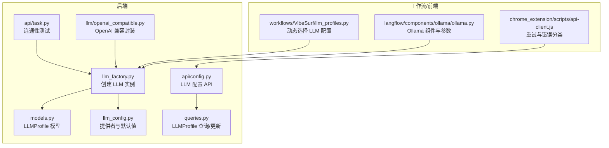
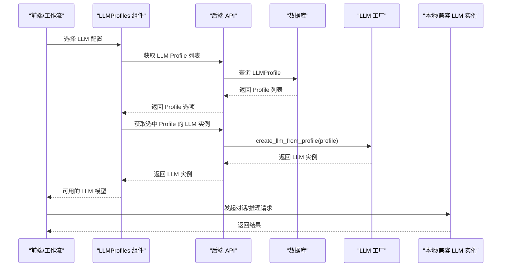
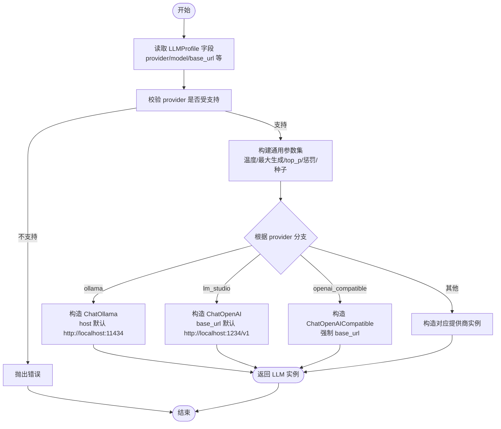
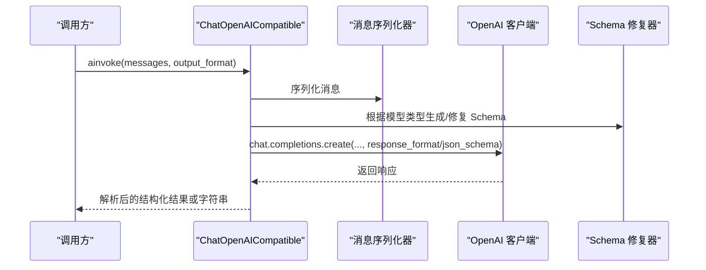
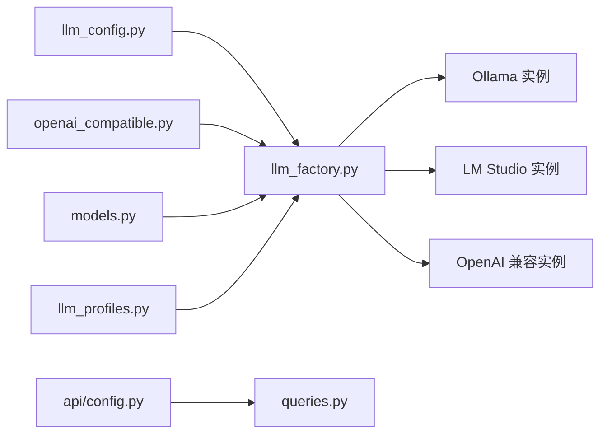

# 本地LLM支持

<cite>
**本文引用的文件**
- [llm_factory.py](file://vibe_surf/backend/utils/llm_factory.py)
- [openai_compatible.py](file://vibe_surf/llm/openai_compatible.py)
- [llm_config.py](file://vibe_surf/backend/llm_config.py)
- [models.py](file://vibe_surf/backend/database/models.py)
- [queries.py](file://vibe_surf/backend/database/queries.py)
- [config.py](file://vibe_surf/backend/api/config.py)
- [task.py](file://vibe_surf/backend/api/task.py)
- [llm_profiles.py](file://vibe_surf/workflows/VibeSurf/llm_profiles.py)
- [ollama.py](file://vibe_surf/langflow/components/ollama/ollama.py)
- [api-client.js](file://vibe_surf/chrome_extension/scripts/api-client.js)
- [README.md](file://README.md)
</cite>

## 目录
1. [简介](#简介)
2. [项目结构](#项目结构)
3. [核心组件](#核心组件)
4. [架构总览](#架构总览)
5. [详细组件分析](#详细组件分析)
6. [依赖关系分析](#依赖关系分析)
7. [性能考虑](#性能考虑)
8. [部署指南](#部署指南)
9. [与云提供商的差异](#与云提供商的差异)
10. [故障排除指南](#故障排除指南)
11. [结论](#结论)

## 简介
本文件系统性文档化 VibeSurf 对本地 LLM 的支持机制，重点覆盖：
- llm_factory 如何识别并初始化 Ollama、LM Studio 等本地运行时
- openai_compatible 如何为本地 LLM 提供 OpenAI 兼容接口，实现无缝切换
- 本地 LLM 配置参数（模型名、基础地址、温度、最大生成、上下文窗口、GPU 加速等）
- 性能优化策略（量化、批处理、缓存、路由与降级）
- 部署指南（硬件要求、依赖安装、启动配置）
- 与云提供商的差异（延迟、成本、隐私）
- 常见问题排查（连接失败、超时、响应异常）

## 项目结构
围绕本地 LLM 支持的关键模块分布如下：
- 后端工厂与配置：llm_factory、llm_config、数据库模型与查询
- OpenAI 兼容封装：openai_compatible
- 工作流与前端集成：llm_profiles、Langflow 组件（如 Ollama 组件）
- 前端扩展与错误重试：chrome 扩展 API 客户端
- 文档与安装：README

图表来源
- [llm_factory.py](file://vibe_surf/backend/utils/llm_factory.py#L23-L216)
- [llm_config.py](file://vibe_surf/backend/llm_config.py#L1-L226)
- [models.py](file://vibe_surf/backend/database/models.py#L57-L92)
- [queries.py](file://vibe_surf/backend/database/queries.py#L62-L249)
- [config.py](file://vibe_surf/backend/api/config.py#L77-L139)
- [task.py](file://vibe_surf/backend/api/task.py#L163-L182)
- [openai_compatible.py](file://vibe_surf/llm/openai_compatible.py#L63-L373)
- [llm_profiles.py](file://vibe_surf/workflows/VibeSurf/llm_profiles.py#L1-L104)
- [ollama.py](file://vibe_surf/langflow/components/ollama/ollama.py#L65-L229)
- [api-client.js](file://vibe_surf/chrome_extension/scripts/api-client.js#L91-L136)

章节来源
- [llm_factory.py](file://vibe_surf/backend/utils/llm_factory.py#L23-L216)
- [llm_config.py](file://vibe_surf/backend/llm_config.py#L1-L226)
- [models.py](file://vibe_surf/backend/database/models.py#L57-L92)
- [queries.py](file://vibe_surf/backend/database/queries.py#L62-L249)
- [config.py](file://vibe_surf/backend/api/config.py#L77-L139)
- [task.py](file://vibe_surf/backend/api/task.py#L163-L182)
- [openai_compatible.py](file://vibe_surf/llm/openai_compatible.py#L63-L373)
- [llm_profiles.py](file://vibe_surf/workflows/VibeSurf/llm_profiles.py#L1-L104)
- [ollama.py](file://vibe_surf/langflow/components/ollama/ollama.py#L65-L229)
- [api-client.js](file://vibe_surf/chrome_extension/scripts/api-client.js#L91-L136)

## 核心组件
- LLM 工厂（llm_factory）：根据 LLMProfile 动态创建不同提供商的 LLM 实例，支持本地 Ollama、LM Studio 以及 OpenAI 兼容模式
- OpenAI 兼容封装（openai_compatible）：在调用 OpenAI 兼容接口时自动修复特定模型的 JSON Schema，增强结构化输出稳定性
- 配置中心（llm_config）：集中维护支持的提供商、默认模型、是否需要 API Key/Base URL 等元数据
- 数据库模型（LLMProfile）：持久化存储 LLM 配置，含加密 API Key、温度、上下文等参数
- API 层（api/config、api/task）：提供 LLM Profile 的增删改查与连通性测试
- 工作流与前端（llm_profiles、Langflow Ollama 组件）：动态加载可用 LLM 配置，并在前端可视化配置本地模型参数
- 前端扩展（api-client.js）：对 LLM 连接失败进行特殊重试策略控制

章节来源
- [llm_factory.py](file://vibe_surf/backend/utils/llm_factory.py#L23-L216)
- [openai_compatible.py](file://vibe_surf/llm/openai_compatible.py#L63-L373)
- [llm_config.py](file://vibe_surf/backend/llm_config.py#L1-L226)
- [models.py](file://vibe_surf/backend/database/models.py#L57-L92)
- [queries.py](file://vibe_surf/backend/database/queries.py#L62-L249)
- [config.py](file://vibe_surf/backend/api/config.py#L77-L139)
- [task.py](file://vibe_surf/backend/api/task.py#L163-L182)
- [llm_profiles.py](file://vibe_surf/workflows/VibeSurf/llm_profiles.py#L1-L104)
- [ollama.py](file://vibe_surf/langflow/components/ollama/ollama.py#L65-L229)
- [api-client.js](file://vibe_surf/chrome_extension/scripts/api-client.js#L91-L136)

## 架构总览
下图展示从用户配置到实际推理调用的端到端流程，强调本地 LLM 的可插拔性与 OpenAI 兼容层的作用。

图表来源
- [llm_profiles.py](file://vibe_surf/workflows/VibeSurf/llm_profiles.py#L1-L104)
- [config.py](file://vibe_surf/backend/api/config.py#L77-L139)
- [llm_factory.py](file://vibe_surf/backend/utils/llm_factory.py#L23-L216)

## 详细组件分析

### LLM 工厂：识别与初始化本地运行时
- 支持的提供商与默认行为
  - Ollama：默认 host 为本地 11434 端口；支持通过 base_url 覆盖
  - LM Studio：默认 base_url 为本地 1234 端点
  - OpenAI 兼容：要求提供 base_url，用于对接第三方或本地兼容服务
- 参数映射与校验
  - 温度、最大生成、top_p、频率惩罚、随机种子等按提供商能力映射
  - 对 Azure OpenAI 强制要求 base_url（endpoint），对 AWS Bedrock 强制要求 region 等
- 错误处理
  - 创建失败统一记录日志并抛出运行时错误，便于上层捕获与提示

图表来源
- [llm_factory.py](file://vibe_surf/backend/utils/llm_factory.py#L23-L216)

章节来源
- [llm_factory.py](file://vibe_surf/backend/utils/llm_factory.py#L23-L216)

### OpenAI 兼容封装：结构化输出与模型适配
- 自动检测模型类型并应用相应 Schema 修复
  - Gemini：移除不受支持字段、解析 $ref、处理空对象属性
  - Kimi/Moonshot：移除不受支持关键字、在 anyOf 场景下移除默认值
  - Qwen/DeepSeek：在需要时将 JSON Schema 注入系统提示，提升结构化输出成功率
- 结构化输出流程
  - 生成优化后的 JSON Schema
  - 依据模型类型选择修复策略
  - 通过 response_format 或系统提示注入 Schema
  - 失败时尝试 JSON 修复工具进行容错解析
- 错误映射
  - 将速率限制、连接错误、状态码错误映射为统一的 ModelProviderError，便于上层处理

图表来源
- [openai_compatible.py](file://vibe_surf/llm/openai_compatible.py#L212-L373)

章节来源
- [openai_compatible.py](file://vibe_surf/llm/openai_compatible.py#L63-L373)

### 本地 LLM 配置参数与参数映射
- 数据库字段（LLMProfile）
  - provider、model、base_url、encrypted_api_key、temperature、max_tokens、top_p、frequency_penalty、seed、provider_config、is_active、is_default
- 工厂参数映射
  - 不同提供商支持的参数不同，例如 Ollama 在当前实现中未映射 max_tokens 等参数
  - OpenAI 兼容模式支持 temperature 与 max_tokens
- Langflow Ollama 组件参数
  - 上下文窗口（num_ctx）、GPU 数量（num_gpu）、线程数（num_thread）、重复抑制（repeat_last_n）、Mirostat 设置等
  - 支持实时刷新可用模型列表与校验 Ollama URL 可达性

章节来源
- [models.py](file://vibe_surf/backend/database/models.py#L57-L92)
- [llm_factory.py](file://vibe_surf/backend/utils/llm_factory.py#L34-L62)
- [ollama.py](file://vibe_surf/langflow/components/ollama/ollama.py#L65-L229)

### API 与工作流：Profile 管理与动态加载
- API
  - 创建/更新/删除/列出 LLM Profile，支持设置默认 Profile
  - 更新时对 API Key 进行加密存储
- 工作流
  - LLMProfiles 组件动态获取可用 Profile 名称与默认 Profile
  - 根据选中的 Profile 调用工厂创建 LLM 实例
- 连通性测试
  - 在任务执行前使用简单问题测试 LLM 可用性，确保配置正确

章节来源
- [config.py](file://vibe_surf/backend/api/config.py#L77-L139)
- [queries.py](file://vibe_surf/backend/database/queries.py#L62-L249)
- [llm_profiles.py](file://vibe_surf/workflows/VibeSurf/llm_profiles.py#L1-L104)
- [task.py](file://vibe_surf/backend/api/task.py#L163-L182)

## 依赖关系分析
- 组件耦合
  - llm_factory 依赖 llm_config 的提供商元数据与支持列表
  - openai_compatible 依赖浏览器用库的 ChatOpenAI 与消息序列化器
  - 工作流与 API 通过数据库查询访问 LLMProfile
- 外部依赖
  - Ollama 本地服务（默认 http://localhost:11434）
  - LM Studio 本地服务（默认 http://localhost:1234/v1）
  - OpenAI 兼容服务（需提供 base_url）

图表来源
- [llm_config.py](file://vibe_surf/backend/llm_config.py#L1-L226)
- [llm_factory.py](file://vibe_surf/backend/utils/llm_factory.py#L23-L216)
- [openai_compatible.py](file://vibe_surf/llm/openai_compatible.py#L63-L373)
- [models.py](file://vibe_surf/backend/database/models.py#L57-L92)
- [queries.py](file://vibe_surf/backend/database/queries.py#L62-L249)
- [config.py](file://vibe_surf/backend/api/config.py#L77-L139)
- [llm_profiles.py](file://vibe_surf/workflows/VibeSurf/llm_profiles.py#L1-L104)

## 性能考虑
- 量化与上下文窗口
  - 通过 Langflow Ollama 组件参数（num_ctx、num_gpu、num_thread、repeat_last_n、Mirostat）调节推理性能与质量
- 批处理与并发
  - Langflow 组件提供并发请求上限与重试次数等参数，可在前端可视化调整
- 缓存与路由
  - Langflow 中存在 LLM 路由组件，可根据输入与偏好选择最优模型，具备降级回退逻辑
- 结构化输出容错
  - openai_compatible 在解析失败时尝试 JSON 修复，提高鲁棒性

章节来源
- [ollama.py](file://vibe_surf/langflow/components/ollama/ollama.py#L65-L229)
- [openai_compatible.py](file://vibe_surf/llm/openai_compatible.py#L212-L373)

## 部署指南
- 硬件要求
  - 本地 LLM 推荐具备独立显卡（GPU）与充足显存，以便在本地高效推理
  - CPU 与内存应满足所选模型的最低要求
- 依赖安装
  - 安装 Ollama 或 LM Studio 并拉取目标模型
  - 启动本地服务，确保端口可达（默认 Ollama: 11434，LM Studio: 1234）
- 启动配置
  - 在后端通过 API 创建 LLM Profile，填写 provider、model、base_url、参数等
  - 使用工作流组件选择 Profile 并发起推理
- 前端扩展
  - 若无法自动加载扩展，请手动加载扩展包并启用开发者模式

章节来源
- [README.md](file://README.md#L38-L81)
- [ollama.py](file://vibe_surf/langflow/components/ollama/ollama.py#L294-L330)

## 与云提供商的差异
- 延迟
  - 本地 LLM 通常具有更低的网络往返延迟，适合高频交互场景
- 成本
  - 本地推理无按次计费，但需要自购硬件与维护成本
- 隐私
  - 本地推理避免将敏感数据发送至外部服务，符合隐私合规要求
- 能力与生态
  - 云提供商通常提供更丰富的模型生态与工具调用能力，本地 LLM 在工具调用方面可能受限于本地运行时能力

## 故障排除指南
- 连接失败
  - 检查本地服务是否启动且端口可达（Ollama: 11434，LM Studio: 1234）
  - 确认 LLM Profile 的 base_url 正确
  - Langflow Ollama 组件会自动校验 URL 可达性并刷新可用模型列表
- 超时与重试
  - 前端扩展对 LLM 连接失败进行特殊重试控制，避免对客户端错误与 LLM 连接失败进行无意义重试
- 响应异常
  - openai_compatible 在结构化输出解析失败时尝试 JSON 修复
  - API 层提供连通性测试，快速定位配置问题

章节来源
- [ollama.py](file://vibe_surf/langflow/components/ollama/ollama.py#L185-L254)
- [api-client.js](file://vibe_surf/chrome_extension/scripts/api-client.js#L91-L136)
- [task.py](file://vibe_surf/backend/api/task.py#L163-L182)
- [openai_compatible.py](file://vibe_surf/llm/openai_compatible.py#L312-L373)

## 结论
VibeSurf 通过“配置即代码”的方式，将本地 LLM（Ollama、LM Studio）与 OpenAI 兼容接口统一抽象为 LLM 工厂，配合数据库持久化与工作流动态加载，实现了本地推理的即插即用。结合 Langflow 的参数化与可视化能力，用户可以灵活地在本地与云端之间切换，兼顾隐私、成本与性能。建议在生产环境中优先采用本地推理以降低延迟与成本，并通过参数调优与结构化输出容错机制提升稳定性。