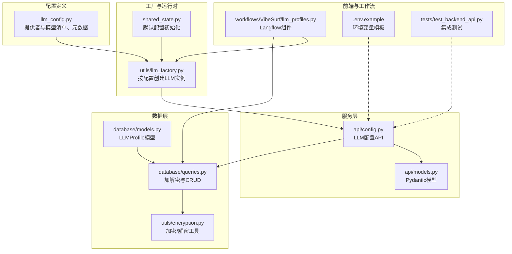
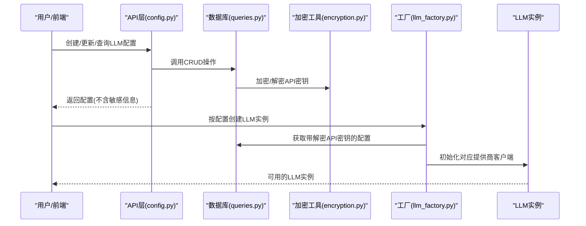
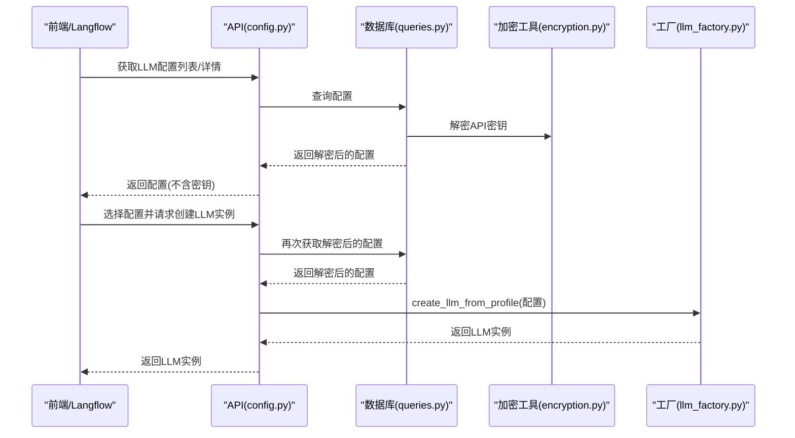
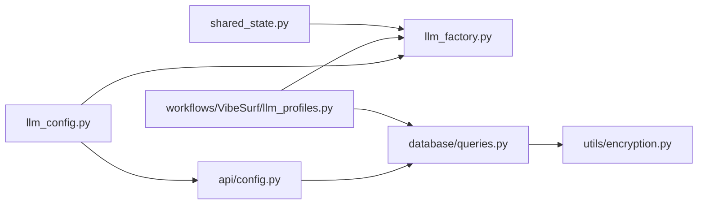

# LLM配置管理

<cite>
**本文引用的文件**
- [vibe_surf/backend/llm_config.py](file://vibe_surf/backend/llm_config.py)
- [vibe_surf/backend/utils/llm_factory.py](file://vibe_surf/backend/utils/llm_factory.py)
- [vibe_surf/backend/database/models.py](file://vibe_surf/backend/database/models.py)
- [vibe_surf/backend/database/queries.py](file://vibe_surf/backend/database/queries.py)
- [vibe_surf/backend/api/config.py](file://vibe_surf/backend/api/config.py)
- [vibe_surf/backend/api/models.py](file://vibe_surf/backend/api/models.py)
- [vibe_surf/backend/utils/encryption.py](file://vibe_surf/backend/utils/encryption.py)
- [.env.example](file://.env.example)
- [vibe_surf/workflows/VibeSurf/llm_profiles.py](file://vibe_surf/workflows/VibeSurf/llm_profiles.py)
- [vibe_surf/backend/shared_state.py](file://vibe_surf/backend/shared_state.py)
- [tests/test_backend_api.py](file://tests/test_backend_api.py)
</cite>

## 目录
1. [简介](#简介)
2. [项目结构](#项目结构)
3. [核心组件](#核心组件)
4. [架构总览](#架构总览)
5. [详细组件分析](#详细组件分析)
6. [依赖关系分析](#依赖关系分析)
7. [性能与安全性考量](#性能与安全性考量)
8. [故障排查指南](#故障排查指南)
9. [结论](#结论)
10. [附录：配置示例与最佳实践](#附录配置示例与最佳实践)

## 简介
本文件系统化文档化VibeSurf的LLM配置管理系统，覆盖以下方面：
- 配置结构与元数据：如何定义与管理不同LLM提供商的配置参数（API密钥、基础URL、模型名称等）
- 安全密钥管理：通过数据库加密存储与解密流程，结合环境变量与配置文件的安全策略
- 配置验证机制：在创建、更新与实例化阶段的参数校验与约束
- 加载与解析流程：从数据库到工厂类再到运行时LLM实例的完整链路
- 动态更新能力：支持运行时切换默认配置与按需刷新

## 项目结构
围绕LLM配置管理的关键模块分布如下：
- 配置定义与元数据：集中于后端配置模块
- 数据模型与查询：封装LLM配置的持久化与加解密
- API接口：提供CRUD与默认配置查询等REST接口
- 工厂与实例化：根据配置动态创建对应LLM客户端
- 前端与工作流：前端界面与Langflow工作流中读取与选择配置
- 测试用例：覆盖配置管理的端到端流程

图表来源
- [vibe_surf/backend/llm_config.py](file://vibe_surf/backend/llm_config.py#L1-L226)
- [vibe_surf/backend/database/models.py](file://vibe_surf/backend/database/models.py#L57-L92)
- [vibe_surf/backend/database/queries.py](file://vibe_surf/backend/database/queries.py#L1-L200)
- [vibe_surf/backend/utils/encryption.py](file://vibe_surf/backend/utils/encryption.py#L1-L172)
- [vibe_surf/backend/api/config.py](file://vibe_surf/backend/api/config.py#L1-L200)
- [vibe_surf/backend/api/models.py](file://vibe_surf/backend/api/models.py#L30-L68)
- [vibe_surf/backend/utils/llm_factory.py](file://vibe_surf/backend/utils/llm_factory.py#L1-L275)
- [vibe_surf/backend/shared_state.py](file://vibe_surf/backend/shared_state.py#L613-L633)
- [vibe_surf/workflows/VibeSurf/llm_profiles.py](file://vibe_surf/workflows/VibeSurf/llm_profiles.py#L1-L104)
- [.env.example](file://.env.example#L1-L55)
- [tests/test_backend_api.py](file://tests/test_backend_api.py#L115-L205)

章节来源
- [vibe_surf/backend/llm_config.py](file://vibe_surf/backend/llm_config.py#L1-L226)
- [vibe_surf/backend/database/models.py](file://vibe_surf/backend/database/models.py#L57-L92)
- [vibe_surf/backend/database/queries.py](file://vibe_surf/backend/database/queries.py#L1-L200)
- [vibe_surf/backend/api/config.py](file://vibe_surf/backend/api/config.py#L1-L200)
- [vibe_surf/backend/utils/llm_factory.py](file://vibe_surf/backend/utils/llm_factory.py#L1-L275)
- [vibe_surf/backend/shared_state.py](file://vibe_surf/backend/shared_state.py#L613-L633)
- [vibe_surf/workflows/VibeSurf/llm_profiles.py](file://vibe_surf/workflows/VibeSurf/llm_profiles.py#L1-L104)
- [.env.example](file://.env.example#L1-L55)
- [tests/test_backend_api.py](file://tests/test_backend_api.py#L115-L205)

## 核心组件
- 配置清单与元数据
  - 提供者列表与模型清单：集中定义各提供商支持的模型集合
  - 元数据字典：描述每个提供商的显示名、是否需要API密钥、是否需要基础URL、默认模型、默认基础URL等
  - 查询函数：提供获取支持的提供商、模型、元数据、默认模型等能力

- 数据模型与查询
  - LLMProfile模型：包含配置字段（提供商、模型、基础URL、温度、最大令牌数、top_p、频率惩罚、种子、提供商特定配置）与状态字段（激活、默认、时间戳）
  - 查询操作：创建、查询、列表、更新（含API密钥加密）、删除；查询时返回解密后的API密钥用于实例化

- API接口
  - 提供LLM配置的创建、查询、列表、更新、设置默认等REST接口
  - 使用Pydantic模型进行请求/响应校验，避免敏感信息泄露

- 工厂与实例化
  - create_llm_from_profile：根据配置字典创建对应LLM客户端实例，处理参数支持差异与特殊参数映射
  - validate_llm_configuration：在创建实例前进行参数完整性与合规性校验
  - get_llm_creation_parameters：动态返回所需参数清单（含可选参数）

- 安全与环境
  - 加密工具：基于机器MAC地址或用户ID派生对称密钥，对API密钥进行加密存储与解密使用
  - 环境变量模板：提供常见提供商的环境变量键值示例，便于安全注入

章节来源
- [vibe_surf/backend/llm_config.py](file://vibe_surf/backend/llm_config.py#L1-L226)
- [vibe_surf/backend/database/models.py](file://vibe_surf/backend/database/models.py#L57-L92)
- [vibe_surf/backend/database/queries.py](file://vibe_surf/backend/database/queries.py#L1-L200)
- [vibe_surf/backend/api/config.py](file://vibe_surf/backend/api/config.py#L1-L200)
- [vibe_surf/backend/api/models.py](file://vibe_surf/backend/api/models.py#L30-L68)
- [vibe_surf/backend/utils/llm_factory.py](file://vibe_surf/backend/utils/llm_factory.py#L1-L275)
- [vibe_surf/backend/utils/encryption.py](file://vibe_surf/backend/utils/encryption.py#L1-L172)
- [.env.example](file://.env.example#L1-L55)

## 架构总览
下图展示了从“配置定义”到“运行时实例”的完整链路，以及“前端/Langflow工作流”如何消费这些配置。

图表来源
- [vibe_surf/backend/api/config.py](file://vibe_surf/backend/api/config.py#L1-L200)
- [vibe_surf/backend/database/queries.py](file://vibe_surf/backend/database/queries.py#L1-L200)
- [vibe_surf/backend/utils/encryption.py](file://vibe_surf/backend/utils/encryption.py#L1-L172)
- [vibe_surf/backend/utils/llm_factory.py](file://vibe_surf/backend/utils/llm_factory.py#L1-L275)

## 详细组件分析

### 配置定义与元数据（llm_config.py）
- 结构要点
  - LLM_PROVIDERS：以提供商名为键，值为该提供商支持的模型列表
  - PROVIDER_METADATA：以提供商名为键，包含显示名、是否需要API密钥、是否需要基础URL、默认模型、默认基础URL等
  - 查询函数：支持获取支持的提供商、某提供商的模型列表、元数据、默认模型等

- 设计意图
  - 将“支持的提供商/模型”与“元数据”解耦，便于扩展新提供商与统一参数支持判断
  - 通过元数据控制参数支持与默认值，减少工厂层分支逻辑复杂度

章节来源
- [vibe_surf/backend/llm_config.py](file://vibe_surf/backend/llm_config.py#L1-L226)

### 数据模型与查询（database/models.py, database/queries.py）
- 数据模型
  - LLMProfile：包含配置字段（provider、model、base_url、temperature、max_tokens、top_p、frequency_penalty、seed、provider_config）与状态字段（is_active、is_default、时间戳）
  - API密钥以加密形式存储，查询时返回解密后的密钥用于实例化

- 查询操作
  - create_profile：创建配置并加密API密钥
  - get_profile/get_profile_with_decrypted_key：按名称查询配置，后者返回解密后的API密钥
  - list_profiles：分页列出配置，支持仅活跃配置
  - update_profile：更新配置，若提供API密钥则重新加密
  - 删除与默认配置设置等

- 安全要点
  - API密钥仅在需要实例化时解密，且不随响应返回
  - 加密算法基于机器标识（MAC地址或用户ID），保证同一设备上一致的加解密

章节来源
- [vibe_surf/backend/database/models.py](file://vibe_surf/backend/database/models.py#L57-L92)
- [vibe_surf/backend/database/queries.py](file://vibe_surf/backend/database/queries.py#L1-L200)
- [vibe_surf/backend/utils/encryption.py](file://vibe_surf/backend/utils/encryption.py#L1-L172)

### API接口（api/config.py, api/models.py）
- 接口职责
  - 创建/更新/查询/列表/删除LLM配置
  - 设置默认配置（自动取消其他默认标记）
  - 返回响应模型不包含敏感信息（如API密钥）

- 请求/响应模型
  - 使用Pydantic模型进行输入输出校验，限制参数范围（如温度、最大令牌数等）

- 错误处理
  - 对唯一约束冲突、数据库异常等进行明确错误提示

章节来源
- [vibe_surf/backend/api/config.py](file://vibe_surf/backend/api/config.py#L1-L200)
- [vibe_surf/backend/api/models.py](file://vibe_surf/backend/api/models.py#L30-L68)

### 工厂与实例化（utils/llm_factory.py）
- 实例化流程
  - 从配置字典提取必要字段（提供商、模型、API密钥、基础URL、温度、最大令牌数、top_p、频率惩罚、种子、提供商特定配置）
  - 校验提供商是否受支持
  - 基于提供商参数支持表构建通用参数
  - 根据提供商类型创建对应LLM客户端（OpenAI、Anthropic、Google、Azure OpenAI、Groq、Ollama、OpenRouter、DeepSeek、AWS Bedrock、OpenAI兼容等）
  - 特殊处理：Azure OpenAI需要基础URL；OpenAI兼容类需要基础URL；AWS Bedrock需要AWS凭据；Ollama默认host为本地端点；LM Studio默认base_url等

- 参数支持与校验
  - 不同提供商支持的参数不同（如OpenRouter不支持max_tokens）
  - validate_llm_configuration在创建实例前进行完整性校验（提供商、模型、API密钥、基础URL等）

- 动态参数
  - get_llm_creation_parameters返回所需与可选参数清单，便于前端/工作流动态渲染

章节来源
- [vibe_surf/backend/utils/llm_factory.py](file://vibe_surf/backend/utils/llm_factory.py#L1-L275)

### 前端与工作流（workflows/VibeSurf/llm_profiles.py, shared_state.py）
- Langflow组件
  - LLMProfilesComponent：动态拉取可用LLM配置名称，支持默认配置与实时刷新
  - 选择配置后，通过查询与工厂创建LLM实例

- 默认配置初始化
  - shared_state在启动时尝试加载默认配置并创建LLM实例，失败时记录警告

章节来源
- [vibe_surf/workflows/VibeSurf/llm_profiles.py](file://vibe_surf/workflows/VibeSurf/llm_profiles.py#L1-L104)
- [vibe_surf/backend/shared_state.py](file://vibe_surf/backend/shared_state.py#L613-L633)

### 配置加载与解析流程（时序图）

图表来源
- [vibe_surf/backend/api/config.py](file://vibe_surf/backend/api/config.py#L1-L200)
- [vibe_surf/backend/database/queries.py](file://vibe_surf/backend/database/queries.py#L110-L142)
- [vibe_surf/backend/utils/encryption.py](file://vibe_surf/backend/utils/encryption.py#L1-L172)
- [vibe_surf/backend/utils/llm_factory.py](file://vibe_surf/backend/utils/llm_factory.py#L1-L275)

## 依赖关系分析
- 组件耦合
  - llm_config.py被llm_factory.py与API层共同依赖，用于统一提供商与模型清单、元数据
  - database/queries.py依赖utils/encryption.py进行加解密
  - api/config.py依赖database/queries.py与api/models.py
  - workflows/VibeSurf/llm_profiles.py依赖shared_state与llm_factory.py

- 外部依赖
  - 各大提供商SDK（OpenAI、Anthropic、Google、Groq、Ollama、OpenRouter、DeepSeek、AWS Bedrock等）
  - FastAPI（API层）
  - SQLAlchemy（数据库层）

图表来源
- [vibe_surf/backend/llm_config.py](file://vibe_surf/backend/llm_config.py#L1-L226)
- [vibe_surf/backend/utils/llm_factory.py](file://vibe_surf/backend/utils/llm_factory.py#L1-L275)
- [vibe_surf/backend/database/queries.py](file://vibe_surf/backend/database/queries.py#L1-L200)
- [vibe_surf/backend/utils/encryption.py](file://vibe_surf/backend/utils/encryption.py#L1-L172)
- [vibe_surf/workflows/VibeSurf/llm_profiles.py](file://vibe_surf/workflows/VibeSurf/llm_profiles.py#L1-L104)
- [vibe_surf/backend/shared_state.py](file://vibe_surf/backend/shared_state.py#L613-L633)

## 性能与安全性考量
- 性能
  - 查询时尽量一次性加载必要字段，避免懒加载导致的greenlet问题
  - 列表查询支持分页与排序，减少一次性返回大量数据
  - 默认配置初始化仅在启动时执行一次，后续通过工作流按需创建

- 安全
  - API密钥加密存储，解密仅在需要实例化的上下文中进行
  - 响应模型不包含敏感信息，避免泄露
  - 加密密钥基于机器标识派生，跨设备不可复用
  - 环境变量模板提供常见提供商键名，便于安全注入

[本节为通用指导，无需具体文件来源]

## 故障排查指南
- 常见错误与定位
  - “不支持的提供商”：检查提供商名称是否在llm_config.py中定义
  - “缺少API密钥”：确认PROVIDER_METADATA中标记了需要API密钥的提供商
  - “缺少基础URL”：Azure OpenAI、OpenAI兼容类等需要基础URL
  - “数据库唯一约束冲突”：配置名称重复，修改名称后重试
  - “解密失败”：确认当前设备与创建时使用的设备一致（或启用备用解密路径）

- 调试建议
  - 在API层捕获异常并打印日志，查看具体错误信息
  - 使用集成测试脚本验证配置管理全流程
  - 在Langflow工作流中先选择配置再创建实例，观察状态与错误提示

章节来源
- [vibe_surf/backend/utils/llm_factory.py](file://vibe_surf/backend/utils/llm_factory.py#L222-L275)
- [vibe_surf/backend/api/config.py](file://vibe_surf/backend/api/config.py#L120-L140)
- [tests/test_backend_api.py](file://tests/test_backend_api.py#L115-L205)

## 结论
VibeSurf的LLM配置管理系统通过“配置定义+数据模型+API接口+工厂实例化+安全加解密”的完整链路，实现了：
- 统一的提供商与模型管理
- 安全的密钥存储与传输
- 可扩展的参数支持与默认值策略
- 易用的前端与工作流集成
- 可靠的验证与错误处理

该体系既满足多云与本地部署场景，又兼顾安全与可维护性。

[本节为总结，无需具体文件来源]

## 附录：配置示例与最佳实践

### 如何通过环境变量或配置文件进行安全的密钥管理
- 环境变量模板
  - .env.example提供了常见提供商的环境变量键名，如OPENAI_API_KEY、AZURE_OPENAI_ENDPOINT等
  - 建议在部署环境中通过系统级环境变量或容器注入方式设置，避免硬编码

- 配置文件
  - 可使用Langflow的Dotenv组件将敏感内容以“全局变量密码”形式注入，再由API层读取

章节来源
- [.env.example](file://.env.example#L1-L55)
- [vibe_surf/langflow/components/datastax/dotenv.py](file://vibe_surf/langflow/components/datastax/dotenv.py#L1-L35)

### 配置验证机制
- 创建/更新时的参数校验
  - 必填项：提供商、模型
  - 条件必填：某些提供商需要API密钥或基础URL
  - 参数范围：温度、最大令牌数等参数范围校验
- 实例化前的二次校验
  - validate_llm_configuration在工厂层再次确认参数完整性

章节来源
- [vibe_surf/backend/utils/llm_factory.py](file://vibe_surf/backend/utils/llm_factory.py#L222-L275)
- [vibe_surf/backend/api/models.py](file://vibe_surf/backend/api/models.py#L30-L68)

### 配置示例（添加OpenAI、Anthropic、Groq、Ollama等）
- OpenAI
  - 提供商：openai
  - 模型：如gpt-4o-mini
  - API密钥：来自环境变量或配置
  - 基础URL：可选（OpenAI默认无需）

- Anthropic
  - 提供商：anthropic
  - 模型：如claude-3-7-sonnet-20250219
  - API密钥：来自环境变量或配置

- Groq
  - 提供商：groq
  - 模型：如moonshotai/kimi-k2-instruct
  - API密钥：来自环境变量或配置

- Ollama
  - 提供商：ollama
  - 模型：如qwen3:latest
  - 基础URL：默认http://localhost:11434，可自定义
  - API密钥：无需

- Azure OpenAI
  - 提供商：azure_openai
  - 模型：如gpt-4o-mini
  - API密钥：来自环境变量或配置
  - 基础URL：必须（azure_endpoint）

- OpenRouter/OpenAI兼容
  - 提供商：openrouter 或 openai_compatible
  - 模型：如moonshotai/kimi-k2
  - API密钥：来自环境变量或配置
  - 基础URL：必须

- AWS Bedrock
  - 提供商：aws_bedrock 或 anthropic_bedrock
  - 模型：如anthropic.claude-3-7-sonnet-20250219-v1:0
  - AWS凭据：aws_access_key_id、aws_secret_access_key、aws_region（默认us-east-1）
  - API密钥：作为aws_access_key_id传入

- LM Studio
  - 提供商：lm_studio
  - 模型：如qwen/qwen3-14b
  - 基础URL：默认http://localhost:1234/v1
  - API密钥：固定值（lm_studio）

章节来源
- [vibe_surf/backend/llm_config.py](file://vibe_surf/backend/llm_config.py#L1-L226)
- [vibe_surf/backend/utils/llm_factory.py](file://vibe_surf/backend/utils/llm_factory.py#L1-L275)

### 配置的加载与解析流程（端到端）
- 前端/Langflow选择配置
  - 通过LLMProfilesComponent动态获取可用配置名称
- API层处理
  - 调用LLMProfileQueries获取配置（必要时解密API密钥）
  - 返回不含敏感信息的配置给前端
- 工厂层实例化
  - create_llm_from_profile根据配置创建对应LLM客户端
  - validate_llm_configuration确保参数有效
- 默认配置初始化
  - shared_state在启动时尝试加载默认配置并创建LLM实例

章节来源
- [vibe_surf/workflows/VibeSurf/llm_profiles.py](file://vibe_surf/workflows/VibeSurf/llm_profiles.py#L1-L104)
- [vibe_surf/backend/api/config.py](file://vibe_surf/backend/api/config.py#L1-L200)
- [vibe_surf/backend/database/queries.py](file://vibe_surf/backend/database/queries.py#L110-L142)
- [vibe_surf/backend/utils/llm_factory.py](file://vibe_surf/backend/utils/llm_factory.py#L1-L275)
- [vibe_surf/backend/shared_state.py](file://vibe_surf/backend/shared_state.py#L613-L633)

### 运行时动态更新配置
- 更新配置
  - 通过API更新LLM配置，若提供API密钥则重新加密
- 设置默认配置
  - 将某配置设为默认，系统会自动取消其他默认标记
- Langflow工作流
  - LLMProfilesComponent支持实时刷新配置选项，选择新默认配置后重新创建LLM实例

章节来源
- [vibe_surf/backend/api/config.py](file://vibe_surf/backend/api/config.py#L1-L200)
- [vibe_surf/workflows/VibeSurf/llm_profiles.py](file://vibe_surf/workflows/VibeSurf/llm_profiles.py#L1-L104)
- [tests/test_backend_api.py](file://tests/test_backend_api.py#L115-L205)