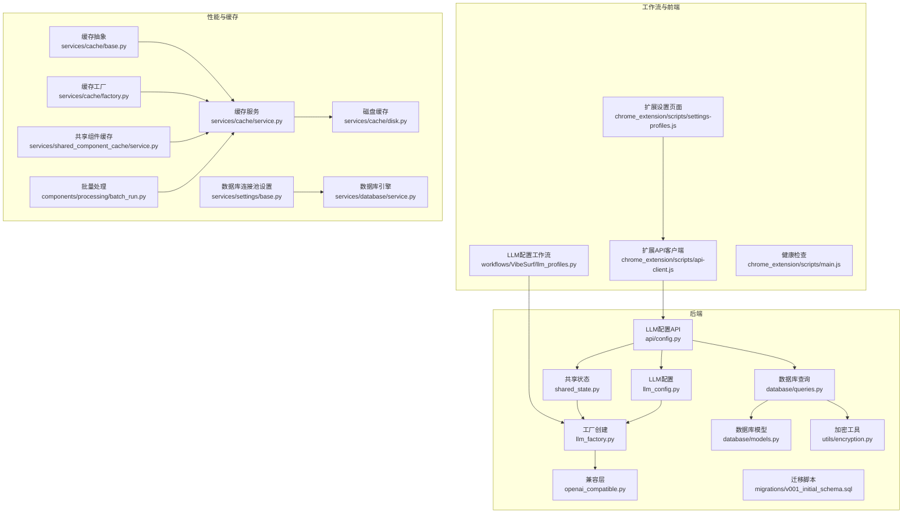
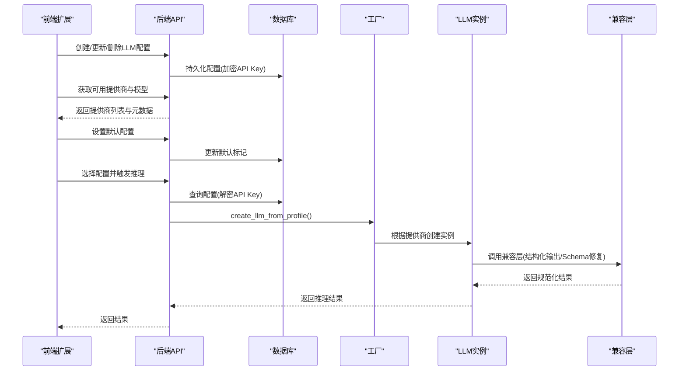
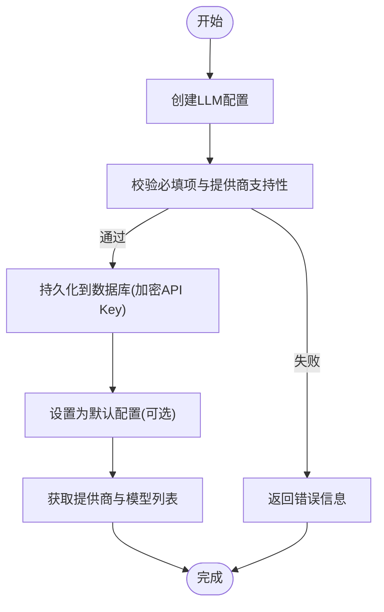
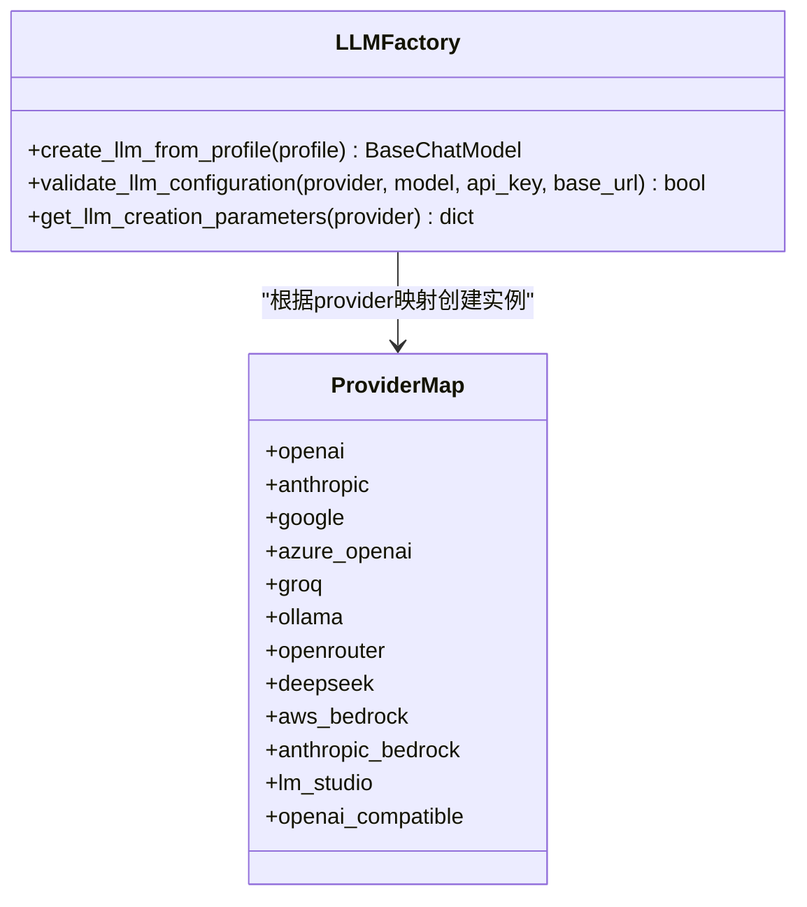
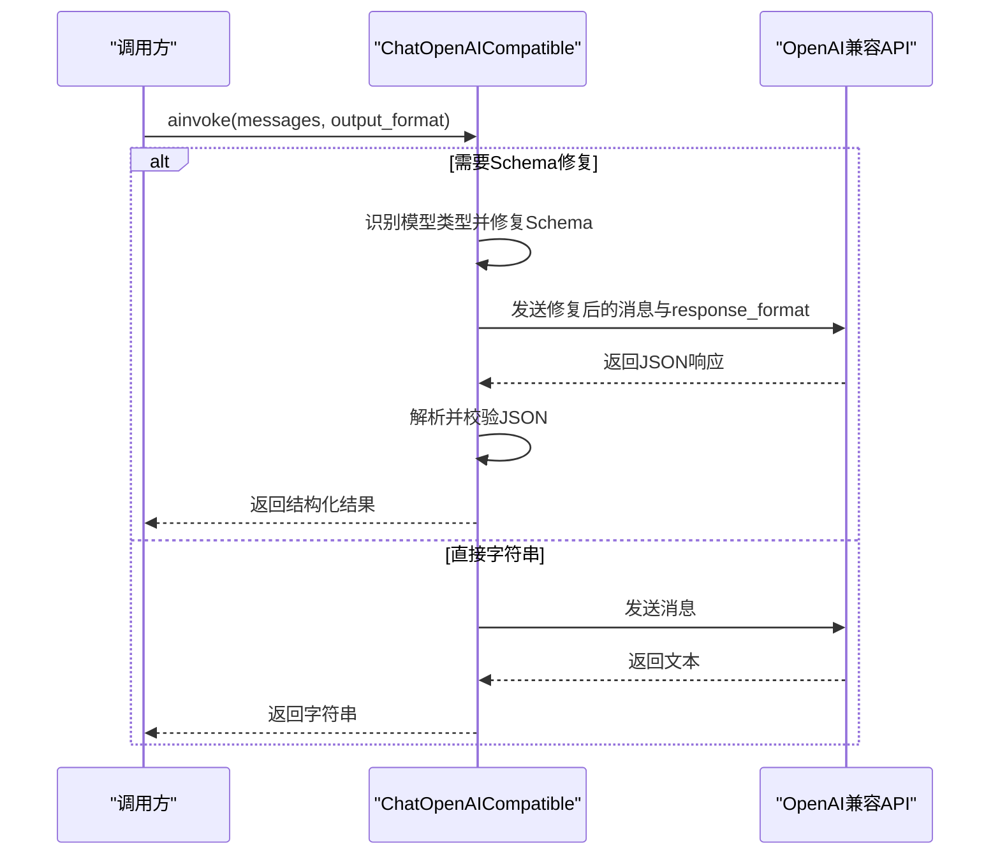
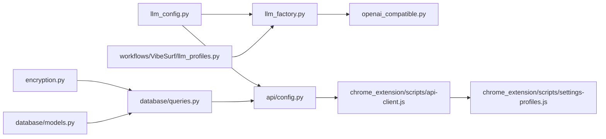

# LLM集成

<cite>
**本文引用的文件**
- [llm_factory.py](file://vibe_surf/backend/utils/llm_factory.py)
- [openai_compatible.py](file://vibe_surf/llm/openai_compatible.py)
- [llm_config.py](file://vibe_surf/backend/llm_config.py)
- [config.py](file://vibe_surf/backend/api/config.py)
- [models.py](file://vibe_surf/backend/api/models.py)
- [queries.py](file://vibe_surf/backend/database/queries.py)
- [models.py](file://vibe_surf/backend/database/models.py)
- [v001_initial_schema.sql](file://vibe_surf/backend/database/migrations/v001_initial_schema.sql)
- [llm_profiles.py](file://vibe_surf/workflows/VibeSurf/llm_profiles.py)
- [shared_state.py](file://vibe_surf/backend/shared_state.py)
- [encryption.py](file://vibe_surf/backend/utils/encryption.py)
- [ollama.py](file://vibe_surf/langflow/components/ollama/ollama.py)
- [settings/base.py](file://vibe_surf/langflow/services/settings/base.py)
- [service.py](file://vibe_surf/langflow/services/database/service.py)
- [cache/base.py](file://vibe_surf/langflow/services/cache/base.py)
- [cache/service.py](file://vibe_surf/langflow/services/cache/service.py)
- [cache/factory.py](file://vibe_surf/langflow/services/cache/factory.py)
- [cache/disk.py](file://vibe_surf/langflow/services/cache/disk.py)
- [cache.py](file://vibe_surf/langflow/services/chat/cache.py)
- [shared_component_cache/service.py](file://vibe_surf/langflow/services/shared_component_cache/service.py)
- [batch_run.py](file://vibe_surf/langflow/components/processing/batch_run.py)
- [main.js](file://vibe_surf/chrome_extension/scripts/main.js)
- [api-client.js](file://vibe_surf/chrome_extension/scripts/api-client.js)
- [settings-profiles.js](file://vibe_surf/chrome_extension/scripts/settings-profiles.js)
</cite>

## 目录
1. [引言](#引言)
2. [项目结构](#项目结构)
3. [核心组件](#核心组件)
4. [架构总览](#架构总览)
5. [详细组件分析](#详细组件分析)
6. [依赖关系分析](#依赖关系分析)
7. [性能考量](#性能考量)
8. [故障排查指南](#故障排查指南)
9. [结论](#结论)
10. [附录](#附录)

## 引言
本文件系统性文档化VibeSurf的LLM集成体系，覆盖LLM配置管理、工厂模式创建实例、OpenAI兼容层、本地LLM支持、性能调优与安全策略。目标是帮助开发者快速理解并扩展多提供商LLM能力，同时在生产环境中保证稳定性与安全性。

## 项目结构
围绕LLM集成的关键目录与文件：
- 后端工具与配置：backend/utils/llm_factory.py、backend/llm_config.py、backend/api/config.py、backend/api/models.py、backend/database/queries.py、backend/database/models.py、backend/database/migrations/v001_initial_schema.sql、backend/utils/encryption.py、backend/shared_state.py
- LLM兼容层：llm/openai_compatible.py
- 工作流与前端交互：workflows/VibeSurf/llm_profiles.py、chrome_extension/scripts/settings-profiles.js、chrome_extension/scripts/api-client.js、chrome_extension/scripts/main.js
- 性能与缓存：langflow/services/cache/*、langflow/components/processing/batch_run.py、langflow/services/settings/base.py、langflow/services/database/service.py

图表来源
- [llm_config.py](file://vibe_surf/backend/llm_config.py#L1-L226)
- [llm_factory.py](file://vibe_surf/backend/utils/llm_factory.py#L1-L275)
- [openai_compatible.py](file://vibe_surf/llm/openai_compatible.py#L1-L373)
- [config.py](file://vibe_surf/backend/api/config.py#L77-L642)
- [models.py](file://vibe_surf/backend/database/models.py#L57-L92)
- [queries.py](file://vibe_surf/backend/database/queries.py#L62-L249)
- [v001_initial_schema.sql](file://vibe_surf/backend/database/migrations/v001_initial_schema.sql#L1-L28)
- [encryption.py](file://vibe_surf/backend/utils/encryption.py#L1-L172)
- [shared_state.py](file://vibe_surf/backend/shared_state.py#L453-L682)
- [llm_profiles.py](file://vibe_surf/workflows/VibeSurf/llm_profiles.py#L1-L104)
- [settings-profiles.js](file://vibe_surf/chrome_extension/scripts/settings-profiles.js#L200-L229)
- [api-client.js](file://vibe_surf/chrome_extension/scripts/api-client.js#L365-L405)
- [main.js](file://vibe_surf/chrome_extension/scripts/main.js#L211-L239)
- [cache/base.py](file://vibe_surf/langflow/services/cache/base.py#L1-L145)
- [cache/service.py](file://vibe_surf/langflow/services/cache/service.py#L1-L179)
- [cache/disk.py](file://vibe_surf/langflow/services/cache/disk.py#L1-L31)
- [cache/factory.py](file://vibe_surf/langflow/services/cache/factory.py#L1-L33)
- [shared_component_cache/service.py](file://vibe_surf/langflow/services/shared_component_cache/service.py#L1-L7)
- [batch_run.py](file://vibe_surf/langflow/components/processing/batch_run.py#L193-L205)
- [settings/base.py](file://vibe_surf/langflow/services/settings/base.py#L97-L141)
- [service.py](file://vibe_surf/langflow/services/database/service.py#L113-L141)

章节来源
- [llm_config.py](file://vibe_surf/backend/llm_config.py#L1-L226)
- [llm_factory.py](file://vibe_surf/backend/utils/llm_factory.py#L1-L275)
- [openai_compatible.py](file://vibe_surf/llm/openai_compatible.py#L1-L373)
- [config.py](file://vibe_surf/backend/api/config.py#L77-L642)
- [models.py](file://vibe_surf/backend/database/models.py#L57-L92)
- [queries.py](file://vibe_surf/backend/database/queries.py#L62-L249)
- [v001_initial_schema.sql](file://vibe_surf/backend/database/migrations/v001_initial_schema.sql#L1-L28)
- [encryption.py](file://vibe_surf/backend/utils/encryption.py#L1-L172)
- [shared_state.py](file://vibe_surf/backend/shared_state.py#L453-L682)
- [llm_profiles.py](file://vibe_surf/workflows/VibeSurf/llm_profiles.py#L1-L104)
- [settings-profiles.js](file://vibe_surf/chrome_extension/scripts/settings-profiles.js#L200-L229)
- [api-client.js](file://vibe_surf/chrome_extension/scripts/api-client.js#L365-L405)
- [main.js](file://vibe_surf/chrome_extension/scripts/main.js#L211-L239)
- [cache/base.py](file://vibe_surf/langflow/services/cache/base.py#L1-L145)
- [cache/service.py](file://vibe_surf/langflow/services/cache/service.py#L1-L179)
- [cache/disk.py](file://vibe_surf/langflow/services/cache/disk.py#L1-L31)
- [cache/factory.py](file://vibe_surf/langflow/services/cache/factory.py#L1-L33)
- [shared_component_cache/service.py](file://vibe_surf/langflow/services/shared_component_cache/service.py#L1-L7)
- [batch_run.py](file://vibe_surf/langflow/components/processing/batch_run.py#L193-L205)
- [settings/base.py](file://vibe_surf/langflow/services/settings/base.py#L97-L141)
- [service.py](file://vibe_surf/langflow/services/database/service.py#L113-L141)

## 核心组件
- LLM配置中心：集中定义支持的提供商、默认模型、元数据（是否需要API Key、是否需要base_url、是否支持工具/视觉等）。
- 工厂模式：根据配置动态创建对应LLM实例，统一参数校验与异常处理。
- 兼容层：对OpenAI兼容API进行Schema修复与响应格式处理，适配特定模型（如Gemini、Kimi、Qwen、DeepSeek）。
- 数据库与API：LLM配置持久化、增删改查、默认配置切换；前端通过扩展API进行管理。
- 加密与安全：API Key加密存储与解密；认证与鉴权机制。
- 性能与缓存：连接池、内存/磁盘缓存、批量处理、共享组件缓存。

章节来源
- [llm_config.py](file://vibe_surf/backend/llm_config.py#L1-L226)
- [llm_factory.py](file://vibe_surf/backend/utils/llm_factory.py#L1-L275)
- [openai_compatible.py](file://vibe_surf/llm/openai_compatible.py#L1-L373)
- [config.py](file://vibe_surf/backend/api/config.py#L77-L642)
- [queries.py](file://vibe_surf/backend/database/queries.py#L62-L249)
- [models.py](file://vibe_surf/backend/database/models.py#L57-L92)
- [encryption.py](file://vibe_surf/backend/utils/encryption.py#L1-L172)
- [cache/service.py](file://vibe_surf/langflow/services/cache/service.py#L1-L179)
- [batch_run.py](file://vibe_surf/langflow/components/processing/batch_run.py#L193-L205)

## 架构总览
下图展示从“配置管理”到“实例创建”再到“兼容层处理”的端到端流程。

图表来源
- [config.py](file://vibe_surf/backend/api/config.py#L77-L343)
- [queries.py](file://vibe_surf/backend/database/queries.py#L62-L249)
- [llm_factory.py](file://vibe_surf/backend/utils/llm_factory.py#L23-L216)
- [openai_compatible.py](file://vibe_surf/llm/openai_compatible.py#L212-L373)
- [settings-profiles.js](file://vibe_surf/chrome_extension/scripts/settings-profiles.js#L200-L229)
- [api-client.js](file://vibe_surf/chrome_extension/scripts/api-client.js#L365-L405)

## 详细组件分析

### LLM配置管理与API
- 提供商与模型：集中维护支持的提供商与模型清单，并提供元数据（是否需要API Key、是否需要base_url、是否支持工具/视觉、默认模型等）。
- 配置API：提供LLM配置的增删改查、设置默认配置、获取可用提供商与模型列表。
- 前端交互：扩展页面通过API客户端调用后端接口，动态生成表单并提交配置。

图表来源
- [llm_config.py](file://vibe_surf/backend/llm_config.py#L1-L226)
- [config.py](file://vibe_surf/backend/api/config.py#L77-L343)
- [models.py](file://vibe_surf/backend/database/models.py#L57-L92)
- [queries.py](file://vibe_surf/backend/database/queries.py#L62-L249)
- [settings-profiles.js](file://vibe_surf/chrome_extension/scripts/settings-profiles.js#L200-L229)
- [api-client.js](file://vibe_surf/chrome_extension/scripts/api-client.js#L365-L405)

章节来源
- [llm_config.py](file://vibe_surf/backend/llm_config.py#L1-L226)
- [config.py](file://vibe_surf/backend/api/config.py#L77-L642)
- [models.py](file://vibe_surf/backend/database/models.py#L57-L92)
- [queries.py](file://vibe_surf/backend/database/queries.py#L62-L249)
- [settings-profiles.js](file://vibe_surf/chrome_extension/scripts/settings-profiles.js#L200-L229)
- [api-client.js](file://vibe_surf/chrome_extension/scripts/api-client.js#L365-L405)

### 工厂模式：llm_factory.py
- 统一入口：根据配置字典或对象，解析provider/model/api_key/base_url等字段。
- 参数支持：按提供商定义支持的参数集合（如temperature、max_tokens、top_p、frequency_penalty、seed），自动过滤不支持的参数。
- 实例创建：针对不同提供商构造相应客户端（OpenAI、Anthropic、Google、Azure OpenAI、Groq、Ollama、OpenRouter、DeepSeek、AWS Bedrock、Anthropic Bedrock、LM Studio、OpenAI Compatible等）。
- 特殊处理：
  - Azure OpenAI需base_url（azure_endpoint）
  - Ollama默认host为本地端点
  - OpenAI Compatible需base_url
  - AWS Bedrock需额外的AWS凭据参数
- 校验与参数导出：提供validate_llm_configuration与get_llm_creation_parameters辅助前端表单与参数提示。

图表来源
- [llm_factory.py](file://vibe_surf/backend/utils/llm_factory.py#L23-L275)

章节来源
- [llm_factory.py](file://vibe_surf/backend/utils/llm_factory.py#L23-L275)

### 兼容层：openai_compatible.py
- 设计目标：将不同提供商的OpenAI兼容API调用标准化，自动修复Schema以适配特定模型。
- 支持模型类型：
  - Gemini：移除不支持的属性、解析$ref、处理空对象类型
  - Kimi/Moonshot：移除不支持的关键词（如min_items、title、default等）
  - Qwen/DeepSeek：在需要时将JSON Schema注入系统提示
- 结构化输出：当请求结构化输出时，自动应用Schema修复与JSON Schema响应格式，必要时通过系统提示注入Schema。
- 错误处理：捕获限流、连接、状态码等错误并转换为统一的ModelProviderError。

图表来源
- [openai_compatible.py](file://vibe_surf/llm/openai_compatible.py#L212-L373)

章节来源
- [openai_compatible.py](file://vibe_surf/llm/openai_compatible.py#L1-L373)

### 本地LLM支持：Ollama
- 配置方式：通过LLM配置的base_url指向Ollama服务，默认host为本地端口；也可在provider_config中传入更多参数。
- 模型发现：Langflow侧组件可调用Ollama API列出模型并过滤能力（如completion、tools）。
- 使用场景：适合离线推理、私有部署与低延迟场景。

章节来源
- [llm_factory.py](file://vibe_surf/backend/utils/llm_factory.py#L126-L135)
- [ollama.py](file://vibe_surf/langflow/components/ollama/ollama.py#L1-L330)

### 默认配置与运行时切换
- 初始化：启动时尝试从数据库加载默认LLM配置，若无则回退到环境变量。
- 运行时切换：通过共享状态模块动态更新全局LLM实例，保持成本统计等服务的一致性。

章节来源
- [shared_state.py](file://vibe_surf/backend/shared_state.py#L453-L682)
- [llm_profiles.py](file://vibe_surf/workflows/VibeSurf/llm_profiles.py#L1-L104)

## 依赖关系分析
- 配置层依赖：llm_config.py被llm_factory.py与API路由共同使用，确保一致性。
- 存储层依赖：queries.py依赖models.py与encryption.py，负责加密API Key的读写。
- 工厂依赖：llm_factory.py依赖llm_config.py与各提供商客户端类。
- 兼容层依赖：openai_compatible.py基于browser_use的ChatOpenAI与Schema优化器。
- 前端依赖：扩展脚本通过api-client.js调用后端API，settings-profiles.js动态渲染表单。

图表来源
- [llm_config.py](file://vibe_surf/backend/llm_config.py#L1-L226)
- [llm_factory.py](file://vibe_surf/backend/utils/llm_factory.py#L1-L275)
- [openai_compatible.py](file://vibe_surf/llm/openai_compatible.py#L1-L373)
- [config.py](file://vibe_surf/backend/api/config.py#L77-L642)
- [encryption.py](file://vibe_surf/backend/utils/encryption.py#L1-L172)
- [queries.py](file://vibe_surf/backend/database/queries.py#L62-L249)
- [models.py](file://vibe_surf/backend/database/models.py#L57-L92)
- [llm_profiles.py](file://vibe_surf/workflows/VibeSurf/llm_profiles.py#L1-L104)
- [api-client.js](file://vibe_surf/chrome_extension/scripts/api-client.js#L365-L405)
- [settings-profiles.js](file://vibe_surf/chrome_extension/scripts/settings-profiles.js#L200-L229)

章节来源
- [llm_config.py](file://vibe_surf/backend/llm_config.py#L1-L226)
- [llm_factory.py](file://vibe_surf/backend/utils/llm_factory.py#L1-L275)
- [openai_compatible.py](file://vibe_surf/llm/openai_compatible.py#L1-L373)
- [config.py](file://vibe_surf/backend/api/config.py#L77-L642)
- [encryption.py](file://vibe_surf/backend/utils/encryption.py#L1-L172)
- [queries.py](file://vibe_surf/backend/database/queries.py#L62-L249)
- [models.py](file://vibe_surf/backend/database/models.py#L57-L92)
- [llm_profiles.py](file://vibe_surf/workflows/VibeSurf/llm_profiles.py#L1-L104)
- [api-client.js](file://vibe_surf/chrome_extension/scripts/api-client.js#L365-L405)
- [settings-profiles.js](file://vibe_surf/chrome_extension/scripts/settings-profiles.js#L200-L229)

## 性能考量
- 连接池与数据库：通过settings/base.py与services/database/service.py配置连接池参数（pool_size、max_overflow、pool_timeout、pool_pre_ping、pool_recycle），提升并发与稳定性。
- 缓存策略：
  - 内存缓存：ThreadingInMemoryCache/AsyncInMemoryCache，适用于短期高频访问。
  - 磁盘缓存：AsyncDiskCache，适合跨进程/重启保留的数据。
  - 共享组件缓存：SharedComponentCacheService，减少重复初始化开销。
  - 缓存工厂：根据设置选择Redis或本地缓存。
- 批量处理：components/processing/batch_run.py提供批量执行与进度日志，降低单次调用开销。
- 并发与锁：缓存操作采用线程/异步锁，避免竞态；数据库连接池预检与回收，减少超时与死锁风险。

章节来源
- [settings/base.py](file://vibe_surf/langflow/services/settings/base.py#L97-L141)
- [service.py](file://vibe_surf/langflow/services/database/service.py#L113-L141)
- [cache/base.py](file://vibe_surf/langflow/services/cache/base.py#L1-L145)
- [cache/service.py](file://vibe_surf/langflow/services/cache/service.py#L1-L179)
- [cache/disk.py](file://vibe_surf/langflow/services/cache/disk.py#L1-L31)
- [cache/factory.py](file://vibe_surf/langflow/services/cache/factory.py#L1-L33)
- [shared_component_cache/service.py](file://vibe_surf/langflow/services/shared_component_cache/service.py#L1-L7)
- [batch_run.py](file://vibe_surf/langflow/components/processing/batch_run.py#L193-L205)

## 故障排查指南
- API Key问题：
  - 加密/解密失败：检查encryption.py的密钥派生与Fernet加解密流程，确认环境变量与用户ID回退逻辑。
  - 认证失败：后端API鉴权依赖API Key，缺失或无效会返回403。
- 连接与超时：
  - 数据库连接池：调整pool_pre_ping与pool_recycle，避免长时间空闲连接失效。
  - LLM提供商：兼容层捕获RateLimitError、APIConnectionError、APIStatusError并转换为统一错误。
- 健康检查：
  - 扩展端每30秒进行一次健康检查，若后端不可达，前端可提示用户重试或检查网络。
- 重复请求防护：
  - 前端可通过localStorage记录最近请求，避免短时间内重复GET请求。

章节来源
- [encryption.py](file://vibe_surf/backend/utils/encryption.py#L1-L172)
- [openai_compatible.py](file://vibe_surf/llm/openai_compatible.py#L341-L373)
- [settings/base.py](file://vibe_surf/langflow/services/settings/base.py#L97-L141)
- [service.py](file://vibe_surf/langflow/services/database/service.py#L113-L141)
- [main.js](file://vibe_surf/chrome_extension/scripts/main.js#L211-L239)

## 结论
VibeSurf的LLM集成以“配置中心+工厂模式+兼容层”为核心，既支持主流云端提供商，也兼容本地Ollama推理。通过数据库持久化与加密存储保障安全，结合缓存与连接池优化性能，并提供前端扩展管理界面与健康检查机制，形成完整的生产级LLM集成方案。

## 附录
- 添加新提供商步骤（示例）：
  1) 在llm_config.py中注册提供商名称、默认模型与元数据。
  2) 在llm_factory.py中新增elif分支，映射到对应客户端类与参数。
  3) 若需要兼容层修复，在openai_compatible.py中增加模型类型判断与修复逻辑。
  4) 在API路由中暴露该提供商的模型列表与元数据查询接口。
  5) 在前端扩展settings-profiles.js中动态渲染表单项并调用api-client.js提交配置。

章节来源
- [llm_config.py](file://vibe_surf/backend/llm_config.py#L1-L226)
- [llm_factory.py](file://vibe_surf/backend/utils/llm_factory.py#L83-L216)
- [openai_compatible.py](file://vibe_surf/llm/openai_compatible.py#L81-L174)
- [config.py](file://vibe_surf/backend/api/config.py#L585-L642)
- [settings-profiles.js](file://vibe_surf/chrome_extension/scripts/settings-profiles.js#L200-L229)
- [api-client.js](file://vibe_surf/chrome_extension/scripts/api-client.js#L365-L405)