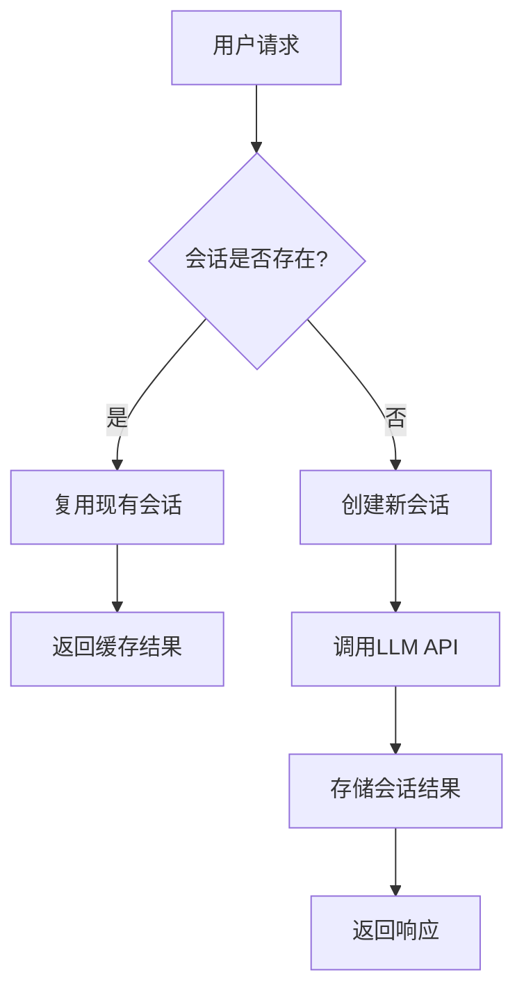
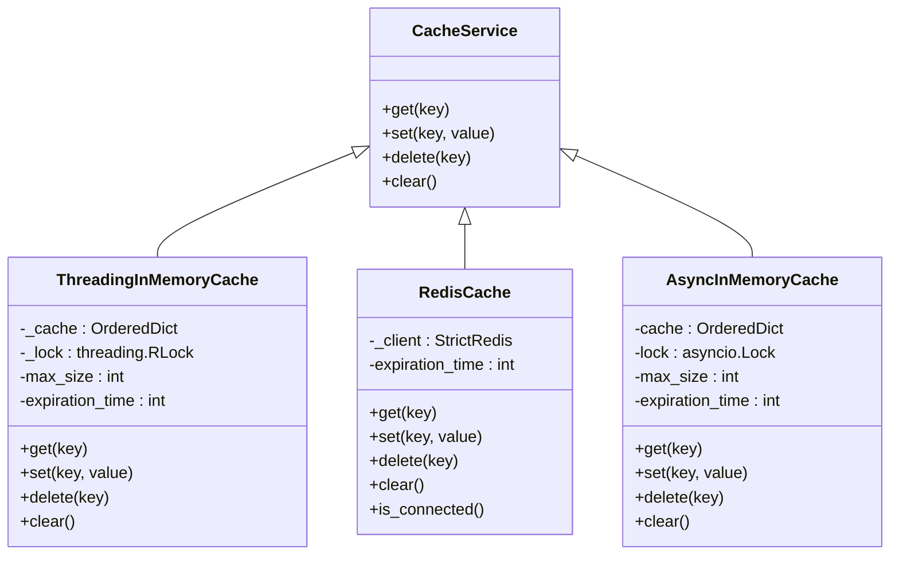
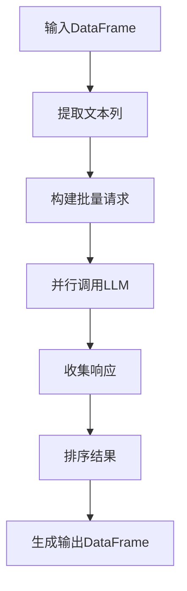
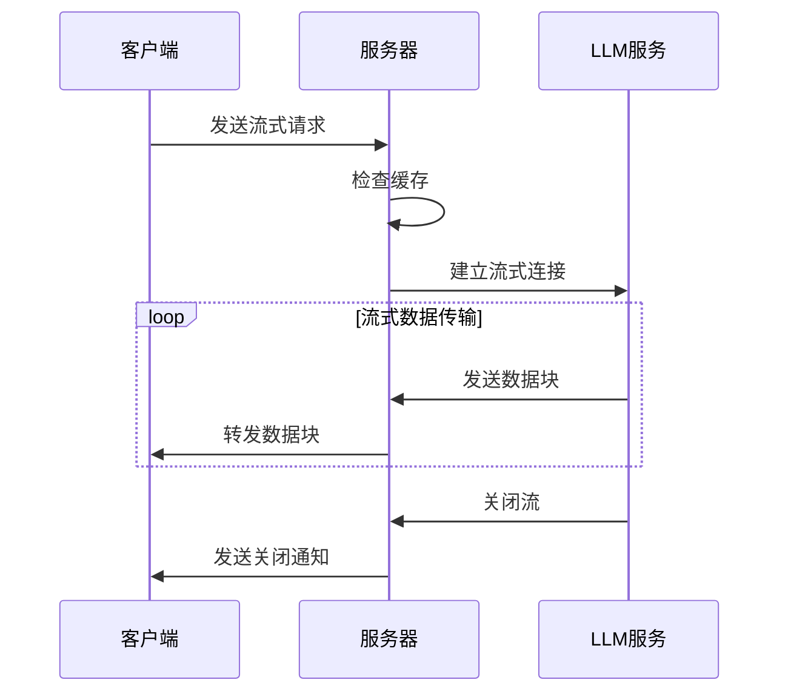
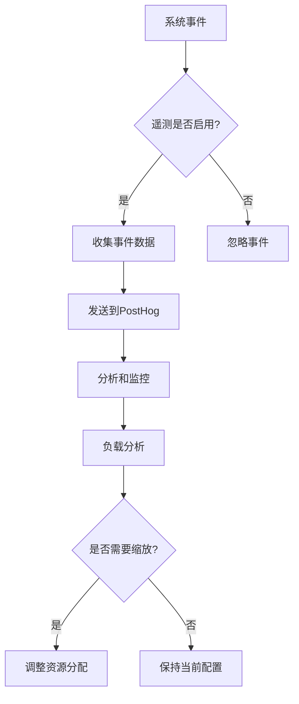

# 性能与优化

<cite>
**本文档引用的文件**
- [llm_factory.py](file://vibe_surf/backend/utils/llm_factory.py)
- [llm_config.py](file://vibe_surf/backend/llm_config.py)
- [service.py](file://vibe_surf/telemetry/service.py)
- [cache/service.py](file://vibe_surf/langflow/services/cache/service.py)
- [batch_run.py](file://vibe_surf/langflow/components/processing/batch_run.py)
- [chat.py](file://vibe_surf/langflow/api/v1/chat.py)
</cite>

## 目录
1. [连接池与会话复用](#连接池与会话复用)
2. [缓存策略](#缓存策略)
3. [批处理机制](#批处理机制)
4. [流式响应支持](#流式响应支持)
5. [负载监控与自动缩放](#负载监控与自动缩放)

## 连接池与会话复用

VibeSurf通过LLM工厂模式和会话管理机制实现了连接池和会话复用，有效减少了LLM API调用的延迟。系统通过`llm_factory.py`中的`create_llm_from_profile`函数根据配置文件动态创建LLM实例，支持多种提供商如OpenAI、Anthropic、Google等。每个LLM配置文件包含提供商、模型、API密钥、基础URL等参数，系统会根据这些参数创建相应的LLM实例。

会话复用通过在`langflow/services/session/service.py`中实现的会话服务来管理。系统使用`build_key`方法基于会话ID和数据图的哈希值生成唯一键，确保相同请求可以复用之前的会话结果。这种机制避免了重复的LLM调用，显著降低了响应延迟。

**图示来源**
- [llm_factory.py](file://vibe_surf/backend/utils/llm_factory.py#L23-L219)
- [service.py](file://vibe_surf/langflow/services/session/service.py#L42-L51)

**本节来源**
- [llm_factory.py](file://vibe_surf/backend/utils/llm_factory.py#L1-L275)
- [llm_config.py](file://vibe_surf/backend/llm_config.py#L1-L226)

## 缓存策略

VibeSurf实现了多层次的缓存策略，包括响应缓存和嵌入缓存，以提高系统性能和减少重复计算。

### 响应缓存

系统在`langflow/services/cache/service.py`中实现了多种缓存服务，包括内存缓存、Redis缓存和磁盘缓存。内存缓存使用`ThreadingInMemoryCache`类，基于有序字典实现LRU（最近最少使用）淘汰策略。缓存项包含值和时间戳，当访问缓存项时会检查是否过期。

**图示来源**
- [service.py](file://vibe_surf/langflow/services/cache/service.py#L22-L356)

### 嵌入缓存

嵌入缓存主要用于存储文本嵌入结果，避免重复计算。在`langflow/components/embeddings/text_embedder.py`中，系统会检查嵌入模型是否有效，然后对文本内容生成嵌入向量。嵌入结果会被缓存，以便后续请求可以直接使用。

**本节来源**
- [service.py](file://vibe_surf/langflow/services/cache/service.py#L1-L356)
- [text_embedder.py](file://vibe_surf/langflow/components/embeddings/text_embedder.py#L43-L65)

## 批处理机制

VibeSurf通过批处理机制将多个小请求合并，提高LLM资源的吞吐量。`batch_run.py`组件实现了批量运行功能，可以对DataFrame中的每一行数据进行批量处理。

批处理流程如下：
1. 接收包含多行数据的DataFrame
2. 提取指定列的文本内容
3. 构建批量对话请求
4. 使用LLM的`abatch`方法并行处理所有请求
5. 收集并排序响应结果
6. 生成包含原始数据和模型响应的新DataFrame

系统还实现了进度跟踪功能，在处理大量数据时会定期记录处理进度，确保用户可以了解批处理的执行状态。

**本节来源**
- [batch_run.py](file://vibe_surf/langflow/components/processing/batch_run.py#L1-L206)

## 流式响应支持

VibeSurf实现了流式响应支持，提供低延迟的实时文本生成体验。在`langflow/api/v1/chat.py`中，`_stream_vertex`函数处理流式请求，通过异步生成器逐步返回响应数据。

流式响应的工作流程：
1. 检查缓存是否存在
2. 获取图结构和顶点
3. 验证顶点是否支持流式
4. 通过`vertex.stream()`方法获取流式数据
5. 逐步发送数据块到客户端
6. 处理异常和关闭流

系统还支持实时语音模式，在`langflow/api/v1/voice_mode.py`中实现了与OpenAI实时API的集成，支持音频流的双向传输。

**本节来源**
- [chat.py](file://vibe_surf/langflow/api/v1/chat.py#L452-L534)
- [voice_mode.py](file://vibe_surf/langflow/api/v1/voice_mode.py#L960-L1305)

## 负载监控与自动缩放

VibeSurf通过全面的监控系统实现负载监控和资源管理。在`telemetry/service.py`中，`ProductTelemetry`类负责收集和发送匿名遥测数据，包括用户行为、系统性能等指标。

监控系统的主要特性：
- 使用PostHog作为分析平台
- 收集用户ID、事件名称和属性
- 支持调试日志记录
- 实现异常自动捕获

系统通过环境变量`VIBESURF_ANONYMIZED_TELEMETRY`控制遥测功能的启用状态。当遥测启用时，系统会收集用户ID（存储在本地文件中）和各种事件数据，用于分析系统使用模式和性能瓶颈。

虽然当前代码中没有明确的自动缩放逻辑，但监控数据可以用于后续实现基于负载的动态资源分配。例如，可以根据并发请求数、响应延迟等指标自动调整LLM实例的数量或选择不同的提供商。

**本节来源**
- [service.py](file://vibe_surf/telemetry/service.py#L1-L114)
- [opentelemetry.py](file://vibe_surf/langflow/services/telemetry/opentelemetry.py#L108-L253)