# 本地LLM支持

<cite>
**本文引用的文件**
- [vibe_surf/llm/openai_compatible.py](file://vibe_surf/llm/openai_compatible.py)
- [vibe_surf/backend/utils/llm_factory.py](file://vibe_surf/backend/utils/llm_factory.py)
- [vibe_surf/backend/llm_config.py](file://vibe_surf/backend/llm_config.py)
- [vibe_surf/backend/api/config.py](file://vibe_surf/backend/api/config.py)
- [vibe_surf/backend/database/models.py](file://vibe_surf/backend/database/models.py)
- [vibe_surf/backend/database/queries.py](file://vibe_surf/backend/database/queries.py)
- [vibe_surf/workflows/VibeSurf/llm_profiles.py](file://vibe_surf/workflows/VibeSurf/llm_profiles.py)
- [vibe_surf/langflow/components/ollama/ollama.py](file://vibe_surf/langflow/components/ollama/ollama.py)
- [vibe_surf/telemetry/service.py](file://vibe_surf/telemetry/service.py)
</cite>

## 目录
1. [简介](#简介)
2. [项目结构](#项目结构)
3. [核心组件](#核心组件)
4. [架构总览](#架构总览)
5. [详细组件分析](#详细组件分析)
6. [依赖关系分析](#依赖关系分析)
7. [性能考虑](#性能考虑)
8. [故障排查指南](#故障排查指南)
9. [结论](#结论)
10. [附录](#附录)

## 简介
本章节面向希望在本地运行LLM（如Ollama、LM Studio等）并将其与VibeSurf系统集成的用户与开发者。文档聚焦以下目标：
- 如何配置与集成Ollama、LM Studio等本地LLM运行时
- openai_compatible.py如何作为兼容层，将本地LLM的API调用标准化为OpenAI格式
- 模型管理：如何通过数据库配置文件创建、更新、删除LLM配置；如何在运行时按配置动态加载模型实例
- 性能优化建议：GPU加速、量化、批处理参数调整等
- 资源监控机制：如何跟踪本地LLM的内存与计算资源使用情况

## 项目结构
围绕本地LLM支持的关键模块分布如下：
- LLM兼容层：vibe_surf/llm/openai_compatible.py
- LLM工厂与配置：vibe_surf/backend/utils/llm_factory.py、vibe_surf/backend/llm_config.py
- 数据库模型与查询：vibe_surf/backend/database/models.py、vibe_surf/backend/database/queries.py
- API接口：vibe_surf/backend/api/config.py
- 工作流与配置选择：vibe_surf/workflows/VibeSurf/llm_profiles.py
- Langflow Ollama组件：vibe_surf/langflow/components/ollama/ollama.py
- 遥测服务：vibe_surf/telemetry/service.py

图表来源
- [vibe_surf/backend/llm_config.py](file://vibe_surf/backend/llm_config.py#L1-L226)
- [vibe_surf/backend/utils/llm_factory.py](file://vibe_surf/backend/utils/llm_factory.py#L1-L275)
- [vibe_surf/backend/database/models.py](file://vibe_surf/backend/database/models.py#L57-L92)
- [vibe_surf/backend/database/queries.py](file://vibe_surf/backend/database/queries.py#L46-L249)
- [vibe_surf/backend/api/config.py](file://vibe_surf/backend/api/config.py#L585-L642)
- [vibe_surf/llm/openai_compatible.py](file://vibe_surf/llm/openai_compatible.py#L1-L373)
- [vibe_surf/workflows/VibeSurf/llm_profiles.py](file://vibe_surf/workflows/VibeSurf/llm_profiles.py#L1-L104)
- [vibe_surf/langflow/components/ollama/ollama.py](file://vibe_surf/langflow/components/ollama/ollama.py#L185-L330)
- [vibe_surf/telemetry/service.py](file://vibe_surf/telemetry/service.py#L1-L114)

章节来源
- [vibe_surf/backend/llm_config.py](file://vibe_surf/backend/llm_config.py#L1-L226)
- [vibe_surf/backend/utils/llm_factory.py](file://vibe_surf/backend/utils/llm_factory.py#L1-L275)
- [vibe_surf/backend/database/models.py](file://vibe_surf/backend/database/models.py#L57-L92)
- [vibe_surf/backend/database/queries.py](file://vibe_surf/backend/database/queries.py#L46-L249)
- [vibe_surf/backend/api/config.py](file://vibe_surf/backend/api/config.py#L585-L642)
- [vibe_surf/llm/openai_compatible.py](file://vibe_surf/llm/openai_compatible.py#L1-L373)
- [vibe_surf/workflows/VibeSurf/llm_profiles.py](file://vibe_surf/workflows/VibeSurf/llm_profiles.py#L1-L104)
- [vibe_surf/langflow/components/ollama/ollama.py](file://vibe_surf/langflow/components/ollama/ollama.py#L185-L330)
- [vibe_surf/telemetry/service.py](file://vibe_surf/telemetry/service.py#L1-L114)

## 核心组件
- 兼容层 ChatOpenAICompatible：将本地LLM（如Ollama、LM Studio）通过OpenAI兼容接口进行统一调用，并对特定模型（如Gemini、Kimi、DeepSeek、Qwen）进行模式修复与响应格式规范化。
- LLM工厂 create_llm_from_profile：根据数据库中的LLM配置动态创建不同提供商的模型实例，支持Ollama、LM Studio、OpenAI Compatible等。
- LLM配置中心：集中定义支持的提供商、默认模型、是否需要API Key或Base URL等元数据。
- 数据库模型与查询：LLMProfile表用于存储配置信息（含加密API Key），并提供增删改查与默认配置设置。
- API接口：提供LLM提供商列表、模型列表、LLM配置的增删改查等REST接口。
- Langflow Ollama组件：提供Ollama连接校验、模型列表获取、参数构建等功能，便于可视化流程中直接使用。
- 遥测服务：捕获匿名化遥测事件，可用于评估使用行为与异常。

章节来源
- [vibe_surf/llm/openai_compatible.py](file://vibe_surf/llm/openai_compatible.py#L63-L373)
- [vibe_surf/backend/utils/llm_factory.py](file://vibe_surf/backend/utils/llm_factory.py#L23-L216)
- [vibe_surf/backend/llm_config.py](file://vibe_surf/backend/llm_config.py#L1-L226)
- [vibe_surf/backend/database/models.py](file://vibe_surf/backend/database/models.py#L57-L92)
- [vibe_surf/backend/database/queries.py](file://vibe_surf/backend/database/queries.py#L46-L249)
- [vibe_surf/backend/api/config.py](file://vibe_surf/backend/api/config.py#L585-L642)
- [vibe_surf/langflow/components/ollama/ollama.py](file://vibe_surf/langflow/components/ollama/ollama.py#L185-L330)
- [vibe_surf/telemetry/service.py](file://vibe_surf/telemetry/service.py#L1-L114)

## 架构总览
下图展示了从“配置—工厂—兼容层—运行时”的整体调用链路，以及与Langflow、API、数据库的交互。

图表来源
- [vibe_surf/backend/api/config.py](file://vibe_surf/backend/api/config.py#L585-L642)
- [vibe_surf/backend/database/models.py](file://vibe_surf/backend/database/models.py#L57-L92)
- [vibe_surf/backend/database/queries.py](file://vibe_surf/backend/database/queries.py#L46-L249)
- [vibe_surf/backend/utils/llm_factory.py](file://vibe_surf/backend/utils/llm_factory.py#L23-L216)
- [vibe_surf/llm/openai_compatible.py](file://vibe_surf/llm/openai_compatible.py#L212-L373)
- [vibe_surf/telemetry/service.py](file://vibe_surf/telemetry/service.py#L62-L114)

## 详细组件分析

### 兼容层：openai_compatible.py
- 角色定位：在不改变上层调用方式的前提下，将本地LLM（如Ollama、LM Studio）通过OpenAI兼容接口进行统一调用；同时对特定模型（Gemini、Kimi/Moonshot、DeepSeek、Qwen）进行模式修复与响应格式规范化。
- 关键能力
  - 自动识别模型类型并应用相应修复策略（如移除不支持的字段、解析$ref、处理anyOf/default限制等）
  - 支持结构化输出（JSON Schema/JSON模式），并在必要时将模式注入系统提示
  - 统一错误处理（限流、连接失败、状态码错误）并映射为统一异常
  - 用量统计与返回
- 适用场景
  - 本地LLM通过OpenAI兼容接口暴露（如LM Studio、Ollama）
  - 需要结构化输出或工具调用的场景

图表来源
- [vibe_surf/llm/openai_compatible.py](file://vibe_surf/llm/openai_compatible.py#L63-L373)

章节来源
- [vibe_surf/llm/openai_compatible.py](file://vibe_surf/llm/openai_compatible.py#L63-L373)

### LLM工厂：llm_factory.py
- 角色定位：根据LLMProfile配置动态创建不同提供商的模型实例，屏蔽具体SDK差异。
- 关键能力
  - 支持提供商：openai、anthropic、google、azure_openai、groq、ollama、openrouter、deepseek、aws_bedrock、anthropic_bedrock、openai_compatible、qwen、kimi、lm_studio
  - 参数支持：按提供商支持度构建公共参数（temperature、max_tokens、top_p、frequency_penalty、seed），并合并provider_config
  - Ollama默认host：若未指定base_url，默认使用本地11434端口
  - OpenAI Compatible：要求base_url，内部使用ChatOpenAICompatible
- 使用方式
  - 通过LLMProfile对象（字典或ORM对象）传入工厂函数，返回对应BaseChatModel实例

```mermaid
flowchart TD
Start(["开始"]) --> ReadProfile["读取LLMProfile<br/>provider/model/base_url/params"]
ReadProfile --> Validate["校验提供商支持性"]
Validate --> |不支持| Error["抛出异常"]
Validate --> BuildParams["构建公共参数<br/>temperature/max_tokens/top_p/frequency_penalty/seed"]
BuildParams --> ChooseProvider{"选择提供商"}
ChooseProvider --> |ollama| Ollama["创建ChatOllama<br/>host=base_url或默认11434"]
ChooseProvider --> |openai_compatible| OC["创建ChatOpenAICompatible<br/>base_url必填"]
ChooseProvider --> |lm_studio| LS["创建ChatOpenAI<br/>base_url指向本地1234"]
ChooseProvider --> |其他| Other["创建对应Chat*实例"]
Ollama --> Done(["返回实例"])
OC --> Done
LS --> Done
Other --> Done
Error --> End(["结束"])
Done --> End
```

图表来源
- [vibe_surf/backend/utils/llm_factory.py](file://vibe_surf/backend/utils/llm_factory.py#L23-L216)

章节来源
- [vibe_surf/backend/utils/llm_factory.py](file://vibe_surf/backend/utils/llm_factory.py#L23-L216)

### LLM配置中心：llm_config.py
- 提供商与模型清单：集中维护各提供商支持的模型列表
- 元数据：显示名称、是否需要API Key、是否需要Base URL、默认模型、默认Base URL等
- 查询接口：获取支持提供商、模型、元数据、默认模型等

章节来源
- [vibe_surf/backend/llm_config.py](file://vibe_surf/backend/llm_config.py#L1-L226)

### 数据库模型与查询：models.py / queries.py
- LLMProfile模型：存储profile_name、provider、model、base_url、加密API Key、温度、最大token、top_p、频率惩罚、种子、提供商特定配置、描述、激活/默认标记、时间戳等
- 查询接口：创建、获取、更新、删除、列出、设置默认、获取默认等
- 安全：API Key以加密形式存储，返回给上层时解密

章节来源
- [vibe_surf/backend/database/models.py](file://vibe_surf/backend/database/models.py#L57-L92)
- [vibe_surf/backend/database/queries.py](file://vibe_surf/backend/database/queries.py#L46-L249)

### API接口：config.py
- 提供商列表与模型列表：返回提供商元数据、默认模型、是否需要API Key/Base URL等
- LLM配置管理：创建、更新、删除、设置默认、获取默认等

章节来源
- [vibe_surf/backend/api/config.py](file://vibe_surf/backend/api/config.py#L585-L642)
- [vibe_surf/backend/api/config.py](file://vibe_surf/backend/api/config.py#L77-L343)

### 工作流与配置选择：llm_profiles.py
- LLMProfilesComponent：在Langflow中动态展示可用LLM配置，支持默认配置与实时刷新
- 运行时加载：根据所选配置名，从数据库读取并调用工厂创建模型实例

章节来源
- [vibe_surf/workflows/VibeSurf/llm_profiles.py](file://vibe_surf/workflows/VibeSurf/llm_profiles.py#L1-L104)

### Langflow Ollama组件：ollama.py
- 连接校验：验证Ollama API可达性（/api/tags）
- 模型列表：通过/tags与/show接口获取模型能力，过滤embedding模型，支持工具调用能力筛选
- 参数构建：移除None值，异常时给出明确提示（如未拉取模型）

章节来源
- [vibe_surf/langflow/components/ollama/ollama.py](file://vibe_surf/langflow/components/ollama/ollama.py#L185-L330)

### 遥测服务：telemetry/service.py
- 匿名化遥测：可开关，记录事件并异步发送
- 用户标识：持久化生成唯一用户ID，避免影响业务

章节来源
- [vibe_surf/telemetry/service.py](file://vibe_surf/telemetry/service.py#L1-L114)

## 依赖关系分析
- LLM工厂依赖LLM配置中心与数据库查询，以确定提供商支持度、默认模型与参数约束
- 兼容层依赖浏览器用例的OpenAI消息序列化与用量统计逻辑
- Langflow Ollama组件与LLM工厂共享对Ollama的连接与模型能力理解
- API层为前端与Langflow提供统一的LLM配置管理入口

图表来源
- [vibe_surf/backend/llm_config.py](file://vibe_surf/backend/llm_config.py#L1-L226)
- [vibe_surf/backend/utils/llm_factory.py](file://vibe_surf/backend/utils/llm_factory.py#L23-L216)
- [vibe_surf/llm/openai_compatible.py](file://vibe_surf/llm/openai_compatible.py#L212-L373)
- [vibe_surf/backend/database/models.py](file://vibe_surf/backend/database/models.py#L57-L92)
- [vibe_surf/backend/database/queries.py](file://vibe_surf/backend/database/queries.py#L46-L249)
- [vibe_surf/backend/api/config.py](file://vibe_surf/backend/api/config.py#L585-L642)
- [vibe_surf/langflow/components/ollama/ollama.py](file://vibe_surf/langflow/components/ollama/ollama.py#L185-L330)
- [vibe_surf/telemetry/service.py](file://vibe_surf/telemetry/service.py#L62-L114)

## 性能考虑
- GPU加速与量化
  - Ollama侧：通过模型选择与量化选项（如gguf量化）提升推理速度与显存占用；在Langflow组件中可通过参数构建与能力筛选间接影响可用模型集合
  - LM Studio：通过本地OpenAI兼容接口提供推理能力，具体加速取决于模型与硬件配置
- 批处理与并发
  - 兼容层与工厂均采用异步调用，适合高并发场景；建议结合任务队列与会话隔离控制并发度
- 参数调优
  - temperature、max_tokens、top_p、frequency_penalty、seed等参数按提供商支持度传递，合理设置可平衡质量与速度
- 资源监控
  - 当前代码未内置本地LLM进程级资源监控（CPU/内存/GPU利用率）。建议：
    - 在Ollama/LM Studio侧启用系统监控（如nvidia-smi、htop、容器指标）
    - 通过遥测服务记录关键事件（如请求耗时、错误率、模型切换），辅助定位性能瓶颈
    - 将本地LLM运行时纳入外部APM（如Prometheus/Grafana）采集

[本节为通用指导，不直接分析具体文件]

## 故障排查指南
- Ollama连接失败
  - 现象：无法连接到Ollama API
  - 排查：确认base_url正确、模型已拉取、端口可达；Langflow组件提供连接校验与模型列表获取
  - 参考路径
    - [vibe_surf/langflow/components/ollama/ollama.py](file://vibe_surf/langflow/components/ollama/ollama.py#L185-L246)
    - [vibe_surf/langflow/components/ollama/ollama.py](file://vibe_surf/langflow/components/ollama/ollama.py#L271-L330)
- 结构化输出解析失败
  - 现象：模型返回非严格JSON导致解析异常
  - 处理：兼容层内置JSON修复逻辑，自动尝试修复后再次解析
  - 参考路径
    - [vibe_surf/llm/openai_compatible.py](file://vibe_surf/llm/openai_compatible.py#L312-L340)
- 提供商/模型不支持
  - 现象：创建模型时报错
  - 处理：检查llm_config.py中的支持列表与元数据；确保provider与model匹配
  - 参考路径
    - [vibe_surf/backend/llm_config.py](file://vibe_surf/backend/llm_config.py#L1-L226)
    - [vibe_surf/backend/utils/llm_factory.py](file://vibe_surf/backend/utils/llm_factory.py#L45-L62)
- API Key/Base URL缺失
  - 现象：创建配置时报错
  - 处理：根据提供商元数据补齐必需项；注意API Key加密存储
  - 参考路径
    - [vibe_surf/backend/api/config.py](file://vibe_surf/backend/api/config.py#L77-L139)
    - [vibe_surf/backend/database/queries.py](file://vibe_surf/backend/database/queries.py#L175-L209)

章节来源
- [vibe_surf/langflow/components/ollama/ollama.py](file://vibe_surf/langflow/components/ollama/ollama.py#L185-L330)
- [vibe_surf/llm/openai_compatible.py](file://vibe_surf/llm/openai_compatible.py#L312-L340)
- [vibe_surf/backend/llm_config.py](file://vibe_surf/backend/llm_config.py#L1-L226)
- [vibe_surf/backend/utils/llm_factory.py](file://vibe_surf/backend/utils/llm_factory.py#L45-L62)
- [vibe_surf/backend/api/config.py](file://vibe_surf/backend/api/config.py#L77-L139)
- [vibe_surf/backend/database/queries.py](file://vibe_surf/backend/database/queries.py#L175-L209)

## 结论
VibeSurf通过“配置中心—工厂—兼容层”的分层设计，实现了对多种本地LLM运行时（Ollama、LM Studio）的统一接入与管理。openai_compatible.py作为兼容层，既保证了OpenAI风格的调用体验，又针对特定模型提供了必要的模式修复与结构化输出支持。配合数据库驱动的LLM配置管理与API接口，用户可以灵活地创建、更新、删除与切换本地LLM配置。对于性能与资源监控，建议结合本地运行时的系统监控与遥测服务，形成完整的观测闭环。

[本节为总结性内容，不直接分析具体文件]

## 附录

### 本地LLM运行时配置要点
- Ollama
  - 默认host：http://localhost:11434（可在LLMProfile中覆盖）
  - Langflow组件提供连接校验与模型能力筛选
  - 参考路径
    - [vibe_surf/backend/utils/llm_factory.py](file://vibe_surf/backend/utils/llm_factory.py#L126-L135)
    - [vibe_surf/langflow/components/ollama/ollama.py](file://vibe_surf/langflow/components/ollama/ollama.py#L185-L246)
- LM Studio
  - 通过OpenAI兼容接口访问，base_url指向本地1234端口
  - 参考路径
    - [vibe_surf/backend/utils/llm_factory.py](file://vibe_surf/backend/utils/llm_factory.py#L196-L202)

### 模型管理流程（概览）
- 创建配置：通过API写入LLMProfile（含加密API Key）
- 列表与默认：查询提供商与模型列表，设置默认配置
- 运行时加载：工作流或Langflow组件按配置创建模型实例
- 删除与更新：按需更新或删除配置

图表来源
- [vibe_surf/backend/api/config.py](file://vibe_surf/backend/api/config.py#L585-L642)
- [vibe_surf/backend/database/queries.py](file://vibe_surf/backend/database/queries.py#L46-L249)
- [vibe_surf/workflows/VibeSurf/llm_profiles.py](file://vibe_surf/workflows/VibeSurf/llm_profiles.py#L89-L104)