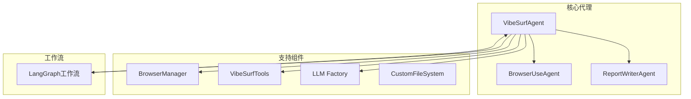
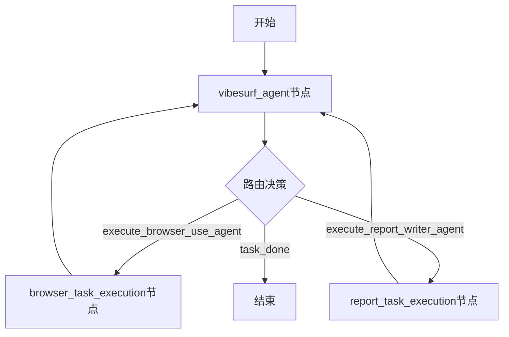
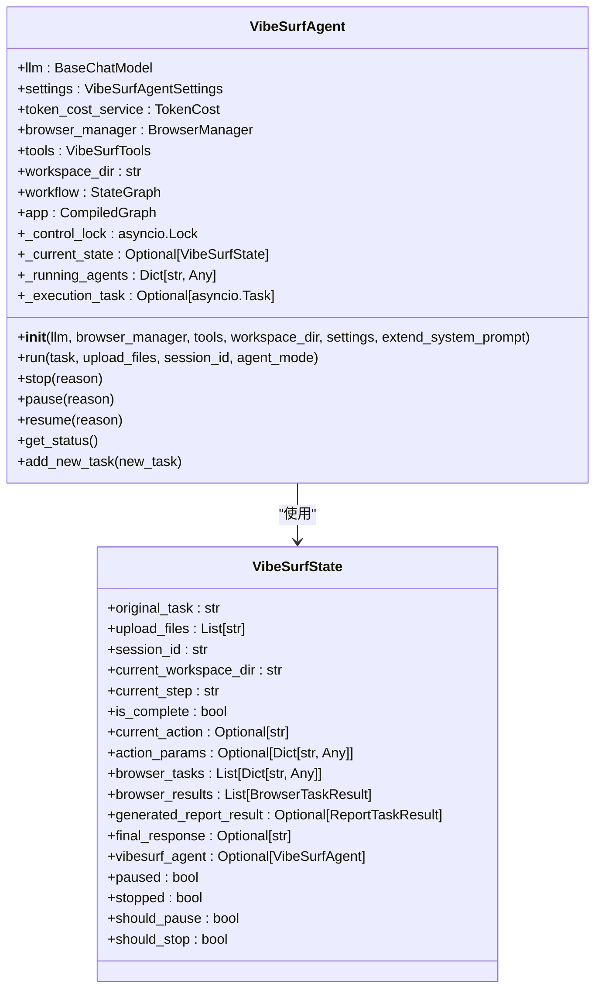
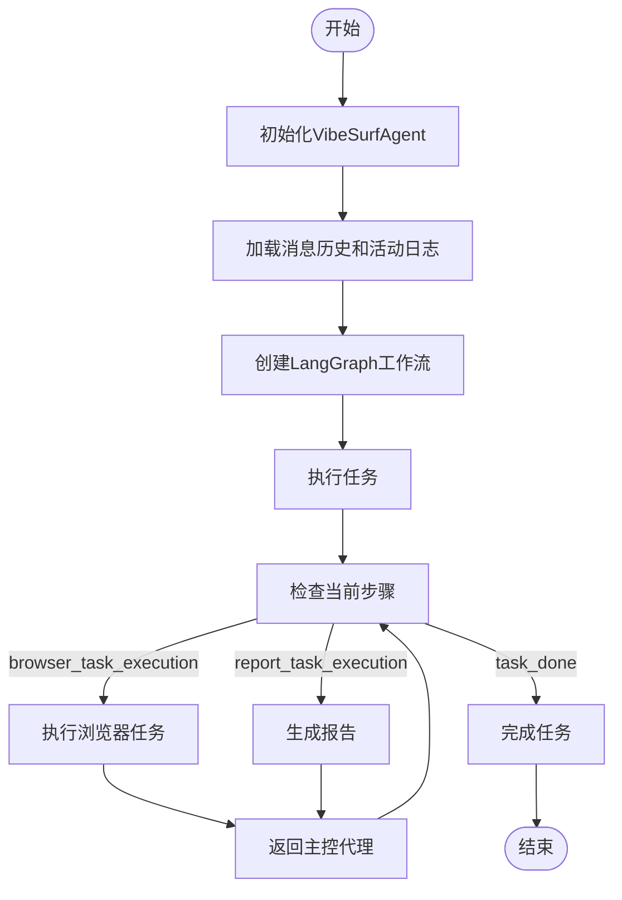
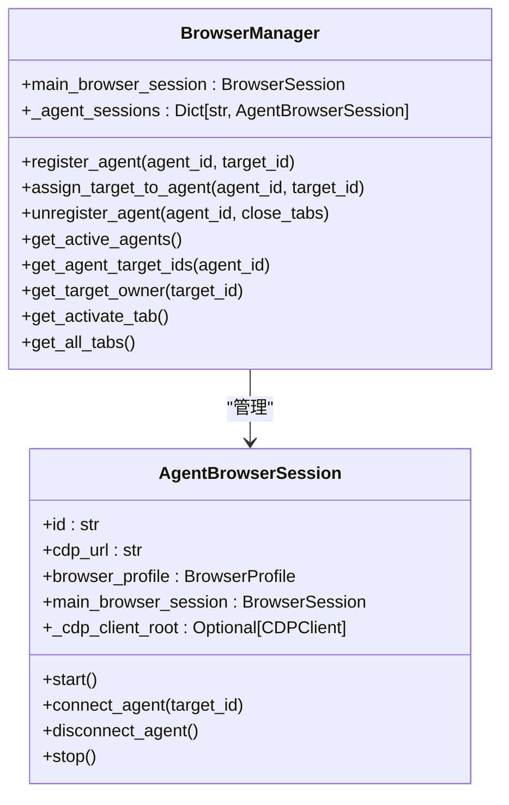
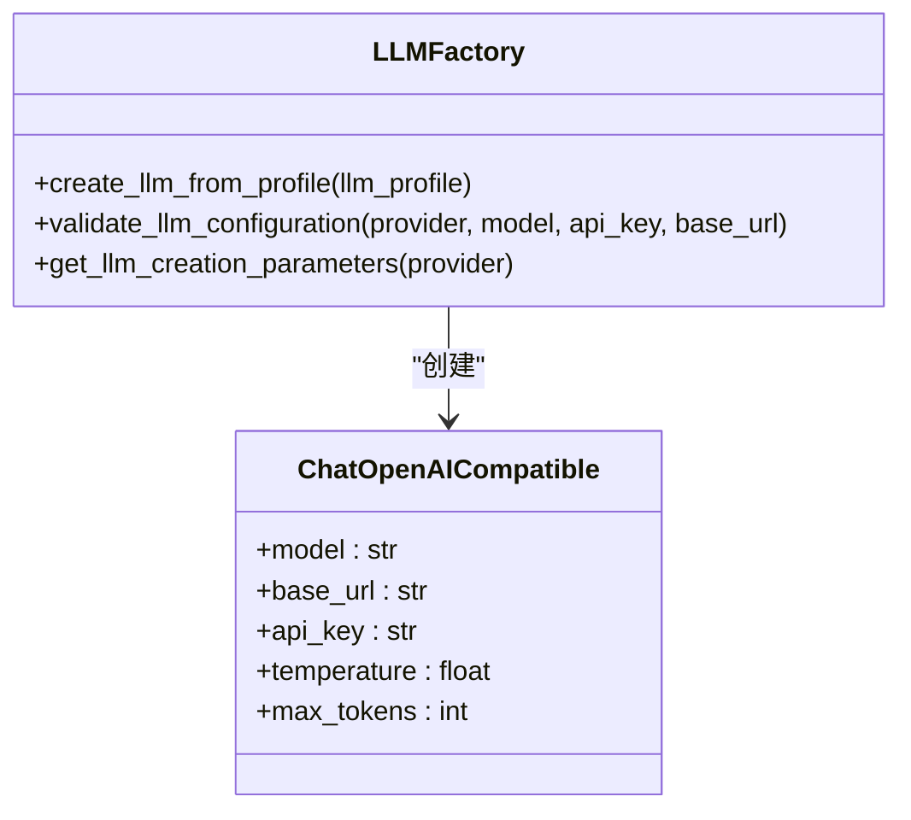
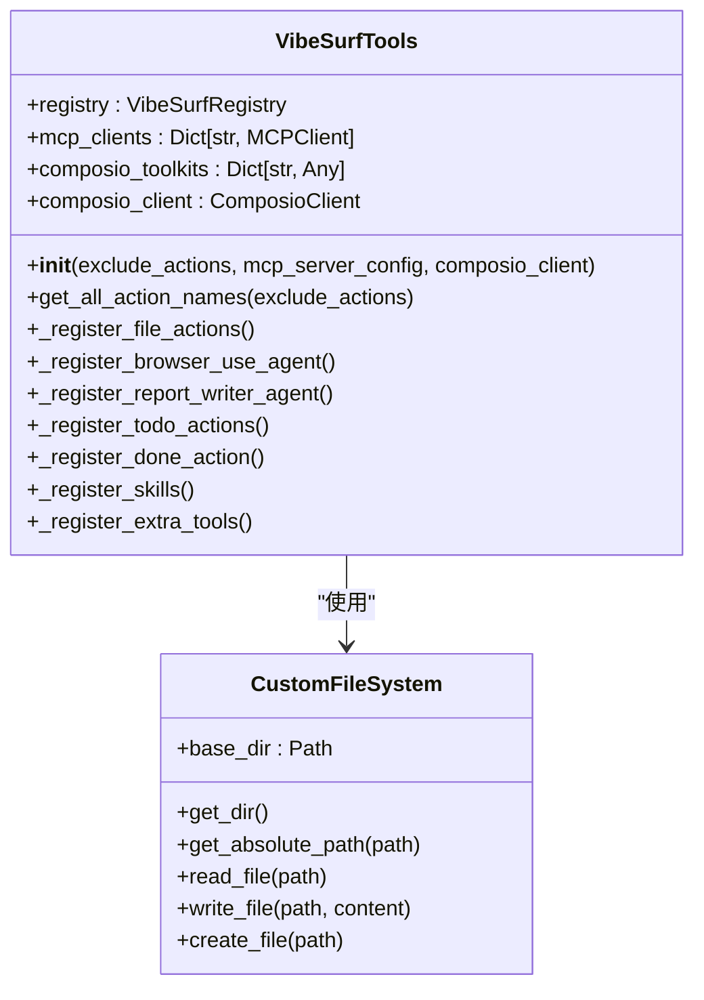
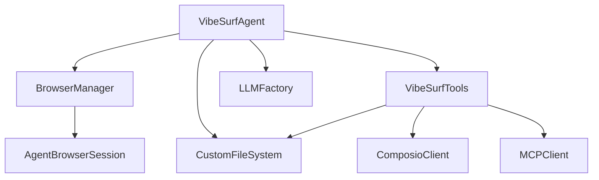

# VibeSurf代理

<cite>
**本文档引用的文件**   
- [vibe_surf_agent.py](file://vibe_surf/agents/vibe_surf_agent.py)
- [vibe_surf_prompt.py](file://vibe_surf/agents/prompts/vibe_surf_prompt.py)
- [browser_manager.py](file://vibe_surf/browser/browser_manager.py)
- [vibesurf_tools.py](file://vibe_surf/tools/vibesurf_tools.py)
- [llm_factory.py](file://vibe_surf/backend/utils/llm_factory.py)
- [report_writer_agent.py](file://vibe_surf/agents/report_writer_agent.py)
- [browser_use_agent.py](file://vibe_surf/agents/browser_use_agent.py)
- [views.py](file://vibe_surf/agents/views.py)
</cite>

## 目录
1. [简介](#简介)
2. [项目结构](#项目结构)
3. [核心组件](#核心组件)
4. [架构概述](#架构概述)
5. [详细组件分析](#详细组件分析)
6. [依赖关系分析](#依赖关系分析)
7. [性能考虑](#性能考虑)
8. [故障排除指南](#故障排除指南)
9. [结论](#结论)

## 简介
VibeSurf代理是一个先进的AI浏览器助手，专为智能网络自动化、搜索、研究、文件操作和报告生成而设计。它采用LangGraph工作流架构，通过协调多个专业代理（如浏览器自动化代理和报告生成代理）来实现复杂的任务执行。该代理支持并行任务处理、Python代码执行、文件系统管理以及与外部工具的集成，能够高效地完成多步骤工作流。

## 项目结构
VibeSurf代理的代码库遵循模块化设计，主要组件包括：
- `vibe_surf/agents/`: 包含VibeSurfAgent、BrowserUseAgent和ReportWriterAgent等核心代理类
- `vibe_surf/browser/`: 负责浏览器会话管理和标签控制
- `vibe_surf/tools/`: 提供各种工具和功能，如文件系统操作、财务数据检索等
- `vibe_surf/backend/`: 包含API端点、数据库管理和共享状态
- `vibe_surf/llm/`: LLM配置和工厂模式实现
- `vibe_surf/workflows/`: 预定义的工作流和集成

**Diagram sources**
- [vibe_surf_agent.py](file://vibe_surf/agents/vibe_surf_agent.py#L1042-L1599)
- [browser_manager.py](file://vibe_surf/browser/browser_manager.py#L24-L186)
- [vibesurf_tools.py](file://vibe_surf/tools/vibesurf_tools.py#L72-L86)
- [llm_factory.py](file://vibe_surf/backend/utils/llm_factory.py#L23-L215)

**Section sources**
- [vibe_surf_agent.py](file://vibe_surf/agents/vibe_surf_agent.py#L1-L1840)
- [browser_manager.py](file://vibe_surf/browser/browser_manager.py#L1-L269)
- [vibesurf_tools.py](file://vibe_surf/tools/vibesurf_tools.py#L1-L2278)

## 核心组件
VibeSurf代理的核心组件包括VibeSurfAgent、BrowserUseAgent和ReportWriterAgent。VibeSurfAgent作为主控代理，负责协调任务执行流程；BrowserUseAgent处理具体的浏览器自动化任务；ReportWriterAgent则负责生成HTML报告。这些组件通过LangGraph工作流进行集成，实现了高效的任务调度和状态管理。

**Section sources**
- [vibe_surf_agent.py](file://vibe_surf/agents/vibe_surf_agent.py#L1042-L1599)
- [browser_use_agent.py](file://vibe_surf/agents/browser_use_agent.py#L83-L660)
- [report_writer_agent.py](file://vibe_surf/agents/report_writer_agent.py#L34-L77)

## 架构概述
VibeSurf代理采用基于LangGraph的状态机架构，通过定义明确的工作流节点和条件边来管理任务执行流程。该架构支持并行执行、状态持久化和细粒度的控制操作（如暂停、恢复和停止）。代理的状态由VibeSurfState类管理，包含了任务信息、工作区目录、当前步骤、动作参数等关键数据。

**Diagram sources**
- [vibe_surf_agent.py](file://vibe_surf/agents/vibe_surf_agent.py#L997-L1039)

## 详细组件分析

### VibeSurfAgent分析
VibeSurfAgent是整个系统的核心，负责协调和管理所有任务的执行。它通过LangGraph工作流与BrowserUseAgent和ReportWriterAgent进行交互，实现了复杂的任务分解和并行处理。

#### 初始化过程
VibeSurfAgent的初始化过程包括设置LLM、浏览器管理器、工具集和工作区目录。它还创建了LangGraph工作流实例，并初始化了控制状态管理所需的锁和状态变量。

**Diagram sources**
- [vibe_surf_agent.py](file://vibe_surf/agents/vibe_surf_agent.py#L1042-L1599)
- [vibe_surf_agent.py](file://vibe_surf/agents/vibe_surf_agent.py#L94-L130)

#### 状态管理机制
VibeSurfAgent通过VibeSurfState类管理其状态，该类包含了任务执行过程中的所有关键信息。状态管理机制支持任务的暂停、恢复和停止操作，确保了任务执行的可控性和可靠性。

**Section sources**
- [vibe_surf_agent.py](file://vibe_surf/agents/vibe_surf_agent.py#L94-L130)
- [vibe_surf_agent.py](file://vibe_surf/agents/vibe_surf_agent.py#L1073-L1078)

#### 任务执行逻辑
VibeSurfAgent的任务执行逻辑基于LangGraph工作流，通过条件边路由到不同的执行节点。它支持三种主要操作：执行浏览器任务、生成报告和完成任务。每个操作都通过相应的节点函数实现，并在执行完成后返回到主控代理进行下一步决策。

**Diagram sources**
- [vibe_surf_agent.py](file://vibe_surf/agents/vibe_surf_agent.py#L1592-L1738)
- [vibe_surf_agent.py](file://vibe_surf/agents/vibe_surf_agent.py#L997-L1039)

### 浏览器管理器集成
VibeSurfAgent通过BrowserManager与浏览器进行交互，实现了对多个浏览器会话的管理和控制。BrowserManager负责注册和注销代理会话，分配和取消分配标签页，并提供对当前活动标签页的访问。

**Diagram sources**
- [browser_manager.py](file://vibe_surf/browser/browser_manager.py#L24-L186)
- [agent_browser_session.py](file://vibe_surf/browser/agent_browser_session.py#L1-L271)

### LLM服务集成
VibeSurfAgent通过LLM工厂模式与不同的LLM服务进行集成，支持多种提供商如OpenAI、Anthropic、Google等。LLM工厂根据配置文件创建相应的LLM实例，并处理认证和参数配置。

**Diagram sources**
- [llm_factory.py](file://vibe_surf/backend/utils/llm_factory.py#L23-L215)
- [openai_compatible.py](file://vibe_surf/llm/openai_compatible.py#L1-L50)

### 工具系统集成
VibeSurfAgent通过VibeSurfTools类与各种工具系统进行集成，包括文件系统操作、财务数据检索、社交媒体API等。这些工具通过注册机制被添加到代理的动作模型中，使其能够执行各种复杂的操作。

**Diagram sources**
- [vibesurf_tools.py](file://vibe_surf/tools/vibesurf_tools.py#L72-L86)
- [file_system.py](file://vibe_surf/tools/file_system.py#L1-L50)

## 依赖关系分析
VibeSurf代理的组件之间存在紧密的依赖关系。VibeSurfAgent依赖于BrowserManager进行浏览器操作，依赖于VibeSurfTools进行各种工具调用，依赖于LLM工厂进行语言模型管理。这些依赖关系通过构造函数注入，确保了组件之间的松耦合和高内聚。

**Diagram sources**
- [vibe_surf_agent.py](file://vibe_surf/agents/vibe_surf_agent.py#L1045-L1063)
- [vibesurf_tools.py](file://vibe_surf/tools/vibesurf_tools.py#L73-L87)
- [browser_manager.py](file://vibe_surf/browser/browser_manager.py#L27-L31)

## 性能考虑
VibeSurf代理在设计时充分考虑了性能优化。它支持并行执行多个浏览器任务，通过LangGraph工作流实现了高效的任务调度。此外，代理还实现了令牌成本跟踪和使用情况汇总，帮助用户监控和优化资源消耗。

**Section sources**
- [vibe_surf_agent.py](file://vibe_surf/agents/vibe_surf_agent.py#L1057-L1058)
- [vibe_surf_agent.py](file://vibe_surf/agents/vibe_surf_agent.py#L1719-L1724)

## 故障排除指南
当VibeSurf代理遇到问题时，可以检查以下方面：
1. 确保浏览器已正确启动并连接
2. 检查LLM配置是否正确，API密钥是否有效
3. 验证工作区目录是否存在且可写
4. 查看活动日志以获取详细的执行信息
5. 使用get_status()方法检查代理的当前状态

**Section sources**
- [vibe_surf_agent.py](file://vibe_surf/agents/vibe_surf_agent.py#L1394-L1472)
- [vibe_surf_agent.py](file://vibe_surf/agents/vibe_surf_agent.py#L1173-L1232)

## 结论
VibeSurf代理是一个功能强大且灵活的AI助手，能够处理复杂的网络自动化任务。通过其模块化设计和基于工作流的架构，它为开发者提供了一个可扩展和可定制的平台，可以轻松集成到各种应用场景中。随着功能的不断丰富和完善，VibeSurf代理有望成为智能自动化领域的领先解决方案。