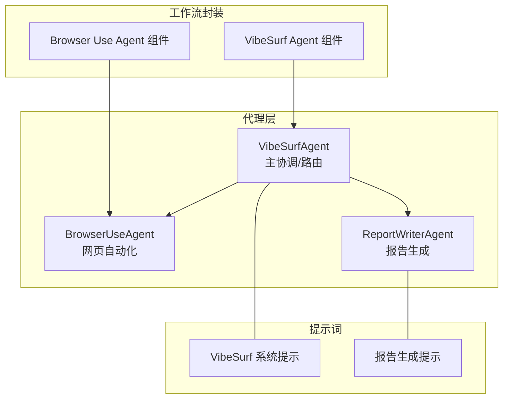
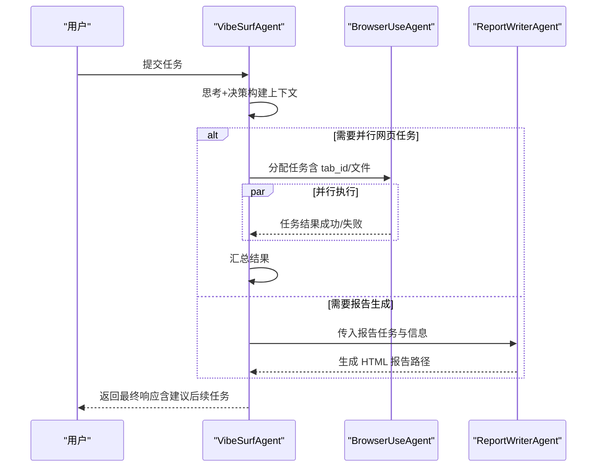
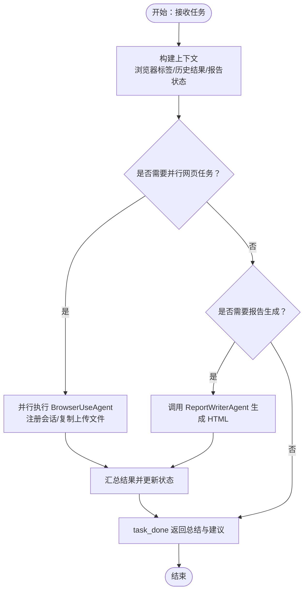
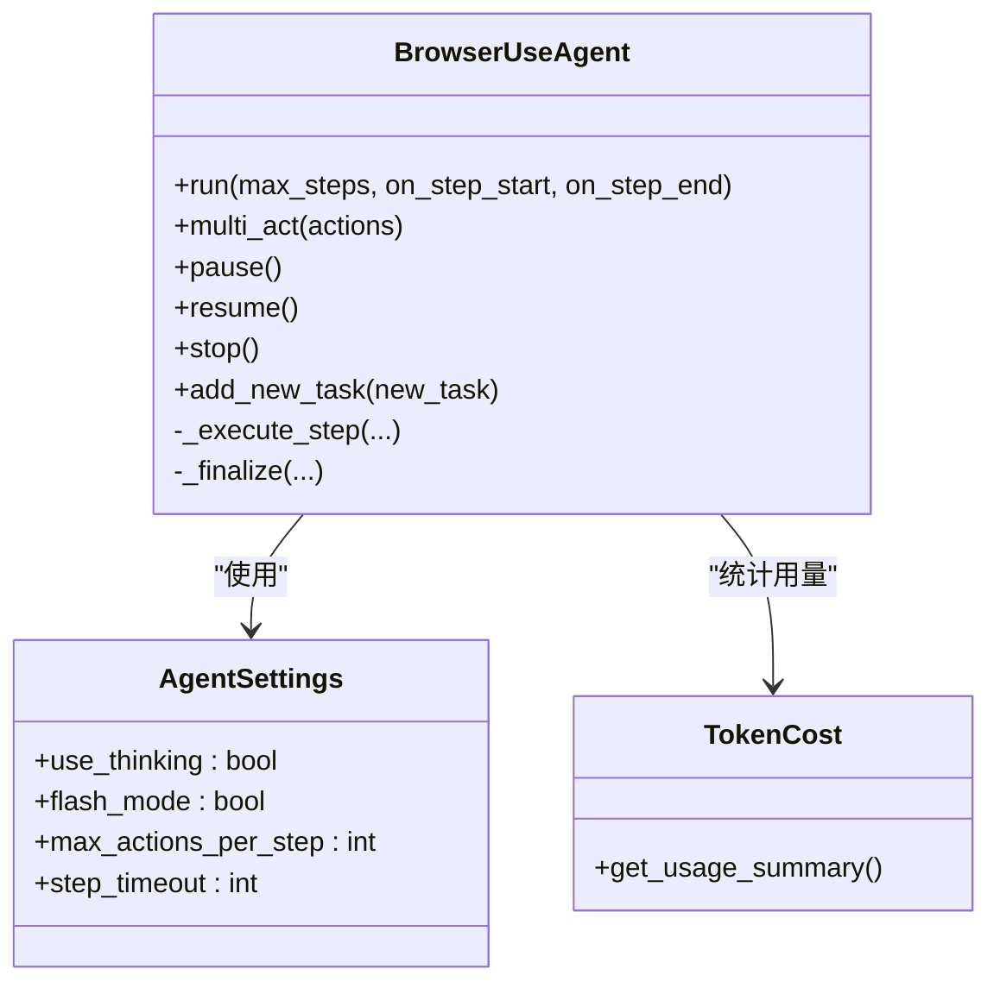
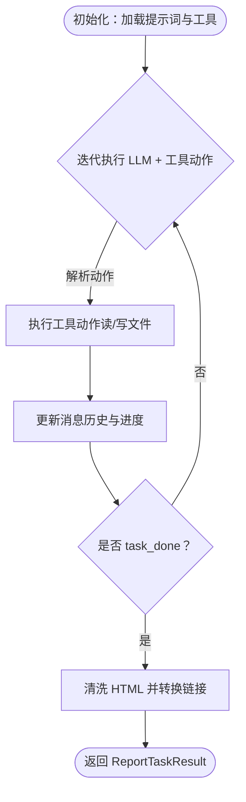
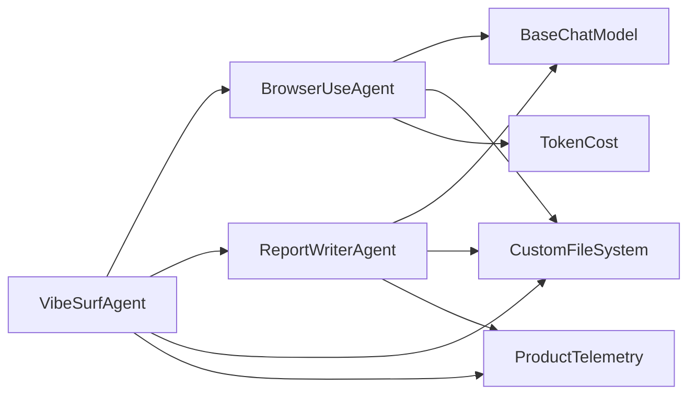

# 代理类型

<cite>
**本文引用的文件**
- [vibe_surf/agents/vibe_surf_agent.py](file://vibe_surf/agents/vibe_surf_agent.py)
- [vibe_surf/agents/browser_use_agent.py](file://vibe_surf/agents/browser_use_agent.py)
- [vibe_surf/agents/report_writer_agent.py](file://vibe_surf/agents/report_writer_agent.py)
- [vibe_surf/agents/prompts/vibe_surf_prompt.py](file://vibe_surf/agents/prompts/vibe_surf_prompt.py)
- [vibe_surf/agents/prompts/report_writer_prompt.py](file://vibe_surf/agents/prompts/report_writer_prompt.py)
- [vibe_surf/agents/views.py](file://vibe_surf/agents/views.py)
- [vibe_surf/workflows/VibeSurf/vibesurf_agent.py](file://vibe_surf/workflows/VibeSurf/vibesurf_agent.py)
- [vibe_surf/workflows/VibeSurf/browser_use_agent.py](file://vibe_surf/workflows/VibeSurf/browser_use_agent.py)
- [tests/test_agents.py](file://tests/test_agents.py)
</cite>

## 目录
1. [简介](#简介)
2. [项目结构](#项目结构)
3. [核心组件](#核心组件)
4. [架构总览](#架构总览)
5. [详细组件分析](#详细组件分析)
6. [依赖关系分析](#依赖关系分析)
7. [性能考量](#性能考量)
8. [故障排查指南](#故障排查指南)
9. [结论](#结论)
10. [附录](#附录)

## 简介
本文件系统性梳理 VibeSurf 的三种核心代理类型：VibeSurfAgent、BrowserUseAgent 和 ReportWriterAgent 的实现细节、协作机制、提示工程策略与性能特征，并提供可操作的配置与调用指南，帮助用户在复杂任务中选择最优代理组合。

## 项目结构
- 代理层位于 vibe_surf/agents，包含三种代理的实现与提示词：
  - VibeSurfAgent：主协调代理，负责任务规划、路由到子代理、并行执行与结果汇总。
  - BrowserUseAgent：基于 browser-use 的网页自动化代理，具备思考/行动循环、文件系统、截图、令牌计费等能力。
  - ReportWriterAgent：面向报告生成的 LLM 控制流程代理，按步骤读取/写入文件并输出专业 HTML 报告。
- 提示词位于 vibe_surf/agents/prompts，分别定义 VibeSurf 的系统提示与报告生成提示。
- 工作流封装位于 vibe_surf/workflows/VibeSurf，提供 LangFlow 组件化的调用入口。
- 测试位于 tests，覆盖代理行为与工具链路。

图表来源
- [vibe_surf/agents/vibe_surf_agent.py](file://vibe_surf/agents/vibe_surf_agent.py#L346-L546)
- [vibe_surf/agents/browser_use_agent.py](file://vibe_surf/agents/browser_use_agent.py#L83-L210)
- [vibe_surf/agents/report_writer_agent.py](file://vibe_surf/agents/report_writer_agent.py#L34-L110)
- [vibe_surf/agents/prompts/vibe_surf_prompt.py](file://vibe_surf/agents/prompts/vibe_surf_prompt.py#L1-L120)
- [vibe_surf/agents/prompts/report_writer_prompt.py](file://vibe_surf/agents/prompts/report_writer_prompt.py#L1-L74)
- [vibe_surf/workflows/VibeSurf/vibesurf_agent.py](file://vibe_surf/workflows/VibeSurf/vibesurf_agent.py#L24-L114)
- [vibe_surf/workflows/VibeSurf/browser_use_agent.py](file://vibe_surf/workflows/VibeSurf/browser_use_agent.py#L24-L151)

章节来源
- [vibe_surf/agents/vibe_surf_agent.py](file://vibe_surf/agents/vibe_surf_agent.py#L346-L546)
- [vibe_surf/agents/browser_use_agent.py](file://vibe_surf/agents/browser_use_agent.py#L83-L210)
- [vibe_surf/agents/report_writer_agent.py](file://vibe_surf/agents/report_writer_agent.py#L34-L110)
- [vibe_surf/agents/prompts/vibe_surf_prompt.py](file://vibe_surf/agents/prompts/vibe_surf_prompt.py#L1-L120)
- [vibe_surf/agents/prompts/report_writer_prompt.py](file://vibe_surf/agents/prompts/report_writer_prompt.py#L1-L74)
- [vibe_surf/workflows/VibeSurf/vibesurf_agent.py](file://vibe_surf/workflows/VibeSurf/vibesurf_agent.py#L24-L114)
- [vibe_surf/workflows/VibeSurf/browser_use_agent.py](file://vibe_surf/workflows/VibeSurf/browser_use_agent.py#L24-L151)

## 核心组件
- VibeSurfAgent
  - 角色：任务编排者，采用“思考+行动”模式，动态路由到 BrowserUseAgent 或 ReportWriterAgent，支持并行浏览器任务执行与结果汇总。
  - 关键点：LangGraph 节点、控制态（暂停/停止）、活动日志、文件链接绝对化、并行浏览器任务执行、最终响应格式化。
- BrowserUseAgent
  - 角色：网页自动化代理，具备多步思考/行动循环、文件系统、截图、令牌计费、信号处理、暂停/恢复/停止控制。
  - 关键点：AgentSettings、MessageManager、多动作执行、历史记录、事件与遥测。
- ReportWriterAgent
  - 角色：LLM 控制的报告生成器，按步骤读取/写入文件，强制输出专业 HTML 报告，具备错误回退与链接转换。
  - 关键点：AgentOutput 动态模型、消息历史、迭代执行、HTML 清洗与链接转换、遥测事件。

章节来源
- [vibe_surf/agents/vibe_surf_agent.py](file://vibe_surf/agents/vibe_surf_agent.py#L346-L546)
- [vibe_surf/agents/browser_use_agent.py](file://vibe_surf/agents/browser_use_agent.py#L83-L210)
- [vibe_surf/agents/report_writer_agent.py](file://vibe_surf/agents/report_writer_agent.py#L34-L110)
- [vibe_surf/agents/views.py](file://vibe_surf/agents/views.py#L59-L124)

## 架构总览
VibeSurfAgent 通过 LangGraph 状态机驱动，依据当前上下文与任务复杂度，决定是否并行调度多个 BrowserUseAgent 执行网页任务，或直接调用 ReportWriterAgent 生成报告；完成后汇总为最终响应。

图表来源
- [vibe_surf/agents/vibe_surf_agent.py](file://vibe_surf/agents/vibe_surf_agent.py#L346-L546)
- [vibe_surf/agents/browser_use_agent.py](file://vibe_surf/agents/browser_use_agent.py#L658-L800)
- [vibe_surf/agents/report_writer_agent.py](file://vibe_surf/agents/report_writer_agent.py#L106-L200)

## 详细组件分析

### VibeSurfAgent 分析
- 设计要点
  - LangGraph 节点：vibesurf_agent_node、browser_task_execution_node、report_task_execution_node。
  - 控制态：暂停/停止/恢复，节点级包装 control_aware_node，避免在停止/暂停状态下继续执行。
  - 文件链接处理：process_agent_msg_file_links 将相对路径转换为绝对 file:// 路径，便于报告与浏览器任务间共享文件。
  - 并行浏览器任务：execute_parallel_browser_tasks 为每个任务注册独立 BrowserUseAgent，支持多标签并行执行，结束后统一清理。
  - 最终响应：task_done 动作返回总结与建议后续任务，支持提取重要文件路径。
- 数据结构与复杂度
  - VibeSurfState：包含原始任务、上传文件、会话 ID、当前步骤、浏览器任务队列与结果、生成报告结果、最终响应等字段，时间复杂度主要受浏览器任务数量与并行度影响。
  - 并行执行：并发数为浏览器任务数，I/O 密集型，整体吞吐取决于浏览器会话与网络延迟。
- 错误处理与遥测
  - 异常捕获与 VibeSurfAgentExceptionEvent 记录，最终状态 is_complete 标记任务完成或失败。
  - 令牌用量统计与日志记录，便于成本控制与审计。
- 性能与优化
  - 并行执行显著降低多任务总耗时；合理设置 max_actions_per_step 与 step_timeout 可平衡稳定性与速度。
  - 使用 flash_mode 与 no-thinking 模式可减少思考阶段开销（见下节“提示工程与模式选择”）。

图表来源
- [vibe_surf/agents/vibe_surf_agent.py](file://vibe_surf/agents/vibe_surf_agent.py#L346-L546)
- [vibe_surf/agents/vibe_surf_agent.py](file://vibe_surf/agents/vibe_surf_agent.py#L548-L763)
- [vibe_surf/agents/report_writer_agent.py](file://vibe_surf/agents/report_writer_agent.py#L106-L200)

章节来源
- [vibe_surf/agents/vibe_surf_agent.py](file://vibe_surf/agents/vibe_surf_agent.py#L346-L546)
- [vibe_surf/agents/vibe_surf_agent.py](file://vibe_surf/agents/vibe_surf_agent.py#L548-L763)
- [vibe_surf/agents/vibe_surf_agent.py](file://vibe_surf/agents/vibe_surf_agent.py#L1233-L1415)

### BrowserUseAgent 分析
- 设计要点
  - 初始化：支持传入 BrowserSession 或创建新会话，设置 AgentSettings（use_thinking、flash_mode、max_actions_per_step、step_timeout 等），初始化文件系统与截图服务。
  - 运行循环：run 中执行初始动作后进入主循环，支持暂停/恢复/停止、连续失败阈值、信号处理、历史记录保存与令牌用量统计。
  - 多动作执行：multi_act 支持连续动作，带等待间隔与 done 动作限制。
  - 事件与回调：step 回调、done 回调、外部状态检查回调，便于集成上层控制。
- 数据结构与复杂度
  - AgentState/AgentHistoryList/AgentHistory：记录每步思考、动作、结果与截图，复杂度与最大步数成正比。
  - 多动作执行：单步内串行执行，复杂度取决于动作数量与浏览器交互。
- 错误处理与遥测
  - 连续失败阈值触发停止；异常捕获并记录；telemetry 输出运行时指标。
- 性能与优化
  - 合理设置 max_actions_per_step 与 step_timeout；在非视觉场景关闭 use_vision 以节省成本。
  - 使用 flash_mode 减少思考阶段，提升吞吐。

图表来源
- [vibe_surf/agents/browser_use_agent.py](file://vibe_surf/agents/browser_use_agent.py#L83-L210)
- [vibe_surf/agents/browser_use_agent.py](file://vibe_surf/agents/browser_use_agent.py#L658-L800)

章节来源
- [vibe_surf/agents/browser_use_agent.py](file://vibe_surf/agents/browser_use_agent.py#L83-L210)
- [vibe_surf/agents/browser_use_agent.py](file://vibe_surf/agents/browser_use_agent.py#L658-L800)

### ReportWriterAgent 分析
- 设计要点
  - LLM 控制流程：使用自定义 AgentOutput 动态模型，按步骤解析 LLM 输出并执行工具动作（读/写文件），直至 task_done。
  - 报告输出：强制生成专业 HTML，包含标题、样式、语义元素与打印友好设计；最终清洗并转换相对链接为 file:// 绝对链接。
  - 错误回退：当 LLM 生成失败时，生成简单回退报告，保证交付可用产物。
- 数据结构与复杂度
  - message_history：随迭代增长，复杂度与最大迭代次数成正比。
  - 文件读写：I/O 密集，受磁盘与文件大小影响。
- 错误处理与遥测
  - 捕获异常并记录 ReportWriterTelemetryEvent；最终返回 ReportTaskResult。
- 性能与优化
  - 严格遵循提示词要求的格式化步骤，避免额外重试与回溯。

图表来源
- [vibe_surf/agents/report_writer_agent.py](file://vibe_surf/agents/report_writer_agent.py#L106-L200)
- [vibe_surf/agents/report_writer_agent.py](file://vibe_surf/agents/report_writer_agent.py#L348-L475)
- [vibe_surf/agents/prompts/report_writer_prompt.py](file://vibe_surf/agents/prompts/report_writer_prompt.py#L1-L74)

章节来源
- [vibe_surf/agents/report_writer_agent.py](file://vibe_surf/agents/report_writer_agent.py#L34-L110)
- [vibe_surf/agents/report_writer_agent.py](file://vibe_surf/agents/report_writer_agent.py#L106-L200)
- [vibe_surf/agents/report_writer_agent.py](file://vibe_surf/agents/report_writer_agent.py#L348-L475)
- [vibe_surf/agents/prompts/report_writer_prompt.py](file://vibe_surf/agents/prompts/report_writer_prompt.py#L1-L74)

### 代理协作模式与复杂任务处理
- 协作机制
  - VibeSurfAgent 在思考阶段综合浏览器标签状态、历史结果与已生成报告，决定下一步是并行执行 BrowserUseAgent 还是调用 ReportWriterAgent。
  - 并行执行时，每个 BrowserUseAgent 独立拥有自己的工作目录与文件系统，避免冲突；完成后由 VibeSurfAgent 汇总重要文件路径与结果。
  - 报告生成阶段，ReportWriterAgent 可读取 BrowserUseAgent 产生的文件，按提示词要求进行格式化输出。
- 控制与可观测性
  - 全局暂停/停止：VibeSurfAgent 提供 pause/stop/resume 接口，内部通过控制锁与状态标志位实现线程安全。
  - 活动日志：统一记录各代理的思考、动作与结果，便于审计与问题定位。
  - 遥测事件：记录任务开始/完成/错误与关键指标，支持成本与性能分析。

章节来源
- [vibe_surf/agents/vibe_surf_agent.py](file://vibe_surf/agents/vibe_surf_agent.py#L1233-L1415)
- [vibe_surf/agents/vibe_surf_agent.py](file://vibe_surf/agents/vibe_surf_agent.py#L1415-L1840)
- [vibe_surf/agents/browser_use_agent.py](file://vibe_surf/agents/browser_use_agent.py#L658-L800)
- [vibe_surf/agents/report_writer_agent.py](file://vibe_surf/agents/report_writer_agent.py#L106-L200)

### 提示工程策略与优化方法
- VibeSurf 系统提示
  - 明确角色与能力边界：浏览器自动化、报告生成、Python 代码执行、文件系统管理。
  - 并行化指导：鼓励将独立子任务拆分为并行执行，资源高效分配。
  - 安全与合规：严格限制文件系统访问范围，拒绝危险操作；对认证错误提供明确指引。
  - 语言适配：输出语言需与用户请求一致。
- BrowserUseAgent 系统提示扩展
  - 语言一致性与路径规范：强调相对路径与完整相对路径的重要性，避免路径错误导致的文件操作失败。
  - 视觉输入处理：结合截图中标注的索引号理解元素位置与功能。
  - 安全约束：禁止执行潜在恶意脚本或越权操作。
- ReportWriterAgent 提示词
  - 步骤化工作流：必须先分析任务与所需信息，再进行格式化输出。
  - HTML 要求：完整的 HTML5 结构、嵌入式 CSS、响应式设计、打印友好、语义化元素。
  - 链接转换：使用相对路径，系统自动转换为 file:// 绝对链接。
- 模式选择与优化
  - thinking：启用 LLM 思考阶段，适合复杂推理与多步骤规划。
  - no-thinking：跳过思考阶段，减少延迟，适合确定性强的任务。
  - flash：极致精简的思考与动作，追求吞吐最大化，适合批量网页抓取与数据提取。

章节来源
- [vibe_surf/agents/prompts/vibe_surf_prompt.py](file://vibe_surf/agents/prompts/vibe_surf_prompt.py#L1-L120)
- [vibe_surf/agents/prompts/vibe_surf_prompt.py](file://vibe_surf/agents/prompts/vibe_surf_prompt.py#L198-L219)
- [vibe_surf/agents/prompts/report_writer_prompt.py](file://vibe_surf/agents/prompts/report_writer_prompt.py#L1-L74)
- [vibe_surf/agents/views.py](file://vibe_surf/agents/views.py#L59-L124)

### 实际代码示例（调用与配置）
- 通过 LangFlow 组件调用 VibeSurfAgent
  - 输入参数：任务文本、LLM 模型、扩展系统提示、上传文件、代理模式（thinking/non-thinking/flash）。
  - 输出：Message 文本，包含最终结果与建议后续任务。
  - 参考路径：[vibe_surf/workflows/VibeSurf/vibesurf_agent.py](file://vibe_surf/workflows/VibeSurf/vibesurf_agent.py#L24-L114)
- 通过 LangFlow 组件调用 BrowserUseAgent
  - 输入参数：浏览器会话、任务文本、LLM 模型、扩展系统提示、闪速模式、思考模式、最大步数。
  - 输出：Message 文本与浏览器会话传递。
  - 参考路径：[vibe_surf/workflows/VibeSurf/browser_use_agent.py](file://vibe_surf/workflows/VibeSurf/browser_use_agent.py#L24-L151)
- 在代码中直接实例化与运行
  - VibeSurfAgent.run：传入任务、上传文件与 agent_mode，返回 Markdown 总结。
  - BrowserUseAgent.run：传入任务、LLM、浏览器会话与工具，返回历史与最终结果。
  - ReportWriterAgent.generate_report：传入 report_task 与 report_information，返回 ReportTaskResult。
  - 参考路径：
    - [vibe_surf/agents/vibe_surf_agent.py](file://vibe_surf/agents/vibe_surf_agent.py#L1592-L1738)
    - [vibe_surf/agents/browser_use_agent.py](file://vibe_surf/agents/browser_use_agent.py#L658-L800)
    - [vibe_surf/agents/report_writer_agent.py](file://vibe_surf/agents/report_writer_agent.py#L106-L200)

章节来源
- [vibe_surf/workflows/VibeSurf/vibesurf_agent.py](file://vibe_surf/workflows/VibeSurf/vibesurf_agent.py#L24-L114)
- [vibe_surf/workflows/VibeSurf/browser_use_agent.py](file://vibe_surf/workflows/VibeSurf/browser_use_agent.py#L24-L151)
- [vibe_surf/agents/vibe_surf_agent.py](file://vibe_surf/agents/vibe_surf_agent.py#L1592-L1738)
- [vibe_surf/agents/browser_use_agent.py](file://vibe_surf/agents/browser_use_agent.py#L658-L800)
- [vibe_surf/agents/report_writer_agent.py](file://vibe_surf/agents/report_writer_agent.py#L106-L200)

### 代理选择指南
- 选择 VibeSurfAgent 的场景
  - 复杂任务：需要跨浏览器标签并行执行、多步骤规划与结果汇总。
  - 需要报告：任务完成后需要生成专业 HTML 报告。
  - 需要并发：大量独立网页任务，希望缩短总耗时。
- 选择 BrowserUseAgent 的场景
  - 单一网页任务：目标明确、步骤清晰，不需要多代理协作。
  - 高频抓取：大批量页面自动化，追求吞吐与稳定性。
  - 闪速模式：对延迟敏感，可接受较少思考阶段。
- 选择 ReportWriterAgent 的场景
  - 仅需报告：不需要网页自动化，专注于内容生成与格式化。
  - 内容质量：需要严格的 HTML 结构与样式规范。
- 模式选择建议
  - thinking：复杂推理、多步骤规划、需要 LLM 思考。
  - no-thinking：确定性强、快速执行、减少延迟。
  - flash：极致吞吐、批量抓取、对思考阶段不敏感。

章节来源
- [vibe_surf/agents/prompts/vibe_surf_prompt.py](file://vibe_surf/agents/prompts/vibe_surf_prompt.py#L1-L120)
- [vibe_surf/agents/views.py](file://vibe_surf/agents/views.py#L59-L124)

## 依赖关系分析
- 组件耦合
  - VibeSurfAgent 依赖 BrowserUseAgent 与 ReportWriterAgent 的执行结果与文件系统接口。
  - BrowserUseAgent 依赖 browser-use 的 Agent/Tools/MessageManager/TokenCost 等基础设施。
  - ReportWriterAgent 依赖自定义工具集与文件系统，遵循提示词格式化要求。
- 外部依赖
  - LLM 服务：OpenAI 兼容模型，支持超时与成本统计。
  - 浏览器会话：BrowserSession/CDP 交互，支持截图与 DOM 操作。
  - 文件系统：CustomFileSystem 提供工作目录隔离与路径规范化。
- 潜在环路
  - 代理间通过消息历史与工具调用交互，未发现直接循环导入；并行执行通过任务 ID 与会话管理避免环路。

图表来源
- [vibe_surf/agents/vibe_surf_agent.py](file://vibe_surf/agents/vibe_surf_agent.py#L346-L546)
- [vibe_surf/agents/browser_use_agent.py](file://vibe_surf/agents/browser_use_agent.py#L83-L210)
- [vibe_surf/agents/report_writer_agent.py](file://vibe_surf/agents/report_writer_agent.py#L34-L110)

章节来源
- [vibe_surf/agents/vibe_surf_agent.py](file://vibe_surf/agents/vibe_surf_agent.py#L346-L546)
- [vibe_surf/agents/browser_use_agent.py](file://vibe_surf/agents/browser_use_agent.py#L83-L210)
- [vibe_surf/agents/report_writer_agent.py](file://vibe_surf/agents/report_writer_agent.py#L34-L110)

## 性能考量
- 并行执行
  - BrowserUseAgent 并行执行显著降低多任务总耗时，但需注意浏览器会话与网络带宽瓶颈。
- 模式优化
  - no-thinking/flash 模式减少思考阶段，提高吞吐；但在复杂任务中可能牺牲准确性。
- 资源控制
  - 合理设置 max_actions_per_step 与 step_timeout，避免长时间阻塞。
  - 使用 TokenCost 统计与日志，控制 LLM 成本。
- I/O 优化
  - ReportWriterAgent 的 HTML 清洗与链接转换为轻量操作；大文件读写应关注磁盘性能。

## 故障排查指南
- 常见问题
  - 代理被暂停/停止：检查 VibeSurfAgent 的 paused/should_pause/stopped 标志位，确认是否收到停止信号。
  - 浏览器任务失败：查看 BrowserUseAgent 的历史记录与错误信息，确认动作参数与文件路径是否正确。
  - 报告生成失败：检查 ReportWriterAgent 的 message_history 与工具调用结果，确认格式化步骤是否执行。
- 日志与遥测
  - 活动日志：包含代理名称、状态、消息与时间戳，便于定位问题。
  - 遥测事件：记录任务生命周期关键指标，辅助性能与成本分析。
- 上传文件路径
  - VibeSurfAgent 会将相对路径转换为绝对 file:// 路径，确保报告与浏览器任务可访问。

章节来源
- [vibe_surf/agents/vibe_surf_agent.py](file://vibe_surf/agents/vibe_surf_agent.py#L1233-L1415)
- [vibe_surf/agents/browser_use_agent.py](file://vibe_surf/agents/browser_use_agent.py#L658-L800)
- [vibe_surf/agents/report_writer_agent.py](file://vibe_surf/agents/report_writer_agent.py#L106-L200)

## 结论
VibeSurf 的三种代理围绕“思考+行动”的范式协同工作：VibeSurfAgent 负责全局规划与路由，BrowserUseAgent 负责网页自动化与文件系统操作，ReportWriterAgent 负责高质量报告生成。通过合理的提示工程与模式选择，可在复杂任务中实现高吞吐、强可控与可审计的自动化流水线。

## 附录
- 测试参考
  - tests/test_agents.py：覆盖代理行为与工具链路，可用于回归验证与集成测试。
  - 参考路径：[tests/test_agents.py](file://tests/test_agents.py)