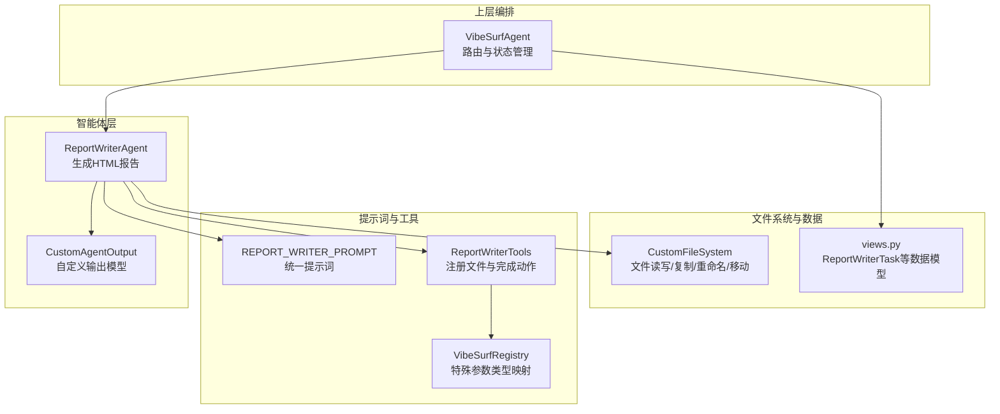
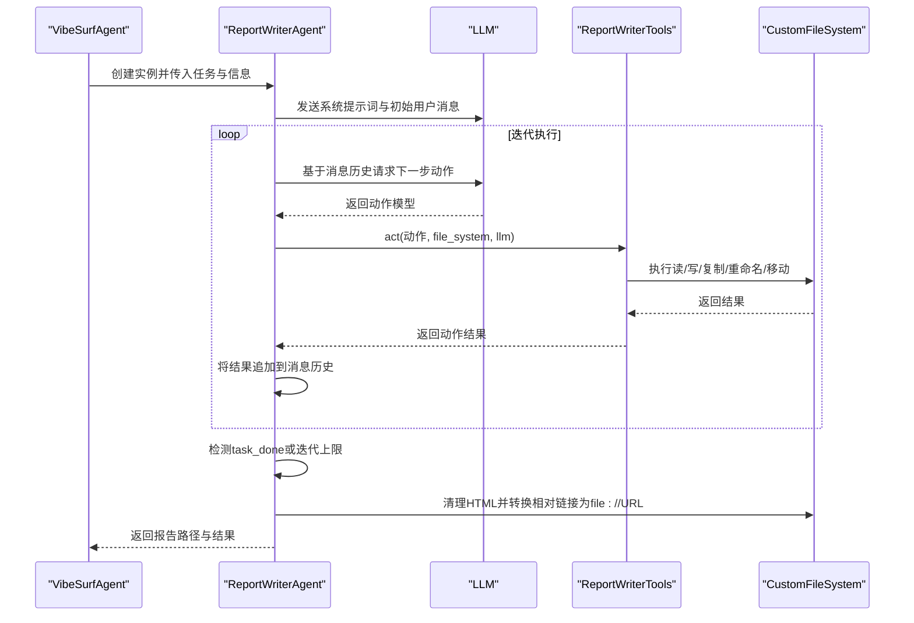
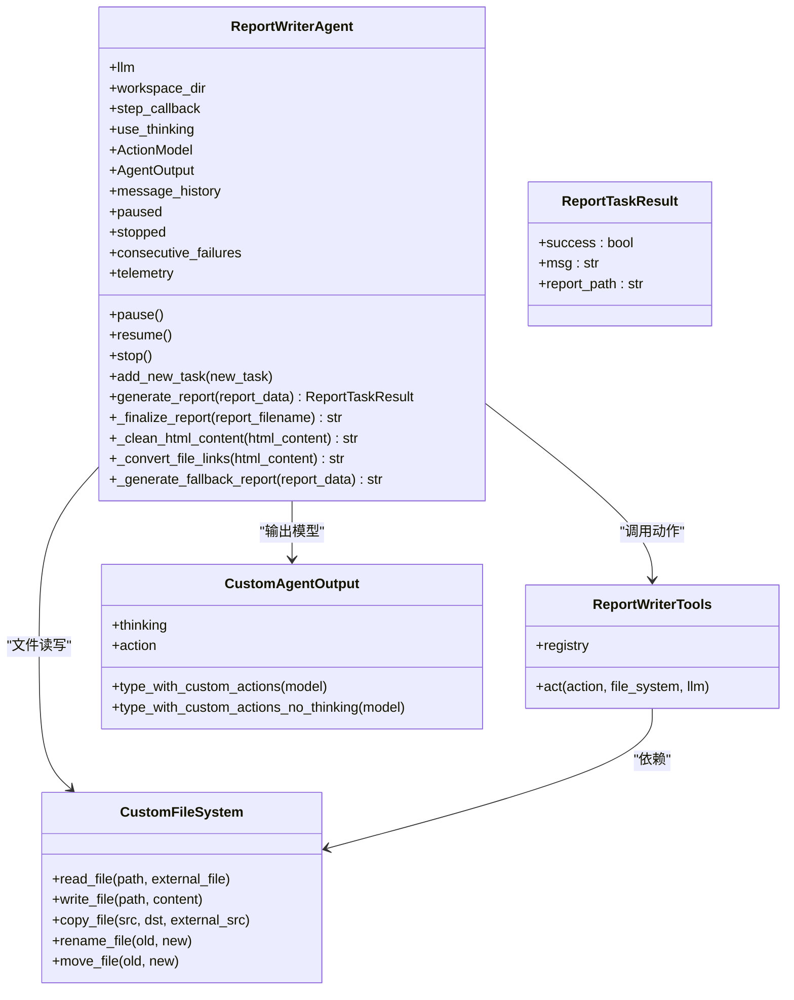
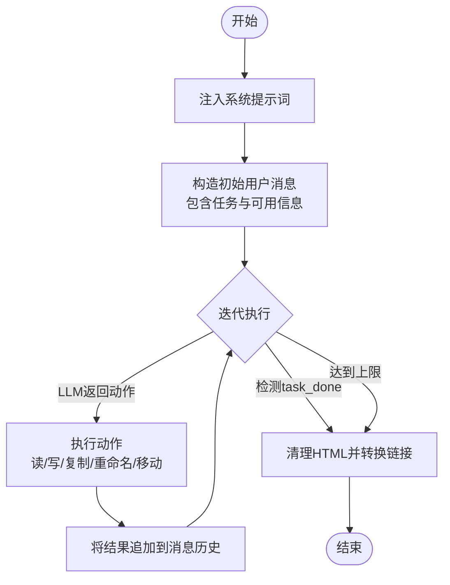
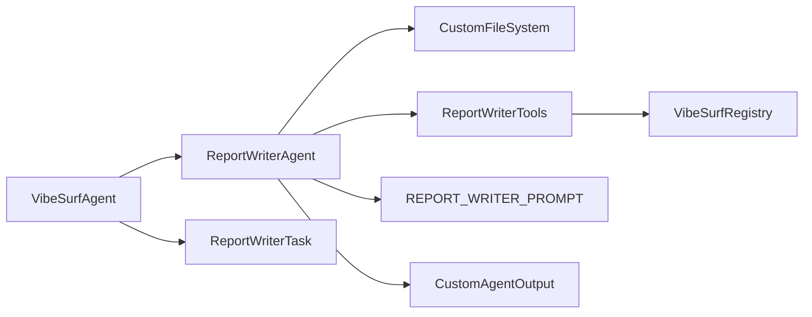

# 报告生成代理

<cite>
**本文引用的文件列表**
- [report_writer_agent.py](file://vibe_surf/agents/report_writer_agent.py)
- [report_writer_prompt.py](file://vibe_surf/agents/prompts/report_writer_prompt.py)
- [report_writer_tools.py](file://vibe_surf/tools/report_writer_tools.py)
- [vibesurf_tools.py](file://vibe_surf/tools/vibesurf_tools.py)
- [views.py](file://vibe_surf/tools/views.py)
- [file_system.py](file://vibe_surf/tools/file_system.py)
- [vibesurf_registry.py](file://vibe_surf/tools/vibesurf_registry.py)
- [views.py（代理视图）](file://vibe_surf/agents/views.py)
- [vibe_surf_agent.py](file://vibe_surf/agents/vibe_surf_agent.py)
</cite>

## 目录
1. [简介](#简介)
2. [项目结构](#项目结构)
3. [核心组件](#核心组件)
4. [架构总览](#架构总览)
5. [详细组件分析](#详细组件分析)
6. [依赖关系分析](#依赖关系分析)
7. [性能与稳定性考量](#性能与稳定性考量)
8. [故障排查指南](#故障排查指南)
9. [结论](#结论)
10. [附录：使用示例与最佳实践](#附录使用示例与最佳实践)

## 简介
本文件面向“报告生成代理”（ReportWriterAgent）的技术文档，系统性阐述其内容生成能力、结构化输出机制与多源信息整合流程。重点覆盖：
- 代理如何收集、处理并组织来自不同来源的信息，生成高质量的HTML报告文档
- 模板系统与格式化策略，以及内容优化方法
- 配置与扩展方式，以适配不同类型的报告需求与输出格式
- 实际使用示例，涵盖技术报告、市场分析与研究摘要等场景
- 内容质量控制与风格定制指南

## 项目结构
ReportWriterAgent位于智能体子系统中，围绕浏览器用例与文件系统工具协同工作，通过统一提示词驱动LLM执行读取与写入动作，最终输出专业HTML报告。

图表来源
- [report_writer_agent.py](file://vibe_surf/agents/report_writer_agent.py#L34-L120)
- [report_writer_prompt.py](file://vibe_surf/agents/prompts/report_writer_prompt.py#L1-L74)
- [report_writer_tools.py](file://vibe_surf/tools/report_writer_tools.py#L1-L23)
- [vibesurf_registry.py](file://vibe_surf/tools/vibesurf_registry.py#L34-L53)
- [file_system.py](file://vibe_surf/tools/file_system.py#L38-L70)
- [views.py](file://vibe_surf/tools/views.py#L77-L83)
- [vibe_surf_agent.py](file://vibe_surf/agents/vibe_surf_agent.py#L906-L956)

章节来源
- [report_writer_agent.py](file://vibe_surf/agents/report_writer_agent.py#L34-L120)
- [report_writer_prompt.py](file://vibe_surf/agents/prompts/report_writer_prompt.py#L1-L74)
- [report_writer_tools.py](file://vibe_surf/tools/report_writer_tools.py#L1-L23)
- [vibesurf_registry.py](file://vibe_surf/tools/vibesurf_registry.py#L34-L53)
- [file_system.py](file://vibe_surf/tools/file_system.py#L38-L70)
- [views.py](file://vibe_surf/tools/views.py#L77-L83)
- [vibe_surf_agent.py](file://vibe_surf/agents/vibe_surf_agent.py#L906-L956)

## 核心组件
- ReportWriterAgent：负责LLM驱动的报告生成流程，包含消息历史、暂停/恢复/停止控制、文件系统交互与最终HTML清理与链接转换。
- REPORT_WRITER_PROMPT：统一提示词，明确可执行动作（读取/写入）、工作流步骤、HTML格式要求与标题规范。
- ReportWriterTools：基于VibeSurfRegistry注册文件操作与“完成”动作，供LLM调用。
- CustomFileSystem：封装文件读写、复制、重命名、移动等操作，并支持PDF内容提取。
- CustomAgentOutput：根据是否启用“思考模式”动态生成输出模型，确保LLM返回结构化动作。
- VibeSurfAgent：上层编排，创建ReportWriterAgent实例并传入任务与信息，处理结果回传。

章节来源
- [report_writer_agent.py](file://vibe_surf/agents/report_writer_agent.py#L34-L120)
- [report_writer_prompt.py](file://vibe_surf/agents/prompts/report_writer_prompt.py#L1-L74)
- [report_writer_tools.py](file://vibe_surf/tools/report_writer_tools.py#L1-L23)
- [file_system.py](file://vibe_surf/tools/file_system.py#L38-L70)
- [views.py（代理视图）](file://vibe_surf/agents/views.py#L77-L124)
- [vibe_surf_agent.py](file://vibe_surf/agents/vibe_surf_agent.py#L906-L956)

## 架构总览
ReportWriterAgent采用“提示词驱动 + 动作模型 + 文件系统”的闭环架构：
- 初始化阶段：构建动作模型、输出模型、文件系统与信号处理器
- 执行阶段：构造系统消息与用户任务消息，进入迭代循环；每步LLM输出动作，代理执行对应工具动作，将结果反馈至消息历史
- 结束阶段：检测“完成”动作或达到最大迭代次数，进行HTML清理与链接转换，产出最终报告路径

图表来源
- [report_writer_agent.py](file://vibe_surf/agents/report_writer_agent.py#L106-L315)
- [report_writer_tools.py](file://vibe_surf/tools/report_writer_tools.py#L1-L23)
- [file_system.py](file://vibe_surf/tools/file_system.py#L89-L119)

章节来源
- [report_writer_agent.py](file://vibe_surf/agents/report_writer_agent.py#L106-L315)
- [report_writer_tools.py](file://vibe_surf/tools/report_writer_tools.py#L1-L23)
- [file_system.py](file://vibe_surf/tools/file_system.py#L89-L119)

## 详细组件分析

### ReportWriterAgent 类
- 职责
  - 维护消息历史，支持动态添加新任务提示
  - 控制暂停/恢复/停止，配合信号处理器实现安全中断
  - 通过动作模型与工具集执行文件读写与报告生成
  - 最终清理HTML并转换相对链接为绝对file://URL，保证本地可打开
- 关键流程
  - 初始化：构建动作模型、输出模型、文件系统与信号处理器
  - 生成流程：构造系统提示词与用户任务消息，进入最多N次迭代；每步解析LLM输出的动作，执行并回填结果；检测“完成”动作或达到上限后收尾
  - 收尾：清理HTML（去除代码块标记、补全DOCTYPE与样式）、转换相对链接为file://URL，写回文件并返回绝对路径
- 错误处理
  - 捕获异常并记录遥测事件；必要时生成降级HTML报告，确保产物可用
- 可配置项
  - use_thinking：是否启用“思考模式”，影响输出模型字段
  - step_callback：每步回调用于记录思考与动作
  - workspace_dir：工作目录，决定报告文件落盘位置

图表来源
- [report_writer_agent.py](file://vibe_surf/agents/report_writer_agent.py#L34-L120)
- [report_writer_agent.py](file://vibe_surf/agents/report_writer_agent.py#L106-L315)
- [report_writer_agent.py](file://vibe_surf/agents/report_writer_agent.py#L348-L581)
- [report_writer_tools.py](file://vibe_surf/tools/report_writer_tools.py#L1-L23)
- [file_system.py](file://vibe_surf/tools/file_system.py#L89-L119)
- [views.py（代理视图）](file://vibe_surf/agents/views.py#L77-L124)

章节来源
- [report_writer_agent.py](file://vibe_surf/agents/report_writer_agent.py#L34-L120)
- [report_writer_agent.py](file://vibe_surf/agents/report_writer_agent.py#L106-L315)
- [report_writer_agent.py](file://vibe_surf/agents/report_writer_agent.py#L348-L581)
- [views.py（代理视图）](file://vibe_surf/agents/views.py#L77-L124)

### 提示词与动作模型
- 提示词（REPORT_WRITER_PROMPT）
  - 明确能力：读取文件、写入文件
  - 工作流：分析任务、判断是否需要更多资料、生成报告内容、强制格式化为专业HTML、写入目标文件
  - 内容与HTML要求：完整HTML5结构、嵌入CSS、响应式设计、语义化元素、打印友好、相对路径链接
  - 标题规范：避免通用标题，需贴合研究主题
- 动作模型
  - 自定义输出模型：根据use_thinking动态生成含/不含thinking字段的输出模型
  - 注册动作：读取文件、写入文件、复制/重命名/移动文件、完成报告

图表来源
- [report_writer_prompt.py](file://vibe_surf/agents/prompts/report_writer_prompt.py#L1-L74)
- [report_writer_agent.py](file://vibe_surf/agents/report_writer_agent.py#L106-L315)
- [report_writer_tools.py](file://vibe_surf/tools/report_writer_tools.py#L1-L23)
- [views.py（代理视图）](file://vibe_surf/agents/views.py#L77-L124)

章节来源
- [report_writer_prompt.py](file://vibe_surf/agents/prompts/report_writer_prompt.py#L1-L74)
- [report_writer_tools.py](file://vibe_surf/tools/report_writer_tools.py#L1-L23)
- [views.py（代理视图）](file://vibe_surf/agents/views.py#L77-L124)

### 文件系统与工具链
- 文件系统（CustomFileSystem）
  - 支持读取文本文件与PDF（限制页数），返回带标签的文本便于LLM解析
  - 支持写入、复制、重命名、移动等操作
- 工具注册（VibeSurfRegistry）
  - 定义特殊参数类型映射（如file_system、llm、browser_manager等），确保动作函数签名正确注入上下文
- 报告工具（ReportWriterTools）
  - 注册文件操作动作与“完成”动作，供LLM调用

章节来源
- [file_system.py](file://vibe_surf/tools/file_system.py#L89-L119)
- [file_system.py](file://vibe_surf/tools/file_system.py#L126-L198)
- [vibesurf_registry.py](file://vibe_surf/tools/vibesurf_registry.py#L34-L53)
- [report_writer_tools.py](file://vibe_surf/tools/report_writer_tools.py#L1-L23)

### 上层编排与路由
- VibeSurfAgent
  - 创建ReportWriterAgent实例，传入LLM、工作目录、step_callback与agent_mode
  - 将浏览器任务结果打包为report_information传递给ReportWriterAgent
  - 记录生成结果并回传状态

章节来源
- [vibe_surf_agent.py](file://vibe_surf/agents/vibe_surf_agent.py#L906-L956)
- [views.py](file://vibe_surf/tools/views.py#L77-L83)

## 依赖关系分析
- 组件耦合
  - ReportWriterAgent强依赖CustomFileSystem与ReportWriterTools，弱依赖提示词与输出模型
  - ReportWriterTools依赖VibeSurfRegistry与CustomFileSystem
  - VibeSurfAgent作为编排者，协调ReportWriterAgent与浏览器任务结果
- 外部依赖
  - 浏览器用例库（browser_use）提供的消息模型、动作模型与工具服务
  - PDF解析（pypdf）用于PDF内容提取
- 循环依赖
  - 未发现直接循环依赖；各模块职责清晰，通过接口与数据模型解耦

图表来源
- [report_writer_agent.py](file://vibe_surf/agents/report_writer_agent.py#L34-L120)
- [report_writer_tools.py](file://vibe_surf/tools/report_writer_tools.py#L1-L23)
- [vibesurf_registry.py](file://vibe_surf/tools/vibesurf_registry.py#L34-L53)
- [views.py](file://vibe_surf/tools/views.py#L77-L83)
- [vibe_surf_agent.py](file://vibe_surf/agents/vibe_surf_agent.py#L906-L956)

章节来源
- [report_writer_agent.py](file://vibe_surf/agents/report_writer_agent.py#L34-L120)
- [report_writer_tools.py](file://vibe_surf/tools/report_writer_tools.py#L1-L23)
- [vibesurf_registry.py](file://vibe_surf/tools/vibesurf_registry.py#L34-L53)
- [views.py](file://vibe_surf/tools/views.py#L77-L83)
- [vibe_surf_agent.py](file://vibe_surf/agents/vibe_surf_agent.py#L906-L956)

## 性能与稳定性考量
- 迭代上限与超时
  - 默认最大迭代次数为20，防止无限循环；可通过调整上限平衡生成质量与耗时
  - 步骤超时与LLM超时由上层设置，建议结合任务复杂度合理配置
- 文件I/O与PDF解析
  - PDF默认限制前10页，避免大文件导致内存与时间开销过高
  - 文件复制/重命名/移动采用线程池异步执行，减少阻塞
- HTML清理与链接转换
  - 清理Markdown代码块标记，自动补全DOCTYPE与基础样式，提升跨浏览器兼容性
  - 将相对路径转换为file://URL，确保本地文件资源可访问
- 错误与降级
  - 异常捕获并记录遥测事件；失败时生成降级HTML报告，保障产物可用性

章节来源
- [report_writer_agent.py](file://vibe_surf/agents/report_writer_agent.py#L156-L178)
- [report_writer_agent.py](file://vibe_surf/agents/report_writer_agent.py#L348-L475)
- [file_system.py](file://vibe_surf/tools/file_system.py#L105-L116)

## 故障排查指南
- 常见问题
  - LLM未返回动作或动作无效：检查提示词是否明确、消息历史是否包含必要上下文
  - 文件读取失败：确认路径是否相对工作目录、文件是否存在、权限是否足够
  - HTML无法打开：检查链接是否被转换为file://URL，或是否缺少DOCTYPE与样式
  - 中断与恢复：使用pause/resume接口，确保外部事件已正确设置
- 排查步骤
  - 启用step_callback，观察每步思考与动作
  - 查看telemetry事件，定位错误发生阶段
  - 回退到降级报告，验证基本流程是否正常
- 建议
  - 对复杂任务拆分步骤，逐步增加信息输入
  - 使用相对路径并遵循提示词要求，避免使用file://前缀

章节来源
- [report_writer_agent.py](file://vibe_surf/agents/report_writer_agent.py#L77-L105)
- [report_writer_agent.py](file://vibe_surf/agents/report_writer_agent.py#L317-L347)
- [report_writer_agent.py](file://vibe_surf/agents/report_writer_agent.py#L476-L581)

## 结论
ReportWriterAgent通过统一提示词与动作模型，实现了从多源信息整合到专业HTML报告输出的自动化流程。其具备完善的错误处理与降级机制，支持灵活的配置与扩展，能够稳定地生成高质量报告文档。结合上层编排与文件系统工具，可满足技术报告、市场分析与研究摘要等多种场景的需求。

## 附录：使用示例与最佳实践

### 使用示例（概念性说明）
- 技术报告
  - 输入：任务描述（如“生成某模块架构与实现要点的报告”）、浏览器任务结果（页面截图、关键数据表格等）
  - 输出：包含标题、章节、表格与图片的HTML报告，链接指向本地资源
- 市场分析
  - 输入：任务描述（如“对比竞品功能与价格”）、CSV/JSON数据文件路径
  - 输出：包含对比矩阵、图表与结论的HTML报告
- 研究摘要
  - 输入：任务描述（如“总结近期研究进展与关键发现”）、PDF文献片段
  - 输出：包含摘要、参考文献与链接的HTML报告

最佳实践
- 任务描述应具体且可执行，避免模糊表述
- 数据文件尽量使用相对路径，便于本地打开
- 遵循提示词中的HTML格式要求，确保报告结构清晰、风格一致
- 合理设置agent_mode与step_callback，便于调试与审计
- 对大文件（如PDF）提前预处理，控制页数与内容长度

章节来源
- [report_writer_prompt.py](file://vibe_surf/agents/prompts/report_writer_prompt.py#L1-L74)
- [vibe_surf_agent.py](file://vibe_surf/agents/vibe_surf_agent.py#L906-L956)
- [views.py](file://vibe_surf/tools/views.py#L77-L83)