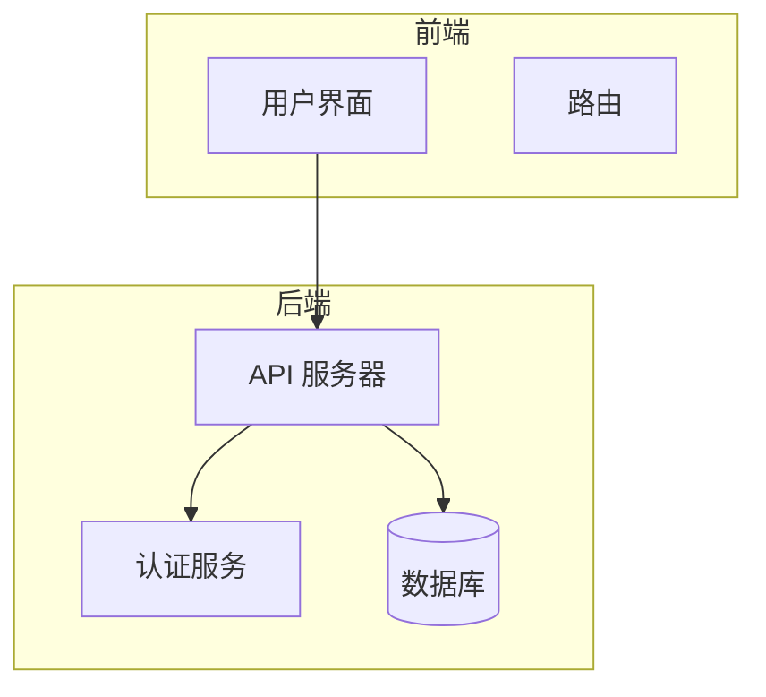
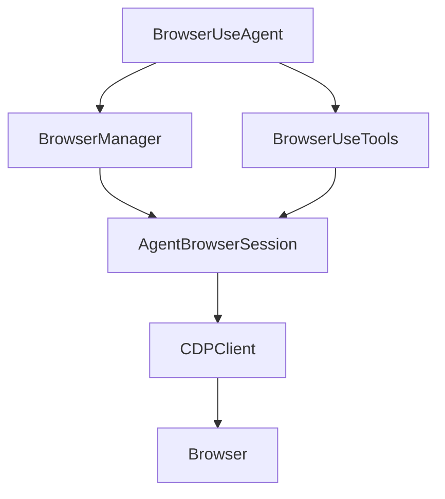
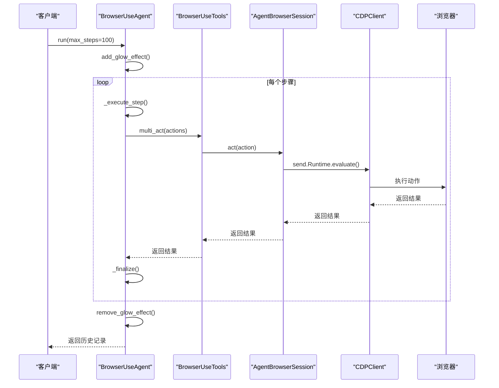
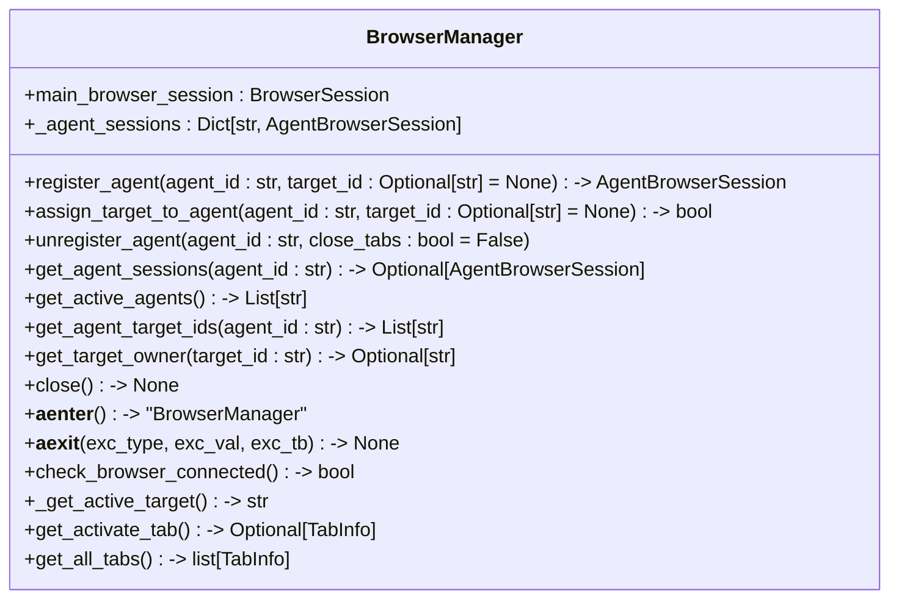
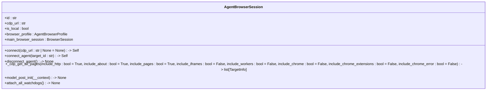
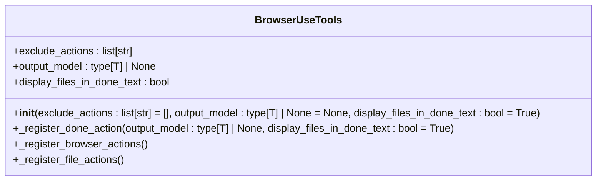
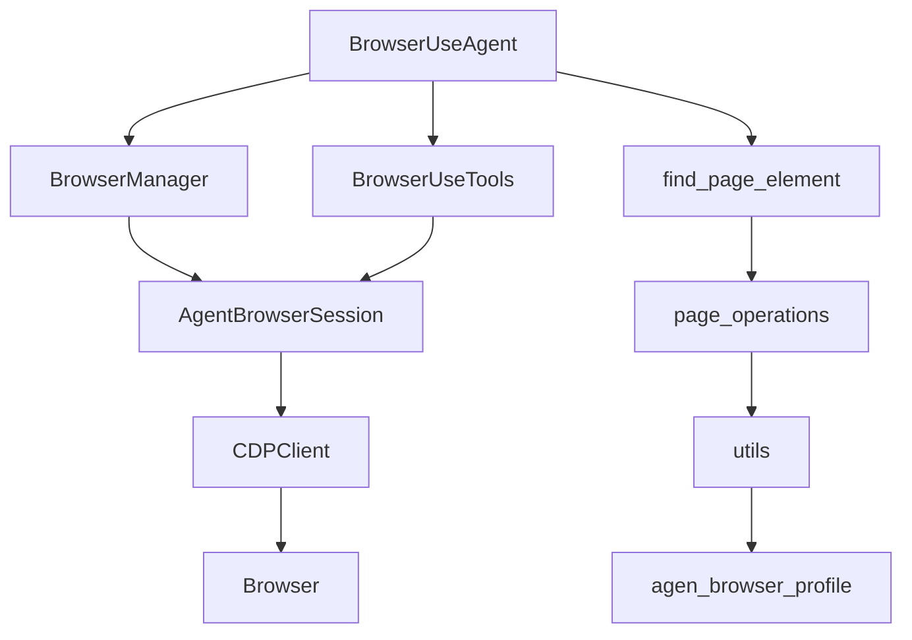

# 浏览器使用代理

<cite>
**本文档引用的文件**   
- [browser_use_agent.py](file://vibe_surf/agents/browser_use_agent.py)
- [browser_manager.py](file://vibe_surf/browser/browser_manager.py)
- [agent_browser_session.py](file://vibe_surf/browser/agent_browser_session.py)
- [browser_use_tools.py](file://vibe_surf/tools/browser_use_tools.py)
- [find_page_element.py](file://vibe_surf/browser/find_page_element.py)
- [page_operations.py](file://vibe_surf/browser/page_operations.py)
- [utils.py](file://vibe_surf/browser/utils.py)
- [agen_browser_profile.py](file://vibe_surf/browser/agen_browser_profile.py)
</cite>

## 目录
1. [简介](#简介)
2. [项目结构](#项目结构)
3. [核心组件](#核心组件)
4. [架构概述](#架构概述)
5. [详细组件分析](#详细组件分析)
6. [依赖分析](#依赖分析)
7. [性能考虑](#性能考虑)
8. [故障排除指南](#故障排除指南)
9. [结论](#结论)

## 简介
本文档深入分析了浏览器使用代理（BrowserUseAgent）的实现细节，包括其浏览器自动化能力、DOM操作机制和用户交互模拟功能。详细描述了代理如何与浏览器管理器协同工作，执行页面导航、元素定位和交互操作。解释了代理的上下文理解能力和动态决策机制。说明了如何配置代理以处理不同类型的网页和交互场景。提供了实际代码示例，展示如何使用该代理执行复杂的浏览器自动化任务。包含最佳实践指南和性能优化建议。

## 项目结构
项目结构清晰地组织了各个模块和组件，确保了代码的可维护性和可扩展性。主要目录包括`docs`、`scripts`、`tests`和`vibe_surf`。`vibe_surf`目录包含了核心功能，如`agents`、`backend`、`browser`、`chrome_extension`、`frontend`等。每个子目录都有明确的职责，例如`agents`目录包含各种代理实现，`browser`目录包含浏览器相关的功能，`tools`目录包含各种工具类。

**Section sources**
- [vibe_surf/agents](file://vibe_surf/agents)
- [vibe_surf/browser](file://vibe_surf/browser)
- [vibe_surf/tools](file://vibe_surf/tools)

## 核心组件
### BrowserUseAgent 类
`BrowserUseAgent` 类是浏览器使用代理的核心组件，负责执行各种浏览器自动化任务。它通过继承 `Agent` 类并实现其方法来提供强大的自动化功能。

**Section sources**
- [vibe_surf/agents/browser_use_agent.py](file://vibe_surf/agents/browser_use_agent.py#L83-L820)

### BrowserManager 类
`BrowserManager` 类负责管理多个代理的浏览器会话，确保每个代理都有独立的浏览器环境。它通过 `register_agent` 方法为每个代理创建和管理浏览器会话。

**Section sources**
- [vibe_surf/browser/browser_manager.py](file://vibe_surf/browser/browser_manager.py#L24-L186)

### AgentBrowserSession 类
`AgentBrowserSession` 类是 `BrowserSession` 的子类，专门为代理提供浏览器会话。它通过 `connect` 方法连接到远程或本地的浏览器，并通过 `connect_agent` 方法为代理分配目标页面。

**Section sources**
- [vibe_surf/browser/agent_browser_session.py](file://vibe_surf/browser/agent_browser_session.py#L51-L800)

### BrowserUseTools 类
`BrowserUseTools` 类提供了各种浏览器操作工具，如点击元素、输入文本、滚动页面等。这些工具通过 `Tools` 类注册，并在 `BrowserUseAgent` 中使用。

**Section sources**
- [vibe_surf/tools/browser_use_tools.py](file://vibe_surf/tools/browser_use_tools.py#L62-L492)

## 架构概述
### 系统架构

**Diagram sources**
- [vibe_surf/frontend](file://vibe_surf/frontend)
- [vibe_surf/backend](file://vibe_surf/backend)

### 组件交互

**Diagram sources**
- [vibe_surf/agents/browser_use_agent.py](file://vibe_surf/agents/browser_use_agent.py#L83-L820)
- [vibe_surf/browser/browser_manager.py](file://vibe_surf/browser/browser_manager.py#L24-L186)
- [vibe_surf/browser/agent_browser_session.py](file://vibe_surf/browser/agent_browser_session.py#L51-L800)
- [vibe_surf/tools/browser_use_tools.py](file://vibe_surf/tools/browser_use_tools.py#L62-L492)

## 详细组件分析
### BrowserUseAgent 分析
#### 初始化
`BrowserUseAgent` 的初始化方法 `__init__` 接收多个参数，包括任务描述、LLM 模型、浏览器配置等。这些参数用于配置代理的行为和环境。

```mermaid
classDiagram
class BrowserUseAgent {
+task : str
+llm : BaseChatModel
+browser_profile : BrowserProfile
+browser_session : BrowserSession
+tools : Tools
+controller : Tools
+sensitive_data : dict[str, str | dict[str, str]]
+initial_actions : list[dict[str, dict[str, Any]]]
+register_new_step_callback : Callable[['BrowserStateSummary', 'AgentOutput', int], None]
+register_done_callback : Callable[['AgentHistoryList'], Awaitable[None]]
+register_external_agent_status_raise_error_callback : Callable[[], Awaitable[bool]]
+register_should_stop_callback : Callable[[], Awaitable[bool]]
+output_model_schema : type[AgentStructuredOutput]
+use_vision : bool
+save_conversation_path : str | Path
+save_conversation_path_encoding : str
+max_failures : int
+override_system_message : str
+extend_system_message : str
+generate_gif : bool | str
+available_file_paths : list[str]
+include_attributes : list[str]
+max_actions_per_step : int
+use_thinking : bool
+flash_mode : bool
+max_history_items : int
+page_extraction_llm : BaseChatModel
+injected_agent_state : AgentState
+source : str
+file_system_path : str
+task_id : str
+calculate_cost : bool
+display_files_in_done_text : bool
+include_tool_call_examples : bool
+vision_detail_level : Literal['auto', 'low', 'high']
+llm_timeout : int
+step_timeout : int
+directly_open_url : bool
+include_recent_events : bool
+sample_images : list[ContentPartTextParam | ContentPartImageParam]
+final_response_after_failure : bool
+_url_shortening_limit : int
+token_cost_service : Optional[TokenCost]
+__init__(task : str, llm : BaseChatModel, browser_profile : BrowserProfile | None, browser_session : BrowserSession | None, tools : Tools[Context] | None, controller : Tools[Context] | None, sensitive_data : dict[str, str | dict[str, str]] | None, initial_actions : list[dict[str, dict[str, Any]]] | None, register_new_step_callback : Callable[['BrowserStateSummary', 'AgentOutput', int], None] | Callable[['BrowserStateSummary', 'AgentOutput', int], Awaitable[None]] | None, register_done_callback : Callable[['AgentHistoryList'], Awaitable[None]] | Callable[['AgentHistoryList'], None] | None, register_external_agent_status_raise_error_callback : Callable[[], Awaitable[bool]] | None, register_should_stop_callback : Callable[[], Awaitable[bool]] | None, output_model_schema : type[AgentStructuredOutput] | None, use_vision : bool, save_conversation_path : str | Path | None, save_conversation_path_encoding : str | None, max_failures : int, override_system_message : str | None, extend_system_message : str | None, generate_gif : bool | str, available_file_paths : list[str] | None, include_attributes : list[str] | None, max_actions_per_step : int, use_thinking : bool, flash_mode : bool, max_history_items : int | None, page_extraction_llm : BaseChatModel | None, injected_agent_state : AgentState | None, source : str | None, file_system_path : str | None, task_id : str | None, calculate_cost : bool, display_files_in_done_text : bool, include_tool_call_examples : bool, vision_detail_level : Literal['auto', 'low', 'high'], llm_timeout : int, step_timeout : int, directly_open_url : bool, include_recent_events : bool, sample_images : list[ContentPartTextParam | ContentPartImageParam] | None, final_response_after_failure : bool, _url_shortening_limit : int, token_cost_service : Optional[TokenCost], **kwargs) -> None
}
```

**Diagram sources**
- [vibe_surf/agents/browser_use_agent.py](file://vibe_surf/agents/browser_use_agent.py#L83-L820)

#### 运行方法
`run` 方法是 `BrowserUseAgent` 的核心方法，负责执行任务。它通过调用 `multi_act` 方法执行多个动作，并通过 `add_glow_effect` 和 `remove_glow_effect` 方法添加和移除视觉效果。

**Diagram sources**
- [vibe_surf/agents/browser_use_agent.py](file://vibe_surf/agents/browser_use_agent.py#L659-L798)

### BrowserManager 分析
#### 注册代理
`register_agent` 方法为代理创建和管理浏览器会话。它通过 `AgentBrowserSession` 类创建新的会话，并将其添加到 `_agent_sessions` 字典中。

**Diagram sources**
- [vibe_surf/browser/browser_manager.py](file://vibe_surf/browser/browser_manager.py#L24-L186)

### AgentBrowserSession 分析
#### 连接方法
`connect` 方法连接到远程或本地的浏览器，并通过 `CDPClient` 类创建和管理 CDP 客户端。

**Diagram sources**
- [vibe_surf/browser/agent_browser_session.py](file://vibe_surf/browser/agent_browser_session.py#L51-L800)

### BrowserUseTools 分析
#### 工具注册
`_register_browser_actions` 方法注册各种浏览器操作工具，如点击元素、输入文本、滚动页面等。

**Diagram sources**
- [vibe_surf/tools/browser_use_tools.py](file://vibe_surf/tools/browser_use_tools.py#L62-L492)

## 依赖分析
### 组件依赖

**Diagram sources**
- [vibe_surf/agents/browser_use_agent.py](file://vibe_surf/agents/browser_use_agent.py#L83-L820)
- [vibe_surf/browser/browser_manager.py](file://vibe_surf/browser/browser_manager.py#L24-L186)
- [vibe_surf/browser/agent_browser_session.py](file://vibe_surf/browser/agent_browser_session.py#L51-L800)
- [vibe_surf/tools/browser_use_tools.py](file://vibe_surf/tools/browser_use_tools.py#L62-L492)
- [vibe_surf/browser/find_page_element.py](file://vibe_surf/browser/find_page_element.py#L1-L800)
- [vibe_surf/browser/page_operations.py](file://vibe_surf/browser/page_operations.py#L1-L223)
- [vibe_surf/browser/utils.py](file://vibe_surf/browser/utils.py#L1-L786)
- [vibe_surf/browser/agen_browser_profile.py](file://vibe_surf/browser/agen_browser_profile.py#L1-L137)

## 性能考虑
### 缓存机制
`BrowserUseAgent` 使用缓存机制来提高性能。例如，`_set_file_system` 方法在恢复文件系统状态时会检查缓存，避免重复初始化。

### 异步处理
`BrowserUseAgent` 和 `BrowserManager` 都使用异步处理来提高响应速度。例如，`run` 方法和 `register_agent` 方法都是异步的，可以在不阻塞主线程的情况下执行任务。

### 资源管理
`BrowserManager` 通过 `close` 方法清理所有代理的资源，确保不会占用过多内存和CPU资源。

## 故障排除指南
### 常见问题
1. **无法连接到浏览器**：检查 `cdp_url` 是否正确，确保浏览器正在运行。
2. **元素定位失败**：检查元素的 CSS 选择器或 XPath 是否正确，确保元素在页面上可见。
3. **性能问题**：检查是否有过多的异步调用，确保缓存机制正常工作。

### 调试工具
- **日志记录**：使用 `logger` 记录详细的日志信息，帮助定位问题。
- **调试模式**：启用调试模式，查看详细的执行过程。

## 结论
本文档详细介绍了浏览器使用代理的实现细节，包括其浏览器自动化能力、DOM操作机制和用户交互模拟功能。通过深入分析 `BrowserUseAgent`、`BrowserManager`、`AgentBrowserSession` 和 `BrowserUseTools` 等核心组件，展示了代理如何与浏览器管理器协同工作，执行页面导航、元素定位和交互操作。此外，还提供了性能优化建议和故障排除指南，帮助开发者更好地使用和维护该代理。