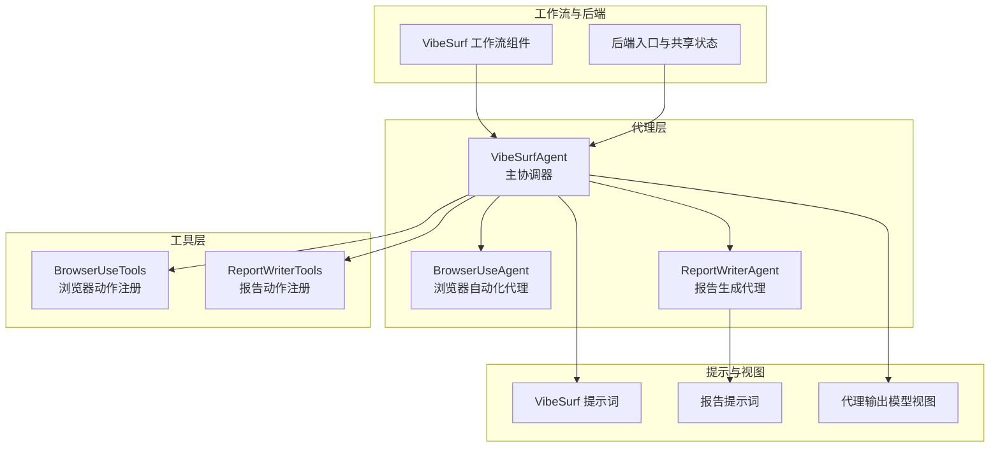
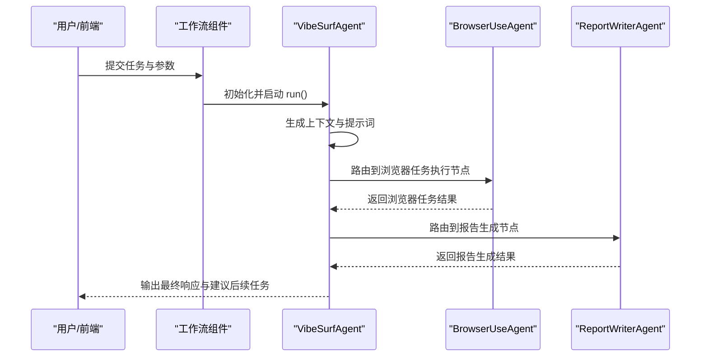
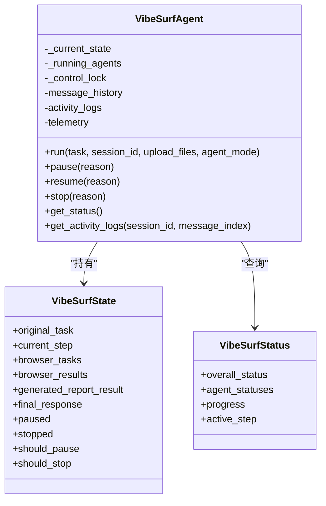
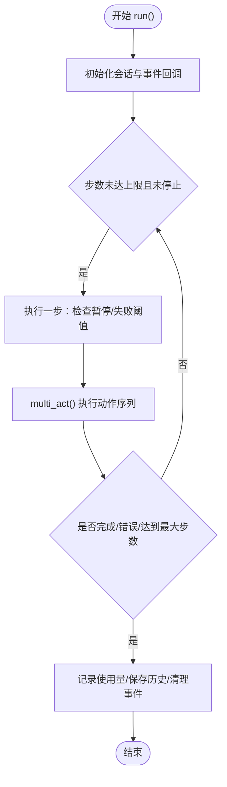
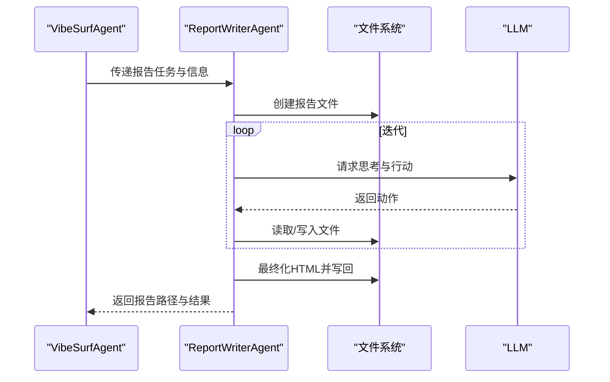
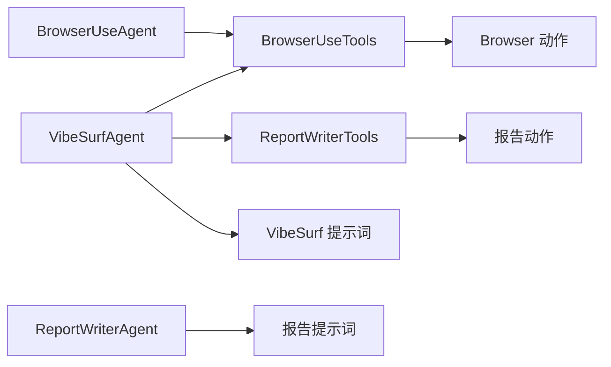

# 代理系统

<cite>
**本文引用的文件**
- [vibe_surf/agents/vibe_surf_agent.py](file://vibe_surf/agents/vibe_surf_agent.py)
- [vibe_surf/agents/browser_use_agent.py](file://vibe_surf/agents/browser_use_agent.py)
- [vibe_surf/agents/report_writer_agent.py](file://vibe_surf/agents/report_writer_agent.py)
- [vibe_surf/agents/views.py](file://vibe_surf/agents/views.py)
- [vibe_surf/agents/prompts/vibe_surf_prompt.py](file://vibe_surf/agents/prompts/vibe_surf_prompt.py)
- [vibe_surf/agents/prompts/report_writer_prompt.py](file://vibe_surf/agents/prompts/report_writer_prompt.py)
- [vibe_surf/workflows/VibeSurf/vibesurf_agent.py](file://vibe_surf/workflows/VibeSurf/vibesurf_agent.py)
- [vibe_surf/backend/main.py](file://vibe_surf/backend/main.py)
- [vibe_surf/backend/shared_state.py](file://vibe_surf/backend/shared_state.py)
- [vibe_surf/tools/browser_use_tools.py](file://vibe_surf/tools/browser_use_tools.py)
- [vibe_surf/tools/report_writer_tools.py](file://vibe_surf/tools/report_writer_tools.py)
- [tests/test_agents.py](file://tests/test_agents.py)
</cite>

## 目录
1. [简介](#简介)
2. [项目结构](#项目结构)
3. [核心组件](#核心组件)
4. [架构总览](#架构总览)
5. [详细组件分析](#详细组件分析)
6. [依赖关系分析](#依赖关系分析)
7. [性能考量](#性能考量)
8. [故障排查指南](#故障排查指南)
9. [结论](#结论)
10. [附录](#附录)

## 简介
本文件系统性文档化 VibeSurf 的代理系统，重点覆盖以下方面：
- 核心代理设计：VibeSurfAgent、BrowserUseAgent、ReportWriterAgent 的职责与协作
- 生命周期管理：从创建、配置、执行到销毁的全流程控制
- 代理间通信与协调：在多代理并行场景下的同步与异步交互
- 配置选项：LLM 选择、提示工程、行为参数
- 自定义代理开发指南：如何扩展现有代理或创建全新类型代理
- 性能监控与调试：遥测事件、活动日志、状态查询与常见问题定位

## 项目结构
代理系统主要分布在以下模块：
- agents：核心代理类与提示工程
- tools：代理可调用的工具集（浏览器自动化、报告生成等）
- workflows：前端工作流组件桥接后端代理
- backend：后端服务、共享状态与初始化流程
- tests：代理控制与生命周期测试

图表来源
- [vibe_surf/agents/vibe_surf_agent.py](file://vibe_surf/agents/vibe_surf_agent.py#L1-L200)
- [vibe_surf/agents/browser_use_agent.py](file://vibe_surf/agents/browser_use_agent.py#L1-L120)
- [vibe_surf/agents/report_writer_agent.py](file://vibe_surf/agents/report_writer_agent.py#L1-L120)
- [vibe_surf/agents/prompts/vibe_surf_prompt.py](file://vibe_surf/agents/prompts/vibe_surf_prompt.py#L1-L120)
- [vibe_surf/agents/prompts/report_writer_prompt.py](file://vibe_surf/agents/prompts/report_writer_prompt.py#L1-L74)
- [vibe_surf/workflows/VibeSurf/vibesurf_agent.py](file://vibe_surf/workflows/VibeSurf/vibesurf_agent.py#L1-L114)
- [vibe_surf/backend/main.py](file://vibe_surf/backend/main.py#L1-L120)

章节来源
- [vibe_surf/agents/vibe_surf_agent.py](file://vibe_surf/agents/vibe_surf_agent.py#L1-L200)
- [vibe_surf/agents/browser_use_agent.py](file://vibe_surf/agents/browser_use_agent.py#L1-L120)
- [vibe_surf/agents/report_writer_agent.py](file://vibe_surf/agents/report_writer_agent.py#L1-L120)
- [vibe_surf/workflows/VibeSurf/vibesurf_agent.py](file://vibe_surf/workflows/VibeSurf/vibesurf_agent.py#L1-L114)
- [vibe_surf/backend/main.py](file://vibe_surf/backend/main.py#L1-L120)

## 核心组件
- VibeSurfAgent：主协调器，负责任务规划、路由到子代理、状态管理与结果汇总。支持暂停/恢复/停止、并发子代理跟踪、活动日志与遥测上报。
- BrowserUseAgent：基于 browser-use 框架的浏览器自动化代理，具备多步骤执行、文件系统集成、令牌成本统计、信号处理与回调钩子。
- ReportWriterAgent：LLM 驱动的报告生成代理，采用“思考+行动”模式，通过工具链读取/写入文件并生成专业 HTML 报告。

章节来源
- [vibe_surf/agents/vibe_surf_agent.py](file://vibe_surf/agents/vibe_surf_agent.py#L346-L546)
- [vibe_surf/agents/browser_use_agent.py](file://vibe_surf/agents/browser_use_agent.py#L83-L240)
- [vibe_surf/agents/report_writer_agent.py](file://vibe_surf/agents/report_writer_agent.py#L34-L120)

## 架构总览
VibeSurf 采用“主代理 + 子代理”的分层架构：
- 主代理（VibeSurfAgent）通过 LangGraph 节点驱动，结合提示工程与工具集，决定下一步是执行浏览器任务还是生成报告。
- 浏览器代理（BrowserUseAgent）并行执行多个独立任务，每个任务拥有独立的工作目录与浏览器会话，支持多标签页分配与资源隔离。
- 报告代理（ReportWriterAgent）在收到浏览器结果后，按统一提示词生成 HTML 报告，自动转换相对路径为绝对 file:// 链接。

图表来源
- [vibe_surf/workflows/VibeSurf/vibesurf_agent.py](file://vibe_surf/workflows/VibeSurf/vibesurf_agent.py#L81-L114)
- [vibe_surf/agents/vibe_surf_agent.py](file://vibe_surf/agents/vibe_surf_agent.py#L346-L546)
- [vibe_surf/agents/browser_use_agent.py](file://vibe_surf/agents/browser_use_agent.py#L658-L800)
- [vibe_surf/agents/report_writer_agent.py](file://vibe_surf/agents/report_writer_agent.py#L106-L200)

## 详细组件分析

### VibeSurfAgent 分析
- 角色与职责
  - 任务规划与路由：根据 LLM 输出决定执行浏览器任务或报告生成，并维护状态机推进。
  - 并发控制：对浏览器代理执行进行串行/并行调度，跟踪运行中的子代理，支持统一暂停/恢复/停止。
  - 上下文整合：聚合浏览器标签信息、历史结果、报告生成状态，形成丰富的提示上下文。
  - 日志与遥测：记录每一步思考、行动与异常，捕获解析输出事件与异常事件，支持会话级活动日志持久化。
- 生命周期管理
  - 创建：接收 LLM、BrowserManager、工具集与工作区目录，初始化消息历史、活动日志与遥测。
  - 执行：run() 中构建 LangGraph 工作流，循环执行节点直至完成；支持暂停/恢复/停止与超时控制。
  - 销毁：清理当前状态、执行任务引用、清空运行中代理集合，保存会话数据。
- 关键接口
  - pause()/resume()/stop()：全局暂停/恢复/停止，同时广播到所有运行中的子代理。
  - get_status()：返回整体状态与各子代理状态快照。
  - get_activity_logs()：按会话检索活动日志，支持索引访问。
- 并发与同步
  - 控制感知节点包装：在节点执行前检查停止/暂停标志，暂停时阻塞等待外部事件。
  - 并行浏览器任务：批量注册代理、并发执行、收集结果并统一回传主代理。
- 数据结构
  - VibeSurfState：LangGraph 状态容器，包含原始任务、上传文件、会话 ID、当前步骤、浏览器任务队列与结果、最终响应等。
  - VibeSurfStatus/AgentStatus：整体与单个代理的状态模型。

图表来源
- [vibe_surf/agents/vibe_surf_agent.py](file://vibe_surf/agents/vibe_surf_agent.py#L1201-L1840)

章节来源
- [vibe_surf/agents/vibe_surf_agent.py](file://vibe_surf/agents/vibe_surf_agent.py#L1201-L1840)

### BrowserUseAgent 分析
- 角色与职责
  - 独立浏览器自动化执行者，支持多步骤、多动作、文件系统与截图服务、令牌成本统计。
  - 支持初始 URL 直达、URL 提取、安全域限制、敏感数据保护、信号处理与强制退出遥测。
- 生命周期管理
  - 初始化：设置浏览器会话、文件系统、工具注册、系统提示词、令牌成本服务与事件回调。
  - 执行：run() 主循环，按最大步数迭代，支持暂停/恢复/停止、失败计数与最终响应。
  - 清理：移除高光效果、记录使用量、保存历史与会话事件。
- 关键接口
  - run(max_steps, on_step_start, on_step_end)：主执行入口。
  - multi_act(actions)：顺序执行多个动作，带间隔与错误处理。
  - add_new_task(new_task)：在连续任务中追加新指令。
  - pause()/resume()/stop()：受控暂停/恢复/停止。
- 并发与同步
  - 外部事件：使用 asyncio.Event 实现暂停/恢复的外部阻塞。
  - 信号处理：SignalHandler 注册暂停/恢复/强制退出回调，确保可控退出与遥测上报。

图表来源
- [vibe_surf/agents/browser_use_agent.py](file://vibe_surf/agents/browser_use_agent.py#L658-L800)

章节来源
- [vibe_surf/agents/browser_use_agent.py](file://vibe_surf/agents/browser_use_agent.py#L83-L240)
- [vibe_surf/agents/browser_use_agent.py](file://vibe_surf/agents/browser_use_agent.py#L658-L800)

### ReportWriterAgent 分析
- 角色与职责
  - 基于 LLM 的报告生成器，遵循统一提示词，通过工具链读取/写入文件，最终输出专业 HTML 报告。
- 生命周期管理
  - 初始化：设置 LLM、工作区、工具注册、消息历史、遥测与暂停/恢复/停止控制。
  - 执行：generate_report() 主循环，按最大迭代次数推进，记录每步思考与行动，支持中断与回退。
  - 清理：生成 HTML 报告，清理与规范化内容，必要时生成降级报告。
- 关键接口
  - generate_report(report_data)：主生成流程。
  - add_new_task(new_task)：在执行中注入新的任务指导。
  - pause()/resume()/stop()：受控暂停/恢复/停止。
- 文件链接转换
  - 将相对路径转换为绝对 file:// URL，保证报告内资源可访问。

图表来源
- [vibe_surf/agents/report_writer_agent.py](file://vibe_surf/agents/report_writer_agent.py#L106-L200)
- [vibe_surf/agents/prompts/report_writer_prompt.py](file://vibe_surf/agents/prompts/report_writer_prompt.py#L1-L74)

章节来源
- [vibe_surf/agents/report_writer_agent.py](file://vibe_surf/agents/report_writer_agent.py#L34-L120)
- [vibe_surf/agents/report_writer_agent.py](file://vibe_surf/agents/report_writer_agent.py#L106-L200)

### 代理间通信与协调
- 路由与状态推进
  - VibeSurfAgent 在节点中解析 LLM 输出，根据动作名路由到浏览器任务执行或报告生成节点，更新当前步骤与状态。
- 并行浏览器任务
  - 批量注册代理、并发执行、统一收集结果；每个代理独立工作目录与浏览器会话，避免冲突。
- 统一控制
  - 全局暂停/恢复/停止会广播到所有运行中的子代理；子代理内部也支持自身暂停/恢复/停止。
- 活动日志与遥测
  - 主代理记录每一步思考与行动摘要，子代理分别记录自身步骤；支持按会话检索与导出。

章节来源
- [vibe_surf/agents/vibe_surf_agent.py](file://vibe_surf/agents/vibe_surf_agent.py#L346-L546)
- [vibe_surf/agents/vibe_surf_agent.py](file://vibe_surf/agents/vibe_surf_agent.py#L607-L763)
- [vibe_surf/agents/vibe_surf_agent.py](file://vibe_surf/agents/vibe_surf_agent.py#L1233-L1415)

## 依赖关系分析
- 组件耦合
  - VibeSurfAgent 依赖 BrowserUseTools 与 ReportWriterTools，用于动作注册与执行。
  - BrowserUseAgent 依赖 browser-use 的 Agent/Tools/MessageManager/TokenCost 等组件。
  - ReportWriterAgent 依赖自定义工具集与文件系统。
- 外部依赖
  - LLM 适配：通过 browser-use 的 BaseChatModel 接口，支持多种提供商。
  - 浏览器会话：BrowserSession/AgentBrowserSession 提供无头/有头浏览器环境。
  - 遥测与日志：ProductTelemetry 与自定义 logger。
- 可能的循环依赖
  - 代理与工具之间通过 registry 动态注册动作，避免直接循环导入。

图表来源
- [vibe_surf/tools/browser_use_tools.py](file://vibe_surf/tools/browser_use_tools.py#L62-L120)
- [vibe_surf/tools/report_writer_tools.py](file://vibe_surf/tools/report_writer_tools.py#L1-L23)
- [vibe_surf/agents/prompts/vibe_surf_prompt.py](file://vibe_surf/agents/prompts/vibe_surf_prompt.py#L1-L120)
- [vibe_surf/agents/prompts/report_writer_prompt.py](file://vibe_surf/agents/prompts/report_writer_prompt.py#L1-L74)

章节来源
- [vibe_surf/tools/browser_use_tools.py](file://vibe_surf/tools/browser_use_tools.py#L62-L120)
- [vibe_surf/tools/report_writer_tools.py](file://vibe_surf/tools/report_writer_tools.py#L1-L23)

## 性能考量
- 并行执行
  - 浏览器代理并行执行可显著缩短多任务总耗时，但需注意浏览器会话与标签页资源竞争。
- 步数与超时
  - 通过 max_steps、llm_timeout、step_timeout 控制执行节奏与资源占用。
- 成本与日志
  - 启用 calculate_cost 与 token_cost_service 记录使用量；合理裁剪活动日志大小以降低 IO 压力。
- 文件系统与下载
  - 使用专用工作目录与文件系统封装，避免跨目录操作带来的性能与安全风险。

[本节为通用指导，不直接分析具体文件]

## 故障排查指南
- 常见问题
  - 浏览器连接断开：后端提供浏览器监控任务，检测到无可用浏览器时触发优雅关闭。
  - 代理被卡住：检查暂停/恢复状态与外部事件；确认 SignalHandler 是否正确注册。
  - LLM 调用失败：查看遥测错误事件与活动日志；核对模型配置与网络连通性。
  - 报告路径不可访问：确认相对路径已转换为 file:// 绝对路径。
- 定位手段
  - 活动日志：按会话检索，查看每一步思考与行动摘要。
  - 遥测事件：解析输出事件与异常事件，定位具体函数与错误类型。
  - 单元测试：参考测试用例验证控制功能（暂停/恢复/停止）与简单任务执行。

章节来源
- [vibe_surf/backend/main.py](file://vibe_surf/backend/main.py#L103-L149)
- [vibe_surf/agents/vibe_surf_agent.py](file://vibe_surf/agents/vibe_surf_agent.py#L1738-L1840)
- [tests/test_agents.py](file://tests/test_agents.py#L261-L390)

## 结论
VibeSurf 的代理系统通过清晰的角色分工与严格的生命周期管理，实现了从任务规划到结果交付的全链路自动化。主代理负责统筹协调，子代理专注于各自领域，配合工具集与提示工程，既保证了灵活性，又确保了可观测性与可控性。通过并行执行与统一控制，系统在复杂任务场景下具备良好的吞吐与稳定性。

[本节为总结性内容，不直接分析具体文件]

## 附录

### 代理配置选项与提示工程
- LLM 选择
  - 通过工作流组件或后端共享状态注入 LLM 实例；支持多种提供商与模型参数。
- 行为参数
  - agent_mode：thinking/no-thinking/flash，影响输出结构与思考字段。
  - max_actions_per_step、llm_timeout、step_timeout：控制执行粒度与超时。
  - include_token_cost/calculate_cost：启用成本统计。
- 提示工程
  - VibeSurf 提示词：明确角色、能力、最佳实践、文件操作规范与安全准则。
  - 报告提示词：强调读取/写入流程、HTML 格式要求与标题规范。
  - 浏览器扩展提示词：补充文件系统路径、截图视觉信息与安全注意事项。

章节来源
- [vibe_surf/agents/views.py](file://vibe_surf/agents/views.py#L59-L124)
- [vibe_surf/agents/prompts/vibe_surf_prompt.py](file://vibe_surf/agents/prompts/vibe_surf_prompt.py#L1-L219)
- [vibe_surf/agents/prompts/report_writer_prompt.py](file://vibe_surf/agents/prompts/report_writer_prompt.py#L1-L74)
- [vibe_surf/workflows/VibeSurf/vibesurf_agent.py](file://vibe_surf/workflows/VibeSurf/vibesurf_agent.py#L29-L67)

### 自定义代理开发指南
- 扩展现有代理
  - 在现有工具集基础上注册新动作：参考 BrowserUseTools/ReportWriterTools 的注册方式，使用 registry.action 装饰器。
  - 修改输出模型：通过 CustomAgentOutput 或 VibeSurfAgentOutput 扩展动作列表与字段约束。
- 创建全新代理
  - 设计动作模型与工具集，实现 run()/pause()/resume()/stop() 生命周期方法。
  - 集成文件系统与令牌成本统计，接入遥测事件上报。
  - 在 VibeSurfAgent 中新增路由节点，将动作名映射到新代理的执行逻辑。
- 注意事项
  - 保持与 browser-use 的兼容性，遵循动作参数模型与 ActionResult 规范。
  - 严格控制文件系统访问范围，避免越权操作。
  - 为长任务设置合理的超时与重试策略。

章节来源
- [vibe_surf/tools/browser_use_tools.py](file://vibe_surf/tools/browser_use_tools.py#L62-L120)
- [vibe_surf/tools/report_writer_tools.py](file://vibe_surf/tools/report_writer_tools.py#L1-L23)
- [vibe_surf/agents/views.py](file://vibe_surf/agents/views.py#L26-L58)
- [vibe_surf/agents/vibe_surf_agent.py](file://vibe_surf/agents/vibe_surf_agent.py#L346-L546)

### 后端初始化与共享状态
- 初始化流程
  - 后端启动时配置 Langflow 环境变量、数据库路径与日志级别。
  - 初始化浏览器管理器与主浏览器会话，创建 VibeSurfAgent 实例。
- 监控与健康
  - 后台任务监控浏览器连接状态，异常时触发优雅关闭。

章节来源
- [vibe_surf/backend/main.py](file://vibe_surf/backend/main.py#L66-L120)
- [vibe_surf/backend/shared_state.py](file://vibe_surf/backend/shared_state.py#L574-L611)