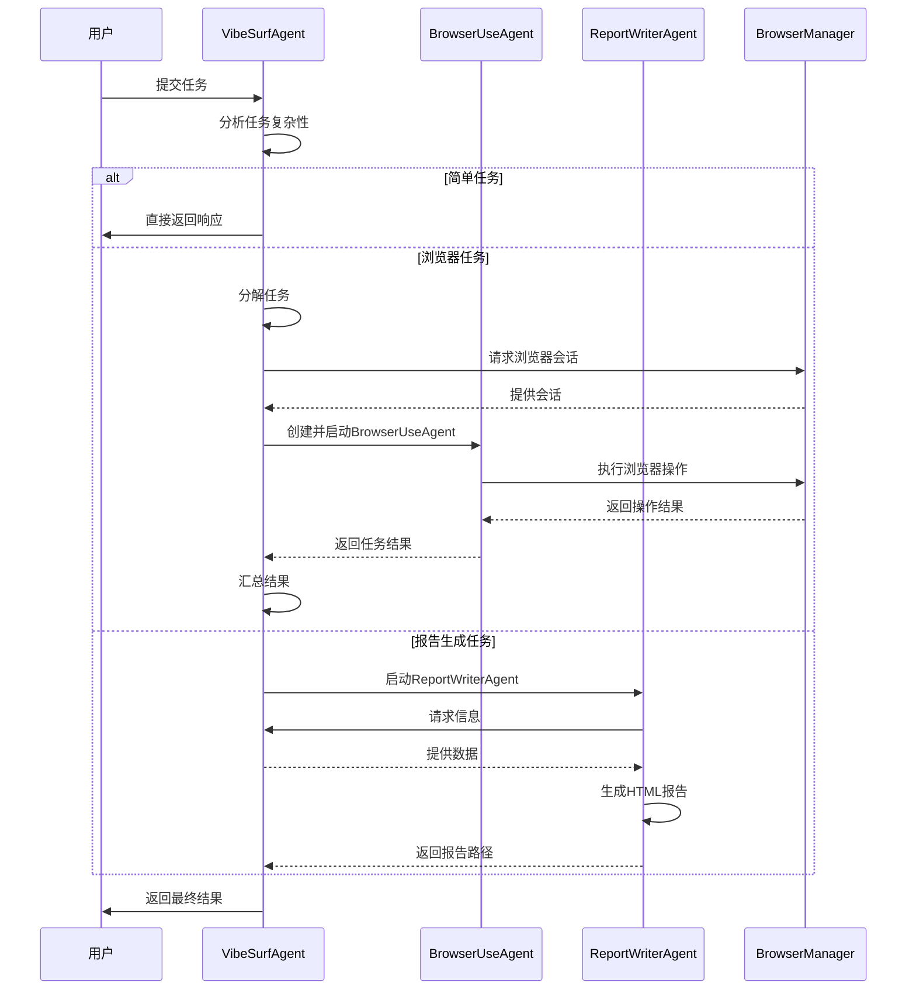

# 代理架构概述

<cite>
**本文档引用的文件**  
- [vibe_surf_agent.py](file://vibe_surf/agents/vibe_surf_agent.py)
- [browser_use_agent.py](file://vibe_surf/agents/browser_use_agent.py)
- [report_writer_agent.py](file://vibe_surf/agents/report_writer_agent.py)
- [vibe_surf_prompt.py](file://vibe_surf/agents/prompts/vibe_surf_prompt.py)
- [report_writer_prompt.py](file://vibe_surf/agents/prompts/report_writer_prompt.py)
- [browser_manager.py](file://vibe_surf/browser/browser_manager.py)
- [shared_state.py](file://vibe_surf/backend/shared_state.py)
- [main.py](file://vibe_surf/backend/main.py)
</cite>

## 目录
1. [引言](#引言)
2. [核心代理组件](#核心代理组件)
3. [代理协作模式与通信机制](#代理协作模式与通信机制)
4. [系统集成架构](#系统集成架构)
5. [系统架构图](#系统架构图)
6. [设计决策与权衡](#设计决策与权衡)
7. [结论](#结论)

## 引言

VibeSurf代理系统是一个先进的自动化框架，旨在通过智能代理协同完成复杂的浏览器自动化和内容生成任务。该系统采用模块化设计，由三个核心代理组件构成：VibeSurfAgent作为主控代理，负责整体任务的规划与协调；BrowserUseAgent专门处理浏览器自动化操作；ReportWriterAgent则专注于内容生成与报告撰写。这种职责分离的设计模式不仅提高了系统的可维护性和可扩展性，还实现了任务执行的并行化，显著提升了处理效率。本文档将详细阐述该系统的整体架构设计、组件间的协作模式、与外部服务的集成方式，并深入探讨设计决策背后的权衡考量。

## 核心代理组件

VibeSurf代理系统的核心由三个高度专业化的代理组件构成，它们各司其职，共同完成复杂的自动化任务。

**VibeSurfAgent** 是整个系统的主控代理，扮演着“指挥官”的角色。它负责接收用户任务，进行高层次的规划和决策，并协调其他代理的工作。该代理通过LangGraph工作流引擎管理任务的执行流程，能够根据任务的复杂性决定是直接响应、调用BrowserUseAgent执行浏览器任务，还是启动ReportWriterAgent生成报告。其核心功能包括任务分解、状态管理、控制流（暂停/停止）处理以及与后端API的集成。

**BrowserUseAgent** 是一个专门的浏览器自动化代理，继承自`browser_use`库的`Agent`类。它被设计用于执行具体的网页交互任务，如导航、点击、输入文本、提取数据等。当VibeSurfAgent需要执行浏览器操作时，它会创建一个或多个BrowserUseAgent实例，每个实例可以独立或并行地在不同的浏览器标签页中执行子任务。该代理利用CDP（Chrome DevTools Protocol）与浏览器进行深度交互，并通过视觉输入（截图）来理解网页的DOM结构。

**ReportWriterAgent** 是一个内容生成代理，其职责是根据收集到的信息生成结构化的HTML报告。它不直接与浏览器交互，而是接收来自VibeSurfAgent的报告生成指令和相关数据。该代理使用LLM驱动的流程，通过读取文件、生成内容和格式化输出等步骤，创建专业、美观的HTML报告。其设计确保了报告内容与技术执行过程的分离，使最终输出更加专注于用户需求。

**Section sources**
- [vibe_surf_agent.py](file://vibe_surf/agents/vibe_surf_agent.py#L1-L130)
- [browser_use_agent.py](file://vibe_surf/agents/browser_use_agent.py#L83-L144)
- [report_writer_agent.py](file://vibe_surf/agents/report_writer_agent.py#L34-L76)

## 代理协作模式与通信机制

三个核心代理组件通过精心设计的协作模式和通信机制紧密配合，形成一个高效的工作流。

协作模式遵循一个清晰的“主控-执行”范式。**VibeSurfAgent** 作为主控节点，首先分析用户请求。如果任务简单，它会直接生成响应。如果任务涉及浏览器操作，它会调用`execute_browser_use_agent`动作，将任务分解并分派给一个或多个**BrowserUseAgent**实例。这些实例在`BrowserManager`的管理下，被分配到独立的浏览器会话中并行执行。任务完成后，结果会返回给VibeSurfAgent。如果需要生成报告，VibeSurfAgent会调用`execute_report_writer_agent`动作，将信息传递给**ReportWriterAgent**，由其生成最终的HTML报告。

通信机制主要基于**动作（Action）和状态（State）**。VibeSurfAgent通过定义特定的动作（如`execute_browser_use_agent`）来向下游代理发出指令。这些指令通过`VibeSurfState`数据类在LangGraph工作流中传递。例如，当VibeSurfAgent决定执行浏览器任务时，它会将任务列表填充到`state.browser_tasks`字段中，并将`state.current_step`设置为`"browser_task_execution"`，从而触发相应的工作流节点。BrowserUseAgent和ReportWriterAgent在执行完毕后，会将结果（如`BrowserTaskResult`或`ReportTaskResult`）写回`state`对象，供VibeSurfAgent进行后续决策。此外，系统还使用日志记录（`log_agent_activity`函数）作为辅助通信手段，用于记录每个代理的活动和状态变化。



**Diagram sources**
- [vibe_surf_agent.py](file://vibe_surf/agents/vibe_surf_agent.py#L344-L546)
- [browser_use_agent.py](file://vibe_surf/agents/browser_use_agent.py#L659-L774)
- [report_writer_agent.py](file://vibe_surf/agents/report_writer_agent.py#L106-L316)

## 系统集成架构

VibeSurf代理系统通过后端API与多个关键模块和服务进行集成，构建了一个完整的自动化生态。

与**后端API**的集成是系统的核心。`backend/main.py`文件定义了一个FastAPI应用，它暴露了多个RESTful端点（如`/api/tasks`、`/api/files`），为前端或外部系统提供了与代理交互的接口。`shared_state.py`模块维护了全局共享状态，如`vibesurf_agent`、`browser_manager`和`db_manager`等实例，确保了整个应用生命周期内组件的单例性和状态一致性。当API接收到任务请求时，它会通过`execute_task_background`函数在后台启动代理执行流程。

与**浏览器管理模块**的集成通过`BrowserManager`类实现。该类管理着一个主浏览器会话（`main_browser_session`），并为每个代理创建隔离的`AgentBrowserSession`。这种设计确保了不同代理之间的操作互不干扰，提高了安全性和稳定性。`BrowserManager`负责会话的注册、分配和清理，并通过CDP客户端与浏览器进行通信。

与**LLM服务**的集成是代理智能的来源。系统通过`llm`配置文件和数据库中的LLM配置文件来管理不同的LLM实例（如`ChatOpenAI`）。`VibeSurfAgent`和`ReportWriterAgent`都接收一个`llm`参数，用于执行推理和生成。系统支持动态切换LLM配置文件，允许用户根据任务需求选择不同的模型。此外，系统还集成了MCP（Model Context Protocol）和Composio等工具，通过`VibeSurfTools`扩展了代理的能力，使其能够调用外部API和工具。

**Section sources**
- [main.py](file://vibe_surf/backend/main.py#L543-L794)
- [shared_state.py](file://vibe_surf/backend/shared_state.py#L38-L85)
- [browser_manager.py](file://vibe_surf/browser/browser_manager.py#L24-L186)

## 系统架构图

```mermaid
graph TD
subgraph "前端/用户界面"
UI[用户/外部系统]
end
subgraph "后端API"
API[FastAPI]
API --> |HTTP请求| VSA
end
subgraph "代理系统"
VSA[VibeSurfAgent<br>主控代理]
BUA[BrowserUseAgent<br>浏览器自动化代理]
RWA[ReportWriterAgent<br>报告生成代理]
FS[CustomFileSystem<br>文件系统]
BM[BrowserManager<br>浏览器管理器]
Tools[VibeSurfTools<br>工具集]
VSA --> |分派任务| BUA
VSA --> |生成报告| RWA
VSA --> |管理状态| FS
VSA --> |协调会话| BM
VSA --> |调用工具| Tools
BUA --> |执行操作| BM
BUA --> |读写文件| FS
RWA --> |读取数据| FS
RWA --> |写入报告| FS
end
subgraph "外部服务"
LLM[LLM服务<br>(如OpenAI)]
Browser[浏览器实例]
DB[(数据库)]
MCP[MCP服务器]
Composio[Composio]
end
VSA --> |推理/生成| LLM
BM --> |CDP协议| Browser
API --> |数据持久化| DB
Tools --> |调用| MCP
Tools --> |集成| Composio
UI --> API
style VSA fill:#4CAF50,stroke:#388E3C
style BUA fill:#2196F3,stroke:#1976D2
style RWA fill:#FF9800,stroke:#F57C00
```

**Diagram sources**
- [main.py](file://vibe_surf/backend/main.py#L543-L794)
- [vibe_surf_agent.py](file://vibe_surf/agents/vibe_surf_agent.py#L1-L130)
- [browser_manager.py](file://vibe_surf/browser/browser_manager.py#L24-L186)
- [shared_state.py](file://vibe_surf/backend/shared_state.py#L38-L85)

## 设计决策与权衡

VibeSurf代理系统的设计体现了在模块化、性能和可维护性之间的深思熟虑的权衡。

**模块化设计带来的优势与开销**：系统采用高度模块化的设计，将主控、浏览器自动化和报告生成的职责清晰地分离到三个独立的代理中。这一决策极大地提升了系统的**可维护性**和**可测试性**。每个代理可以独立开发、更新和调试，降低了代码的耦合度。然而，这种模块化也引入了**性能开销**。代理间的通信（通过状态对象传递数据）和上下文切换（如创建新的`AgentBrowserSession`）都需要额外的计算资源和时间。例如，启动一个BrowserUseAgent实例需要建立CDP连接和初始化会话，这在执行大量微小任务时可能成为瓶颈。

**并行执行与资源管理**：系统支持并行执行多个浏览器任务，这是提升效率的关键设计。通过`BrowserManager`可以为不同的任务分配独立的标签页或会话，实现真正的并发。这一设计在处理独立的子任务（如同时搜索多个主题）时能显著缩短总执行时间。但其权衡在于**资源消耗**。每个并行的代理都需要占用浏览器内存和CPU资源，过度并行可能导致系统资源耗尽。因此，系统需要智能的任务调度和资源监控机制来平衡效率与稳定性。

**安全与功能的平衡**：系统在安全性方面做出了严格的设计决策。例如，文件操作被严格限制在工作目录（`workspace_dir`）内，防止了对系统文件的意外或恶意访问。在Python代码执行能力中，系统禁止了`subprocess`和`os.system`等危险操作。这些措施确保了用户系统的安全，但也在一定程度上**限制了功能的灵活性**。用户无法执行需要系统级权限的操作，这在某些高级自动化场景中可能被视为限制。

**抽象与复杂性**：通过LangGraph构建工作流，为系统提供了强大的控制流管理能力（如暂停、停止）。这种抽象简化了复杂任务的编排，但也增加了系统的**概念复杂性**。开发者需要理解工作流引擎的机制才能进行深度定制。总体而言，这些设计决策优先考虑了系统的健壮性、安全性和长期可维护性，为构建一个可靠的企业级自动化工具奠定了坚实的基础。

**Section sources**
- [vibe_surf_agent.py](file://vibe_surf/agents/vibe_surf_agent.py#L300-L342)
- [browser_manager.py](file://vibe_surf/browser/browser_manager.py#L24-L186)
- [vibe_surf_prompt.py](file://vibe_surf/agents/prompts/vibe_surf_prompt.py#L154-L178)

## 结论

VibeSurf代理系统通过一个精巧的三层代理架构，成功地将复杂的自动化任务分解为可管理的单元。VibeSurfAgent作为智能中枢，BrowserUseAgent作为执行终端，ReportWriterAgent作为输出生成器，三者通过清晰的协作模式和状态驱动的通信机制高效协同。系统与后端API、浏览器和LLM服务的深度集成，构建了一个功能强大且灵活的自动化平台。尽管模块化设计带来了额外的性能开销，但其在可维护性、安全性和可扩展性方面的巨大优势，使得这一权衡在长期来看是合理且必要的。VibeSurf的设计为构建下一代智能代理系统提供了一个优秀的范例。