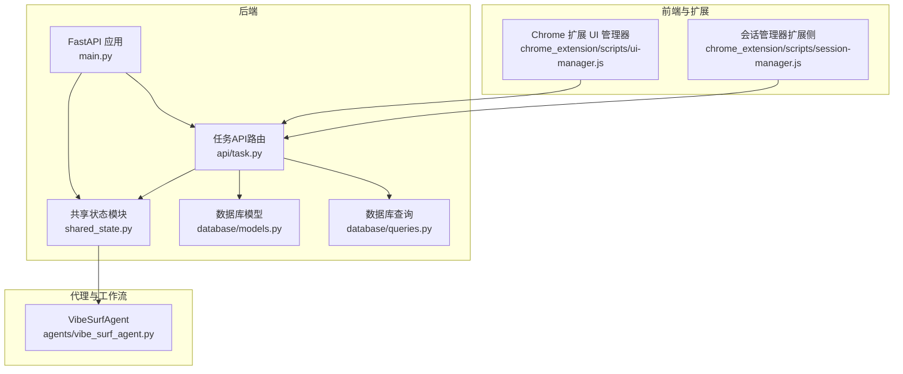
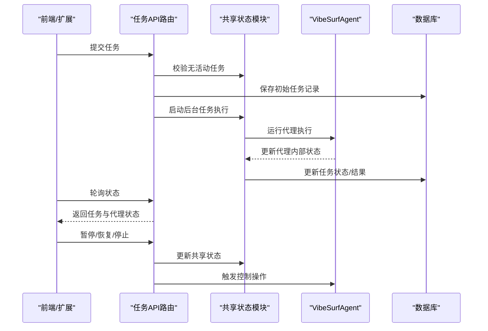
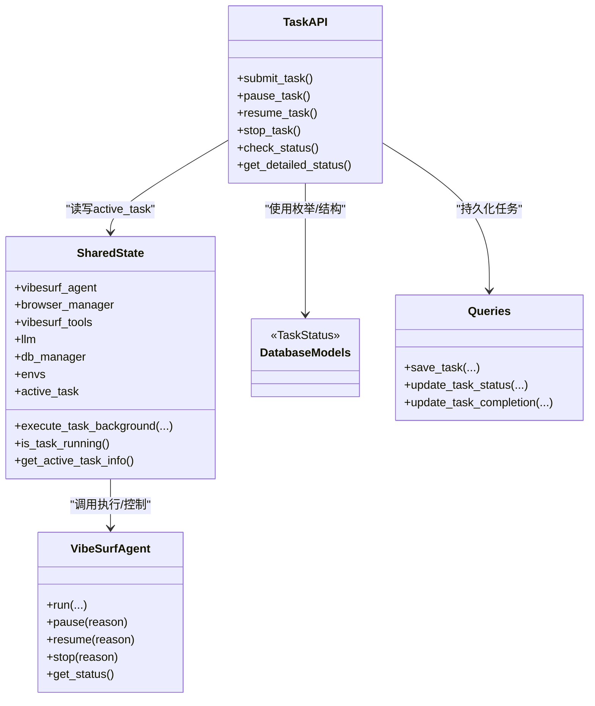
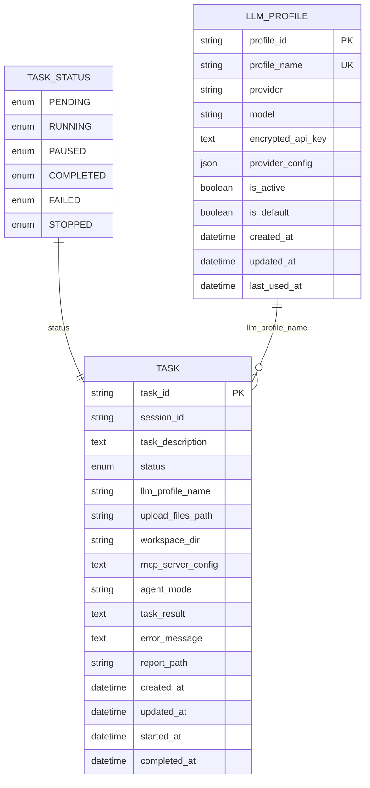

# 代理状态管理

<cite>
**本文引用的文件列表**
- [shared_state.py](file://vibe_surf/backend/shared_state.py)
- [main.py](file://vibe_surf/backend/main.py)
- [task.py](file://vibe_surf/backend/api/task.py)
- [models.py](file://vibe_surf/backend/database/models.py)
- [queries.py](file://vibe_surf/backend/database/queries.py)
- [vibe_surf_agent.py](file://vibe_surf/agents/vibe_surf_agent.py)
- [ui-manager.js](file://vibe_surf/chrome_extension/scripts/ui-manager.js)
- [session-manager.js](file://vibe_surf/chrome_extension/scripts/session-manager.js)
- [state/service.py](file://vibe_surf/langflow/services/state/service.py)
- [cache/factory.py](file://vibe_surf/langflow/services/cache/factory.py)
- [cache/__init__.py](file://vibe_surf/langflow/services/cache/__init__.py)
</cite>

## 目录
1. [引言](#引言)
2. [项目结构与角色定位](#项目结构与角色定位)
3. [核心组件与职责](#核心组件与职责)
4. [架构总览](#架构总览)
5. [详细组件分析](#详细组件分析)
6. [依赖关系分析](#依赖关系分析)
7. [性能与并发特性](#性能与并发特性)
8. [故障排查指南](#故障排查指南)
9. [结论](#结论)
10. [附录：状态模型图与实践示例](#附录状态模型图与实践示例)

## 引言
本文件聚焦于VibeSurf代理系统的状态管理，系统采用“单任务模式”（single-task execution）与“多代理并行执行”相结合的设计。状态管理贯穿以下维度：
- 任务状态：提交、运行、暂停、完成、失败、停止
- 执行进度：代理整体与子代理的步骤、动作参数、浏览器任务结果
- 上下文信息：会话ID、工作空间目录、上传文件、LLM配置、MCP工具链
- 错误状态：异常捕获、错误消息持久化、UI与前端轮询反馈
- 全局共享状态：通过共享模块在后端与API之间传递
- 持久化策略：内存活跃任务与数据库持久化双轨并行
- 同步机制：单任务全局状态与数据库事务保证一致性

## 项目结构与角色定位
- 后端入口与生命周期：FastAPI应用负责初始化组件、启动后台任务、暴露REST接口
- 共享状态模块：集中存放全局组件与当前任务信息，供API路由与业务逻辑读写
- 数据层：模型定义任务状态枚举，查询封装任务的增删改查与统计
- 代理层：LangGraph工作流驱动多代理协作，维护内部状态机与控制信号
- 前端与扩展：Chrome扩展通过轮询与事件订阅感知任务状态变化

图表来源
- [main.py](file://vibe_surf/backend/main.py#L327-L482)
- [shared_state.py](file://vibe_surf/backend/shared_state.py#L1-L120)
- [task.py](file://vibe_surf/backend/api/task.py#L1-L120)
- [models.py](file://vibe_surf/backend/database/models.py#L16-L137)
- [queries.py](file://vibe_surf/backend/database/queries.py#L441-L520)
- [vibe_surf_agent.py](file://vibe_surf/agents/vibe_surf_agent.py#L94-L130)
- [ui-manager.js](file://vibe_surf/chrome_extension/scripts/ui-manager.js#L570-L590)
- [session-manager.js](file://vibe_surf/chrome_extension/scripts/session-manager.js#L366-L407)

章节来源
- [main.py](file://vibe_surf/backend/main.py#L327-L482)
- [shared_state.py](file://vibe_surf/backend/shared_state.py#L1-L120)
- [task.py](file://vibe_surf/backend/api/task.py#L1-L120)

## 核心组件与职责
- 共享状态模块（shared_state.py）
  - 维护全局组件实例（代理、浏览器、工具、LLM、数据库、环境变量等）
  - 维护当前活动任务（active_task），提供查询、清理、运行检查
  - 提供任务后台执行函数，负责任务生命周期与数据库持久化
  - 提供环境变量加载、LLM配置切换、MCP/Composio工具配置更新
- 任务API路由（api/task.py）
  - 提交任务：校验是否已有活动任务，保存初始记录，异步后台执行
  - 控制操作：暂停、恢复、停止，更新共享状态与代理状态
  - 查询状态：快速状态、详细状态（含代理内部状态）
- 数据库层（database/models.py, queries.py）
  - 定义任务状态枚举与任务表结构
  - 提供保存、更新、查询、统计等操作，支持运行中/暂停/完成/失败/停止
- 代理与工作流（agents/vibe_surf_agent.py）
  - 定义LangGraph状态结构（VibeSurfState），包含任务、动作、浏览器结果、控制信号等
  - 提供暂停/恢复/停止控制方法，维护代理集合与当前状态引用
- 前端与扩展（chrome_extension/scripts/ui-manager.js, session-manager.js）
  - 轮询任务状态，根据状态更新UI面板与通知
  - 支持暂停/恢复/停止操作，并在停止后同步最终日志

章节来源
- [shared_state.py](file://vibe_surf/backend/shared_state.py#L118-L233)
- [task.py](file://vibe_surf/backend/api/task.py#L34-L146)
- [models.py](file://vibe_surf/backend/database/models.py#L16-L137)
- [queries.py](file://vibe_surf/backend/database/queries.py#L441-L743)
- [vibe_surf_agent.py](file://vibe_surf/agents/vibe_surf_agent.py#L94-L130)
- [ui-manager.js](file://vibe_surf/chrome_extension/scripts/ui-manager.js#L570-L590)
- [session-manager.js](file://vibe_surf/chrome_extension/scripts/session-manager.js#L366-L407)

## 架构总览
系统采用“单任务模式 + 多代理并行”的混合架构：
- 单任务模式：后端仅允许一个活动任务，避免资源竞争
- 多代理并行：LangGraph工作流内并行调度多个子代理，各自维护状态
- 全局状态：共享模块统一管理当前任务与全局组件
- 数据持久化：任务状态与结果写入数据库，同时维护内存中的active_task

图表来源
- [task.py](file://vibe_surf/backend/api/task.py#L43-L146)
- [shared_state.py](file://vibe_surf/backend/shared_state.py#L118-L233)
- [vibe_surf_agent.py](file://vibe_surf/agents/vibe_surf_agent.py#L1694-L1716)
- [queries.py](file://vibe_surf/backend/database/queries.py#L441-L520)
- [ui-manager.js](file://vibe_surf/chrome_extension/scripts/ui-manager.js#L570-L590)

## 详细组件分析

### 共享状态模块（shared_state.py）
- 全局组件与环境
  - 组件：代理、浏览器管理器、工具、LLM、数据库管理器、Composio实例、计划任务管理器、环境变量字典
  - 环境：工作空间目录、浏览器执行路径、用户数据目录、MCP服务器映射
- 当前活动任务（active_task）
  - 字段：任务ID、会话ID、任务描述、LLM配置名、工作空间、上传文件、MCP服务器列表、开始/结束时间、状态、结果/错误
  - 方法：查询运行中、获取详情、清空
- 任务后台执行
  - 初始化MCP/Composio配置
  - 设置active_task为running
  - 调用代理执行run
  - 成功：更新状态为completed，持久化结果与报告路径
  - 失败：更新状态为failed，持久化错误消息
  - 清理：finally阶段清空active_task
- LLM与环境管理
  - 从数据库默认配置或环境变量初始化LLM
  - 支持按配置名切换LLM并注册到计费服务
  - 环境变量持久化到envs.json
- 计划任务管理
  - ScheduleManager周期性从数据库加载启用的计划，定时触发执行

章节来源
- [shared_state.py](file://vibe_surf/backend/shared_state.py#L37-L117)
- [shared_state.py](file://vibe_surf/backend/shared_state.py#L118-L233)
- [shared_state.py](file://vibe_surf/backend/shared_state.py#L235-L253)
- [shared_state.py](file://vibe_surf/backend/shared_state.py#L255-L386)
- [shared_state.py](file://vibe_surf/backend/shared_state.py#L388-L452)
- [shared_state.py](file://vibe_surf/backend/shared_state.py#L453-L602)
- [shared_state.py](file://vibe_surf/backend/shared_state.py#L604-L712)
- [shared_state.py](file://vibe_surf/backend/shared_state.py#L740-L800)

### 任务API路由（api/task.py）
- 提交任务
  - 校验是否已有活动任务
  - 获取并验证LLM配置，测试连通性
  - 创建任务记录（pending），提交后台执行
- 控制操作
  - 暂停：调用代理pause，更新active_task状态为paused
  - 恢复：调用代理resume，更新active_task状态为running
  - 停止：调用代理stop，更新active_task状态为stopped并清空
- 状态查询
  - 快速状态：返回是否有活动任务及当前任务信息
  - 详细状态：返回代理内部状态（整体状态、子代理状态、进度、最后更新）

章节来源
- [task.py](file://vibe_surf/backend/api/task.py#L34-L146)
- [task.py](file://vibe_surf/backend/api/task.py#L197-L303)
- [task.py](file://vibe_surf/backend/api/task.py#L335-L379)

### 数据库模型与查询（database/models.py, queries.py）
- 模型
  - 任务状态枚举：pending、running、paused、completed、failed、stopped
  - 任务表字段：会话ID、任务描述、状态、LLM配置名、上传文件路径、工作空间、MCP配置、代理模式、结果、错误、报告路径、时间戳
- 查询
  - 保存/更新任务：支持运行中首次创建与后续更新；自动设置started_at/completed_at
  - 更新任务完成：统一完成流程，写入结果与错误
  - 查询：按会话、最近任务、运行中任务、按LLM配置统计等

章节来源
- [models.py](file://vibe_surf/backend/database/models.py#L16-L137)
- [queries.py](file://vibe_surf/backend/database/queries.py#L441-L743)

### 代理与工作流（agents/vibe_surf_agent.py）
- LangGraph状态结构（VibeSurfState）
  - 核心任务信息：原始任务、上传文件、会话ID、当前工作空间
  - 工作流状态：当前步骤、是否完成
  - 动作与参数：当前动作、动作参数
  - 浏览器任务：任务列表与结果列表
  - 报告生成：生成结果对象
  - 输出：最终响应
  - 控制信号：paused/stopped/should_pause/should_stop
- 控制与执行
  - 暂停/恢复/停止：对运行中的子代理逐一控制
  - 执行流程：以任务为单位创建执行任务，完成后清理运行中代理集合
  - 状态获取：对外提供整体状态（overall_status、agent_statuses、progress）

章节来源
- [vibe_surf_agent.py](file://vibe_surf/agents/vibe_surf_agent.py#L94-L130)
- [vibe_surf_agent.py](file://vibe_surf/agents/vibe_surf_agent.py#L1484-L1505)
- [vibe_surf_agent.py](file://vibe_surf/agents/vibe_surf_agent.py#L1694-L1716)
- [vibe_surf_agent.py](file://vibe_surf/agents/vibe_surf_agent.py#L1784-L1799)

### 前端与扩展（chrome_extension/scripts/ui-manager.js, session-manager.js）
- UI管理器
  - 定期轮询任务状态，更新UI面板状态（运行/暂停/错误/完成）
  - 出错时显示错误通知并尝试再次检查状态
- 会话管理器（扩展侧）
  - 支持暂停/恢复/停止任务，停止后同步最终活动日志

章节来源
- [ui-manager.js](file://vibe_surf/chrome_extension/scripts/ui-manager.js#L570-L590)
- [ui-manager.js](file://vibe_surf/chrome_extension/scripts/ui-manager.js#L550-L568)
- [session-manager.js](file://vibe_surf/chrome_extension/scripts/session-manager.js#L366-L407)

## 依赖关系分析
- 组件耦合
  - API路由依赖共享状态模块进行任务控制与状态查询
  - 共享状态模块依赖代理、浏览器、工具、数据库管理器
  - 数据库查询封装对模型的依赖，保证状态一致性
- 外部依赖
  - LLM工厂与计费服务集成
  - MCP/Composio工具链动态配置
  - Langflow服务与缓存/状态服务（内存态）

图表来源
- [shared_state.py](file://vibe_surf/backend/shared_state.py#L118-L233)
- [task.py](file://vibe_surf/backend/api/task.py#L34-L146)
- [models.py](file://vibe_surf/backend/database/models.py#L16-L137)
- [queries.py](file://vibe_surf/backend/database/queries.py#L441-L743)
- [vibe_surf_agent.py](file://vibe_surf/agents/vibe_surf_agent.py#L1694-L1716)

## 性能与并发特性
- 并发执行
  - 代理内部通过LangGraph并行调度子代理，减少串行等待
  - 后台任务执行独立线程池，避免阻塞主请求
- 内存与持久化
  - active_task用于快速状态查询与UI轮询
  - 数据库存储确保任务状态在重启后可恢复
- 缓存与状态服务（Langflow）
  - InMemoryStateService与缓存工厂提供内存态与持久化缓存能力，支持跨组件共享

章节来源
- [vibe_surf_agent.py](file://vibe_surf/agents/vibe_surf_agent.py#L1694-L1716)
- [shared_state.py](file://vibe_surf/backend/shared_state.py#L118-L233)
- [state/service.py](file://vibe_surf/langflow/services/state/service.py#L1-L37)
- [cache/factory.py](file://vibe_surf/langflow/services/cache/factory.py#L1-L33)
- [cache/__init__.py](file://vibe_surf/langflow/services/cache/__init__.py#L1-L12)

## 故障排查指南
- 常见问题
  - 无法提交任务：已有活动任务被占用
  - LLM连接失败：配置错误或网络异常
  - 任务状态不一致：active_task未及时更新或数据库未提交
  - 前端UI不刷新：轮询间隔过长或后端异常
- 排查步骤
  - 检查/health与/api/status确认系统健康与active_task
  - 查看数据库任务表状态与时间戳
  - 在代理层打印状态与错误日志
  - 扩展侧检查轮询与错误通知
- 关键日志位置
  - 共享状态模块的任务执行与错误处理
  - 任务API路由的控制操作与异常处理
  - 代理层的暂停/恢复/停止与状态更新

章节来源
- [task.py](file://vibe_surf/backend/api/task.py#L197-L303)
- [shared_state.py](file://vibe_surf/backend/shared_state.py#L118-L233)
- [ui-manager.js](file://vibe_surf/chrome_extension/scripts/ui-manager.js#L550-L568)

## 结论
VibeSurf代理系统通过“单任务模式 + 多代理并行”的设计，在保证资源隔离的同时实现了高效的并行执行。共享状态模块作为中枢，统一管理全局组件与当前任务，配合数据库持久化与前端轮询，形成闭环的状态管理方案。对于多代理并行场景，建议进一步引入分布式锁与队列机制以增强一致性与可扩展性。

## 附录：状态模型图与实践示例

### 状态模型图（关键变量与关系）

图表来源
- [models.py](file://vibe_surf/backend/database/models.py#L16-L137)

### 实际应用场景示例：任务中断后的状态恢复
- 场景描述
  - 用户在任务执行中途关闭浏览器或网络异常导致任务中断
  - 系统重启后，需要恢复任务状态并继续执行
- 恢复策略
  - 启动时加载数据库中最近一次运行中的任务
  - 重新初始化共享状态组件（代理、浏览器、工具、LLM）
  - 根据任务描述与上传文件重建执行上下文
  - 通过代理内部状态与数据库记录对比，决定从哪一步继续
- 前端联动
  - 扩展侧轮询/api/status，发现active_task存在则自动恢复UI状态
  - 若出现错误，显示错误通知并允许用户重试或停止

章节来源
- [main.py](file://vibe_surf/backend/main.py#L327-L482)
- [shared_state.py](file://vibe_surf/backend/shared_state.py#L453-L602)
- [queries.py](file://vibe_surf/backend/database/queries.py#L614-L682)
- [ui-manager.js](file://vibe_surf/chrome_extension/scripts/ui-manager.js#L570-L590)