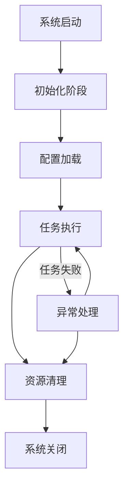
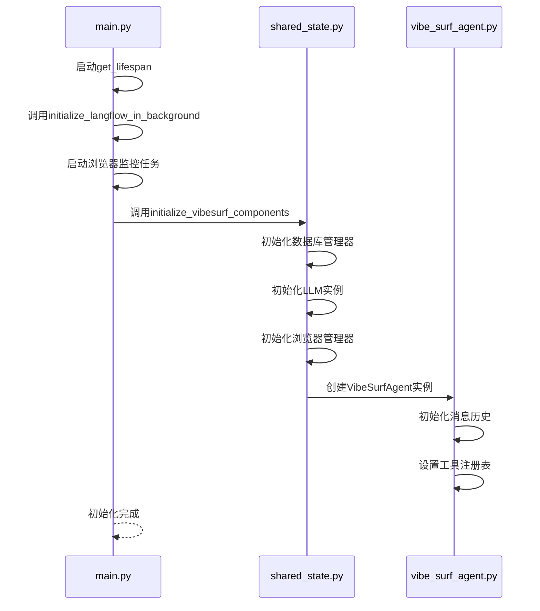
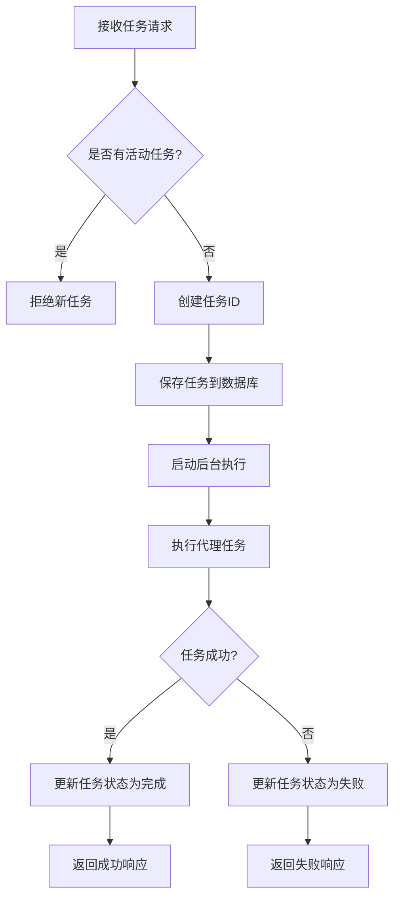
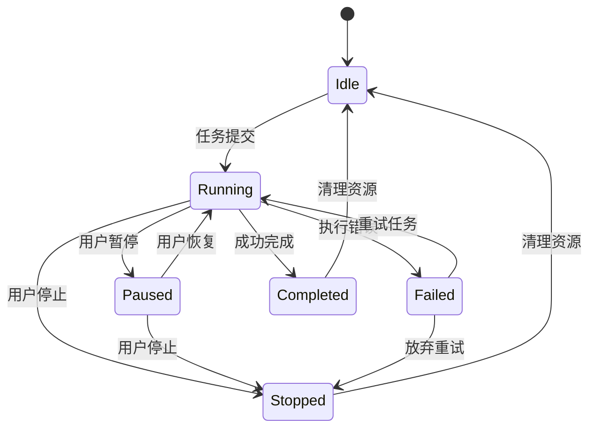
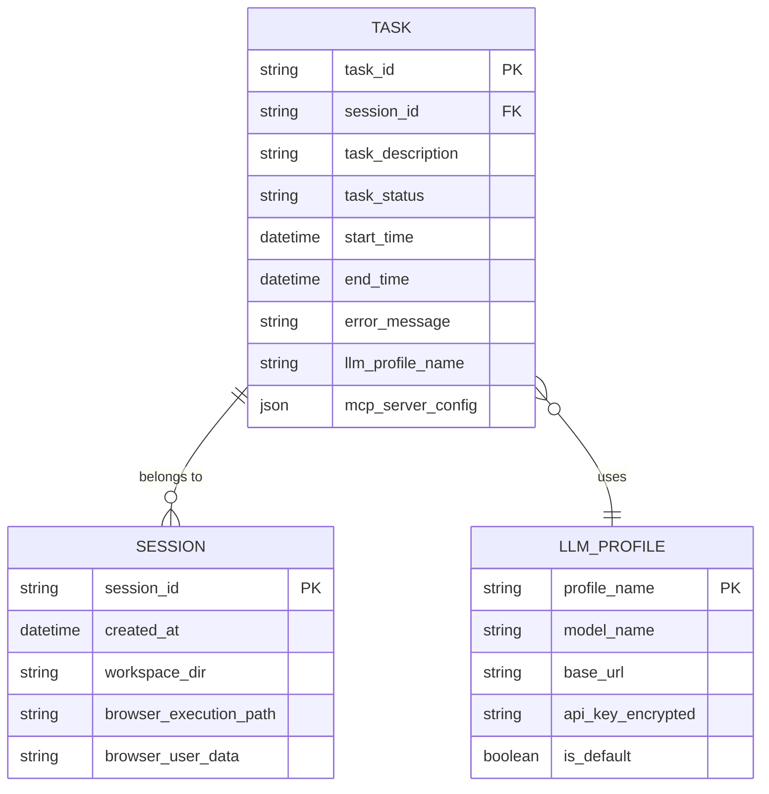

# 代理生命周期管理

<cite>
**本文档引用的文件**   
- [main.py](file://vibe_surf/backend/main.py)
- [shared_state.py](file://vibe_surf/backend/shared_state.py)
- [vibe_surf_agent.py](file://vibe_surf/agents/vibe_surf_agent.py)
- [browser_manager.py](file://vibe_surf/browser/browser_manager.py)
- [task.py](file://vibe_surf/backend/api/task.py)
- [database/manager.py](file://vibe_surf/backend/database/manager.py)
- [vibesurf_tools.py](file://vibe_surf/tools/vibesurf_tools.py)
</cite>

## 目录
1. [介绍](#介绍)
2. [代理生命周期概述](#代理生命周期概述)
3. [初始化阶段](#初始化阶段)
4. [配置加载](#配置加载)
5. [任务执行](#任务执行)
6. [资源清理](#资源清理)
7. [异常处理机制](#异常处理机制)
8. [状态转换图](#状态转换图)
9. [关键生命周期方法实现](#关键生命周期方法实现)
10. [结论](#结论)

## 介绍
VibeSurf代理系统是一个复杂的自动化框架，能够执行各种任务，包括浏览器操作、文件处理和报告生成。本文档详细描述了代理从初始化到资源清理的完整生命周期管理流程。通过分析系统架构和关键组件，我们将深入探讨每个生命周期阶段的具体操作，包括启动时的环境配置、运行时的任务调度与监控，以及关闭时的资源释放。文档还将解释异常情况下的生命周期处理机制，如任务失败时的重试策略和错误恢复，并提供状态转换图来展示代理在不同生命周期阶段的状态变化。

**Section sources**
- [main.py](file://vibe_surf/backend/main.py#L1-L794)

## 代理生命周期概述
VibeSurf代理系统的生命周期管理遵循一个清晰的阶段划分，从系统启动到关闭的整个过程都受到严格控制。生命周期主要分为四个核心阶段：初始化、配置加载、任务执行和资源清理。每个阶段都有明确的职责和操作流程，确保代理能够稳定、高效地运行。

在初始化阶段，系统会设置全局变量、配置环境和建立必要的连接。配置加载阶段负责从数据库和环境变量中读取配置信息，并初始化各种组件。任务执行阶段是代理的核心功能所在，它处理用户提交的任务并协调各种工具和资源。最后，在资源清理阶段，系统会优雅地关闭所有连接和资源，确保没有资源泄漏。

这种分阶段的生命周期管理方法不仅提高了系统的可维护性，还增强了故障恢复能力。通过将复杂的系统操作分解为独立的阶段，每个阶段都可以独立测试和优化，从而提高了整个系统的稳定性和可靠性。



**Diagram sources**
- [main.py](file://vibe_surf/backend/main.py#L327-L482)
- [shared_state.py](file://vibe_surf/backend/shared_state.py#L453-L602)

## 初始化阶段
代理的初始化阶段是整个生命周期的起点，它为后续操作奠定了基础。这个阶段主要通过`main.py`文件中的`get_lifespan`函数实现，该函数使用异步上下文管理器来管理应用的生命周期。

初始化过程首先调用`initialize_langflow_in_background`函数，该函数在后台线程中初始化Langflow服务。这包括设置数据库连接、初始化队列服务和启动遥测服务。同时，系统会启动浏览器连接监控任务，确保浏览器连接的稳定性。



**Diagram sources**
- [main.py](file://vibe_surf/backend/main.py#L330-L365)
- [shared_state.py](file://vibe_surf/backend/shared_state.py#L453-L602)

**Section sources**
- [main.py](file://vibe_surf/backend/main.py#L327-L365)
- [shared_state.py](file://vibe_surf/backend/shared_state.py#L453-L602)

## 配置加载
配置加载是代理生命周期中的关键环节，它确保了系统能够根据用户需求和环境条件正确运行。配置信息主要来自两个来源：环境变量和数据库。

系统首先通过`common.get_workspace_dir()`获取工作区目录，然后从`envs.json`文件中加载环境配置。如果文件不存在，系统会创建一个空的配置。加载的配置包括浏览器执行路径、用户数据目录和后端URL等关键信息。

```python
# 从shared_state.py中提取的关键代码路径
vibe_surf/backend/shared_state.py#L464-L482
```

数据库配置通过`DatabaseManager`类进行管理，该类支持迁移系统，确保数据库模式的版本控制。系统会检查当前数据库版本，并应用任何待处理的迁移脚本，以确保数据库结构与代码版本匹配。

配置加载过程中，系统还会初始化LLM（大语言模型）实例。它首先尝试从数据库中获取默认的LLM配置文件，如果找不到，则回退到环境变量中的配置。这种灵活的配置机制确保了系统在不同环境下的可移植性。

**Section sources**
- [shared_state.py](file://vibe_surf/backend/shared_state.py#L460-L538)
- [database/manager.py](file://vibe_surf/backend/database/manager.py#L148-L223)

## 任务执行
任务执行是VibeSurf代理系统的核心功能，它通过`task.py`文件中的API路由来管理任务的提交、控制和状态查询。系统采用单任务执行模型，确保同一时间只有一个任务在运行，避免了资源竞争和状态混乱。

当用户提交新任务时，系统会首先检查是否有正在运行的任务。如果有，系统会拒绝新的任务请求，确保任务执行的串行化。任务提交后，系统会在后台线程中执行`execute_task_background`函数，该函数负责协调代理的整个执行过程。



**Diagram sources**
- [task.py](file://vibe_surf/backend/api/task.py#L43-L146)
- [shared_state.py](file://vibe_surf/backend/shared_state.py#L118-L233)

任务执行过程中，代理会根据任务需求调用各种工具，如浏览器操作、文件处理和报告生成。每个工具的执行结果都会被记录下来，并作为上下文传递给后续步骤，形成一个闭环的执行流程。

**Section sources**
- [task.py](file://vibe_surf/backend/api/task.py#L43-L146)
- [shared_state.py](file://vibe_surf/backend/shared_state.py#L118-L233)

## 资源清理
资源清理是代理生命周期的最后阶段，它确保系统在关闭时能够优雅地释放所有占用的资源。这一过程在`get_lifespan`函数的`finally`块中实现，确保无论正常关闭还是异常终止，资源清理代码都会被执行。

清理过程首先停止调度管理器，然后取消所有后台任务，包括浏览器监控、Langflow初始化和MCP服务器初始化等。系统会等待这些任务完成或超时，确保没有遗留的后台进程。

```python
# 从main.py中提取的关键代码路径
vibe_surf/backend/main.py#L371-L481
```

接下来，系统会清理Langflow服务，包括关闭队列服务和遥测服务。然后，它会关闭浏览器管理器，释放所有浏览器会话和相关资源。最后，系统会关闭数据库连接，确保所有未提交的事务都被正确处理。

这种分步骤的资源清理策略确保了系统能够安全、可靠地关闭，避免了资源泄漏和数据损坏的风险。每个清理步骤都有适当的超时机制和错误处理，提高了系统的健壮性。

**Section sources**
- [main.py](file://vibe_surf/backend/main.py#L371-L481)

## 异常处理机制
VibeSurf代理系统具有完善的异常处理机制，能够应对各种运行时错误和异常情况。系统采用多层次的错误处理策略，从任务级别到系统级别都有相应的处理措施。

在任务执行层面，`execute_task_background`函数使用try-catch块捕获所有异常。当任务执行失败时，系统会记录错误信息，并将任务状态更新为"failed"。同时，系统会将错误信息保存到数据库，便于后续分析和调试。



**Diagram sources**
- [shared_state.py](file://vibe_surf/backend/shared_state.py#L204-L230)
- [task.py](file://vibe_surf/backend/api/task.py#L197-L299)

在系统层面，`monitor_browser_connection`函数持续监控浏览器连接状态。如果检测到浏览器断开连接，系统会触发优雅的关闭流程，确保所有资源都能被正确清理。这种主动的监控机制提高了系统的稳定性和用户体验。

**Section sources**
- [shared_state.py](file://vibe_surf/backend/shared_state.py#L204-L230)
- [task.py](file://vibe_surf/backend/api/task.py#L197-L299)

## 状态转换图
VibeSurf代理系统的状态管理是其生命周期控制的核心。系统使用`VibeSurfStatus`类来跟踪和管理代理的整体状态，包括运行、暂停、停止、空闲和错误等状态。



**Diagram sources**
- [vibe_surf_agent.py](file://vibe_surf/agents/vibe_surf_agent.py#L85-L92)
- [task.py](file://vibe_surf/backend/api/task.py#L18-L25)

状态转换遵循严格的规则，确保系统状态的一致性和可预测性。例如，只有在"running"状态下的任务才能被暂停或停止，而"completed"或"failed"状态的任务不能被恢复。这种状态机模型简化了系统的复杂性，提高了代码的可维护性。

## 关键生命周期方法实现
VibeSurf代理系统的关键生命周期方法主要分布在几个核心文件中。`main.py`中的`get_lifespan`函数是整个生命周期的入口点，它定义了应用的启动和关闭流程。

```python
# 从main.py中提取的关键代码路径
vibe_surf/backend/main.py#L327-L482
```

`shared_state.py`文件中的`initialize_vibesurf_components`函数负责初始化所有VibeSurf组件，包括代理、浏览器管理器、工具和数据库管理器。这个函数确保了所有组件在使用前都被正确初始化。

```python
# 从shared_state.py中提取的关键代码路径
vibe_surf/backend/shared_state.py#L453-L602
```

`vibe_surf_agent.py`文件中的`run`方法实现了代理的核心执行逻辑。它使用LangGraph框架来管理任务的执行流程，支持思考、行动和评估的循环模式。

```python
# 从vibe_surf_agent.py中提取的关键代码路径
vibe_surf/agents/vibe_surf_agent.py#L346-L546
```

这些关键方法的实现体现了系统的设计哲学：模块化、可扩展和易于维护。通过将不同的功能分离到独立的组件中，系统能够灵活地适应不同的使用场景和需求。

**Section sources**
- [main.py](file://vibe_surf/backend/main.py#L327-L482)
- [shared_state.py](file://vibe_surf/backend/shared_state.py#L453-L602)
- [vibe_surf_agent.py](file://vibe_surf/agents/vibe_surf_agent.py#L346-L546)

## 结论
VibeSurf代理系统的生命周期管理是一个精心设计的框架，它通过清晰的阶段划分和严格的控制流程，确保了系统的稳定性和可靠性。从初始化到资源清理的每个阶段都有明确的职责和操作流程，形成了一个完整的生命周期闭环。

系统的模块化设计使得各个组件可以独立开发和测试，提高了开发效率和代码质量。异常处理机制和状态管理模型进一步增强了系统的健壮性，使其能够应对各种复杂的运行时情况。

通过本文档的分析，我们可以看到VibeSurf代理系统不仅功能强大，而且架构合理。它的生命周期管理策略为类似的自动化系统提供了有价值的参考，展示了如何通过良好的设计来实现复杂系统的稳定运行。