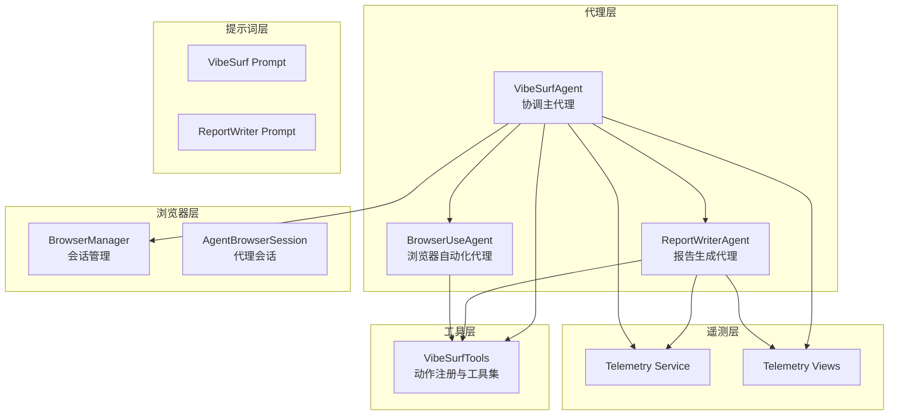
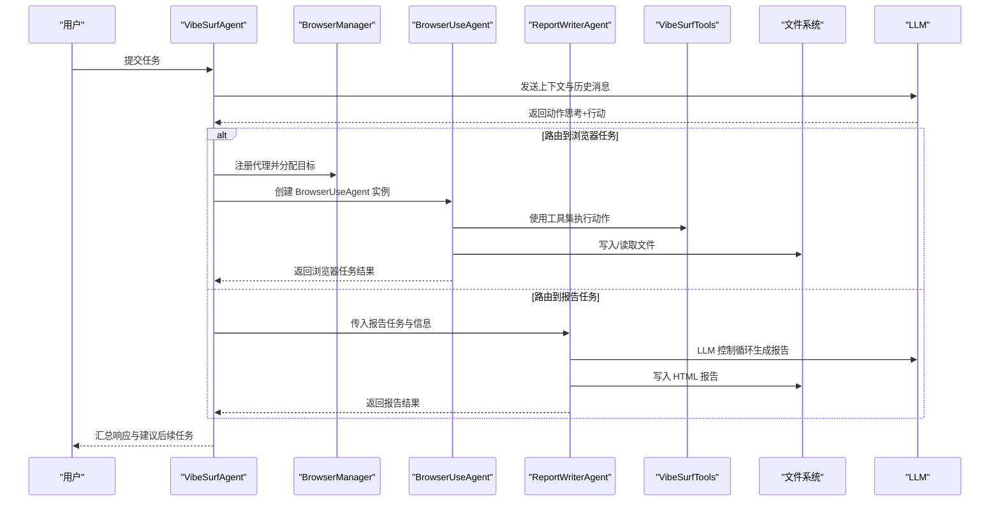
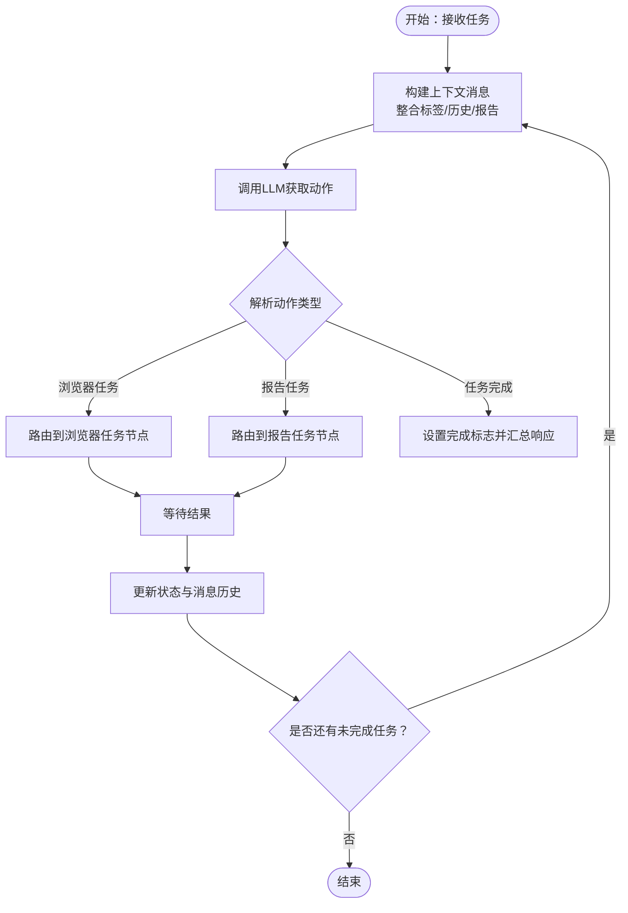
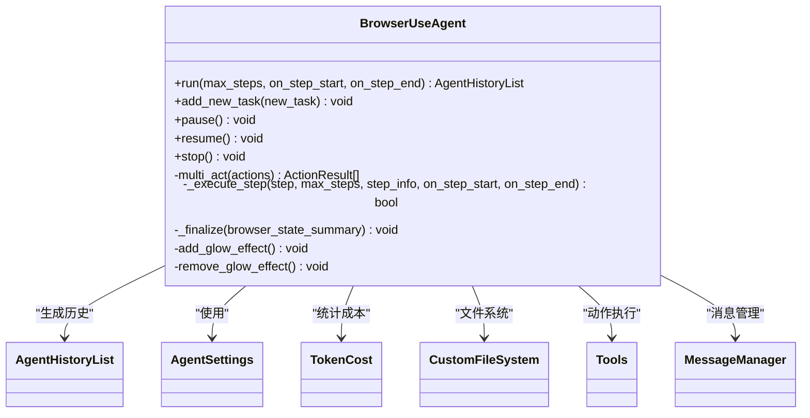
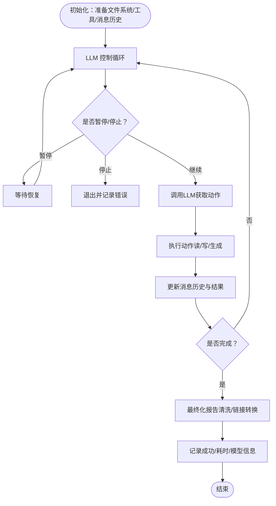
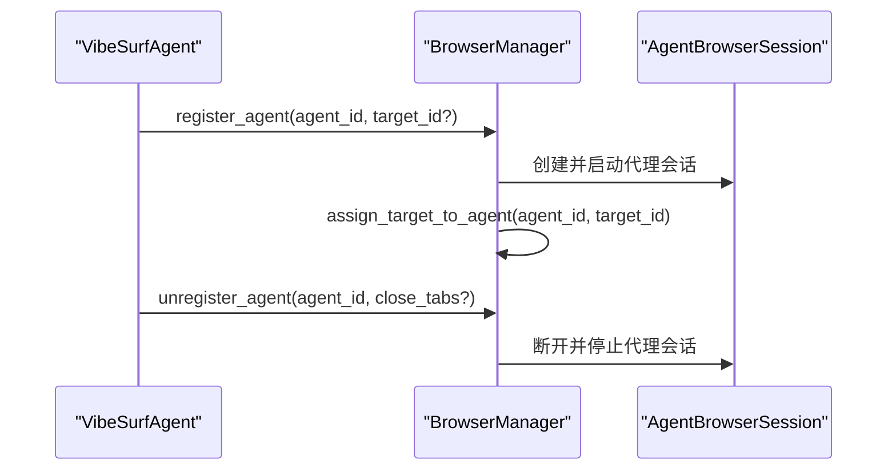
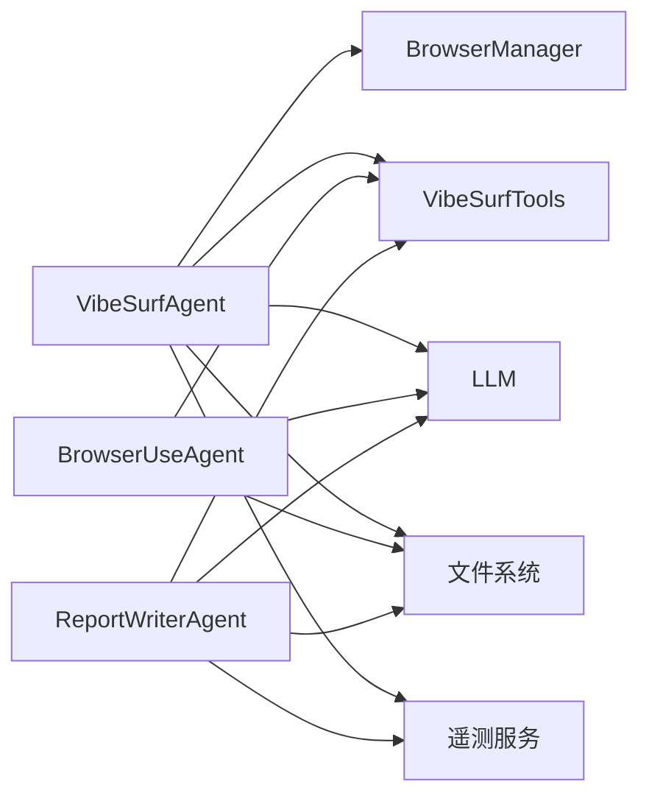

# 代理设计

<cite>
**本文引用的文件**
- [vibe_surf/agents/vibe_surf_agent.py](file://vibe_surf/agents/vibe_surf_agent.py)
- [vibe_surf/agents/browser_use_agent.py](file://vibe_surf/agents/browser_use_agent.py)
- [vibe_surf/agents/report_writer_agent.py](file://vibe_surf/agents/report_writer_agent.py)
- [vibe_surf/agents/views.py](file://vibe_surf/agents/views.py)
- [vibe_surf/agents/prompts/vibe_surf_prompt.py](file://vibe_surf/agents/prompts/vibe_surf_prompt.py)
- [vibe_surf/agents/prompts/report_writer_prompt.py](file://vibe_surf/agents/prompts/report_writer_prompt.py)
- [vibe_surf/browser/browser_manager.py](file://vibe_surf/browser/browser_manager.py)
- [vibe_surf/browser/agent_browser_session.py](file://vibe_surf/browser/agent_browser_session.py)
- [vibe_surf/tools/vibesurf_tools.py](file://vibe_surf/tools/vibesurf_tools.py)
- [vibe_surf/telemetry/service.py](file://vibe_surf/telemetry/service.py)
- [vibe_surf/telemetry/views.py](file://vibe_surf/telemetry/views.py)
</cite>

## 目录
1. [引言](#引言)
2. [项目结构](#项目结构)
3. [核心组件](#核心组件)
4. [架构总览](#架构总览)
5. [详细组件分析](#详细组件分析)
6. [依赖关系分析](#依赖关系分析)
7. [性能考量](#性能考量)
8. [故障排查指南](#故障排查指南)
9. [结论](#结论)

## 引言
本设计文档聚焦于 VibeSurf 代理系统，系统通过一个协调型主代理（VibeSurfAgent）调度两类子代理：浏览器自动化代理（BrowserUseAgent）与报告生成代理（ReportWriterAgent）。主代理负责任务规划、上下文整合、路由决策与结果汇总；浏览器代理专注于网页自动化与数据提取；报告代理负责基于收集信息生成专业 HTML 报告。系统采用 LangGraph 状态机驱动工作流，结合浏览器会话管理、工具注册与 LLM 驱动的思考-行动模式，实现并发执行、可控暂停/恢复/停止以及可观测性（遥测）。

## 项目结构
- 代理层：主代理、浏览器代理、报告代理及其输出模型定义
- 浏览器层：浏览器会话管理、目标分配与安全隔离
- 工具层：统一动作注册与工具集，支持额外工具（MCP、Composio）
- 提示词层：主代理与报告代理专用提示词
- 遥测层：事件采集与上报

图表来源
- [vibe_surf/agents/vibe_surf_agent.py](file://vibe_surf/agents/vibe_surf_agent.py#L345-L546)
- [vibe_surf/agents/browser_use_agent.py](file://vibe_surf/agents/browser_use_agent.py#L658-L800)
- [vibe_surf/agents/report_writer_agent.py](file://vibe_surf/agents/report_writer_agent.py#L106-L210)
- [vibe_surf/browser/browser_manager.py](file://vibe_surf/browser/browser_manager.py#L24-L123)
- [vibe_surf/browser/agent_browser_session.py](file://vibe_surf/browser/agent_browser_session.py#L243-L271)
- [vibe_surf/tools/vibesurf_tools.py](file://vibe_surf/tools/vibesurf_tools.py#L72-L120)
- [vibe_surf/agents/prompts/vibe_surf_prompt.py](file://vibe_surf/agents/prompts/vibe_surf_prompt.py#L1-L120)
- [vibe_surf/agents/prompts/report_writer_prompt.py](file://vibe_surf/agents/prompts/report_writer_prompt.py#L1-L74)
- [vibe_surf/telemetry/service.py](file://vibe_surf/telemetry/service.py#L1-L200)
- [vibe_surf/telemetry/views.py](file://vibe_surf/telemetry/views.py#L1-L200)

章节来源
- [vibe_surf/agents/vibe_surf_agent.py](file://vibe_surf/agents/vibe_surf_agent.py#L345-L546)
- [vibe_surf/browser/browser_manager.py](file://vibe_surf/browser/browser_manager.py#L24-L123)

## 核心组件
- VibeSurfAgent：LangGraph 协调节点，负责思考-行动决策、任务路由、状态记录与控制（暂停/恢复/停止）、活动日志与遥测
- BrowserUseAgent：基于 browser-use 的智能浏览器代理，支持多步思考/行动、文件系统、截图、令牌成本统计与信号控制
- ReportWriterAgent：LLM 驱动的报告生成代理，按步骤执行动作（读写文件、生成 HTML），支持暂停/恢复/停止与遥测
- BrowserManager：共享浏览器会话的多代理会话管理器，负责目标分配、安全隔离与资源回收
- VibeSurfTools：动作注册中心，统一暴露浏览器、报告、技能、文件操作等动作，并支持 MCP/Composio 扩展
- 提示词：主代理与报告代理专用系统提示词，约束行为边界与输出格式
- 遥测：事件采集与上报，覆盖主代理、报告代理与后端/CLI/MCP 等

章节来源
- [vibe_surf/agents/vibe_surf_agent.py](file://vibe_surf/agents/vibe_surf_agent.py#L345-L546)
- [vibe_surf/agents/browser_use_agent.py](file://vibe_surf/agents/browser_use_agent.py#L658-L800)
- [vibe_surf/agents/report_writer_agent.py](file://vibe_surf/agents/report_writer_agent.py#L106-L210)
- [vibe_surf/browser/browser_manager.py](file://vibe_surf/browser/browser_manager.py#L24-L123)
- [vibe_surf/tools/vibesurf_tools.py](file://vibe_surf/tools/vibesurf_tools.py#L72-L120)
- [vibe_surf/agents/prompts/vibe_surf_prompt.py](file://vibe_surf/agents/prompts/vibe_surf_prompt.py#L1-L120)
- [vibe_surf/agents/prompts/report_writer_prompt.py](file://vibe_surf/agents/prompts/report_writer_prompt.py#L1-L74)
- [vibe_surf/telemetry/service.py](file://vibe_surf/telemetry/service.py#L1-L200)
- [vibe_surf/telemetry/views.py](file://vibe_surf/telemetry/views.py#L1-L200)

## 架构总览
系统以 VibeSurfAgent 为核心，通过 LangGraph 节点驱动工作流：
- 主代理节点：根据上下文与历史消息，解析 LLM 输出的动作，路由到浏览器任务或报告任务，或直接执行本地动作
- 浏览器任务节点：为每个任务创建独立的 BrowserUseAgent 实例，支持单任务串行与多任务并行，自动注册/注销代理会话与目标
- 报告任务节点：由 ReportWriterAgent 基于 LLM 控制循环逐步执行动作，最终生成 HTML 报告
- 控制与状态：全局状态包含当前步骤、是否完成、暂停/停止标记；节点包装器在执行前检查控制状态
- 集成点：与浏览器管理器、工具注册中心、LLM、文件系统、遥测服务深度集成

图表来源
- [vibe_surf/agents/vibe_surf_agent.py](file://vibe_surf/agents/vibe_surf_agent.py#L345-L546)
- [vibe_surf/agents/browser_use_agent.py](file://vibe_surf/agents/browser_use_agent.py#L658-L800)
- [vibe_surf/agents/report_writer_agent.py](file://vibe_surf/agents/report_writer_agent.py#L106-L210)
- [vibe_surf/browser/browser_manager.py](file://vibe_surf/browser/browser_manager.py#L24-L123)
- [vibe_surf/tools/vibesurf_tools.py](file://vibe_surf/tools/vibesurf_tools.py#L72-L120)

## 详细组件分析

### VibeSurfAgent（协调主代理）
- 角色与职责
  - 作为 LangGraph 节点，使用“思考+行动”模式，结合上下文（浏览器标签、历史结果、已生成报告）进行决策
  - 路由动作：执行浏览器任务、执行报告任务、任务完成返回最终响应
  - 状态管理：维护全局状态（当前步骤、是否完成、暂停/停止标记），节点包装器在执行前检查控制状态
  - 日志与遥测：记录每一步思考与行动摘要，捕获解析输出与异常事件
- 生命周期
  - 初始化：构建动作模型与输出模型，准备消息历史与工具注册
  - 执行：节点包装器检查控制状态，执行主代理逻辑，更新状态并记录活动
  - 结束：当收到 task_done 动作时，设置完成标志并汇总响应
- 并发与控制
  - 支持暂停/恢复/停止，通过状态位与异步事件协调
  - 在浏览器任务节点中，支持单任务串行与多任务并行执行

图表来源
- [vibe_surf/agents/vibe_surf_agent.py](file://vibe_surf/agents/vibe_surf_agent.py#L345-L546)
- [vibe_surf/agents/prompts/vibe_surf_prompt.py](file://vibe_surf/agents/prompts/vibe_surf_prompt.py#L1-L120)

章节来源
- [vibe_surf/agents/vibe_surf_agent.py](file://vibe_surf/agents/vibe_surf_agent.py#L345-L546)
- [vibe_surf/agents/views.py](file://vibe_surf/agents/views.py#L26-L124)
- [vibe_surf/agents/prompts/vibe_surf_prompt.py](file://vibe_surf/agents/prompts/vibe_surf_prompt.py#L1-L120)

### BrowserUseAgent（浏览器自动化代理）
- 角色与职责
  - 基于 browser-use 的智能代理，支持多步思考/行动、文件系统、截图、令牌成本统计与信号控制
  - 可选“思考”模式与“闪速”模式，支持初始 URL 直接打开、超时与失败重试控制
- 生命周期
  - 初始化：建立浏览器会话、文件系统、工具注册、消息管理器与系统提示词
  - 运行：主循环执行步骤，支持暂停/恢复/停止、失败计数与最大步数限制
  - 清理：记录使用统计、保存历史、移除高光效果、注销信号处理器
- 并发与控制
  - 通过外部暂停事件与状态位实现暂停/恢复
  - 多代理并行执行时，由主代理统一注册/注销与目标分配

图表来源
- [vibe_surf/agents/browser_use_agent.py](file://vibe_surf/agents/browser_use_agent.py#L658-L800)
- [vibe_surf/browser/browser_manager.py](file://vibe_surf/browser/browser_manager.py#L24-L123)

章节来源
- [vibe_surf/agents/browser_use_agent.py](file://vibe_surf/agents/browser_use_agent.py#L658-L800)
- [vibe_surf/browser/browser_manager.py](file://vibe_surf/browser/browser_manager.py#L24-L123)

### ReportWriterAgent（报告生成代理）
- 角色与职责
  - 基于 LLM 控制的循环，逐步执行动作（读取文件、写入文件、生成 HTML），最终输出专业 HTML 报告
  - 支持暂停/恢复/停止与失败计数，提供回退报告生成能力
- 生命周期
  - 初始化：准备文件系统、工具集、动作模型与消息历史
  - 运行：循环获取 LLM 输出，执行动作，记录步骤摘要，直到完成或达到最大迭代
  - 清理：最终化报告（清洗 HTML、转换相对路径为绝对 file:// URL），记录遥测事件
- 错误处理
  - 捕获异常并生成回退报告，同时上报错误事件

图表来源
- [vibe_surf/agents/report_writer_agent.py](file://vibe_surf/agents/report_writer_agent.py#L106-L210)
- [vibe_surf/agents/prompts/report_writer_prompt.py](file://vibe_surf/agents/prompts/report_writer_prompt.py#L1-L74)

章节来源
- [vibe_surf/agents/report_writer_agent.py](file://vibe_surf/agents/report_writer_agent.py#L106-L210)
- [vibe_surf/agents/prompts/report_writer_prompt.py](file://vibe_surf/agents/prompts/report_writer_prompt.py#L1-L74)

### 浏览器管理器（BrowserManager）
- 角色与职责
  - 管理共享浏览器会话下的多个代理会话，确保目标分配的安全性与隔离性
  - 提供代理注册/注销、目标分配/解绑、连接状态检查与资源回收
- 关键流程
  - 注册代理：为代理创建独立 AgentBrowserSession，连接根 CDP 客户端
  - 分配目标：将目标（Tab）分配给代理，若未指定则创建新目标
  - 注销代理：断开 CDP 会话，可选择关闭对应标签页
  - 连接检查：轮询检查浏览器连接状态

图表来源
- [vibe_surf/browser/browser_manager.py](file://vibe_surf/browser/browser_manager.py#L24-L123)
- [vibe_surf/browser/agent_browser_session.py](file://vibe_surf/browser/agent_browser_session.py#L243-L271)

章节来源
- [vibe_surf/browser/browser_manager.py](file://vibe_surf/browser/browser_manager.py#L24-L123)
- [vibe_surf/browser/agent_browser_session.py](file://vibe_surf/browser/agent_browser_session.py#L243-L271)

### 工具与动作（VibeSurfTools）
- 角色与职责
  - 统一动作注册中心，提供文件操作、浏览器自动化、报告任务、技能动作、额外工具（MCP/Composio）等
  - 支持动态过滤动作集合，便于在不同模式下启用/禁用特定动作
- 集成点
  - 主代理与浏览器代理均通过工具集执行动作
  - 支持 MCP 客户端与 Composio 工具包扩展

章节来源
- [vibe_surf/tools/vibesurf_tools.py](file://vibe_surf/tools/vibesurf_tools.py#L72-L120)

### 遥测与可观测性
- 触发点
  - 主代理：解析输出事件、异常事件
  - 报告代理：开始/完成/错误事件
- 上报与聚合
  - 事件封装在视图模型中，通过遥测服务采集并可选上报
  - 支持令牌用量统计与成本追踪

章节来源
- [vibe_surf/telemetry/service.py](file://vibe_surf/telemetry/service.py#L1-L200)
- [vibe_surf/telemetry/views.py](file://vibe_surf/telemetry/views.py#L1-L200)
- [vibe_surf/agents/vibe_surf_agent.py](file://vibe_surf/agents/vibe_surf_agent.py#L400-L450)
- [vibe_surf/agents/report_writer_agent.py](file://vibe_surf/agents/report_writer_agent.py#L120-L170)

## 依赖关系分析
- 组件耦合
  - VibeSurfAgent 依赖 BrowserManager、VibeSurfTools、LLM、文件系统与遥测
  - BrowserUseAgent 依赖 browser-use 的 Agent/Tools/MessageManager/TokenCost/FileSystem
  - ReportWriterAgent 依赖 LLM、文件系统与工具集
- 外部依赖
  - 浏览器自动化：browser-use、CDP 客户端、Chrome 浏览器
  - LLM：兼容 OpenAI 接口的聊天模型
  - 文件系统：自定义文件系统封装
  - 遥测：事件采集与上报

图表来源
- [vibe_surf/agents/vibe_surf_agent.py](file://vibe_surf/agents/vibe_surf_agent.py#L345-L546)
- [vibe_surf/agents/browser_use_agent.py](file://vibe_surf/agents/browser_use_agent.py#L658-L800)
- [vibe_surf/agents/report_writer_agent.py](file://vibe_surf/agents/report_writer_agent.py#L106-L210)
- [vibe_surf/browser/browser_manager.py](file://vibe_surf/browser/browser_manager.py#L24-L123)
- [vibe_surf/tools/vibesurf_tools.py](file://vibe_surf/tools/vibesurf_tools.py#L72-L120)
- [vibe_surf/telemetry/service.py](file://vibe_surf/telemetry/service.py#L1-L200)

章节来源
- [vibe_surf/agents/vibe_surf_agent.py](file://vibe_surf/agents/vibe_surf_agent.py#L345-L546)
- [vibe_surf/agents/browser_use_agent.py](file://vibe_surf/agents/browser_use_agent.py#L658-L800)
- [vibe_surf/agents/report_writer_agent.py](file://vibe_surf/agents/report_writer_agent.py#L106-L210)
- [vibe_surf/browser/browser_manager.py](file://vibe_surf/browser/browser_manager.py#L24-L123)
- [vibe_surf/tools/vibesurf_tools.py](file://vibe_surf/tools/vibesurf_tools.py#L72-L120)
- [vibe_surf/telemetry/service.py](file://vibe_surf/telemetry/service.py#L1-L200)

## 性能考量
- 并发执行
  - 浏览器任务支持多代理并行执行，显著缩短多任务总耗时；但需注意浏览器资源竞争与目标分配冲突
- 步骤与超时
  - 主代理与浏览器代理均设置最大步数与超时参数，避免长时间阻塞
- 成本控制
  - 令牌成本统计与可选成本计算，便于预算控制
- I/O 与文件系统
  - 文件系统路径规范化与链接转换，减少 I/O 错误与路径问题
- 设计权衡
  - 性能与可靠性：并行执行提升吞吐，但需更强的资源隔离与错误恢复
  - 可扩展性与复杂度：工具注册中心与 MCP/Composio 扩展提升能力，但增加配置与依赖复杂度

[本节为通用指导，不直接分析具体文件]

## 故障排查指南
- 浏览器连接失败
  - 检查浏览器连接状态与目标列表，确认 CDP 客户端可用
- 代理无法暂停/恢复
  - 确认外部暂停事件与状态位正确切换，检查信号处理器注册情况
- 报告生成异常
  - 查看回退报告生成逻辑与错误事件上报，定位 LLM 输出或动作执行问题
- 令牌成本异常
  - 核对 TokenCost 统计与 LLM 调用次数，检查是否启用了成本计算

章节来源
- [vibe_surf/browser/browser_manager.py](file://vibe_surf/browser/browser_manager.py#L187-L201)
- [vibe_surf/agents/browser_use_agent.py](file://vibe_surf/agents/browser_use_agent.py#L658-L800)
- [vibe_surf/agents/report_writer_agent.py](file://vibe_surf/agents/report_writer_agent.py#L106-L210)
- [vibe_surf/telemetry/views.py](file://vibe_surf/telemetry/views.py#L1-L200)

## 结论
VibeSurf 代理系统通过主代理协调浏览器与报告两类子代理，结合 LangGraph 状态机、浏览器会话管理、工具注册中心与 LLM 驱动的思考-行动模式，实现了高效、可控且可观测的任务编排。系统在性能、可扩展性与可靠性之间取得平衡：通过并行执行与目标隔离提升吞吐，通过严格的控制与遥测保障稳定性与可运维性。未来可在工具生态、错误恢复与资源调度方面进一步优化。