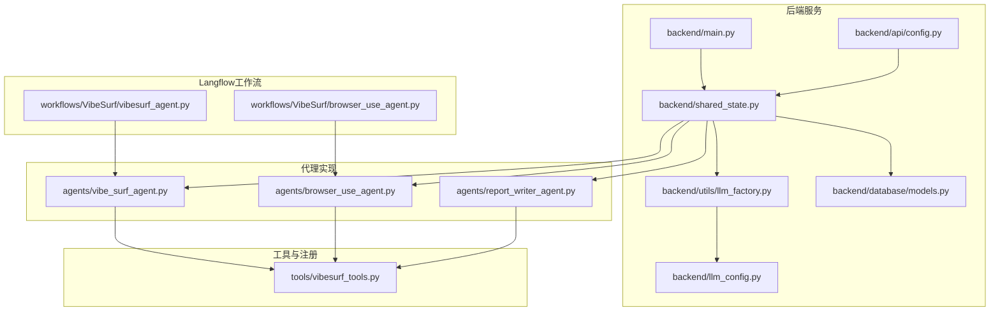
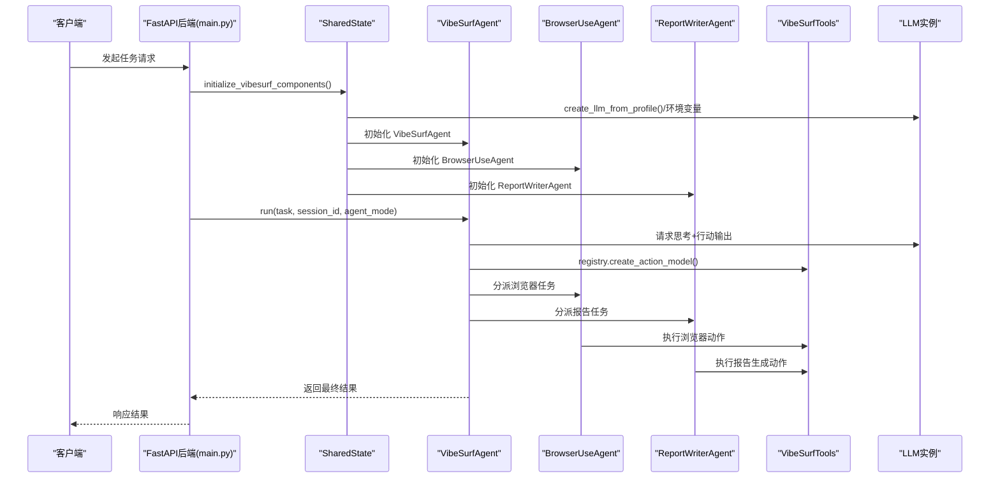
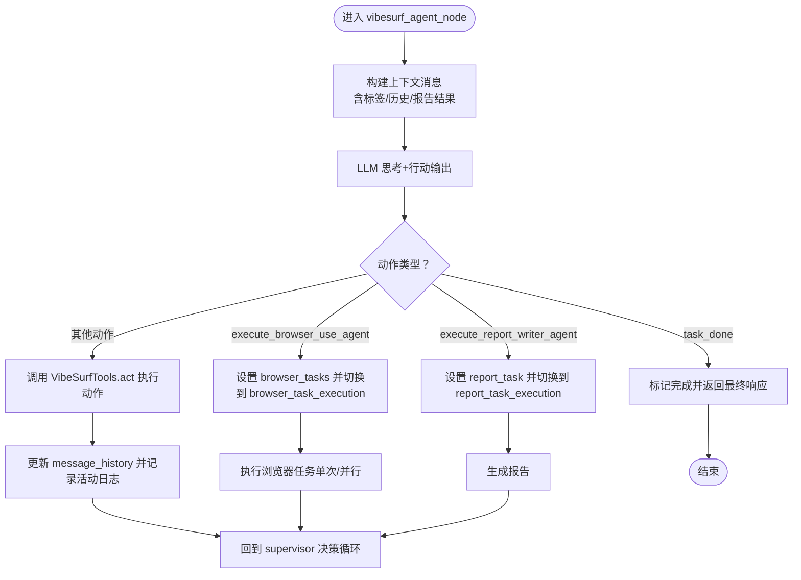
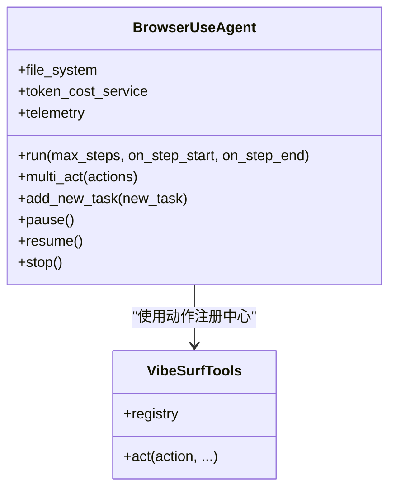
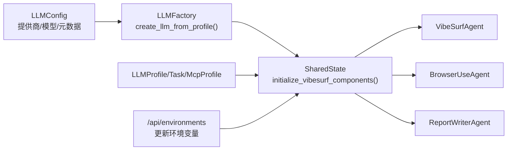

# 代理扩展指南

<cite>
**本文引用的文件**
- [vibe_surf/agents/vibe_surf_agent.py](file://vibe_surf/agents/vibe_surf_agent.py)
- [vibe_surf/agents/browser_use_agent.py](file://vibe_surf/agents/browser_use_agent.py)
- [vibe_surf/agents/report_writer_agent.py](file://vibe_surf/agents/report_writer_agent.py)
- [vibe_surf/backend/utils/llm_factory.py](file://vibe_surf/backend/utils/llm_factory.py)
- [vibe_surf/backend/llm_config.py](file://vibe_surf/backend/llm_config.py)
- [vibe_surf/backend/shared_state.py](file://vibe_surf/backend/shared_state.py)
- [vibe_surf/backend/main.py](file://vibe_surf/backend/main.py)
- [vibe_surf/tools/vibesurf_tools.py](file://vibe_surf/tools/vibesurf_tools.py)
- [vibe_surf/workflows/VibeSurf/vibesurf_agent.py](file://vibe_surf/workflows/VibeSurf/vibesurf_agent.py)
- [vibe_surf/workflows/VibeSurf/browser_use_agent.py](file://vibe_surf/workflows/VibeSurf/browser_use_agent.py)
- [vibe_surf/backend/api/config.py](file://vibe_surf/backend/api/config.py)
- [vibe_surf/backend/database/models.py](file://vibe_surf/backend/database/models.py)
- [.env.example](file://.env.example)
</cite>

## 目录
1. [简介](#简介)
2. [项目结构](#项目结构)
3. [核心组件](#核心组件)
4. [架构总览](#架构总览)
5. [详细组件分析](#详细组件分析)
6. [依赖关系分析](#依赖关系分析)
7. [性能考量](#性能考量)
8. [故障排查指南](#故障排查指南)
9. [结论](#结论)
10. [附录](#附录)

## 简介
本指南面向希望在 VibeSurf 代理系统中进行扩展与定制的开发者，重点围绕以下目标展开：
- 如何继承和扩展现有代理基类（如 VibeSurfAgent、BrowserUseAgent），添加新功能与行为。
- 代理关键方法（如 execute、process_task）的重写规则与调用流程。
- 如何通过 llm_factory.py 集成新的 LLM 配置。
- 代理配置的注册机制与依赖注入方式。
- 提供从类继承、方法重写到服务注册的完整示例路径与步骤。
- 配置文件修改与环境变量设置的详细说明。

## 项目结构
VibeSurf 的代理扩展涉及多个层次：后端服务、代理实现、工具集、Langflow 工作流以及数据库模型。下图展示了与代理扩展相关的核心模块关系。

图表来源
- [vibe_surf/backend/main.py](file://vibe_surf/backend/main.py#L543-L731)
- [vibe_surf/backend/shared_state.py](file://vibe_surf/backend/shared_state.py#L453-L602)
- [vibe_surf/backend/utils/llm_factory.py](file://vibe_surf/backend/utils/llm_factory.py#L23-L275)
- [vibe_surf/backend/llm_config.py](file://vibe_surf/backend/llm_config.py#L1-L226)
- [vibe_surf/backend/database/models.py](file://vibe_surf/backend/database/models.py#L1-L200)
- [vibe_surf/backend/api/config.py](file://vibe_surf/backend/api/config.py#L690-L762)
- [vibe_surf/agents/vibe_surf_agent.py](file://vibe_surf/agents/vibe_surf_agent.py#L1-L200)
- [vibe_surf/agents/browser_use_agent.py](file://vibe_surf/agents/browser_use_agent.py#L1-L120)
- [vibe_surf/agents/report_writer_agent.py](file://vibe_surf/agents/report_writer_agent.py#L1-L120)
- [vibe_surf/tools/vibesurf_tools.py](file://vibe_surf/tools/vibesurf_tools.py#L72-L120)
- [vibe_surf/workflows/VibeSurf/vibesurf_agent.py](file://vibe_surf/workflows/VibeSurf/vibesurf_agent.py#L1-L114)
- [vibe_surf/workflows/VibeSurf/browser_use_agent.py](file://vibe_surf/workflows/VibeSurf/browser_use_agent.py#L1-L151)

章节来源
- [vibe_surf/backend/main.py](file://vibe_surf/backend/main.py#L543-L731)
- [vibe_surf/backend/shared_state.py](file://vibe_surf/backend/shared_state.py#L453-L602)

## 核心组件
- VibeSurfAgent：主协调代理，负责任务编排、浏览器任务执行路由、报告生成协调等。
- BrowserUseAgent：基于 browser-use 的通用浏览器自动化代理，支持多步思考与行动。
- ReportWriterAgent：基于 LLM 的报告生成代理，采用“思考+行动”模式。
- VibeSurfTools：统一的动作注册中心，提供搜索、爬取、截图、金融数据、第三方网站 API 等技能动作。
- LLMFactory：根据数据库或环境配置创建不同提供商的 LLM 实例。
- SharedState：全局状态管理，负责初始化 LLM、BrowserManager、VibeSurfTools，并提供依赖注入入口。
- Langflow 组件：将代理封装为可拖拽的工作流节点，便于可视化编排。

章节来源
- [vibe_surf/agents/vibe_surf_agent.py](file://vibe_surf/agents/vibe_surf_agent.py#L1-L200)
- [vibe_surf/agents/browser_use_agent.py](file://vibe_surf/agents/browser_use_agent.py#L1-L120)
- [vibe_surf/agents/report_writer_agent.py](file://vibe_surf/agents/report_writer_agent.py#L1-L120)
- [vibe_surf/tools/vibesurf_tools.py](file://vibe_surf/tools/vibesurf_tools.py#L72-L120)
- [vibe_surf/backend/utils/llm_factory.py](file://vibe_surf/backend/utils/llm_factory.py#L23-L120)
- [vibe_surf/backend/shared_state.py](file://vibe_surf/backend/shared_state.py#L453-L602)
- [vibe_surf/workflows/VibeSurf/vibesurf_agent.py](file://vibe_surf/workflows/VibeSurf/vibesurf_agent.py#L1-L114)
- [vibe_surf/workflows/VibeSurf/browser_use_agent.py](file://vibe_surf/workflows/VibeSurf/browser_use_agent.py#L1-L151)

## 架构总览
下图展示了从 API 调用到代理执行再到工具动作的实际调用链路。

图表来源
- [vibe_surf/backend/main.py](file://vibe_surf/backend/main.py#L543-L731)
- [vibe_surf/backend/shared_state.py](file://vibe_surf/backend/shared_state.py#L453-L602)
- [vibe_surf/backend/utils/llm_factory.py](file://vibe_surf/backend/utils/llm_factory.py#L23-L120)
- [vibe_surf/agents/vibe_surf_agent.py](file://vibe_surf/agents/vibe_surf_agent.py#L346-L546)
- [vibe_surf/agents/browser_use_agent.py](file://vibe_surf/agents/browser_use_agent.py#L658-L800)
- [vibe_surf/agents/report_writer_agent.py](file://vibe_surf/agents/report_writer_agent.py#L106-L200)
- [vibe_surf/tools/vibesurf_tools.py](file://vibe_surf/tools/vibesurf_tools.py#L72-L120)

## 详细组件分析

### VibeSurfAgent 组件分析
- 角色定位：作为顶层协调者，使用“思考+行动”的模式驱动任务决策；负责将任务路由到浏览器执行节点或报告生成节点。
- 关键方法与流程：
  - 节点函数：vibesurf_agent_node/_vibesurf_agent_node_impl
  - 浏览器任务执行：browser_task_execution_node/_browser_task_execution_node_impl
  - 并行/单次浏览器任务执行：execute_parallel_browser_tasks/execute_single_browser_tasks
  - 控制态包装：control_aware_node（暂停/停止/继续）
- 重要特性：
  - 使用 MessageHistory 记录上下文，结合浏览器标签信息、历史结果、报告生成结果等动态拼装提示词。
  - 支持“思考模式”和“直连模式”，通过 CustomAgentOutput 动态生成输出结构。
  - 通过 TokenCost 追踪消耗并记录遥测事件。
- 扩展建议：
  - 新增自定义动作：在 VibeSurfTools 中注册新动作，或在 registry 中新增动作装饰器。
  - 自定义路由：在 vibesurf_agent_node 中新增分支逻辑，将任务路由到新的子代理或工具。
  - 控制态增强：利用 control_aware_node 包裹自定义节点，确保暂停/停止信号正确传播。

图表来源
- [vibe_surf/agents/vibe_surf_agent.py](file://vibe_surf/agents/vibe_surf_agent.py#L346-L546)
- [vibe_surf/agents/vibe_surf_agent.py](file://vibe_surf/agents/vibe_surf_agent.py#L548-L763)
- [vibe_surf/agents/vibe_surf_agent.py](file://vibe_surf/agents/vibe_surf_agent.py#L764-L820)

章节来源
- [vibe_surf/agents/vibe_surf_agent.py](file://vibe_surf/agents/vibe_surf_agent.py#L346-L546)
- [vibe_surf/agents/vibe_surf_agent.py](file://vibe_surf/agents/vibe_surf_agent.py#L548-L763)
- [vibe_surf/agents/vibe_surf_agent.py](file://vibe_surf/agents/vibe_surf_agent.py#L764-L820)

### BrowserUseAgent 组件分析
- 角色定位：通用浏览器自动化代理，支持多步思考与行动，具备文件系统、截图、信号处理、暂停/恢复/停止控制等能力。
- 关键方法与流程：
  - run(max_steps, on_step_start, on_step_end)：主执行循环，支持最大步数限制、失败次数阈值、信号处理。
  - multi_act(actions)：批量执行动作，支持动作间等待、错误处理、历史记录保存。
  - add_new_task(new_task)：接收来自上层的补充任务指令。
  - 文件系统：CustomFileSystem，支持读写、相对路径转绝对路径、下载追踪等。
- 扩展建议：
  - 新增动作：在 VibeSurfTools 中注册新动作，BrowserUseAgent 的 Tools 将自动可用。
  - 自定义系统提示：通过 extend_system_message 或 override_system_message 注入自定义提示。
  - 会话控制：利用 pause/resume/stop 与外部回调配合，实现更精细的控制。

图表来源
- [vibe_surf/agents/browser_use_agent.py](file://vibe_surf/agents/browser_use_agent.py#L658-L800)
- [vibe_surf/tools/vibesurf_tools.py](file://vibe_surf/tools/vibesurf_tools.py#L72-L120)

章节来源
- [vibe_surf/agents/browser_use_agent.py](file://vibe_surf/agents/browser_use_agent.py#L658-L800)
- [vibe_surf/tools/vibesurf_tools.py](file://vibe_surf/tools/vibesurf_tools.py#L72-L120)

### ReportWriterAgent 组件分析
- 角色定位：基于 LLM 的报告生成代理，采用“思考+行动”模式，支持分步生成、结果回传、异常降级与文件链接转换。
- 关键方法与流程：
  - generate_report(report_data)：主生成流程，包含最大迭代次数、暂停/停止控制、结果格式化与落盘。
  - 步骤回调：step_callback 用于记录每一步的思考与行动摘要。
  - 异常处理：捕获异常并生成降级报告，同时记录遥测事件。
- 扩展建议：
  - 新增报告模板：在生成前注入自定义系统提示或模板。
  - 自定义动作：通过 ReportWriterTools 注册新动作，如导出为 PDF、插入图表等。

章节来源
- [vibe_surf/agents/report_writer_agent.py](file://vibe_surf/agents/report_writer_agent.py#L106-L200)
- [vibe_surf/agents/report_writer_agent.py](file://vibe_surf/agents/report_writer_agent.py#L200-L340)

### Langflow 工作流组件分析
- VibeSurfAgentComponent：将 VibeSurfAgent 封装为 Langflow 组件，支持输入任务、LLM 模型、上传文件、代理模式等参数，并返回 Message 结果。
- BrowserUseAgentComponent：将 BrowserUseAgent 封装为 Langflow 组件，支持浏览器会话、任务、LLM 模型、闪模式、思考模式、最大步数等参数，并返回 Message 与浏览器会话。

章节来源
- [vibe_surf/workflows/VibeSurf/vibesurf_agent.py](file://vibe_surf/workflows/VibeSurf/vibesurf_agent.py#L1-L114)
- [vibe_surf/workflows/VibeSurf/browser_use_agent.py](file://vibe_surf/workflows/VibeSurf/browser_use_agent.py#L1-L151)

## 依赖关系分析
- LLM 配置与工厂：
  - LLMFactory.create_llm_from_profile：根据数据库中的 LLMProfile 创建具体 LLM 实例，支持多种提供商与参数映射。
  - LLMConfig：集中维护支持的提供商、模型列表与元数据，用于校验与默认值选择。
- 全局状态与依赖注入：
  - SharedState.initialize_vibesurf_components：初始化 LLM、BrowserManager、VibeSurfTools，并将全局对象注入到后端与前端组件。
  - SharedState.update_llm_from_profile：按配置名动态切换 LLM 实例。
- 数据模型：
  - LLMProfile：存储 LLM 配置与加密 API Key，支持默认配置与参数字段。
  - Task：任务模型，包含 LLM 配置引用、上传文件路径、工作空间目录、MCP 配置、代理模式、结果与错误信息等。

图表来源
- [vibe_surf/backend/llm_config.py](file://vibe_surf/backend/llm_config.py#L1-L226)
- [vibe_surf/backend/utils/llm_factory.py](file://vibe_surf/backend/utils/llm_factory.py#L23-L120)
- [vibe_surf/backend/shared_state.py](file://vibe_surf/backend/shared_state.py#L453-L602)
- [vibe_surf/backend/database/models.py](file://vibe_surf/backend/database/models.py#L57-L137)
- [vibe_surf/backend/api/config.py](file://vibe_surf/backend/api/config.py#L690-L762)

章节来源
- [vibe_surf/backend/llm_config.py](file://vibe_surf/backend/llm_config.py#L1-L226)
- [vibe_surf/backend/utils/llm_factory.py](file://vibe_surf/backend/utils/llm_factory.py#L23-L120)
- [vibe_surf/backend/shared_state.py](file://vibe_surf/backend/shared_state.py#L453-L602)
- [vibe_surf/backend/database/models.py](file://vibe_surf/backend/database/models.py#L57-L137)
- [vibe_surf/backend/api/config.py](file://vibe_surf/backend/api/config.py#L690-L762)

## 性能考量
- 并行执行：VibeSurfAgent 在浏览器任务执行阶段支持并行模式，可显著提升多任务场景下的吞吐量，但需注意浏览器资源占用与并发限制。
- 令牌成本：BrowserUseAgent 与 VibeSurfAgent 均通过 TokenCost 追踪消耗，建议在生产环境中开启 calculate_cost 并定期查看使用统计。
- 代理模式：思考模式（thinking）与直连模式（non-thinking）在推理开销上有差异，可根据任务复杂度选择合适模式。
- 文件系统与截图：频繁写文件与截图会带来磁盘 IO 压力，建议合理规划工作目录与清理策略。

[本节为通用指导，不直接分析具体文件]

## 故障排查指南
- LLM 初始化失败：
  - 检查 LLMFactory 的参数映射是否与提供商要求一致，确认 base_url、api_key、温度等参数。
  - 若数据库无默认配置，将回退到环境变量，请检查 OPENAI_API_KEY、OPENAI_ENDPOINT、LLM_MODEL 等。
- 浏览器连接异常：
  - 后台监控会在检测到无可用浏览器时触发优雅关闭，检查 BROWSER_EXECUTION_PATH 与浏览器用户数据目录配置。
- 代理暂停/停止无效：
  - 确认 control_aware_node 是否包裹了自定义节点；检查 paused/should_pause/should_stop 字段是否被正确更新。
- 报告生成异常：
  - 检查 ReportWriterAgent 的 step_callback 是否正常记录；关注异常降级逻辑与文件链接转换。
- 环境变量更新：
  - 通过 /api/environments 接口更新后，SharedState.update_envs 会同步到系统环境并持久化到 envs.json。

章节来源
- [vibe_surf/backend/utils/llm_factory.py](file://vibe_surf/backend/utils/llm_factory.py#L222-L275)
- [vibe_surf/backend/shared_state.py](file://vibe_surf/backend/shared_state.py#L599-L682)
- [vibe_surf/backend/api/config.py](file://vibe_surf/backend/api/config.py#L690-L762)
- [vibe_surf/backend/main.py](file://vibe_surf/backend/main.py#L103-L149)

## 结论
通过以上分析可知，VibeSurf 的代理扩展体系以 SharedState 为核心，围绕 LLMFactory、VibeSurfTools 与两类代理（VibeSurfAgent、BrowserUseAgent、ReportWriterAgent）形成清晰的职责边界与依赖关系。开发者可通过以下路径完成扩展：
- 在 VibeSurfTools 中注册新动作；
- 在 VibeSurfAgent 中新增路由或控制逻辑；
- 在 LLMFactory 中新增提供商支持；
- 通过 Langflow 组件封装代理以便可视化编排；
- 通过 SharedState 与 API 接口完成配置与运行时注入。

[本节为总结性内容，不直接分析具体文件]

## 附录

### 如何继承与扩展代理（步骤指南）
- 继承 BrowserUseAgent：
  - 目标：为特定业务场景定制浏览器自动化流程（如电商下单、数据采集等）。
  - 步骤：
    - 新建类继承 BrowserUseAgent。
    - 在 __init__ 中注入自定义参数（如敏感数据、初始动作、文件系统路径等）。
    - 可重写 run/multi_act/add_new_task 等方法以定制执行策略。
    - 在 Langflow 中以 BrowserUseAgentComponent 包装，传入自定义参数。
  - 示例参考路径：
    - [vibe_surf/agents/browser_use_agent.py](file://vibe_surf/agents/browser_use_agent.py#L83-L240)
    - [vibe_surf/workflows/VibeSurf/browser_use_agent.py](file://vibe_surf/workflows/VibeSurf/browser_use_agent.py#L1-L151)

- 继承 VibeSurfAgent：
  - 目标：在顶层协调代理中新增自定义动作与路由逻辑。
  - 步骤：
    - 在 VibeSurfTools 中注册新动作（如 execute_my_agent）。
    - 在 vibesurf_agent_node 中新增分支，将任务路由到新代理或工具。
    - 可重写 control_aware_node 包裹自定义节点，确保控制态一致。
  - 示例参考路径：
    - [vibe_surf/agents/vibe_surf_agent.py](file://vibe_surf/agents/vibe_surf_agent.py#L346-L546)
    - [vibe_surf/tools/vibesurf_tools.py](file://vibe_surf/tools/vibesurf_tools.py#L72-L120)

- 继承 ReportWriterAgent：
  - 目标：为报告生成增加新的模板或动作（如导出 PDF、插入图表）。
  - 步骤：
    - 在 ReportWriterTools 中注册新动作。
    - 在 generate_report 中新增分支或回调逻辑。
  - 示例参考路径：
    - [vibe_surf/agents/report_writer_agent.py](file://vibe_surf/agents/report_writer_agent.py#L106-L200)
    - [vibe_surf/tools/vibesurf_tools.py](file://vibe_surf/tools/vibesurf_tools.py#L72-L120)

### 如何通过 llm_factory.py 集成新的 LLM 配置
- 在 LLMFactory 中新增提供商分支，映射参数与默认值。
- 在 LLMConfig 中补充提供商支持与元数据。
- 在 SharedState.initialize_vibesurf_components 中加载默认配置或回退到环境变量。
- 示例参考路径：
  - [vibe_surf/backend/utils/llm_factory.py](file://vibe_surf/backend/utils/llm_factory.py#L23-L120)
  - [vibe_surf/backend/llm_config.py](file://vibe_surf/backend/llm_config.py#L1-L226)
  - [vibe_surf/backend/shared_state.py](file://vibe_surf/backend/shared_state.py#L604-L642)

### 代理配置的注册机制与依赖注入
- SharedState.initialize_vibesurf_components：
  - 初始化数据库、浏览器会话、LLM、VibeSurfTools，并将全局对象注入。
  - 通过 LLMFactory 从数据库默认配置创建 LLM 实例。
- Langflow 组件：
  - VibeSurfAgentComponent/BrowserUseAgentComponent 从共享状态获取 BrowserManager、VibeSurfTools 等依赖。
- 示例参考路径：
  - [vibe_surf/backend/shared_state.py](file://vibe_surf/backend/shared_state.py#L453-L602)
  - [vibe_surf/workflows/VibeSurf/vibesurf_agent.py](file://vibe_surf/workflows/VibeSurf/vibesurf_agent.py#L1-L114)
  - [vibe_surf/workflows/VibeSurf/browser_use_agent.py](file://vibe_surf/workflows/VibeSurf/browser_use_agent.py#L1-L151)

### 配置文件修改与环境变量设置
- 环境变量：
  - BROWSER_EXECUTION_PATH：浏览器可执行路径。
  - BROWSER_USER_DATA：浏览器用户数据目录。
  - VIBESURF_BACKEND_PORT：后端服务端口。
  - VIBESURF_DATABASE_URL：数据库连接字符串（SQLite/AIOLibSQL）。
  - OPENAI_API_KEY、OPENAI_ENDPOINT、LLM_MODEL：默认 LLM 配置回退项。
  - HTTP_PROXY、HTTPS_PROXY、no_proxy：代理配置。
- 环境变量接口：
  - /api/environments GET/PUT：获取与更新环境变量，支持持久化到 envs.json。
- 示例参考路径：
  - [vibe_surf/backend/shared_state.py](file://vibe_surf/backend/shared_state.py#L459-L520)
  - [vibe_surf/backend/api/config.py](file://vibe_surf/backend/api/config.py#L690-L762)
  - [.env.example](file://.env.example)