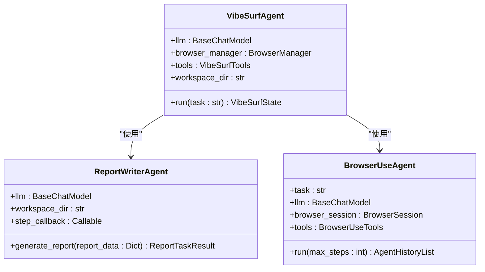
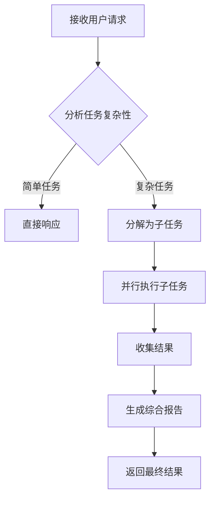
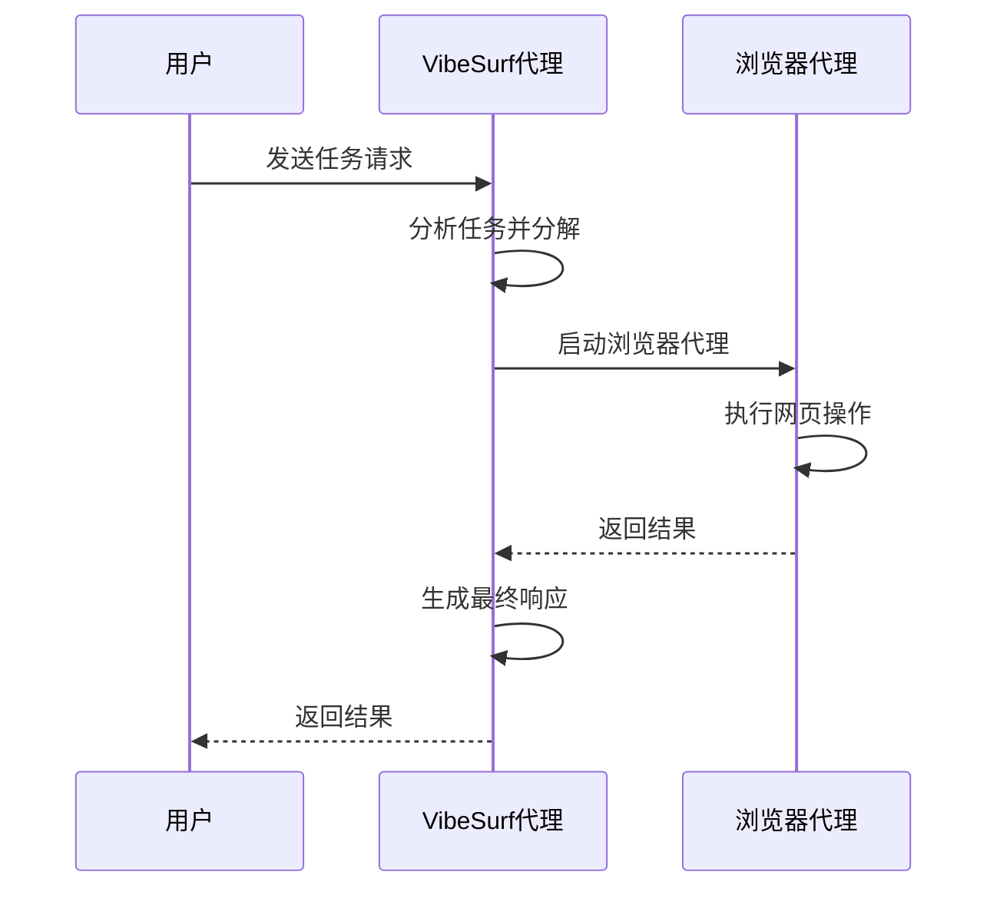

# 自定义代理开发示例

<cite>
**本文档引用的文件**   
- [vibe_surf_agent.py](file://vibe_surf/agents/vibe_surf_agent.py)
- [report_writer_agent.py](file://vibe_surf/agents/report_writer_agent.py)
- [browser_use_agent.py](file://vibe_surf/agents/browser_use_agent.py)
- [vibe_surf_prompt.py](file://vibe_surf/agents/prompts/vibe_surf_prompt.py)
- [report_writer_prompt.py](file://vibe_surf/agents/prompts/report_writer_prompt.py)
- [views.py](file://vibe_surf/agents/views.py)
- [vibesurf_tools.py](file://vibe_surf/tools/vibesurf_tools.py)
- [report_writer_tools.py](file://vibe_surf/tools/report_writer_tools.py)
- [browser_use_tools.py](file://vibe_surf/tools/browser_use_tools.py)
- [vibesurf_registry.py](file://vibe_surf/tools/vibesurf_registry.py)
</cite>

## 目录
1. [引言](#引言)
2. [项目结构分析](#项目结构分析)
3. [核心组件](#核心组件)
4. [新型研究代理开发](#新型研究代理开发)
5. [报告生成代理开发](#报告生成代理开发)
6. [浏览器自动化代理开发](#浏览器自动化代理开发)
7. [工作流与控制流](#工作流与控制流)
8. [提示词模板定制](#提示词模板定制)
9. [工具集成与调用](#工具集成与调用)
10. [开发流程指导](#开发流程指导)

## 引言
本文档旨在为VibeSurf平台提供自定义代理开发的详细示例和指导。通过分析代码库中的关键组件，我们将展示如何创建新型研究代理、报告生成代理和浏览器自动化代理。文档将涵盖从需求分析到代码实现的完整开发流程，包括定义代理类、实现核心业务逻辑、配置提示词模板以及集成工具调用等关键环节。

## 项目结构分析
VibeSurf项目采用模块化设计，主要组件分布在`vibe_surf`目录下。核心代理功能位于`agents`子目录，其中包含`vibe_surf_agent.py`、`report_writer_agent.py`和`browser_use_agent.py`等关键文件。提示词模板存储在`prompts`目录中，而工具集成则在`tools`目录下实现。这种清晰的结构使得开发者可以轻松定位和修改特定功能。

**Section sources**
- [vibe_surf/agents](file://vibe_surf/agents)
- [vibe_surf/tools](file://vibe_surf/tools)

## 核心组件
VibeSurf的核心架构围绕三个主要代理构建：VibeSurf主代理、报告生成代理和浏览器使用代理。这些代理通过LangGraph工作流协同工作，实现复杂的自动化任务。主代理负责整体任务规划和协调，报告生成代理专注于创建结构化HTML报告，而浏览器使用代理则处理网页交互和数据提取。

**Section sources**
- [vibe_surf/agents/vibe_surf_agent.py](file://vibe_surf/agents/vibe_surf_agent.py#L1-L1840)
- [vibe_surf/agents/report_writer_agent.py](file://vibe_surf/agents/report_writer_agent.py#L1-L581)
- [vibe_surf/agents/browser_use_agent.py](file://vibe_surf/agents/browser_use_agent.py#L1-L820)

## 新型研究代理开发
### 代理类定义
新型研究代理继承自`VibeSurfAgent`类，通过扩展其功能来实现特定的研究任务。代理的核心是`_vibesurf_agent_node_impl`方法，该方法实现了思考+行动的模式，允许代理在执行任务时进行推理和决策。



**Diagram sources **
- [vibe_surf/agents/vibe_surf_agent.py](file://vibe_surf/agents/vibe_surf_agent.py#L346-L545)
- [vibe_surf/agents/report_writer_agent.py](file://vibe_surf/agents/report_writer_agent.py#L37-L106)
- [vibe_surf/agents/browser_use_agent.py](file://vibe_surf/agents/browser_use_agent.py#L85-L144)

**Section sources**
- [vibe_surf/agents/vibe_surf_agent.py](file://vibe_surf/agents/vibe_surf_agent.py#L346-L545)
- [vibe_surf/agents/report_writer_agent.py](file://vibe_surf/agents/report_writer_agent.py#L37-L106)
- [vibe_surf/agents/browser_use_agent.py](file://vibe_surf/agents/browser_use_agent.py#L85-L144)

### 核心业务逻辑
研究代理的核心业务逻辑集中在任务分解和并行执行上。代理首先分析用户请求，然后将其分解为多个独立的子任务。这些子任务可以并行执行，从而显著提高效率。例如，在进行市场研究时，代理可以同时搜索不同公司的信息，而不是依次进行。



**Diagram sources **
- [vibe_surf/agents/vibe_surf_agent.py](file://vibe_surf/agents/vibe_surf_agent.py#L353-L545)

## 报告生成代理开发
### 代理实现
报告生成代理（`ReportWriterAgent`）专门负责创建结构化的HTML报告。它通过`generate_report`方法接收报告数据，然后使用LLM控制的流程生成内容。代理会自动创建报告文件，并在其中写入专业格式的HTML内容。

```python
# 代码片段路径: vibe_surf/agents/report_writer_agent.py
# 方法: generate_report
```

**Section sources**
- [vibe_surf/agents/report_writer_agent.py](file://vibe_surf/agents/report_writer_agent.py#L106-L315)

### 提示词模板配置
报告生成代理使用`REPORT_WRITER_PROMPT`作为系统提示词。该模板定义了代理的工作流程，包括分析任务、读取文件、生成内容和格式化输出等步骤。开发者可以通过修改此模板来定制报告的风格和内容。

```python
# 代码片段路径: vibe_surf/agents/prompts/report_writer_prompt.py
# 变量: REPORT_WRITER_PROMPT
```

**Section sources**
- [vibe_surf/agents/prompts/report_writer_prompt.py](file://vibe_surf/agents/prompts/report_writer_prompt.py#L1-L74)

### 预期行为
报告生成代理的预期行为是创建专业、结构化的HTML报告。代理会确保报告包含完整的HTML5结构、嵌入式CSS样式和响应式设计。生成的报告可以直接在浏览器中查看，并且具有良好的打印效果。

## 浏览器自动化代理开发
### 代理类实现
浏览器自动化代理（`BrowserUseAgent`）负责执行网页交互任务。它通过`run`方法启动代理，并在指定的最大步数内执行任务。代理使用`multi_act`方法来执行多个动作，确保任务的高效完成。

```python
# 代码片段路径: vibe_surf/agents/browser_use_agent.py
# 方法: run, multi_act
```

**Section sources**
- [vibe_surf/agents/browser_use_agent.py](file://vibe_surf/agents/browser_use_agent.py#L659-L773)

### 工作流逻辑
浏览器自动化代理的工作流包括初始化、执行初始动作和主执行循环。在主循环中，代理会检查暂停和停止状态，然后执行步骤。每个步骤都可能包含多个动作，代理会确保这些动作按顺序执行。



**Diagram sources **
- [vibe_surf/agents/vibe_surf_agent.py](file://vibe_surf/agents/vibe_surf_agent.py#L548-L587)
- [vibe_surf/agents/browser_use_agent.py](file://vibe_surf/agents/browser_use_agent.py#L659-L773)

## 工作流与控制流
### LangGraph工作流
VibeSurf使用LangGraph来管理代理的工作流。工作流由多个节点组成，包括`vibesurf_agent_node`、`browser_task_execution_node`和`report_task_execution_node`。这些节点通过条件边连接，形成一个复杂的决策网络。

```python
# 代码片段路径: vibe_surf/agents/vibe_surf_agent.py
# 方法: vibesurf_agent_node, browser_task_execution_node, report_task_execution_node
```

**Section sources**
- [vibe_surf/agents/vibe_surf_agent.py](file://vibe_surf/agents/vibe_surf_agent.py#L346-L587)

### 控制状态管理
代理实现了精细的控制状态管理，包括暂停、恢复和停止功能。`control_aware_node`装饰器确保每个工作流节点在执行前都检查控制状态，从而实现对代理执行的精确控制。

```python
# 代码片段路径: vibe_surf/agents/vibe_surf_agent.py
# 方法: control_aware_node
```

**Section sources**
- [vibe_surf/agents/vibe_surf_agent.py](file://vibe_surf/agents/vibe_surf_agent.py#L300-L342)

## 提示词模板定制
### 现有模板修改
VibeSurf提供了两个主要的提示词模板：`VIBESURF_SYSTEM_PROMPT`和`EXTEND_BU_SYSTEM_PROMPT`。开发者可以通过修改这些模板来定制代理的行为。例如，可以添加新的能力描述或调整工作流程。

```python
# 代码片段路径: vibe_surf/agents/prompts/vibe_surf_prompt.py
# 变量: VIBESURF_SYSTEM_PROMPT, EXTEND_BU_SYSTEM_PROMPT
```

**Section sources**
- [vibe_surf/agents/prompts/vibe_surf_prompt.py](file://vibe_surf/agents/prompts/vibe_surf_prompt.py#L2-L219)

### 自定义模板设计
开发者可以创建全新的提示词模板来支持特定的用例。新模板应该遵循VibeSurf的格式规范，包括明确的能力描述、工作流程和输出要求。模板的设计应考虑到LLM的理解能力和任务的复杂性。

## 工具集成与调用
### 工具注册
VibeSurf使用`VibeSurfRegistry`来管理工具的注册和发现。开发者可以通过继承`VibeSurfTools`类并重写`_register_*`方法来添加新的工具。每个工具都通过`@registry.action`装饰器注册。

```python
# 代码片段路径: vibe_surf/tools/vibesurf_tools.py
# 类: VibeSurfTools
```

**Section sources**
- [vibe_surf/tools/vibesurf_tools.py](file://vibe_surf/tools/vibesurf_tools.py#L72-L87)

### 工具调用
工具调用通过`act`方法实现。代理根据LLM的输出选择适当的工具，并传递必要的参数。工具执行的结果会被返回给代理，用于后续的决策和输出生成。

```python
# 代码片段路径: vibe_surf/tools/vibesurf_tools.py
# 方法: act
```

**Section sources**
- [vibe_surf/tools/vibesurf_tools.py](file://vibe_surf/tools/vibesurf_tools.py#L300-L350)

## 开发流程指导
### 需求分析
开发自定义代理的第一步是进行需求分析。需要明确代理的目标、输入输出格式、所需工具和预期行为。这有助于确定代理的架构和实现细节。

### 代码实现
实现过程包括定义代理类、实现核心方法、配置提示词模板和集成工具。开发者应该遵循VibeSurf的编码规范，并充分利用现有的组件和工具。

### 测试与调试
完成代码实现后，需要进行充分的测试。可以使用`tests`目录下的测试用例作为参考，确保代理在各种情况下都能正确工作。调试时可以利用日志和活动跟踪功能来诊断问题。

### 部署与优化
最后，将代理集成到VibeSurf系统中，并进行性能优化。可以通过调整LLM参数、优化提示词模板和改进工作流来提高代理的效率和准确性。

**Section sources**
- [vibe_surf/agents/vibe_surf_agent.py](file://vibe_surf/agents/vibe_surf_agent.py)
- [vibe_surf/agents/report_writer_agent.py](file://vibe_surf/agents/report_writer_agent.py)
- [vibe_surf/agents/browser_use_agent.py](file://vibe_surf/agents/browser_use_agent.py)
- [vibe_surf/tools/vibesurf_tools.py](file://vibe_surf/tools/vibesurf_tools.py)