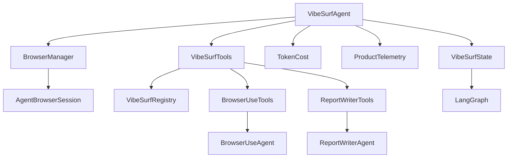
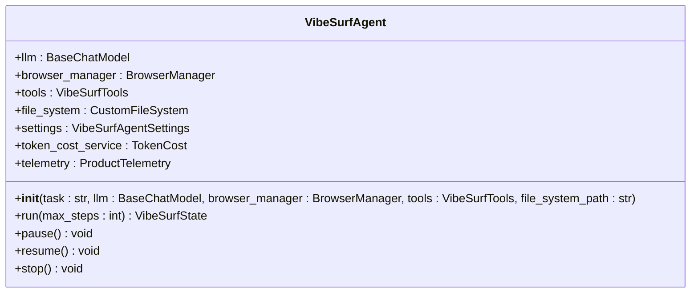
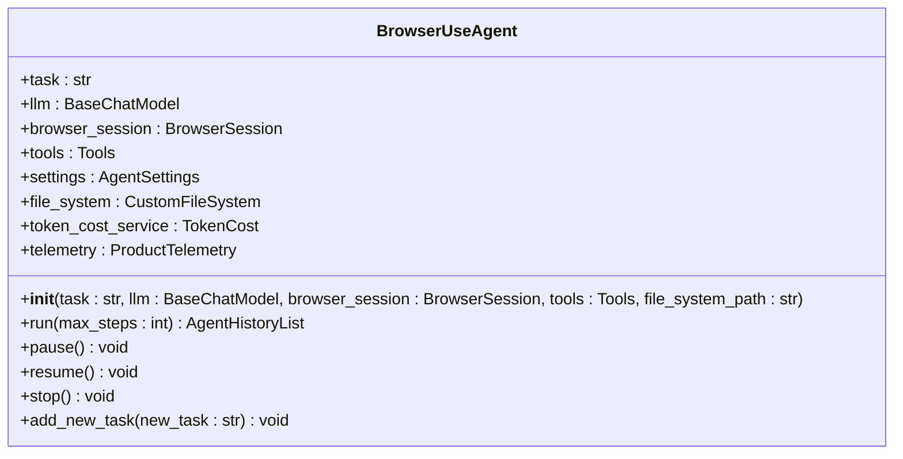
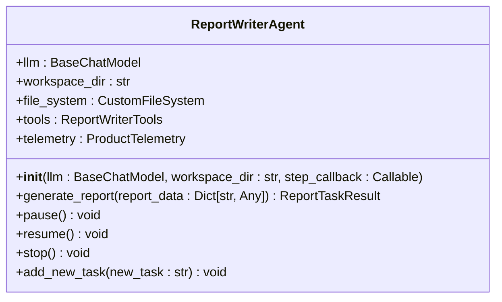
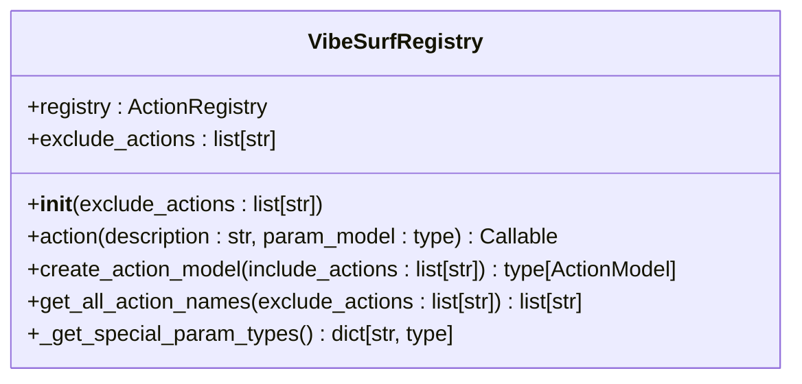
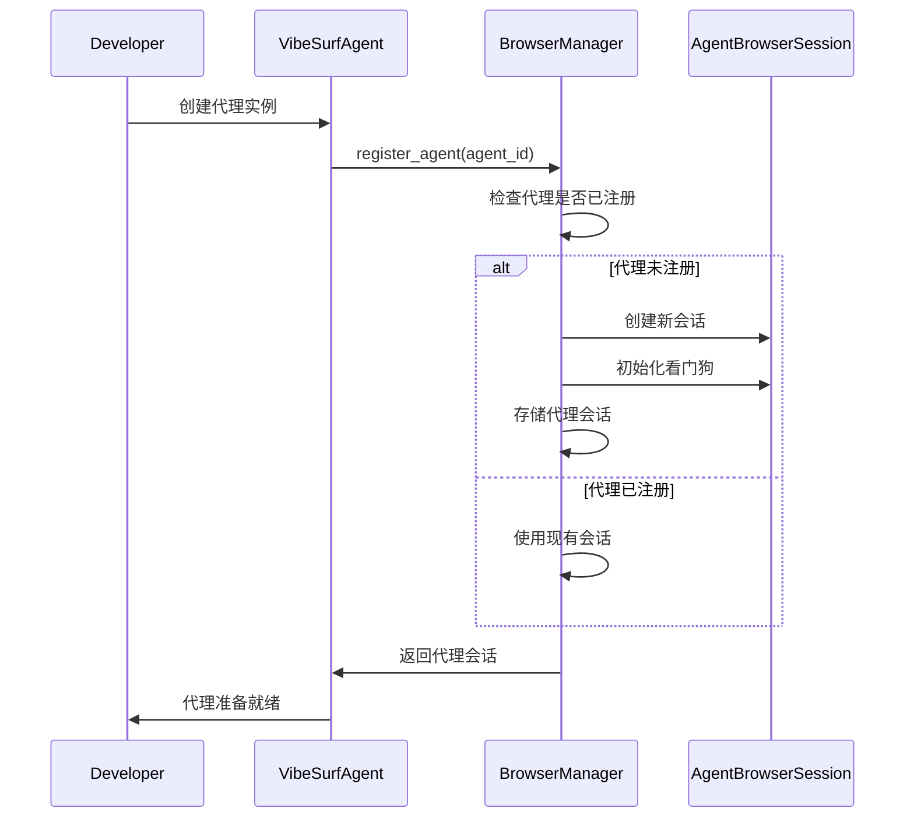

# 自定义开发

<cite>
**本文档引用的文件**   
- [vibe_surf_agent.py](file://vibe_surf/agents/vibe_surf_agent.py)
- [browser_use_agent.py](file://vibe_surf/agents/browser_use_agent.py)
- [report_writer_agent.py](file://vibe_surf/agents/report_writer_agent.py)
- [vibesurf_tools.py](file://vibe_surf/tools/vibesurf_tools.py)
- [vibesurf_registry.py](file://vibe_surf/tools/vibesurf_registry.py)
- [browser_use_tools.py](file://vibe_surf/tools/browser_use_tools.py)
- [report_writer_tools.py](file://vibe_surf/tools/report_writer_tools.py)
- [views.py](file://vibe_surf/agents/views.py)
</cite>

## 目录
1. [引言](#引言)
2. [代理系统架构](#代理系统架构)
3. [代理基类使用方法](#代理基类使用方法)
4. [自定义代理扩展接口](#自定义代理扩展接口)
5. [自定义代理注册机制](#自定义代理注册机制)
6. [完整代码示例](#完整代码示例)
7. [测试与调试方法](#测试与调试方法)
8. [性能优化建议](#性能优化建议)
9. [常见问题解决方案](#常见问题解决方案)
10. [最佳实践指导](#最佳实践指导)

## 引言
VibeSurf代理系统提供了一套完整的自定义开发框架，允许开发者扩展现有代理功能或创建全新的代理类型。本指南详细说明了如何使用代理基类、扩展接口、注册机制以及完整的开发流程。

## 代理系统架构
VibeSurf代理系统采用模块化架构，核心组件包括代理基类、工具注册表、浏览器管理器和各种专用代理。系统通过LangGraph工作流协调不同代理的执行，实现复杂的自动化任务。



**Diagram sources**
- [vibe_surf_agent.py](file://vibe_surf/agents/vibe_surf_agent.py#L1-L130)
- [browser_use_agent.py](file://vibe_surf/agents/browser_use_agent.py#L83-L144)
- [report_writer_agent.py](file://vibe_surf/agents/report_writer_agent.py#L34-L46)
- [vibesurf_tools.py](file://vibe_surf/tools/vibesurf_tools.py#L72-L87)
- [vibesurf_registry.py](file://vibe_surf/tools/vibesurf_registry.py#L34-L53)

## 代理基类使用方法
VibeSurf系统提供了多个代理基类，开发者可以通过继承这些基类来创建自定义代理。主要基类包括`VibeSurfAgent`、`BrowserUseAgent`和`ReportWriterAgent`。

### VibeSurfAgent基类
`VibeSurfAgent`是系统的主要代理基类，负责协调其他代理的执行。它使用LangGraph工作流管理任务流，通过状态机控制代理的执行流程。



**Diagram sources**
- [vibe_surf_agent.py](file://vibe_surf/agents/vibe_surf_agent.py#L83-L144)

### BrowserUseAgent基类
`BrowserUseAgent`是专门用于浏览器自动化任务的代理基类。它提供了丰富的浏览器操作功能，包括页面导航、元素交互、内容提取等。



**Diagram sources**
- [browser_use_agent.py](file://vibe_surf/agents/browser_use_agent.py#L83-L144)

### ReportWriterAgent基类
`ReportWriterAgent`是用于生成报告的代理基类。它使用LLM驱动的流程生成HTML报告，支持自定义报告模板和格式。



**Diagram sources**
- [report_writer_agent.py](file://vibe_surf/agents/report_writer_agent.py#L34-L46)

## 自定义代理扩展接口
VibeSurf系统提供了灵活的扩展接口，允许开发者通过工具注册表添加自定义功能。

### 工具注册表
`VibeSurfRegistry`是系统的核心扩展接口，用于注册和管理自定义工具。开发者可以通过继承`VibeSurfRegistry`来添加新的工具类型。



**Diagram sources**
- [vibesurf_registry.py](file://vibe_surf/tools/vibesurf_registry.py#L34-L53)

### 自定义工具开发
开发者可以通过`VibeSurfTools`类的注册机制添加自定义工具。每个工具需要定义参数模型和执行逻辑。

```python
@self.registry.action(
    'Custom action description',
    param_model=CustomActionModel,
)
async def custom_action(
    params: CustomActionModel,
    browser_manager: BrowserManager,
    page_extraction_llm: BaseChatModel,
    file_system: CustomFileSystem
):
    """
    Custom action implementation
    """
    try:
        # Action implementation
        result = await some_async_operation(params)
        return ActionResult(
            extracted_content=f"Custom action completed: {result}",
            include_in_memory=True,
            long_term_memory=f"Executed custom action with {params}"
        )
    except Exception as e:
        return ActionResult(error=f"Custom action failed: {str(e)}")
```

**Section sources**
- [vibesurf_tools.py](file://vibe_surf/tools/vibesurf_tools.py#L72-L87)

## 自定义代理注册机制
VibeSurf系统通过浏览器管理器（BrowserManager）实现代理的注册和发现。每个代理在创建时都会被注册到管理器中，以便进行资源管理和协调。

### 代理注册流程
1. 创建代理实例
2. 调用浏览器管理器的`register_agent`方法
3. 管理器分配浏览器会话和资源
4. 代理开始执行任务



**Diagram sources**
- [browser_manager.py](file://vibe_surf/browser/browser_manager.py#L47-L72)

### 代理发现方式
系统通过代理ID和浏览器会话ID来发现和管理代理。开发者可以通过以下方式访问已注册的代理：

```python
# 获取已注册的代理
agent_session = browser_manager._agent_sessions.get(agent_id)
if agent_session:
    # 使用代理会话
    await agent_session.connect_agent(target_id=target_id)
```

**Section sources**
- [browser_manager.py](file://vibe_surf/browser/browser_manager.py#L47-L127)

## 完整代码示例
以下是一个完整的自定义代理开发示例，展示从代理类定义到配置集成的全过程。

### 自定义代理类定义
```python
from vibe_surf.agents.vibe_surf_agent import VibeSurfAgent
from vibe_surf.browser.browser_manager import BrowserManager
from vibe_surf.tools.vibesurf_tools import VibeSurfTools
from vibe_surf.tools.views import CustomActionModel
from browser_use.llm.base import BaseChatModel
from browser_use.llm.messages import UserMessage
from browser_use.browser.views import TabInfo
from browser_use.filesystem.file_system import FileSystem
from browser_use.agent.views import ActionResult

class CustomDataExtractorAgent(VibeSurfAgent):
    """
    自定义数据提取代理
    专门用于从网页中提取结构化数据
    """
    
    def __init__(
        self,
        task: str,
        llm: BaseChatModel,
        browser_manager: BrowserManager,
        tools: VibeSurfTools,
        file_system_path: str = "./workspace"
    ):
        super().__init__(
            task=task,
            llm=llm,
            browser_manager=browser_manager,
            tools=tools,
            file_system_path=file_system_path
        )
        # 初始化自定义属性
        self.data_format = "json"
        self.extraction_rules = []
        
    async def _execute_extraction(self, query: str, tab_id: str = None):
        """
        执行数据提取操作
        """
        try:
            # 获取当前浏览器上下文
            browser_tabs = await self.browser_manager.main_browser_session.get_tabs()
            active_tab = await self.browser_manager.get_activate_tab()
            
            # 格式化上下文信息
            context_info = []
            context_info.append(f"当前时间: {datetime.now().strftime('%Y-%m-%d %H:%M:%S')}")
            if browser_tabs:
                browser_tabs_info = {}
                for tab in browser_tabs:
                    browser_tabs_info[tab.target_id[-4:]] = {
                        "page_title": tab.title,
                        "page_url": tab.url,
                    }
                context_info.append(
                    f"当前可用浏览器标签:\n{json.dumps(browser_tabs_info, ensure_ascii=False, indent=2)}\n")
            if active_tab:
                context_info.append(f"当前活动浏览器标签:{active_tab.target_id[-4:]}\n")
                
            context_str = "\n".join(context_info) if context_info else "无附加上下文可用。"
            
            # 添加上下文到消息历史
            self.message_history.append(UserMessage(content=context_str))
            
            # 执行提取操作
            result = await self.tools.act(
                action=CustomActionModel(query=query, tab_id=tab_id),
                browser_manager=self.browser_manager,
                llm=self.llm,
                file_system=self.file_system,
            )
            
            return result
            
        except Exception as e:
            logger.error(f"❌ 数据提取失败: {e}")
            return ActionResult(error=f"数据提取失败: {str(e)}")
```

### 方法实现
```python
async def run_extraction_workflow(self, max_steps: int = 20):
    """
    执行数据提取工作流
    """
    logger.info("🚀 开始执行数据提取工作流...")
    
    try:
        # 初始化状态
        state = VibeSurfState(
            original_task=self.task,
            current_step="vibesurf_agent",
            vibesurf_agent=self
        )
        
        # 执行主循环
        for step in range(max_steps):
            if self.stopped:
                logger.info('🛑 代理已停止')
                break
                
            logger.info(f"🔄 执行步骤 {step + 1}/{max_steps}...")
            
            # 执行提取操作
            result = await self._execute_extraction(self.task)
            
            if result.extracted_content:
                logger.info(f"✅ 提取成功: {result.extracted_content[:100]}...")
                break
                
            if result.error:
                logger.error(f"❌ 提取失败: {result.error}")
                if step >= self.settings.max_failures:
                    break
                    
            # 等待一段时间后重试
            await asyncio.sleep(1)
            
        # 返回最终状态
        return state
        
    except Exception as e:
        logger.error(f"❌ 工作流执行失败: {e}")
        raise
```

### 配置集成
```python
# 配置文件: config.py
class AgentConfig:
    """
    代理配置类
    包含所有代理相关的配置参数
    """
    
    # LLM配置
    LLM_MODEL = "gpt-4.1-mini"
    LLM_TIMEOUT = 90  # 秒
    
    # 浏览器配置
    BROWSER_WAIT_BETWEEN_ACTIONS = 1.0  # 秒
    BROWSER_DOWNLOAD_PATH = "./downloads"
    
    # 代理配置
    MAX_FAILURES = 3
    MAX_ACTIONS_PER_STEP = 4
    USE_VISION = True
    
    # 文件系统配置
    WORKSPACE_DIR = "./workspace"
    UPLOAD_DIR = "upload_files"
    DOWNLOAD_DIR = "downloads"
    
    # 工具配置
    ENABLE_BROWSER_TOOLS = True
    ENABLE_FILE_TOOLS = True
    ENABLE_REPORT_TOOLS = True
    
    # Telemetry配置
    ENABLE_TELEMETRY = True
    TELEMETRY_FLUSH_INTERVAL = 30  # 秒
```

**Section sources**
- [vibe_surf_agent.py](file://vibe_surf/agents/vibe_surf_agent.py#L344-L546)
- [browser_use_agent.py](file://vibe_surf/agents/browser_use_agent.py#L659-L773)
- [report_writer_agent.py](file://vibe_surf/agents/report_writer_agent.py#L118-L316)

## 测试与调试方法
VibeSurf系统提供了多种测试和调试工具，帮助开发者验证自定义代理的功能和性能。

### 单元测试
```python
import pytest
import asyncio
from unittest.mock import Mock, AsyncMock

class TestCustomDataExtractorAgent:
    """
    自定义数据提取代理的单元测试
    """
    
    @pytest.fixture
    def mock_llm(self):
        """创建LLM模拟对象"""
        llm = Mock()
        llm.ainvoke = AsyncMock()
        llm.model_name = "test-model"
        return llm
        
    @pytest.fixture
    def mock_browser_manager(self):
        """创建浏览器管理器模拟对象"""
        manager = Mock()
        manager.main_browser_session = Mock()
        manager.main_browser_session.get_tabs = AsyncMock()
        manager.main_browser_session.get_current_page_title = AsyncMock()
        manager.get_activate_tab = AsyncMock()
        return manager
        
    @pytest.fixture
    def mock_tools(self):
        """创建工具模拟对象"""
        tools = Mock()
        tools.act = AsyncMock()
        tools.registry = Mock()
        tools.registry.create_action_model = Mock()
        return tools
        
    @pytest.mark.asyncio
    async def test_agent_initialization(self, mock_llm, mock_browser_manager, mock_tools):
        """测试代理初始化"""
        # 创建代理实例
        agent = CustomDataExtractorAgent(
            task="测试任务",
            llm=mock_llm,
            browser_manager=mock_browser_manager,
            tools=mock_tools,
            file_system_path="./test_workspace"
        )
        
        # 验证代理属性
        assert agent.task == "测试任务"
        assert agent.llm == mock_llm
        assert agent.browser_manager == mock_browser_manager
        assert agent.tools == mock_tools
        assert isinstance(agent.file_system, CustomFileSystem)
        
    @pytest.mark.asyncio
    async def test_extraction_workflow(self, mock_llm, mock_browser_manager, mock_tools):
        """测试提取工作流"""
        # 设置模拟返回值
        mock_browser_manager.main_browser_session.get_tabs.return_value = [
            TabInfo(target_id="tab1", title="测试页面", url="https://example.com")
        ]
        mock_browser_manager.get_activate_tab.return_value = TabInfo(target_id="tab1", title="测试页面", url="https://example.com")
        mock_tools.act.return_value = ActionResult(extracted_content='{"data": "test"}')
        
        # 创建代理实例
        agent = CustomDataExtractorAgent(
            task="提取测试数据",
            llm=mock_llm,
            browser_manager=mock_browser_manager,
            tools=mock_tools,
            file_system_path="./test_workspace"
        )
        
        # 执行工作流
        state = await agent.run_extraction_workflow(max_steps=5)
        
        # 验证结果
        assert state.is_complete == True
        assert state.final_response is not None
```

### 调试技巧
1. **日志调试**：使用系统内置的日志功能跟踪代理执行过程
2. **断点调试**：在关键代码位置设置断点进行逐步调试
3. **状态检查**：定期检查代理状态和变量值
4. **性能监控**：监控代理的资源使用情况和执行时间

```python
# 调试辅助函数
def debug_agent_state(agent):
    """调试代理状态"""
    logger.debug(f"=== 代理状态调试 ===")
    logger.debug(f"代理ID: {agent.id}")
    logger.debug(f"任务: {agent.task}")
    logger.debug(f"当前步骤: {agent.current_step}")
    logger.debug(f"是否停止: {agent.stopped}")
    logger.debug(f"是否暂停: {agent.paused}")
    logger.debug(f"连续失败次数: {agent.consecutive_failures}")
    logger.debug(f"消息历史长度: {len(agent.message_history)}")
    logger.debug(f"=====================")

# 在代理执行过程中调用
async def _execute_step(self, step, max_steps, step_info, on_step_start, on_step_end):
    """执行步骤"""
    # 调试状态
    debug_agent_state(self)
    
    # 执行原有逻辑
    # ...
```

**Section sources**
- [test_agents.py](file://tests/test_agents.py)
- [test_tools.py](file://tests/test_tools.py)

## 性能优化建议
为了确保自定义代理的高效运行，以下是性能优化的最佳实践。

### 资源管理
1. **内存优化**：及时清理不再需要的对象和缓存
2. **连接池**：复用浏览器会话和网络连接
3. **文件管理**：合理组织文件系统，避免文件过多

```python
class OptimizedCustomAgent(VibeSurfAgent):
    """
    优化的自定义代理
    实现了资源管理和性能优化
    """
    
    def __init__(self, *args, **kwargs):
        super().__init__(*args, **kwargs)
        # 初始化资源池
        self._resource_pool = {}
        self._cache = {}
        self._max_cache_size = 100
        
    async def cleanup_resources(self):
        """清理资源"""
        # 清理缓存
        if len(self._cache) > self._max_cache_size:
            # 保留最近使用的缓存项
            recent_keys = list(self._cache.keys())[-50:]
            self._cache = {k: v for k, v in self._cache.items() if k in recent_keys}
            
        # 清理空闲资源
        for key, resource in list(self._resource_pool.items()):
            if resource.is_idle():
                await resource.cleanup()
                del self._resource_pool[key]
                
    async def get_cached_result(self, key):
        """获取缓存结果"""
        return self._cache.get(key)
        
    async def cache_result(self, key, value):
        """缓存结果"""
        self._cache[key] = value
        # 定期清理缓存
        if len(self._cache) % 10 == 0:
            await self.cleanup_resources()
```

### 执行效率提升
1. **异步优化**：充分利用异步编程优势
2. **批量处理**：合并多个操作为批量处理
3. **并行执行**：在安全的前提下并行执行独立任务

```python
async def execute_parallel_tasks(self, tasks):
    """
    并行执行多个任务
    """
    # 创建任务列表
    coroutines = []
    for task in tasks:
        coroutine = self._execute_single_task(task)
        coroutines.append(coroutine)
        
    # 并行执行所有任务
    results = await asyncio.gather(*coroutines, return_exceptions=True)
    
    # 处理结果
    successful_results = []
    for i, result in enumerate(results):
        if isinstance(result, Exception):
            logger.error(f"任务 {i} 执行失败: {result}")
        else:
            successful_results.append(result)
            
    return successful_results
```

**Section sources**
- [vibe_surf_agent.py](file://vibe_surf/agents/vibe_surf_agent.py#L548-L605)
- [browser_use_agent.py](file://vibe_surf/agents/browser_use_agent.py#L607-L763)

## 常见问题解决方案
以下是开发过程中常见的问题及其解决方案。

### 问题1：代理无法启动
**症状**：代理初始化失败，抛出异常
**原因**：缺少必要的依赖或配置错误
**解决方案**：
1. 检查LLM配置是否正确
2. 验证浏览器管理器是否正常工作
3. 确认文件系统路径可访问

```python
def validate_agent_configuration(self):
    """验证代理配置"""
    errors = []
    
    # 检查LLM
    if not self.llm:
        errors.append("LLM未配置")
        
    # 检查浏览器管理器
    if not self.browser_manager:
        errors.append("浏览器管理器未配置")
    elif not hasattr(self.browser_manager, 'main_browser_session'):
        errors.append("浏览器管理器缺少主会话")
        
    # 检查文件系统
    if not self.file_system:
        errors.append("文件系统未配置")
    else:
        try:
            test_path = self.file_system.get_dir() / "test.txt"
            with open(test_path, 'w') as f:
                f.write("test")
            os.remove(test_path)
        except Exception as e:
            errors.append(f"文件系统不可写: {e}")
            
    return errors
```

### 问题2：工具执行失败
**症状**：工具调用返回错误
**原因**：参数错误或环境问题
**解决方案**：
1. 验证参数类型和格式
2. 检查浏览器会话状态
3. 确认LLM服务可用

```python
async def robust_tool_execution(self, action, **kwargs):
    """
    健壮的工具执行
    包含重试机制和错误处理
    """
    max_retries = 3
    retry_delay = 1.0
    
    for attempt in range(max_retries):
        try:
            # 执行工具
            result = await self.tools.act(action, **kwargs)
            
            # 检查结果
            if result.error:
                logger.warning(f"工具执行返回错误 (尝试 {attempt + 1}): {result.error}")
                if attempt < max_retries - 1:
                    await asyncio.sleep(retry_delay * (attempt + 1))
                    continue
                return result
            else:
                return result
                
        except Exception as e:
            logger.error(f"工具执行异常 (尝试 {attempt + 1}): {e}")
            if attempt < max_retries - 1:
                await asyncio.sleep(retry_delay * (attempt + 1))
            else:
                return ActionResult(error=f"工具执行失败: {str(e)}")
```

**Section sources**
- [vibe_surf_agent.py](file://vibe_surf/agents/vibe_surf_agent.py#L522-L545)
- [browser_use_agent.py](file://vibe_surf/agents/browser_use_agent.py#L721-L734)

## 最佳实践指导
遵循以下最佳实践可以确保自定义代理的高质量和可维护性。

### 代码组织
1. **模块化设计**：将功能分解为独立的模块
2. **清晰的命名**：使用有意义的变量和函数名
3. **文档注释**：为类和方法添加详细的文档注释

```python
class WellStructuredCustomAgent(VibeSurfAgent):
    """
    结构良好的自定义代理
    遵循最佳实践的代码组织
    """
    
    def __init__(self, *args, **kwargs):
        """
        初始化代理
        
        Args:
            task: 代理任务描述
            llm: 语言模型实例
            browser_manager: 浏览器管理器实例
            tools: 工具实例
            file_system_path: 文件系统路径
        """
        super().__init__(*args, **kwargs)
        self._initialize_components()
        
    def _initialize_components(self):
        """初始化组件"""
        self._setup_message_history()
        self._configure_settings()
        self._register_callbacks()
        
    def _setup_message_history(self):
        """设置消息历史"""
        self.message_history = []
        system_message = self._generate_system_prompt()
        self.message_history.append(SystemMessage(content=system_message))
        
    def _configure_settings(self):
        """配置设置"""
        self.settings = VibeSurfAgentSettings(
            use_vision=True,
            max_failures=3,
            max_actions_per_step=4,
            agent_mode="thinking"
        )
```

### 错误处理
1. **全面的异常捕获**：捕获所有可能的异常
2. **有意义的错误信息**：提供详细的错误描述
3. **优雅的降级**：在错误发生时提供备选方案

```python
async def safe_execute_with_fallback(self, primary_func, fallback_func, *args, **kwargs):
    """
    安全执行带降级的函数
    
    Args:
        primary_func: 主要执行函数
        fallback_func: 降级执行函数
        *args, **kwargs: 函数参数
        
    Returns:
        执行结果
    """
    try:
        # 尝试主要功能
        result = await primary_func(*args, **kwargs)
        return result
        
    except Exception as e:
        logger.warning(f"主要功能执行失败: {e}, 尝试降级方案")
        
        try:
            # 执行降级方案
            result = await fallback_func(*args, **kwargs)
            logger.info("降级方案执行成功")
            return result
            
        except Exception as fallback_error:
            logger.error(f"降级方案也失败: {fallback_error}")
            raise RuntimeError(f"所有执行方案均失败: {e}, {fallback_error}")
```

**Section sources**
- [vibe_surf_agent.py](file://vibe_surf/agents/vibe_surf_agent.py#L344-L546)
- [browser_use_agent.py](file://vibe_surf/agents/browser_use_agent.py#L659-L773)