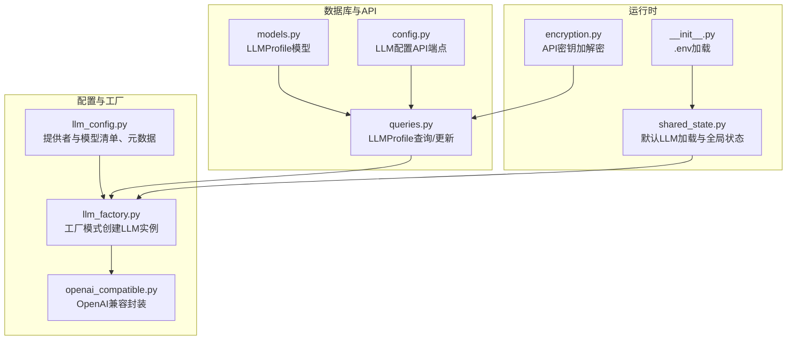
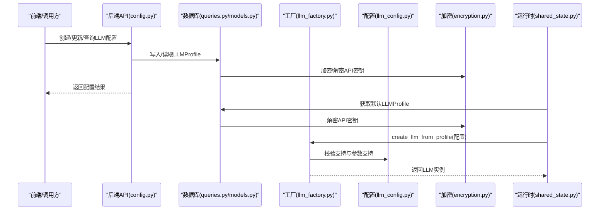
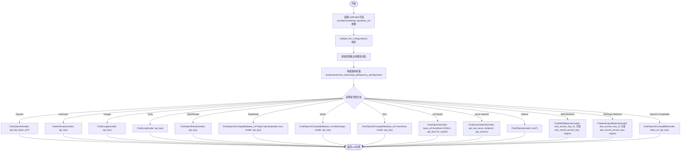
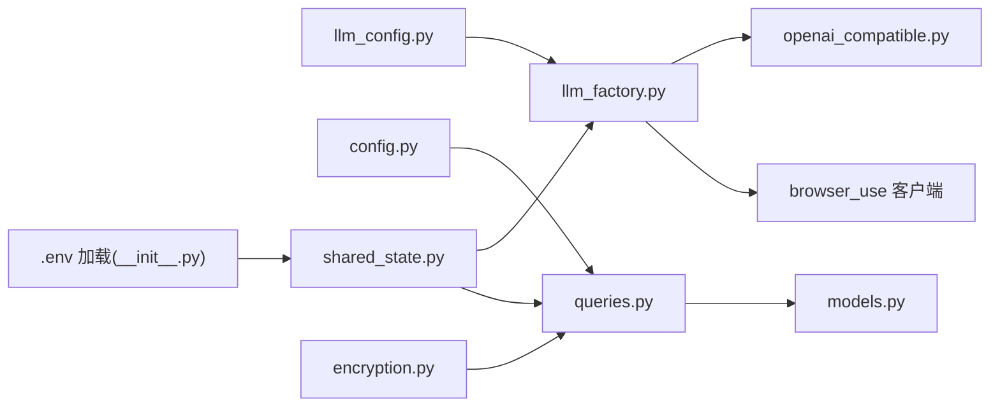

# LLM提供商配置

<cite>
**本文引用的文件**
- [llm_config.py](file://vibe_surf/backend/llm_config.py)
- [llm_factory.py](file://vibe_surf/backend/utils/llm_factory.py)
- [openai_compatible.py](file://vibe_surf/llm/openai_compatible.py)
- [shared_state.py](file://vibe_surf/backend/shared_state.py)
- [queries.py](file://vibe_surf/backend/database/queries.py)
- [models.py](file://vibe_surf/backend/database/models.py)
- [config.py](file://vibe_surf/backend/api/config.py)
- [encryption.py](file://vibe_surf/backend/utils/encryption.py)
- [__init__.py](file://vibe_surf/__init__.py)
</cite>

## 目录
1. [简介](#简介)
2. [项目结构](#项目结构)
3. [核心组件](#核心组件)
4. [架构总览](#架构总览)
5. [详细组件分析](#详细组件分析)
6. [依赖关系分析](#依赖关系分析)
7. [性能考量](#性能考量)
8. [故障排查指南](#故障排查指南)
9. [结论](#结论)
10. [附录](#附录)

## 简介
本文件面向需要在系统中集成与管理多家主流LLM提供商（OpenAI、Anthropic、Groq、Mistral等）的用户与开发者，系统化说明以下内容：
- 各提供商的API密钥配置方法、基础URL设置与模型名称指定方式
- 配置结构设计：如何通过环境变量或配置文件安全地管理敏感信息
- 工厂模式实现细节：如何根据配置动态创建不同提供商的LLM实例
- 配置示例与最佳实践
- 常见配置错误的排查方法

## 项目结构
围绕LLM配置与工厂的核心文件分布如下：
- 配置定义与元数据：vibe_surf/backend/llm_config.py
- 工厂与实例创建：vibe_surf/backend/utils/llm_factory.py
- OpenAI兼容封装：vibe_surf/llm/openai_compatible.py
- 数据库模型与查询：vibe_surf/backend/database/models.py、vibe_surf/backend/database/queries.py
- 全局初始化与默认LLM加载：vibe_surf/backend/shared_state.py
- API端点：vibe_surf/backend/api/config.py
- 加密工具：vibe_surf/backend/utils/encryption.py
- 环境变量加载入口：vibe_surf/__init__.py

图表来源
- [llm_config.py](file://vibe_surf/backend/llm_config.py#L1-L226)
- [llm_factory.py](file://vibe_surf/backend/utils/llm_factory.py#L1-L275)
- [openai_compatible.py](file://vibe_surf/llm/openai_compatible.py#L1-L373)
- [models.py](file://vibe_surf/backend/database/models.py#L57-L92)
- [queries.py](file://vibe_surf/backend/database/queries.py#L1-L211)
- [config.py](file://vibe_surf/backend/api/config.py#L77-L110)
- [shared_state.py](file://vibe_surf/backend/shared_state.py#L604-L682)
- [encryption.py](file://vibe_surf/backend/utils/encryption.py#L1-L172)
- [__init__.py](file://vibe_surf/__init__.py#L1-L12)

章节来源
- [llm_config.py](file://vibe_surf/backend/llm_config.py#L1-L226)
- [llm_factory.py](file://vibe_surf/backend/utils/llm_factory.py#L1-L275)
- [openai_compatible.py](file://vibe_surf/llm/openai_compatible.py#L1-L373)
- [models.py](file://vibe_surf/backend/database/models.py#L57-L92)
- [queries.py](file://vibe_surf/backend/database/queries.py#L1-L211)
- [config.py](file://vibe_surf/backend/api/config.py#L77-L110)
- [shared_state.py](file://vibe_surf/backend/shared_state.py#L604-L682)
- [encryption.py](file://vibe_surf/backend/utils/encryption.py#L1-L172)
- [__init__.py](file://vibe_surf/__init__.py#L1-L12)

## 核心组件
- 提供者与模型清单：集中维护所有支持的提供商及其模型列表，并提供元数据（是否需要API密钥、是否需要基础URL、是否支持工具/视觉等）
- 工厂模式：根据LLMProfile配置动态创建对应提供商的LLM实例；对参数进行适配与校验
- OpenAI兼容封装：为特定模型（如Gemini、Kimi、Qwen、DeepSeek）自动修复JSON Schema以适配OpenAI兼容接口
- 数据库模型与查询：LLMProfile模型存储提供商、模型、基础URL、参数与加密后的API密钥；查询层负责加解密与默认配置
- 默认LLM加载：从数据库默认配置或环境变量回退加载LLM实例
- API端点：提供LLM配置的增删改查、默认配置切换、可用提供商与模型列表查询
- 加密工具：基于机器MAC地址派生密钥，对API密钥进行对称加密存储与解密使用
- 环境变量：项目根目录加载.env文件，便于本地开发与部署

章节来源
- [llm_config.py](file://vibe_surf/backend/llm_config.py#L1-L226)
- [llm_factory.py](file://vibe_surf/backend/utils/llm_factory.py#L1-L275)
- [openai_compatible.py](file://vibe_surf/llm/openai_compatible.py#L1-L373)
- [models.py](file://vibe_surf/backend/database/models.py#L57-L92)
- [queries.py](file://vibe_surf/backend/database/queries.py#L1-L211)
- [shared_state.py](file://vibe_surf/backend/shared_state.py#L604-L682)
- [config.py](file://vibe_surf/backend/api/config.py#L77-L110)
- [encryption.py](file://vibe_surf/backend/utils/encryption.py#L1-L172)
- [__init__.py](file://vibe_surf/__init__.py#L1-L12)

## 架构总览
下图展示了从配置到实例创建与使用的整体流程，以及与数据库、API、环境变量的关系。

图表来源
- [config.py](file://vibe_surf/backend/api/config.py#L77-L110)
- [queries.py](file://vibe_surf/backend/database/queries.py#L1-L211)
- [encryption.py](file://vibe_surf/backend/utils/encryption.py#L1-L172)
- [llm_factory.py](file://vibe_surf/backend/utils/llm_factory.py#L1-L275)
- [llm_config.py](file://vibe_surf/backend/llm_config.py#L1-L226)
- [shared_state.py](file://vibe_surf/backend/shared_state.py#L604-L682)

## 详细组件分析

### 组件A：LLM配置结构设计（llm_config.py）
- 提供者清单与模型列表：集中维护所有支持的提供商与其模型，便于统一管理与API返回
- 元数据字段：
  - 显示名、是否需要API密钥、是否需要基础URL、是否支持工具、是否支持视觉、默认模型
  - 部分提供商可携带默认基础URL或固定base_url
- 查询函数：
  - 获取支持的提供商、某提供商的模型、某提供商的元数据、判断是否支持某提供商、获取默认模型

章节来源
- [llm_config.py](file://vibe_surf/backend/llm_config.py#L1-L226)

### 组件B：工厂模式实现（llm_factory.py）
- 输入：LLMProfile对象或字典（包含provider、model、api_key、base_url、温度、最大token、top_p、频率惩罚、种子、提供商特定配置）
- 参数支持矩阵：按提供商定义哪些参数受支持（如部分提供商不支持max_tokens）
- 实例创建分支：针对不同提供商构造对应的客户端参数（如OpenAI、Anthropic、Google、Azure OpenAI、Groq、Ollama、OpenRouter、DeepSeek、AWS Bedrock、Anthropic Bedrock、OpenAI Compatible、Qwen、Kimi、LM Studio、OpenAI Compatible）
- 特殊处理：
  - Azure OpenAI必须提供base_url（azure_endpoint）
  - Ollama默认host为本地端口，若未提供则使用默认值
  - OpenAI Compatible必须提供base_url
  - AWS Bedrock需要额外的AWS密钥与区域参数
  - LM Studio默认使用本地端点与占位API密钥
- 校验与参数提取：
  - validate_llm_configuration：校验必填项与提供商要求
  - get_llm_creation_parameters：返回所需与可选参数清单及元数据

图表来源
- [llm_factory.py](file://vibe_surf/backend/utils/llm_factory.py#L1-L275)

章节来源
- [llm_factory.py](file://vibe_surf/backend/utils/llm_factory.py#L1-L275)

### 组件C：OpenAI兼容封装（openai_compatible.py）
- 作用：为特定模型自动修复JSON Schema，使其能通过OpenAI兼容接口正常工作
- 支持模型类型检测：Gemini、Kimi/Moonshot、Qwen、DeepSeek
- 自动修复策略：
  - Gemini：移除不支持的属性、解析$ref、确保对象类型有非空属性
  - Kimi/Moonshot：移除不支持的关键字（如min_items），在anyOf场景下移除default
  - Qwen/DeepSeek：在需要时将JSON schema注入系统提示，保证响应格式符合要求
- 错误处理：对速率限制、连接失败、状态异常进行统一包装

章节来源
- [openai_compatible.py](file://vibe_surf/llm/openai_compatible.py#L1-L373)

### 组件D：数据库模型与查询（models.py、queries.py）
- 模型字段：
  - provider、model、base_url、encrypted_api_key（加密存储）
  - 温度、最大token、top_p、频率惩罚、种子等参数（JSON字段允许为空）
  - provider_config（提供商特定配置）
  - is_active、is_default、描述、时间戳
- 查询操作：
  - 创建/更新/删除LLMProfile
  - 获取默认配置、设置默认配置、更新最后使用时间
  - 获取带解密API密钥的配置（用于工厂创建实例）

章节来源
- [models.py](file://vibe_surf/backend/database/models.py#L57-L92)
- [queries.py](file://vibe_surf/backend/database/queries.py#L1-L211)
- [queries.py](file://vibe_surf/backend/database/queries.py#L210-L409)

### 组件E：默认LLM加载与运行时（shared_state.py）
- 初始化流程：从数据库默认LLMProfile加载；若无则回退到环境变量（OpenAI端点、模型、API密钥）
- 更新LLM：根据指定配置重新创建实例并更新全局状态
- 环境变量持久化：envs.json保存当前环境变量，支持在线修改与持久化

章节来源
- [shared_state.py](file://vibe_surf/backend/shared_state.py#L604-L682)

### 组件F：API端点（config.py）
- 提供LLM配置的CRUD与默认配置管理
- 提供可用提供商列表与模型列表查询，包含元数据（是否需要API密钥、是否需要基础URL、默认模型、默认/固定基础URL）

章节来源
- [config.py](file://vibe_surf/backend/api/config.py#L77-L110)
- [config.py](file://vibe_surf/backend/api/config.py#L585-L642)
- [config.py](file://vibe_surf/backend/api/config.py#L690-L762)

### 组件G：加密与环境变量（encryption.py、__init__.py）
- 加密：基于机器MAC地址派生密钥，使用Fernet对称加密存储API密钥
- 解密：在查询LLMProfile时解密API密钥，供工厂创建实例使用
- 环境变量：项目启动时加载根目录.env文件，便于本地开发与部署

章节来源
- [encryption.py](file://vibe_surf/backend/utils/encryption.py#L1-L172)
- [__init__.py](file://vibe_surf/__init__.py#L1-L12)

## 依赖关系分析
- llm_config.py被llm_factory.py与API端点共同依赖，用于校验与参数支持矩阵
- llm_factory.py依赖browser_use提供的具体LLM客户端类（ChatOpenAI、ChatAnthropic、ChatGoogle、ChatAzureOpenAI、ChatGroq、ChatOllama、ChatOpenRouter、ChatAWSBedrock、ChatAnthropicBedrock）
- openai_compatible.py扩展browser_use的ChatOpenAI，作为兼容封装
- 数据库层通过queries.py与models.py管理LLMProfile，queries在创建/更新时进行加密，在读取时解密
- shared_state.py在初始化时调用queries获取默认配置并创建LLM实例
- API端点通过queries访问数据库，通过llm_factory创建实例

图表来源
- [llm_config.py](file://vibe_surf/backend/llm_config.py#L1-L226)
- [llm_factory.py](file://vibe_surf/backend/utils/llm_factory.py#L1-L275)
- [openai_compatible.py](file://vibe_surf/llm/openai_compatible.py#L1-L373)
- [models.py](file://vibe_surf/backend/database/models.py#L57-L92)
- [queries.py](file://vibe_surf/backend/database/queries.py#L1-L211)
- [config.py](file://vibe_surf/backend/api/config.py#L77-L110)
- [shared_state.py](file://vibe_surf/backend/shared_state.py#L604-L682)
- [encryption.py](file://vibe_surf/backend/utils/encryption.py#L1-L172)
- [__init__.py](file://vibe_surf/__init__.py#L1-L12)

章节来源
- [llm_config.py](file://vibe_surf/backend/llm_config.py#L1-L226)
- [llm_factory.py](file://vibe_surf/backend/utils/llm_factory.py#L1-L275)
- [openai_compatible.py](file://vibe_surf/llm/openai_compatible.py#L1-L373)
- [models.py](file://vibe_surf/backend/database/models.py#L57-L92)
- [queries.py](file://vibe_surf/backend/database/queries.py#L1-L211)
- [config.py](file://vibe_surf/backend/api/config.py#L77-L110)
- [shared_state.py](file://vibe_surf/backend/shared_state.py#L604-L682)
- [encryption.py](file://vibe_surf/backend/utils/encryption.py#L1-L172)
- [__init__.py](file://vibe_surf/__init__.py#L1-L12)

## 性能考量
- 参数支持矩阵避免无效参数传递，减少SDK内部处理开销
- OpenAI兼容封装仅在需要时应用Schema修复，避免不必要的序列化与字符串拼接
- 数据库查询采用异步ORM，注意批量操作与索引（已为LLMProfile关键字段建立索引）
- 默认LLM加载在进程启动时完成，后续切换通过工厂重建实例，避免重复初始化

[本节为通用指导，无需列出章节来源]

## 故障排查指南
- 常见错误与定位
  - “不受支持的提供商”：检查llm_config.py中是否包含该提供商
  - “缺少API密钥”：确认提供商元数据requires_api_key为true且已正确存储与解密
  - “缺少基础URL”：Azure OpenAI、OpenAI Compatible等提供商需提供base_url
  - “参数不支持”：某些提供商不支持max_tokens等参数，参考参数支持矩阵
  - “AWS Bedrock缺失密钥/区域”：确保provider_config包含aws_secret_access_key与region_name
  - “Ollama无法连接”：确认base_url或默认host可达
- 排查步骤
  - 使用API端点查询可用提供商与模型，核对默认模型与元数据
  - 通过查询默认配置或指定配置，确认encrypted_api_key是否正确解密
  - 在shared_state中验证默认LLM是否成功加载
  - 检查.env与envs.json是否正确写入与生效

章节来源
- [llm_factory.py](file://vibe_surf/backend/utils/llm_factory.py#L222-L275)
- [config.py](file://vibe_surf/backend/api/config.py#L585-L642)
- [queries.py](file://vibe_surf/backend/database/queries.py#L110-L142)
- [shared_state.py](file://vibe_surf/backend/shared_state.py#L604-L682)

## 结论
本系统通过集中化的配置清单、严格的工厂模式与OpenAI兼容封装，实现了对多家LLM提供商的统一接入与安全配置管理。结合数据库加密存储、API端点与默认配置回退机制，既满足了多环境部署需求，也保障了敏感信息的安全性与可维护性。

[本节为总结，无需列出章节来源]

## 附录

### OpenAI、Anthropic、Groq、Mistral等提供商配置要点
- OpenAI
  - API密钥：通过LLMProfile.api_key或环境变量回退
  - 基础URL：可选；若自定义端点请提供
  - 模型：使用llm_config.py中提供的模型清单
- Anthropic
  - API密钥：必需
  - 基础URL：不适用
  - 模型：使用llm_config.py中提供的模型清单
- Groq
  - API密钥：必需
  - 基础URL：不适用
  - 模型：使用llm_config.py中提供的模型清单
- Mistral（DeepSeek/Qwen/Kimi）
  - API密钥：必需
  - 基础URL：DeepSeek使用固定base_url；Qwen/Kimi使用各自固定base_url
  - 模型：使用llm_config.py中提供的模型清单
  - 注意：这些模型通过OpenAI兼容封装自动修复Schema

章节来源
- [llm_config.py](file://vibe_surf/backend/llm_config.py#L1-L226)
- [llm_factory.py](file://vibe_surf/backend/utils/llm_factory.py#L1-L275)
- [openai_compatible.py](file://vibe_surf/llm/openai_compatible.py#L1-L373)

### 配置示例与最佳实践
- 示例路径（不展示代码内容，仅给出路径）
  - 创建LLM配置：POST /config/llm-profiles
  - 获取LLM配置：GET /config/llm-profiles/{profile_name}
  - 更新LLM配置：PUT /config/llm-profiles/{profile_name}
  - 删除LLM配置：DELETE /config/llm-profiles/{profile_name}
  - 设置默认配置：POST /config/llm-profiles/{profile_name}/set-default
  - 获取默认配置：GET /config/llm-profiles/default/current
  - 获取可用提供商与模型：GET /config/llm/providers 与 GET /config/llm/providers/{provider_name}/models
- 最佳实践
  - 将API密钥存入LLMProfile并由系统加密存储，避免明文泄露
  - 使用默认配置回退机制，确保服务启动时有可用LLM
  - 对于OpenAI兼容模型，优先使用OpenAI Compatible封装以获得更好的Schema兼容性
  - 对于Azure OpenAI与AWS Bedrock，务必提供正确的端点与凭据

章节来源
- [config.py](file://vibe_surf/backend/api/config.py#L77-L110)
- [config.py](file://vibe_surf/backend/api/config.py#L585-L642)
- [config.py](file://vibe_surf/backend/api/config.py#L690-L762)
- [queries.py](file://vibe_surf/backend/database/queries.py#L210-L409)