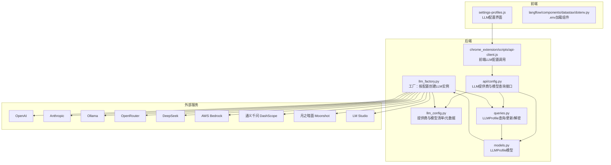
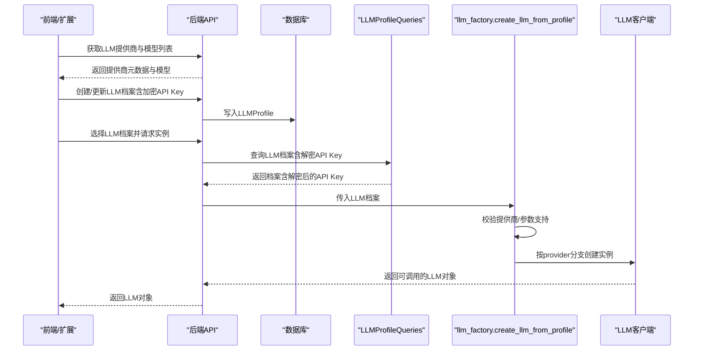
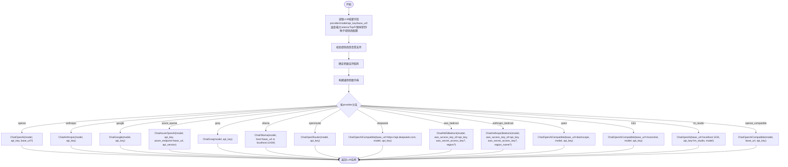
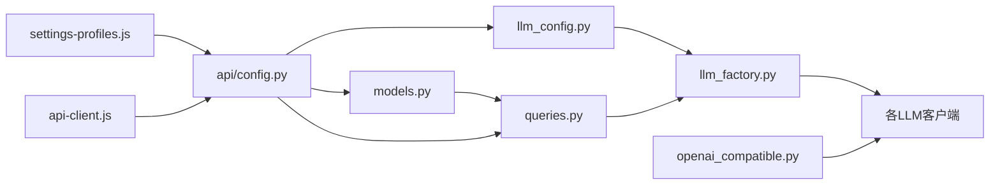

# LLM配置

<cite>
**本文引用的文件列表**
- [llm_factory.py](file://vibe_surf/backend/utils/llm_factory.py)
- [llm_config.py](file://vibe_surf/backend/llm_config.py)
- [llm_profiles.py](file://vibe_surf/workflows/VibeSurf/llm_profiles.py)
- [models.py](file://vibe_surf/backend/database/models.py)
- [queries.py](file://vibe_surf/backend/database/queries.py)
- [config.py](file://vibe_surf/backend/api/config.py)
- [openai_compatible.py](file://vibe_surf/llm/openai_compatible.py)
- [.env.example](file://.env.example)
- [api-client.js](file://vibe_surf/chrome_extension/scripts/api-client.js)
- [settings-profiles.js](file://vibe_surf/chrome_extension/scripts/settings-profiles.js)
- [utils.py](file://vibe_surf/backend/utils/utils.py)
- [langflow_language_model.py](file://vibe_surf/langflow/components/models/language_model.py)
- [langflow_openai_chat_model.py](file://vibe_surf/langflow/components/openai/openai_chat_model.py)
- [langflow_dotenv.py](file://vibe_surf/langflow/components/datastax/dotenv.py)
- [langflow_settings_manager.py](file://vibe_surf/langflow/services/settings/manager.py)
- [langflow_database_service.py](file://vibe_surf/langflow/services/database/service.py)
</cite>

## 目录
1. [简介](#简介)
2. [项目结构与定位](#项目结构与定位)
3. [核心组件](#核心组件)
4. [架构总览](#架构总览)
5. [详细组件分析](#详细组件分析)
6. [依赖关系分析](#依赖关系分析)
7. [性能与可靠性配置](#性能与可靠性配置)
8. [故障排查与常见问题](#故障排查与常见问题)
9. [结论](#结论)
10. [附录：配置清单与最佳实践](#附录配置清单与最佳实践)

## 简介
本文件面向需要在vibesurf中配置与使用多种LLM提供商（OpenAI、Anthropic、Ollama、OpenRouter、DeepSeek、AWS Bedrock、LM Studio、阿里通义千问/Qwen、月之暗面/Kimi等）的用户与开发者，系统化说明：
- 如何为不同提供商配置API密钥、基础URL与模型名称
- llm_factory.py中的工厂模式如何根据配置动态创建LLM实例
- 本地LLM（Ollama、自定义OpenAI兼容API）的配置步骤
- 性能优化（连接池、超时、重试）与安全配置（加密存储、环境变量）
- 配置验证与常见问题解决

## 项目结构与定位
vibesurf通过“配置即数据”的方式管理LLM提供商：所有提供商、模型、元数据与参数支持均集中于后端配置模块；运行时通过数据库中的LLM配置档案（含加密API Key）由工厂动态创建具体LLM实例。

图表来源
- [llm_factory.py](file://vibe_surf/backend/utils/llm_factory.py#L23-L216)
- [llm_config.py](file://vibe_surf/backend/llm_config.py#L1-L226)
- [models.py](file://vibe_surf/backend/database/models.py#L57-L93)
- [queries.py](file://vibe_surf/backend/database/queries.py#L21-L200)
- [config.py](file://vibe_surf/backend/api/config.py#L585-L642)
- [api-client.js](file://vibe_surf/chrome_extension/scripts/api-client.js#L345-L367)
- [settings-profiles.js](file://vibe_surf/chrome_extension/scripts/settings-profiles.js#L252-L278)

章节来源
- [llm_factory.py](file://vibe_surf/backend/utils/llm_factory.py#L23-L216)
- [llm_config.py](file://vibe_surf/backend/llm_config.py#L1-L226)
- [models.py](file://vibe_surf/backend/database/models.py#L57-L93)
- [queries.py](file://vibe_surf/backend/database/queries.py#L21-L200)
- [config.py](file://vibe_surf/backend/api/config.py#L585-L642)
- [api-client.js](file://vibe_surf/chrome_extension/scripts/api-client.js#L345-L367)
- [settings-profiles.js](file://vibe_surf/chrome_extension/scripts/settings-profiles.js#L252-L278)

## 核心组件
- LLM配置中心：集中定义支持的提供商、默认模型、是否需要API Key或Base URL、是否支持工具/视觉等元数据。
- 工厂：根据LLMProfile（含加密API Key）与提供商元数据，动态构造对应LLM客户端。
- 数据模型与查询：LLMProfile表结构、加密API Key、参数字段与查询/更新逻辑。
- API接口：提供可用提供商、模型列表与元数据查询，供前端与Langflow组件使用。
- 前端与扩展：LLM配置界面与扩展脚本用于创建/更新LLM档案并调用后端接口。
- 兼容层：OpenAI兼容模型封装，自动修复特定模型（如Gemini、Kimi、Qwen）的响应格式与Schema限制。

章节来源
- [llm_config.py](file://vibe_surf/backend/llm_config.py#L1-L226)
- [llm_factory.py](file://vibe_surf/backend/utils/llm_factory.py#L23-L216)
- [models.py](file://vibe_surf/backend/database/models.py#L57-L93)
- [queries.py](file://vibe_surf/backend/database/queries.py#L21-L200)
- [config.py](file://vibe_surf/backend/api/config.py#L585-L642)
- [openai_compatible.py](file://vibe_surf/llm/openai_compatible.py#L63-L373)

## 架构总览
工厂模式实现要点：
- 输入：LLMProfile（包含provider、model、base_url、api_key、温度、最大tokens等）
- 校验：先校验提供商是否受支持，并依据元数据判断是否必须提供API Key或Base URL
- 参数映射：根据提供商支持能力，构建通用参数字典（temperature、max_tokens、top_p、frequency_penalty、seed等）
- 实例化：按provider分支创建对应LLM客户端（OpenAI、Anthropic、Google、Azure OpenAI、Groq、Ollama、OpenRouter、DeepSeek、AWS Bedrock、Anthropic Bedrock、OpenAI Compatible/Qwen/Kimi/LM Studio等）

图表来源
- [config.py](file://vibe_surf/backend/api/config.py#L585-L642)
- [queries.py](file://vibe_surf/backend/database/queries.py#L110-L139)
- [llm_factory.py](file://vibe_surf/backend/utils/llm_factory.py#L23-L216)

章节来源
- [llm_factory.py](file://vibe_surf/backend/utils/llm_factory.py#L23-L216)
- [queries.py](file://vibe_surf/backend/database/queries.py#L110-L139)
- [config.py](file://vibe_surf/backend/api/config.py#L585-L642)

## 详细组件分析

### LLM工厂：create_llm_from_profile
- 支持的提供商：openai、anthropic、google、azure_openai、groq、ollama、openrouter、deepseek、aws_bedrock、anthropic_bedrock、openai_compatible、qwen、kimi、lm_studio
- 参数支持矩阵：不同提供商对temperature、max_tokens、top_p、frequency_penalty、seed的支持不同
- 特殊处理：
  - Azure OpenAI：必须提供base_url（作为azure_endpoint），固定api_version
  - Ollama：若未提供base_url，默认使用本地11434端口
  - OpenAI Compatible：必须提供base_url
  - AWS Bedrock/Anthropic Bedrock：使用aws_access_key_id，支持从provider_config注入aws_secret_access_key与region
  - Qwen/Kimi：通过OpenAI兼容封装，自动修正Schema与响应格式
  - LM Studio：默认base_url指向本地1234端点，api_key设为lm_studio
- 错误处理：捕获异常并记录日志，抛出运行时错误

图表来源
- [llm_factory.py](file://vibe_surf/backend/utils/llm_factory.py#L23-L216)

章节来源
- [llm_factory.py](file://vibe_surf/backend/utils/llm_factory.py#L23-L216)

### LLM配置中心：llm_config.py
- 提供商与模型：集中维护各提供商支持的模型列表
- 元数据：每个提供商的显示名、是否需要API Key、是否需要Base URL、是否支持工具/视觉、默认模型、默认Base URL等
- 查询接口：获取支持的提供商、某提供商模型列表、元数据、默认模型

章节来源
- [llm_config.py](file://vibe_surf/backend/llm_config.py#L1-L226)

### 数据模型与查询：LLMProfile
- 字段：profile_name、provider、model、base_url、encrypted_api_key、温度/最大tokens/TopP/频率惩罚/种子、provider_config、描述、is_active/is_default、时间戳
- 查询：创建、按名获取、带解密API Key获取、列表、更新（含加密API Key处理）

章节来源
- [models.py](file://vibe_surf/backend/database/models.py#L57-L93)
- [queries.py](file://vibe_surf/backend/database/queries.py#L21-L200)

### API接口：LLM提供商与模型
- GET /llm/providers：返回所有提供商及其元数据、默认模型、默认Base URL
- GET /llm/providers/{provider_name}/models：返回指定提供商的模型列表与元数据

章节来源
- [config.py](file://vibe_surf/backend/api/config.py#L585-L642)

### 前端与扩展：LLM配置界面与调用
- settings-profiles.js：提供LLM配置表单（API Key、Base URL、Temperature、Max Tokens等），并调用后端接口创建/更新LLM档案
- api-client.js：封装LLM档案的增删改查与列表接口

章节来源
- [settings-profiles.js](file://vibe_surf/chrome_extension/scripts/settings-profiles.js#L252-L278)
- [api-client.js](file://vibe_surf/chrome_extension/scripts/api-client.js#L345-L367)

### OpenAI兼容封装：ChatOpenAICompatible
- 自动识别模型类型（Gemini、Kimi/Moonshot、Qwen、DeepSeek），应用相应Schema修复与响应格式处理
- 支持添加Schema到系统提示以提升结构化输出稳定性
- 统一异常处理，将第三方错误映射为统一的ModelProviderError

章节来源
- [openai_compatible.py](file://vibe_surf/llm/openai_compatible.py#L63-L373)

### Langflow集成与环境变量
- langflow/components/models/language_model.py：根据provider动态设置模型选项与API Key字段显示
- langflow/components/openai/openai_chat_model.py：针对OpenAI推理模型隐藏不适用参数
- langflow/components/datastax/dotenv.py：将.env内容加载到环境变量
- langflow/services/settings/manager.py：从YAML加载设置并校验键名
- langflow/services/database/service.py：数据库引擎创建带重试的连接

章节来源
- [langflow_language_model.py](file://vibe_surf/langflow/components/models/language_model.py#L124-L144)
- [langflow_openai_chat_model.py](file://vibe_surf/langflow/components/openai/openai_chat_model.py#L125-L158)
- [langflow_dotenv.py](file://vibe_surf/langflow/components/datastax/dotenv.py#L1-L35)
- [langflow_settings_manager.py](file://vibe_surf/langflow/services/settings/manager.py#L1-L49)
- [langflow_database_service.py](file://vibe_surf/langflow/services/database/service.py#L137-L162)

## 依赖关系分析
- 工厂依赖配置中心与数据库查询，查询负责解密API Key
- API接口依赖配置中心与数据库模型/查询
- 前端/扩展通过API接口与数据库交互
- 兼容封装依赖浏览器用LLM库与Schema优化器

图表来源
- [llm_factory.py](file://vibe_surf/backend/utils/llm_factory.py#L23-L216)
- [llm_config.py](file://vibe_surf/backend/llm_config.py#L1-L226)
- [models.py](file://vibe_surf/backend/database/models.py#L57-L93)
- [queries.py](file://vibe_surf/backend/database/queries.py#L21-L200)
- [config.py](file://vibe_surf/backend/api/config.py#L585-L642)
- [openai_compatible.py](file://vibe_surf/llm/openai_compatible.py#L63-L373)

章节来源
- [llm_factory.py](file://vibe_surf/backend/utils/llm_factory.py#L23-L216)
- [llm_config.py](file://vibe_surf/backend/llm_config.py#L1-L226)
- [models.py](file://vibe_surf/backend/database/models.py#L57-L93)
- [queries.py](file://vibe_surf/backend/database/queries.py#L21-L200)
- [config.py](file://vibe_surf/backend/api/config.py#L585-L642)
- [openai_compatible.py](file://vibe_surf/llm/openai_compatible.py#L63-L373)

## 性能与可靠性配置
- 连接池与超时（数据库侧参考Langflow数据库服务）：
  - pool_size、max_overflow、pool_timeout、pool_pre_ping、pool_recycle等参数可按高并发场景调整
  - SQLite与PostgreSQL的连接参数差异已在服务中区分处理
- LLM调用侧重试：
  - Langflow数据库服务在创建引擎时内置重试装饰器，可借鉴到网络请求侧
  - 对于第三方LLM调用，可在业务层增加指数退避重试（例如基于速率限制返回码）
- 超时与代理：
  - utils.configure_system_proxies会自动检测系统代理并设置HTTP_PROXY/HTTPS_PROXY/no_proxy
  - 可结合LLM客户端的httpx超时参数控制请求超时
- 代理与网络：
  - .env.example中提供OPENAI_ENDPOINT、ANTHROPIC_ENDPOINT、OLLAMA_ENDPOINT等示例，便于统一管理
- 日志与可观测性：
  - 工厂与兼容封装均使用统一logger，便于集中收集与分析

章节来源
- [utils.py](file://vibe_surf/backend/utils/utils.py#L1-L42)
- [langflow_database_service.py](file://vibe_surf/langflow/services/database/service.py#L137-L162)
- [.env.example](file://.env.example#L1-L55)

## 故障排查与常见问题
- “不支持的提供商”
  - 现象：创建LLM实例时报错“Unsupported provider”
  - 排查：确认provider是否在配置中心支持列表中
  - 参考：工厂校验与配置中心支持列表
- “缺少API Key”
  - 现象：报错要求提供API Key
  - 排查：检查提供商元数据requires_api_key，确认已正确保存至LLMProfile且数据库查询返回解密后的值
  - 参考：工厂参数校验与查询解密流程
- “缺少Base URL”
  - 现象：Azure OpenAI或OpenAI Compatible报错要求提供base_url
  - 排查：Azure OpenAI需提供azure_endpoint（即base_url）；OpenAI Compatible必须提供base_url
  - 参考：工厂分支逻辑
- “Ollama无法连接”
  - 现象：连接失败或超时
  - 排查：若未提供base_url，默认使用http://localhost:11434；确认Ollama服务已启动并可访问
  - 参考：工厂Ollama分支默认host
- “结构化输出解析失败”
  - 现象：兼容封装在解析JSON时失败
  - 排查：兼容封装内置JSON修复逻辑；若仍失败，检查模型是否支持响应格式或Schema是否被正确修正
  - 参考：兼容封装异常处理与Schema修复
- “前端配置无效”
  - 现象：LLM配置界面保存后未生效
  - 排查：确认前端调用LLM档案接口成功；检查后端日志与数据库记录
  - 参考：前端api-client.js与settings-profiles.js

章节来源
- [llm_factory.py](file://vibe_surf/backend/utils/llm_factory.py#L23-L216)
- [queries.py](file://vibe_surf/backend/database/queries.py#L110-L139)
- [openai_compatible.py](file://vibe_surf/llm/openai_compatible.py#L341-L373)
- [api-client.js](file://vibe_surf/chrome_extension/scripts/api-client.js#L345-L367)
- [settings-profiles.js](file://vibe_surf/chrome_extension/scripts/settings-profiles.js#L252-L278)

## 结论
vibesurf通过“配置即数据”的设计，将LLM提供商、模型与参数支持集中在配置中心，配合工厂模式与数据库加密存储，实现了灵活、可扩展、安全的多提供商LLM接入方案。通过统一的API与前端界面，用户可以便捷地切换与管理不同提供商的LLM实例，同时兼容层保证了跨模型的结构化输出稳定性。

## 附录：配置清单与最佳实践

### 配置文件格式与环境变量
- .env示例字段（部分）
  - OPENAI_ENDPOINT、OPENAI_API_KEY
  - ANTHROPIC_ENDPOINT、ANTHROPIC_API_KEY
  - GOOGLE_API_KEY
  - AZURE_OPENAI_ENDPOINT、AZURE_OPENAI_API_KEY、AZURE_OPENAI_API_VERSION
  - DEEPSEEK_ENDPOINT、DEEPSEEK_API_KEY
  - MISTRAL_API_KEY、MISTRAL_ENDPOINT
  - OLLAMA_ENDPOINT
  - DASHSCOPE_ENDPOINT、DASHSCOPE_API_KEY
  - MOONSHOT_ENDPOINT、MOONSHOT_API_KEY
  - UNBOUND_ENDPOINT、UNBOUND_API_KEY
  - SiliconFLOW_ENDPOINT、SiliconFLOW_API_KEY
  - ANONYMIZED_TELEMETRY、BROWSER_USE_LOGGING_LEVEL、BROWSER_USE_CALCULATE_COST
  - VIBESURF_*（后端端口、工作空间、数据库URL、调试开关等）
  - BROWSER_EXECUTION_PATH、BROWSER_USER_DATA
  - COMPOSIO_API_KEY
- 加载方式
  - 项目启动时自动加载根目录.env
  - Langflow组件提供直接加载.env内容的能力
  - 设置管理器支持从YAML加载配置并校验键名

章节来源
- [.env.example](file://.env.example#L1-L55)
- [langflow_dotenv.py](file://vibe_surf/langflow/components/datastax/dotenv.py#L1-L35)
- [langflow_settings_manager.py](file://vibe_surf/langflow/services/settings/manager.py#L1-L49)

### 各提供商配置要点
- OpenAI
  - 必填：provider=openai、model、api_key
  - 可选：base_url（可覆盖默认端点）、temperature/max_tokens/top_p/frequency_penalty/seed
- Anthropic
  - 必填：provider=anthropic、model、api_key
  - 可选：temperature等
- Google Gemini
  - 必填：provider=google、model、api_key
  - 可选：temperature等
- Azure OpenAI
  - 必填：provider=azure_openai、model、api_key、base_url（即azure_endpoint）
  - 固定api_version
- Groq
  - 必填：provider=groq、model、api_key
  - 可选：temperature等
- Ollama
  - 必填：provider=ollama、model
  - 可选：base_url（默认localhost:11434）
  - 可选：temperature等
- OpenRouter
  - 必填：provider=openrouter、model、api_key
  - 可选：temperature等
- DeepSeek
  - 必填：provider=deepseek、model、api_key
  - base_url固定为https://api.deepseek.com
- AWS Bedrock
  - 必填：provider=aws_bedrock、model、api_key（aws_access_key_id）
  - 可选：aws_secret_access_key、aws_region（默认us-east-1）
- Anthropic via AWS Bedrock
  - 必填：provider=anthropic_bedrock、model、api_key（aws_access_key_id）
  - 可选：aws_secret_access_key、region_name
- OpenAI Compatible
  - 必填：provider=openai_compatible、model、api_key、base_url
  - 可选：temperature/max_tokens等
- Qwen（DashScope）
  - 必填：provider=qwen、model、api_key
  - base_url固定为https://dashscope.aliyuncs.com/compatible-mode/v1（可被传入base_url覆盖）
- Kimi（Moonshot）
  - 必填：provider=kimi、model、api_key
  - base_url固定为https://api.moonshot.cn/v1（可被传入base_url覆盖）
- LM Studio
  - 必填：provider=lm_studio、model
  - base_url默认http://localhost:1234/v1
  - api_key固定为lm_studio

章节来源
- [llm_factory.py](file://vibe_surf/backend/utils/llm_factory.py#L84-L216)
- [llm_config.py](file://vibe_surf/backend/llm_config.py#L83-L199)

### 本地LLM配置指南
- Ollama
  - 步骤：安装Ollama并拉取所需模型；在LLM档案中设置provider=ollama、model=你的模型名；可选设置base_url为Ollama服务地址（默认localhost:11434）
  - 参考：工厂Ollama分支与默认host
- 自定义OpenAI兼容API
  - 步骤：在LLM档案中设置provider=openai_compatible、model=你的模型名、base_url=你的兼容端点、api_key=你的密钥
  - 参考：工厂OpenAI Compatible分支

章节来源
- [llm_factory.py](file://vibe_surf/backend/utils/llm_factory.py#L126-L135)
- [llm_factory.py](file://vibe_surf/backend/utils/llm_factory.py#L204-L212)

### 配置验证与安全
- 配置验证
  - 工厂提供validate_llm_configuration与get_llm_creation_parameters，可校验必填项与参数支持
  - API提供/llm/providers与/llm/providers/{provider_name}/models，前端可据此动态展示
- 安全
  - API Key在数据库中加密存储，查询时解密返回
  - 响应模型不包含敏感字段
- 前端
  - settings-profiles.js提供表单字段与帮助文案
  - api-client.js封装LLM档案管理接口

章节来源
- [llm_factory.py](file://vibe_surf/backend/utils/llm_factory.py#L222-L275)
- [config.py](file://vibe_surf/backend/api/config.py#L585-L642)
- [models.py](file://vibe_surf/backend/database/models.py#L57-L93)
- [queries.py](file://vibe_surf/backend/database/queries.py#L110-L139)
- [settings-profiles.js](file://vibe_surf/chrome_extension/scripts/settings-profiles.js#L252-L278)
- [api-client.js](file://vibe_surf/chrome_extension/scripts/api-client.js#L345-L367)