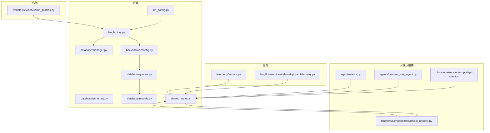
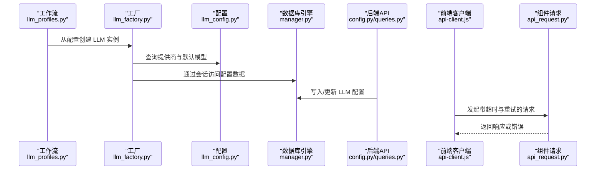
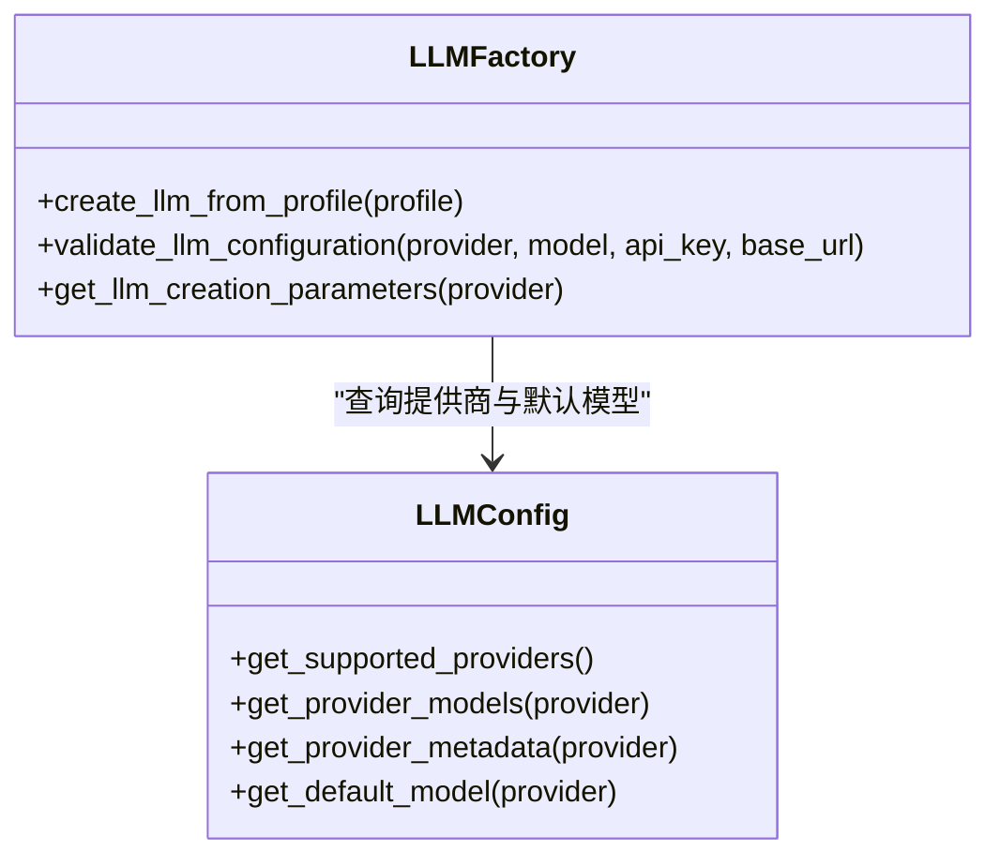
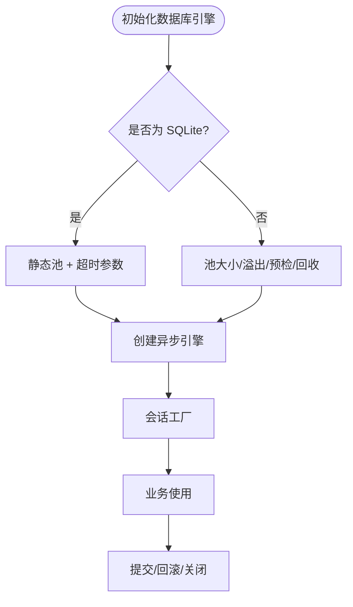
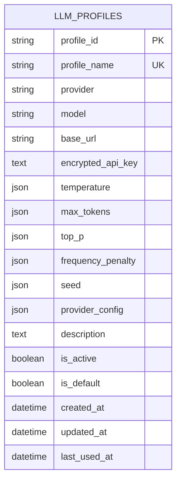
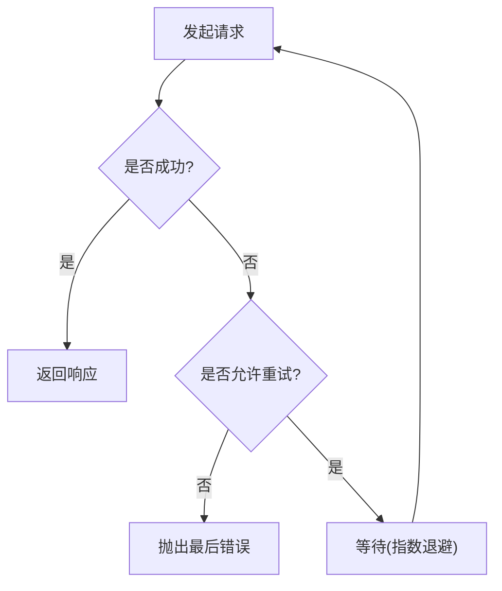
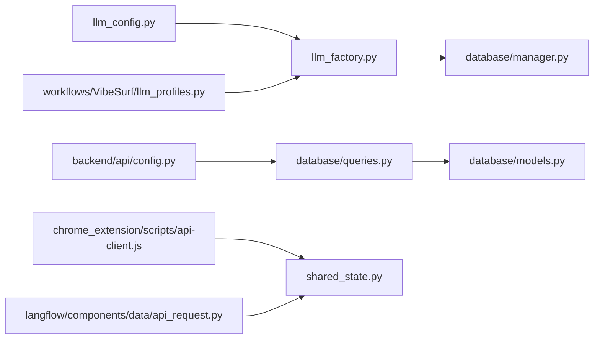

# 性能优化配置

<cite>
**本文引用的文件**
- [llm_config.py](file://vibe_surf/backend/llm_config.py)
- [llm_factory.py](file://vibe_surf/backend/utils/llm_factory.py)
- [shared_state.py](file://vibe_surf/backend/shared_state.py)
- [manager.py](file://vibe_surf/backend/database/manager.py)
- [schemas.py](file://vibe_surf/backend/database/schemas.py)
- [models.py](file://vibe_surf/backend/database/models.py)
- [config.py](file://vibe_surf/backend/api/config.py)
- [queries.py](file://vibe_surf/backend/database/queries.py)
- [llm_profiles.py](file://vibe_surf/workflows/VibeSurf/llm_profiles.py)
- [api-client.js](file://vibe_surf/chrome_extension/scripts/api-client.js)
- [opentelemetry.py](file://vibe_surf/langflow/services/telemetry/opentelemetry.py)
- [service.py](file://vibe_surf/telemetry/service.py)
- [api_request.py](file://vibe_surf/langflow/components/data/api_request.py)
- [browser_use_agent.py](file://vibe_surf/agents/browser_use_agent.py)
- [views.py](file://vibe_surf/agents/views.py)
</cite>

## 目录
1. [简介](#简介)
2. [项目结构](#项目结构)
3. [核心组件](#核心组件)
4. [架构总览](#架构总览)
5. [详细组件分析](#详细组件分析)
6. [依赖关系分析](#依赖关系分析)
7. [性能考量与调优建议](#性能考量与调优建议)
8. [故障排查指南](#故障排查指南)
9. [结论](#结论)
10. [附录](#附录)

## 简介
本文件聚焦于LLM性能优化配置，围绕连接池、超时设置与重试策略展开，结合代码库中的实际实现，给出可操作的配置方法与调优建议。内容涵盖：
- 在 llm_config.py 中如何定义与查询 LLM 提供商与模型信息
- 在 llm_factory.py 中如何基于配置创建 LLM 实例（含参数传递）
- 连接池与超时在数据库层与外部 HTTP 请求中的使用现状
- 重试策略在前端 API 客户端与部分组件中的应用
- 不同场景下的性能调优建议与监控指标配置思路

## 项目结构
与 LLM 性能优化相关的关键模块分布如下：
- 配置与工厂：backend/llm_config.py、backend/utils/llm_factory.py
- 数据库连接池：backend/database/manager.py
- LLM 配置模型与查询：backend/database/schemas.py、backend/database/models.py、backend/api/config.py、backend/database/queries.py
- 工作流集成：workflows/VibeSurf/llm_profiles.py
- 外部请求与重试：chrome_extension/scripts/api-client.js、langflow/components/data/api_request.py
- 超时示例：agents/browser_use_agent.py、agents/views.py
- 监控与遥测：langflow/services/telemetry/opentelemetry.py、telemetry/service.py

图表来源
- [llm_config.py](file://vibe_surf/backend/llm_config.py#L1-L226)
- [llm_factory.py](file://vibe_surf/backend/utils/llm_factory.py#L1-L275)
- [manager.py](file://vibe_surf/backend/database/manager.py#L160-L201)
- [schemas.py](file://vibe_surf/backend/database/schemas.py#L40-L100)
- [models.py](file://vibe_surf/backend/database/models.py#L57-L92)
- [config.py](file://vibe_surf/backend/api/config.py#L77-L139)
- [queries.py](file://vibe_surf/backend/database/queries.py#L62-L90)
- [llm_profiles.py](file://vibe_surf/workflows/VibeSurf/llm_profiles.py#L1-L104)
- [api-client.js](file://vibe_surf/chrome_extension/scripts/api-client.js#L1-L136)
- [api_request.py](file://vibe_surf/langflow/components/data/api_request.py#L279-L405)
- [browser_use_agent.py](file://vibe_surf/agents/browser_use_agent.py#L134-L207)
- [views.py](file://vibe_surf/agents/views.py#L70-L71)
- [opentelemetry.py](file://vibe_surf/langflow/services/telemetry/opentelemetry.py#L108-L253)
- [service.py](file://vibe_surf/telemetry/service.py#L1-L114)

章节来源
- [llm_config.py](file://vibe_surf/backend/llm_config.py#L1-L226)
- [llm_factory.py](file://vibe_surf/backend/utils/llm_factory.py#L1-L275)
- [manager.py](file://vibe_surf/backend/database/manager.py#L160-L201)
- [schemas.py](file://vibe_surf/backend/database/schemas.py#L40-L100)
- [models.py](file://vibe_surf/backend/database/models.py#L57-L92)
- [config.py](file://vibe_surf/backend/api/config.py#L77-L139)
- [queries.py](file://vibe_surf/backend/database/queries.py#L62-L90)
- [llm_profiles.py](file://vibe_surf/workflows/VibeSurf/llm_profiles.py#L1-L104)
- [api-client.js](file://vibe_surf/chrome_extension/scripts/api-client.js#L1-L136)
- [api_request.py](file://vibe_surf/langflow/components/data/api_request.py#L279-L405)
- [browser_use_agent.py](file://vibe_surf/agents/browser_use_agent.py#L134-L207)
- [views.py](file://vibe_surf/agents/views.py#L70-L71)
- [opentelemetry.py](file://vibe_surf/langflow/services/telemetry/opentelemetry.py#L108-L253)
- [service.py](file://vibe_surf/telemetry/service.py#L1-L114)

## 核心组件
- LLM 提供商与默认模型配置：集中定义在 llm_config.py，便于统一维护与查询。
- LLM 实例工厂：根据配置动态创建对应提供商的聊天模型实例，支持温度、最大令牌数、采样参数等传递。
- 数据库连接池：SQLite 使用静态池与超时；生产数据库使用可配置的池大小、溢出、预检与回收策略。
- LLM 配置模型与 API：通过数据库模型与 API 接口管理 LLM 配置，支持加密存储与默认配置。
- 前端重试与超时：浏览器扩展 API 客户端内置重试与超时控制；组件层也有短超时示例。
- 监控与遥测：OpenTelemetry 与 PostHog 遥测服务可用于采集性能指标与异常事件。

章节来源
- [llm_config.py](file://vibe_surf/backend/llm_config.py#L1-L226)
- [llm_factory.py](file://vibe_surf/backend/utils/llm_factory.py#L1-L275)
- [manager.py](file://vibe_surf/backend/database/manager.py#L160-L201)
- [schemas.py](file://vibe_surf/backend/database/schemas.py#L40-L100)
- [models.py](file://vibe_surf/backend/database/models.py#L57-L92)
- [config.py](file://vibe_surf/backend/api/config.py#L77-L139)
- [queries.py](file://vibe_surf/backend/database/queries.py#L62-L90)
- [api-client.js](file://vibe_surf/chrome_extension/scripts/api-client.js#L1-L136)
- [opentelemetry.py](file://vibe_surf/langflow/services/telemetry/opentelemetry.py#L108-L253)
- [service.py](file://vibe_surf/telemetry/service.py#L1-L114)

## 架构总览
下图展示 LLM 配置到实例创建、数据库连接池、外部请求与重试的整体流程。

图表来源
- [llm_profiles.py](file://vibe_surf/workflows/VibeSurf/llm_profiles.py#L89-L104)
- [llm_factory.py](file://vibe_surf/backend/utils/llm_factory.py#L23-L216)
- [llm_config.py](file://vibe_surf/backend/llm_config.py#L202-L226)
- [manager.py](file://vibe_surf/backend/database/manager.py#L160-L201)
- [config.py](file://vibe_surf/backend/api/config.py#L77-L139)
- [queries.py](file://vibe_surf/backend/database/queries.py#L62-L90)
- [api-client.js](file://vibe_surf/chrome_extension/scripts/api-client.js#L1-L136)
- [api_request.py](file://vibe_surf/langflow/components/data/api_request.py#L279-L405)

## 详细组件分析

### LLM 配置与工厂
- llm_config.py 提供：
  - 支持的提供商列表与默认模型
  - 提供商元数据（是否需要 API Key、是否支持 base_url 等）
  - 查询函数：获取提供商列表、模型列表、元数据、默认模型
- llm_factory.py 提供：
  - 从 LLMProfile 创建具体 LLM 实例
  - 参数支持按提供商差异处理（如 temperature、max_tokens、top_p、frequency_penalty、seed）
  - 对 Azure OpenAI、AWS Bedrock、OpenAI 兼容等特殊参数进行适配
  - 统一的日志记录与错误处理

图表来源
- [llm_config.py](file://vibe_surf/backend/llm_config.py#L202-L226)
- [llm_factory.py](file://vibe_surf/backend/utils/llm_factory.py#L23-L275)

章节来源
- [llm_config.py](file://vibe_surf/backend/llm_config.py#L1-L226)
- [llm_factory.py](file://vibe_surf/backend/utils/llm_factory.py#L1-L275)

### 数据库连接池与超时
- SQLite 开发环境：使用静态连接池与超时参数，适合单机开发测试。
- 生产数据库（非 SQLite）：使用可配置的连接池大小、溢出、预检与回收策略，提升并发与稳定性。
- 会话管理：统一的异步会话工厂，自动提交/回滚/关闭，避免资源泄漏。

图表来源
- [manager.py](file://vibe_surf/backend/database/manager.py#L160-L201)

章节来源
- [manager.py](file://vibe_surf/backend/database/manager.py#L160-L201)

### LLM 配置模型与 API
- 模型字段覆盖温度、最大令牌数、采样参数、提供商与 base_url、提供商特定配置等。
- API 提供创建与更新接口，支持唯一性约束与默认配置逻辑。
- 查询层返回标准化的配置字典，便于工作流使用。

图表来源
- [models.py](file://vibe_surf/backend/database/models.py#L57-L92)
- [schemas.py](file://vibe_surf/backend/database/schemas.py#L40-L100)
- [config.py](file://vibe_surf/backend/api/config.py#L77-L139)
- [queries.py](file://vibe_surf/backend/database/queries.py#L62-L90)

章节来源
- [models.py](file://vibe_surf/backend/database/models.py#L57-L92)
- [schemas.py](file://vibe_surf/backend/database/schemas.py#L40-L100)
- [config.py](file://vibe_surf/backend/api/config.py#L77-L139)
- [queries.py](file://vibe_surf/backend/database/queries.py#L62-L90)

### 前端重试与超时
- 浏览器扩展 API 客户端内置：
  - 默认超时、重试次数与延迟
  - 基于指数退避的等待策略
  - 对特定错误类型（如 4xx、LLM 连接失败）不重试
- 组件层的 HTTP 请求组件也支持超时参数与错误处理。

图表来源
- [api-client.js](file://vibe_surf/chrome_extension/scripts/api-client.js#L1-L136)
- [api_request.py](file://vibe_surf/langflow/components/data/api_request.py#L279-L405)

章节来源
- [api-client.js](file://vibe_surf/chrome_extension/scripts/api-client.js#L1-L136)
- [api_request.py](file://vibe_surf/langflow/components/data/api_request.py#L279-L405)

### 超时设置示例
- 代理层与视图层存在显式的超时常量，用于控制 LLM 调用与步骤执行的时限。
- 后端 API 层使用 httpx.AsyncClient 并设置超时。

章节来源
- [browser_use_agent.py](file://vibe_surf/agents/browser_use_agent.py#L134-L207)
- [views.py](file://vibe_surf/agents/views.py#L70-L71)
- [shared_state.py](file://vibe_surf/backend/shared_state.py#L944-L955)

## 依赖关系分析
- llm_factory 依赖 llm_config 的提供商与默认模型信息，确保创建实例时参数合法。
- 工作流通过 llm_profiles 从数据库加载配置并交由工厂创建实例。
- 数据库引擎由 manager 统一创建，供 API 与查询层使用。
- 前端与组件通过 httpx 客户端发起请求，内部实现超时与重试。

图表来源
- [llm_config.py](file://vibe_surf/backend/llm_config.py#L1-L226)
- [llm_factory.py](file://vibe_surf/backend/utils/llm_factory.py#L1-L275)
- [manager.py](file://vibe_surf/backend/database/manager.py#L160-L201)
- [config.py](file://vibe_surf/backend/api/config.py#L77-L139)
- [queries.py](file://vibe_surf/backend/database/queries.py#L62-L90)
- [models.py](file://vibe_surf/backend/database/models.py#L57-L92)
- [llm_profiles.py](file://vibe_surf/workflows/VibeSurf/llm_profiles.py#L1-L104)
- [api-client.js](file://vibe_surf/chrome_extension/scripts/api-client.js#L1-L136)
- [api_request.py](file://vibe_surf/langflow/components/data/api_request.py#L279-L405)

章节来源
- [llm_config.py](file://vibe_surf/backend/llm_config.py#L1-L226)
- [llm_factory.py](file://vibe_surf/backend/utils/llm_factory.py#L1-L275)
- [manager.py](file://vibe_surf/backend/database/manager.py#L160-L201)
- [config.py](file://vibe_surf/backend/api/config.py#L77-L139)
- [queries.py](file://vibe_surf/backend/database/queries.py#L62-L90)
- [models.py](file://vibe_surf/backend/database/models.py#L57-L92)
- [llm_profiles.py](file://vibe_surf/workflows/VibeSurf/llm_profiles.py#L1-L104)
- [api-client.js](file://vibe_surf/chrome_extension/scripts/api-client.js#L1-L136)
- [api_request.py](file://vibe_surf/langflow/components/data/api_request.py#L279-L405)

## 性能考量与调优建议

### 1) 连接池配置
- SQLite 开发环境：已使用静态池与超时参数，适合本地开发。
- 生产数据库：已启用池大小、溢出、预检与回收策略，建议结合实际并发与数据库承载能力进行微调。
- 建议：
  - 根据并发请求数设置 pool_size，溢出值用于突发流量缓冲
  - pool_pre_ping 提升连接可用性，减少失效连接导致的失败
  - pool_recycle 控制连接生命周期，避免长时间占用造成资源泄漏

章节来源
- [manager.py](file://vibe_surf/backend/database/manager.py#L160-L201)

### 2) 超时设置
- 代理与视图层存在明确的超时常量，用于控制 LLM 调用与步骤执行时间。
- 后端 API 层使用 httpx.AsyncClient 设置超时，避免阻塞。
- 建议：
  - 将超时参数从硬编码迁移到配置中心，便于按环境与场景动态调整
  - 对长耗时任务拆分步骤，并为每个步骤设置独立超时阈值
  - 对网络不稳定场景，适当提高超时但配合重试策略使用

章节来源
- [browser_use_agent.py](file://vibe_surf/agents/browser_use_agent.py#L134-L207)
- [views.py](file://vibe_surf/agents/views.py#L70-L71)
- [shared_state.py](file://vibe_surf/backend/shared_state.py#L944-L955)

### 3) 重试策略
- 浏览器扩展 API 客户端实现了指数退避重试，并对特定错误类型（4xx、LLM 连接失败）不重试。
- 组件层的 HTTP 请求组件支持超时参数与错误处理。
- 建议：
  - 对瞬时网络波动采用指数退避，避免雪崩效应
  - 明确区分可重试与不可重试错误，避免无效重试
  - 结合熔断与限流，防止级联故障

章节来源
- [api-client.js](file://vibe_surf/chrome_extension/scripts/api-client.js#L1-L136)
- [api_request.py](file://vibe_surf/langflow/components/data/api_request.py#L279-L405)

### 4) LLM 参数与实例创建
- 工厂按提供商差异传递参数（如 temperature、max_tokens），确保参数合法性与一致性。
- 建议：
  - 将温度、最大令牌数等参数纳入配置模型，便于统一管理
  - 对 OpenAI 兼容类提供商，明确 base_url 与认证方式
  - 对 AWS Bedrock 等需要额外凭据的提供商，确保配置项齐全

章节来源
- [llm_factory.py](file://vibe_surf/backend/utils/llm_factory.py#L23-L216)
- [llm_config.py](file://vibe_surf/backend/llm_config.py#L1-L226)

### 5) 监控与指标
- OpenTelemetry 提供计数器、直方图等指标注册与观测能力，可扩展用于 LLM 调用耗时、错误率等。
- PostHog 遥测服务可用于异常事件与用户行为追踪。
- 建议：
  - 为 LLM 调用建立直方图指标，记录响应时间分布
  - 记录错误类型与重试次数，辅助定位问题
  - 将关键指标导出至 Prometheus，结合告警策略

章节来源
- [opentelemetry.py](file://vibe_surf/langflow/services/telemetry/opentelemetry.py#L108-L253)
- [service.py](file://vibe_surf/telemetry/service.py#L1-L114)

## 故障排查指南
- LLM 实例创建失败
  - 检查提供商是否受支持、模型是否存在、API Key 是否正确
  - 参考工厂的校验与错误日志输出路径
- 数据库连接问题
  - SQLite：确认超时参数与静态池配置
  - 生产库：检查池大小、溢出、预检与回收策略是否合理
- 前端请求失败
  - 查看重试次数与延迟是否过低或过高
  - 区分 4xx 与 5xx 错误，避免对前者进行无意义重试
- 超时与重试联动
  - 若超时过短且重试频繁，可能导致资源耗尽
  - 若超时过长且重试间隔不合理，可能放大故障影响

章节来源
- [llm_factory.py](file://vibe_surf/backend/utils/llm_factory.py#L222-L275)
- [manager.py](file://vibe_surf/backend/database/manager.py#L160-L201)
- [api-client.js](file://vibe_surf/chrome_extension/scripts/api-client.js#L1-L136)

## 结论
本项目在 LLM 性能优化方面具备良好的基础：提供了统一的提供商配置与实例工厂、生产数据库的连接池策略、前端重试与超时控制，以及可观测性的基础设施。建议进一步将超时与重试参数配置化、完善 LLM 调用指标采集，并结合实际负载进行池大小与超时阈值的迭代优化。

## 附录

### A. 在 llm_config.py 中的配置要点
- 提供商列表与默认模型：便于统一管理与查询
- 提供商元数据：是否需要 API Key、是否支持 base_url 等，用于工厂参数构建

章节来源
- [llm_config.py](file://vibe_surf/backend/llm_config.py#L1-L226)

### B. 在 llm_factory.py 中的连接池与实例创建
- 参数支持按提供商差异处理，确保温度、最大令牌数等参数合法
- 对 Azure OpenAI、AWS Bedrock、OpenAI 兼容等特殊参数进行适配
- 统一日志与错误处理，便于定位问题

章节来源
- [llm_factory.py](file://vibe_surf/backend/utils/llm_factory.py#L23-L216)

### C. 数据库连接池与超时
- SQLite：静态池 + 超时
- 生产库：池大小、溢出、预检、回收
- 会话工厂：自动提交/回滚/关闭

章节来源
- [manager.py](file://vibe_surf/backend/database/manager.py#L160-L201)

### D. 前端重试与超时
- 默认超时、重试次数与延迟
- 指数退避与错误分类（4xx、LLM 连接失败不重试）

章节来源
- [api-client.js](file://vibe_surf/chrome_extension/scripts/api-client.js#L1-L136)

### E. 监控与遥测
- OpenTelemetry 指标注册与观测
- PostHog 异常与事件采集

章节来源
- [opentelemetry.py](file://vibe_surf/langflow/services/telemetry/opentelemetry.py#L108-L253)
- [service.py](file://vibe_surf/telemetry/service.py#L1-L114)