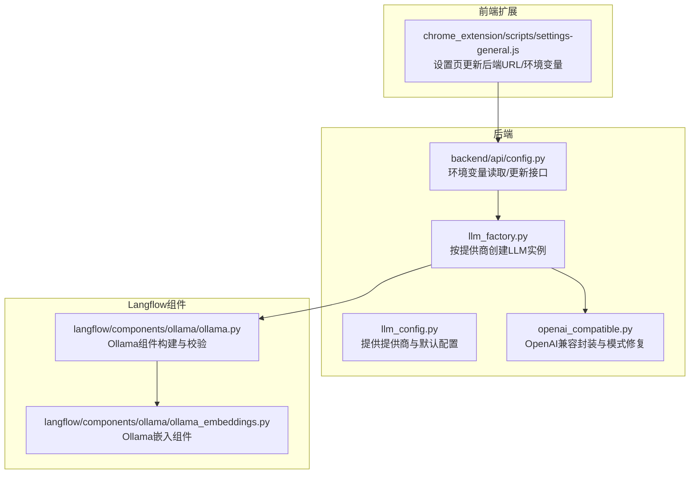
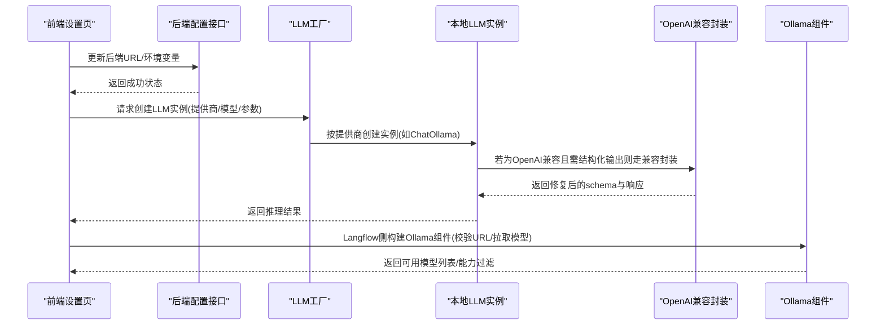
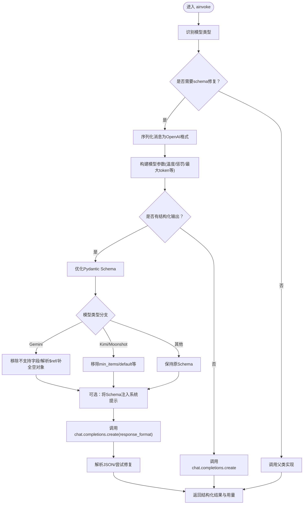
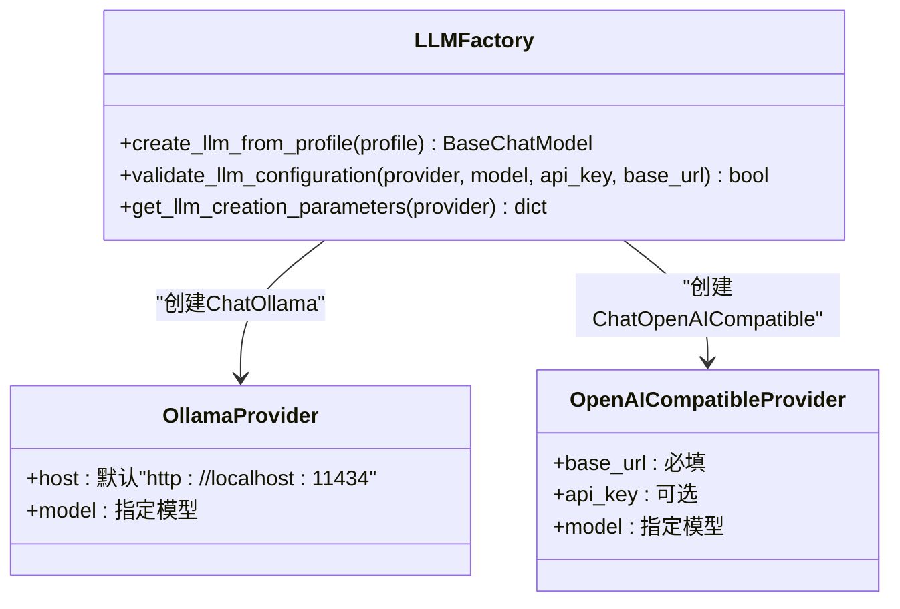
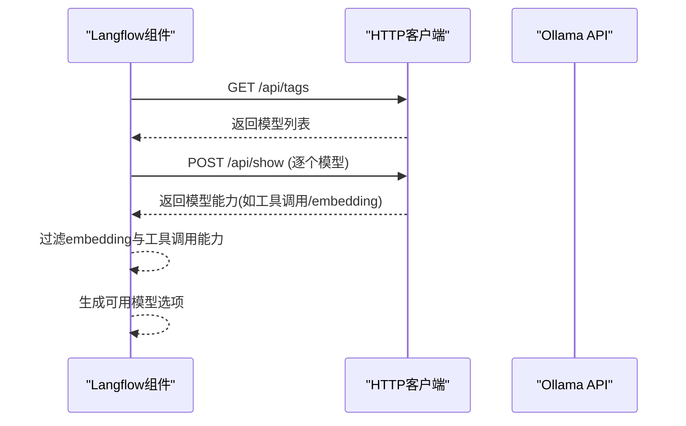
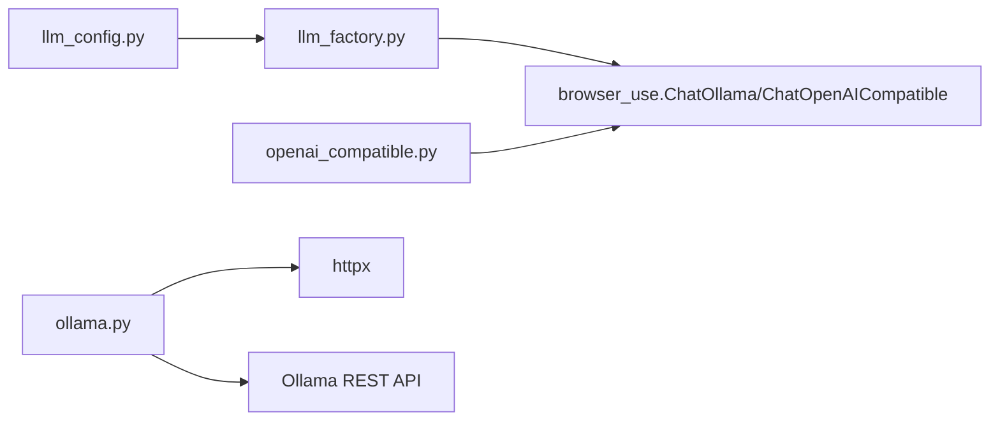

# 本地LLM支持

<cite>
**本文引用的文件**
- [vibe_surf/backend/llm_config.py](file://vibe_surf/backend/llm_config.py)
- [vibe_surf/backend/utils/llm_factory.py](file://vibe_surf/backend/utils/llm_factory.py)
- [vibe_surf/llm/openai_compatible.py](file://vibe_surf/llm/openai_compatible.py)
- [vibe_surf/langflow/components/ollama/ollama.py](file://vibe_surf/langflow/components/ollama/ollama.py)
- [vibe_surf/langflow/components/ollama/ollama_embeddings.py](file://vibe_surf/langflow/components/ollama/ollama_embeddings.py)
- [vibe_surf/backend/api/config.py](file://vibe_surf/backend/api/config.py)
- [vibe_surf/chrome_extension/scripts/settings-general.js](file://vibe_surf/chrome_extension/scripts/settings-general.js)
- [README.md](file://README.md)
</cite>

## 目录
1. [简介](#简介)
2. [项目结构](#项目结构)
3. [核心组件](#核心组件)
4. [架构总览](#架构总览)
5. [详细组件分析](#详细组件分析)
6. [依赖关系分析](#依赖关系分析)
7. [性能考虑](#性能考虑)
8. [故障排查指南](#故障排查指南)
9. [结论](#结论)
10. [附录](#附录)

## 简介
本支持文档聚焦于如何在本项目中配置与使用本地LLM（尤其是Ollama）及其它兼容OpenAI API的本地LLM服务。内容涵盖：
- 如何通过配置文件与工厂类选择并实例化本地LLM；
- openai_compatible.py中OpenAI兼容接口的实现机制与适配策略；
- Ollama的安装、启动、基础URL与模型管理方法；
- 在llm_config.py中配置本地LLM的基础URL与认证信息；
- 性能调优建议（GPU内存、批处理等）与常见连接问题的解决方案。

## 项目结构
围绕本地LLM支持的关键目录与文件如下：
- 后端配置与工厂：vibe_surf/backend/llm_config.py、vibe_surf/backend/utils/llm_factory.py
- OpenAI兼容封装：vibe_surf/llm/openai_compatible.py
- Langflow中的Ollama组件：vibe_surf/langflow/components/ollama/ollama.py、ollama_embeddings.py
- 配置与环境变量：vibe_surf/backend/api/config.py、vibe_surf/chrome_extension/scripts/settings-general.js
- 项目说明：README.md

图表来源
- [vibe_surf/backend/llm_config.py](file://vibe_surf/backend/llm_config.py#L1-L226)
- [vibe_surf/backend/utils/llm_factory.py](file://vibe_surf/backend/utils/llm_factory.py#L1-L275)
- [vibe_surf/llm/openai_compatible.py](file://vibe_surf/llm/openai_compatible.py#L1-L373)
- [vibe_surf/langflow/components/ollama/ollama.py](file://vibe_surf/langflow/components/ollama/ollama.py#L185-L330)
- [vibe_surf/langflow/components/ollama/ollama_embeddings.py](file://vibe_surf/langflow/components/ollama/ollama_embeddings.py#L41-L83)
- [vibe_surf/backend/api/config.py](file://vibe_surf/backend/api/config.py#L690-L762)
- [vibe_surf/chrome_extension/scripts/settings-general.js](file://vibe_surf/chrome_extension/scripts/settings-general.js#L306-L389)

章节来源
- [vibe_surf/backend/llm_config.py](file://vibe_surf/backend/llm_config.py#L1-L226)
- [vibe_surf/backend/utils/llm_factory.py](file://vibe_surf/backend/utils/llm_factory.py#L1-L275)
- [vibe_surf/llm/openai_compatible.py](file://vibe_surf/llm/openai_compatible.py#L1-L373)
- [vibe_surf/langflow/components/ollama/ollama.py](file://vibe_surf/langflow/components/ollama/ollama.py#L185-L330)
- [vibe_surf/langflow/components/ollama/ollama_embeddings.py](file://vibe_surf/langflow/components/ollama/ollama_embeddings.py#L41-L83)
- [vibe_surf/backend/api/config.py](file://vibe_surf/backend/api/config.py#L690-L762)
- [vibe_surf/chrome_extension/scripts/settings-general.js](file://vibe_surf/chrome_extension/scripts/settings-general.js#L306-L389)
- [README.md](file://README.md#L1-L186)

## 核心组件
- 提供商与默认配置：集中定义了各提供商支持的模型、元数据（是否需要API Key、默认模型、默认base_url等），便于统一管理与查询。
- LLM工厂：根据提供商动态创建对应LLM实例，自动注入温度、最大token、top_p、频率惩罚、种子等参数，并对特殊提供商（如Ollama、OpenAI Compatible）进行差异化处理。
- OpenAI兼容封装：在调用OpenAI兼容API时，针对特定模型（如Gemini、Kimi/Moonshot、Qwen、DeepSeek）自动应用schema修复与响应格式处理，确保输出符合预期。
- Ollama组件：在Langflow侧提供ChatOllama与OllamaEmbeddings组件，负责校验Ollama可用性、拉取模型列表、过滤工具调用能力等。
- 配置与环境变量：后端提供环境变量读取与更新接口；前端设置页可更新后端地址与环境变量，便于本地调试与部署。

章节来源
- [vibe_surf/backend/llm_config.py](file://vibe_surf/backend/llm_config.py#L1-L226)
- [vibe_surf/backend/utils/llm_factory.py](file://vibe_surf/backend/utils/llm_factory.py#L1-L275)
- [vibe_surf/llm/openai_compatible.py](file://vibe_surf/llm/openai_compatible.py#L1-L373)
- [vibe_surf/langflow/components/ollama/ollama.py](file://vibe_surf/langflow/components/ollama/ollama.py#L185-L330)
- [vibe_surf/langflow/components/ollama/ollama_embeddings.py](file://vibe_surf/langflow/components/ollama/ollama_embeddings.py#L41-L83)
- [vibe_surf/backend/api/config.py](file://vibe_surf/backend/api/config.py#L690-L762)
- [vibe_surf/chrome_extension/scripts/settings-general.js](file://vibe_surf/chrome_extension/scripts/settings-general.js#L306-L389)

## 架构总览
下图展示了从用户配置到本地LLM调用的整体流程，包括OpenAI兼容封装与Ollama组件的协作。

图表来源
- [vibe_surf/backend/utils/llm_factory.py](file://vibe_surf/backend/utils/llm_factory.py#L1-L275)
- [vibe_surf/llm/openai_compatible.py](file://vibe_surf/llm/openai_compatible.py#L1-L373)
- [vibe_surf/langflow/components/ollama/ollama.py](file://vibe_surf/langflow/components/ollama/ollama.py#L185-L330)

## 详细组件分析

### OpenAI兼容封装（openai_compatible.py）
该模块在调用OpenAI兼容API时，针对不同模型类型自动应用schema修复与响应格式处理，确保输出稳定可靠。

- 关键点
  - 模型类型识别：区分Gemini、Kimi/Moonshot、Qwen、DeepSeek等模型。
  - Gemini schema修复：移除不被支持的字段（如additionalProperties、title、default），解析$ref引用，必要时填充占位属性。
  - Kimi/Moonshot schema修复：移除min_items/minItems、在anyOf存在时移除default等限制。
  - 结构化输出：当请求结构化输出时，生成JSON Schema并以response_format或系统提示方式注入，提升解析成功率。
  - 错误处理：捕获速率限制、连接错误、状态错误等，统一包装为ModelProviderError，便于上层处理。

图表来源
- [vibe_surf/llm/openai_compatible.py](file://vibe_surf/llm/openai_compatible.py#L1-L373)

章节来源
- [vibe_surf/llm/openai_compatible.py](file://vibe_surf/llm/openai_compatible.py#L1-L373)

### LLM工厂（llm_factory.py）
该工厂根据提供商动态创建LLM实例，统一处理参数与认证，特别针对Ollama与OpenAI Compatible进行差异化配置。

- 关键点
  - 参数支持矩阵：不同提供商支持的参数不同（如OpenRouter不支持max_tokens），工厂按支持矩阵注入参数。
  - Ollama默认URL：若未提供base_url，则使用默认本地地址。
  - OpenAI Compatible：要求提供base_url，否则抛出错误。
  - 兼容封装：对于某些提供商（如DeepSeek、Kimi、Qwen），使用ChatOpenAICompatible以获得更好的schema修复与结构化输出能力。

图表来源
- [vibe_surf/backend/utils/llm_factory.py](file://vibe_surf/backend/utils/llm_factory.py#L1-L275)

章节来源
- [vibe_surf/backend/utils/llm_factory.py](file://vibe_surf/backend/utils/llm_factory.py#L1-L275)

### Ollama组件（langflow/components/ollama/ollama.py 与 ollama_embeddings.py）
Langflow侧提供了Ollama组件，用于在可视化流程中直接使用本地LLM。

- 关键点
  - URL校验：通过访问/api/tags判断Ollama服务可用性。
  - 模型拉取：调用/api/tags与/api/show获取模型列表与能力，过滤embedding与工具调用能力。
  - 异常提示：连接失败时给出明确提示，引导检查base_url与模型是否已拉取。

图表来源
- [vibe_surf/langflow/components/ollama/ollama.py](file://vibe_surf/langflow/components/ollama/ollama.py#L185-L330)
- [vibe_surf/langflow/components/ollama/ollama_embeddings.py](file://vibe_surf/langflow/components/ollama/ollama_embeddings.py#L41-L83)

章节来源
- [vibe_surf/langflow/components/ollama/ollama.py](file://vibe_surf/langflow/components/ollama/ollama.py#L185-L330)
- [vibe_surf/langflow/components/ollama/ollama_embeddings.py](file://vibe_surf/langflow/components/ollama/ollama_embeddings.py#L41-L83)

### 配置与环境变量（后端API与前端设置页）
- 后端提供环境变量读取与更新接口，便于在运行时调整代理、密钥等。
- 前端设置页允许用户更新后端URL与环境变量，便于本地调试与部署。

章节来源
- [vibe_surf/backend/api/config.py](file://vibe_surf/backend/api/config.py#L690-L762)
- [vibe_surf/chrome_extension/scripts/settings-general.js](file://vibe_surf/chrome_extension/scripts/settings-general.js#L306-L389)

## 依赖关系分析
- llm_config.py提供提供商清单与默认配置，被llm_factory.py与前端设置页共同使用。
- llm_factory.py依赖browser_use提供的ChatOllama、ChatOpenAICompatible等类，按提供商创建实例。
- openai_compatible.py基于browser_use的ChatOpenAI扩展，增加schema修复与结构化输出能力。
- Langflow的ollama组件依赖httpx访问Ollama REST API，完成模型列表与能力查询。

图表来源
- [vibe_surf/backend/llm_config.py](file://vibe_surf/backend/llm_config.py#L1-L226)
- [vibe_surf/backend/utils/llm_factory.py](file://vibe_surf/backend/utils/llm_factory.py#L1-L275)
- [vibe_surf/llm/openai_compatible.py](file://vibe_surf/llm/openai_compatible.py#L1-L373)
- [vibe_surf/langflow/components/ollama/ollama.py](file://vibe_surf/langflow/components/ollama/ollama.py#L185-L330)

章节来源
- [vibe_surf/backend/llm_config.py](file://vibe_surf/backend/llm_config.py#L1-L226)
- [vibe_surf/backend/utils/llm_factory.py](file://vibe_surf/backend/utils/llm_factory.py#L1-L275)
- [vibe_surf/llm/openai_compatible.py](file://vibe_surf/llm/openai_compatible.py#L1-L373)
- [vibe_surf/langflow/components/ollama/ollama.py](file://vibe_surf/langflow/components/ollama/ollama.py#L185-L330)

## 性能考虑
- GPU内存与批处理
  - Ollama侧可通过模型大小与量化策略控制显存占用；在Langflow侧可结合批量执行组件进行异步批处理，减少重复初始化开销。
  - 对于结构化输出场景，OpenAI兼容封装会进行schema修复与JSON修复，建议在保证准确性的前提下尽量缩小schema范围，降低解析成本。
- 并发与重试
  - 后端与Langflow均支持异步与并发执行，合理设置超时与重试策略，避免单点阻塞。
- 代理与网络
  - 使用后端环境变量接口配置HTTP/HTTPS代理与no_proxy，有助于在受限网络环境下稳定访问本地服务。

[本节为通用指导，无需列出具体文件来源]

## 故障排查指南
- 无法连接Ollama
  - 现象：组件提示无法连接Ollama API。
  - 排查：确认Ollama服务已启动，访问/api/tags返回200；检查base_url是否正确；确保目标模型已拉取。
  - 参考路径：Langflow Ollama组件的URL校验与异常提示逻辑。
- 无有效Ollama URL
  - 现象：无法找到可用的Ollama URL。
  - 排查：组件会尝试多个候选URL，若都不可用，请手动指定正确的本地或远程Ollama地址。
- OpenAI Compatible缺少base_url
  - 现象：创建实例时报错要求提供base_url。
  - 排查：在llm_config.py中为openai_compatible配置base_url，或在工厂创建时传入。
- 结构化输出解析失败
  - 现象：模型返回的JSON格式不符合schema导致解析失败。
  - 处理：OpenAI兼容封装会尝试修复JSON；建议简化schema或在系统提示中明确输出格式。
- 后端URL或环境变量无效
  - 现象：前端设置页保存后端URL或环境变量失败。
  - 排查：检查后端接口返回状态码与日志；确认前端输入格式合法（URL格式校验）。

章节来源
- [vibe_surf/langflow/components/ollama/ollama.py](file://vibe_surf/langflow/components/ollama/ollama.py#L185-L330)
- [vibe_surf/backend/utils/llm_factory.py](file://vibe_surf/backend/utils/llm_factory.py#L204-L212)
- [vibe_surf/llm/openai_compatible.py](file://vibe_surf/llm/openai_compatible.py#L341-L373)
- [vibe_surf/backend/api/config.py](file://vibe_surf/backend/api/config.py#L690-L762)
- [vibe_surf/chrome_extension/scripts/settings-general.js](file://vibe_surf/chrome_extension/scripts/settings-general.js#L306-L389)

## 结论
本项目通过集中化的提供商配置、灵活的LLM工厂与OpenAI兼容封装，实现了对本地LLM（尤其是Ollama）的无缝集成。Langflow侧的Ollama组件进一步降低了在可视化流程中使用本地LLM的门槛。配合后端环境变量与前端设置页，用户可以快速完成本地LLM的安装、配置与调试。

[本节为总结性内容，无需列出具体文件来源]

## 附录

### 如何配置本地LLM的基础URL与认证信息
- llm_config.py
  - 提供提供商清单与默认配置，包括默认base_url（如Ollama默认http://localhost:11434）、是否需要API Key等。
  - 可通过该文件扩展新的提供商或修改默认值。
- llm_factory.py
  - 当provider为“ollama”时，若未提供base_url，默认使用本地Ollama地址。
  - 当provider为“openai_compatible”时，必须提供base_url。
- 后端环境变量接口
  - 提供/get与/put接口读取与更新环境变量，可用于设置代理、密钥等。
- 前端设置页
  - 支持更新后端URL与环境变量，便于本地开发与调试。

章节来源
- [vibe_surf/backend/llm_config.py](file://vibe_surf/backend/llm_config.py#L125-L133)
- [vibe_surf/backend/utils/llm_factory.py](file://vibe_surf/backend/utils/llm_factory.py#L126-L135)
- [vibe_surf/backend/utils/llm_factory.py](file://vibe_surf/backend/utils/llm_factory.py#L204-L212)
- [vibe_surf/backend/api/config.py](file://vibe_surf/backend/api/config.py#L690-L762)
- [vibe_surf/chrome_extension/scripts/settings-general.js](file://vibe_surf/chrome_extension/scripts/settings-general.js#L306-L389)

### Ollama安装、启动与模型管理
- 安装与启动
  - 请参考官方文档进行安装与启动（本仓库未包含Ollama安装脚本）。
- 基础URL
  - 默认本地地址为http://localhost:11434；可在llm_factory.py中覆盖，或在Langflow组件中通过base_url参数指定。
- 模型管理
  - 通过/api/tags与/api/show查询模型列表与能力，Langflow组件会过滤embedding与工具调用能力，仅展示适合对话的模型。
  - 若出现“无法获取模型名”的提示，请检查Ollama服务状态与模型是否已拉取。

章节来源
- [vibe_surf/backend/utils/llm_factory.py](file://vibe_surf/backend/utils/llm_factory.py#L126-L135)
- [vibe_surf/langflow/components/ollama/ollama.py](file://vibe_surf/langflow/components/ollama/ollama.py#L271-L330)
- [vibe_surf/langflow/components/ollama/ollama_embeddings.py](file://vibe_surf/langflow/components/ollama/ollama_embeddings.py#L41-L83)

### OpenAI兼容接口实现机制
- 模型类型识别与schema修复
  - 针对Gemini、Kimi/Moonshot、Qwen、DeepSeek分别应用不同的schema修复策略。
- 结构化输出
  - 自动注入response_format或系统提示，提升JSON解析成功率。
- 错误处理
  - 统一捕获速率限制、连接与状态错误，转换为ModelProviderError，便于上层处理。

章节来源
- [vibe_surf/llm/openai_compatible.py](file://vibe_surf/llm/openai_compatible.py#L1-L373)

### 项目背景与隐私优先
- README中强调支持本地LLM（如Ollama）与自定义LLM API，确保浏览数据在本地LLM上处理，保护隐私与安全。

章节来源
- [README.md](file://README.md#L20-L24)