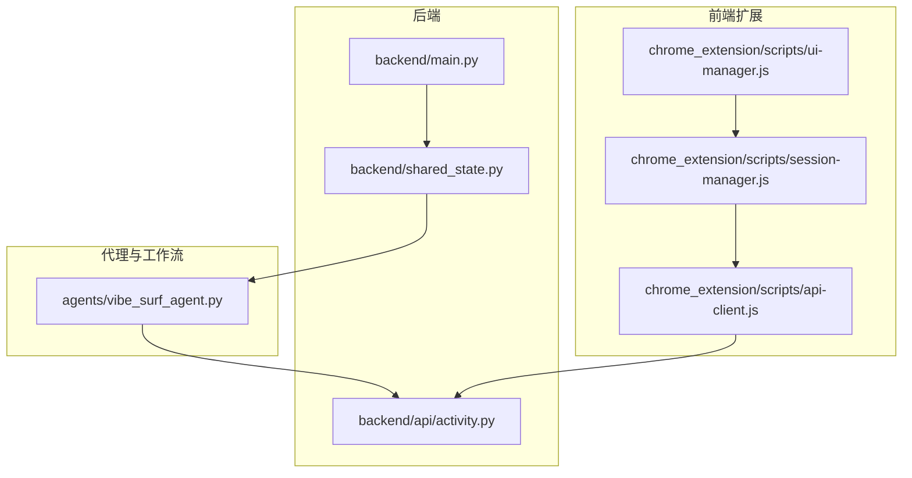
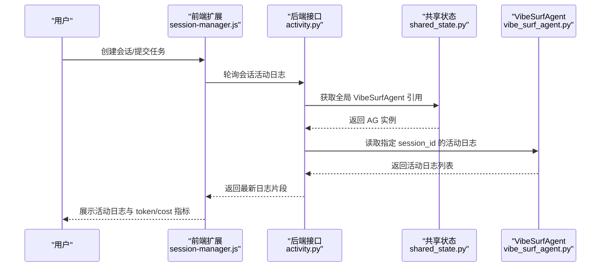
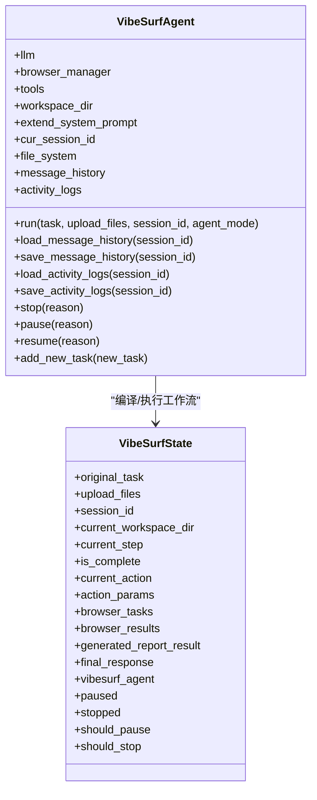
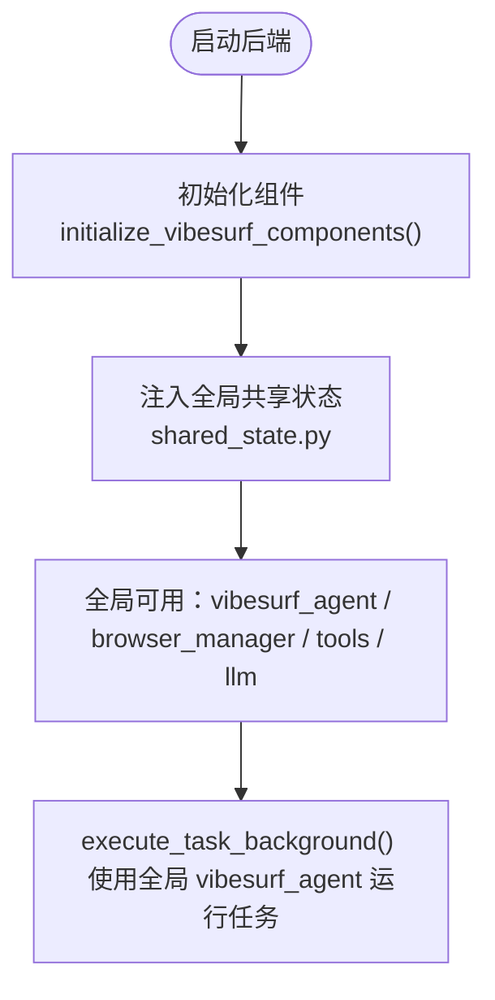
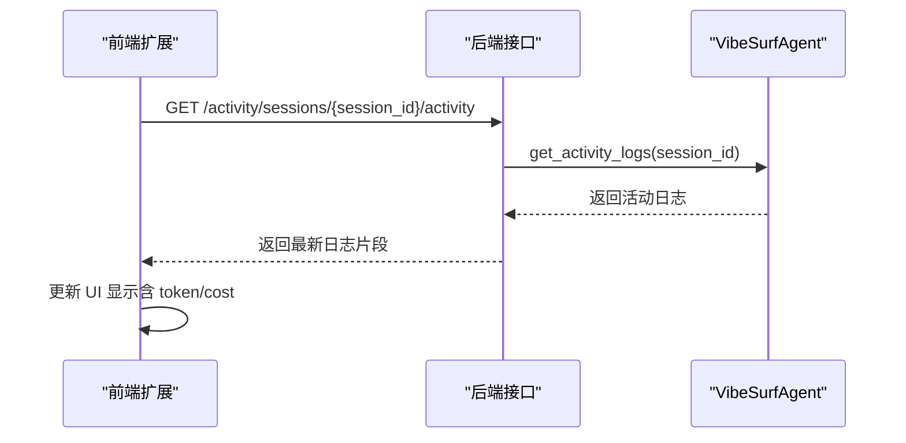
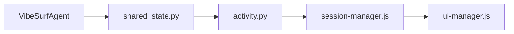

# 上下文管理

<cite>
**本文引用的文件**
- [vibe_surf/agents/vibe_surf_agent.py](file://vibe_surf/agents/vibe_surf_agent.py)
- [vibe_surf/backend/shared_state.py](file://vibe_surf/backend/shared_state.py)
- [vibe_surf/backend/api/activity.py](file://vibe_surf/backend/api/activity.py)
- [vibe_surf/chrome_extension/scripts/session-manager.js](file://vibe_surf/chrome_extension/scripts/session-manager.js)
- [vibe_surf/chrome_extension/scripts/api-client.js](file://vibe_surf/chrome_extension/scripts/api-client.js)
- [vibe_surf/chrome_extension/scripts/ui-manager.js](file://vibe_surf/chrome_extension/scripts/ui-manager.js)
</cite>

## 目录
1. [简介](#简介)
2. [项目结构](#项目结构)
3. [核心组件](#核心组件)
4. [架构总览](#架构总览)
5. [详细组件分析](#详细组件分析)
6. [依赖关系分析](#依赖关系分析)
7. [性能考量](#性能考量)
8. [故障排查指南](#故障排查指南)
9. [结论](#结论)
10. [附录](#附录)

## 简介
本文件围绕 vibe_surf_agent.py 中的对话上下文维护机制展开，系统性阐述如何通过 VibeSurfAgent 的消息历史与活动日志实现多轮对话的上下文管理；说明如何借助 shared_state.py 提供的全局状态与会话隔离能力，支撑多任务并行执行时的上下文隔离；解释上下文窗口大小控制与关键信息提取策略；描述上下文切换（会话）机制与最佳实践（敏感信息过滤、上下文过期策略、性能优化建议）。为便于理解，文档同时给出与前端扩展交互的端到端流程图示与序列图。

## 项目结构
与上下文管理直接相关的模块分布如下：
- 后端主入口与共享状态：backend/main.py、backend/shared_state.py
- 前端扩展：chrome_extension/scripts 下的 session-manager.js、api-client.js、ui-manager.js
- 活动日志接口：backend/api/activity.py
- 主代理与工作流：agents/vibe_surf_agent.py

图表来源
- [vibe_surf/backend/shared_state.py](file://vibe_surf/backend/shared_state.py#L37-L45)
- [vibe_surf/backend/api/activity.py](file://vibe_surf/backend/api/activity.py#L154-L200)
- [vibe_surf/chrome_extension/scripts/session-manager.js](file://vibe_surf/chrome_extension/scripts/session-manager.js#L52-L120)
- [vibe_surf/chrome_extension/scripts/api-client.js](file://vibe_surf/chrome_extension/scripts/api-client.js#L236-L271)
- [vibe_surf/chrome_extension/scripts/ui-manager.js](file://vibe_surf/chrome_extension/scripts/ui-manager.js#L1788-L1828)
- [vibe_surf/agents/vibe_surf_agent.py](file://vibe_surf/agents/vibe_surf_agent.py#L1041-L1120)

章节来源
- [vibe_surf/backend/shared_state.py](file://vibe_surf/backend/shared_state.py#L37-L45)
- [vibe_surf/backend/api/activity.py](file://vibe_surf/backend/api/activity.py#L154-L200)
- [vibe_surf/chrome_extension/scripts/session-manager.js](file://vibe_surf/chrome_extension/scripts/session-manager.js#L52-L120)
- [vibe_surf/chrome_extension/scripts/api-client.js](file://vibe_surf/chrome_extension/scripts/api-client.js#L236-L271)
- [vibe_surf/chrome_extension/scripts/ui-manager.js](file://vibe_surf/chrome_extension/scripts/ui-manager.js#L1788-L1828)
- [vibe_surf/agents/vibe_surf_agent.py](file://vibe_surf/agents/vibe_surf_agent.py#L1041-L1120)

## 核心组件
- VibeSurfAgent：负责消息历史、活动日志、会话加载/保存、控制暂停/恢复/停止、并行子代理协调。
- SharedState（全局变量）：集中存放浏览器管理器、工具集、LLM 实例等，支持跨路由与后台任务访问。
- 活动日志接口：提供按会话拉取实时活动日志的能力，供前端扩展轮询展示。
- 前端 SessionManager：负责会话创建、任务提交、轮询活动日志、暂停/恢复/停止任务并与后端同步。

章节来源
- [vibe_surf/agents/vibe_surf_agent.py](file://vibe_surf/agents/vibe_surf_agent.py#L1041-L1120)
- [vibe_surf/backend/shared_state.py](file://vibe_surf/backend/shared_state.py#L37-L45)
- [vibe_surf/backend/api/activity.py](file://vibe_surf/backend/api/activity.py#L154-L200)
- [vibe_surf/chrome_extension/scripts/session-manager.js](file://vibe_surf/chrome_extension/scripts/session-manager.js#L52-L120)

## 架构总览
下图展示了从用户发起任务到前端轮询显示的完整路径，以及上下文在各层之间的传递与持久化。

图表来源
- [vibe_surf/backend/api/activity.py](file://vibe_surf/backend/api/activity.py#L154-L200)
- [vibe_surf/backend/shared_state.py](file://vibe_surf/backend/shared_state.py#L37-L45)
- [vibe_surf/agents/vibe_surf_agent.py](file://vibe_surf/agents/vibe_surf_agent.py#L1041-L1120)
- [vibe_surf/chrome_extension/scripts/session-manager.js](file://vibe_surf/chrome_extension/scripts/session-manager.js#L453-L510)
- [vibe_surf/chrome_extension/scripts/ui-manager.js](file://vibe_surf/chrome_extension/scripts/ui-manager.js#L1788-L1828)

## 详细组件分析

### 1) VibeSurfAgent 的上下文存储与会话切换
- 消息历史（message_history）：以列表形式维护，包含 SystemMessage/UserMessage/AssistantMessage 等类型，用于后续 LLM 推理。
- 活动日志（activity_logs）：记录每个步骤的“思考/动作/结果/错误”等信息，便于前端展示与审计。
- 会话加载/保存：
  - 加载：根据 session_id 定位工作区下的 sessions/<session_id>/ 目录，读取 message_history.pkl 与 activity_logs.pkl。
  - 保存：同理写入对应会话目录，实现上下文持久化。
- 控制信号：支持 stop/pause/resume，通过状态字段与锁保护，确保节点执行前后的状态一致性。
- 并行子代理：运行期间动态注册/注销子代理，统一纳入控制队列，避免上下文污染。

图表来源
- [vibe_surf/agents/vibe_surf_agent.py](file://vibe_surf/agents/vibe_surf_agent.py#L1041-L1120)
- [vibe_surf/agents/vibe_surf_agent.py](file://vibe_surf/agents/vibe_surf_agent.py#L94-L130)

章节来源
- [vibe_surf/agents/vibe_surf_agent.py](file://vibe_surf/agents/vibe_surf_agent.py#L1041-L1120)
- [vibe_surf/agents/vibe_surf_agent.py](file://vibe_surf/agents/vibe_surf_agent.py#L94-L130)

### 2) shared_state.py 的全局状态与组件注入
- 全局变量：vibesurf_agent、browser_manager、vibesurf_tools、llm、db_manager、schedule_manager 等。
- 初始化：在 backend/main.py 中调用 initialize_vibesurf_components，完成数据库、LLM、浏览器会话、工具集初始化，并将实例注入全局共享状态。
- 后台任务：execute_task_background 使用全局 vibesurf_agent 执行单任务，保证跨路由/任务的一致性。

图表来源
- [vibe_surf/backend/shared_state.py](file://vibe_surf/backend/shared_state.py#L556-L598)
- [vibe_surf/backend/shared_state.py](file://vibe_surf/backend/shared_state.py#L118-L174)

章节来源
- [vibe_surf/backend/shared_state.py](file://vibe_surf/backend/shared_state.py#L556-L598)
- [vibe_surf/backend/shared_state.py](file://vibe_surf/backend/shared_state.py#L118-L174)

### 3) 活动日志接口与前端轮询
- 接口：/activity/sessions/{session_id}/activity 支持按索引或全量获取活动日志。
- 前端：session-manager.js 负责创建会话、提交任务、轮询新日志、处理暂停/恢复/停止事件，并与 ui-manager.js 协作渲染 token/cost 指标。

图表来源
- [vibe_surf/backend/api/activity.py](file://vibe_surf/backend/api/activity.py#L154-L200)
- [vibe_surf/chrome_extension/scripts/session-manager.js](file://vibe_surf/chrome_extension/scripts/session-manager.js#L453-L510)
- [vibe_surf/chrome_extension/scripts/ui-manager.js](file://vibe_surf/chrome_extension/scripts/ui-manager.js#L1788-L1828)

章节来源
- [vibe_surf/backend/api/activity.py](file://vibe_surf/backend/api/activity.py#L154-L200)
- [vibe_surf/chrome_extension/scripts/session-manager.js](file://vibe_surf/chrome_extension/scripts/session-manager.js#L453-L510)
- [vibe_surf/chrome_extension/scripts/ui-manager.js](file://vibe_surf/chrome_extension/scripts/ui-manager.js#L1788-L1828)

### 4) 上下文窗口大小控制与关键信息提取
- 上下文窗口大小：当前代码未显式对 message_history 做截断或窗口大小限制。若需控制，可在消息历史追加前进行裁剪或摘要。
- 关键信息提取策略：
  - 浏览器标签页信息、当前活动标签、上一轮浏览器任务结果、生成报告状态等作为“上下文信息”拼接进 UserMessage，供 LLM 决策使用。
  - 日志层面：log_agent_activity 将“思考/动作/结果/错误”等结构化内容写入 activity_logs，便于前端展示与审计。

章节来源
- [vibe_surf/agents/vibe_surf_agent.py](file://vibe_surf/agents/vibe_surf_agent.py#L352-L544)
- [vibe_surf/agents/vibe_surf_agent.py](file://vibe_surf/agents/vibe_surf_agent.py#L193-L213)

### 5) 上下文切换机制（多会话/多任务隔离）
- 会话隔离：VibeSurfAgent.run 在切换 session_id 时，会加载该会话的消息历史与活动日志，创建独立工作区目录，确保不同会话互不干扰。
- 多任务并行：browser_task_execution_node 支持并行执行多个浏览器任务，每个子代理拥有独立工作目录与回调，避免上下文串扰。
- 控制一致性：通过 _current_state 字段与锁保护，确保暂停/恢复/停止在节点级生效。

章节来源
- [vibe_surf/agents/vibe_surf_agent.py](file://vibe_surf/agents/vibe_surf_agent.py#L1591-L1720)
- [vibe_surf/agents/vibe_surf_agent.py](file://vibe_surf/agents/vibe_surf_agent.py#L548-L605)

## 依赖关系分析
- 组件耦合：
  - VibeSurfAgent 依赖 shared_state 中的全局 LLM/browser_manager/tools，从而在后台任务与路由中保持一致。
  - 前端扩展通过 api-client.js 与后端接口通信，由 activity.py 读取 VibeSurfAgent 的活动日志。
- 可能的循环依赖：
  - shared_state.py 导入 VibeSurfAgent 类型，但通过字符串延迟导入避免循环。
- 外部依赖：
  - FastAPI、SQLAlchemy、TokenCost（用于统计 token 与成本）。

图表来源
- [vibe_surf/backend/shared_state.py](file://vibe_surf/backend/shared_state.py#L21-L33)
- [vibe_surf/backend/api/activity.py](file://vibe_surf/backend/api/activity.py#L154-L200)
- [vibe_surf/chrome_extension/scripts/session-manager.js](file://vibe_surf/chrome_extension/scripts/session-manager.js#L52-L120)

章节来源
- [vibe_surf/backend/shared_state.py](file://vibe_surf/backend/shared_state.py#L21-L33)
- [vibe_surf/backend/api/activity.py](file://vibe_surf/backend/api/activity.py#L154-L200)
- [vibe_surf/chrome_extension/scripts/session-manager.js](file://vibe_surf/chrome_extension/scripts/session-manager.js#L52-L120)

## 性能考量
- 消息历史增长：message_history 会随多轮对话持续增长，建议在消息追加前进行窗口裁剪或摘要，避免超出模型上下文长度。
- I/O 成本：会话级别的 pickle 序列化/反序列化可能成为瓶颈，建议：
  - 对频繁读写的会话采用增量写入策略；
  - 对历史会话启用只读缓存；
  - 在高并发场景下对会话目录加锁或分片。
- 前端轮询：前端以指数退避或基于索引增量拉取可降低带宽与服务器压力。
- Token/Cost 统计：使用 TokenCost 记录 token 与成本，前端可据此提示用户控制上下文长度。

章节来源
- [vibe_surf/agents/vibe_surf_agent.py](file://vibe_surf/agents/vibe_surf_agent.py#L1083-L1120)
- [vibe_surf/agents/vibe_surf_agent.py](file://vibe_surf/agents/vibe_surf_agent.py#L193-L213)
- [vibe_surf/chrome_extension/scripts/session-manager.js](file://vibe_surf/chrome_extension/scripts/session-manager.js#L453-L510)

## 故障排查指南
- 会话未初始化：后端接口返回 503 表示 VibeSurfAgent 未初始化，检查 backend/main.py 的初始化流程。
- 活动日志为空：确认 session_id 是否正确，以及 VibeSurfAgent 是否已加载该会话的历史数据。
- 前端无法轮询：检查 api-client.js 的请求参数与 session-manager.js 的轮询逻辑是否匹配。
- 控制操作无效：确认 _current_state 的 paused/should_pause/stopped 字段是否被正确设置，以及节点包装函数 control_aware_node 是否生效。

章节来源
- [vibe_surf/backend/api/activity.py](file://vibe_surf/backend/api/activity.py#L154-L200)
- [vibe_surf/chrome_extension/scripts/api-client.js](file://vibe_surf/chrome_extension/scripts/api-client.js#L236-L271)
- [vibe_surf/chrome_extension/scripts/session-manager.js](file://vibe_surf/chrome_extension/scripts/session-manager.js#L326-L367)

## 结论
vibe_surf_agent.py 通过 VibeSurfAgent 的消息历史与活动日志实现了多轮对话的上下文维护；借助 shared_state.py 的全局组件注入，保障了后台任务与路由的一致性；前端扩展通过会话与轮询机制，将上下文与 token/cost 指标可视化呈现。当前实现未内置上下文窗口裁剪，建议在消息历史追加前加入窗口控制与关键信息提取策略，以提升稳定性与性能。

## 附录

### 最佳实践清单
- 敏感信息过滤
  - 在构造 UserMessage 与活动日志时，对上传文件路径与内容进行脱敏处理，避免泄露。
  - 对外部链接与文件路径进行绝对化转换时，仅保留必要信息。
- 上下文过期策略
  - 为历史会话设置过期清理任务，定期删除长时间未使用的 sessions/<session_id> 目录。
  - 对超长会话采用归档策略，仅保留关键摘要。
- 上下文窗口控制
  - 在消息历史追加前，按时间/令牌数/消息条数进行裁剪，优先保留最近的思考与关键动作。
- 并行任务隔离
  - 子代理各自独立工作目录与回调，避免共享同一 message_history。
  - 对并行任务的结果进行去重与合并，防止重复上下文污染。
- 性能优化建议
  - 增量写入 pickle 文件，避免大对象频繁序列化。
  - 前端轮询采用基于索引的增量拉取，减少网络与服务器压力。
  - 使用 TokenCost 实时统计 token 与成本，指导用户调整上下文长度。

章节来源
- [vibe_surf/agents/vibe_surf_agent.py](file://vibe_surf/agents/vibe_surf_agent.py#L1591-L1720)
- [vibe_surf/agents/vibe_surf_agent.py](file://vibe_surf/agents/vibe_surf_agent.py#L352-L544)
- [vibe_surf/agents/vibe_surf_agent.py](file://vibe_surf/agents/vibe_surf_agent.py#L1083-L1120)