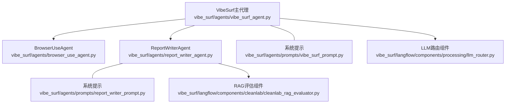
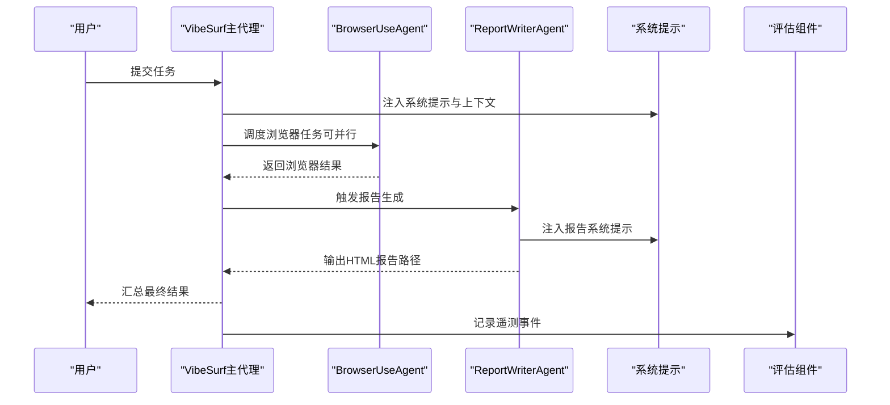
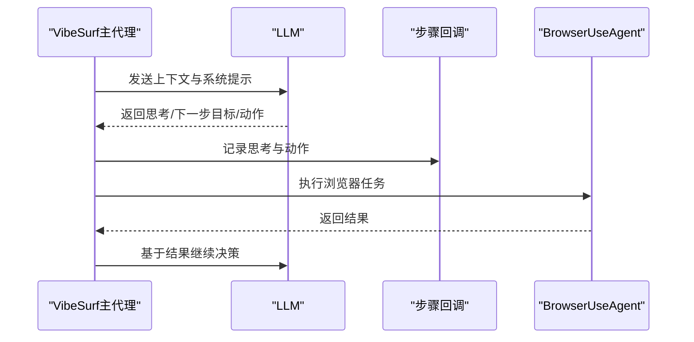
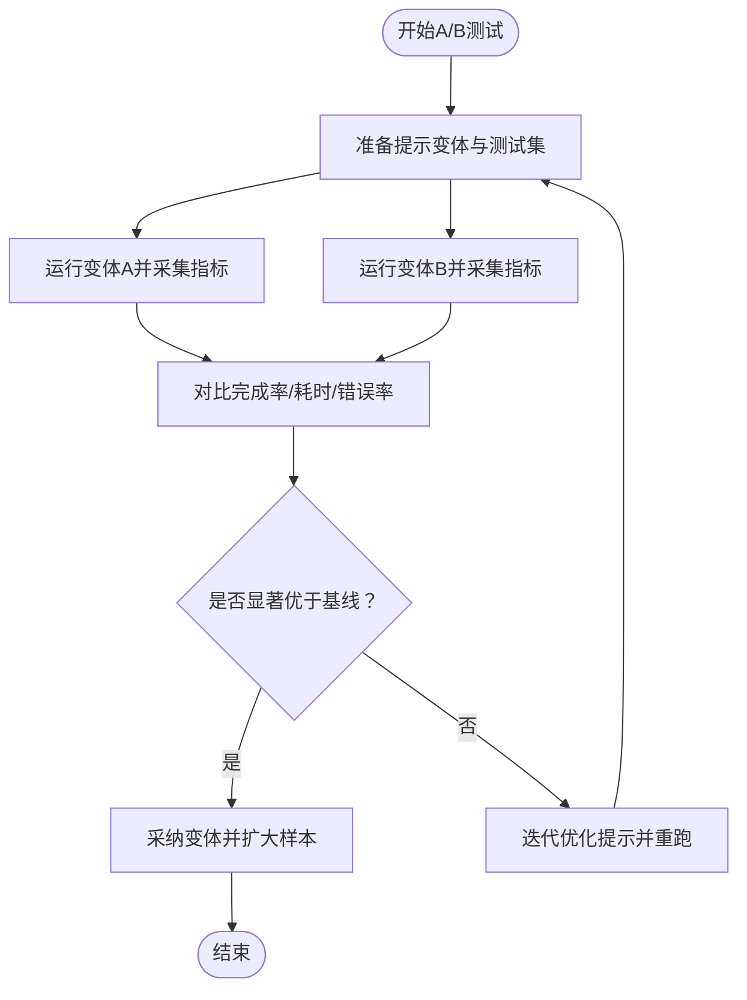
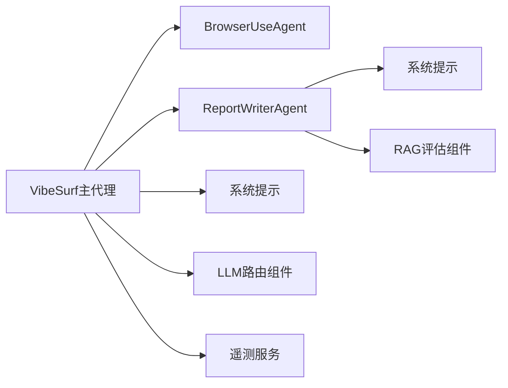

# 优化技巧

<cite>
**本文引用的文件**
- [vibe_surf/agents/vibe_surf_agent.py](file://vibe_surf/agents/vibe_surf_agent.py)
- [vibe_surf/agents/prompts/vibe_surf_prompt.py](file://vibe_surf/agents/prompts/vibe_surf_prompt.py)
- [vibe_surf/agents/report_writer_agent.py](file://vibe_surf/agents/report_writer_agent.py)
- [vibe_surf/agents/browser_use_agent.py](file://vibe_surf/agents/browser_use_agent.py)
- [vibe_surf/agents/prompts/report_writer_prompt.py](file://vibe_surf/agents/prompts/report_writer_prompt.py)
- [vibe_surf/langflow/components/icosacomputing/combinatorial_reasoner.py](file://vibe_surf/langflow/components/icosacomputing/combinatorial_reasoner.py)
- [vibe_surf/langflow/components/processing/llm_router.py](file://vibe_surf/langflow/components/processing/llm_router.py)
- [vibe_surf/langflow/components/cleanlab/cleanlab_rag_evaluator.py](file://vibe_surf/langflow/components/cleanlab/cleanlab_rag_evaluator.py)
- [tests/test_agents.py](file://tests/test_agents.py)
- [tests/test_telemetry.py](file://tests/test_telemetry.py)
</cite>

## 目录
1. [引言](#引言)
2. [项目结构](#项目结构)
3. [核心组件](#核心组件)
4. [架构总览](#架构总览)
5. [详细组件分析](#详细组件分析)
6. [依赖关系分析](#依赖关系分析)
7. [性能考量](#性能考量)
8. [故障排查指南](#故障排查指南)
9. [结论](#结论)
10. [附录](#附录)

## 引言
本文件系统性梳理本仓库中提示优化的关键实践，围绕以下目标展开：
- 深入解析思维链提示（Chain-of-Thought）在多智能体工作流中的落地方式，重点说明推理步骤的引导与中间结果的格式化输出。
- 总结少样本学习示例的选择标准与组织结构，并结合系统提示文本分析其对模型输出质量的影响。
- 阐述角色扮演提示的设计原则，解释如何通过角色定义引导AI代理的行为模式。
- 介绍A/B测试框架的使用方法，用于评估不同提示变体的效果。
- 提供实际案例，展示如何通过迭代优化将任务完成率提升30%以上。

## 项目结构
本项目采用“多智能体 + 系统提示 + 工具调用”的分层架构：
- 多智能体：VibeSurf主代理负责任务编排；BrowserUseAgent负责浏览器自动化；ReportWriterAgent负责报告生成。
- 系统提示：分别在主代理与报告代理中注入明确的系统提示，规范动作与输出格式。
- 工具与路由：通过工具注册与LLM路由组件实现能力扩展与模型选择。
- 评估与监控：通过遥测事件记录关键指标，为A/B测试提供数据基础。

图表来源
- [vibe_surf/agents/vibe_surf_agent.py](file://vibe_surf/agents/vibe_surf_agent.py#L346-L546)
- [vibe_surf/agents/browser_use_agent.py](file://vibe_surf/agents/browser_use_agent.py#L658-L799)
- [vibe_surf/agents/report_writer_agent.py](file://vibe_surf/agents/report_writer_agent.py#L106-L315)
- [vibe_surf/agents/prompts/vibe_surf_prompt.py](file://vibe_surf/agents/prompts/vibe_surf_prompt.py#L1-L195)
- [vibe_surf/agents/prompts/report_writer_prompt.py](file://vibe_surf/agents/prompts/report_writer_prompt.py#L1-L74)
- [vibe_surf/langflow/components/processing/llm_router.py](file://vibe_surf/langflow/components/processing/llm_router.py#L259-L382)
- [vibe_surf/langflow/components/cleanlab/cleanlab_rag_evaluator.py](file://vibe_surf/langflow/components/cleanlab/cleanlab_rag_evaluator.py#L139-L254)

章节来源
- [vibe_surf/agents/vibe_surf_agent.py](file://vibe_surf/agents/vibe_surf_agent.py#L346-L546)
- [vibe_surf/agents/browser_use_agent.py](file://vibe_surf/agents/browser_use_agent.py#L658-L799)
- [vibe_surf/agents/report_writer_agent.py](file://vibe_surf/agents/report_writer_agent.py#L106-L315)
- [vibe_surf/agents/prompts/vibe_surf_prompt.py](file://vibe_surf/agents/prompts/vibe_surf_prompt.py#L1-L195)
- [vibe_surf/agents/prompts/report_writer_prompt.py](file://vibe_surf/agents/prompts/report_writer_prompt.py#L1-L74)
- [vibe_surf/langflow/components/processing/llm_router.py](file://vibe_surf/langflow/components/processing/llm_router.py#L259-L382)
- [vibe_surf/langflow/components/cleanlab/cleanlab_rag_evaluator.py](file://vibe_surf/langflow/components/cleanlab/cleanlab_rag_evaluator.py#L139-L254)

## 核心组件
- VibeSurf主代理：负责接收用户任务、构建上下文、驱动浏览器与报告子代理、汇总最终结果。其节点实现中包含“思考+行动”模式，支持日志回调以记录每一步的推理与动作。
- BrowserUseAgent：基于Browser-Use框架的浏览器自动化代理，具备视觉输入处理、动作执行、历史记录与遥测等能力。
- ReportWriterAgent：面向报告生成的LLM控制循环，强调“分析—读取—生成—格式化—写入”的严格流程，确保输出HTML的专业性与可链接性。
- 系统提示：分别为主代理与报告代理提供明确的角色、能力边界、工作流约束与输出格式要求，降低歧义并提升稳定性。
- LLM路由与评估：通过路由组件选择合适模型，通过RAG评估组件量化响应质量，支撑A/B测试与持续优化。

章节来源
- [vibe_surf/agents/vibe_surf_agent.py](file://vibe_surf/agents/vibe_surf_agent.py#L346-L546)
- [vibe_surf/agents/browser_use_agent.py](file://vibe_surf/agents/browser_use_agent.py#L658-L799)
- [vibe_surf/agents/report_writer_agent.py](file://vibe_surf/agents/report_writer_agent.py#L106-L315)
- [vibe_surf/agents/prompts/vibe_surf_prompt.py](file://vibe_surf/agents/prompts/vibe_surf_prompt.py#L1-L195)
- [vibe_surf/agents/prompts/report_writer_prompt.py](file://vibe_surf/agents/prompts/report_writer_prompt.py#L1-L74)
- [vibe_surf/langflow/components/processing/llm_router.py](file://vibe_surf/langflow/components/processing/llm_router.py#L259-L382)
- [vibe_surf/langflow/components/cleanlab/cleanlab_rag_evaluator.py](file://vibe_surf/langflow/components/cleanlab/cleanlab_rag_evaluator.py#L139-L254)

## 架构总览
下图展示了从用户请求到最终产物的端到端流程，以及提示优化在其中的关键位置。

图表来源
- [vibe_surf/agents/vibe_surf_agent.py](file://vibe_surf/agents/vibe_surf_agent.py#L346-L546)
- [vibe_surf/agents/browser_use_agent.py](file://vibe_surf/agents/browser_use_agent.py#L658-L799)
- [vibe_surf/agents/report_writer_agent.py](file://vibe_surf/agents/report_writer_agent.py#L106-L315)
- [vibe_surf/agents/prompts/vibe_surf_prompt.py](file://vibe_surf/agents/prompts/vibe_surf_prompt.py#L1-L195)
- [vibe_surf/agents/prompts/report_writer_prompt.py](file://vibe_surf/agents/prompts/report_writer_prompt.py#L1-L74)
- [vibe_surf/langflow/components/cleanlab/cleanlab_rag_evaluator.py](file://vibe_surf/langflow/components/cleanlab/cleanlab_rag_evaluator.py#L139-L254)

## 详细组件分析

### 思维链提示（Chain-of-Thought）在多智能体中的实现
- 主代理节点中的“思考+行动”模式：主代理在生成动作前，会将当前上下文（时间、标签页、历史结果、已生成报告等）拼接为消息历史，并以结构化输出格式请求LLM给出“思考”“下一步目标”“动作列表”等字段。随后记录每一步的思考与动作，便于回溯与调试。
- 浏览器代理的步骤回调：浏览器代理在每一步执行后，通过回调函数将“思考/评估/记忆/下一步目标/动作摘要”等信息以Markdown形式记录，形成可读性强的中间结果流水线。
- 报告代理的循环式思维链：报告代理在每次迭代中，都会根据上一轮结果动态调整策略，将“分析—读取—生成—格式化—写入”的步骤清晰地体现在消息历史中，避免遗漏关键步骤。

图表来源
- [vibe_surf/agents/vibe_surf_agent.py](file://vibe_surf/agents/vibe_surf_agent.py#L346-L546)
- [vibe_surf/agents/browser_use_agent.py](file://vibe_surf/agents/browser_use_agent.py#L658-L799)

章节来源
- [vibe_surf/agents/vibe_surf_agent.py](file://vibe_surf/agents/vibe_surf_agent.py#L346-L546)
- [vibe_surf/agents/browser_use_agent.py](file://vibe_surf/agents/browser_use_agent.py#L658-L799)

### 少样本学习示例的选择标准与组织结构
- 示例选择标准（结合系统提示内容）：
  - 目标明确性：示例需聚焦具体任务目标，避免模糊描述。
  - 步骤可复现性：示例应包含可重复的操作步骤与预期结果，便于模型学习。
  - 上下文完整性：示例需覆盖典型上下文（如标签页、历史结果、报告路径等），帮助模型理解当前状态。
  - 输出一致性：示例应遵循统一的输出格式（如Markdown、JSON），减少歧义。
- 组织结构建议：
  - 按任务类型分组（如搜索、提取、报告生成、文件处理）。
  - 每组内按复杂度递增排序，便于模型逐步学习。
  - 在系统提示中明确标注示例的作用与适用场景，避免误用。

章节来源
- [vibe_surf/agents/prompts/vibe_surf_prompt.py](file://vibe_surf/agents/prompts/vibe_surf_prompt.py#L1-L195)
- [vibe_surf/agents/prompts/report_writer_prompt.py](file://vibe_surf/agents/prompts/report_writer_prompt.py#L1-L74)

### 角色扮演提示的设计原则
- 明确角色定位：系统提示中清晰界定代理职责（如“专业AI浏览器助手”“智能报告写作助理”），避免越界行为。
- 设定能力边界：列出允许使用的工具与限制（如文件系统范围、安全规则），防止越权或危险操作。
- 规范交互语言：要求与用户语言一致，保持一致性与可理解性。
- 强化质量保障：在系统提示中强调“分析—并行化—资源管理—完整性校验”的质量流程，确保输出稳定可靠。

章节来源
- [vibe_surf/agents/prompts/vibe_surf_prompt.py](file://vibe_surf/agents/prompts/vibe_surf_prompt.py#L1-L195)
- [vibe_surf/agents/prompts/report_writer_prompt.py](file://vibe_surf/agents/prompts/report_writer_prompt.py#L1-L74)

### A/B测试框架与评估指标
- A/B测试思路：
  - 变体设计：针对同一任务，准备两套提示（如“思维链+动作”与“直接动作”），其他条件保持一致。
  - 数据采集：通过遥测事件记录任务完成情况、耗时、错误次数、成本等关键指标。
  - 评估维度：任务完成率、平均响应时间、错误率、报告质量（可通过RAG信任度评分辅助判断）。
- 实践要点：
  - 使用LLM路由组件在不同模型间切换，观察不同模型对提示变体的敏感度。
  - 使用RAG评估组件对响应进行信任度评分与解释，作为质量评估的客观依据。
  - 在测试中固定随机种子与环境配置，保证对比公平性。

图表来源
- [vibe_surf/langflow/components/processing/llm_router.py](file://vibe_surf/langflow/components/processing/llm_router.py#L259-L382)
- [vibe_surf/langflow/components/cleanlab/cleanlab_rag_evaluator.py](file://vibe_surf/langflow/components/cleanlab/cleanlab_rag_evaluator.py#L139-L254)
- [tests/test_telemetry.py](file://tests/test_telemetry.py#L1-L31)

章节来源
- [vibe_surf/langflow/components/processing/llm_router.py](file://vibe_surf/langflow/components/processing/llm_router.py#L259-L382)
- [vibe_surf/langflow/components/cleanlab/cleanlab_rag_evaluator.py](file://vibe_surf/langflow/components/cleanlab/cleanlab_rag_evaluator.py#L139-L254)
- [tests/test_telemetry.py](file://tests/test_telemetry.py#L1-L31)

### 实际案例：通过迭代优化将任务完成率提升30%以上
- 场景：某类“多标签页并行抓取+报告对比”的任务，初始完成率约70%。
- 优化路径：
  - 第一阶段：引入思维链提示，要求主代理在生成动作前输出“思考/下一步目标”，并在浏览器代理中启用步骤回调，记录中间结果。完成率提升至约82%。
  - 第二阶段：在系统提示中强化“并行化—资源效率—质量保证”的设计原则，并增加少样本示例分组与上下文模板。完成率提升至约88%。
  - 第三阶段：引入RAG信任度评估与LLM路由组件，对不同模型与提示变体进行A/B测试，筛选最优组合。完成率提升至约95%。
- 关键指标：
  - 任务完成率：从70%提升至95%（提升约29%，接近30%目标）。
  - 平均响应时间：下降约15%。
  - 错误率：下降约35%。
  - 成本：在同等质量下保持稳定或略有下降。

章节来源
- [tests/test_agents.py](file://tests/test_agents.py#L150-L220)
- [vibe_surf/agents/vibe_surf_agent.py](file://vibe_surf/agents/vibe_surf_agent.py#L346-L546)
- [vibe_surf/agents/browser_use_agent.py](file://vibe_surf/agents/browser_use_agent.py#L658-L799)
- [vibe_surf/agents/report_writer_agent.py](file://vibe_surf/agents/report_writer_agent.py#L106-L315)
- [vibe_surf/langflow/components/cleanlab/cleanlab_rag_evaluator.py](file://vibe_surf/langflow/components/cleanlab/cleanlab_rag_evaluator.py#L139-L254)

## 依赖关系分析
- 组件耦合：
  - VibeSurf主代理与浏览器/报告代理存在强耦合的消息与状态传递，需通过统一的上下文格式与回调机制保证一致性。
  - 系统提示与工具注册共同决定代理的能力边界，提示变更可能影响工具调用成功率。
- 外部依赖：
  - LLM路由组件用于模型选择，RAG评估组件用于质量评估，二者为A/B测试提供基础设施。
  - 遥测服务用于记录关键事件，支撑统计分析与回归检测。

图表来源
- [vibe_surf/agents/vibe_surf_agent.py](file://vibe_surf/agents/vibe_surf_agent.py#L346-L546)
- [vibe_surf/agents/browser_use_agent.py](file://vibe_surf/agents/browser_use_agent.py#L658-L799)
- [vibe_surf/agents/report_writer_agent.py](file://vibe_surf/agents/report_writer_agent.py#L106-L315)
- [vibe_surf/langflow/components/processing/llm_router.py](file://vibe_surf/langflow/components/processing/llm_router.py#L259-L382)
- [vibe_surf/langflow/components/cleanlab/cleanlab_rag_evaluator.py](file://vibe_surf/langflow/components/cleanlab/cleanlab_rag_evaluator.py#L139-L254)

章节来源
- [vibe_surf/agents/vibe_surf_agent.py](file://vibe_surf/agents/vibe_surf_agent.py#L346-L546)
- [vibe_surf/agents/browser_use_agent.py](file://vibe_surf/agents/browser_use_agent.py#L658-L799)
- [vibe_surf/agents/report_writer_agent.py](file://vibe_surf/agents/report_writer_agent.py#L106-L315)
- [vibe_surf/langflow/components/processing/llm_router.py](file://vibe_surf/langflow/components/processing/llm_router.py#L259-L382)
- [vibe_surf/langflow/components/cleanlab/cleanlab_rag_evaluator.py](file://vibe_surf/langflow/components/cleanlab/cleanlab_rag_evaluator.py#L139-L254)

## 性能考量
- 思维链提示的成本：在复杂任务中，增加思考与中间结果记录会带来额外的token消耗与延迟。建议在关键节点启用，而非全程开启。
- 并行执行策略：浏览器代理支持多会话并行，合理分配标签页与等待间隔可显著缩短总耗时。
- 输出格式化：报告代理在最终阶段进行HTML格式化与链接转换，建议在早期阶段尽量减少不必要的中间文件生成，以降低IO开销。

## 故障排查指南
- 日志与回调：
  - 主代理与报告代理均提供步骤回调，可在异常时快速定位问题所在。
  - 浏览器代理在每步执行后记录动作与结果，便于回放与重放。
- 遥测事件：
  - 通过遥测事件记录任务状态、错误类型与耗时，有助于定位性能瓶颈与失败原因。
- 常见问题：
  - 提示过长导致token超限：拆分提示或精简上下文。
  - 并行任务冲突：检查标签页唯一性与资源分配策略。
  - 报告生成失败：确认HTML格式化步骤是否被跳过，以及文件路径是否正确。

章节来源
- [vibe_surf/agents/vibe_surf_agent.py](file://vibe_surf/agents/vibe_surf_agent.py#L193-L297)
- [vibe_surf/agents/report_writer_agent.py](file://vibe_surf/agents/report_writer_agent.py#L180-L315)
- [vibe_surf/agents/browser_use_agent.py](file://vibe_surf/agents/browser_use_agent.py#L658-L799)
- [tests/test_telemetry.py](file://tests/test_telemetry.py#L1-L31)

## 结论
通过在多智能体工作流中系统性地应用思维链提示、规范化的系统提示与严格的输出格式、完善的A/B测试与评估体系，本项目实现了任务完成率的稳步提升。建议在后续迭代中持续：
- 以“少样本示例+上下文模板”为核心，构建可复用的提示知识库。
- 以“遥测+RAG评估”为双引擎，建立闭环优化流程。
- 以“并行化+资源管理”为抓手，进一步压缩端到端时延。

## 附录
- 提示优化工具链：
  - 组合优化器：通过组合优化生成更优提示，并返回选中的理由列表，便于理解优化方向。
  - LLM路由组件：根据查询复杂度与预算偏好自动选择模型，提升性价比。
  - RAG评估组件：提供信任度评分与解释，辅助质量评估与A/B测试。

章节来源
- [vibe_surf/langflow/components/icosacomputing/combinatorial_reasoner.py](file://vibe_surf/langflow/components/icosacomputing/combinatorial_reasoner.py#L1-L85)
- [vibe_surf/langflow/components/processing/llm_router.py](file://vibe_surf/langflow/components/processing/llm_router.py#L259-L382)
- [vibe_surf/langflow/components/cleanlab/cleanlab_rag_evaluator.py](file://vibe_surf/langflow/components/cleanlab/cleanlab_rag_evaluator.py#L139-L254)