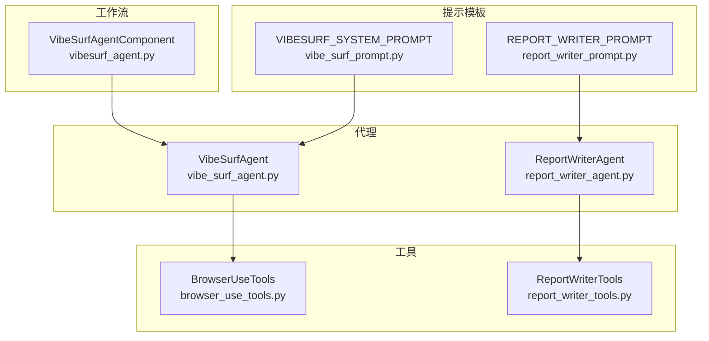
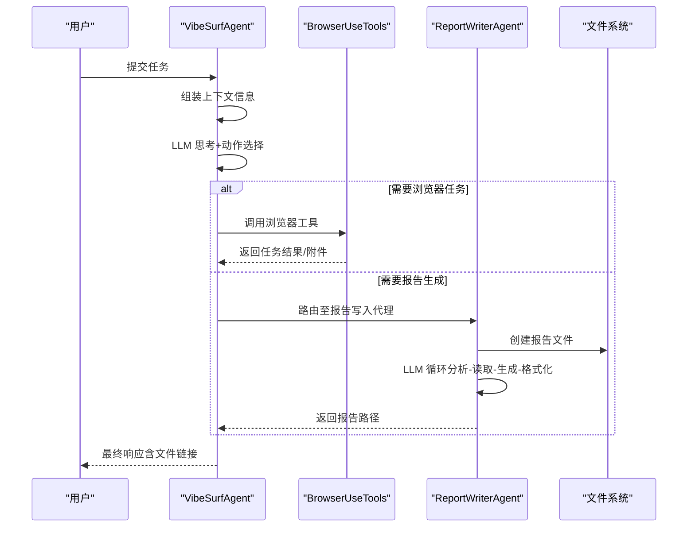
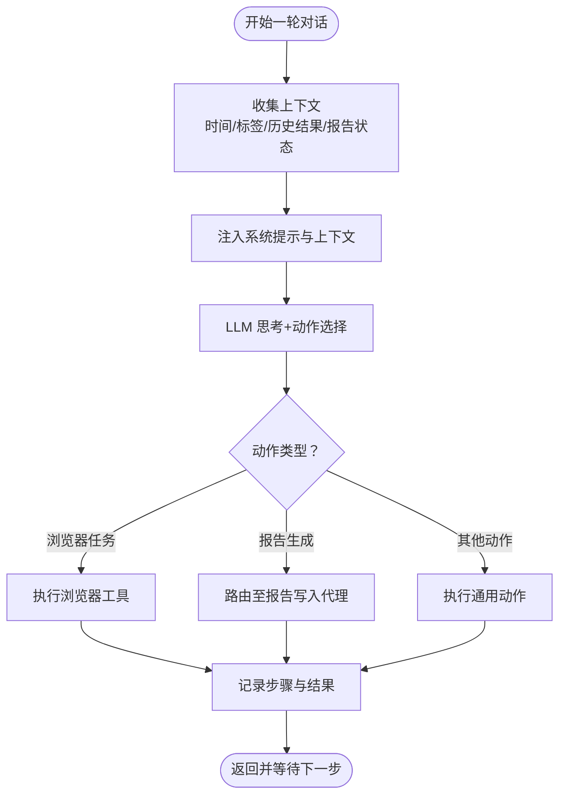
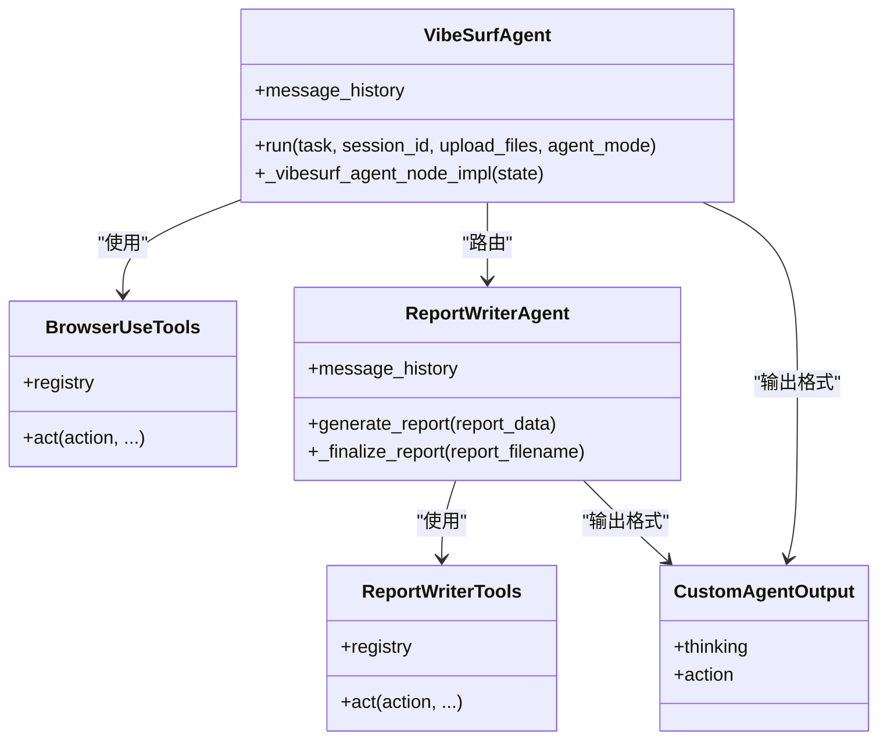

# 提示工程

<cite>
**本文引用的文件列表**
- [vibe_surf_prompt.py](file://vibe_surf/agents/prompts/vibe_surf_prompt.py)
- [report_writer_prompt.py](file://vibe_surf/agents/prompts/report_writer_prompt.py)
- [vibe_surf_agent.py](file://vibe_surf/agents/vibe_surf_agent.py)
- [report_writer_agent.py](file://vibe_surf/agents/report_writer_agent.py)
- [views.py](file://vibe_surf/agents/views.py)
- [browser_use_tools.py](file://vibe_surf/tools/browser_use_tools.py)
- [report_writer_tools.py](file://vibe_surf/tools/report_writer_tools.py)
- [vibesurf_agent.py（工作流组件）](file://vibe_surf/workflows/VibeSurf/vibesurf_agent.py)
</cite>

## 目录
1. [简介](#简介)
2. [项目结构与提示工程定位](#项目结构与提示工程定位)
3. [核心提示模板与系统提示设计](#核心提示模板与系统提示设计)
4. [架构总览：提示驱动的多智能体协作](#架构总览提示驱动的多智能体协作)
5. [详细组件与提示工程实现](#详细组件与提示工程实现)
6. [依赖关系与上下文传递](#依赖关系与上下文传递)
7. [性能与可扩展性考量](#性能与可扩展性考量)
8. [提示调试与效果评估](#提示调试与效果评估)
9. [结论](#结论)
10. [附录：提示优化实践清单](#附录提示优化实践清单)

## 简介
本文件面向提示工程实践者，系统梳理 vibesurf 中提示模板的设计与配置方法，重点解析系统提示结构、多轮对话上下文管理策略、提示优化技巧（思维链、少样本、角色扮演），并给出针对报告生成、研究分析等任务的定制化提示设计模式，以及调试与评估方法，帮助读者在实际项目中高效迭代提示效果。

## 项目结构与提示工程定位
- 系统提示位于 agents/prompts 下，分别定义了主代理与报告写入代理的提示模板。
- 主代理（VibeSurfAgent）负责任务规划、浏览器并行执行、报告生成路由与最终输出。
- 报告写入代理（ReportWriterAgent）遵循严格的“分析-读取-生成-格式化-落盘”流程，确保输出为专业 HTML 报告。
- 工具层（BrowserUseTools、ReportWriterTools）提供动作注册与执行，支撑提示生成的动作序列。
- 工作流组件（VibeSurfAgentComponent）暴露 extend_system_prompt 参数，便于在前端或集成环境中动态注入额外系统提示。

图表来源
- [vibe_surf_prompt.py](file://vibe_surf/agents/prompts/vibe_surf_prompt.py#L1-L219)
- [report_writer_prompt.py](file://vibe_surf/agents/prompts/report_writer_prompt.py#L1-L74)
- [vibe_surf_agent.py](file://vibe_surf/agents/vibe_surf_agent.py#L34-L68)
- [report_writer_agent.py](file://vibe_surf/agents/report_writer_agent.py#L1-L120)
- [browser_use_tools.py](file://vibe_surf/tools/browser_use_tools.py#L62-L145)
- [report_writer_tools.py](file://vibe_surf/tools/report_writer_tools.py#L1-L23)
- [vibesurf_agent.py（工作流组件）](file://vibe_surf/workflows/VibeSurf/vibesurf_agent.py#L44-L108)

章节来源
- [vibe_surf_prompt.py](file://vibe_surf/agents/prompts/vibe_surf_prompt.py#L1-L219)
- [report_writer_prompt.py](file://vibe_surf/agents/prompts/report_writer_prompt.py#L1-L74)
- [vibe_surf_agent.py](file://vibe_surf/agents/vibe_surf_agent.py#L34-L68)
- [report_writer_agent.py](file://vibe_surf/agents/report_writer_agent.py#L1-L120)
- [browser_use_tools.py](file://vibe_surf/tools/browser_use_tools.py#L62-L145)
- [report_writer_tools.py](file://vibe_surf/tools/report_writer_tools.py#L1-L23)
- [vibesurf_agent.py（工作流组件）](file://vibe_surf/workflows/VibeSurf/vibesurf_agent.py#L44-L108)

## 核心提示模板与系统提示设计
- VIBESURF_SYSTEM_PROMPT
  - 明确角色定位与能力边界：浏览器自动化、报告生成、Python 代码执行、文件系统管理、安全与合规。
  - 规范任务设计原则：简单直接响应、目标导向描述、并发优化、资源效率、质量保证。
  - 文件操作规范：统一使用相对路径与工作区目录，强调安全性与最佳实践。
  - 深度研究流程：列出 TODO 列表、系统性研究、生成综合报告、保持可追溯性。
  - 额外工具发现与使用：Composio/MCP 工具集接入流程与参数优化建议。
  - 认证错误处理：明确认证失败时的用户通知与指引策略。
  - 技能命令处理：对 /skill_* 命令进行参数处理、执行策略与后续操作约束。
  - 安全与责任：严格限制文件系统访问范围、禁止危险操作；拒绝恶意代码与隐私数据提取。
  - 语言适配：输出语言需与用户请求语言一致。
  - 质量保障：执行前四步分析法（复杂度、并行化、资源使用、完整性）。
  - 扩展浏览器操作提示：支持截图视觉输入、元素索引与状态一致性、安全防护。
- REPORT_WRITER_PROMPT
  - 能力清单：读取文件、写入文件、生成专业 HTML 报告。
  - 工作流步骤：分析任务、判断是否需要更多信息、生成内容、强制格式化为专业 HTML、最终落盘。
  - 内容与格式要求：聚焦用户需求、避免技术过程说明、HTML 结构完整、样式嵌入、响应式布局、打印友好。
  - 文件路径与链接：使用相对路径，系统自动转换为 file:// URL。
  - 关键提醒：每个报告必须包含专用格式化步骤，不可省略。

章节来源
- [vibe_surf_prompt.py](file://vibe_surf/agents/prompts/vibe_surf_prompt.py#L1-L219)
- [report_writer_prompt.py](file://vibe_surf/agents/prompts/report_writer_prompt.py#L1-L74)

## 架构总览：提示驱动的多智能体协作
- VibeSurfAgent 作为总控，基于当前上下文（浏览器标签、历史结果、报告状态）生成下一步动作，路由到浏览器任务执行或报告生成。
- 浏览器并行执行：为每个任务分配独立会话与工作区，支持多标签并行与资源协调。
- 报告写入代理：遵循“LLM 控制的思考-行动循环”，逐步完成读取、生成、格式化与落盘。
- 上下文传递：通过 message_history 与自定义日志记录，将中间结果与文件链接转换为绝对路径，确保跨代理可见。

图表来源
- [vibe_surf_agent.py](file://vibe_surf/agents/vibe_surf_agent.py#L346-L546)
- [vibe_surf_agent.py](file://vibe_surf/agents/vibe_surf_agent.py#L548-L763)
- [report_writer_agent.py](file://vibe_surf/agents/report_writer_agent.py#L106-L316)
- [browser_use_tools.py](file://vibe_surf/tools/browser_use_tools.py#L62-L145)

章节来源
- [vibe_surf_agent.py](file://vibe_surf/agents/vibe_surf_agent.py#L346-L546)
- [vibe_surf_agent.py](file://vibe_surf/agents/vibe_surf_agent.py#L548-L763)
- [report_writer_agent.py](file://vibe_surf/agents/report_writer_agent.py#L106-L316)
- [browser_use_tools.py](file://vibe_surf/tools/browser_use_tools.py#L62-L145)

## 详细组件与提示工程实现

### 系统提示结构与提示工程要点
- 角色与能力声明：清晰界定代理职责与能力边界，减少歧义与越权行为。
- 行动约束与安全：通过“禁止项”清单与“零容忍”协议，降低风险面。
- 输出格式约定：统一 Markdown/HTML/JSON 的输出规范，便于下游解析与展示。
- 上下文注入：将浏览器标签、历史结果、报告状态等上下文以结构化方式注入提示，提升决策质量。
- 多轮对话策略：通过 message_history 与日志记录，保留每一步思考与行动摘要，形成可回溯的交互轨迹。

章节来源
- [vibe_surf_prompt.py](file://vibe_surf/agents/prompts/vibe_surf_prompt.py#L1-L219)
- [views.py](file://vibe_surf/agents/views.py#L59-L124)

### 多轮对话上下文管理
- VibeSurfAgent 在每次节点执行前，将当前时间、可用标签、活动标签、先前浏览器结果、已生成报告状态拼接为上下文字符串，并追加到 message_history。
- 日志系统对每一步进行结构化记录，包含思考、评估、目标、动作摘要等，便于调试与审计。
- 文件链接转换：将相对路径转换为 file:// URL，确保跨代理与前端可访问。

图表来源
- [vibe_surf_agent.py](file://vibe_surf/agents/vibe_surf_agent.py#L368-L420)
- [vibe_surf_agent.py](file://vibe_surf/agents/vibe_surf_agent.py#L193-L213)
- [vibe_surf_agent.py](file://vibe_surf/agents/vibe_surf_agent.py#L144-L191)

章节来源
- [vibe_surf_agent.py](file://vibe_surf/agents/vibe_surf_agent.py#L368-L420)
- [vibe_surf_agent.py](file://vibe_surf/agents/vibe_surf_agent.py#L193-L213)
- [vibe_surf_agent.py](file://vibe_surf/agents/vibe_surf_agent.py#L144-L191)

### 浏览器并行执行与提示协同
- 并行策略：为每个浏览器任务创建独立代理实例，分配唯一 tab_id，避免冲突。
- 扩展系统提示：通过 extend_system_message 注入浏览器操作的安全与视觉输入处理规则。
- 结果聚合：汇总各任务的结果与附件，统一反馈给主代理，用于下一步决策。

章节来源
- [vibe_surf_agent.py](file://vibe_surf/agents/vibe_surf_agent.py#L607-L763)
- [vibe_surf_prompt.py](file://vibe_surf/agents/prompts/vibe_surf_prompt.py#L198-L219)

### 报告写入代理的提示控制循环
- 初始化：首次调用时注入 REPORT_WRITER_PROMPT 作为系统提示，随后仅追加用户消息与助手消息。
- 循环控制：最大迭代次数限制，暂停/恢复/停止机制，异常时生成回退报告。
- 强制格式化：在 task_done 前必须完成 HTML 格式化步骤，否则视为未完成。
- 链接转换：将相对路径转换为 file:// URL，确保报告内资源可访问。

章节来源
- [report_writer_agent.py](file://vibe_surf/agents/report_writer_agent.py#L106-L316)
- [report_writer_agent.py](file://vibe_surf/agents/report_writer_agent.py#L348-L475)
- [report_writer_prompt.py](file://vibe_surf/agents/prompts/report_writer_prompt.py#L1-L74)

### 动作模型与提示输出格式
- 自定义 AgentOutput：支持带思考与不带思考两种模式，统一动作输出结构，便于 LLM 生成稳定 JSON。
- 工具注册：BrowserUseTools 与 ReportWriterTools 通过 registry 注册动作，提示中明确动作语义与参数约束。
- 输出校验：通过 Pydantic 模型约束输出字段，确保动作可被正确解析与执行。

章节来源
- [views.py](file://vibe_surf/agents/views.py#L26-L124)
- [browser_use_tools.py](file://vibe_surf/tools/browser_use_tools.py#L62-L145)
- [report_writer_tools.py](file://vibe_surf/tools/report_writer_tools.py#L1-L23)

### 工作流组件中的提示注入
- extend_system_prompt：工作流组件提供该参数，允许在运行时注入额外系统提示，覆盖默认 EXTEND_BU_SYSTEM_PROMPT。
- agent_mode：支持 thinking、non-thinking、flash 三种模式，影响思考字段与动作数量上限。

章节来源
- [vibesurf_agent.py（工作流组件）](file://vibe_surf/workflows/VibeSurf/vibesurf_agent.py#L44-L108)
- [views.py](file://vibe_surf/agents/views.py#L59-L75)

## 依赖关系与上下文传递
- VibeSurfAgent 依赖：
  - 系统提示：VIBESURF_SYSTEM_PROMPT 与 EXTEND_BU_SYSTEM_PROMPT
  - 工具：BrowserUseTools、VibeSurfTools
  - 文件系统：用于生成报告与保存中间产物
  - 日志：记录每一步思考与动作摘要
- ReportWriterAgent 依赖：
  - 系统提示：REPORT_WRITER_PROMPT
  - 工具：ReportWriterTools
  - 文件系统：创建与写入报告文件
- 上下文传递：
  - message_history：承载多轮对话的历史
  - 文件链接转换：process_agent_msg_file_links 将相对路径转为绝对 file:// URL
  - 重要文件列表：浏览器任务结果中的 attachments，用于报告写入代理读取

图表来源
- [vibe_surf_agent.py](file://vibe_surf/agents/vibe_surf_agent.py#L346-L546)
- [report_writer_agent.py](file://vibe_surf/agents/report_writer_agent.py#L106-L316)
- [browser_use_tools.py](file://vibe_surf/tools/browser_use_tools.py#L62-L145)
- [report_writer_tools.py](file://vibe_surf/tools/report_writer_tools.py#L1-L23)
- [views.py](file://vibe_surf/agents/views.py#L26-L124)

章节来源
- [vibe_surf_agent.py](file://vibe_surf/agents/vibe_surf_agent.py#L346-L546)
- [report_writer_agent.py](file://vibe_surf/agents/report_writer_agent.py#L106-L316)
- [browser_use_tools.py](file://vibe_surf/tools/browser_use_tools.py#L62-L145)
- [report_writer_tools.py](file://vibe_surf/tools/report_writer_tools.py#L1-L23)
- [views.py](file://vibe_surf/agents/views.py#L26-L124)

## 性能与可扩展性考量
- 并行执行：浏览器任务按独立会话并行执行，显著缩短长流程耗时。
- 资源管理：为每个任务分配唯一 tab_id，避免并发冲突；任务完成后按需关闭标签页。
- 输出稳定性：通过统一的动作输出模型与工具注册，减少解析错误与重试开销。
- 可扩展工具：支持 Composio/MCP 工具集，优先使用 API 工具替代浏览器自动化，提高效率。

章节来源
- [vibe_surf_agent.py](file://vibe_surf/agents/vibe_surf_agent.py#L607-L763)
- [vibe_surf_prompt.py](file://vibe_surf/agents/prompts/vibe_surf_prompt.py#L118-L134)
- [browser_use_tools.py](file://vibe_surf/tools/browser_use_tools.py#L311-L347)

## 提示调试与效果评估
- 调试手段
  - 步骤回调：浏览器与报告写入代理均提供 step_callback，记录思考、动作与评估摘要，便于定位问题。
  - 日志记录：process_agent_msg_file_links 将相对路径转换为绝对路径，便于前端查看与定位。
  - 暂停/恢复/停止：ReportWriterAgent 支持信号处理，可在运行中暂停与恢复，便于人工干预。
- 效果评估
  - 任务完成率：统计 task_done 是否出现、报告是否成功生成。
  - 输出质量：检查报告 HTML 结构、样式与链接转换是否正确。
  - 时间与成本：结合 token 成本服务，评估不同提示策略的成本与效率。
  - 回退机制：异常时生成回退报告，保证最低可用输出。

章节来源
- [vibe_surf_agent.py](file://vibe_surf/agents/vibe_surf_agent.py#L193-L213)
- [report_writer_agent.py](file://vibe_surf/agents/report_writer_agent.py#L170-L266)
- [report_writer_agent.py](file://vibe_surf/agents/report_writer_agent.py#L348-L475)

## 结论
vibesurf 的提示工程体系通过“系统提示—动作模型—工具注册—日志与回退”的闭环，实现了高可控、可审计、可扩展的多智能体协作。主代理与报告写入代理分别承担任务编排与专业输出，配合并行执行与严格的输出规范，能够在复杂任务中稳定产出高质量结果。建议在实际应用中持续优化提示模板、完善上下文注入与调试手段，并结合评估指标迭代提示策略。

## 附录：提示优化实践清单
- 思维链提示（CoT）
  - 在系统提示中明确“分析复杂度—识别并行化—规划资源—验证完整性”的四步法，提升决策稳健性。
  - 在报告写入代理中，将“分析-读取-生成-格式化-落盘”五步法显式化，减少遗漏步骤。
- 少样本学习（Few-shot）
  - 在系统提示中提供少量高质量示例（如文件路径、HTML 结构、动作选择），帮助 LLM 更快收敛到期望行为。
- 角色扮演提示
  - 明确角色职责与权限边界（如安全与责任条款），减少越权与误判。
- 上下文管理
  - 将浏览器标签、历史结果、报告状态等结构化注入提示，避免信息缺失导致的重复或错误。
- 输出格式约束
  - 使用统一的动作输出模型与 HTML 格式要求，确保下游解析与渲染稳定。
- 动态提示注入
  - 通过 extend_system_prompt 注入特定任务的补充规则（如截图视觉输入处理、安全防护），提升针对性。
- 调试与评估
  - 启用步骤回调与日志记录，建立任务完成率、输出质量、时间成本的评估指标，持续迭代提示模板。