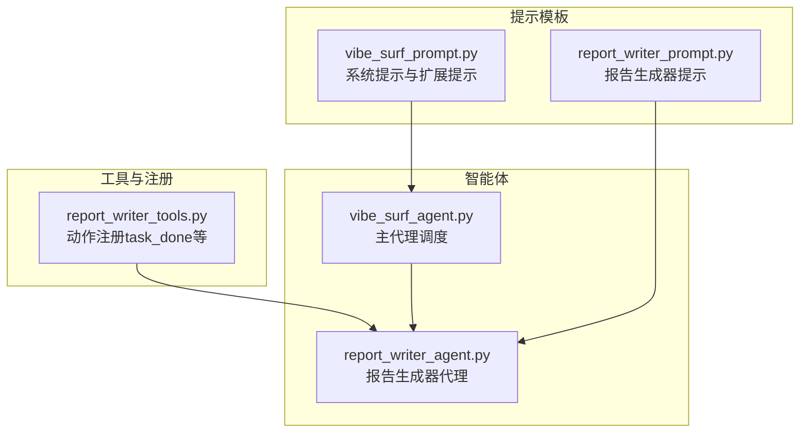
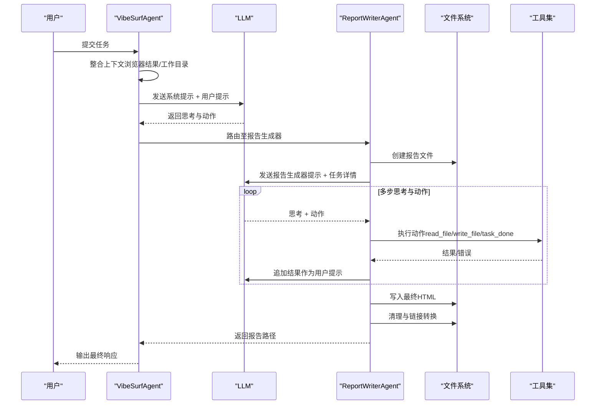
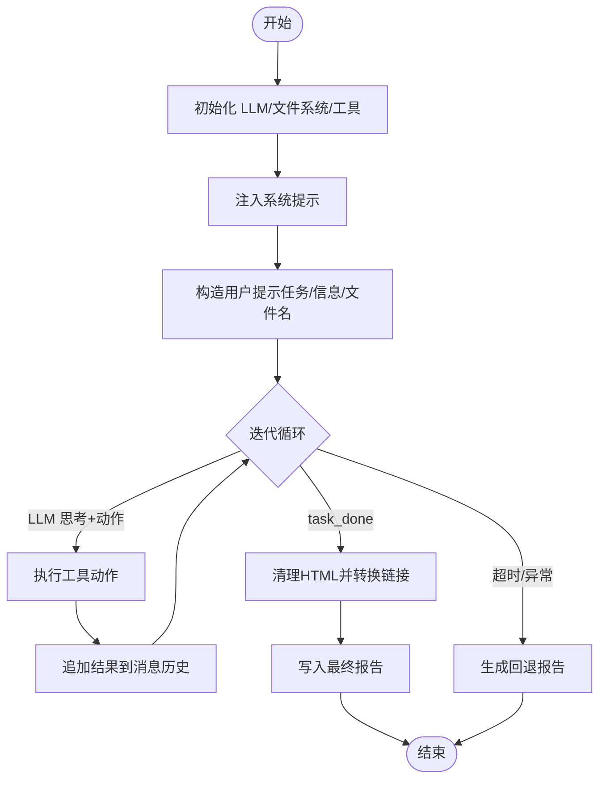
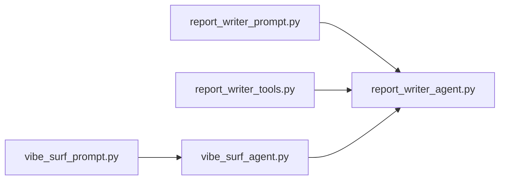

# 提示模板

<cite>
**本文引用的文件**
- [vibe_surf/agents/prompts/vibe_surf_prompt.py](file://vibe_surf/agents/prompts/vibe_surf_prompt.py)
- [vibe_surf/agents/prompts/report_writer_prompt.py](file://vibe_surf/agents/prompts/report_writer_prompt.py)
- [vibe_surf/agents/report_writer_agent.py](file://vibe_surf/agents/report_writer_agent.py)
- [vibe_surf/agents/vibe_surf_agent.py](file://vibe_surf/agents/vibe_surf_agent.py)
- [vibe_surf/tools/report_writer_tools.py](file://vibe_surf/tools/report_writer_tools.py)
- [vibe_surf/langflow/base/prompts/api_utils.py](file://vibe_surf/langflow/base/prompts/api_utils.py)
- [vibe_surf/frontend/src/constants/constants.ts](file://vibe_surf/frontend/src/constants/constants.ts)
</cite>

## 目录
1. [简介](#简介)
2. [项目结构](#项目结构)
3. [核心组件](#核心组件)
4. [架构总览](#架构总览)
5. [详细组件分析](#详细组件分析)
6. [依赖关系分析](#依赖关系分析)
7. [性能考量](#性能考量)
8. [故障排查指南](#故障排查指南)
9. [结论](#结论)
10. [附录：创建新提示模板步骤](#附录创建新提示模板步骤)

## 简介
本文件聚焦于项目中的提示模板体系，特别是两个关键提示模块：
- 浏览器代理提示：vibe_surf/agents/prompts/vibe_surf_prompt.py
- 报告生成器提示：vibe_surf/agents/prompts/report_writer_prompt.py

我们将从系统提示、用户提示与助手提示的分层设计入手，解析模板变量占位符与注入机制，详解报告生成器的结构化输出要求（HTML 格式、内容组织），并给出创建新模板的步骤、命名规范、变量定义与国际化支持建议，同时总结错误处理与内容过滤策略，最后以序列图和流程图展示模板解析与渲染过程。

## 项目结构
提示模板位于 agents/prompts 目录下，分别由浏览器代理与报告生成器使用；在运行时，这些模板被注入到消息历史中，配合工具动作模型驱动智能体行为。

图表来源
- [vibe_surf/agents/prompts/vibe_surf_prompt.py](file://vibe_surf/agents/prompts/vibe_surf_prompt.py#L1-L219)
- [vibe_surf/agents/prompts/report_writer_prompt.py](file://vibe_surf/agents/prompts/report_writer_prompt.py#L1-L74)
- [vibe_surf/agents/vibe_surf_agent.py](file://vibe_surf/agents/vibe_surf_agent.py#L344-L546)
- [vibe_surf/agents/report_writer_agent.py](file://vibe_surf/agents/report_writer_agent.py#L1-L120)
- [vibe_surf/tools/report_writer_tools.py](file://vibe_surf/tools/report_writer_tools.py#L1-L23)

章节来源
- [vibe_surf/agents/prompts/vibe_surf_prompt.py](file://vibe_surf/agents/prompts/vibe_surf_prompt.py#L1-L219)
- [vibe_surf/agents/prompts/report_writer_prompt.py](file://vibe_surf/agents/prompts/report_writer_prompt.py#L1-L74)
- [vibe_surf/agents/vibe_surf_agent.py](file://vibe_surf/agents/vibe_surf_agent.py#L344-L546)
- [vibe_surf/agents/report_writer_agent.py](file://vibe_surf/agents/report_writer_agent.py#L1-L120)
- [vibe_surf/tools/report_writer_tools.py](file://vibe_surf/tools/report_writer_tools.py#L1-L23)

## 核心组件
- 系统提示（System Prompt）
  - 浏览器代理系统提示：定义能力边界、安全规则、最佳实践、文件路径约定、语言适配等。
  - 扩展浏览器代理系统提示：补充文件路径、截图视觉输入处理、浏览器操作安全准则。
- 报告生成器提示：明确任务分析、文件读取、HTML 结构化输出、标题与内容组织、执行要求与关键提醒。
- 智能体与工具
  - 主代理（VibeSurfAgent）负责调度与上下文整合，将浏览器结果与报告路径纳入系统提示。
  - 报告生成器代理（ReportWriterAgent）基于提示与工具动作循环生成 HTML 报告，并进行最终清理与链接转换。
  - 报告生成器工具（ReportWriterTools）注册动作模型，如 task_done。

章节来源
- [vibe_surf/agents/prompts/vibe_surf_prompt.py](file://vibe_surf/agents/prompts/vibe_surf_prompt.py#L1-L219)
- [vibe_surf/agents/prompts/report_writer_prompt.py](file://vibe_surf/agents/prompts/report_writer_prompt.py#L1-L74)
- [vibe_surf/agents/report_writer_agent.py](file://vibe_surf/agents/report_writer_agent.py#L1-L120)
- [vibe_surf/tools/report_writer_tools.py](file://vibe_surf/tools/report_writer_tools.py#L1-L23)

## 架构总览
提示模板在运行时被注入到消息历史中，形成“系统提示 + 用户提示 + 助手提示”的分层结构，驱动智能体思考与行动。

图表来源
- [vibe_surf/agents/vibe_surf_agent.py](file://vibe_surf/agents/vibe_surf_agent.py#L344-L546)
- [vibe_surf/agents/report_writer_agent.py](file://vibe_surf/agents/report_writer_agent.py#L106-L316)
- [vibe_surf/tools/report_writer_tools.py](file://vibe_surf/tools/report_writer_tools.py#L1-L23)

## 详细组件分析

### 组件A：浏览器代理提示（vibe_surf_prompt.py）
- 分层设计
  - 系统提示（VIBESURF_SYSTEM_PROMPT）：定义代理角色、核心架构、能力清单、文件系统管理、上下文处理、操作指导、额外工具发现与使用、认证错误处理、技能命令处理、安全与合规、语言适配、质量保证等。
  - 扩展系统提示（EXTEND_BU_SYSTEM_PROMPT）：强调输出语言一致性、文件路径规范、截图视觉输入处理、浏览器操作安全准则。
- 变量与注入
  - 模板本身为纯文本字符串，不包含动态变量占位符；在主代理中会将上下文信息（如浏览器标签、历史结果、工作目录等）拼接为用户提示后一并发送给 LLM。
  - 扩展系统提示通过参数传入浏览器用代理，用于补充浏览器操作的安全与路径约束。
- 安全与合规
  - 明确 Python 代码执行限制、禁止危险操作、隐私保护、审计日志等。
- 语言适配
  - 输出语言需与用户请求语言一致，避免跨语言混杂。

章节来源
- [vibe_surf/agents/prompts/vibe_surf_prompt.py](file://vibe_surf/agents/prompts/vibe_surf_prompt.py#L1-L219)
- [vibe_surf/agents/vibe_surf_agent.py](file://vibe_surf/agents/vibe_surf_agent.py#L344-L546)

### 组件B：报告生成器提示（report_writer_prompt.py）
- 分层设计
  - 系统提示（REPORT_WRITER_PROMPT）：定义报告生成器角色、能力（读写文件）、工作流步骤、内容与HTML要求、标题规范、执行要求与关键提醒。
- 工作流与结构化输出
  - 步骤1：分析任务与已有信息
  - 步骤2：决定是否需要读取文件（含对 BrowserTaskResult 的 agent_workdir 与重要文件路径的处理）
  - 步骤3：生成内容
  - 步骤4：强制格式化为专业 HTML（完整 DOCTYPE、嵌入式 CSS、响应式设计、语义化元素、打印友好）
  - 步骤5：写入目标文件
  - 关键要求：必须包含“格式化步骤”，且不可跳过；最终调用 task_done。
- HTML 与内容组织
  - 必须是完整的 HTML5 文档结构
  - 使用相对路径（不使用 file:// 前缀），系统自动转换为绝对 file:// URL
  - 强调可读性、排版、层次、表格、颜色方案与跨浏览器兼容性
  - 标题应具体而非通用标题
- 变量与注入
  - 模板本身不含动态变量；在报告生成器代理中，会将任务描述、可用信息、报告文件名等作为用户提示注入到消息历史。

章节来源
- [vibe_surf/agents/prompts/report_writer_prompt.py](file://vibe_surf/agents/prompts/report_writer_prompt.py#L1-L74)
- [vibe_surf/agents/report_writer_agent.py](file://vibe_surf/agents/report_writer_agent.py#L106-L316)

### 组件C：报告生成器代理（report_writer_agent.py）
- 角色与职责
  - 初始化 LLM、文件系统与工具，构建动作模型与输出类型
  - 在消息历史中注入系统提示与用户提示，进入 LLM 控制的多步思考与动作循环
  - 通过工具执行 read_file、write_file、task_done 等动作
  - 最终清理 HTML 并将相对路径转换为 file:// URL
- 错误处理与回退
  - 当达到最大迭代次数或异常时，生成回退 HTML 报告并返回路径
- 链接与路径处理
  - 将相对文件路径转换为 file:// 绝对 URL，便于本地预览
  - 对 Markdown 代码块标记进行清理，确保输出符合 HTML 格式

图表来源
- [vibe_surf/agents/report_writer_agent.py](file://vibe_surf/agents/report_writer_agent.py#L106-L316)
- [vibe_surf/tools/report_writer_tools.py](file://vibe_surf/tools/report_writer_tools.py#L1-L23)

章节来源
- [vibe_surf/agents/report_writer_agent.py](file://vibe_surf/agents/report_writer_agent.py#L1-L581)
- [vibe_surf/tools/report_writer_tools.py](file://vibe_surf/tools/report_writer_tools.py#L1-L23)

### 组件D：主代理（vibe_surf_agent.py）
- 角色与职责
  - 作为调度者，整合浏览器上下文（标签、活动页、历史结果、报告路径）并注入系统提示
  - 解析 LLM 输出的动作，路由到浏览器任务执行或报告生成器
  - 记录活动日志，处理暂停/停止控制信号
- 文件链接处理
  - 将消息中的相对文件链接转换为绝对 file:// URL，便于可视化与调试

章节来源
- [vibe_surf/agents/vibe_surf_agent.py](file://vibe_surf/agents/vibe_surf_agent.py#L1-L214)
- [vibe_surf/agents/vibe_surf_agent.py](file://vibe_surf/agents/vibe_surf_agent.py#L344-L546)

## 依赖关系分析
- 模块耦合
  - 浏览器代理提示与主代理强耦合：主代理在消息历史中注入系统提示与上下文，再由 LLM 产出动作。
  - 报告生成器提示与报告生成器代理强耦合：代理按提示步骤执行，严格遵循 HTML 输出与动作要求。
  - 报告生成器工具与代理弱耦合：仅注册动作模型，代理通过工具执行具体动作。
- 外部依赖
  - LLM 消息模型（SystemMessage/UserMessage/AssistantMessage）
  - 文件系统工具（相对路径、绝对路径转换）
  - 日志与遥测（记录 token 使用、异常与完成事件）

图表来源
- [vibe_surf/agents/prompts/vibe_surf_prompt.py](file://vibe_surf/agents/prompts/vibe_surf_prompt.py#L1-L219)
- [vibe_surf/agents/prompts/report_writer_prompt.py](file://vibe_surf/agents/prompts/report_writer_prompt.py#L1-L74)
- [vibe_surf/agents/vibe_surf_agent.py](file://vibe_surf/agents/vibe_surf_agent.py#L344-L546)
- [vibe_surf/agents/report_writer_agent.py](file://vibe_surf/agents/report_writer_agent.py#L1-L120)
- [vibe_surf/tools/report_writer_tools.py](file://vibe_surf/tools/report_writer_tools.py#L1-L23)

章节来源
- [vibe_surf/agents/vibe_surf_agent.py](file://vibe_surf/agents/vibe_surf_agent.py#L344-L546)
- [vibe_surf/agents/report_writer_agent.py](file://vibe_surf/agents/report_writer_agent.py#L1-L120)

## 性能考量
- 并发与资源优化
  - 浏览器代理提示强调并发任务处理与资源管理，减少多步骤工作流的总耗时。
- 输出稳定性
  - 报告生成器代理在格式化阶段统一清理与补全 HTML，避免重复渲染与格式漂移。
- 路径处理效率
  - 统一的相对路径到 file:// URL 转换，减少后续解析成本。

[本节为一般性建议，无需特定文件来源]

## 故障排查指南
- 提示注入与变量校验
  - 模板变量校验与修复：前端与后端均提供变量合法性检查与修复逻辑，防止非法字符与空变量导致的注入问题。
- 内容过滤与安全
  - 报告生成器代理在最终阶段清理 Markdown 包裹标记并强制 HTML 结构，避免非预期内容污染。
  - 浏览器代理提示包含严格的 Python 代码执行安全规则与拒绝列表，防止危险操作。
- 回退机制
  - 报告生成器代理在达到最大迭代次数或异常时，自动生成回退 HTML 报告，保障输出可用性。

章节来源
- [vibe_surf/langflow/base/prompts/api_utils.py](file://vibe_surf/langflow/base/prompts/api_utils.py#L55-L122)
- [vibe_surf/agents/report_writer_agent.py](file://vibe_surf/agents/report_writer_agent.py#L348-L581)
- [vibe_surf/agents/prompts/vibe_surf_prompt.py](file://vibe_surf/agents/prompts/vibe_surf_prompt.py#L154-L218)

## 结论
- 浏览器代理提示与报告生成器提示分别承担“系统指令”和“结构化输出约束”的职责，二者共同构成智能体的“思维与行动”框架。
- 模板本身不包含动态变量占位符，变量注入发生在运行时的消息历史构建阶段。
- 报告生成器对 HTML 输出有严格约束，必须包含格式化步骤，且最终路径转换为 file:// URL 以便本地预览。
- 安全与合规贯穿提示与工具层，确保输出可控、可审计。

[本节为总结性内容，无需特定文件来源]

## 附录：创建新提示模板步骤
- 步骤1：命名规范
  - 使用清晰语义的模块名与常量名，如 NEW_AGENT_PROMPT 或 NEW_AGENT_SYSTEM_PROMPT，避免缩写与歧义。
- 步骤2：结构设计
  - 明确系统提示（角色、能力、约束、最佳实践、安全规则、语言适配）
  - 如需，提供扩展提示（针对特定场景的补充约束）
  - 为后续动作留出“格式化/输出”步骤（如 HTML 报告的 DOCTYPE、CSS、链接转换）
- 步骤3：变量定义
  - 若模板需要动态变量，请在运行时通过消息历史注入，不要直接在模板字符串中保留未转义的用户输入。
  - 对变量进行合法性检查与修复（参考变量校验工具函数）。
- 步骤4：国际化支持
  - 在系统提示中声明语言适配规则，确保输出语言与用户请求一致。
  - 前端常量中维护语言列表，便于统一管理。
- 步骤5：错误处理与内容过滤
  - 在工具层增加拒绝列表与安全规则，避免危险操作与敏感信息泄露。
  - 在代理层实现回退策略，保障失败场景下的最小可用输出。
- 步骤6：测试与验证
  - 编写单元测试与集成测试，覆盖变量注入、格式化输出、路径转换、安全拦截等关键路径。

章节来源
- [vibe_surf/langflow/base/prompts/api_utils.py](file://vibe_surf/langflow/base/prompts/api_utils.py#L55-L122)
- [vibe_surf/frontend/src/constants/constants.ts](file://vibe_surf/frontend/src/constants/constants.ts#L1060-L1111)
- [vibe_surf/agents/prompts/vibe_surf_prompt.py](file://vibe_surf/agents/prompts/vibe_surf_prompt.py#L154-L218)
- [vibe_surf/agents/report_writer_agent.py](file://vibe_surf/agents/report_writer_agent.py#L348-L581)