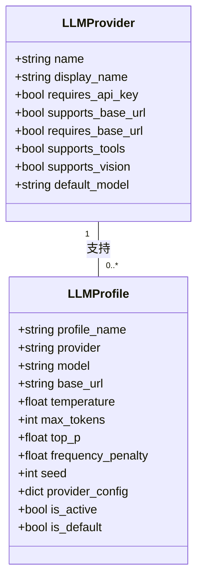
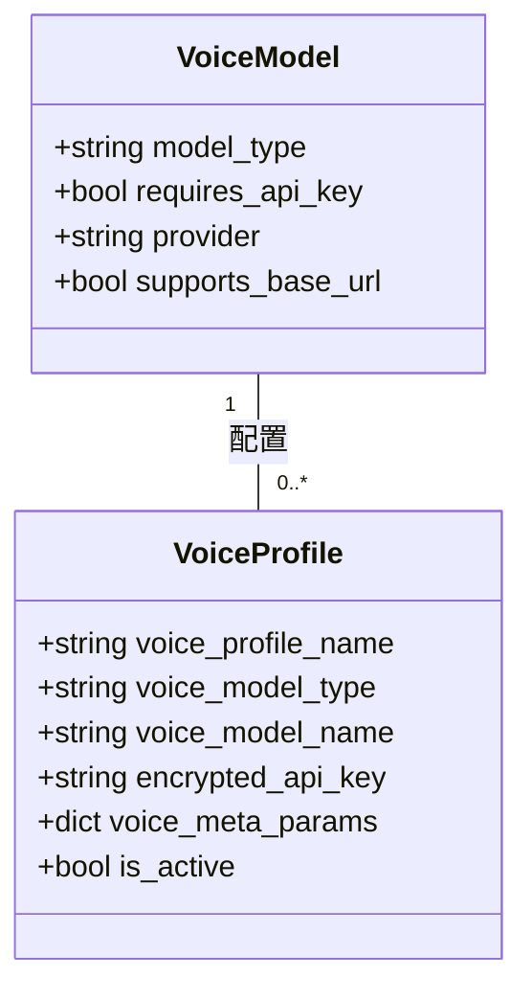
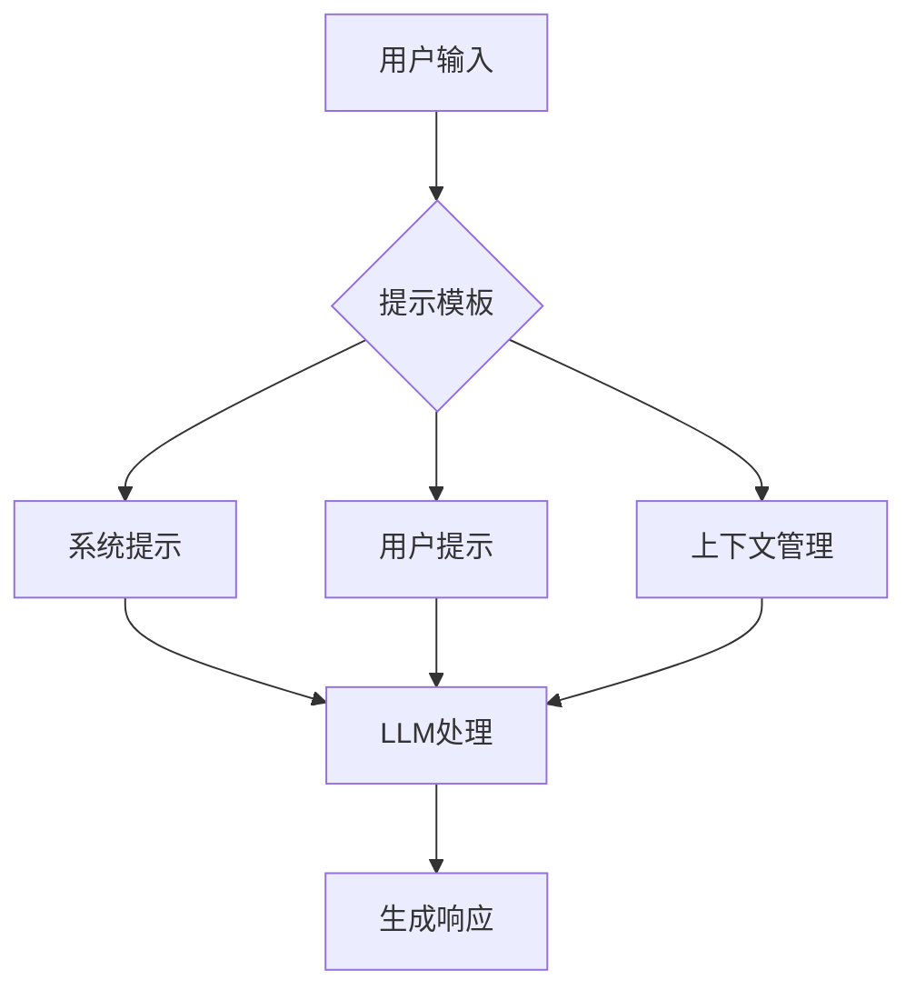
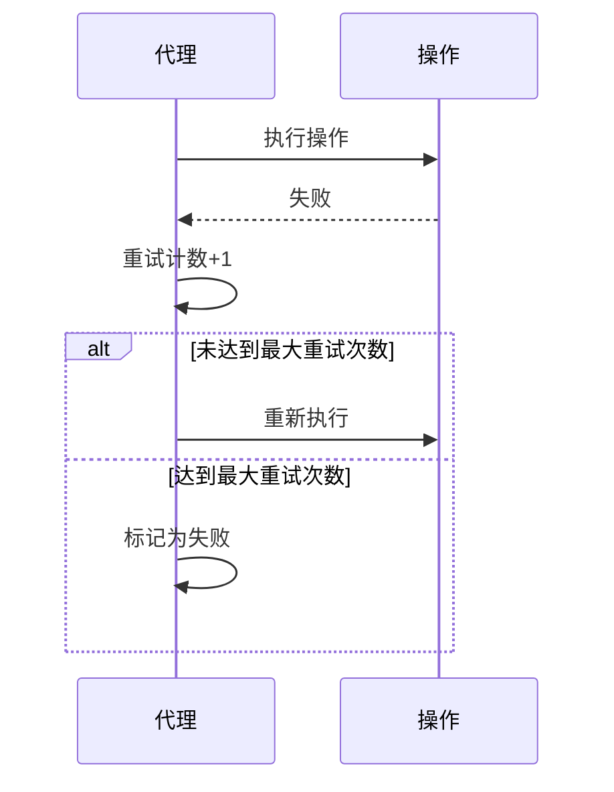
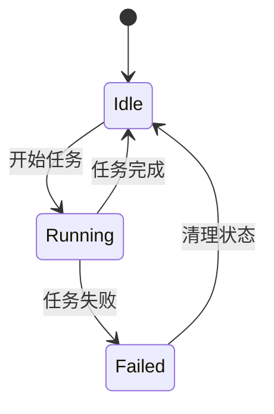
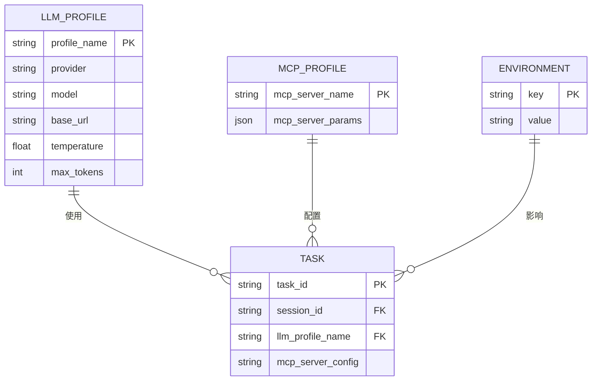
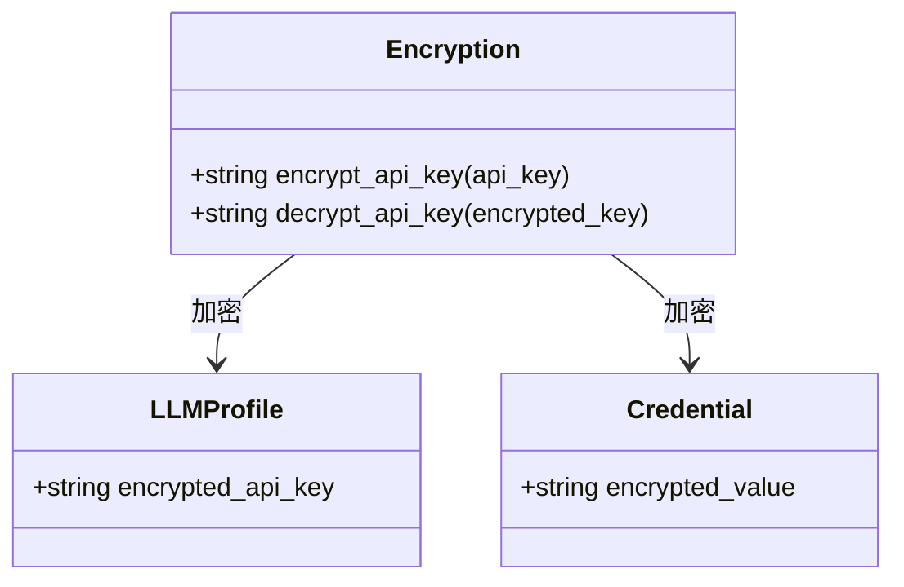
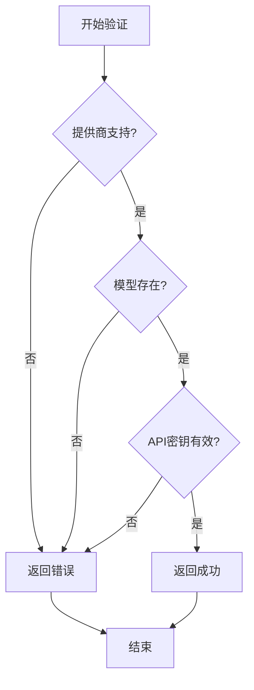

# 配置管理

<cite>
**本文档引用的文件**
- [llm_config.py](file://vibe_surf/backend/llm_config.py)
- [voice_model_config.py](file://vibe_surf/backend/voice_model_config.py)
- [llm_factory.py](file://vibe_surf/backend/utils/llm_factory.py)
- [shared_state.py](file://vibe_surf/backend/shared_state.py)
- [models.py](file://vibe_surf/backend/database/models.py)
- [config.py](file://vibe_surf/backend/api/config.py)
- [queries.py](file://vibe_surf/backend/database/queries.py)
- [main.py](file://vibe_surf/backend/main.py)
</cite>

## 目录
1. [引言](#引言)
2. [代理配置选项](#代理配置选项)
3. [提示工程配置](#提示工程配置)
4. [代理行为参数调整](#代理行为参数调整)
5. [配置文件格式与环境变量](#配置文件格式与环境变量)
6. [配置最佳实践](#配置最佳实践)
7. [配置验证与调试](#配置验证与调试)
8. [总结](#总结)

## 引言

本文档全面介绍VibeSurf代理系统的配置管理机制。系统通过集中化的配置管理，支持多种LLM提供商、语音模型和工具集成。配置系统基于数据库存储，提供API接口进行管理，并通过加密机制保护敏感信息。核心配置包括LLM配置文件、MCP（Model Context Protocol）配置文件和环境变量管理，确保系统安全性和灵活性。

**Section sources**
- [main.py](file://vibe_surf/backend/main.py#L1-L794)
- [shared_state.py](file://vibe_surf/backend/shared_state.py#L1-L1111)

## 代理配置选项

### LLM选择与参数配置

系统支持多种LLM提供商，包括OpenAI、Anthropic、Google Gemini、Azure OpenAI、Groq、Ollama等。每个提供商都有其支持的模型列表和特定的元数据配置。

**Diagram sources**
- [llm_config.py](file://vibe_surf/backend/llm_config.py#L1-L226)
- [models.py](file://vibe_surf/backend/database/models.py#L57-L93)

#### 核心参数说明

- **LLM选择**: 通过`provider`字段指定LLM提供商，如`openai`、`anthropic`等
- **温度参数 (temperature)**: 控制输出的随机性，值越高输出越随机，通常范围在0.0-1.0之间
- **最大token数 (max_tokens)**: 限制模型生成的最大token数量
- **top_p**: 核采样参数，控制生成时考虑的词汇概率累积
- **频率惩罚 (frequency_penalty)**: 抑制重复词汇的出现
- **种子 (seed)**: 用于确保结果的可重现性

这些参数在`LLMProfile`模型中定义，通过数据库进行持久化存储。系统提供API接口进行配置文件的创建、更新和删除操作。

**Section sources**
- [llm_config.py](file://vibe_surf/backend/llm_config.py#L1-L226)
- [models.py](file://vibe_surf/backend/database/models.py#L57-L93)
- [llm_factory.py](file://vibe_surf/backend/utils/llm_factory.py#L1-L275)

### 语音模型配置

系统支持多种语音识别模型，包括Qwen-ASR、OpenAI-ASR和Gemini-ASR。语音模型配置存储在`VOICE_MODELS`字典中，包含模型类型、提供商和配置要求等信息。

**Diagram sources**
- [voice_model_config.py](file://vibe_surf/backend/voice_model_config.py#L1-L25)
- [models.py](file://vibe_surf/backend/database/models.py#L29-L56)

## 提示工程配置

### 系统提示与用户提示

系统通过提示模板进行提示工程配置。提示模板存储在`prompts`目录下的Python文件中，如`report_writer_prompt.py`和`vibe_surf_prompt.py`。这些提示模板定义了代理的行为模式和响应格式。

**Diagram sources**
- [vibe_surf/agents/prompts/report_writer_prompt.py](file://vibe_surf/agents/prompts/report_writer_prompt.py)
- [vibe_surf/agents/prompts/vibe_surf_prompt.py](file://vibe_surf/agents/prompts/vibe_surf_prompt.py)

### 上下文管理策略

上下文管理通过会话ID和任务元数据实现。每个任务都有唯一的会话ID，用于跟踪对话历史和上下文信息。系统在执行任务时，会将相关的上下文信息传递给LLM，确保生成的响应具有连贯性。

**Section sources**
- [shared_state.py](file://vibe_surf/backend/shared_state.py#L58-L60)
- [models.py](file://vibe_surf/backend/database/models.py#L94-L137)

## 代理行为参数调整

### 重试策略

系统通过`max_retries_per_action`参数控制每个操作的最大重试次数，默认值为3次。当操作失败时，系统会自动重试，直到达到最大重试次数或操作成功。

**Diagram sources**
- [schemas.py](file://vibe_surf/backend/database/schemas.py#L60-L74)
- [shared_state.py](file://vibe_surf/backend/shared_state.py#L255-L289)

### 超时设置

系统通过`timeout`参数设置MCP服务器的超时时间。超时设置确保长时间运行的操作不会阻塞系统，提高系统的稳定性和响应性。

### 并发控制

系统采用单任务执行模型，确保同一时间只有一个任务在运行。这种设计避免了资源竞争和状态冲突，简化了并发控制。

**Diagram sources**
- [main.py](file://vibe_surf/backend/main.py#L58-L63)
- [shared_state.py](file://vibe_surf/backend/shared_state.py#L58-L60)

## 配置文件格式与环境变量

### 配置文件格式

系统使用JSON格式存储环境变量配置。配置文件`envs.json`位于工作空间目录中，包含浏览器执行路径、用户数据目录、VibeSurf扩展路径等环境变量。

**Diagram sources**
- [shared_state.py](file://vibe_surf/backend/shared_state.py#L47-L53)
- [models.py](file://vibe_surf/backend/database/models.py)

### 环境变量配置指南

环境变量通过`shared_state.py`中的`envs`字典进行管理。系统在启动时加载`envs.json`文件，并将环境变量设置到系统环境中。用户可以通过API接口更新环境变量。

**Section sources**
- [shared_state.py](file://vibe_surf/backend/shared_state.py#L47-L53)
- [config.py](file://vibe_surf/backend/api/config.py#L690-L762)

## 配置最佳实践

### 性能优化配置

- 使用默认模型进行常规任务，以减少API调用延迟
- 合理设置`max_tokens`参数，避免不必要的长文本生成
- 启用LLM缓存，减少重复请求的处理时间

### 成本控制配置

- 选择性价比高的LLM提供商和模型
- 设置合理的`temperature`和`top_p`参数，减少无效生成
- 监控API调用次数和token使用量

### 安全配置

- API密钥通过MAC地址加密存储，确保安全性
- 敏感信息不直接存储在配置中，而是通过加密字段保存
- 提供商配置支持HTTPS连接，确保数据传输安全

**Diagram sources**
- [utils/encryption.py](file://vibe_surf/backend/utils/encryption.py)
- [models.py](file://vibe_surf/backend/database/models.py#L57-L93)

## 配置验证与调试

### 配置验证方法

系统提供配置验证API，用于检查LLM配置的有效性。验证方法包括检查提供商是否支持、模型是否存在、API密钥是否有效等。

**Diagram sources**
- [llm_factory.py](file://vibe_surf/backend/utils/llm_factory.py#L222-L243)
- [config.py](file://vibe_surf/backend/api/config.py#L585-L643)

### 调试方法

- 查看系统日志，定位配置相关错误
- 使用健康检查API验证系统状态
- 检查数据库中的配置记录，确保配置正确保存

**Section sources**
- [main.py](file://vibe_surf/backend/main.py#L649-L659)
- [llm_factory.py](file://vibe_surf/backend/utils/llm_factory.py#L217-L219)

## 总结

VibeSurf代理系统的配置管理提供了全面的LLM选择、参数调整和提示工程功能。通过数据库持久化存储配置，系统实现了配置的集中管理和安全保护。配置系统支持动态更新，允许在运行时切换LLM配置文件和工具配置。建议用户根据具体需求选择合适的配置参数，并遵循安全最佳实践，确保系统的稳定性和安全性。