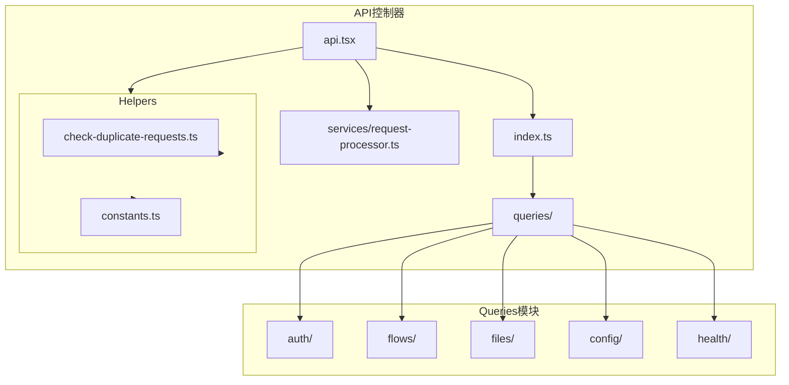
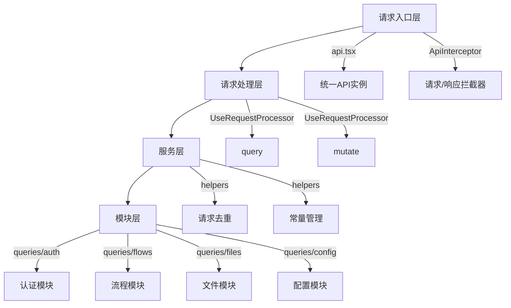
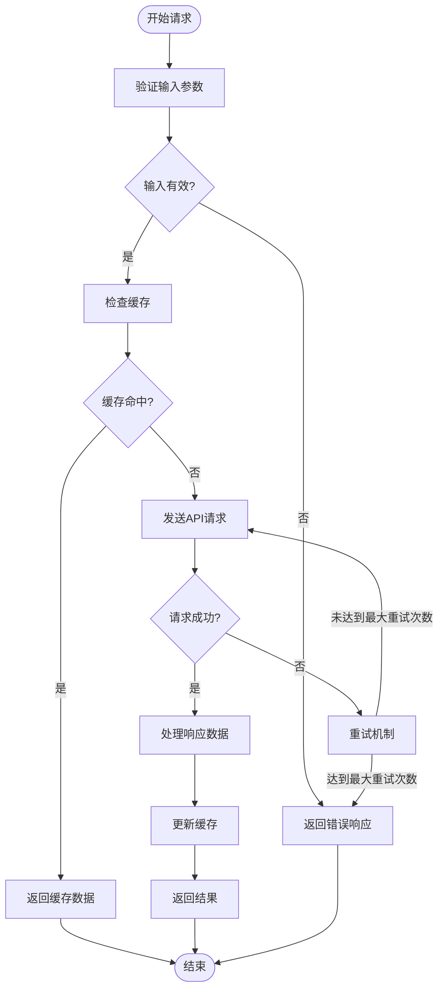
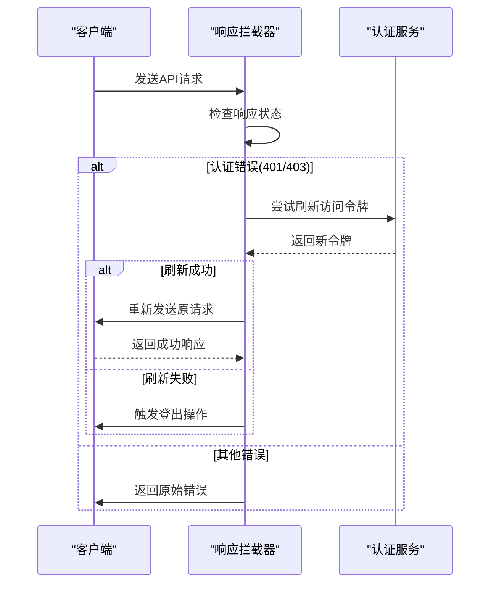
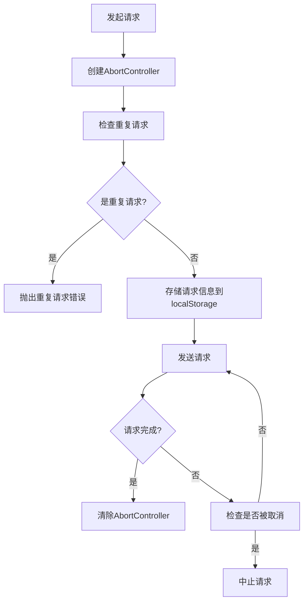
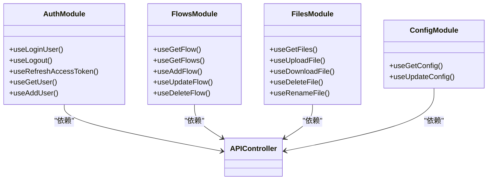

# API控制器

<cite>
**本文档中引用的文件**   
- [api.tsx](file://vibe_surf/frontend/src/controllers/API/api.tsx)
- [request-processor.ts](file://vibe_surf/frontend/src/controllers/API/services/request-processor.ts)
- [check-duplicate-requests.ts](file://vibe_surf/frontend/src/controllers/API/helpers/check-duplicate-requests.ts)
- [constants.ts](file://vibe_surf/frontend/src/controllers/API/helpers/constants.ts)
- [index.ts](file://vibe_surf/frontend/src/controllers/API/index.ts)
- [vibesurf.py](file://vibe_surf/backend/api/vibesurf.py)
- [use-post-login-user.ts](file://vibe_surf/frontend/src/controllers/API/queries/auth/use-post-login-user.ts)
- [use-get-flow.ts](file://vibe_surf/frontend/src/controllers/API/queries/flows/use-get-flow.ts)
- [use-post-upload-file.ts](file://vibe_surf/frontend/src/controllers/API/queries/files/use-post-upload-file.ts)
</cite>

## 目录
1. [简介](#简介)
2. [项目结构](#项目结构)
3. [核心组件](#核心组件)
4. [架构概述](#架构概述)
5. [详细组件分析](#详细组件分析)
6. [依赖分析](#依赖分析)
7. [性能考虑](#性能考虑)
8. [故障排除指南](#故障排除指南)
9. [结论](#结论)
10. [附录](#附录)（如有必要）

## 简介
本文档详细描述了VibeSurf前端API控制器的架构设计和模块化组织方式。API控制器作为前端与后端通信的核心枢纽，通过统一的api.tsx文件管理所有API请求入口，实现了请求封装、错误处理、认证拦截和请求取消等关键功能。文档将深入分析控制器的分层结构，解释不同API模块（如flows、files、auth）的组织原则和命名规范，并结合后端API路由说明前后端接口的对应关系。此外，文档还提供了API控制器的扩展指南，阐述了请求去重策略和并发控制机制，以确保系统的稳定性和可靠性。

## 项目结构
VibeSurf前端API控制器采用模块化设计，位于`vibe_surf/frontend/src/controllers/API/`目录下。该目录包含多个子目录和核心文件，形成了清晰的层次结构。控制器通过`api.tsx`作为统一入口，`services/request-processor.ts`提供请求处理服务，`helpers/`目录包含辅助工具，`queries/`目录按功能模块组织具体的API查询实现。



**图源**
- [api.tsx](file://vibe_surf/frontend/src/controllers/API/api.tsx)
- [request-processor.ts](file://vibe_surf/frontend/src/controllers/API/services/request-processor.ts)
- [helpers/](file://vibe_surf/frontend/src/controllers/API/helpers/)
- [queries/](file://vibe_surf/frontend/src/controllers/API/queries/)

**章节来源**
- [api.tsx](file://vibe_surf/frontend/src/controllers/API/api.tsx)
- [request-processor.ts](file://vibe_surf/frontend/src/controllers/API/services/request-processor.ts)

## 核心组件
API控制器的核心组件包括`api.tsx`、`request-processor.ts`和`check-duplicate-requests.ts`。`api.tsx`是整个API系统的入口，负责创建Axios实例、配置请求拦截器和响应拦截器。`request-processor.ts`基于React Query封装了统一的请求处理逻辑，提供了查询和突变的标准化接口。`check-duplicate-requests.ts`实现了请求去重策略，防止在短时间内发送重复的请求。

**章节来源**
- [api.tsx](file://vibe_surf/frontend/src/controllers/API/api.tsx)
- [request-processor.ts](file://vibe_surf/frontend/src/controllers/API/services/request-processor.ts)
- [check-duplicate-requests.ts](file://vibe_surf/frontend/src/controllers/API/helpers/check-duplicate-requests.ts)

## 架构概述
VibeSurf前端API控制器采用了分层架构设计，主要包括请求入口层、请求处理层、服务层和模块层。请求入口层由`api.tsx`构成，负责统一管理所有API请求。请求处理层由`request-processor.ts`实现，基于React Query提供标准化的查询和突变接口。服务层包含各种辅助工具，如请求去重和常量管理。模块层按功能划分，如auth、flows、files等，每个模块包含具体的API实现。



**图源**
- [api.tsx](file://vibe_surf/frontend/src/controllers/API/api.tsx)
- [request-processor.ts](file://vibe_surf/frontend/src/controllers/API/services/request-processor.ts)
- [helpers/](file://vibe_surf/frontend/src/controllers/API/helpers/)
- [queries/](file://vibe_surf/frontend/src/controllers/API/queries/)

## 详细组件分析
本节将深入分析API控制器的各个关键组件，包括请求封装、错误处理、认证拦截、请求取消机制以及不同API模块的组织原则。

### 请求封装与处理机制
API控制器通过`UseRequestProcessor`提供统一的请求处理接口。该处理器封装了React Query的`useQuery`和`useMutation`，并添加了重试机制和默认配置。查询请求默认重试5次，突变请求默认重试3次，重试间隔采用指数退避算法。



**图源**
- [request-processor.ts](file://vibe_surf/frontend/src/controllers/API/services/request-processor.ts)

**章节来源**
- [request-processor.ts](file://vibe_surf/frontend/src/controllers/API/services/request-processor.ts)

### 错误处理与认证拦截
API控制器实现了完善的错误处理和认证拦截机制。通过Axios的响应拦截器，系统能够统一处理401和403等认证错误。当检测到认证错误时，系统会尝试刷新访问令牌，如果刷新失败则自动登出用户。



**图源**
- [api.tsx](file://vibe_surf/frontend/src/controllers/API/api.tsx)

**章节来源**
- [api.tsx](file://vibe_surf/frontend/src/controllers/API/api.tsx)

### 请求取消与去重机制
API控制器实现了请求取消和去重机制，以提高系统性能和用户体验。通过AbortController，系统能够在组件卸载时自动取消正在进行的请求。请求去重机制通过localStorage存储最近请求的信息，防止在短时间内发送重复的GET请求。



**图源**
- [api.tsx](file://vibe_surf/frontend/src/controllers/API/api.tsx)
- [check-duplicate-requests.ts](file://vibe_surf/frontend/src/controllers/API/helpers/check-duplicate-requests.ts)

**章节来源**
- [api.tsx](file://vibe_surf/frontend/src/controllers/API/api.tsx)
- [check-duplicate-requests.ts](file://vibe_surf/frontend/src/controllers/API/helpers/check-duplicate-requests.ts)

### API模块组织原则
API控制器按功能模块组织，每个模块对应后端的一个API端点。模块命名遵循清晰的规范，如`auth`对应认证相关API，`flows`对应流程管理API，`files`对应文件管理API。每个模块通过index.ts文件导出所有查询函数，实现了良好的封装性。



**图源**
- [queries/auth/](file://vibe_surf/frontend/src/controllers/API/queries/auth/)
- [queries/flows/](file://vibe_surf/frontend/src/controllers/API/queries/flows/)
- [queries/files/](file://vibe_surf/frontend/src/controllers/API/queries/files/)
- [queries/config/](file://vibe_surf/frontend/src/controllers/API/queries/config/)

**章节来源**
- [queries/auth/](file://vibe_surf/frontend/src/controllers/API/queries/auth/)
- [queries/flows/](file://vibe_surf/frontend/src/controllers/API/queries/flows/)
- [queries/files/](file://vibe_surf/frontend/src/controllers/API/queries/files/)
- [queries/config/](file://vibe_surf/frontend/src/controllers/API/queries/config/)

## 依赖分析
API控制器依赖于多个外部库和内部模块。主要外部依赖包括Axios用于HTTP请求，React Query用于状态管理，fetch-intercept用于拦截全局fetch请求。内部依赖包括自定义的认证存储、工具函数和常量定义。

```mermaid
graph TD
APIController[API控制器] --> Axios
APIController --> ReactQuery
APIController --> FetchIntercept
APIController --> AuthStore
APIController --> UtilityStore
APIController --> CustomHeaders
APIController --> Constants
Axios[axios] --> HTTP
ReactQuery[@tanstack/react-query] --> StateManagement
FetchIntercept[fetch-intercept] --> GlobalFetch
AuthStore[authStore] --> Authentication
UtilityStore[utilityStore] --> Utilities
CustomHeaders[custom-api-headers] --> Headers
Constants[constants] --> Configuration
```

**图源**
- [api.tsx](file://vibe_surf/frontend/src/controllers/API/api.tsx)
- [request-processor.ts](file://vibe_surf/frontend/src/controllers/API/services/request-processor.ts)

**章节来源**
- [api.tsx](file://vibe_surf/frontend/src/controllers/API/api.tsx)
- [request-processor.ts](file://vibe_surf/frontend/src/controllers/API/services/request-processor.ts)

## 性能考虑
API控制器在设计时充分考虑了性能优化。通过React Query的缓存机制，减少了不必要的网络请求。请求去重机制避免了重复请求造成的资源浪费。指数退避重试策略在保证可靠性的同时，避免了对服务器造成过大压力。此外，通过AbortController及时取消不必要的请求，释放了系统资源。

## 故障排除指南
当API控制器出现问题时，可以按照以下步骤进行排查：
1. 检查网络连接是否正常
2. 验证API端点URL是否正确
3. 检查认证令牌是否有效
4. 查看浏览器控制台是否有错误信息
5. 检查请求参数是否符合预期
6. 验证后端服务是否正常运行

**章节来源**
- [api.tsx](file://vibe_surf/frontend/src/controllers/API/api.tsx)
- [request-processor.ts](file://vibe_surf/frontend/src/controllers/API/services/request-processor.ts)

## 结论
VibeSurf前端API控制器通过模块化设计和分层架构，实现了高效、可靠的前后端通信。控制器统一管理所有API请求入口，提供了完善的请求封装、错误处理、认证拦截和请求取消机制。通过合理的模块组织和命名规范，提高了代码的可维护性和可扩展性。请求去重和并发控制机制确保了系统的稳定性和性能。整体设计充分考虑了用户体验和系统可靠性，为VibeSurf应用的稳定运行提供了坚实的基础。

## 附录
### 前后端API对应关系表
| 前端模块 | 前端API | 后端路由 | 后端文件 |
|---------|--------|---------|--------|
| 认证 | /login | /api/v1/login | auth.py |
| 认证 | /logout | /api/v1/logout | auth.py |
| 认证 | /refresh | /api/v1/refresh | auth.py |
| 流程 | /flows | /api/v1/flows | flows.py |
| 流程 | /flows/{id} | /api/v1/flows/{id} | flows.py |
| 文件 | /files | /api/v1/files | files.py |
| 文件 | /files/upload | /api/v1/files/upload | files.py |
| 配置 | /config | /api/v1/config | config.py |
| VibeSurf | /vibesurf/status | /vibesurf/status | vibesurf.py |
| VibeSurf | /vibesurf/verify-key | /vibesurf/verify-key | vibesurf.py |

**章节来源**
- [vibesurf.py](file://vibe_surf/backend/api/vibesurf.py)
- [api.tsx](file://vibe_surf/frontend/src/controllers/API/api.tsx)