# API集成

<cite>
**本文档中引用的文件**  
- [api.tsx](file://vibe_surf/frontend/src/controllers/API/api.tsx)
- [index.ts](file://vibe_surf/frontend/src/controllers/API/index.ts)
- [request-processor.ts](file://vibe_surf/frontend/src/controllers/API/services/request-processor.ts)
- [constants.ts](file://vibe_surf/frontend/src/controllers/API/helpers/constants.ts)
- [check-duplicate-requests.ts](file://vibe_surf/frontend/src/controllers/API/helpers/check-duplicate-requests.ts)
- [use-get-flow.ts](file://vibe_surf/frontend/src/controllers/API/queries/flows/use-get-flow.ts)
- [use-post-upload-file.ts](file://vibe_surf/frontend/src/controllers/API/queries/files/use-post-upload-file.ts)
- [use-post-login-user.ts](file://vibe_surf/frontend/src/controllers/API/queries/auth/use-post-login-user.ts)
- [use-get-builds-polling-mutation.ts](file://vibe_surf/frontend/src/controllers/API/queries/_builds/use-get-builds-polling-mutation.ts)
- [use-get-messages-polling.ts](file://vibe_surf/frontend/src/controllers/API/queries/messages/use-get-messages-polling.ts)
- [use-get-health.ts](file://vibe_surf/frontend/src/controllers/API/queries/health/use-get-health.ts)
</cite>

## 目录
1. [简介](#简介)
2. [项目结构](#项目结构)
3. [核心组件](#核心组件)
4. [架构概述](#架构概述)
5. [详细组件分析](#详细组件分析)
6. [依赖分析](#依赖分析)
7. [性能考虑](#性能考虑)
8. [故障排除指南](#故障排除指南)
9. [结论](#结论)

## 简介
VibeSurf前端通过RESTful API与后端服务进行通信，实现了模块化的API控制器设计、分层的数据服务架构以及实时数据同步机制。前端采用React Query进行状态管理，结合Axios实现HTTP请求封装，并通过自定义拦截器处理认证和错误。API调用按功能模块组织，包括flows、files、users等，支持请求去重、自动重试和轮询策略。系统实现了基于JWT的认证机制，并通过WebSocket和轮询实现数据实时同步。

## 项目结构
VibeSurf前端API集成采用分层架构，主要分为API控制器、查询服务和数据服务三层。API控制器负责请求封装和错误处理，查询服务使用React Query管理数据获取和缓存，数据服务层处理业务逻辑和状态管理。

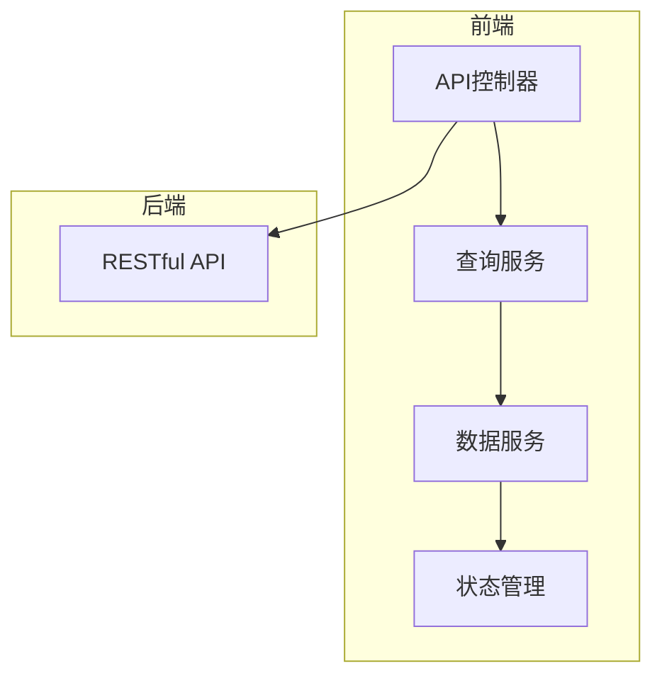

**图示来源**
- [api.tsx](file://vibe_surf/frontend/src/controllers/API/api.tsx)
- [request-processor.ts](file://vibe_surf/frontend/src/controllers/API/services/request-processor.ts)

**本节来源**
- [api.tsx](file://vibe_surf/frontend/src/controllers/API/api.tsx)
- [index.ts](file://vibe_surf/frontend/src/controllers/API/index.ts)

## 核心组件
VibeSurf前端API集成的核心组件包括API控制器、查询服务和数据服务。API控制器使用Axios进行HTTP请求封装，实现了请求拦截、认证处理和错误管理。查询服务基于React Query，提供数据获取、缓存和同步功能。数据服务层负责业务逻辑处理和状态管理，通过Zustand进行全局状态管理。

**本节来源**
- [api.tsx](file://vibe_surf/frontend/src/controllers/API/api.tsx)
- [request-processor.ts](file://vibe_surf/frontend/src/controllers/API/services/request-processor.ts)

## 架构概述
VibeSurf前端API集成采用分层架构设计，将API通信、数据获取和业务逻辑分离。API控制器负责与后端RESTful API通信，查询服务使用React Query管理数据获取和缓存，数据服务层处理业务逻辑并与状态管理库交互。

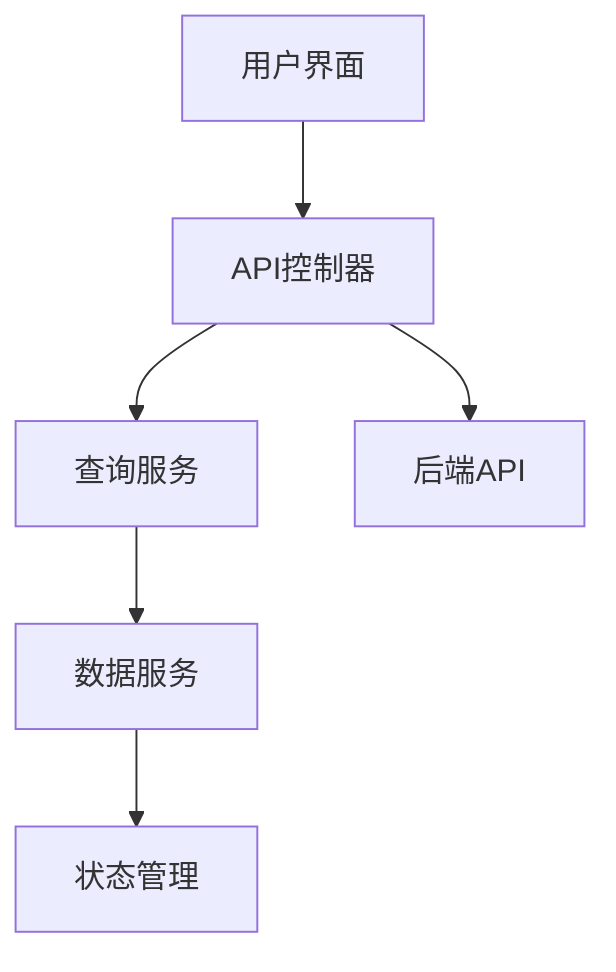

**图示来源**
- [api.tsx](file://vibe_surf/frontend/src/controllers/API/api.tsx)
- [request-processor.ts](file://vibe_surf/frontend/src/controllers/API/services/request-processor.ts)

## 详细组件分析

### API控制器分析
API控制器是VibeSurf前端与后端通信的核心组件，负责请求封装、认证处理和错误管理。

#### API控制器设计模式
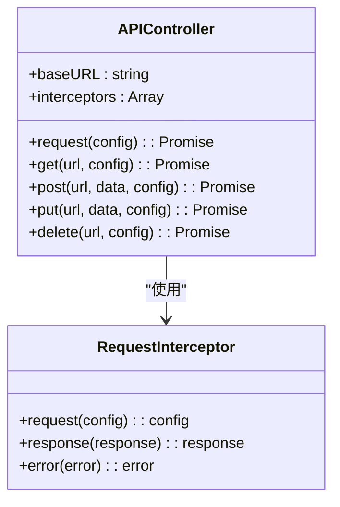

**图示来源**
- [api.tsx](file://vibe_surf/frontend/src/controllers/API/api.tsx)

#### API请求封装与错误处理
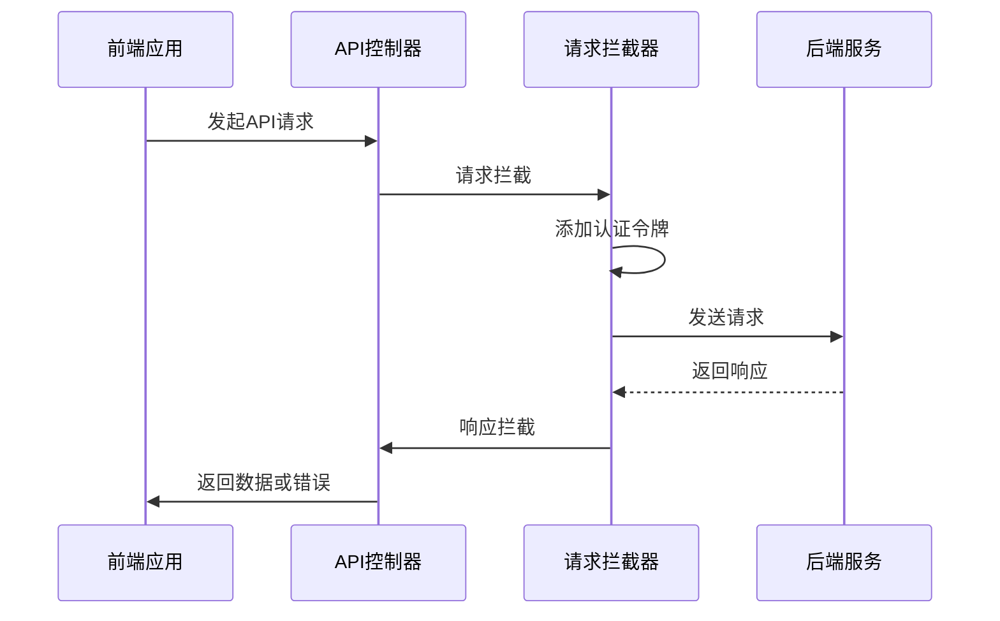

**图示来源**
- [api.tsx](file://vibe_surf/frontend/src/controllers/API/api.tsx)

#### 认证机制
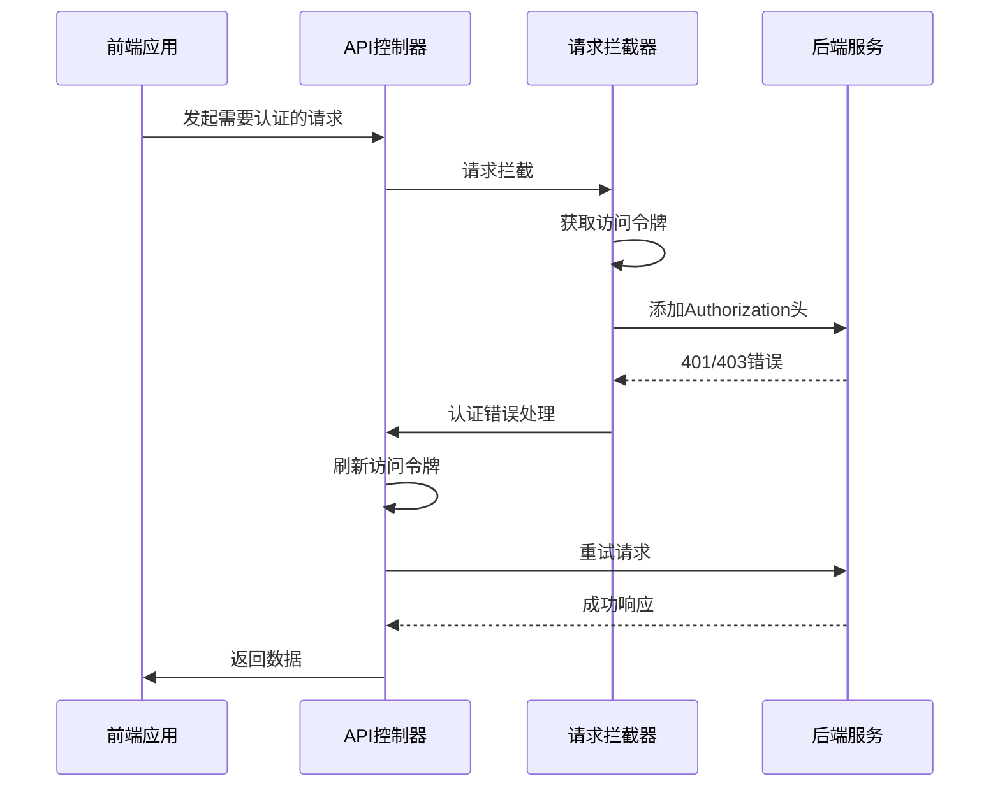

**图示来源**
- [api.tsx](file://vibe_surf/frontend/src/controllers/API/api.tsx)

**本节来源**
- [api.tsx](file://vibe_surf/frontend/src/controllers/API/api.tsx)
- [use-post-login-user.ts](file://vibe_surf/frontend/src/controllers/API/queries/auth/use-post-login-user.ts)

### 功能模块API调用分析
VibeSurf前端将API调用按功能模块组织，包括flows、files、users等模块。

#### Flows模块API调用
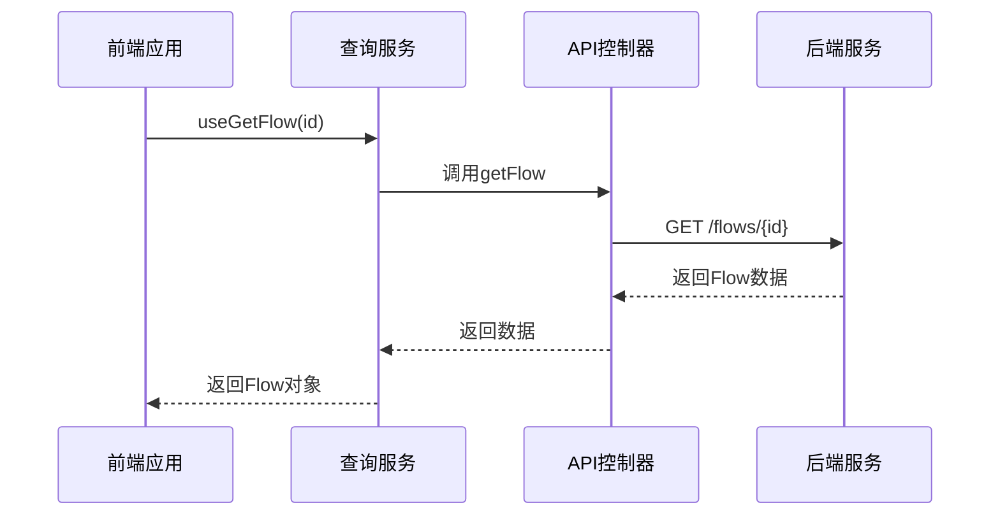

**图示来源**
- [use-get-flow.ts](file://vibe_surf/frontend/src/controllers/API/queries/flows/use-get-flow.ts)

#### Files模块API调用
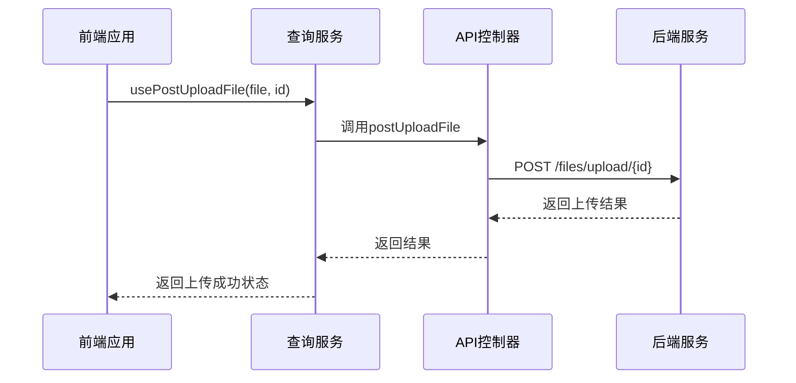

**图示来源**
- [use-post-upload-file.ts](file://vibe_surf/frontend/src/controllers/API/queries/files/use-post-upload-file.ts)

**本节来源**
- [use-get-flow.ts](file://vibe_surf/frontend/src/controllers/API/queries/flows/use-get-flow.ts)
- [use-post-upload-file.ts](file://vibe_surf/frontend/src/controllers/API/queries/files/use-post-upload-file.ts)

### 查询服务与数据服务分层架构
VibeSurf前端采用查询服务和数据服务的分层架构，实现关注点分离。

#### 分层架构设计
```mermaid
graph TD
A[用户界面] --> B[查询服务]
B --> C[数据服务]
C --> D[状态管理]
B --> E[API控制器]
E --> F[后端API]
class B,QueryService
class C,DataService
class E,APIController
```

**图示来源**
- [request-processor.ts](file://vibe_surf/frontend/src/controllers/API/services/request-processor.ts)

#### 查询服务实现
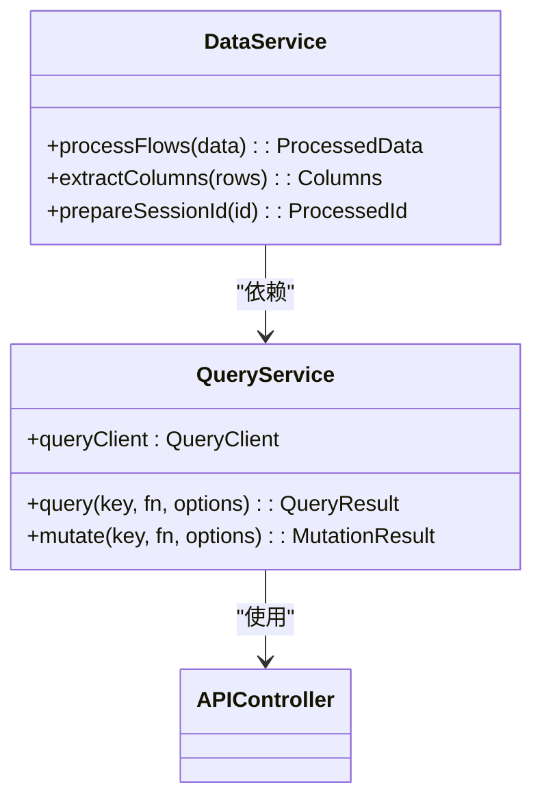

**图示来源**
- [request-processor.ts](file://vibe_surf/frontend/src/controllers/API/services/request-processor.ts)

**本节来源**
- [request-processor.ts](file://vibe_surf/frontend/src/controllers/API/services/request-processor.ts)
- [use-get-flow.ts](file://vibe_surf/frontend/src/controllers/API/queries/flows/use-get-flow.ts)

### 实时数据同步实现
VibeSurf前端通过轮询策略实现数据实时同步，支持构建状态和消息的实时更新。

#### 轮询策略实现
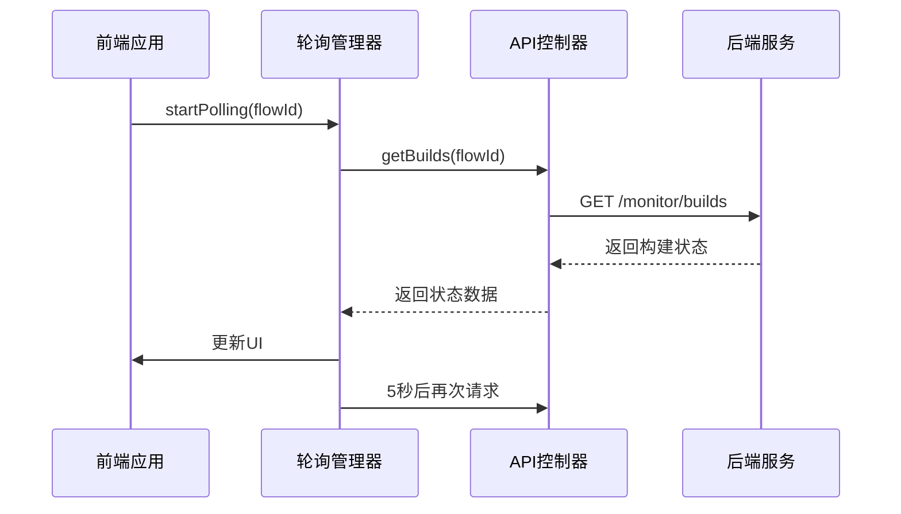

**图示来源**
- [use-get-builds-polling-mutation.ts](file://vibe_surf/frontend/src/controllers/API/queries/_builds/use-get-builds-polling-mutation.ts)

#### 消息轮询实现
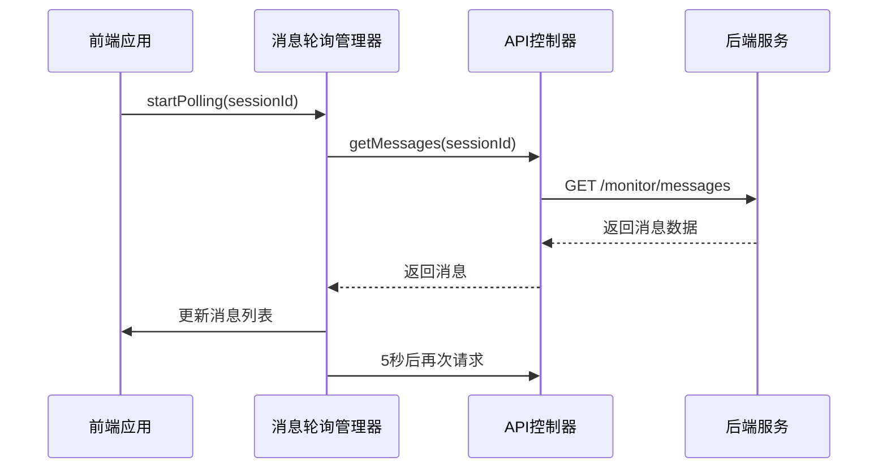

**图示来源**
- [use-get-messages-polling.ts](file://vibe_surf/frontend/src/controllers/API/queries/messages/use-get-messages-polling.ts)

**本节来源**
- [use-get-builds-polling-mutation.ts](file://vibe_surf/frontend/src/controllers/API/queries/_builds/use-get-builds-polling-mutation.ts)
- [use-get-messages-polling.ts](file://vibe_surf/frontend/src/controllers/API/queries/messages/use-get-messages-polling.ts)

### API响应缓存与数据预加载
VibeSurf前端通过React Query实现API响应缓存和数据预加载，提升用户体验。

#### 缓存策略
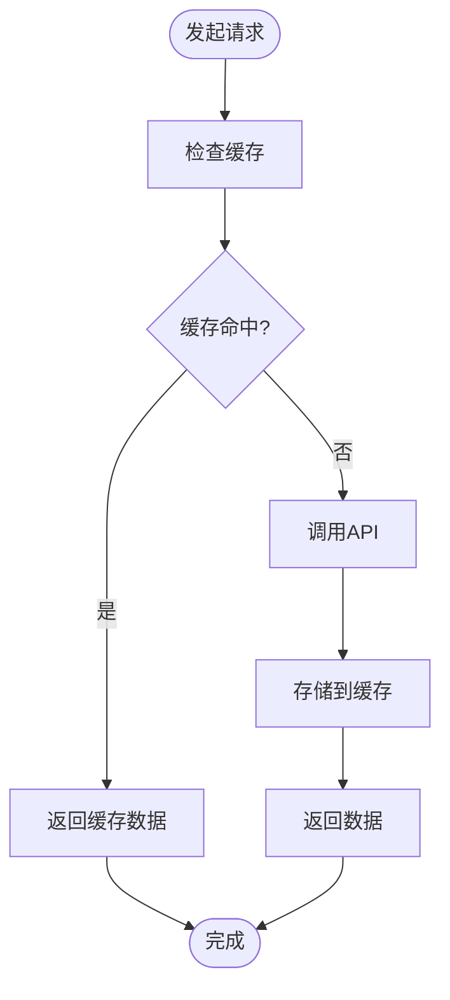

**图示来源**
- [request-processor.ts](file://vibe_surf/frontend/src/controllers/API/services/request-processor.ts)

#### 数据预加载
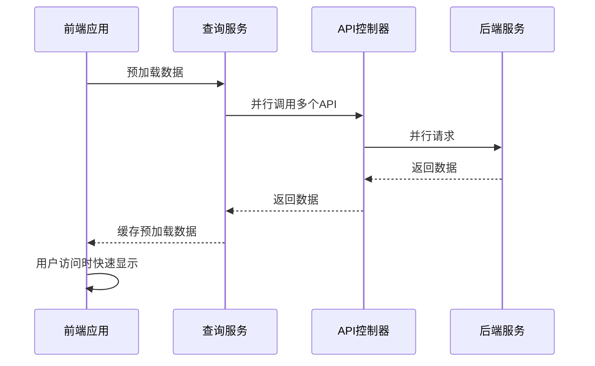

**图示来源**
- [request-processor.ts](file://vibe_surf/frontend/src/controllers/API/services/request-processor.ts)

**本节来源**
- [request-processor.ts](file://vibe_surf/frontend/src/controllers/API/services/request-processor.ts)
- [use-get-health.ts](file://vibe_surf/frontend/src/controllers/API/queries/health/use-get-health.ts)

## 依赖分析
VibeSurf前端API集成依赖于多个核心库和工具，包括Axios用于HTTP通信，React Query用于数据获取和缓存，Zustand用于状态管理。

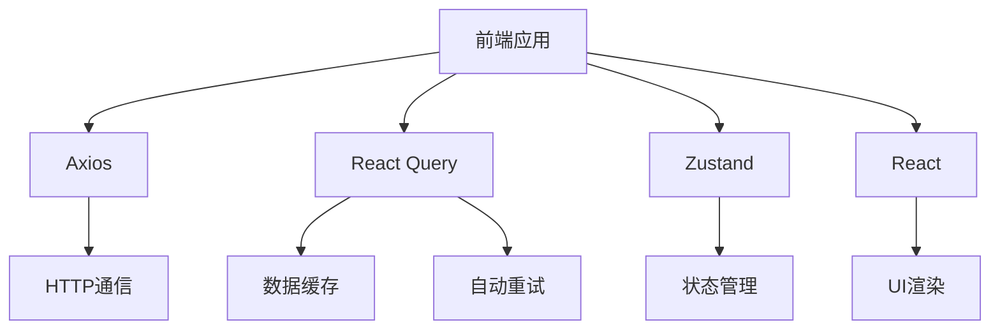

**图示来源**
- [api.tsx](file://vibe_surf/frontend/src/controllers/API/api.tsx)
- [request-processor.ts](file://vibe_surf/frontend/src/controllers/API/services/request-processor.ts)

**本节来源**
- [api.tsx](file://vibe_surf/frontend/src/controllers/API/api.tsx)
- [request-processor.ts](file://vibe_surf/frontend/src/controllers/API/services/request-processor.ts)

## 性能考虑
VibeSurf前端API集成在性能方面进行了多项优化，包括请求去重、自动重试、缓存策略和并行请求。

### 请求去重机制
前端实现了请求去重机制，避免在短时间内发送重复的GET请求，减少服务器负载。

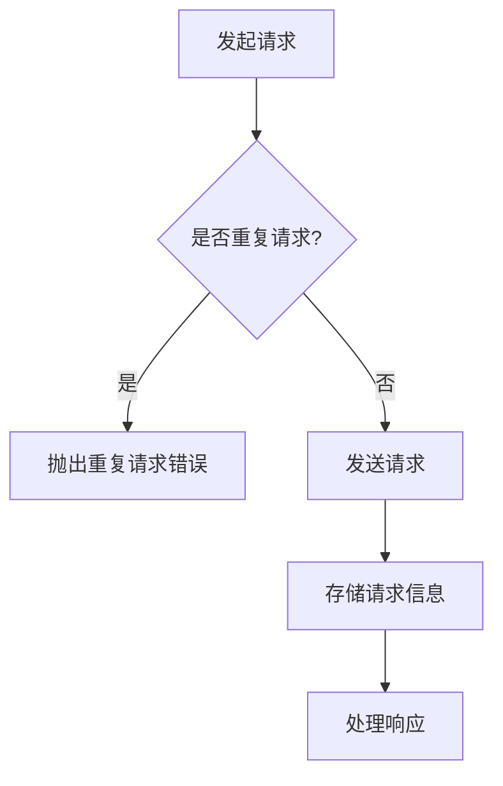

**图示来源**
- [check-duplicate-requests.ts](file://vibe_surf/frontend/src/controllers/API/helpers/check-duplicate-requests.ts)

### 自动重试机制
查询服务配置了自动重试机制，在请求失败时自动重试，提升系统可靠性。

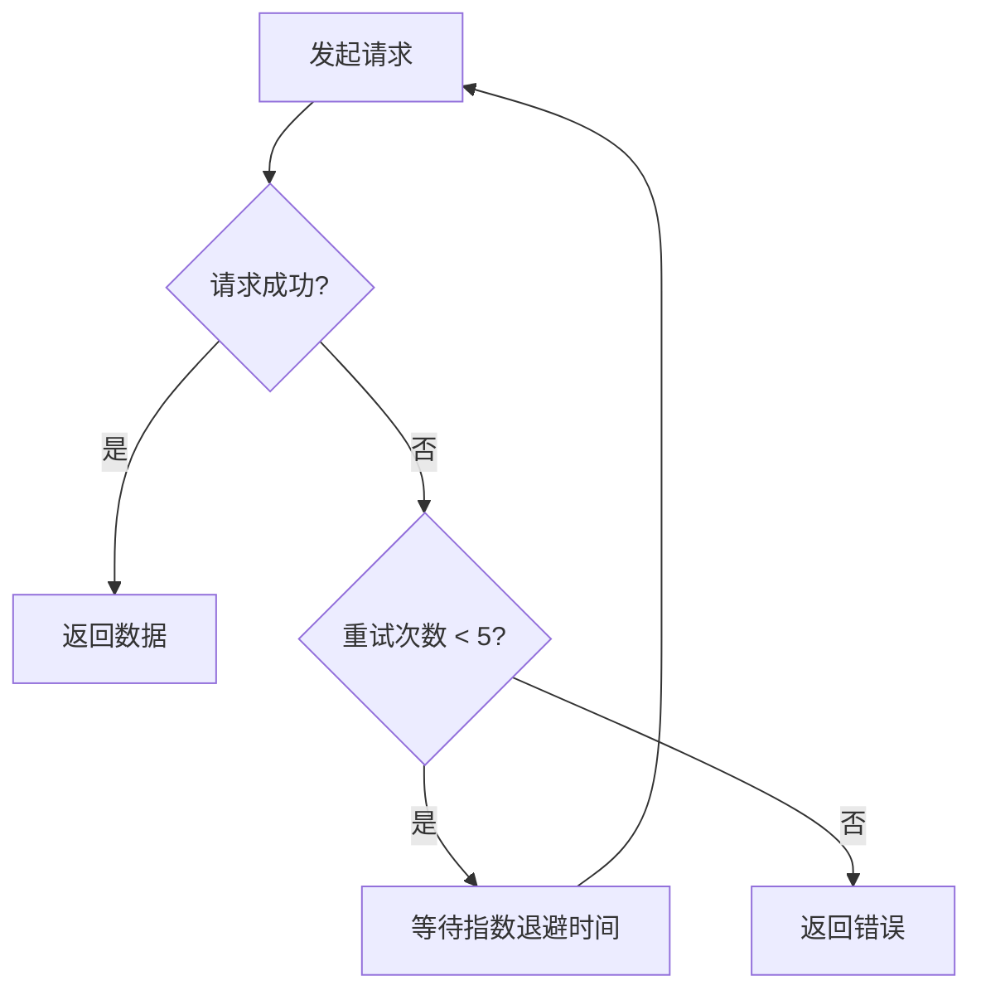

**图示来源**
- [request-processor.ts](file://vibe_surf/frontend/src/controllers/API/services/request-processor.ts)

**本节来源**
- [check-duplicate-requests.ts](file://vibe_surf/frontend/src/controllers/API/helpers/check-duplicate-requests.ts)
- [request-processor.ts](file://vibe_surf/frontend/src/controllers/API/services/request-processor.ts)

## 故障排除指南
### 常见问题及解决方案
1. **认证失败**：检查访问令牌是否过期，尝试重新登录
2. **请求超时**：检查网络连接，确认后端服务是否正常运行
3. **重复请求错误**：这是正常的行为，避免了不必要的重复请求
4. **轮询停止**：检查轮询间隔设置，确认是否达到停止条件

### 错误处理最佳实践
- 使用统一的错误处理机制
- 提供清晰的错误信息给用户
- 记录错误日志用于调试
- 实现优雅的降级策略

**本节来源**
- [api.tsx](file://vibe_surf/frontend/src/controllers/API/api.tsx)
- [use-get-health.ts](file://vibe_surf/frontend/src/controllers/API/queries/health/use-get-health.ts)

## 结论
VibeSurf前端API集成采用现代化的架构设计，通过分层架构、模块化组织和先进的状态管理技术，实现了高效、可靠的前后端通信。系统具备完善的认证机制、错误处理和实时数据同步功能，为用户提供流畅的使用体验。通过合理的缓存策略和性能优化，系统能够在保证功能完整性的同时，提供出色的性能表现。