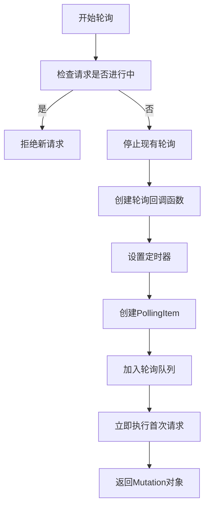
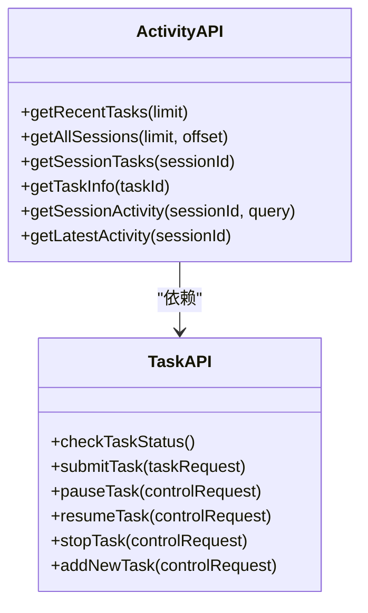
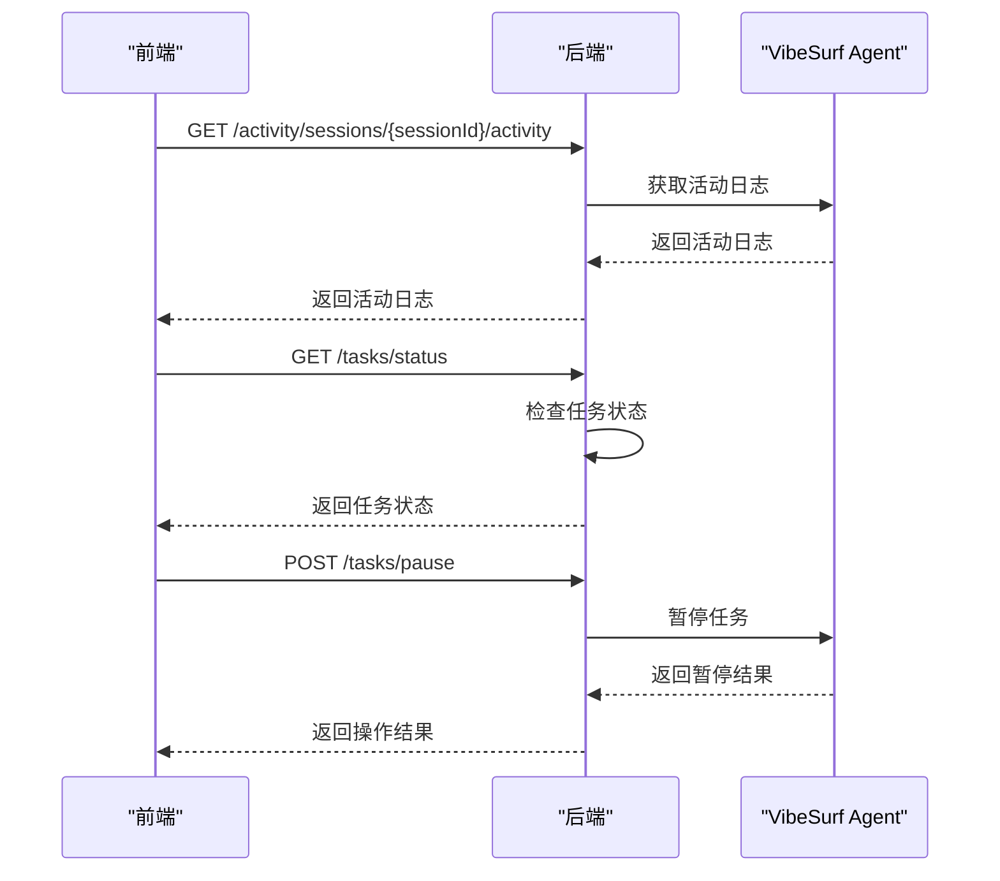
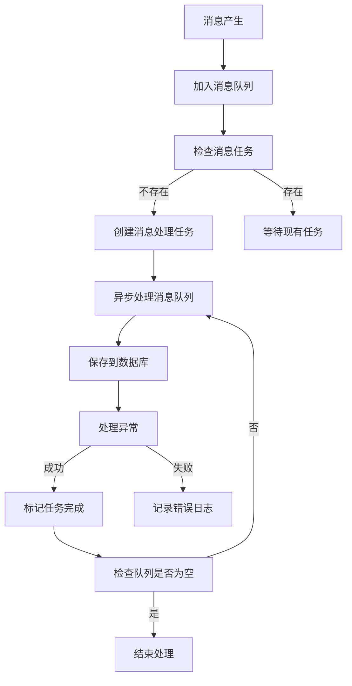
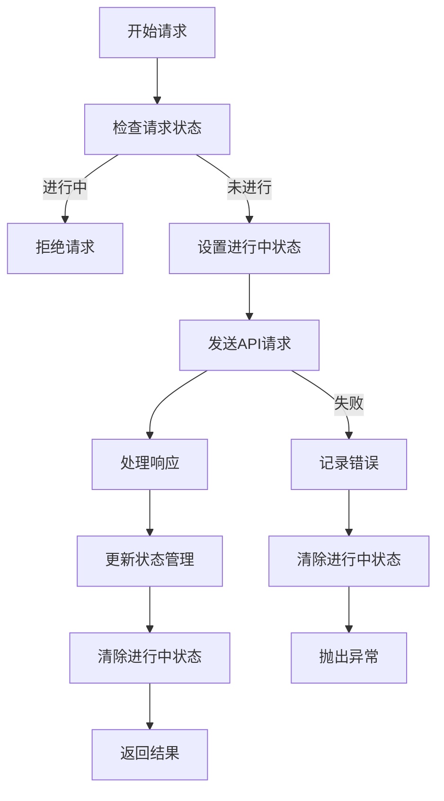
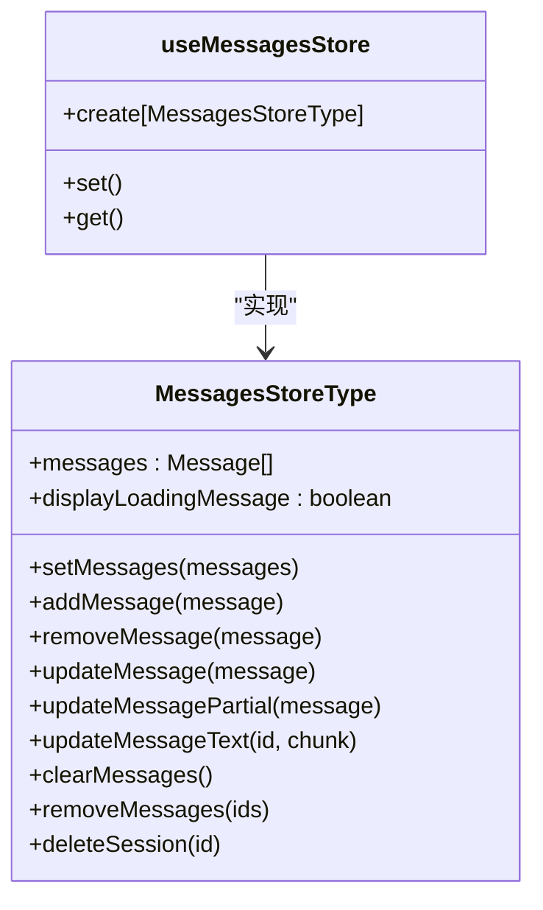
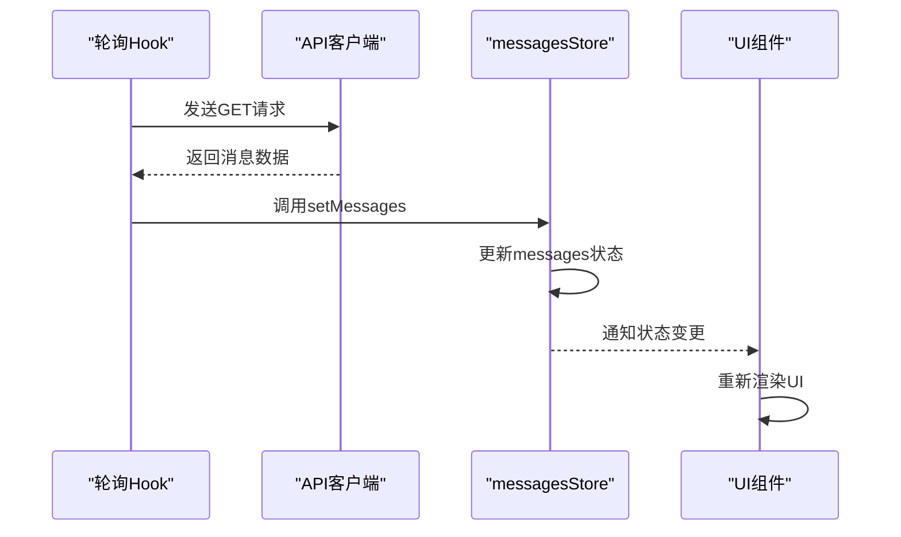

# 实时通信

<cite>
**本文档引用的文件**   
- [use-get-messages-polling.ts](file://vibe_surf/frontend/src/controllers/API/queries/messages/use-get-messages-polling.ts)
- [messagesStore.ts](file://vibe_surf/frontend/src/stores/messagesStore.ts)
- [activity.py](file://vibe_surf/backend/api/activity.py)
- [task.py](file://vibe_surf/backend/api/task.py)
- [api-client.js](file://vibe_surf/chrome_extension/scripts/api-client.js)
- [constants.ts](file://vibe_surf/frontend/src/controllers/API/helpers/constants.ts)
- [utils.ts](file://vibe_surf/frontend/src/utils/utils.ts)
</cite>

## 目录
1. [引言](#引言)
2. [基于轮询的消息同步系统](#基于轮询的消息同步系统)
3. [use-get-messages-polling Hook实现原理](#use-get-messages-polling-hook实现原理)
4. [任务状态实时更新机制](#任务状态实时更新机制)
5. [消息队列处理流程](#消息队列处理流程)
6. [频率控制与网络优化策略](#频率控制与网络优化策略)
7. [前端状态管理与数据传播](#前端状态管理与数据传播)
8. [调试方法与性能监控](#调试方法与性能监控)

## 引言
VibeSurf实时通信机制采用基于轮询的消息同步系统，通过前端Hook与后端API端点的协同工作，实现了任务状态的实时更新和消息的高效传递。系统通过activity和task API端点监控任务执行状态，并利用messagesStore在前端进行状态管理。本文档详细分析该实时通信机制的实现原理、性能优化策略和调试方法。

## 基于轮询的消息同步系统
VibeSurf的实时通信机制采用轮询（Polling）模式实现消息同步。前端通过定时向后端发送HTTP请求获取最新消息，确保用户界面与后端状态保持同步。系统默认轮询间隔为5秒（5000ms），通过`POLLING_INTERVAL`常量定义。

轮询系统包含以下核心组件：
- **MessagesPollingManager**：管理轮询队列和活动轮询任务
- **PollingItem**：表示单个轮询任务的数据结构
- **requestInProgressRef**：跟踪正在进行的请求，防止重复请求

系统通过`enqueuePolling`方法将轮询任务加入队列，并使用`startNextPolling`方法启动下一个轮询任务。当请求完成或需要停止时，通过`stopPoll`方法清除相关定时器和状态。

**Section sources**
- [use-get-messages-polling.ts](file://vibe_surf/frontend/src/controllers/API/queries/messages/use-get-messages-polling.ts#L35-L78)

## use-get-messages-polling Hook实现原理
`useGetMessagesPollingMutation` Hook是VibeSurf实时通信的核心组件，基于React Query的`UseMutationResult`实现。该Hook封装了轮询逻辑，提供了一致的API接口。

**Diagram sources**
- [use-get-messages-polling.ts](file://vibe_surf/frontend/src/controllers/API/queries/messages/use-get-messages-polling.ts#L80-L211)

Hook的主要功能包括：
1. **请求去重**：通过`requestInProgressRef`确保同一请求ID不会并发执行
2. **轮询管理**：使用`MessagesPollingManager`统一管理轮询任务
3. **状态回调**：支持`onSuccess`和`stopPollingOn`回调函数
4. **会话ID处理**：通过`prepareSessionIdForAPI`函数正确编码会话ID

**Section sources**
- [use-get-messages-polling.ts](file://vibe_surf/frontend/src/controllers/API/queries/messages/use-get-messages-polling.ts#L80-L211)

## 任务状态实时更新机制
VibeSurf通过activity和task API端点实现任务状态的实时更新。系统提供了多个端点用于查询任务信息和活动日志。

### API端点

**Diagram sources**
- [activity.py](file://vibe_surf/backend/api/activity.py#L21-L246)
- [task.py](file://vibe_surf/backend/api/task.py#L31-L379)

### 状态更新流程

**Diagram sources**
- [api-client.js](file://vibe_surf/chrome_extension/scripts/api-client.js#L190-L271)
- [activity.py](file://vibe_surf/backend/api/activity.py#L154-L246)
- [task.py](file://vibe_surf/backend/api/task.py#L34-L379)

**Section sources**
- [activity.py](file://vibe_surf/backend/api/activity.py#L21-L246)
- [task.py](file://vibe_surf/backend/api/task.py#L31-L379)
- [api-client.js](file://vibe_surf/chrome_extension/scripts/api-client.js#L190-L271)

## 消息队列处理流程
VibeSurf的消息队列处理流程确保消息的可靠传递和状态更新。系统采用生产者-消费者模式处理消息。

### 消息处理流程

**Diagram sources**
- [voice_mode.py](file://vibe_surf/langflow/api/v1/voice_mode.py#L282-L327)
- [memory.py](file://vibe_surf/langflow/memory.py#L115-L187)

消息队列处理的关键特性：
- **异步处理**：使用`asyncio.create_task`创建异步任务
- **错误处理**：捕获并记录数据库保存过程中的各种异常
- **任务完成**：使用`task_done()`标记消息处理完成
- **资源清理**：在异常情况下正确清理资源

**Section sources**
- [voice_mode.py](file://vibe_surf/langflow/api/v1/voice_mode.py#L282-L327)
- [memory.py](file://vibe_surf/langflow/memory.py#L115-L187)

## 频率控制与网络优化策略
VibeSurf采用多种策略优化实时通信的频率和网络性能，避免过度请求。

### 频率控制策略
1. **固定间隔轮询**：默认5秒轮询间隔，平衡实时性和网络负载
2. **请求去重**：通过`requestInProgressRef`防止同一请求ID的并发执行
3. **条件停止**：支持`stopPollingOn`回调函数，根据响应数据决定是否停止轮询
4. **队列管理**：使用`MessagesPollingManager`统一管理轮询任务，避免资源浪费

### 网络优化策略
1. **参数优化**：通过`prepareSessionIdForAPI`函数正确编码会话ID
2. **批量处理**：在`extractColumnsFromRows`函数中批量处理响应数据
3. **连接复用**：使用统一的API客户端实例，复用HTTP连接
4. **错误处理**：完善的错误处理机制，避免因网络问题导致系统崩溃

**Diagram sources**
- [use-get-messages-polling.ts](file://vibe_surf/frontend/src/controllers/API/queries/messages/use-get-messages-polling.ts#L95-L133)
- [utils.ts](file://vibe_surf/frontend/src/utils/utils.ts#L393-L447)

**Section sources**
- [use-get-messages-polling.ts](file://vibe_surf/frontend/src/controllers/API/queries/messages/use-get-messages-polling.ts#L92-L133)
- [utils.ts](file://vibe_surf/frontend/src/utils/utils.ts#L393-L447)

## 前端状态管理与数据传播
VibeSurf使用Zustand进行前端状态管理，通过`messagesStore`实现消息数据的集中管理和传播。

### 状态管理结构

**Diagram sources**
- [messagesStore.ts](file://vibe_surf/frontend/src/stores/messagesStore.ts#L1-L89)
- [index.ts](file://vibe_surf/frontend/src/types/zustand/messages/index.ts#L1-L15)

### 数据传播流程

**Diagram sources**
- [use-get-messages-polling.ts](file://vibe_surf/frontend/src/controllers/API/queries/messages/use-get-messages-polling.ts#L127)
- [messagesStore.ts](file://vibe_surf/frontend/src/stores/messagesStore.ts#L1-L89)

状态管理的关键特性：
- **集中管理**：所有消息状态集中存储在`messagesStore`
- **高效更新**：使用`set`和`get`方法实现状态更新和获取
- **部分更新**：支持`updateMessagePartial`方法进行部分字段更新
- **文本流更新**：支持`updateMessageText`方法实现文本流式更新

**Section sources**
- [messagesStore.ts](file://vibe_surf/frontend/src/stores/messagesStore.ts#L1-L89)
- [use-get-messages-polling.ts](file://vibe_surf/frontend/src/controllers/API/queries/messages/use-get-messages-polling.ts#L127)

## 调试方法与性能监控
VibeSurf提供了多种调试方法和性能监控建议，帮助开发者诊断和优化实时通信系统。

### 调试方法
1. **日志监控**：通过`logger`对象记录关键操作和错误信息
2. **状态检查**：使用`check_task_status`端点检查任务执行状态
3. **网络调试**：监控API请求的响应时间和状态码
4. **轮询跟踪**：通过`MessagesPollingManager`跟踪轮询任务的执行情况

### 性能监控建议
1. **轮询间隔优化**：根据实际需求调整`POLLING_INTERVAL`值
2. **请求合并**：在可能的情况下合并多个API请求
3. **缓存策略**：对不经常变化的数据实施客户端缓存
4. **错误率监控**：监控API请求的错误率，及时发现网络问题

### 监控指标
| 指标 | 描述 | 监控方法 |
|------|------|----------|
| 轮询频率 | 实际轮询间隔 | 记录请求时间戳 |
| 请求成功率 | 成功响应的比例 | 统计HTTP状态码 |
| 响应时间 | API响应延迟 | 记录请求开始和结束时间 |
| 错误类型 | 错误分类统计 | 分析错误日志 |

**Section sources**
- [use-get-messages-polling.ts](file://vibe_surf/frontend/src/controllers/API/queries/messages/use-get-messages-polling.ts)
- [task.py](file://vibe_surf/backend/api/task.py)
- [activity.py](file://vibe_surf/backend/api/activity.py)
- [messagesStore.ts](file://vibe_surf/frontend/src/stores/messagesStore.ts)