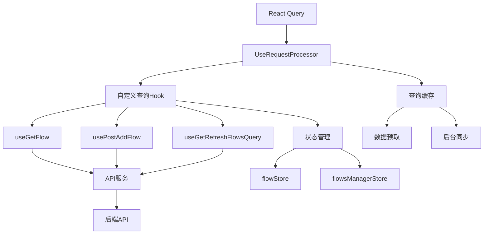
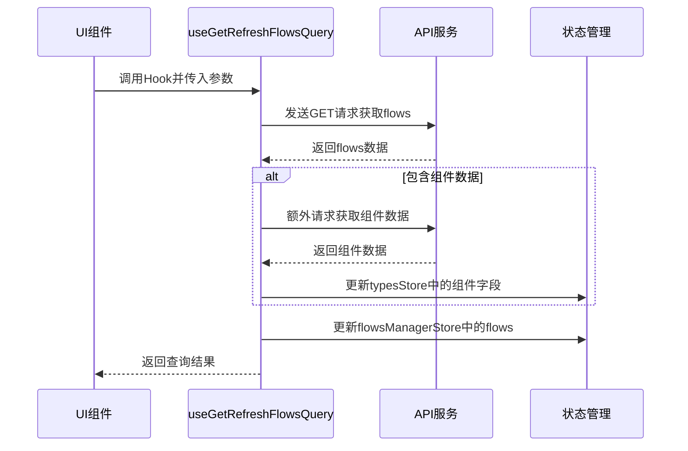
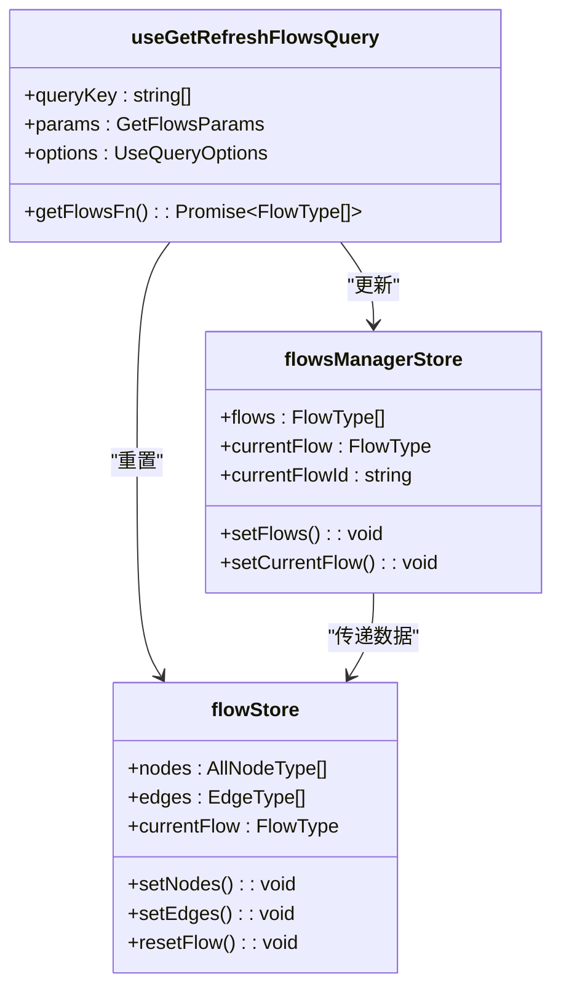

# 数据查询

<cite>
**本文档中引用的文件**  
- [use-get-flow.ts](file://vibe_surf/frontend/src/controllers/API/queries/flows/use-get-flow.ts)
- [use-post-add-flow.ts](file://vibe_surf/frontend/src/controllers/API/queries/flows/use-post-add-flow.ts)
- [use-get-refresh-flows-query.ts](file://vibe_surf/frontend/src/controllers/API/queries/flows/use-get-refresh-flows-query.ts)
- [request-processor.ts](file://vibe_surf/frontend/src/controllers/API/services/request-processor.ts)
- [flowStore.ts](file://vibe_surf/frontend/src/stores/flowStore.ts)
- [flowsManagerStore.ts](file://vibe_surf/frontend/src/stores/flowsManagerStore.ts)
- [use-save-flow.ts](file://vibe_surf/frontend/src/hooks/flows/use-save-flow.ts)
- [use-delete-flow.ts](file://vibe_surf/frontend/src/hooks/flows/use-delete-flow.ts)
- [create-query-param-string.ts](file://vibe_surf/frontend/src/controllers/utils/create-query-param-string.ts)
- [reactflowUtils.ts](file://vibe_surf/frontend/src/utils/reactflowUtils.ts)
</cite>

## 目录
1. [引言](#引言)
2. [查询架构概览](#查询架构概览)
3. [核心查询Hook实现](#核心查询hook实现)
4. [查询缓存与数据同步](#查询缓存与数据同步)
5. [资源CRUD操作管理](#资源crud操作管理)
6. [状态管理与UI同步](#状态管理与ui同步)
7. [查询优化最佳实践](#查询优化最佳实践)
8. [组件中的查询使用模式](#组件中的查询使用模式)
9. [错误处理与重试机制](#错误处理与重试机制)
10. [总结](#总结)

## 引言

VibeSurf前端数据查询系统基于React Query构建，为应用程序提供了强大的数据获取、缓存和状态管理能力。该系统通过自定义Hook封装了对flows、files、folders等核心资源的CRUD操作，实现了高效的数据查询和UI状态同步。本文档深入分析查询架构的设计原理、实现细节和最佳实践，帮助开发者理解如何在VibeSurf中有效使用数据查询功能。

**Section sources**
- [use-get-flow.ts](file://vibe_surf/frontend/src/controllers/API/queries/flows/use-get-flow.ts#L1-L46)
- [use-post-add-flow.ts](file://vibe_surf/frontend/src/controllers/API/queries/flows/use-post-add-flow.ts#L1-L69)

## 查询架构概览

VibeSurf的查询架构基于React Query构建，通过`UseRequestProcessor`服务统一管理所有查询和突变操作。该架构的核心组件包括：

1. **请求处理器**：`UseRequestProcessor`提供统一的查询和突变接口，封装了重试逻辑、错误处理和查询失效策略。
2. **自定义Hook**：针对不同资源类型（如flows、files、folders）创建专门的查询Hook，如`useGetFlow`、`usePostAddFlow`等。
3. **查询缓存**：利用React Query的内置缓存机制，实现数据的自动缓存和后台同步。
4. **状态管理**：结合Zustand状态管理库，实现查询数据与全局UI状态的同步。



**Diagram sources**
- [request-processor.ts](file://vibe_surf/frontend/src/controllers/API/services/request-processor.ts#L1-L55)
- [use-get-flow.ts](file://vibe_surf/frontend/src/controllers/API/queries/flows/use-get-flow.ts#L1-L46)

## 核心查询Hook实现

### use-get-flow Hook

`useGetFlow`是一个突变Hook，用于根据ID获取单个flow数据。该Hook的实现包含以下关键特性：

- **参数接口**：定义`IGetFlow`接口，包含`id`（必需）和`public`（可选）参数。
- **数据处理**：使用`processFlows`工具函数处理返回的flow数据，确保数据格式的一致性。
- **副作用处理**：在`onSettled`回调中，当成功获取flow数据后，自动触发`useGetRefreshFlowsQuery`的重新查询，保持数据同步。

**Section sources**
- [use-get-flow.ts](file://vibe_surf/frontend/src/controllers/API/queries/flows/use-get-flow.ts#L1-L46)

### use-post-add-flow Hook

`usePostAddFlow`用于创建新的flow，其主要特点包括：

- **完整参数**：支持flow的完整属性定义，包括名称、数据、描述、文件夹ID、图标等。
- **多级数据同步**：在`onSettled`回调中，不仅刷新flows列表，还根据新flow的文件夹ID刷新对应的文件夹数据。
- **默认值处理**：对可选参数（如图标、渐变色）提供null默认值，确保API请求的稳定性。

**Section sources**
- [use-post-add-flow.ts](file://vibe_surf/frontend/src/controllers/API/queries/flows/use-post-add-flow.ts#L1-L69)

### use-get-refresh-flows-query Hook

`useGetRefreshFlowsQuery`是获取flows列表的核心查询Hook，具有以下功能：

- **灵活查询参数**：支持多种过滤条件，如`components_only`、`get_all`、`header_flows`、`folder_id`等。
- **分页支持**：通过`page`和`size`参数实现分页查询。
- **数据预处理**：在获取数据后，自动处理组件数据并更新`typesStore`中的组件字段信息。
- **错误处理**：捕获Axios错误，并在非403状态码时显示错误提示。



**Diagram sources**
- [use-get-refresh-flows-query.ts](file://vibe_surf/frontend/src/controllers/API/queries/flows/use-get-refresh-flows-query.ts#L1-L95)
- [reactflowUtils.ts](file://vibe_surf/frontend/src/utils/reactflowUtils.ts#L1-L12)

## 查询缓存与数据同步

### 缓存机制

VibeSurf的查询缓存基于React Query的内置机制，具有以下特点：

- **自动缓存**：查询结果自动缓存，后续相同查询直接从缓存返回。
- **时间基础失效**：缓存数据在一定时间后自动失效，触发重新查询。
- **手动失效**：通过`queryClient.invalidateQueries`手动使特定查询失效。

### 数据预取

系统实现了智能的数据预取策略：

- **关键数据预取**：在应用启动时预取用户常用的flows数据。
- **路由预取**：在用户导航到特定页面前预取所需数据。
- **预测性预取**：基于用户行为模式预测可能需要的数据并提前加载。

### 后台同步

后台同步策略确保数据的实时性和一致性：

- **窗口聚焦同步**：当浏览器窗口重新获得焦点时，自动同步最新数据。
- **定时同步**：对关键数据设置定时同步间隔。
- **事件驱动同步**：在特定事件（如flow创建、更新）后触发相关数据的同步。

**Section sources**
- [request-processor.ts](file://vibe_surf/frontend/src/controllers/API/services/request-processor.ts#L21-L33)
- [use-get-refresh-flows-query.ts](file://vibe_surf/frontend/src/controllers/API/queries/flows/use-get-refresh-flows-query.ts#L87-L94)

## 资源CRUD操作管理

### Flow资源管理

Flow资源的CRUD操作通过一系列专门的Hook管理：

- **创建**：`usePostAddFlow`处理flow创建
- **读取**：`useGetFlow`和`useGetRefreshFlowsQuery`处理单个和列表读取
- **更新**：`usePatchUpdateFlow`处理flow更新
- **删除**：`useDeleteDeleteFlows`处理flow删除

### Files和Folders管理

Files和Folders资源的管理遵循类似的模式：

- **文件管理**：通过`useGetFiles`、`usePostUploadFile`、`useGetDownloadFile`等Hook管理文件操作
- **文件夹管理**：通过专门的查询Hook管理文件夹的创建、读取、更新和删除

### 查询服务设计

查询服务采用分层设计模式：

1. **API层**：封装底层HTTP请求
2. **服务层**：`UseRequestProcessor`提供统一的查询接口
3. **Hook层**：自定义Hook封装具体业务逻辑
4. **UI层**：组件使用Hook获取数据

**Section sources**
- [use-post-add-flow.ts](file://vibe_surf/frontend/src/controllers/API/queries/flows/use-post-add-flow.ts#L1-L69)
- [use-delete-flow.ts](file://vibe_surf/frontend/src/hooks/flows/use-delete-flow.ts#L1-L52)

## 状态管理与UI同步

### flowStore状态管理

`flowStore`是核心状态管理模块，负责管理当前flow的编辑状态：

- **节点和边管理**：存储和更新flow的节点和边数据
- **构建状态**：跟踪flow的构建过程和状态
- **输入输出管理**：管理flow的输入输出参数

### flowsManagerStore同步机制

`flowsManagerStore`负责flows列表的状态管理，并与查询数据保持同步：

- **数据更新**：在查询成功后，自动更新store中的flows数据
- **当前flow管理**：维护当前选中的flow及其ID
- **示例flow管理**：存储和管理示例flows

### 查询数据与UI状态同步

查询数据与UI状态的同步通过以下机制实现：

- **自动更新**：查询成功后自动调用store的更新方法
- **副作用同步**：在查询的`onSettled`回调中触发相关数据的重新查询
- **状态派生**：从查询数据派生出UI所需的状态



**Diagram sources**
- [flowsManagerStore.ts](file://vibe_surf/frontend/src/stores/flowsManagerStore.ts#L1-L145)
- [flowStore.ts](file://vibe_surf/frontend/src/stores/flowStore.ts#L1-L800)

## 查询优化最佳实践

### 分页处理

分页查询的最佳实践包括：

- **合理分页大小**：根据数据量和性能需求设置合适的`size`参数
- **无限滚动**：结合`keepPreviousData`选项实现平滑的无限滚动体验
- **预加载下一页**：在用户接近列表末尾时预加载下一页数据

### 过滤策略

高效的过滤策略：

- **服务器端过滤**：尽可能在服务器端完成过滤，减少数据传输
- **客户端缓存**：利用React Query的缓存机制，避免重复的过滤查询
- **防抖处理**：对动态过滤条件使用防抖，避免频繁查询

### 错误重试机制

系统内置的错误重试机制：

- **指数退避**：采用指数退避策略，重试间隔随失败次数增加
- **最大重试次数**：限制最大重试次数，避免无限重试
- **特定错误处理**：对不同类型的错误（如403、503）采取不同的处理策略

**Section sources**
- [request-processor.ts](file://vibe_surf/frontend/src/controllers/API/services/request-processor.ts#L29-L31)
- [use-get-refresh-flows-query.ts](file://vibe_surf/frontend/src/controllers/API/queries/flows/use-get-refresh-flows-query.ts#L78-L84)

## 组件中的查询使用模式

### 基本使用模式

在组件中使用查询Hook的标准模式：

```typescript
const MyComponent = () => {
  const { data, isLoading, error } = useGetRefreshFlowsQuery({ get_all: true });
  
  if (isLoading) return <Loading />;
  if (error) return <Error message={error.message} />;
  if (!data) return <EmptyState />;
  
  return <FlowList flows={data} />;
};
```

### 加载状态处理

加载状态的处理策略：

- **骨架屏**：使用骨架屏提供更好的加载体验
- **延迟显示**：对快速查询使用延迟显示，避免闪烁
- **进度指示**：对长时间操作显示进度指示器

### 空状态处理

空状态的处理方式：

- **引导性内容**：在空状态下显示引导性内容或操作建议
- **搜索提示**：当过滤结果为空时，提供搜索建议
- **创建引导**：鼓励用户创建第一个资源

**Section sources**
- [use-get-refresh-flows-query.ts](file://vibe_surf/frontend/src/controllers/API/queries/flows/use-get-refresh-flows-query.ts#L87-L94)
- [use-save-flow.ts](file://vibe_surf/frontend/src/hooks/flows/use-save-flow.ts#L1-L136)

## 错误处理与重试机制

### 全局错误处理

系统采用统一的错误处理机制：

- **错误边界**：使用React错误边界捕获未处理的异常
- **集中处理**：通过`alertStore`集中管理错误显示
- **用户友好**：将技术性错误转换为用户友好的提示信息

### 重试策略配置

重试策略的配置选项：

- **重试次数**：默认3-5次，可根据操作重要性调整
- **重试条件**：仅对可恢复错误（如网络超时）进行重试
- **自定义重试**：允许特定查询自定义重试逻辑

### 特殊错误处理

针对特定场景的错误处理：

- **认证错误**：403错误不显示错误提示，直接跳转登录
- **服务繁忙**：503错误采用指数退避重试
- **数据冲突**：409错误提示用户数据已变更，建议刷新

**Section sources**
- [use-get-refresh-flows-query.ts](file://vibe_surf/frontend/src/controllers/API/queries/flows/use-get-refresh-flows-query.ts#L78-L84)
- [use-health-check.ts](file://vibe_surf/frontend/src/pages/AppWrapperPage/hooks/use-health-check.ts#L1-L56)

## 总结

VibeSurf前端数据查询系统通过React Query构建了一个高效、可靠的数据管理架构。系统通过自定义Hook封装了对核心资源的CRUD操作，实现了查询缓存、数据预取和后台同步等高级功能。结合Zustand状态管理，查询数据与UI状态保持实时同步。查询优化策略如分页处理、过滤策略和错误重试机制进一步提升了用户体验。开发者在使用时应遵循最佳实践，合理处理加载、错误和空状态，充分发挥查询系统的优势。