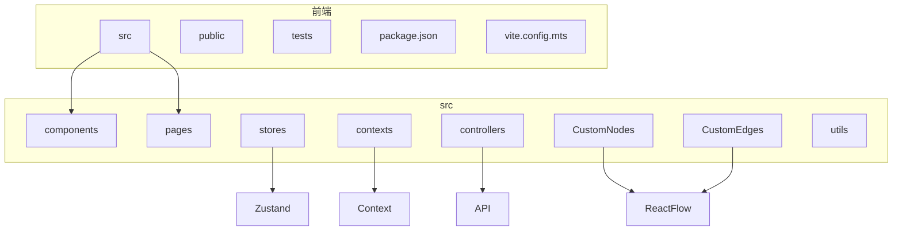
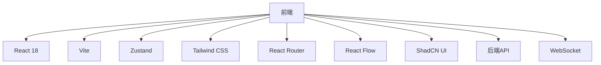
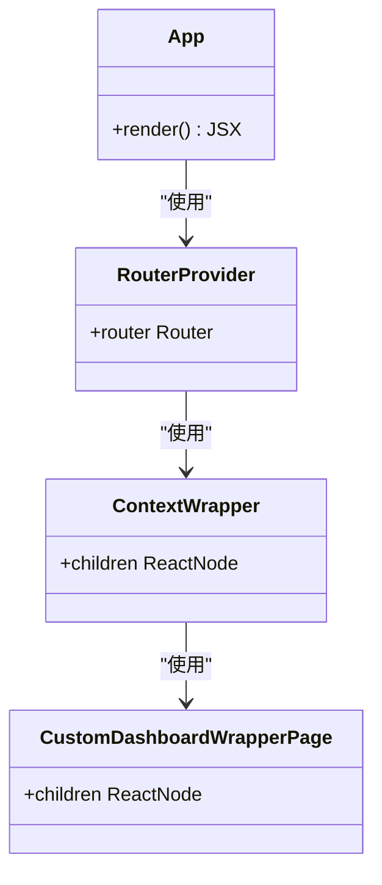
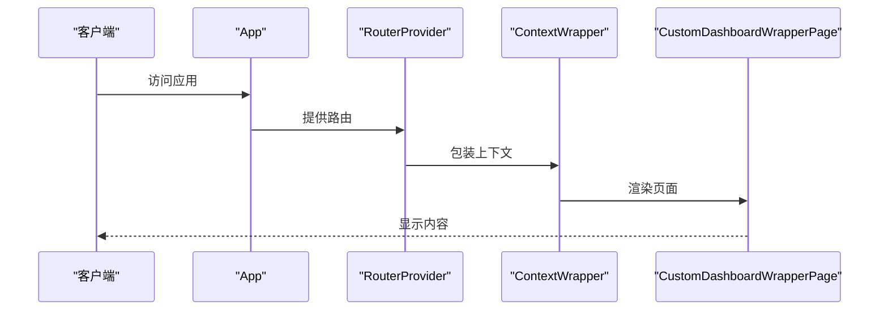
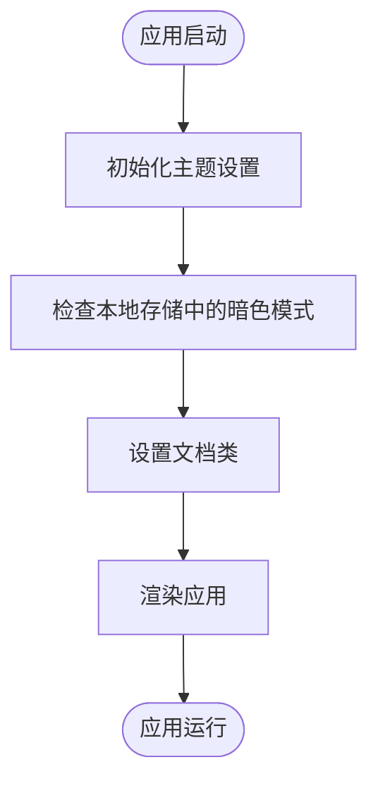
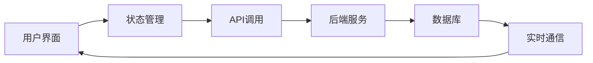
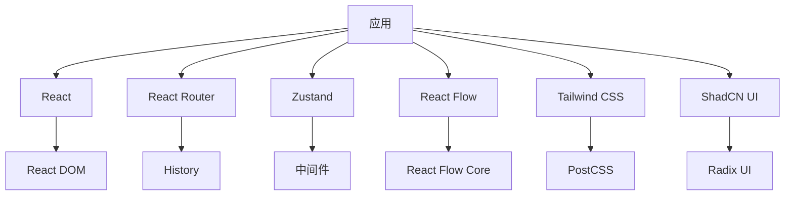

# 前端架构

<cite>
**本文档中引用的文件**  
- [App.tsx](file://vibe_surf/frontend/src/App.tsx)
- [routes.tsx](file://vibe_surf/frontend/src/routes.tsx)
- [index.tsx](file://vibe_surf/frontend/src/index.tsx)
- [package.json](file://vibe_surf/frontend/package.json)
- [vite.config.mts](file://vibe_surf/frontend/vite.config.mts)
- [context/index.tsx](file://vibe_surf/frontend/src/contexts/index.tsx)
- [darkStore.ts](file://vibe_surf/frontend/src/stores/darkStore.ts)
- [CustomEdges/index.tsx](file://vibe_surf/frontend/src/CustomEdges/index.tsx)
- [API/index.ts](file://vibe_surf/frontend/src/controllers/API/index.ts)
- [flowStore.ts](file://vibe_surf/frontend/src/stores/flowStore.ts)
- [reactflowUtils.ts](file://vibe_surf/frontend/src/utils/reactflowUtils.ts)
</cite>

## 目录
1. [项目结构](#项目结构)
2. [核心组件](#核心组件)
3. [架构概述](#架构概述)
4. [详细组件分析](#详细组件分析)
5. [依赖分析](#依赖分析)
6. [性能考虑](#性能考虑)
7. [故障排除指南](#故障排除指南)
8. [结论](#结论)

## 项目结构

VibeSurf前端应用采用基于React的现代架构，组织清晰，模块化程度高。前端代码位于`vibe_surf/frontend`目录下，遵循标准的React项目结构，包含`public`和`src`目录。`src`目录包含所有源代码，包括组件、页面、状态管理、API控制器和自定义节点/边。

**图源**
- [App.tsx](file://vibe_surf/frontend/src/App.tsx)
- [routes.tsx](file://vibe_surf/frontend/src/routes.tsx)

**本节来源**
- [App.tsx](file://vibe_surf/frontend/src/App.tsx)
- [routes.tsx](file://vibe_surf/frontend/src/routes.tsx)
- [index.tsx](file://vibe_surf/frontend/src/index.tsx)

## 核心组件

前端应用的核心组件包括路由系统、状态管理、API集成和UI组件库。`App.tsx`是应用的入口点，负责初始化React Router和Zustand状态管理。`routes.tsx`定义了应用的路由结构，使用`react-router-dom`实现基于路径的导航。`darkStore.ts`使用Zustand管理应用的暗色主题状态，确保主题设置在页面刷新后持久化。

**本节来源**
- [App.tsx](file://vibe_surf/frontend/src/App.tsx)
- [routes.tsx](file://vibe_surf/frontend/src/routes.tsx)
- [darkStore.ts](file://vibe_surf/frontend/src/stores/darkStore.ts)

## 架构概述

VibeSurf前端架构基于React 18，采用现代化的开发工具和库。应用使用Vite作为构建工具，提供快速的开发服务器和高效的生产构建。状态管理采用Zustand，提供轻量级、可扩展的状态管理解决方案。UI组件库基于ShadCN和Radix UI，确保一致的用户体验和可访问性。应用与后端通过REST API和WebSocket进行通信，实现数据同步和实时功能。

**图源**
- [package.json](file://vibe_surf/frontend/package.json)
- [vite.config.mts](file://vibe_surf/frontend/vite.config.mts)

**本节来源**
- [package.json](file://vibe_surf/frontend/package.json)
- [vite.config.mts](file://vibe_surf/frontend/vite.config.mts)

## 详细组件分析

### 组件A分析

#### 对于面向对象的组件：

**图源**
- [App.tsx](file://vibe_surf/frontend/src/App.tsx)
- [routes.tsx](file://vibe_surf/frontend/src/routes.tsx)

#### 对于API/服务组件：

**图源**
- [App.tsx](file://vibe_surf/frontend/src/App.tsx)
- [routes.tsx](file://vibe_surf/frontend/src/routes.tsx)

#### 对于复杂逻辑组件：

**图源**
- [App.tsx](file://vibe_surf/frontend/src/App.tsx)
- [darkStore.ts](file://vibe_surf/frontend/src/stores/darkStore.ts)

**本节来源**
- [App.tsx](file://vibe_surf/frontend/src/App.tsx)
- [darkStore.ts](file://vibe_surf/frontend/src/stores/darkStore.ts)

### 概念概述

## 依赖分析

前端应用依赖于多个第三方库和内部模块。主要依赖包括React、React Router、Zustand、React Flow、Tailwind CSS和ShadCN UI。这些依赖通过`package.json`文件管理，确保版本一致性和可重复构建。内部模块通过相对路径导入，确保代码的可维护性和可测试性。

**图源**
- [package.json](file://vibe_surf/frontend/package.json)

**本节来源**
- [package.json](file://vibe_surf/frontend/package.json)

## 性能考虑

前端应用通过多种方式优化性能。Vite的快速热模块替换（HMR）提高了开发效率。代码分割和懒加载减少了初始加载时间。Zustand的状态管理避免了不必要的重新渲染。React Flow的虚拟化技术确保了大型流程图的流畅渲染。Tailwind CSS的JIT编译器生成高效的CSS代码。

## 故障排除指南

常见问题包括路由不工作、状态更新延迟和API调用失败。检查`routes.tsx`中的路由定义是否正确，确保路径和组件匹配。检查Zustand store中的状态更新逻辑，确保使用正确的更新函数。检查API调用的URL和参数，确保与后端API文档一致。使用浏览器开发者工具检查网络请求和控制台错误。

**本节来源**
- [routes.tsx](file://vibe_surf/frontend/src/routes.tsx)
- [flowStore.ts](file://vibe_surf/frontend/src/stores/flowStore.ts)
- [API/index.ts](file://vibe_surf/frontend/src/controllers/API/index.ts)

## 结论

VibeSurf前端架构是一个现代化、模块化、高性能的React应用。它采用最佳实践和最新技术，提供流畅的用户体验和可维护的代码库。通过清晰的组件划分、有效的状态管理和高效的构建流程，该架构为未来的扩展和优化奠定了坚实的基础。