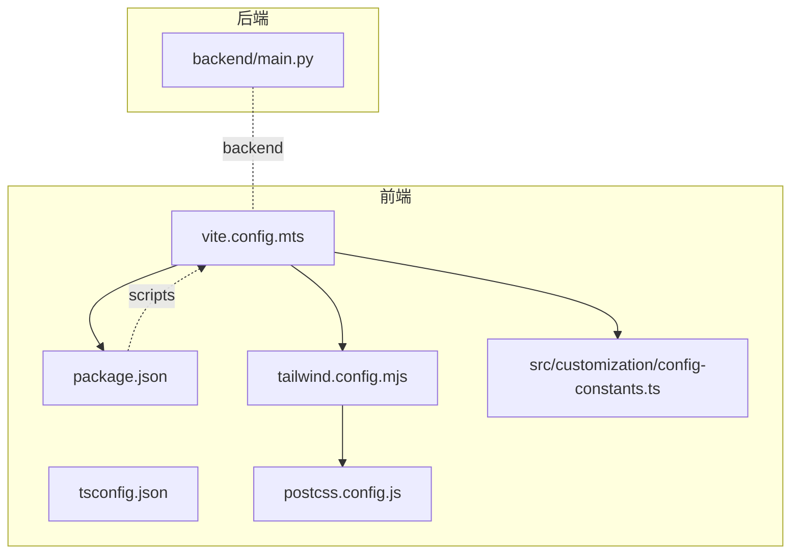
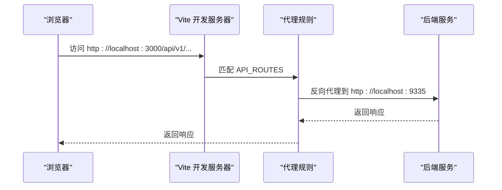
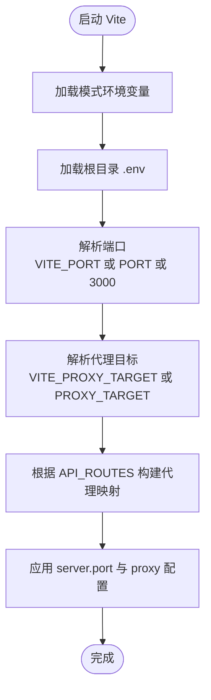
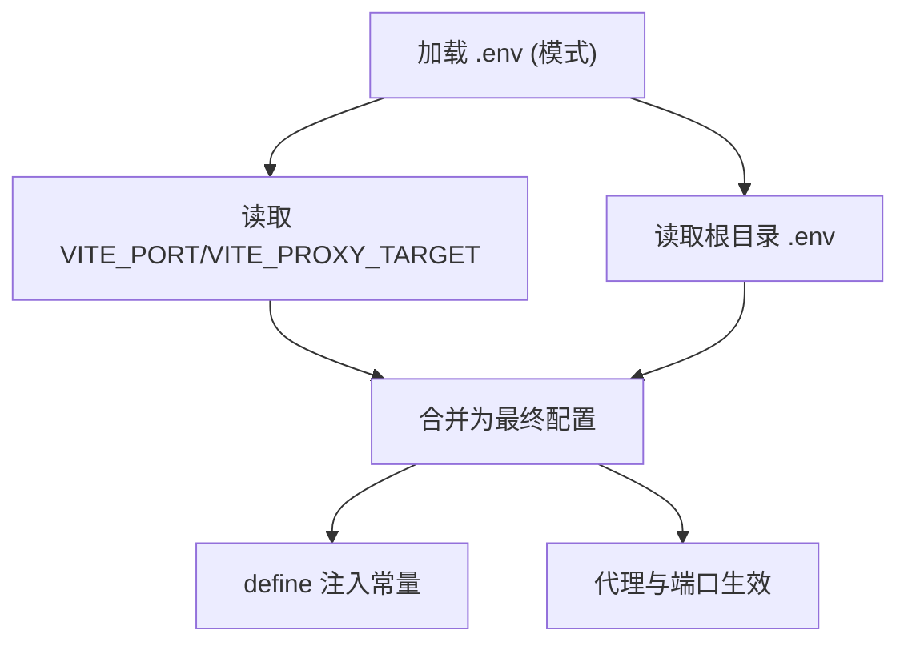
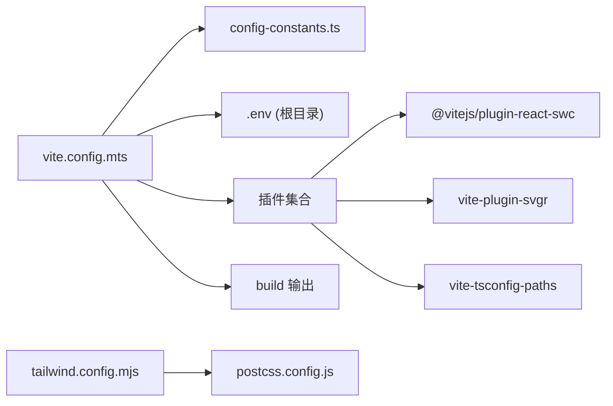

# Vite 配置

<cite>
**本文引用的文件列表**
- [vite.config.mts](file://vibe_surf/frontend/vite.config.mts)
- [package.json](file://vibe_surf/frontend/package.json)
- [tsconfig.json](file://vibe_surf/frontend/tsconfig.json)
- [tailwind.config.mjs](file://vibe_surf/frontend/tailwind.config.mjs)
- [postcss.config.js](file://vibe_surf/frontend/postcss.config.js)
- [config-constants.ts](file://vibe_surf/frontend/src/customization/config-constants.ts)
- [.env.example](file://.env.example)
- [set_proxy.sh](file://vibe_surf/frontend/set_proxy.sh)
- [dev.Dockerfile](file://vibe_surf/frontend/dev.Dockerfile)
- [cdk.Dockerfile](file://vibe_surf/frontend/cdk.Dockerfile)
- [api-client.js](file://vibe_surf/chrome_extension/scripts/api-client.js)
- [main.py](file://vibe_surf/backend/main.py)
</cite>

## 目录
1. [简介](#简介)
2. [项目结构](#项目结构)
3. [核心组件](#核心组件)
4. [架构总览](#架构总览)
5. [详细组件分析](#详细组件分析)
6. [依赖关系分析](#依赖关系分析)
7. [性能考量](#性能考量)
8. [故障排除指南](#故障排除指南)
9. [结论](#结论)
10. [附录](#附录)

## 简介
本文件围绕前端 Vite 构建系统进行深入解析，重点覆盖以下方面：
- 开发服务器配置：端口、代理、WebSocket 支持与热重载联动
- 生产构建优化：输出目录、构建产物组织与静态资源策略
- 插件体系：React、SVG 转换、路径别名等
- 环境变量与模式配置：多来源合并、默认值与优先级
- 构建脚本与运行方式：dev、build、preview 的使用与性能优化建议
- 常见问题与排障：跨域、端口冲突、代理失效等

## 项目结构
前端位于 vibe_surf/frontend，核心配置集中在 vite.config.mts，并辅以 package.json 中的脚本与依赖声明；Tailwind 与 PostCSS 提供样式管线；TypeScript 配置用于类型检查与路径解析。

图表来源
- [vite.config.mts](file://vibe_surf/frontend/vite.config.mts#L1-L69)
- [package.json](file://vibe_surf/frontend/package.json#L96-L107)
- [tsconfig.json](file://vibe_surf/frontend/tsconfig.json#L1-L64)
- [tailwind.config.mjs](file://vibe_surf/frontend/tailwind.config.mjs#L1-L522)
- [postcss.config.js](file://vibe_surf/frontend/postcss.config.js#L1-L7)
- [config-constants.ts](file://vibe_surf/frontend/src/customization/config-constants.ts#L1-L20)
- [main.py](file://vibe_surf/backend/main.py#L726-L775)

章节来源
- [vite.config.mts](file://vibe_surf/frontend/vite.config.mts#L1-L69)
- [package.json](file://vibe_surf/frontend/package.json#L96-L107)

## 核心组件
- 开发服务器与代理
  - 端口：优先读取 VITE_PORT，其次使用配置常量 PORT，默认 3000
  - 代理：基于 API_ROUTES 动态生成多路由映射，目标为 VITE_PROXY_TARGET 或 PROXY_TARGET，默认本地后端地址
  - WebSocket：代理启用 ws: true，支持实时通信
- 构建输出
  - 输出目录：outDir 指向 build
  - base：可选部署路径前缀，来自 BASENAME
- 全局常量注入
  - 通过 define 注入一组 process.env.* 常量，来源于根目录 .env 的键值或默认值
- 插件生态
  - React：@vitejs/plugin-react-swc
  - SVG：vite-plugin-svgr
  - 路径别名：vite-tsconfig-paths
- 样式管线
  - Tailwind 与 PostCSS：tailwindcss、autoprefixer
  - TypeScript 路径别名：baseUrl、paths

章节来源
- [vite.config.mts](file://vibe_surf/frontend/vite.config.mts#L1-L69)
- [config-constants.ts](file://vibe_surf/frontend/src/customization/config-constants.ts#L1-L20)
- [tailwind.config.mjs](file://vibe_surf/frontend/tailwind.config.mjs#L1-L522)
- [postcss.config.js](file://vibe_surf/frontend/postcss.config.js#L1-L7)
- [tsconfig.json](file://vibe_surf/frontend/tsconfig.json#L1-L64)

## 架构总览
下图展示从浏览器到后端的请求链路，以及 Vite 开发服务器如何通过代理转发 API 请求。

图表来源
- [vite.config.mts](file://vibe_surf/frontend/vite.config.mts#L23-L38)
- [config-constants.ts](file://vibe_surf/frontend/src/customization/config-constants.ts#L1-L20)
- [main.py](file://vibe_surf/backend/main.py#L752-L775)

## 详细组件分析

### 开发服务器与代理配置
- 端口选择顺序
  - VITE_PORT 环境变量 > 配置常量 PORT > 默认 3000
- 代理目标与路由
  - VITE_PROXY_TARGET > PROXY_TARGET > 默认目标
  - API_ROUTES 动态生成代理对象，统一指向同一 target，并开启 changeOrigin、secure=false、ws:true
- 热重载与 WebSocket
  - 代理启用 ws:true，确保 WebSocket 协议在代理层正常透传
- 环境变量加载
  - 使用 loadEnv 加载当前模式下的 .env 文件
  - 同时读取根目录 .env，作为 define 常量的默认来源

图表来源
- [vite.config.mts](file://vibe_surf/frontend/vite.config.mts#L14-L66)
- [config-constants.ts](file://vibe_surf/frontend/src/customization/config-constants.ts#L1-L20)

章节来源
- [vite.config.mts](file://vibe_surf/frontend/vite.config.mts#L14-L66)
- [config-constants.ts](file://vibe_surf/frontend/src/customization/config-constants.ts#L1-L20)

### 生产构建优化
- 输出目录
  - outDir: build，便于打包后直接部署到后端静态资源目录
- 代码分割与资源策略
  - Vite 默认按需分块；未显式配置 rollupOptions，保持默认行为
- 静态资源
  - base: 可选部署路径前缀，来自 BASENAME
- 常量注入
  - define 注入一组 process.env.* 常量，便于运行时读取后端地址、令牌过期时间等

章节来源
- [vite.config.mts](file://vibe_surf/frontend/vite.config.mts#L40-L60)
- [config-constants.ts](file://vibe_surf/frontend/src/customization/config-constants.ts#L1-L20)

### 插件系统集成
- React
  - @vitejs/plugin-react-swc：更快的 React SWC 插件
- SVG 处理
  - vite-plugin-svgr：将 SVG 作为 React 组件导入
- 路径别名
  - vite-tsconfig-paths：自动读取 tsconfig.json 的 baseUrl 与 paths
- 样式管线
  - Tailwind：tailwindcss、tailwindcss-animate、@tailwindcss/forms、tailwindcss-dotted-background、tailwindcss-typography
  - PostCSS：autoprefixer

章节来源
- [vite.config.mts](file://vibe_surf/frontend/vite.config.mts#L1-L13)
- [package.json](file://vibe_surf/frontend/package.json#L90-L149)
- [tailwind.config.mjs](file://vibe_surf/frontend/tailwind.config.mjs#L1-L522)
- [postcss.config.js](file://vibe_surf/frontend/postcss.config.js#L1-L7)
- [tsconfig.json](file://vibe_surf/frontend/tsconfig.json#L1-L64)

### 环境变量管理与模式配置
- 模式与 .env 加载
  - loadEnv(mode, process.cwd(), "") 会按模式加载 .env 文件
- 多来源合并
  - VITE_* 优先于普通变量
  - 根目录 .env 通过 dotenv.config 加载，作为 define 常量的默认来源
- 常量注入
  - define 将关键后端信息注入到客户端运行时，避免硬编码
- Docker 场景
  - dev.Dockerfile 与 cdk.Dockerfile 通过 ARG/ENV 传递 BACKEND_URL，并用 set_proxy.sh 修改 package.json 的 proxy 字段，实现容器内开发代理

图表来源
- [vite.config.mts](file://vibe_surf/frontend/vite.config.mts#L14-L59)
- [.env.example](file://.env.example#L1-L55)
- [set_proxy.sh](file://vibe_surf/frontend/set_proxy.sh#L1-L10)
- [dev.Dockerfile](file://vibe_surf/frontend/dev.Dockerfile#L10-L21)
- [cdk.Dockerfile](file://vibe_surf/frontend/cdk.Dockerfile#L10-L21)

章节来源
- [vite.config.mts](file://vibe_surf/frontend/vite.config.mts#L14-L59)
- [.env.example](file://.env.example#L1-L55)
- [set_proxy.sh](file://vibe_surf/frontend/set_proxy.sh#L1-L10)
- [dev.Dockerfile](file://vibe_surf/frontend/dev.Dockerfile#L10-L21)
- [cdk.Dockerfile](file://vibe_surf/frontend/cdk.Dockerfile#L10-L21)

### 构建脚本与使用指南
- 开发
  - npm run start 或 vite：本地开发，端口由 VITE_PORT/PORT 决定
  - npm run dev:docker：容器内开发，通过 BACKEND_URL 注入代理
- 构建
  - npm run build：生成 build 目录
- 预览
  - npm run serve：本地预览构建产物
- 类型检查
  - npm run type-check：先 tsc 检查，再启动 Vite

章节来源
- [package.json](file://vibe_surf/frontend/package.json#L96-L107)
- [dev.Dockerfile](file://vibe_surf/frontend/dev.Dockerfile#L25-L26)
- [cdk.Dockerfile](file://vibe_surf/frontend/cdk.Dockerfile#L25-L26)

### 与后端的协作
- 后端端口默认 9335，可通过环境变量 VIBESURF_BACKEND_PORT 指定
- 浏览器扩展通过 window.VIBESURF_CONFIG 或默认地址访问后端 API
- 前端代理将 /api/v1、/api/v2、/health 等路由转发至后端

章节来源
- [main.py](file://vibe_surf/backend/main.py#L752-L775)
- [api-client.js](file://vibe_surf/chrome_extension/scripts/api-client.js#L1-L41)
- [config-constants.ts](file://vibe_surf/frontend/src/customization/config-constants.ts#L1-L20)

## 依赖关系分析
- 配置依赖
  - vite.config.mts 依赖 config-constants.ts 提供的默认端口、代理目标与路由
  - 通过 dotenv 读取根目录 .env，作为 define 常量的默认来源
- 运行时依赖
  - package.json 定义了脚本与依赖，包括 React、SVGR、Tailwind、PostCSS、SWC 等
- 样式管线
  - tailwind.config.mjs 与 postcss.config.js 形成完整的样式处理链

图表来源
- [vite.config.mts](file://vibe_surf/frontend/vite.config.mts#L1-L69)
- [config-constants.ts](file://vibe_surf/frontend/src/customization/config-constants.ts#L1-L20)
- [tailwind.config.mjs](file://vibe_surf/frontend/tailwind.config.mjs#L1-L522)
- [postcss.config.js](file://vibe_surf/frontend/postcss.config.js#L1-L7)
- [package.json](file://vibe_surf/frontend/package.json#L90-L149)

章节来源
- [vite.config.mts](file://vibe_surf/frontend/vite.config.mts#L1-L69)
- [package.json](file://vibe_surf/frontend/package.json#L90-L149)

## 性能考量
- 开发阶段
  - 使用 React SWC 插件提升编译速度
  - 代理启用 ws:true，确保 WebSocket 通信顺畅
  - 端口与代理目标通过环境变量灵活切换，减少重复配置
- 生产阶段
  - 保持默认代码分割策略，避免过度拆分导致请求数增加
  - 如需进一步优化，可在 rollupOptions 中定制入口与外部化策略（当前未显式配置）
- 样式与资源
  - Tailwind 仅扫描指定内容路径，避免无谓的样式扫描
  - PostCSS 自动前缀，减少手动兼容性处理

[本节为通用性能建议，不直接分析具体文件]

## 故障排除指南
- 代理 404 或 CORS 错误
  - 检查 API_ROUTES 是否覆盖实际 API 前缀
  - 确认 VITE_PROXY_TARGET 与后端实际端口一致
- 端口占用
  - VITE_PORT/PORT 与系统端口冲突时，修改任一来源即可
- Docker 内代理无效
  - 确保 BACKEND_URL 已正确注入，并 set_proxy.sh 成功写入 package.json.proxy
- WebSocket 不可用
  - 确认代理已启用 ws:true，且后端支持 WebSocket
- 环境变量未生效
  - 检查 .env 文件是否与模式匹配，或 VITE_* 前缀是否正确
- 预览页面空白
  - 确认 build 目录存在，且 base 设置与部署路径一致

章节来源
- [vite.config.mts](file://vibe_surf/frontend/vite.config.mts#L23-L38)
- [set_proxy.sh](file://vibe_surf/frontend/set_proxy.sh#L1-L10)
- [dev.Dockerfile](file://vibe_surf/frontend/dev.Dockerfile#L10-L21)
- [cdk.Dockerfile](file://vibe_surf/frontend/cdk.Dockerfile#L10-L21)

## 结论
该 Vite 配置以简洁、可配置为核心设计原则：通过多源环境变量与默认常量，实现开发与生产的无缝切换；通过代理与 WebSocket 支持，保障前后端联调体验；借助 React SWC、SVGR 与 Tailwind/PostCSS 插件，兼顾开发效率与样式一致性。建议在生产构建中结合业务场景评估 rollupOptions 与资源缓存策略，以获得更优的首屏与增量加载表现。

[本节为总结性内容，不直接分析具体文件]

## 附录
- 关键配置项速览
  - 端口：VITE_PORT、PORT
  - 代理目标：VITE_PROXY_TARGET、PROXY_TARGET
  - API 路由：API_ROUTES
  - 输出目录：build
  - 部署前缀：BASENAME
  - define 常量：BACKEND_URL、ACCESS_TOKEN_EXPIRE_SECONDS、CI、LANGFLOW_AUTO_LOGIN、LANGFLOW_MCP_COMPOSER_ENABLED
- Docker 开发代理设置
  - 通过 dev.Dockerfile/cdk.Dockerfile 注入 BACKEND_URL，并执行 set_proxy.sh 更新 package.json.proxy

章节来源
- [vite.config.mts](file://vibe_surf/frontend/vite.config.mts#L23-L59)
- [config-constants.ts](file://vibe_surf/frontend/src/customization/config-constants.ts#L1-L20)
- [set_proxy.sh](file://vibe_surf/frontend/set_proxy.sh#L1-L10)
- [dev.Dockerfile](file://vibe_surf/frontend/dev.Dockerfile#L10-L21)
- [cdk.Dockerfile](file://vibe_surf/frontend/cdk.Dockerfile#L10-L21)