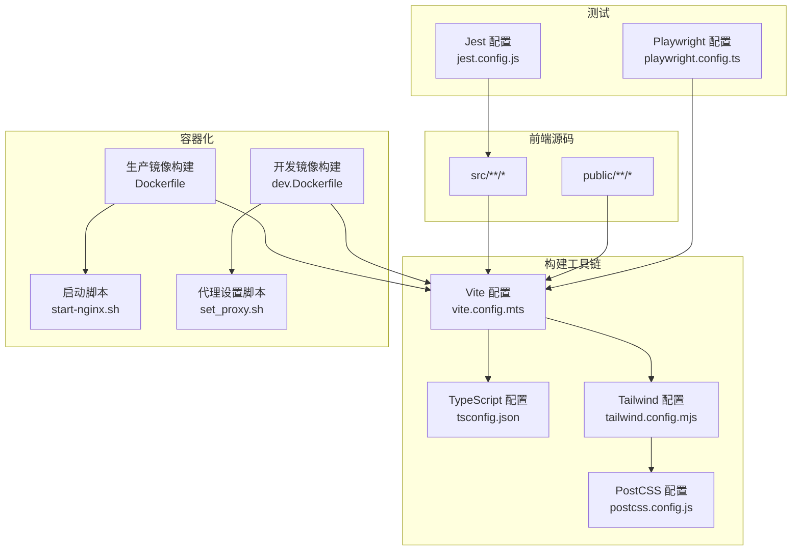
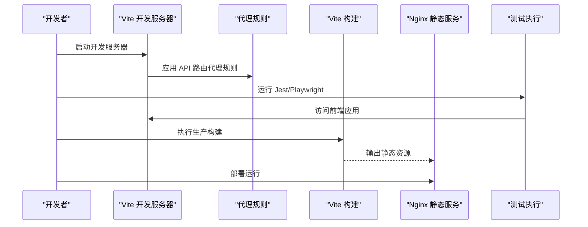
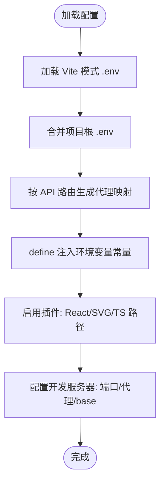
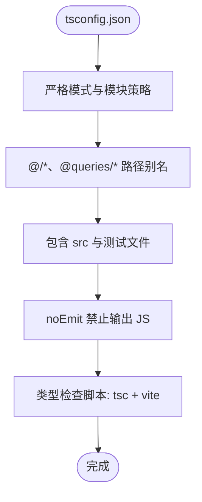
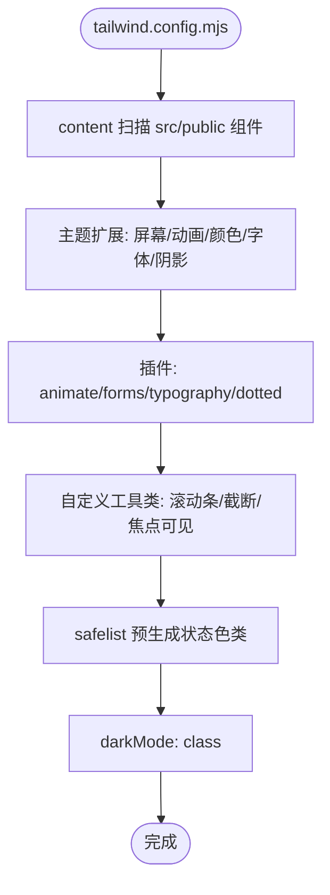
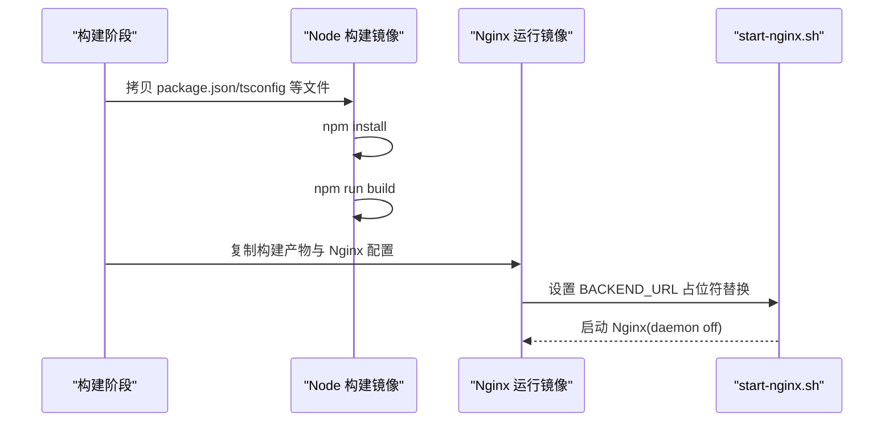
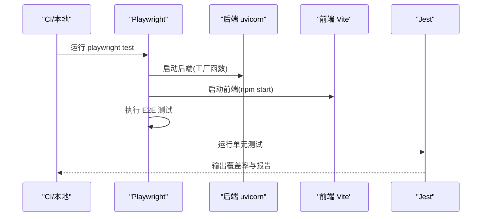
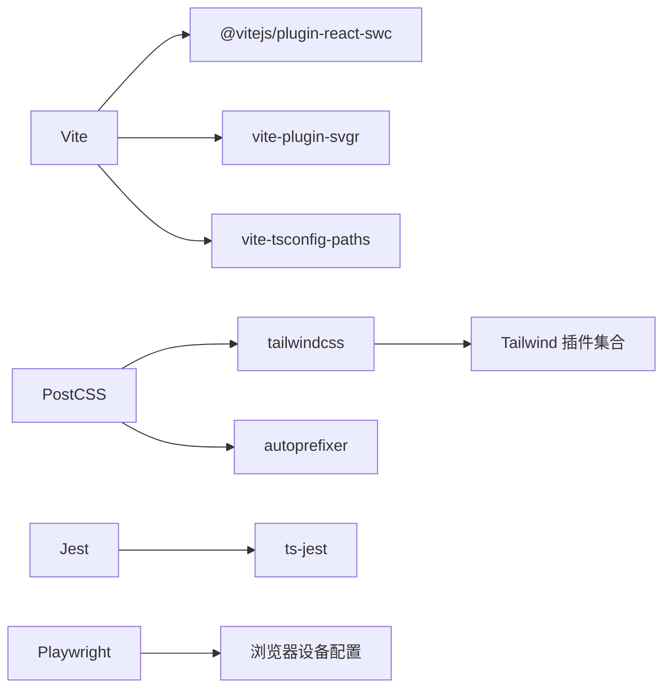

# 构建流程

<cite>
**本文引用的文件**
- [package.json](file://vibe_surf/frontend/package.json)
- [vite.config.mts](file://vibe_surf/frontend/vite.config.mts)
- [tsconfig.json](file://vibe_surf/frontend/tsconfig.json)
- [tailwind.config.mjs](file://vibe_surf/frontend/tailwind.config.mjs)
- [postcss.config.js](file://vibe_surf/frontend/postcss.config.js)
- [Dockerfile](file://vibe_surf/frontend/Dockerfile)
- [dev.Dockerfile](file://vibe_surf/frontend/dev.Dockerfile)
- [playwright.config.ts](file://vibe_surf/frontend/playwright.config.ts)
- [jest.config.js](file://vibe_surf/frontend/jest.config.js)
- [config-constants.ts](file://vibe_surf/frontend/src/customization/config-constants.ts)
- [run-tests.sh](file://vibe_surf/frontend/run-tests.sh)
- [start-nginx.sh](file://vibe_surf/frontend/start-nginx.sh)
- [set_proxy.sh](file://vibe_surf/frontend/set_proxy.sh)
- [.dockerignore](file://vibe_surf/frontend/.dockerignore)
- [README.md](file://vibe_surf/frontend/README.md)
- [README.md](file://README.md)
</cite>

## 目录
1. [简介](#简介)
2. [项目结构](#项目结构)
3. [核心组件](#核心组件)
4. [架构总览](#架构总览)
5. [详细组件分析](#详细组件分析)
6. [依赖关系分析](#依赖关系分析)
7. [性能考量](#性能考量)
8. [故障排查指南](#故障排查指南)
9. [结论](#结论)
10. [附录](#附录)

## 简介
本文件面向 VibeSurf 前端构建流程，围绕基于 Vite 的开发与生产构建、TypeScript 编译与类型检查、Tailwind CSS 主题与插件、Docker 多阶段构建与镜像优化、代码分割与懒加载、资源压缩、测试（Jest、Playwright）集成以及 CI/CD 流程进行系统化说明，并提供开发环境搭建与常见问题排查建议。

## 项目结构
前端位于 vibe_surf/frontend 目录，采用 Vite + React + TypeScript 技术栈，配合 Tailwind CSS 实现样式体系；通过 Playwright 进行 E2E 测试，Jest 进行单元测试；使用 Docker 进行本地开发与生产部署。

图表来源
- [vite.config.mts](file://vibe_surf/frontend/vite.config.mts#L1-L69)
- [tsconfig.json](file://vibe_surf/frontend/tsconfig.json#L1-L64)
- [tailwind.config.mjs](file://vibe_surf/frontend/tailwind.config.mjs#L1-L522)
- [postcss.config.js](file://vibe_surf/frontend/postcss.config.js#L1-L7)
- [Dockerfile](file://vibe_surf/frontend/Dockerfile#L1-L16)
- [dev.Dockerfile](file://vibe_surf/frontend/dev.Dockerfile#L1-L26)
- [playwright.config.ts](file://vibe_surf/frontend/playwright.config.ts#L1-L128)
- [jest.config.js](file://vibe_surf/frontend/jest.config.js#L1-L61)
- [start-nginx.sh](file://vibe_surf/frontend/start-nginx.sh#L1-L9)
- [set_proxy.sh](file://vibe_surf/frontend/set_proxy.sh#L1-L10)

章节来源
- [README.md](file://vibe_surf/frontend/README.md#L1-L47)
- [README.md](file://README.md#L108-L124)

## 核心组件
- 开发服务器与代理：Vite 开发服务器、API 路由代理、端口与基础路径配置。
- 生产构建：输出目录、产物组织、静态资源处理。
- 环境变量：Vite define 注入、dotenv 加载、后端环境变量合并。
- TypeScript：严格模式、路径别名、包含范围与测试文件纳入。
- Tailwind CSS：主题扩展、动画、插件、内容扫描与安全列表。
- 测试：Jest 单元测试与 Playwright E2E 测试配置及脚本。
- 容器化：多阶段生产镜像、Nginx 静态服务、开发镜像与代理脚本。

章节来源
- [vite.config.mts](file://vibe_surf/frontend/vite.config.mts#L1-L69)
- [tsconfig.json](file://vibe_surf/frontend/tsconfig.json#L1-L64)
- [tailwind.config.mjs](file://vibe_surf/frontend/tailwind.config.mjs#L1-L522)
- [playwright.config.ts](file://vibe_surf/frontend/playwright.config.ts#L1-L128)
- [jest.config.js](file://vibe_surf/frontend/jest.config.js#L1-L61)
- [Dockerfile](file://vibe_surf/frontend/Dockerfile#L1-L16)
- [dev.Dockerfile](file://vibe_surf/frontend/dev.Dockerfile#L1-L26)

## 架构总览
下图展示从开发到生产的端到端流程，包括 Vite 开发服务器、代理、构建、测试与容器化部署。

图表来源
- [vite.config.mts](file://vibe_surf/frontend/vite.config.mts#L1-L69)
- [playwright.config.ts](file://vibe_surf/frontend/playwright.config.ts#L104-L127)
- [Dockerfile](file://vibe_surf/frontend/Dockerfile#L1-L16)

## 详细组件分析

### Vite 开发与代理配置
- 环境变量加载：优先读取 Vite 模式下的 .env 文件，同时加载项目根目录 .env 并合并为 define 常量。
- 代理规则：根据 API 路由数组与目标地址生成代理映射，支持 WebSocket。
- 端口与基础路径：支持从环境变量或常量中读取端口与 basename。
- 插件：React SWC、SVG 转组件、TS 路径解析。
- define 常量：注入后端 URL、令牌过期秒数、CI 标志、自动登录开关、MCP Composer 开关等。

图表来源
- [vite.config.mts](file://vibe_surf/frontend/vite.config.mts#L1-L69)
- [config-constants.ts](file://vibe_surf/frontend/src/customization/config-constants.ts#L1-L20)

章节来源
- [vite.config.mts](file://vibe_surf/frontend/vite.config.mts#L1-L69)
- [config-constants.ts](file://vibe_surf/frontend/src/customization/config-constants.ts#L1-L20)

### TypeScript 编译与类型检查
- 严格模式：开启严格模式与多项约束，提升类型安全。
- 模块解析：ESNext 模块与 Node 解析策略，避免 emit。
- 路径别名：@/*、@queries/* 映射，便于模块组织。
- 包含范围：src 与部分测试文件纳入编译，确保测试类型校验。
- 类型检查脚本：提供 tsc 与 vite 并行的类型检查命令。

图表来源
- [tsconfig.json](file://vibe_surf/frontend/tsconfig.json#L1-L64)
- [package.json](file://vibe_surf/frontend/package.json#L96-L107)

章节来源
- [tsconfig.json](file://vibe_surf/frontend/tsconfig.json#L1-L64)
- [package.json](file://vibe_surf/frontend/package.json#L96-L107)

### Tailwind CSS 主题与插件
- 内容扫描：覆盖 src、public、组件与模板等目录，确保按需生成样式。
- 主题扩展：屏幕断点、keyframes、动画、颜色系统、字体、阴影、圆角、z-index、字号等。
- 插件集成：animate、forms、typography、dotted-background、自定义插件（滚动条、截断、焦点可见性、属性标注等）。
- 安全列表：预生成状态色背景类，减少未使用类导致的样式丢失风险。
- 深色模式：基于 class 策略。
- 变体：扩展 group-hover、增量/减量变体等。

图表来源
- [tailwind.config.mjs](file://vibe_surf/frontend/tailwind.config.mjs#L1-L522)
- [postcss.config.js](file://vibe_surf/frontend/postcss.config.js#L1-L7)

章节来源
- [tailwind.config.mjs](file://vibe_surf/frontend/tailwind.config.mjs#L1-L522)
- [postcss.config.js](file://vibe_surf/frontend/postcss.config.js#L1-L7)

### Docker 化部署与多阶段构建
- 生产镜像（Dockerfile）
  - 多阶段：Node 构建阶段拷贝必要文件安装依赖并构建，Nginx 阶段复制构建产物与 Nginx 配置，启动时替换占位符并以非守护进程方式运行。
  - 环境变量：通过 ARG 接收 BACKEND_URL，在容器内以 ENV 方式传递。
- 开发镜像（dev.Dockerfile）
  - 基于 Node slim，安装 jq，设置 BACKEND_URL，执行 npm install，运行 dev:docker。
  - 提供 set_proxy.sh 脚本动态修改 package.json 中的 proxy 字段，便于开发时连接后端。
- 启动脚本（start-nginx.sh）
  - 将配置中的占位符替换为实际 BACKEND_URL，再启动 Nginx。
- .dockerignore
  - 忽略 node_modules 与 build，减少镜像层体积。

图表来源
- [Dockerfile](file://vibe_surf/frontend/Dockerfile#L1-L16)
- [dev.Dockerfile](file://vibe_surf/frontend/dev.Dockerfile#L1-L26)
- [start-nginx.sh](file://vibe_surf/frontend/start-nginx.sh#L1-L9)
- [.dockerignore](file://vibe_surf/frontend/.dockerignore#L1-L2)
- [set_proxy.sh](file://vibe_surf/frontend/set_proxy.sh#L1-L10)

章节来源
- [Dockerfile](file://vibe_surf/frontend/Dockerfile#L1-L16)
- [dev.Dockerfile](file://vibe_surf/frontend/dev.Dockerfile#L1-L26)
- [start-nginx.sh](file://vibe_surf/frontend/start-nginx.sh#L1-L9)
- [.dockerignore](file://vibe_surf/frontend/.dockerignore#L1-L2)
- [set_proxy.sh](file://vibe_surf/frontend/set_proxy.sh#L1-L10)

### 测试与 CI/CD 流程
- Jest
  - 预设 ts-jest、jsdom 环境、模块映射、mock 与覆盖率配置。
  - 在 CI 环境下输出 junit 报告，限制并发工作线程。
- Playwright
  - 并行测试、重试策略、报告器选择、超时控制。
  - 通过 webServer 同时启动后端（uvicorn 工厂函数）与前端（npm start），设置代理目标与端口。
  - 使用 config-constants 中的 PORT 作为 baseURL。
- 自动化测试脚本（run-tests.sh）
  - 安装 Playwright，启动后端与前端，执行指定测试集，可选 UI 模式与报告展示。
  - 清理：终止占用端口进程、删除临时数据库文件。

图表来源
- [playwright.config.ts](file://vibe_surf/frontend/playwright.config.ts#L1-L128)
- [jest.config.js](file://vibe_surf/frontend/jest.config.js#L1-L61)
- [run-tests.sh](file://vibe_surf/frontend/run-tests.sh#L1-L118)
- [config-constants.ts](file://vibe_surf/frontend/src/customization/config-constants.ts#L1-L20)

章节来源
- [playwright.config.ts](file://vibe_surf/frontend/playwright.config.ts#L1-L128)
- [jest.config.js](file://vibe_surf/frontend/jest.config.js#L1-L61)
- [run-tests.sh](file://vibe_surf/frontend/run-tests.sh#L1-L118)
- [config-constants.ts](file://vibe_surf/frontend/src/customization/config-constants.ts#L1-L20)

### 性能优化与资源处理
- 代码分割与懒加载：Vite 默认按路由与动态导入进行分包；建议在页面级组件与大型依赖处使用动态导入实现懒加载。
- 资源压缩：生产构建默认启用压缩与最小化；Tailwind 按需扫描减少未使用 CSS。
- 缓存与 CDN：生产镜像直接由 Nginx 提供静态资源，建议在网关层配置缓存头。
- 依赖体积：通过 .dockerignore 忽略 node_modules 与 build，减少镜像层大小。

章节来源
- [Dockerfile](file://vibe_surf/frontend/Dockerfile#L1-L16)
- [.dockerignore](file://vibe_surf/frontend/.dockerignore#L1-L2)
- [tailwind.config.mjs](file://vibe_surf/frontend/tailwind.config.mjs#L1-L522)

## 依赖关系分析
- 构建工具链：Vite 依赖 React SWC、SVGR、TS 路径解析；PostCSS 依赖 Tailwind 与 Autoprefixer。
- 样式体系：Tailwind 插件与自定义工具类共同构成主题与交互体验。
- 测试生态：Jest 与 ts-jest、Playwright 与浏览器设备配置。
- 容器化：生产镜像与开发镜像分别承担构建与运行职责。

图表来源
- [vite.config.mts](file://vibe_surf/frontend/vite.config.mts#L1-L69)
- [postcss.config.js](file://vibe_surf/frontend/postcss.config.js#L1-L7)
- [tailwind.config.mjs](file://vibe_surf/frontend/tailwind.config.mjs#L1-L522)
- [jest.config.js](file://vibe_surf/frontend/jest.config.js#L1-L61)
- [playwright.config.ts](file://vibe_surf/frontend/playwright.config.ts#L1-L128)

章节来源
- [vite.config.mts](file://vibe_surf/frontend/vite.config.mts#L1-L69)
- [postcss.config.js](file://vibe_surf/frontend/postcss.config.js#L1-L7)
- [tailwind.config.mjs](file://vibe_surf/frontend/tailwind.config.mjs#L1-L522)
- [jest.config.js](file://vibe_surf/frontend/jest.config.js#L1-L61)
- [playwright.config.ts](file://vibe_surf/frontend/playwright.config.ts#L1-L128)

## 性能考量
- 构建性能：使用 Vite 的快速冷启动与热更新；生产构建启用压缩与最小化。
- 样式体积：Tailwind 按需扫描与 safelist 预生成，避免无用类导致的样式膨胀。
- 依赖精简：在 .dockerignore 中忽略 node_modules 与 build，降低镜像体积。
- 运行时优化：Nginx 直接提供静态资源，建议在网关层配置缓存与压缩。

章节来源
- [Dockerfile](file://vibe_surf/frontend/Dockerfile#L1-L16)
- [.dockerignore](file://vibe_surf/frontend/.dockerignore#L1-L2)
- [tailwind.config.mjs](file://vibe_surf/frontend/tailwind.config.mjs#L1-L522)

## 故障排查指南
- 开发代理无效
  - 检查 API 路由数组与代理目标是否匹配；确认 Vite 端口与 baseURL 一致。
  - 参考：[vite.config.mts](file://vibe_surf/frontend/vite.config.mts#L1-L69)、[config-constants.ts](file://vibe_surf/frontend/src/customization/config-constants.ts#L1-L20)
- 端口冲突
  - 使用 run-tests.sh 的信号处理逻辑终止占用端口的进程，清理临时数据库。
  - 参考：[run-tests.sh](file://vibe_surf/frontend/run-tests.sh#L1-L118)
- Playwright 无法访问后端
  - 确认 webServer 中后端命令与端口、前端命令与端口均已正确启动。
  - 参考：[playwright.config.ts](file://vibe_surf/frontend/playwright.config.ts#L104-L127)
- Docker 构建失败
  - 确保复制了必要的构建文件（package.json、tsconfig、vite 配置、src）；检查 Node 版本与依赖安装。
  - 参考：[Dockerfile](file://vibe_surf/frontend/Dockerfile#L1-L16)
- 开发镜像代理不生效
  - set_proxy.sh 会修改 package.json 的 proxy 字段，请确认 BACKEND_URL 环境变量已传入并生效。
  - 参考：[dev.Dockerfile](file://vibe_surf/frontend/dev.Dockerfile#L1-L26)、[set_proxy.sh](file://vibe_surf/frontend/set_proxy.sh#L1-L10)
- Nginx 启动后无法访问后端
  - 检查 start-nginx.sh 是否成功替换占位符，确认 BACKEND_URL 环境变量。
  - 参考：[start-nginx.sh](file://vibe_surf/frontend/start-nginx.sh#L1-L9)

章节来源
- [vite.config.mts](file://vibe_surf/frontend/vite.config.mts#L1-L69)
- [config-constants.ts](file://vibe_surf/frontend/src/customization/config-constants.ts#L1-L20)
- [run-tests.sh](file://vibe_surf/frontend/run-tests.sh#L1-L118)
- [playwright.config.ts](file://vibe_surf/frontend/playwright.config.ts#L104-L127)
- [Dockerfile](file://vibe_surf/frontend/Dockerfile#L1-L16)
- [dev.Dockerfile](file://vibe_surf/frontend/dev.Dockerfile#L1-L26)
- [set_proxy.sh](file://vibe_surf/frontend/set_proxy.sh#L1-L10)
- [start-nginx.sh](file://vibe_surf/frontend/start-nginx.sh#L1-L9)

## 结论
本项目前端构建流程以 Vite 为核心，结合 TypeScript、Tailwind CSS、Jest 与 Playwright，形成完整的开发、测试与部署闭环。通过多阶段 Docker 构建与 Nginx 静态服务，实现了高效的生产部署。建议在后续迭代中持续关注代码分割与懒加载策略、Tailwind 按需扫描与安全列表维护，以及 CI/CD 中测试与构建的稳定性。

## 附录
- 开发环境搭建要点
  - 安装依赖：在 vibe_surf/frontend 目录执行安装命令。
  - 启动开发：使用 npm run dev 或 dev:docker。
  - 构建产物：npm run build 输出至 build 目录。
  - 类型检查：npm run type-check。
- 生产部署要点
  - 使用 Dockerfile 构建镜像，设置 BACKEND_URL 参数。
  - 开发镜像用于本地联调，set_proxy.sh 动态设置代理。
- 参考文档
  - 前端 README：[README.md](file://vibe_surf/frontend/README.md#L1-L47)
  - 项目整体 README（包含前端构建步骤）：[README.md](file://README.md#L108-L124)

章节来源
- [README.md](file://vibe_surf/frontend/README.md#L1-L47)
- [README.md](file://README.md#L108-L124)