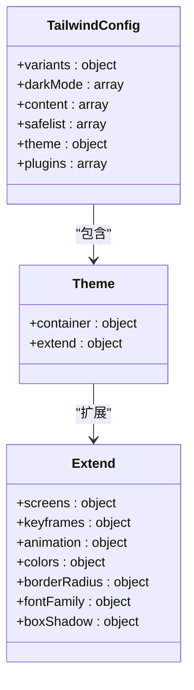
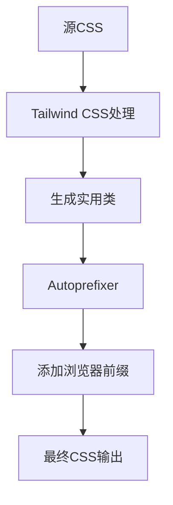
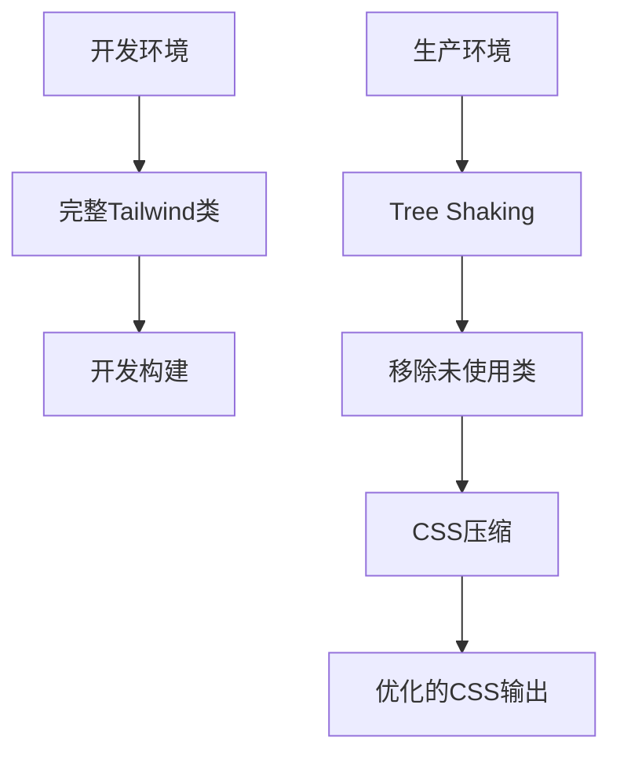

# 样式系统

<cite>
**本文档中引用的文件**   
- [tailwind.config.mjs](file://vibe_surf/frontend/tailwind.config.mjs)
- [postcss.config.js](file://vibe_surf/frontend/postcss.config.js)
- [package.json](file://vibe_surf/frontend/package.json)
- [index.css](file://vibe_surf/frontend/src/style/index.css)
- [classes.css](file://vibe_surf/frontend/src/style/classes.css)
- [applies.css](file://vibe_surf/frontend/src/style/applies.css)
- [App.css](file://vibe_surf/frontend/src/App.css)
- [variables.css](file://vibe_surf/chrome_extension/styles/variables.css)
- [base.css](file://vibe_surf/chrome_extension/styles/base.css)
- [custom-App.tsx](file://vibe_surf/frontend/src/customization/custom-App.tsx)
- [custom-wrapper.tsx](file://vibe_surf/frontend/src/customization/custom-wrapper.tsx)
- [use-custom-theme.ts](file://vibe_surf/frontend/src/customization/hooks/use-custom-theme.ts)
- [ThemeButtons/index.tsx](file://vibe_surf/frontend/src/components/core/appHeaderComponent/components/ThemeButtons/index.tsx)
</cite>

## 目录
1. [简介](#简介)
2. [Tailwind CSS 配置](#tailwind-css-配置)
3. [CSS 类组织结构](#css-类组织结构)
4. [PostCSS 处理流程](#postcss-处理流程)
5. [组件级与全局样式管理](#组件级与全局样式管理)
6. [UI 组件库样式定制](#ui-组件库样式定制)
7. [主题切换实现](#主题切换实现)
8. [性能优化策略](#性能优化策略)
9. [结论](#结论)

## 简介
本项目采用 Tailwind CSS 作为主要的样式框架，结合 PostCSS 进行处理，实现了现代化的前端样式系统。系统支持深色/浅色主题切换，通过 CSS 变量和 Tailwind 的 darkMode 配置实现。样式系统包含完整的响应式设计，支持从移动端到桌面端的多种设备。项目通过自定义插件扩展了 Tailwind 的功能，包括滚动条隐藏、多行文本截断等实用功能。整体架构遵循原子化 CSS 原则，通过组合基础类名实现复杂的 UI 设计。

## Tailwind CSS 配置

### 主题定制
Tailwind CSS 配置文件 `tailwind.config.mjs` 中定义了丰富的主题配置，包括颜色、字体、边框半径等。系统使用 CSS 变量来定义颜色主题，支持深色和浅色模式的无缝切换。



**Diagram sources**
- [tailwind.config.mjs](file://vibe_surf/frontend/tailwind.config.mjs#L1-L522)

### 插件集成
配置中集成了多个 Tailwind 插件，增强了框架的功能：

- `tailwindcss-animate`：提供动画支持
- `@tailwindcss/forms`：表单元素样式重置
- `@tailwindcss/typography`：排版样式
- `tailwindcss-dotted-background`：点状背景
- 自定义插件：实现滚动条隐藏、多行截断等功能

```javascript
plugins: [
  tailwindcssAnimate,
  tailwindcssForms({
    strategy: "class",
  }),
  plugin(({ addUtilities }) => {
    addUtilities({
      ".scrollbar-hide": {
        "-ms-overflow-style": "none",
        "scrollbar-width": "none",
        "&::-webkit-scrollbar": {
          display: "none",
        },
      },
      // ... 其他自定义工具类
    });
  }),
  tailwindcssTypography,
  tailwindcssDottedBackground,
  // ... 其他插件
]
```

**Section sources**
- [tailwind.config.mjs](file://vibe_surf/frontend/tailwind.config.mjs#L359-L518)

### 变体配置
配置文件中定义了自定义变体，扩展了 Tailwind 的响应式能力：

```javascript
variants: {
  extend: {
    display: ["group-hover"],
    textColor: ["group-increment-hover", "group-decrement-hover"],
  },
},
```

同时通过插件添加了自定义变体：

```javascript
plugin(({ addVariant }) => {
  addVariant("group-increment-hover", ":merge(.group-increment):hover &");
  addVariant("group-decrement-hover", ":merge(.group-decrement):hover &");
}),
```

**Section sources**
- [tailwind.config.mjs](file://vibe_surf/frontend/tailwind.config.mjs#L10-L15)
- [tailwind.config.mjs](file://vibe_surf/frontend/tailwind.config.mjs#L514-L517)

## CSS 类组织结构

### 样式文件结构
项目采用模块化的 CSS 组织方式，主要样式文件包括：

- `index.css`：主样式文件，包含 Tailwind 的基础、组件和工具类
- `classes.css`：特定组件的 CSS 类定义
- `applies.css`：使用 `@apply` 指令定义的复合类
- `App.css`：应用级别的全局样式

```mermaid
graph TD
A[index.css] --> B[@tailwind base]
A --> C[@tailwind components]
A --> D[@tailwind utilities]
A --> E[CSS 变量定义]
F[classes.css] --> G[特定组件样式]
H[applies.css] --> I[@apply 复合类]
I --> J[side-bar-arrangement]
I --> K[primary-input]
I --> L[round-button-form]
```

**Diagram sources**
- [index.css](file://vibe_surf/frontend/src/style/index.css#L1-L465)
- [classes.css](file://vibe_surf/frontend/src/style/classes.css#L1-L435)
- [applies.css](file://vibe_surf/frontend/src/style/applies.css#L1-L800)

### 响应式设计实现
系统实现了完整的响应式设计，支持多种屏幕尺寸：

```javascript
theme: {
  extend: {
    screens: {
      xl: "1200px",
      "2xl": "1400px",
      "3xl": "1500px",
    },
  },
},
```

通过 Tailwind 的响应式前缀（如 `sm:`、`md:`、`lg:`）实现不同屏幕尺寸下的样式调整。例如：

```css
.side-bar-arrangement {
  @apply flex h-full w-[14.5rem] flex-col overflow-hidden border-r scrollbar-hide;
}

/* 在小屏幕上调整侧边栏宽度 */
@media (max-width: 768px) {
  .side-bar-arrangement {
    @apply w-[4rem];
  }
}
```

**Section sources**
- [tailwind.config.mjs](file://vibe_surf/frontend/tailwind.config.mjs#L39-L43)
- [applies.css](file://vibe_surf/frontend/src/style/applies.css#L72-L73)

## PostCSS 处理流程

### PostCSS 配置
PostCSS 配置文件 `postcss.config.js` 定义了样式处理流程：

```javascript
module.exports = {
  plugins: {
    tailwindcss: {},
    autoprefixer: {},
  },
};
```

该配置集成了 Tailwind CSS 和 Autoprefixer 插件，确保生成的 CSS 兼容各种浏览器。



**Diagram sources**
- [postcss.config.js](file://vibe_surf/frontend/postcss.config.js#L1-L7)

### 处理流程
PostCSS 处理流程如下：

1. **Tailwind CSS 处理**：根据配置生成所有实用类
2. **Autoprefixer**：自动添加浏览器厂商前缀
3. **CSS 压缩**：在生产环境中压缩 CSS 文件
4. **Tree Shaking**：移除未使用的 CSS 类

此流程通过 Vite 构建工具集成，确保开发和生产环境的一致性。

**Section sources**
- [postcss.config.js](file://vibe_surf/frontend/postcss.config.js#L1-L7)
- [package.json](file://vibe_surf/frontend/package.json#L97-L103)

## 组件级与全局样式管理

### 组件级样式
组件级样式通过 CSS Modules 或内联样式实现，确保样式的封装性和可维护性。例如，在 React 组件中：

```tsx
import styles from './Component.module.css';

function MyComponent() {
  return <div className={styles.container}>Content</div>;
}
```

对于使用 Tailwind 的组件，直接在 JSX 中使用类名：

```tsx
function Button() {
  return (
    <button className="bg-primary text-white px-4 py-2 rounded">
      Click me
    </button>
  );
}
```

### 全局样式管理
全局样式通过 `index.css` 文件集中管理，包含：

- CSS 变量定义
- 基础样式重置
- 全局组件样式
- 动画定义

```css
@layer base {
  :root {
    --foreground: 0 0% 0%;
    --background: 0 0% 100%;
    /* ... 其他变量 */
  }
  
  .dark {
    --foreground: 0 0% 100%;
    --background: 240 6% 10%;
    /* ... 深色模式变量 */
  }
}
```

**Section sources**
- [index.css](file://vibe_surf/frontend/src/style/index.css#L8-L464)
- [App.css](file://vibe_surf/frontend/src/App.css#L1-L232)

## UI 组件库样式定制

### 组件样式定制
项目中的 UI 组件库通过 Tailwind 的 `@apply` 指令进行样式定制，创建可复用的组件类：

```css
@layer components {
  .primary-input {
    @apply form-input block w-full truncate rounded-md border border-border bg-background px-3 text-left text-sm placeholder:text-muted-foreground hover:border-muted-foreground focus:border-foreground focus:placeholder-transparent focus:ring-0 focus:ring-foreground disabled:pointer-events-none disabled:cursor-not-allowed disabled:bg-muted disabled:text-muted-foreground disabled:opacity-100 placeholder:disabled:text-muted-foreground;
  }
  
  .round-button-form {
    @apply flex h-12 w-12 cursor-pointer justify-center rounded-full bg-border px-3 py-1 shadow-md;
  }
}
```

### 自定义组件包装
通过 `custom-wrapper.tsx` 和 `custom-App.tsx` 文件实现组件的自定义包装：

```tsx
// custom-wrapper.tsx
export function CustomWrapper({ children }) {
  return children;
}

// custom-App.tsx
import App from "../App";

export default function CustomApp() {
  return <App />;
}
```

**Section sources**
- [applies.css](file://vibe_surf/frontend/src/style/applies.css#L67-L800)
- [custom-wrapper.tsx](file://vibe_surf/frontend/src/customization/custom-wrapper.tsx#L1-L4)
- [custom-App.tsx](file://vibe_surf/frontend/src/customization/custom-App.tsx#L1-L6)

## 主题切换实现

### 主题变量定义
主题系统基于 CSS 变量实现，定义了浅色和深色模式的配色方案：

```css
@layer base {
  :root {
    /* 浅色模式变量 */
    --foreground: 0 0% 0%;
    --background: 0 0% 100%;
    --muted: 240 5% 96%;
    /* ... */
  }
  
  .dark {
    /* 深色模式变量 */
    --foreground: 0 0% 100%;
    --background: 240 6% 10%;
    --muted: 240 4% 16%;
    /* ... */
  }
}
```

### 主题切换逻辑
主题切换通过 React Hook `use-custom-theme.ts` 实现：

```typescript
const useTheme = () => {
  const [systemTheme, setSystemTheme] = useState(false);
  const { setDark, dark } = useDarkStore((state) => ({
    setDark: state.setDark,
    dark: state.dark,
  }));

  const setThemePreference = (theme) => {
    if (theme === "light") {
      setDark(false);
      setSystemTheme(false);
    } else if (theme === "dark") {
      setDark(true);
      setSystemTheme(false);
    } else {
      setSystemTheme(true);
      handleSystemTheme();
    }
    localStorage.setItem("themePreference", theme);
  };

  return { systemTheme, dark, setThemePreference };
};
```

### 主题切换按钮
UI 层面通过 `ThemeButtons` 组件提供主题切换界面：

```tsx
export const ThemeButtons = () => {
  const { systemTheme, dark, setThemePreference } = useTheme();
  const [selectedTheme, setSelectedTheme] = useState(
    systemTheme ? "system" : dark ? "dark" : "light",
  );

  const handleThemeChange = (theme) => {
    setSelectedTheme(theme);
    setThemePreference(theme);
  };

  return (
    <div className="relative ml-auto inline-flex rounded-full border border-border">
      {/* 主题切换按钮 */}
    </div>
  );
};
```

**Section sources**
- [index.css](file://vibe_surf/frontend/src/style/index.css#L8-L464)
- [use-custom-theme.ts](file://vibe_surf/frontend/src/customization/hooks/use-custom-theme.ts#L1-L67)
- [ThemeButtons/index.tsx](file://vibe_surf/frontend/src/components/core/appHeaderComponent/components/ThemeButtons/index.tsx#L1-L103)

## 性能优化策略

### Tree Shaking
通过配置 Tailwind 的 content 选项，实现 CSS 的 Tree Shaking：

```javascript
content: [
  "app/**/*.{ts,tsx}",
  "components/**/*.{ts,tsx}",
  "./index.html",
  "./src/**/*.{js,ts,tsx,jsx}",
],
```

此配置确保只生成项目中实际使用的类，大幅减小 CSS 文件体积。

### 未使用 CSS 清除
系统通过以下方式清除未使用的 CSS：

1. **Safelist 配置**：确保动态生成的类名不会被清除
```javascript
safelist: [
  "bg-status-blue",
  "bg-status-green",
  "bg-status-red",
  "bg-status-yellow",
],
```

2. **PurgeCSS 集成**：在生产构建中自动移除未使用的类

### 样式优化建议
1. **使用原子化类**：优先使用 Tailwind 的原子化类而非自定义 CSS
2. **避免重复样式**：通过 `@apply` 创建可复用的组件类
3. **按需加载**：将大型样式表拆分为按需加载的模块
4. **压缩优化**：在生产环境中启用 CSS 压缩



**Diagram sources**
- [tailwind.config.mjs](file://vibe_surf/frontend/tailwind.config.mjs#L17-L22)
- [tailwind.config.mjs](file://vibe_surf/frontend/tailwind.config.mjs#L23-L28)

## 结论
本项目的样式系统基于 Tailwind CSS 构建，实现了现代化、可维护的前端样式架构。系统通过 CSS 变量和 Tailwind 配置实现了完整的主题支持，包括浅色、深色和系统自动模式。PostCSS 处理流程确保了样式的兼容性和性能优化。组件级和全局样式的分离提高了代码的可维护性，而 Tree Shaking 和未使用 CSS 清除策略有效减小了最终包的体积。整体样式系统遵循原子化 CSS 原则，通过组合基础类名实现复杂的 UI 设计，同时保持了良好的性能和可扩展性。