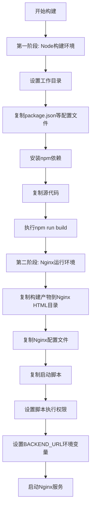
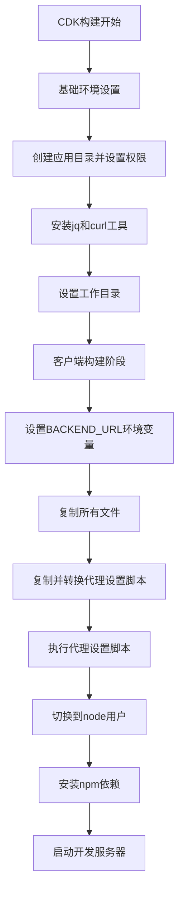
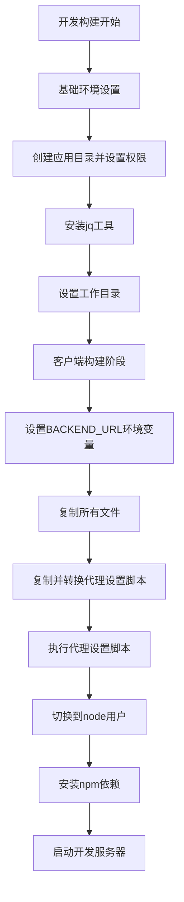
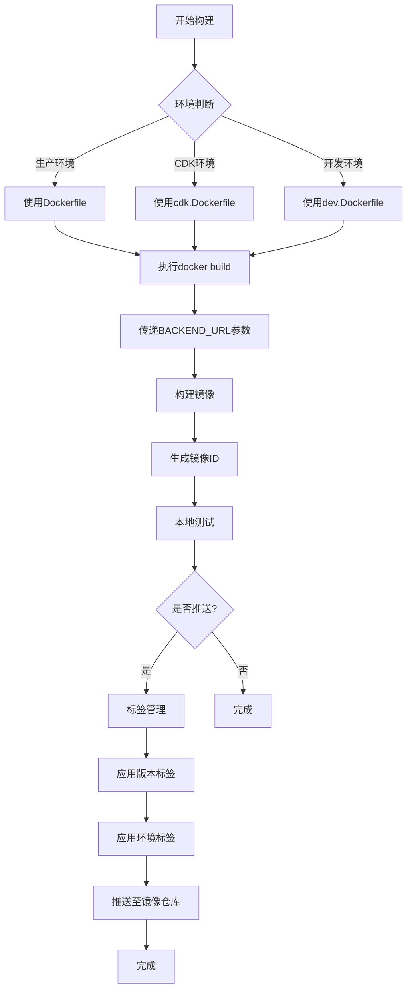
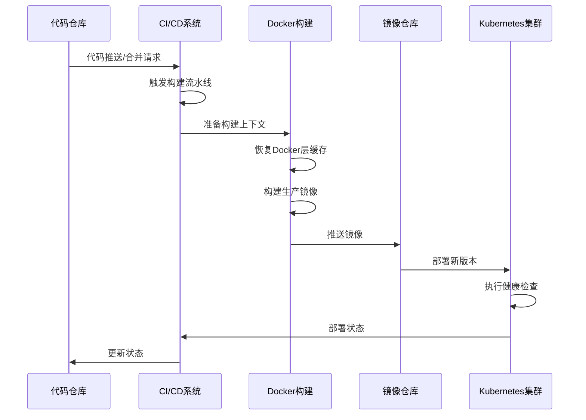
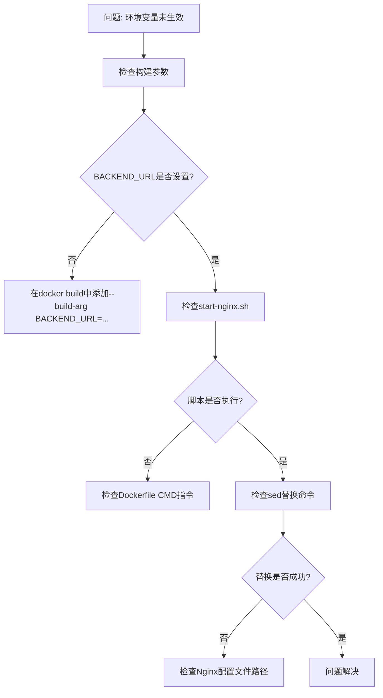

# 部署构建

<cite>
**本文档中引用的文件**  
- [Dockerfile](file://vibe_surf/frontend/Dockerfile)
- [cdk.Dockerfile](file://vibe_surf/frontend/cdk.Dockerfile)
- [dev.Dockerfile](file://vibe_surf/frontend/dev.Dockerfile)
- [nginx.conf](file://vibe_surf/frontend/nginx.conf)
- [start-nginx.sh](file://vibe_surf/frontend/start-nginx.sh)
- [set_proxy.sh](file://vibe_surf/frontend/set_proxy.sh)
- [main.py](file://vibe_surf/backend/main.py)
- [package.json](file://vibe_surf/frontend/package.json)
</cite>

## 目录
1. [简介](#简介)
2. [项目结构](#项目结构)
3. [Docker多阶段构建策略](#docker多阶段构建策略)
4. [Nginx服务器配置与静态资源优化](#nginx服务器配置与静态资源优化)
5. [镜像构建、标签管理与推送流程](#镜像构建标签管理与推送流程)
6. [CI/CD集成中的构建步骤与缓存策略](#cicd集成中的构建步骤与缓存策略)
7. [容器化部署最佳实践与性能调优](#容器化部署最佳实践与性能调优)
8. [常见部署问题诊断与解决方案](#常见部署问题诊断与解决方案)
9. [结论](#结论)

## 简介
本文档详细介绍了VibeSurf项目的部署构建流程，重点阐述了基于Docker的多环境容器化部署方案。文档涵盖了从开发到生产环境的完整构建流程，包括Docker多阶段构建策略、Nginx服务器配置、镜像管理、CI/CD集成以及性能优化等方面的内容。通过本指南，开发和运维团队可以深入了解项目的部署架构，实施最佳实践，并有效解决部署过程中可能遇到的问题。

## 项目结构
VibeSurf项目采用前后端分离的架构设计，前端位于`vibe_surf/frontend`目录，后端服务位于`vibe_surf/backend`目录。项目包含多个Dockerfile用于不同环境的构建，以及Nginx配置文件用于生产环境的静态资源服务。核心部署相关文件集中在前端目录中，包括用于生产构建的Dockerfile、用于CDK环境的cdk.Dockerfile、用于开发环境的dev.Dockerfile，以及Nginx服务器配置和启动脚本。

**Section sources**
- [Dockerfile](file://vibe_surf/frontend/Dockerfile)
- [cdk.Dockerfile](file://vibe_surf/frontend/cdk.Dockerfile)
- [dev.Dockerfile](file://vibe_surf/frontend/dev.Dockerfile)
- [nginx.conf](file://vibe_surf/frontend/nginx.conf)

## Docker多阶段构建策略

### 生产环境构建 (Dockerfile)
生产环境使用标准的多阶段Docker构建策略，包含两个主要阶段：

1. **前端构建阶段**：基于`node:20-alpine`镜像，安装依赖并构建前端应用
2. **Nginx服务阶段**：基于官方Nginx镜像，将构建产物复制到Nginx容器中并配置启动脚本

该策略通过分离构建环境和运行环境，实现了最小化生产镜像体积，同时确保了构建过程的可重复性。



**Diagram sources**
- [Dockerfile](file://vibe_surf/frontend/Dockerfile#L1-L16)

**Section sources**
- [Dockerfile](file://vibe_surf/frontend/Dockerfile#L1-L16)

### CDK环境构建 (cdk.Dockerfile)
CDK环境的Dockerfile针对特定平台（linux/amd64）进行了优化，使用`node:21-bookworm-slim`基础镜像，并安装了额外的工具（jq, curl）以支持云开发工具包的需求。该构建策略特别配置了代理设置，通过`set_proxy.sh`脚本动态修改`package.json`中的代理配置，以适应CDK环境的网络要求。



**Diagram sources**
- [cdk.Dockerfile](file://vibe_surf/frontend/cdk.Dockerfile#L1-L26)

**Section sources**
- [cdk.Dockerfile](file://vibe_surf/frontend/cdk.Dockerfile#L1-L26)
- [set_proxy.sh](file://vibe_surf/frontend/set_proxy.sh#L1-L10)

### 开发环境构建 (dev.Dockerfile)
开发环境的Dockerfile与CDK环境类似，但简化了工具安装（仅安装jq），同样采用多阶段构建策略。该配置专为本地开发和调试设计，通过`npm run dev:docker`命令启动开发服务器，支持热重载和实时更新，提高了开发效率。



**Diagram sources**
- [dev.Dockerfile](file://vibe_surf/frontend/dev.Dockerfile#L1-L26)

**Section sources**
- [dev.Dockerfile](file://vibe_surf/frontend/dev.Dockerfile#L1-L26)

## Nginx服务器配置与静态资源优化

### Nginx配置详解
生产环境的Nginx配置文件`nginx.conf`经过精心优化，以提供高效的静态资源服务和良好的用户体验。

```mermaid
graph TD
A[server块] --> B[Gzip压缩配置]
B --> C[启用Gzip]
C --> D[设置压缩级别为2]
D --> E[最小压缩长度1000字节]
E --> F[压缩类型: text/xml, text/css]
F --> G[HTTP版本1.1]
G --> H[启用vary头]
H --> I[禁用IE 4-6的Gzip]
A --> J[监听端口80]
J --> K[location / 配置]
K --> L[根目录: /usr/share/nginx/html]
L --> M[索引文件: index.html, index.htm]
M --> N[try_files: $uri $uri/ /index.html =404]
A --> O[包含额外配置]
O --> P[/etc/nginx/extra-conf.d/*.conf]
```

**Diagram sources**
- [nginx.conf](file://vibe_surf/frontend/nginx.conf#L1-L21)

**Section sources**
- [nginx.conf](file://vibe_surf/frontend/nginx.conf#L1-L21)

### 静态资源服务优化
Nginx配置中包含了多项性能优化措施：

1. **Gzip压缩**：启用Gzip压缩以减少传输数据量，特别针对文本类资源（XML和CSS）进行压缩，压缩级别设置为2以平衡压缩效率和CPU开销
2. **单页应用路由**：通过`try_files $uri $uri/ /index.html =404`配置，支持前端单页应用的客户端路由，确保所有路径请求都能正确返回index.html
3. **模块化配置**：通过`include`指令支持额外配置文件的动态加载，便于扩展和维护
4. **环境变量注入**：在Docker构建过程中，通过`start-nginx.sh`脚本将`BACKEND_URL`环境变量注入到Nginx配置中，实现后端API地址的动态配置

## 镜像构建、标签管理与推送流程

### 镜像构建流程
项目的镜像构建遵循标准化流程，根据不同环境使用相应的Dockerfile：



**Section sources**
- [Dockerfile](file://vibe_surf/frontend/Dockerfile)
- [cdk.Dockerfile](file://vibe_surf/frontend/cdk.Dockerfile)
- [dev.Dockerfile](file://vibe_surf/frontend/dev.Dockerfile)

### 标签管理策略
镜像标签管理采用多维度策略，确保镜像的可追溯性和环境隔离：

1. **版本标签**：使用语义化版本号（如v1.2.3）标记发布版本
2. **环境标签**：使用环境标识（如-dev, -cdk, -prod）区分不同部署环境
3. **提交标签**：使用Git提交哈希值标记特定代码状态
4. **最新标签**：使用latest标签指向最新稳定版本

这种多标签策略支持灵活的部署和回滚操作，同时保持了清晰的版本历史。

## CI/CD集成中的构建步骤与缓存策略

### CI/CD构建流程
CI/CD流水线中的构建步骤与本地构建保持一致，但增加了自动化和优化环节：



**Section sources**
- [Dockerfile](file://vibe_surf/frontend/Dockerfile)
- [cdk.Dockerfile](file://vibe_surf/frontend/cdk.Dockerfile)

### 缓存策略
构建过程采用了多层次的缓存策略以提高效率：

1. **Docker层缓存**：通过合理组织Dockerfile中的指令顺序，最大化利用Docker的层缓存机制。将不经常变化的步骤（如依赖安装）放在前面，频繁变化的步骤（如源码复制）放在后面
2. **npm依赖缓存**：在CI/CD环境中，配置npm缓存以避免重复下载依赖包
3. **构建产物缓存**：对于大型项目，可以配置构建产物缓存，避免重复的编译过程
4. **跨构建缓存**：使用Docker BuildKit的`--cache-from`和`--cache-to`选项实现跨构建的缓存共享

## 容器化部署最佳实践与性能调优

### 最佳实践
1. **最小化基础镜像**：使用Alpine Linux等轻量级基础镜像减少攻击面和镜像体积
2. **非root用户运行**：在容器中使用非root用户运行应用，提高安全性
3. **环境变量配置**：通过环境变量而非硬编码配置应用参数，提高配置灵活性
4. **健康检查**：实现容器健康检查，确保服务的可用性
5. **日志管理**：将日志输出到stdout/stderr，便于容器化环境的日志收集

### 性能调优建议
1. **资源限制**：为容器设置合理的CPU和内存限制，避免资源争用
2. **连接池优化**：根据容器资源调整数据库和HTTP客户端的连接池大小
3. **静态资源缓存**：配置适当的HTTP缓存头，利用浏览器缓存减少重复请求
4. **Gzip压缩**：确保文本资源的Gzip压缩已启用，减少网络传输量
5. **监控与告警**：集成监控系统，实时跟踪容器性能指标

## 常见部署问题诊断与解决方案

### 环境变量未生效
**问题描述**：后端URL配置未正确应用到前端应用中。

**解决方案**：
1. 确认`BACKEND_URL`环境变量在构建时正确传递
2. 检查`start-nginx.sh`脚本是否成功执行
3. 验证Nginx配置文件中的占位符是否被正确替换



**Section sources**
- [start-nginx.sh](file://vibe_surf/frontend/start-nginx.sh#L1-L9)
- [Dockerfile](file://vibe_surf/frontend/Dockerfile#L15-L16)

### 构建缓存失效
**问题描述**：Docker构建未能有效利用缓存，导致构建时间过长。

**解决方案**：
1. 检查Dockerfile指令顺序，确保不经常变化的步骤在前
2. 使用.dockerignore文件排除不必要的文件
3. 在CI/CD中配置Docker层缓存

### 静态资源404错误
**问题描述**：前端路由导致静态资源返回404错误。

**解决方案**：
1. 确认Nginx的`try_files`配置正确
2. 检查构建产物是否完整复制到容器中
3. 验证文件权限设置

## 结论
VibeSurf项目的部署构建流程采用了现代化的容器化技术栈，通过多阶段Docker构建策略实现了不同环境的差异化配置。Nginx服务器的优化配置确保了静态资源的高效服务，而完善的CI/CD集成和缓存策略则提高了部署效率。通过遵循本文档中的最佳实践和解决方案，团队可以建立稳定、高效的部署流程，为应用的持续交付提供可靠保障。