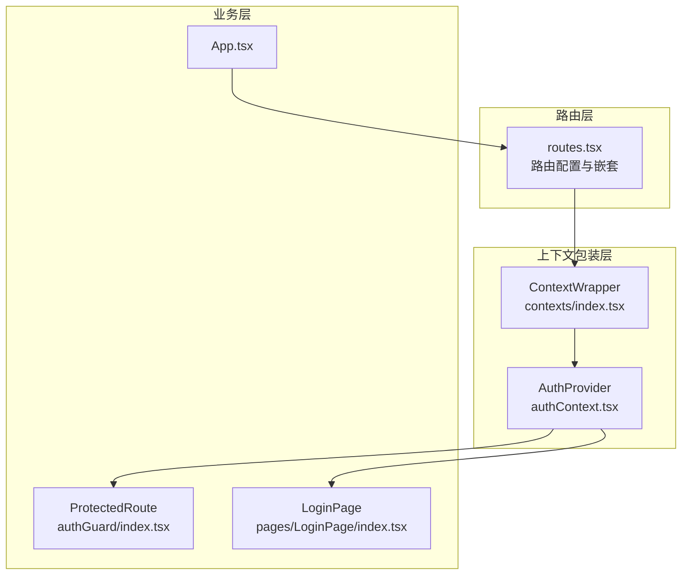
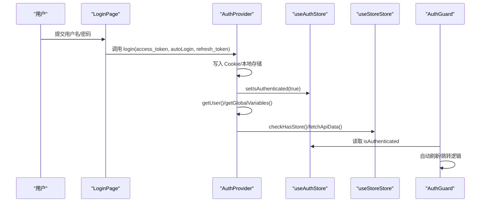
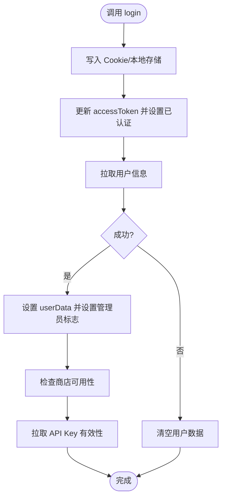
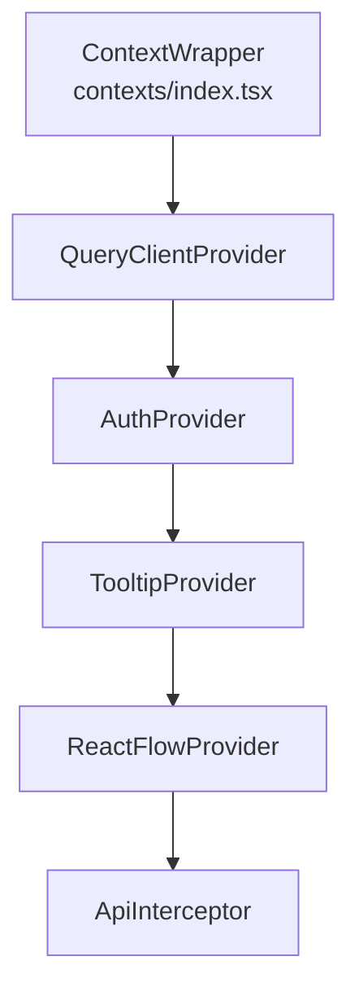
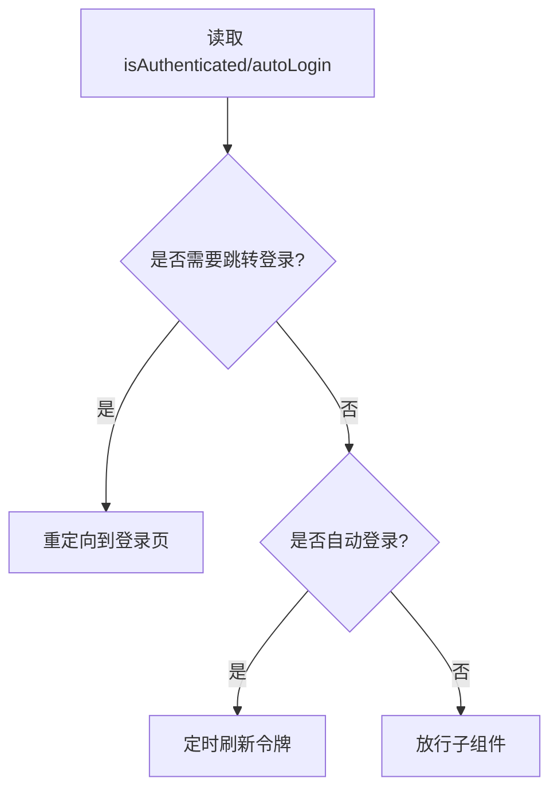
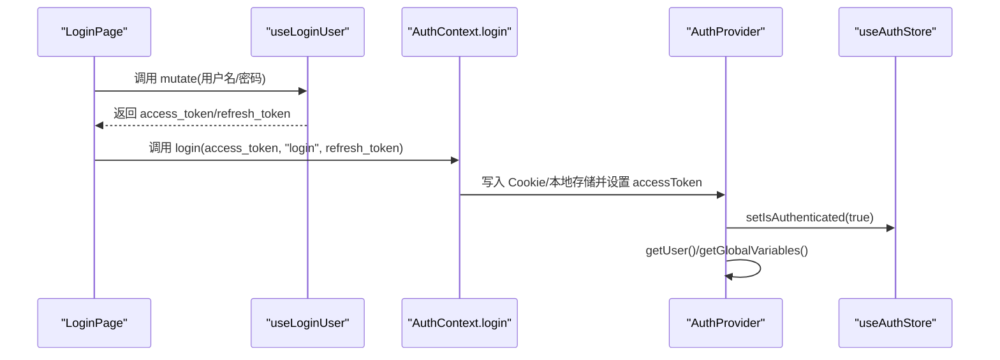
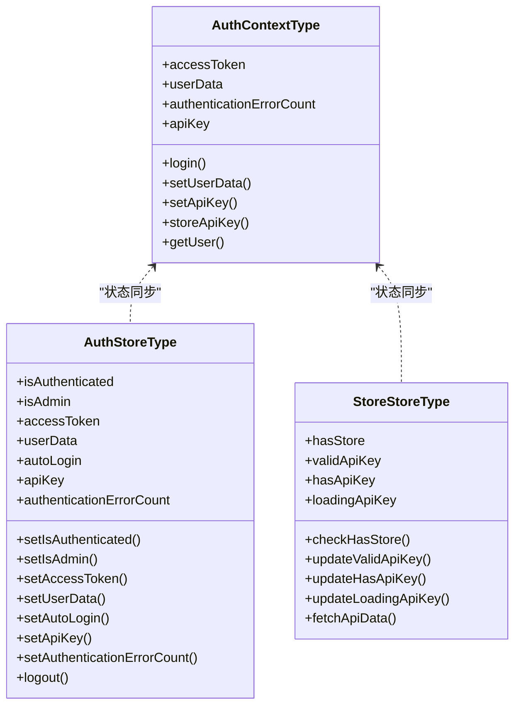
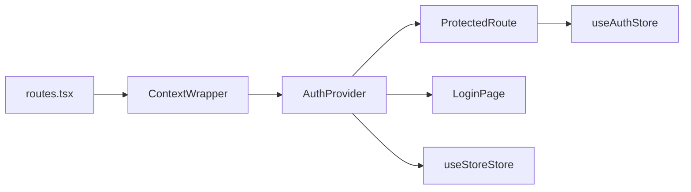

# 上下文管理

<cite>
**本文引用的文件**
- [authContext.tsx](file://vibe_surf/frontend/src/contexts/authContext.tsx)
- [index.tsx（上下文包装器）](file://vibe_surf/frontend/src/contexts/index.tsx)
- [auth.ts 类型定义](file://vibe_surf/frontend/src/types/contexts/auth.ts)
- [authStore.ts](file://vibe_surf/frontend/src/stores/authStore.ts)
- [storeStore.ts](file://vibe_surf/frontend/src/stores/storeStore.ts)
- [routes.tsx](file://vibe_surf/frontend/src/routes.tsx)
- [authGuard/index.tsx](file://vibe_surf/frontend/src/components/authorization/authGuard/index.tsx)
- [LoginPage/index.tsx](file://vibe_surf/frontend/src/pages/LoginPage/index.tsx)
- [App.tsx](file://vibe_surf/frontend/src/App.tsx)
- [store/index.ts（Zustand store 类型）](file://vibe_surf/frontend/src/types/zustand/store/index.ts)
- [auth/index.ts（Zustand auth 类型）](file://vibe_surf/frontend/src/types/zustand/auth/index.ts)
</cite>

## 目录
1. [简介](#简介)
2. [项目结构](#项目结构)
3. [核心组件](#核心组件)
4. [架构总览](#架构总览)
5. [详细组件分析](#详细组件分析)
6. [依赖关系分析](#依赖关系分析)
7. [性能考量](#性能考量)
8. [故障排查指南](#故障排查指南)
9. [结论](#结论)

## 简介
本文件系统性梳理 VibeSurf 前端中基于 React Context 的认证上下文管理方案，重点围绕 authContext 的实现与应用，涵盖：
- 认证状态的上下文传递与权限验证逻辑
- 用户会话管理（登录、登出、令牌刷新）
- Context Provider 的层级结构与作用范围
- Context 与 Zustand store 的协同工作机制
- 在避免 props 层层传递中的作用
- 使用示例：如何在组件中订阅 Context 和处理更新
- 性能影响与优化策略（如避免在渲染中创建新对象）

## 项目结构
VibeSurf 前端采用“路由 + 上下文包装器”的组织方式，所有页面均被 ContextWrapper 包裹，确保全局上下文可用。认证相关的 Provider 位于上下文包装器内部，保证路由守卫、页面组件、弹窗等均可访问认证状态。

图表来源
- [routes.tsx](file://vibe_surf/frontend/src/routes.tsx#L49-L92)
- [index.tsx（上下文包装器）](file://vibe_surf/frontend/src/contexts/index.tsx#L10-L31)
- [authContext.tsx](file://vibe_surf/frontend/src/contexts/authContext.tsx#L32-L125)
- [authGuard/index.tsx](file://vibe_surf/frontend/src/components/authorization/authGuard/index.tsx#L1-L59)
- [LoginPage/index.tsx](file://vibe_surf/frontend/src/pages/LoginPage/index.tsx#L1-L142)
- [App.tsx](file://vibe_surf/frontend/src/App.tsx#L1-L23)

章节来源
- [routes.tsx](file://vibe_surf/frontend/src/routes.tsx#L49-L92)
- [index.tsx（上下文包装器）](file://vibe_surf/frontend/src/contexts/index.tsx#L10-L31)

## 核心组件
- AuthContext 与 AuthProvider：提供认证状态、登录方法、用户数据、API Key 等能力，并通过 Context 向子树分发。
- AuthGuard：基于 Zustand 的认证状态进行路由保护与自动登录/刷新控制。
- LoginPage：演示如何在组件中使用 AuthContext.login 完成登录流程。
- Zustand stores：
  - useAuthStore：维护认证态（是否已认证、管理员、令牌、用户数据等），支持登出重置。
  - useStoreStore：维护商店相关状态（是否启用商店、API Key 是否有效、加载状态等），并负责拉取 API Key 有效性。

章节来源
- [authContext.tsx](file://vibe_surf/frontend/src/contexts/authContext.tsx#L18-L28)
- [authContext.tsx](file://vibe_surf/frontend/src/contexts/authContext.tsx#L32-L125)
- [authGuard/index.tsx](file://vibe_surf/frontend/src/components/authorization/authGuard/index.tsx#L1-L59)
- [LoginPage/index.tsx](file://vibe_surf/frontend/src/pages/LoginPage/index.tsx#L1-L142)
- [authStore.ts](file://vibe_surf/frontend/src/stores/authStore.ts#L1-L46)
- [storeStore.ts](file://vibe_surf/frontend/src/stores/storeStore.ts#L1-L37)

## 架构总览
认证上下文与 Zustand 协同工作的方式如下：
- AuthProvider 负责从 Cookie/本地存储读取初始认证状态，提供 login 方法写入 Cookie/本地存储，并触发用户信息与商店 API Key 的拉取。
- AuthGuard 通过 useAuthStore 判断是否需要跳转到登录页或自动刷新令牌。
- useAuthStore 维护全局认证状态，与 AuthProvider 写入的状态保持一致。
- useStoreStore 负责根据后端接口判断商店可用性与 API Key 有效性，并在登录后触发拉取。

图表来源
- [LoginPage/index.tsx](file://vibe_surf/frontend/src/pages/LoginPage/index.tsx#L33-L52)
- [authContext.tsx](file://vibe_surf/frontend/src/contexts/authContext.tsx#L81-L106)
- [authGuard/index.tsx](file://vibe_surf/frontend/src/components/authorization/authGuard/index.tsx#L11-L59)
- [storeStore.ts](file://vibe_surf/frontend/src/stores/storeStore.ts#L11-L37)
- [authStore.ts](file://vibe_surf/frontend/src/stores/authStore.ts#L11-L46)

## 详细组件分析

### AuthContext 与 AuthProvider
- 初始化值：包含 accessToken、login、userData、setUserData、authenticationErrorCount、apiKey、setApiKey、storeApiKey、getUser 等字段，用于向子树提供认证相关能力。
- 登录流程：
  - 写入 Cookie（访问令牌、自动登录选项、可选刷新令牌）
  - 写入本地存储（访问令牌）
  - 更新 accessToken
  - 设置认证状态为已认证
  - 拉取用户信息与全局变量
- 用户信息与商店 API Key：
  - getUser 成功后设置 userData，并同步设置管理员标志；随后检查商店可用性与拉取 API Key。
  - getGlobalVariables 触发全局变量查询。

图表来源
- [authContext.tsx](file://vibe_surf/frontend/src/contexts/authContext.tsx#L81-L106)

章节来源
- [authContext.tsx](file://vibe_surf/frontend/src/contexts/authContext.tsx#L18-L28)
- [authContext.tsx](file://vibe_surf/frontend/src/contexts/authContext.tsx#L32-L125)

### 上下文包装器与路由层级
- ContextWrapper 将 QueryClientProvider、AuthProvider、TooltipProvider、ReactFlowProvider、ApiInterceptor 等包裹在内，作为全局上下文根节点。
- routes.tsx 中对 Playground 与主路由分别以 ContextWrapper 包裹，确保子路由树均可访问认证上下文。

图表来源
- [index.tsx（上下文包装器）](file://vibe_surf/frontend/src/contexts/index.tsx#L10-L31)
- [routes.tsx](file://vibe_surf/frontend/src/routes.tsx#L49-L92)

章节来源
- [index.tsx（上下文包装器）](file://vibe_surf/frontend/src/contexts/index.tsx#L10-L31)
- [routes.tsx](file://vibe_surf/frontend/src/routes.tsx#L49-L92)

### 路由守卫与权限验证
- ProtectedRoute 基于 useAuthStore 的 isAuthenticated 与 autoLogin 状态决定是否跳转登录页。
- 当满足自动登录条件时，定时刷新访问令牌；否则在窗口焦点时刷新。
- 该守卫通常包裹受保护路由，确保未认证用户无法进入受保护页面。

图表来源
- [authGuard/index.tsx](file://vibe_surf/frontend/src/components/authorization/authGuard/index.tsx#L11-L59)

章节来源
- [authGuard/index.tsx](file://vibe_surf/frontend/src/components/authorization/authGuard/index.tsx#L1-L59)

### 登录页面与 Context 使用示例
- LoginPage 通过 useContext(AuthContext) 获取 login 方法，在登录成功后调用 login 写入令牌并触发后续初始化流程。
- 登录失败时通过 Alert Store 显示错误提示。

图表来源
- [LoginPage/index.tsx](file://vibe_surf/frontend/src/pages/LoginPage/index.tsx#L33-L52)
- [authContext.tsx](file://vibe_surf/frontend/src/contexts/authContext.tsx#L81-L106)
- [authStore.ts](file://vibe_surf/frontend/src/stores/authStore.ts#L11-L46)

章节来源
- [LoginPage/index.tsx](file://vibe_surf/frontend/src/pages/LoginPage/index.tsx#L1-L142)
- [authContext.tsx](file://vibe_surf/frontend/src/contexts/authContext.tsx#L81-L106)

### Context 与 Zustand 协同机制
- 认证状态一致性：
  - AuthProvider 写入 Cookie/本地存储后，立即通过 useAuthStore.setState 设置 isAuthenticated 与 accessToken，确保路由守卫与组件读取到最新状态。
- 商店状态联动：
  - AuthProvider 在登录后调用 useStoreStore 的 checkHasStore 与 fetchApiData，以初始化商店可用性与 API Key 有效性。
- 类型约束：
  - AuthContextType 与 AuthStoreType 分别定义了 Context 与 Zustand 的对外接口，保证类型安全。

图表来源
- [auth.ts 类型定义](file://vibe_surf/frontend/src/types/contexts/auth.ts#L1-L17)
- [auth/index.ts（Zustand auth 类型）](file://vibe_surf/frontend/src/types/zustand/auth/index.ts#L1-L28)
- [store/index.ts（Zustand store 类型）](file://vibe_surf/frontend/src/types/zustand/store/index.ts#L1-L11)

章节来源
- [authStore.ts](file://vibe_surf/frontend/src/stores/authStore.ts#L1-L46)
- [storeStore.ts](file://vibe_surf/frontend/src/stores/storeStore.ts#L1-L37)
- [auth.ts 类型定义](file://vibe_surf/frontend/src/types/contexts/auth.ts#L1-L17)

## 依赖关系分析
- 路由到上下文包装器：routes.tsx 对多个路由段使用 ContextWrapper，确保子树具备认证上下文。
- 上下文到守卫：ProtectedRoute 依赖 useAuthStore 的状态进行权限判断。
- 上下文到页面：LoginPage 依赖 AuthContext.login 完成登录。
- 上下文到商店状态：AuthProvider 调用 useStoreStore 初始化商店与 API Key。

图表来源
- [routes.tsx](file://vibe_surf/frontend/src/routes.tsx#L49-L92)
- [index.tsx（上下文包装器）](file://vibe_surf/frontend/src/contexts/index.tsx#L10-L31)
- [authContext.tsx](file://vibe_surf/frontend/src/contexts/authContext.tsx#L32-L125)
- [authGuard/index.tsx](file://vibe_surf/frontend/src/components/authorization/authGuard/index.tsx#L1-L59)
- [LoginPage/index.tsx](file://vibe_surf/frontend/src/pages/LoginPage/index.tsx#L1-L142)
- [storeStore.ts](file://vibe_surf/frontend/src/stores/storeStore.ts#L1-L37)
- [authStore.ts](file://vibe_surf/frontend/src/stores/authStore.ts#L1-L46)

章节来源
- [routes.tsx](file://vibe_surf/frontend/src/routes.tsx#L49-L92)
- [authGuard/index.tsx](file://vibe_surf/frontend/src/components/authorization/authGuard/index.tsx#L1-L59)
- [LoginPage/index.tsx](file://vibe_surf/frontend/src/pages/LoginPage/index.tsx#L1-L142)

## 性能考量
- 避免在渲染中创建新对象：
  - AuthProvider 的 Provider value 中直接传入函数引用与静态常量，不创建新的对象或函数实例，减少不必要的重渲染。
  - 若需在 value 中传入回调，请确保其稳定（例如通过 useCallback 包装），避免每次渲染都产生新引用导致子组件无谓重渲染。
- 减少订阅粒度：
  - 将 Context 的订阅拆分为细粒度的 Zustand store（如 useAuthStore、useStoreStore），仅在需要时订阅对应状态，降低无关状态变化引发的重渲染。
- 令牌刷新与定时器：
  - ProtectedRoute 中的定时刷新逻辑仅在满足自动登录条件时启动，避免在不需要时产生额外开销。
- 本地存储与 Cookie：
  - 登录后写入 Cookie/本地存储，避免每次渲染都发起昂贵的网络请求来恢复状态。

章节来源
- [authContext.tsx](file://vibe_surf/frontend/src/contexts/authContext.tsx#L107-L125)
- [authGuard/index.tsx](file://vibe_surf/frontend/src/components/authorization/authGuard/index.tsx#L23-L40)

## 故障排查指南
- 登录后仍被重定向到登录页：
  - 检查 useAuthStore.isAuthenticated 是否被正确设置为 true。
  - 确认 ProtectedRoute 的 autoLogin/isAuthenticated 条件是否满足。
- 用户信息未加载：
  - 确认 AuthProvider.login 后是否调用了 getUser 与 getGlobalVariables。
  - 检查后端接口返回与错误处理分支。
- API Key 无效或商店不可用：
  - 确认 useStoreStore.fetchApiData 是否被调用且返回有效结果。
  - 检查后端接口 checkHasApiKey 与 checkHasStore 的返回值。
- 令牌过期或刷新异常：
  - 检查 ProtectedRoute 的定时刷新逻辑是否按预期执行。
  - 确认环境变量中的令牌过期时间配置是否合理。

章节来源
- [authGuard/index.tsx](file://vibe_surf/frontend/src/components/authorization/authGuard/index.tsx#L11-L59)
- [authContext.tsx](file://vibe_surf/frontend/src/contexts/authContext.tsx#L81-L106)
- [storeStore.ts](file://vibe_surf/frontend/src/stores/storeStore.ts#L22-L37)

## 结论
VibeSurf 的认证上下文管理通过 AuthContext 与 AuthProvider 提供统一的认证状态与登录入口，并与 Zustand 的 useAuthStore、useStoreStore 协同，实现了：
- 明确的权限验证与路由保护
- 用户会话与商店状态的联动初始化
- 清晰的上下文层级与作用范围
- 可扩展的性能优化空间（避免渲染中创建新对象、细粒度订阅）

在实际开发中，建议：
- 在组件中优先使用 Context 与 Zustand 的组合，避免 props 深度传递
- 对 Context 的 value 进行稳定性优化，必要时使用 useCallback
- 严格区分路由守卫与业务逻辑，确保登录流程清晰可追踪