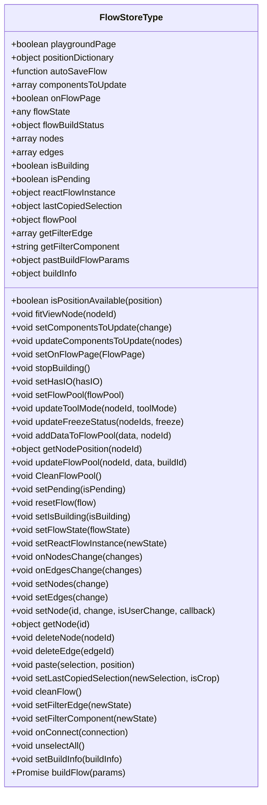
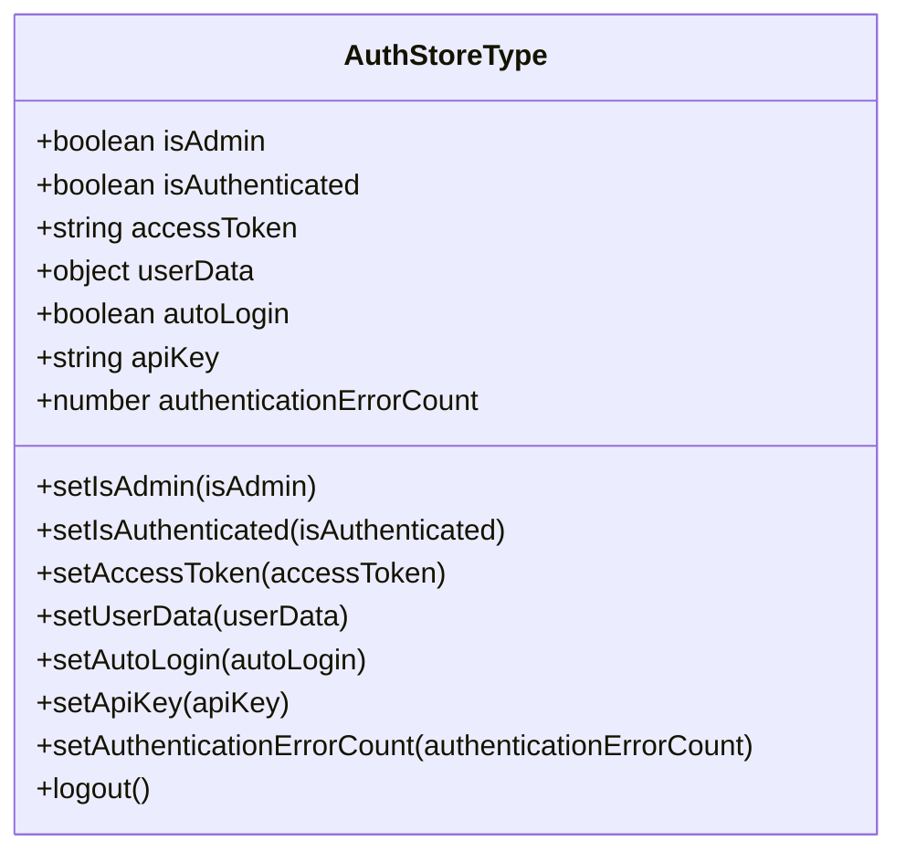
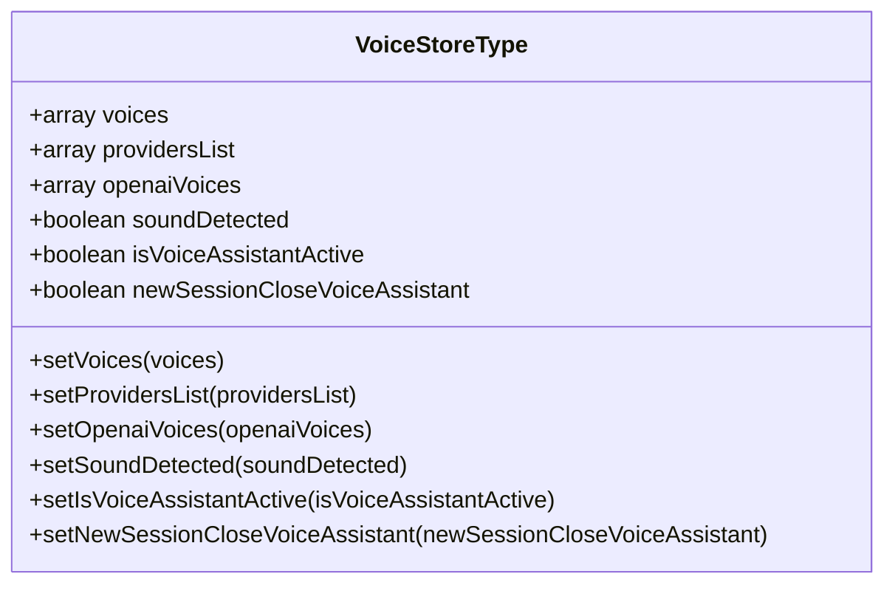
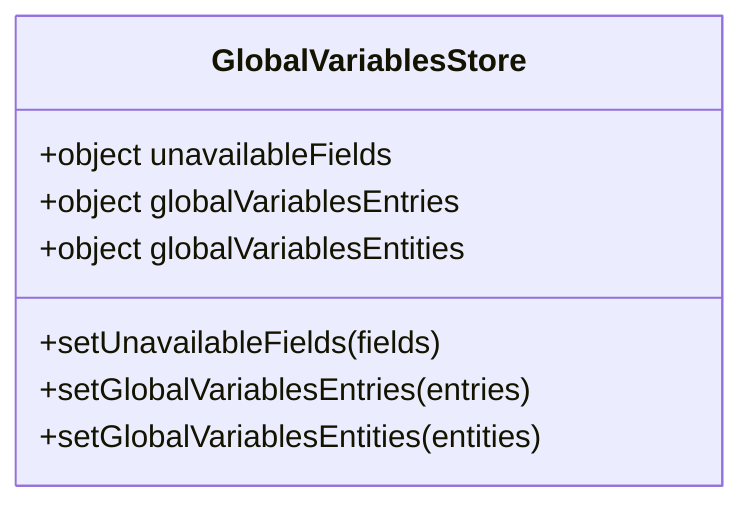
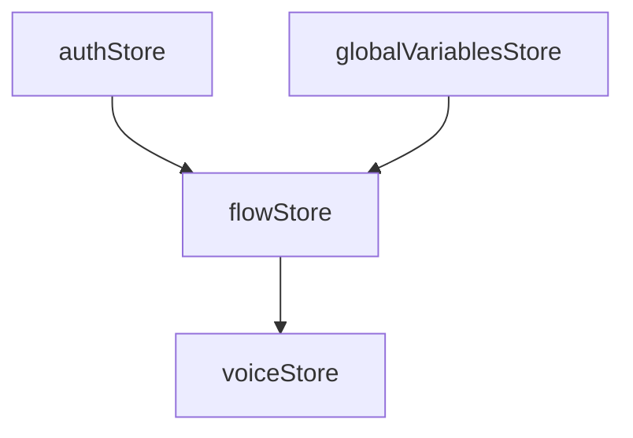

# 全局状态管理

<cite>
**本文档中引用的文件**  
- [flowStore.ts](file://vibe_surf/frontend/src/stores/flowStore.ts)
- [authStore.ts](file://vibe_surf/frontend/src/stores/authStore.ts)
- [voiceStore.ts](file://vibe_surf/frontend/src/stores/voiceStore.ts)
- [globalVariables.ts](file://vibe_surf/frontend/src/stores/globalVariablesStore/globalVariables.ts)
- [voice.types.ts](file://vibe_surf/frontend/src/types/zustand/voice/voice.types.ts)
- [auth/index.ts](file://vibe_surf/frontend/src/types/zustand/auth/index.ts)
- [flow/index.ts](file://vibe_surf/frontend/src/types/zustand/flow/index.ts)
- [globalVariables/index.ts](file://vibe_surf/frontend/src/types/zustand/globalVariables/index.ts)
</cite>

## 目录
1. [简介](#简介)
2. [核心状态存储设计](#核心状态存储设计)
3. [flowStore 工作流状态管理](#flowstore-工作流状态管理)
4. [authStore 认证状态管理](#authstore-认证状态管理)
5. [voiceStore 语音状态管理](#voicestore-语音状态管理)
6. [globalVariablesStore 全局变量管理](#globalvariablesstore-全局变量管理)
7. [状态同步与依赖关系](#状态同步与依赖关系)
8. [状态持久化机制](#状态持久化机制)
9. [状态追踪与调试](#状态追踪与调试)
10. [多组件状态共享最佳实践](#多组件状态共享最佳实践)

## 简介
VibeSurf 项目采用 Zustand 作为全局状态管理解决方案，实现了高效、可维护的状态管理架构。该系统通过多个专用 store 分别管理不同类型的应用状态，包括工作流状态、认证状态、语音状态和全局变量。这种模块化设计提高了代码的可读性和可维护性，同时确保了状态管理的高效性和可靠性。

**本节不分析具体源文件，因此不提供源引用**

## 核心状态存储设计
VibeSurf 的全局状态管理基于 Zustand 库实现，采用了模块化 store 设计模式。每个 store 负责管理特定领域的应用状态，通过 TypeScript 类型定义确保类型安全。store 之间通过导入和调用彼此的实例实现状态共享和通信，形成了一个松耦合但高效协作的状态管理系统。

**本节不分析具体源文件，因此不提供源引用**

## flowStore 工作流状态管理

flowStore 是 VibeSurf 中最复杂的状态存储，负责管理工作流的完整状态，包括节点、边、构建状态和用户界面状态。该 store 实现了完整的 CRUD 操作，支持节点和边的增删改查，以及工作流的构建、重置和清理功能。

状态字段包括：
- `nodes`: 存储工作流中的所有节点
- `edges`: 存储节点之间的连接关系
- `flowState`: 当前工作流的执行状态
- `isBuilding`: 构建过程的进行状态
- `flowPool`: 存储构建过程中的数据结果

更新方法包括：
- `setNodes` 和 `setEdges`: 更新节点和边的集合
- `setNode`: 更新单个节点
- `deleteNode` 和 `deleteEdge`: 删除节点和边
- `resetFlow`: 重置整个工作流
- `cleanFlow`: 清理工作流

持久化机制通过自动保存功能实现，当 `autoSaveFlow` 函数存在时，任何节点或边的更改都会触发自动保存。

**图示来源**  
- [flowStore.ts](file://vibe_surf/frontend/src/stores/flowStore.ts#L61-L800)

**本节来源**  
- [flowStore.ts](file://vibe_surf/frontend/src/stores/flowStore.ts#L61-L800)

## authStore 认证状态管理

authStore 负责管理用户的认证状态，包括访问令牌、API 密钥和用户数据。该 store 使用浏览器 cookies 进行状态持久化，确保用户在页面刷新后仍保持登录状态。

状态字段包括：
- `isAdmin`: 用户是否为管理员
- `isAuthenticated`: 用户是否已认证
- `accessToken`: 访问令牌
- `userData`: 用户数据
- `autoLogin`: 自动登录状态
- `apiKey`: API 密钥
- `authenticationErrorCount`: 认证错误计数

更新方法包括：
- `setIsAdmin`: 设置管理员状态
- `setIsAuthenticated`: 设置认证状态
- `setAccessToken`: 设置访问令牌
- `setUserData`: 设置用户数据
- `setAutoLogin`: 设置自动登录状态
- `setApiKey`: 设置 API 密钥
- `setAuthenticationErrorCount`: 设置认证错误计数
- `logout`: 注销用户，清除所有认证相关状态

**图示来源**  
- [authStore.ts](file://vibe_surf/frontend/src/stores/authStore.ts#L13-L43)
- [auth/index.ts](file://vibe_surf/frontend/src/types/zustand/auth/index.ts)

**本节来源**  
- [authStore.ts](file://vibe_surf/frontend/src/stores/authStore.ts#L13-L43)

## voiceStore 语音状态管理

voiceStore 管理与语音相关的应用状态，包括可用的语音列表、语音提供商和语音助手的激活状态。

状态字段包括：
- `voices`: 可用的语音列表
- `providersList`: 语音提供商列表
- `openaiVoices`: OpenAI 语音列表
- `soundDetected`: 是否检测到声音
- `isVoiceAssistantActive`: 语音助手是否激活
- `newSessionCloseVoiceAssistant`: 新会话是否关闭语音助手

更新方法包括：
- `setVoices`: 设置语音列表
- `setProvidersList`: 设置提供商列表
- `setOpenaiVoices`: 设置 OpenAI 语音列表
- `setSoundDetected`: 设置声音检测状态
- `setIsVoiceAssistantActive`: 设置语音助手激活状态
- `setNewSessionCloseVoiceAssistant`: 设置新会话关闭语音助手状态

**图示来源**  
- [voiceStore.ts](file://vibe_surf/frontend/src/stores/voiceStore.ts#L5-L38)
- [voice.types.ts](file://vibe_surf/frontend/src/types/zustand/voice/voice.types.ts)

**本节来源**  
- [voiceStore.ts](file://vibe_surf/frontend/src/stores/voiceStore.ts#L5-L38)

## globalVariablesStore 全局变量管理

globalVariablesStore 管理应用的全局变量和不可用字段映射。

状态字段包括：
- `unavailableFields`: 不可用字段的映射
- `globalVariablesEntries`: 全局变量条目
- `globalVariablesEntities`: 全局变量实体

更新方法包括：
- `setUnavailableFields`: 设置不可用字段
- `setGlobalVariablesEntries`: 设置全局变量条目
- `setGlobalVariablesEntities`: 设置全局变量实体

**图示来源**  
- [globalVariables.ts](file://vibe_surf/frontend/src/stores/globalVariablesStore/globalVariables.ts#L4-L18)
- [globalVariables/index.ts](file://vibe_surf/frontend/src/types/zustand/globalVariables/index.ts)

**本节来源**  
- [globalVariables.ts](file://vibe_surf/frontend/src/stores/globalVariablesStore/globalVariables.ts#L4-L18)

## 状态同步与依赖关系

VibeSurf 的状态存储之间存在明确的依赖关系。flowStore 依赖于 authStore 来检查用户认证状态，依赖于 globalVariablesStore 来获取全局变量信息。这种依赖关系通过在 store 文件中导入其他 store 实例实现。

状态同步主要通过以下机制实现：
1. 在状态更新方法中调用其他 store 的更新方法
2. 在 store 初始化时订阅其他 store 的状态变化
3. 通过共享的工具函数在多个 store 之间传递数据

store 之间的依赖关系形成了一个有向无环图，确保了状态更新的顺序性和一致性。

**图示来源**  
- [flowStore.ts](file://vibe_surf/frontend/src/stores/flowStore.ts#L53-L58)
- [authStore.ts](file://vibe_surf/frontend/src/stores/authStore.ts)
- [voiceStore.ts](file://vibe_surf/frontend/src/stores/voiceStore.ts)
- [globalVariables.ts](file://vibe_surf/frontend/src/stores/globalVariablesStore/globalVariables.ts)

**本节来源**  
- [flowStore.ts](file://vibe_surf/frontend/src/stores/flowStore.ts#L53-L58)

## 状态持久化机制

VibeSurf 采用多种状态持久化机制来确保用户数据的安全和连续性：

1. **Cookies 持久化**: authStore 使用 cookies 存储访问令牌和 API 密钥，确保用户会话的持久性。
2. **LocalStorage 持久化**: 部分 UI 状态和用户偏好设置存储在 localStorage 中，如工作流的节点位置信息。
3. **自动保存**: flowStore 实现了自动保存功能，当工作流发生变化时自动触发保存操作。
4. **内存持久化**: 大部分状态存储在内存中，提供快速的读写性能。

持久化策略的选择基于数据的敏感性和使用频率，敏感数据如认证令牌使用 cookies 存储，而频繁读写的 UI 状态则存储在内存中。

**本节不分析具体源文件，因此不提供源引用**

## 状态追踪与调试

VibeSurf 提供了完善的状态追踪和调试机制：

1. **状态变更日志**: 所有状态变更操作都有相应的日志记录，便于追踪问题。
2. **Redux DevTools 集成**: 虽然使用 Zustand，但可以通过中间件集成 Redux DevTools 进行状态检查。
3. **错误处理**: 每个 store 都有完善的错误处理机制，能够捕获和报告状态更新过程中的异常。
4. **性能监控**: 关键状态操作有性能监控，确保状态管理不会成为性能瓶颈。

调试技巧包括：
- 使用浏览器开发者工具检查 store 状态
- 监听 store 的状态变化事件
- 在状态更新方法中添加调试日志
- 使用时间旅行调试功能（如果集成了 DevTools）

**本节不分析具体源文件，因此不提供源引用**

## 多组件状态共享最佳实践

在 VibeSurf 中实现多组件状态共享的最佳实践包括：

1. **单一数据源**: 每个状态只在一个 store 中定义，避免状态冗余和不一致。
2. **明确的更新接口**: 通过定义清晰的更新方法，确保状态变更的可预测性。
3. **最小化状态暴露**: 只暴露必要的状态字段和更新方法，减少组件间的耦合。
4. **异步操作处理**: 对于异步状态更新，使用 Promise 或 async/await 确保操作的完整性。
5. **状态验证**: 在状态更新前进行验证，确保数据的正确性。
6. **错误边界**: 在关键状态操作周围设置错误边界，防止状态管理错误影响整个应用。

这些最佳实践确保了状态管理的可靠性、可维护性和可扩展性。

**本节不分析具体源文件，因此不提供源引用**