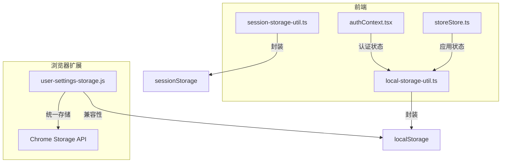
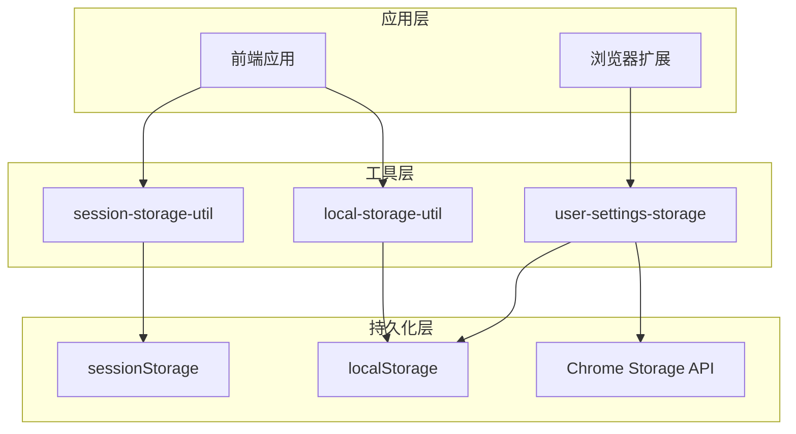
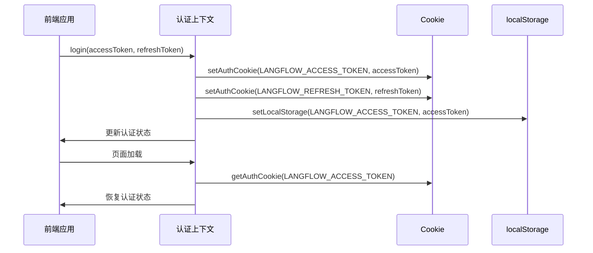
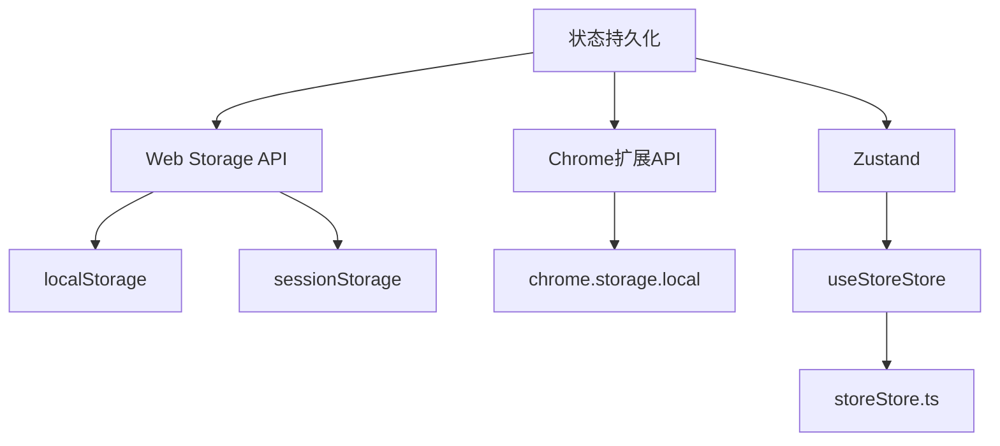

# 状态持久化

<cite>
**本文档引用的文件**
- [local-storage-util.ts](file://vibe_surf/frontend/src/utils/local-storage-util.ts)
- [session-storage-util.ts](file://vibe_surf/frontend/src/utils/session-storage-util.ts)
- [user-settings-storage.js](file://vibe_surf/chrome_extension/scripts/user-settings-storage.js)
- [authContext.tsx](file://vibe_surf/frontend/src/contexts/authContext.tsx)
- [storeStore.ts](file://vibe_surf/frontend/src/stores/storeStore.ts)
- [manager.py](file://vibe_surf/backend/database/manager.py)
</cite>

## 目录
1. [项目结构](#项目结构)
2. [核心组件](#核心组件)
3. [架构概述](#架构概述)
4. [详细组件分析](#详细组件分析)
5. [依赖分析](#依赖分析)
6. [性能考虑](#性能考虑)
7. [故障排除指南](#故障排除指南)
8. [结论](#结论)

## 项目结构

VibeSurf应用的状态持久化机制主要分布在前端和浏览器扩展两个部分。前端部分使用localStorage和sessionStorage进行状态管理，而浏览器扩展部分则通过Chrome扩展API和localStorage的组合来实现持久化。



**Diagram sources**
- [local-storage-util.ts](file://vibe_surf/frontend/src/utils/local-storage-util.ts)
- [session-storage-util.ts](file://vibe_surf/frontend/src/utils/session-storage-util.ts)
- [user-settings-storage.js](file://vibe_surf/chrome_extension/scripts/user-settings-storage.js)

**Section sources**
- [local-storage-util.ts](file://vibe_surf/frontend/src/utils/local-storage-util.ts)
- [session-storage-util.ts](file://vibe_surf/frontend/src/utils/session-storage-util.ts)
- [user-settings-storage.js](file://vibe_surf/chrome_extension/scripts/user-settings-storage.js)

## 核心组件

VibeSurf的状态持久化机制主要由以下几个核心组件构成：localStorage工具类、sessionStorage工具类、用户设置存储管理器以及认证上下文。这些组件共同协作，实现了应用状态的持久化存储和恢复。

**Section sources**
- [local-storage-util.ts](file://vibe_surf/frontend/src/utils/local-storage-util.ts)
- [session-storage-util.ts](file://vibe_surf/frontend/src/utils/session-storage-util.ts)
- [user-settings-storage.js](file://vibe_surf/chrome_extension/scripts/user-settings-storage.js)
- [authContext.tsx](file://vibe_surf/frontend/src/contexts/authContext.tsx)

## 架构概述

VibeSurf的状态持久化架构采用了分层设计，前端和浏览器扩展分别实现了不同的持久化策略。前端主要使用Web Storage API（localStorage和sessionStorage）来存储用户偏好和应用状态，而浏览器扩展则通过Chrome扩展API和localStorage的组合来实现更复杂的持久化需求。



**Diagram sources**
- [local-storage-util.ts](file://vibe_surf/frontend/src/utils/local-storage-util.ts)
- [session-storage-util.ts](file://vibe_surf/frontend/src/utils/session-storage-util.ts)
- [user-settings-storage.js](file://vibe_surf/chrome_extension/scripts/user-settings-storage.js)

## 详细组件分析

### localStorage和sessionStorage工具类分析

VibeSurf提供了专门的工具类来封装localStorage和sessionStorage的操作，使得状态管理更加安全和便捷。

#### 工具类实现
```mermaid
classDiagram
class LocalStorageUtil {
+getLocalStorage(key : string) string
+setLocalStorage(key : string, value : string) void
+removeLocalStorage(key : string) void
}
class SessionStorageUtil {
+getSessionStorage(key : string) string
+setSessionStorage(key : string, value : string) void
+removeSessionStorage(key : string) void
}
note right of LocalStorageUtil
封装localStorage操作
提供类型安全的接口
end note
note right of SessionStorageUtil
封装sessionStorage操作
提供类型安全的接口
end note
```

**Diagram sources**
- [local-storage-util.ts](file://vibe_surf/frontend/src/utils/local-storage-util.ts)
- [session-storage-util.ts](file://vibe_surf/frontend/src/utils/session-storage-util.ts)

**Section sources**
- [local-storage-util.ts](file://vibe_surf/frontend/src/utils/local-storage-util.ts)
- [session-storage-util.ts](file://vibe_surf/frontend/src/utils/session-storage-util.ts)

### 用户设置存储管理器分析

浏览器扩展中的用户设置存储管理器是一个复杂的组件，它不仅支持Chrome扩展API，还提供了localStorage的兼容性支持。

#### 存储管理器实现
```mermaid
classDiagram
class VibeSurfUserSettingsStorage {
+storageKeys : Object
+defaultSettings : Object
+eventListeners : Map
+isInitialized : boolean
+initialize() Promise~void~
+migrateExistingSettings() Promise~void~
+ensureDefaultSettings() Promise~void~
+getAllSettings() Promise~Object~
+saveSettings(settings : Object) Promise~Object~
+getSetting(key : string) Promise~any~
+setSetting(key : string, value : any) Promise~void~
+updateSettings(updates : Object) Promise~void~
+removeSetting(key : string) Promise~void~
+clearAllSettings() Promise~void~
+getTheme() Promise~string~
+setTheme(theme : string) Promise~void~
+getSelectedLlmProfile() Promise~string~
+setSelectedLlmProfile(profileName : string) Promise~void~
+getSelectedAgentMode() Promise~string~
+setSelectedAgentMode(mode : string) Promise~void~
+getDefaultAsr() Promise~string~
+setDefaultAsr(asrProfile : string) Promise~void~
+getDefaultTts() Promise~string~
+setDefaultTts(ttsProfile : string) Promise~void~
+on(event : string, callback : Function) void
+off(event : string, callback : Function) void
+emit(event : string, data : any) void
+exportSettings() Promise~Object~
+importSettings(exportedData : Object) Promise~boolean~
+getStorageInfo() Promise~Object~
+destroy() void
}
note right of VibeSurfUserSettingsStorage
统一的用户设置存储管理
支持Chrome扩展API和localStorage
提供迁移和兼容性支持
end note
```

**Diagram sources**
- [user-settings-storage.js](file://vibe_surf/chrome_extension/scripts/user-settings-storage.js)

**Section sources**
- [user-settings-storage.js](file://vibe_surf/chrome_extension/scripts/user-settings-storage.js)

### 认证状态管理分析

认证状态的持久化是通过认证上下文和cookie的组合来实现的，确保用户登录状态在页面刷新后仍然保持。

#### 认证流程


**Diagram sources**
- [authContext.tsx](file://vibe_surf/frontend/src/contexts/authContext.tsx)

**Section sources**
- [authContext.tsx](file://vibe_surf/frontend/src/contexts/authContext.tsx)

## 依赖分析

VibeSurf的状态持久化机制依赖于多个外部组件和API，包括Web Storage API、Chrome扩展API以及Zustand状态管理库。



**Diagram sources**
- [local-storage-util.ts](file://vibe_surf/frontend/src/utils/local-storage-util.ts)
- [session-storage-util.ts](file://vibe_surf/frontend/src/utils/session-storage-util.ts)
- [user-settings-storage.js](file://vibe_surf/chrome_extension/scripts/user-settings-storage.js)
- [storeStore.ts](file://vibe_surf/frontend/src/stores/storeStore.ts)

**Section sources**
- [local-storage-util.ts](file://vibe_surf/frontend/src/utils/local-storage-util.ts)
- [session-storage-util.ts](file://vibe_surf/frontend/src/utils/session-storage-util.ts)
- [user-settings-storage.js](file://vibe_surf/chrome_extension/scripts/user-settings-storage.js)
- [storeStore.ts](file://vibe_surf/frontend/src/stores/storeStore.ts)

## 性能考虑

在状态持久化过程中，VibeSurf采取了多种性能优化策略：

1. **减少存储频率**：通过防抖和节流技术，避免频繁的存储操作
2. **数据压缩**：对存储的数据进行压缩，减少存储空间占用
3. **错误恢复**：提供localStorage作为Chrome存储API的备用方案
4. **批量操作**：合并多个设置更新为一次存储操作

此外，VibeSurf还实现了版本兼容性处理和数据迁移策略，确保在应用升级时用户数据不会丢失。

**Section sources**
- [user-settings-storage.js](file://vibe_surf/chrome_extension/scripts/user-settings-storage.js)

## 故障排除指南

在状态持久化过程中可能遇到的问题及解决方案：

1. **存储空间不足**：检查存储使用情况，清理不必要的数据
2. **跨浏览器兼容性**：确保localStorage和sessionStorage的使用符合Web标准
3. **数据同步问题**：使用事件系统确保多个组件之间的状态同步
4. **安全考虑**：敏感信息不应存储在localStorage中，应使用更安全的存储方式

**Section sources**
- [user-settings-storage.js](file://vibe_surf/chrome_extension/scripts/user-settings-storage.js)
- [authContext.tsx](file://vibe_surf/frontend/src/contexts/authContext.tsx)

## 结论

VibeSurf的状态持久化机制通过localStorage、sessionStorage和Chrome扩展API的组合，实现了灵活而可靠的状态管理。通过封装工具类和统一的存储管理器，不仅提高了代码的可维护性，还确保了跨平台的兼容性。未来可以进一步优化存储策略，如引入IndexedDB来处理更复杂的数据存储需求。