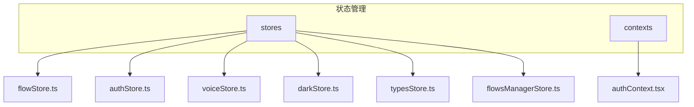
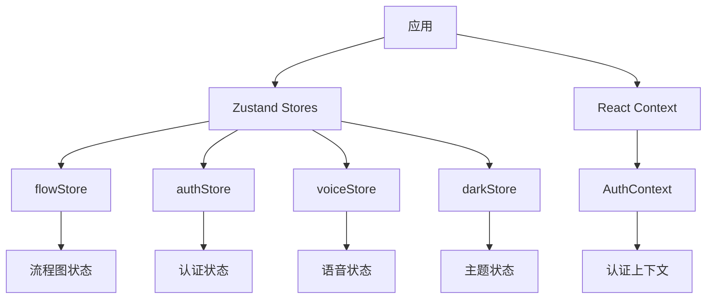
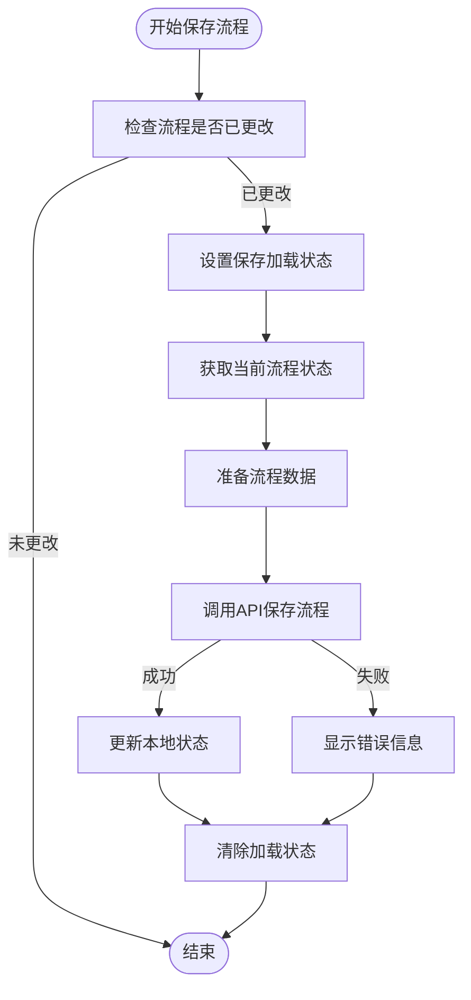
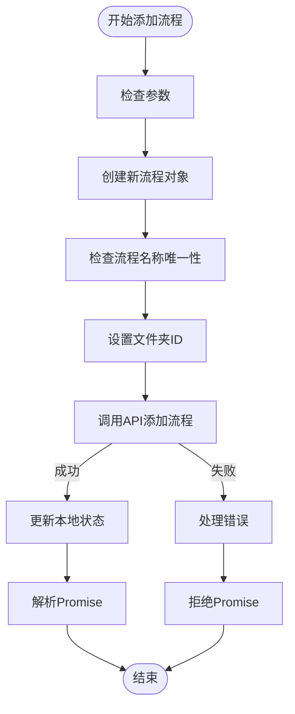
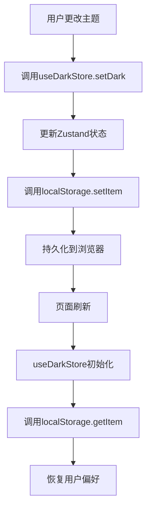
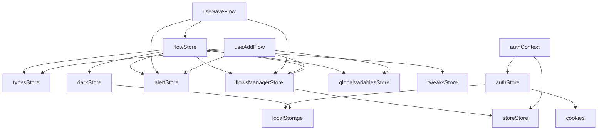

# 状态管理

<cite>
**本文档中引用的文件**  
- [flowStore.ts](file://vibe_surf/frontend/src/stores/flowStore.ts)
- [authStore.ts](file://vibe_surf/frontend/src/stores/authStore.ts)
- [voiceStore.ts](file://vibe_surf/frontend/src/stores/voiceStore.ts)
- [darkStore.ts](file://vibe_surf/frontend/src/stores/darkStore.ts)
- [authContext.tsx](file://vibe_surf/frontend/src/contexts/authContext.tsx)
- [use-save-flow.ts](file://vibe_surf/frontend/src/hooks/flows/use-save-flow.ts)
- [use-add-flow.ts](file://vibe_surf/frontend/src/hooks/flows/use-add-flow.ts)
- [App.tsx](file://vibe_surf/frontend/src/App.tsx)
- [typesStore.ts](file://vibe_surf/frontend/src/stores/typesStore.ts)
- [flowsManagerStore.ts](file://vibe_surf/frontend/src/stores/flowsManagerStore.ts)
</cite>

## 目录
1. [简介](#简介)
2. [项目结构](#项目结构)
3. [核心状态存储](#核心状态存储)
4. [架构概述](#架构概述)
5. [详细组件分析](#详细组件分析)
6. [依赖分析](#依赖分析)
7. [性能考虑](#性能考虑)
8. [故障排除指南](#故障排除指南)
9. [结论](#结论)

## 简介
本文档全面介绍了VibeSurf前端应用的状态管理方案。该方案基于Zustand库构建，提供了高效、可扩展的状态管理架构。文档详细阐述了全局状态存储的设计与实现，包括flowStore、authStore、voiceStore等核心store。同时，文档还解释了React Context在身份验证和主题管理中的应用，以及自定义Hooks如何封装状态逻辑并提供简洁的API接口。

## 项目结构
VibeSurf前端应用的状态管理主要集中在`src/stores`和`src/contexts`目录下。`stores`目录包含了基于Zustand实现的各个状态存储，而`contexts`目录则包含了React Context的实现。

**图示来源**
- [flowStore.ts](file://vibe_surf/frontend/src/stores/flowStore.ts)
- [authStore.ts](file://vibe_surf/frontend/src/stores/authStore.ts)
- [voiceStore.ts](file://vibe_surf/frontend/src/stores/voiceStore.ts)
- [darkStore.ts](file://vibe_surf/frontend/src/stores/darkStore.ts)
- [typesStore.ts](file://vibe_surf/frontend/src/stores/typesStore.ts)
- [flowsManagerStore.ts](file://vibe_surf/frontend/src/stores/flowsManagerStore.ts)
- [authContext.tsx](file://vibe_surf/frontend/src/contexts/authContext.tsx)

**章节来源**
- [flowStore.ts](file://vibe_surf/frontend/src/stores/flowStore.ts)
- [authStore.ts](file://vibe_surf/frontend/src/stores/authStore.ts)
- [voiceStore.ts](file://vibe_surf/frontend/src/stores/voiceStore.ts)

## 核心状态存储
VibeSurf前端应用的核心状态存储包括flowStore、authStore、voiceStore等。这些store分别负责管理流程、身份验证和语音相关的状态。

### flowStore
flowStore是VibeSurf应用中最复杂的状态存储，负责管理流程图的节点、边、构建状态等。它提供了丰富的API来操作流程图，包括添加/删除节点、连接/断开边、构建流程等。

**章节来源**
- [flowStore.ts](file://vibe_surf/frontend/src/stores/flowStore.ts)

### authStore
authStore负责管理用户的身份验证状态，包括访问令牌、用户数据、API密钥等。它使用cookies来持久化认证信息，并提供了登录和注销的方法。

**章节来源**
- [authStore.ts](file://vibe_surf/frontend/src/stores/authStore.ts)

### voiceStore
voiceStore管理语音相关的状态，包括可用的语音列表、语音提供商、语音助手激活状态等。它为语音功能提供了统一的状态管理接口。

**章节来源**
- [voiceStore.ts](file://vibe_surf/frontend/src/stores/voiceStore.ts)

## 架构概述
VibeSurf的状态管理架构结合了Zustand和React Context两种技术。Zustand用于管理全局状态，而React Context用于提供特定于组件树的状态。

**图示来源**
- [flowStore.ts](file://vibe_surf/frontend/src/stores/flowStore.ts)
- [authStore.ts](file://vibe_surf/frontend/src/stores/authStore.ts)
- [voiceStore.ts](file://vibe_surf/frontend/src/stores/voiceStore.ts)
- [darkStore.ts](file://vibe_surf/frontend/src/stores/darkStore.ts)
- [authContext.tsx](file://vibe_surf/frontend/src/contexts/authContext.tsx)

## 详细组件分析
本节详细分析VibeSurf状态管理中的关键组件，包括状态存储、自定义Hooks和状态持久化策略。

### 自定义Hooks分析
VibeSurf通过自定义Hooks封装了复杂的状态逻辑，为组件提供了简洁的API接口。

#### use-save-flow
use-save-flow Hook封装了保存流程的逻辑，包括检查流程是否已更改、调用API保存流程、更新状态等。它使用Zustand store来访问当前流程状态，并通过API调用将更改持久化到后端。

**图示来源**
- [use-save-flow.ts](file://vibe_surf/frontend/src/hooks/flows/use-save-flow.ts)

**章节来源**
- [use-save-flow.ts](file://vibe_surf/frontend/src/hooks/flows/use-save-flow.ts)

#### use-add-flow
use-add-flow Hook负责创建新流程的逻辑。它处理流程名称的唯一性检查、文件夹关联、API调用等复杂逻辑，为组件提供了简单的接口来创建新流程。

**图示来源**
- [use-add-flow.ts](file://vibe_surf/frontend/src/hooks/flows/use-add-flow.ts)

**章节来源**
- [use-add-flow.ts](file://vibe_surf/frontend/src/hooks/flows/use-add-flow.ts)

### 状态持久化策略
VibeSurf应用使用localStorage和sessionStorage来持久化用户偏好设置和认证信息。

#### localStorage使用
localStorage用于持久化用户偏好设置，如主题模式（暗色/亮色）、GitHub星标数等。这些设置在用户关闭浏览器后仍然保留。

**图示来源**
- [darkStore.ts](file://vibe_surf/frontend/src/stores/darkStore.ts)

**章节来源**
- [darkStore.ts](file://vibe_surf/frontend/src/stores/darkStore.ts)

#### sessionStorage使用
sessionStorage用于临时存储认证令牌等敏感信息。这些信息在用户关闭浏览器标签页后自动清除，提高了安全性。

**章节来源**
- [authStore.ts](file://vibe_surf/frontend/src/stores/authStore.ts)
- [authContext.tsx](file://vibe_surf/frontend/src/contexts/authContext.tsx)

## 依赖分析
VibeSurf状态管理系统的组件之间存在复杂的依赖关系。理解这些依赖关系对于维护和扩展系统至关重要。

**图示来源**
- [flowStore.ts](file://vibe_surf/frontend/src/stores/flowStore.ts)
- [authStore.ts](file://vibe_surf/frontend/src/stores/authStore.ts)
- [darkStore.ts](file://vibe_surf/frontend/src/stores/darkStore.ts)
- [flowsManagerStore.ts](file://vibe_surf/frontend/src/stores/flowsManagerStore.ts)
- [authContext.tsx](file://vibe_surf/frontend/src/contexts/authContext.tsx)
- [use-save-flow.ts](file://vibe_surf/frontend/src/hooks/flows/use-save-flow.ts)
- [use-add-flow.ts](file://vibe_surf/frontend/src/hooks/flows/use-add-flow.ts)

**章节来源**
- [flowStore.ts](file://vibe_surf/frontend/src/stores/flowStore.ts)
- [authStore.ts](file://vibe_surf/frontend/src/stores/authStore.ts)
- [darkStore.ts](file://vibe_surf/frontend/src/stores/darkStore.ts)
- [flowsManagerStore.ts](file://vibe_surf/frontend/src/stores/flowsManagerStore.ts)
- [authContext.tsx](file://vibe_surf/frontend/src/contexts/authContext.tsx)
- [use-save-flow.ts](file://vibe_surf/frontend/src/hooks/flows/use-save-flow.ts)
- [use-add-flow.ts](file://vibe_surf/frontend/src/hooks/flows/use-add-flow.ts)

## 性能考虑
VibeSurf状态管理系统在设计时充分考虑了性能因素，采用了多种优化策略来避免过度重渲染和提高响应速度。

### 避免过度重渲染
通过使用Zustand的选择器功能，组件只订阅它们需要的状态部分，从而避免了不必要的重渲染。例如，一个只显示用户名的组件只会订阅authStore中的userData部分，而不会在其他状态变化时重新渲染。

### 合理拆分store
将状态合理拆分为多个store，如flowStore、authStore、voiceStore等，避免了单一store过大导致的性能问题。每个store只关注特定领域的状态，提高了代码的可维护性和性能。

### 异步状态更新处理
对于异步操作，如API调用，VibeSurf使用了适当的加载状态管理。在异步操作进行时显示加载指示器，并在操作完成后更新状态，提供了良好的用户体验。

## 故障排除指南
本节提供了一些常见的状态管理问题及其解决方案。

### 状态更新不生效
如果发现状态更新后组件没有重新渲染，可能是由于：
1. 组件没有正确订阅状态变化
2. 状态更新函数没有正确调用
3. Zustand store的更新逻辑存在问题

解决方案是检查组件的useStore调用，确保正确订阅了需要的状态，并验证状态更新函数的实现。

### 认证状态丢失
如果用户在刷新页面后认证状态丢失，可能是由于：
1. 认证令牌没有正确存储在cookies中
2. localStorage中的认证信息被清除

解决方案是检查authStore和authContext的实现，确保认证信息被正确持久化。

**章节来源**
- [authStore.ts](file://vibe_surf/frontend/src/stores/authStore.ts)
- [authContext.tsx](file://vibe_surf/frontend/src/contexts/authContext.tsx)

## 结论
VibeSurf前端状态管理方案通过结合Zustand和React Context，实现了高效、可扩展的状态管理。该方案具有以下优点：
- 使用Zustand提供简单、高效的状态管理
- 通过合理的store拆分提高代码可维护性
- 利用自定义Hooks封装复杂逻辑，提供简洁的API
- 使用localStorage和sessionStorage实现状态持久化
- 通过选择器避免过度重渲染，提高性能

这套状态管理方案为VibeSurf应用的稳定运行提供了坚实的基础，同时也为未来的功能扩展提供了良好的架构支持。