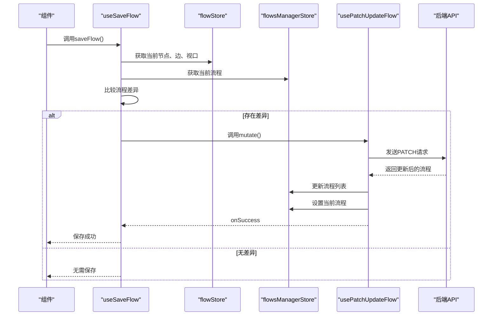
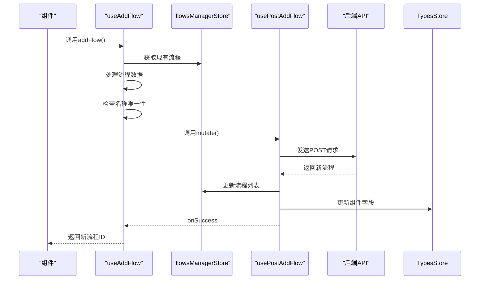
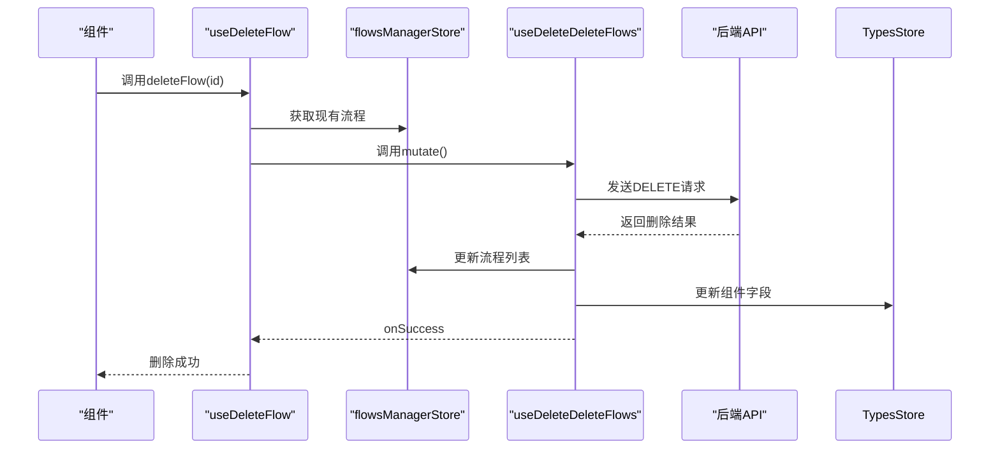
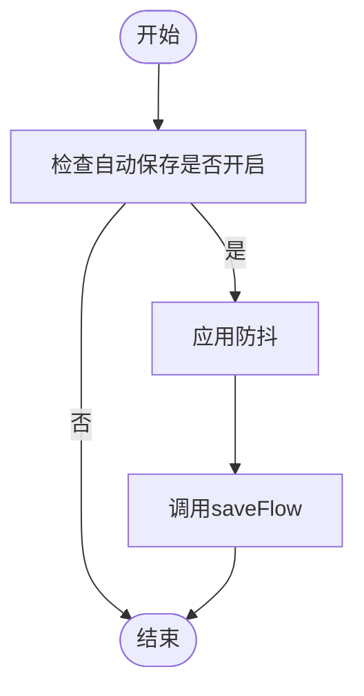
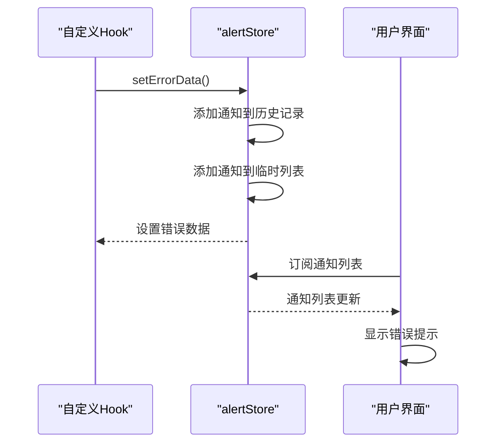
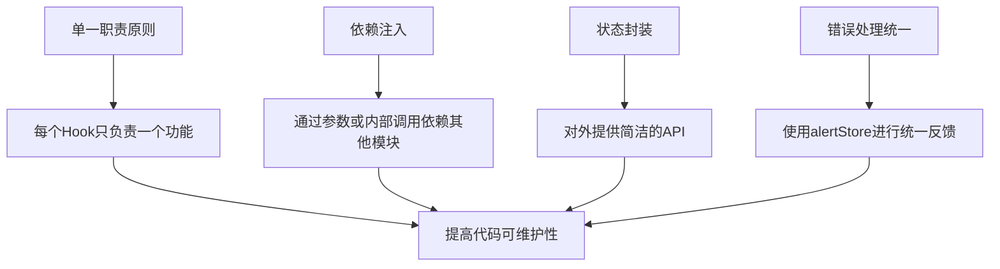

# 自定义Hooks

<cite>
**本文档中引用的文件**   
- [use-save-flow.ts](file://vibe_surf/frontend/src/hooks/flows/use-save-flow.ts)
- [use-add-flow.ts](file://vibe_surf/frontend/src/hooks/flows/use-add-flow.ts)
- [use-delete-flow.ts](file://vibe_surf/frontend/src/hooks/flows/use-delete-flow.ts)
- [use-autosave-flow.ts](file://vibe_surf/frontend/src/hooks/flows/use-autosave-flow.ts)
- [flowStore.ts](file://vibe_surf/frontend/src/stores/flowStore.ts)
- [flowsManagerStore.ts](file://vibe_surf/frontend/src/stores/flowsManagerStore.ts)
- [alertStore.ts](file://vibe_surf/frontend/src/stores/alertStore.ts)
- [reactflowUtils.ts](file://vibe_surf/frontend/src/utils/reactflowUtils.ts)
- [use-post-add-flow.ts](file://vibe_surf/frontend/src/controllers/API/queries/flows/use-post-add-flow.ts)
- [use-patch-update-flow.ts](file://vibe_surf/frontend/src/controllers/API/queries/flows/use-patch-update-flow.ts)
- [use-delete-delete-flows.ts](file://vibe_surf/frontend/src/controllers/API/queries/flows/use-delete-delete-flows.ts)
- [use-get-flow.ts](file://vibe_surf/frontend/src/controllers/API/queries/flows/use-get-flow.ts)
</cite>

## 目录
1. [简介](#简介)
2. [核心流程管理Hooks](#核心流程管理Hooks)
3. [状态管理与Store交互](#状态管理与Store交互)
4. [错误处理与用户反馈](#错误处理与用户反馈)
5. [Hooks复用性设计原则](#hooks复用性设计原则)
6. [使用示例](#使用示例)
7. [结论](#结论)

## 简介

VibeSurf应用提供了一套用于流程管理的自定义React Hooks，旨在封装复杂的异步操作和状态更新逻辑，为组件提供简洁的API。这些Hooks包括`use-save-flow`、`use-add-flow`、`use-delete-flow`和`use-autosave-flow`，它们通过与全局store的交互，实现了流程的创建、保存、删除和自动保存功能。这些Hooks的设计遵循了复用性原则，确保了代码的可维护性和可扩展性。

**Section sources**
- [use-save-flow.ts](file://vibe_surf/frontend/src/hooks/flows/use-save-flow.ts#L1-L136)
- [use-add-flow.ts](file://vibe_surf/frontend/src/hooks/flows/use-add-flow.ts#L1-L130)
- [use-delete-flow.ts](file://vibe_surf/frontend/src/hooks/flows/use-delete-flow.ts#L1-L52)
- [use-autosave-flow.ts](file://vibe_surf/frontend/src/hooks/flows/use-autosave-flow.ts#L1-L23)

## 核心流程管理Hooks

### use-save-flow

`use-save-flow` Hook用于保存当前流程。它通过`usePatchUpdateFlow` mutation与后端API交互，更新流程数据。该Hook首先检查当前流程与已保存流程的差异，如果存在差异，则触发保存操作。保存过程中，它会从`flowStore`中获取当前的节点、边和视口信息，并将其与流程元数据一起发送到后端。成功保存后，它会更新`flowsManagerStore`中的流程列表和当前流程状态。



**Diagram sources**
- [use-save-flow.ts](file://vibe_surf/frontend/src/hooks/flows/use-save-flow.ts#L19-L132)
- [flowStore.ts](file://vibe_surf/frontend/src/stores/flowStore.ts#L114-L115)
- [flowsManagerStore.ts](file://vibe_surf/frontend/src/stores/flowsManagerStore.ts#L54-L55)
- [use-patch-update-flow.ts](file://vibe_surf/frontend/src/controllers/API/queries/flows/use-patch-update-flow.ts#L25-L32)

**Section sources**
- [use-save-flow.ts](file://vibe_surf/frontend/src/hooks/flows/use-save-flow.ts#L1-L136)

### use-add-flow

`use-add-flow` Hook用于创建新流程。它通过`usePostAddFlow` mutation与后端API交互，添加新流程。该Hook支持创建空白流程或基于现有流程的副本。在创建流程时，它会处理流程名称的唯一性，避免重复名称。成功创建后，它会更新`flowsManagerStore`中的流程列表，并将新流程添加到`typesStore`中，以便在组件中使用。



**Diagram sources**
- [use-add-flow.ts](file://vibe_surf/frontend/src/hooks/flows/use-add-flow.ts#L44-L125)
- [flowsManagerStore.ts](file://vibe_surf/frontend/src/stores/flowsManagerStore.ts#L47-L48)
- [use-post-add-flow.ts](file://vibe_surf/frontend/src/controllers/API/queries/flows/use-post-add-flow.ts#L29-L42)

**Section sources**
- [use-add-flow.ts](file://vibe_surf/frontend/src/hooks/flows/use-add-flow.ts#L1-L130)

### use-delete-flow

`use-delete-flow` Hook用于删除一个或多个流程。它通过`useDeleteDeleteFlows` mutation与后端API交互，删除指定ID的流程。该Hook支持删除单个流程或批量删除多个流程。成功删除后，它会更新`flowsManagerStore`中的流程列表，并同步更新`typesStore`中的组件字段。



**Diagram sources**
- [use-delete-flow.ts](file://vibe_surf/frontend/src/hooks/flows/use-delete-flow.ts#L14-L46)
- [flowsManagerStore.ts](file://vibe_surf/frontend/src/stores/flowsManagerStore.ts#L47-L48)
- [use-delete-delete-flows.ts](file://vibe_surf/frontend/src/controllers/API/queries/flows/use-delete-delete-flows.ts#L17-L22)

**Section sources**
- [use-delete-flow.ts](file://vibe_surf/frontend/src/hooks/flows/use-delete-flow.ts#L1-L52)

### use-autosave-flow

`use-autosave-flow` Hook用于实现流程的自动保存功能。它依赖于`use-save-flow` Hook和`useDebounce` Hook，通过设置防抖时间来控制自动保存的频率。该Hook会监听`flowsManagerStore`中的自动保存开关和间隔时间，当自动保存开启时，它会在用户操作后延迟指定时间再触发保存操作，避免频繁保存。



**Diagram sources**
- [use-autosave-flow.ts](file://vibe_surf/frontend/src/hooks/flows/use-autosave-flow.ts#L6-L17)
- [use-save-flow.ts](file://vibe_surf/frontend/src/hooks/flows/use-save-flow.ts#L10-L13)
- [use-debounce.ts](file://vibe_surf/frontend/src/hooks/use-debounce.ts)

**Section sources**
- [use-autosave-flow.ts](file://vibe_surf/frontend/src/hooks/flows/use-autosave-flow.ts#L1-L23)

## 状态管理与Store交互

### Store架构

VibeSurf应用使用Zustand进行状态管理，主要涉及三个store：`flowStore`、`flowsManagerStore`和`alertStore`。`flowStore`负责管理当前流程的节点、边、视口等数据；`flowsManagerStore`负责管理所有流程的列表和当前流程状态；`alertStore`负责管理用户界面的提示信息。

```mermaid
classDiagram
class flowStore {
+nodes : AllNodeType[]
+edges : EdgeType[]
+reactFlowInstance : ReactFlowInstance
+currentFlow : FlowType
+setNodes()
+setEdges()
+setReactFlowInstance()
+resetFlow()
}
class flowsManagerStore {
+flows : FlowType[]
+currentFlow : FlowType
+autoSaving : boolean
+autoSavingInterval : number
+setFlows()
+setCurrentFlow()
+setAutoSaving()
+setAutoSavingInterval()
}
class alertStore {
+errorData : {title : string, list : string[]}
+noticeData : {title : string, link : string}
+successData : {title : string}
+setErrorData()
+setNoticeData()
+setSuccessData()
}
useSaveFlow --> flowStore : "读取"
useSaveFlow --> flowsManagerStore : "读取/更新"
useAddFlow --> flowsManagerStore : "读取/更新"
useDeleteFlow --> flowsManagerStore : "读取/更新"
useAutoSaveFlow --> flowsManagerStore : "读取"
useSaveFlow --> alertStore : "更新"
useAddFlow --> alertStore : "更新"
useDeleteFlow --> alertStore : "更新"
```

**Diagram sources**
- [flowStore.ts](file://vibe_surf/frontend/src/stores/flowStore.ts#L61-L800)
- [flowsManagerStore.ts](file://vibe_surf/frontend/src/stores/flowsManagerStore.ts#L19-L142)
- [alertStore.ts](file://vibe_surf/frontend/src/stores/alertStore.ts#L7-L105)

**Section sources**
- [flowStore.ts](file://vibe_surf/frontend/src/stores/flowStore.ts#L1-L1101)
- [flowsManagerStore.ts](file://vibe_surf/frontend/src/stores/flowsManagerStore.ts#L1-L145)
- [alertStore.ts](file://vibe_surf/frontend/src/stores/alertStore.ts#L1-L108)

## 错误处理与用户反馈

### 错误处理机制

VibeSurf的流程管理Hooks通过`alertStore`实现统一的错误处理和用户反馈。当API调用失败或出现业务逻辑错误时，Hooks会调用`alertStore`的相应方法，设置错误、通知或成功信息。这些信息会显示在用户界面的提示区域，帮助用户了解操作结果。



**Diagram sources**
- [use-save-flow.ts](file://vibe_surf/frontend/src/hooks/flows/use-save-flow.ts#L101-L114)
- [use-add-flow.ts](file://vibe_surf/frontend/src/hooks/flows/use-add-flow.ts#L109-L119)
- [alertStore.ts](file://vibe_surf/frontend/src/stores/alertStore.ts#L47-L57)

**Section sources**
- [alertStore.ts](file://vibe_surf/frontend/src/stores/alertStore.ts#L7-L108)

## Hooks复用性设计原则

### 设计原则

VibeSurf的自定义Hooks遵循了以下复用性设计原则：
1. **单一职责原则**：每个Hook只负责一个特定的功能，如`use-save-flow`只负责保存流程，`use-add-flow`只负责添加流程。
2. **依赖注入**：Hooks通过参数或内部调用的方式依赖其他Hooks或store，如`use-autosave-flow`依赖`use-save-flow`和`useDebounce`。
3. **状态封装**：Hooks封装了复杂的状态管理逻辑，对外提供简洁的API，如`use-save-flow`返回一个`saveFlow`函数，组件只需调用该函数即可完成保存操作。
4. **错误处理统一**：所有Hooks使用`alertStore`进行统一的错误处理和用户反馈，确保用户体验的一致性。



**Diagram sources**
- [use-save-flow.ts](file://vibe_surf/frontend/src/hooks/flows/use-save-flow.ts)
- [use-add-flow.ts](file://vibe_surf/frontend/src/hooks/flows/use-add-flow.ts)
- [use-delete-flow.ts](file://vibe_surf/frontend/src/hooks/flows/use-delete-flow.ts)
- [use-autosave-flow.ts](file://vibe_surf/frontend/src/hooks/flows/use-autosave-flow.ts)
- [alertStore.ts](file://vibe_surf/frontend/src/stores/alertStore.ts)

**Section sources**
- [use-save-flow.ts](file://vibe_surf/frontend/src/hooks/flows/use-save-flow.ts#L1-L136)
- [use-add-flow.ts](file://vibe_surf/frontend/src/hooks/flows/use-add-flow.ts#L1-L130)
- [use-delete-flow.ts](file://vibe_surf/frontend/src/hooks/flows/use-delete-flow.ts#L1-L52)
- [use-autosave-flow.ts](file://vibe_surf/frontend/src/hooks/flows/use-autosave-flow.ts#L1-L23)

## 使用示例

### 保存流程

在组件中使用`use-save-flow` Hook来保存当前流程：

```typescript
import useSaveFlow from "@/hooks/flows/use-save-flow";

const FlowComponent = () => {
  const saveFlow = useSaveFlow();
  
  const handleSave = async () => {
    try {
      await saveFlow();
      // 保存成功后的处理
    } catch (error) {
      // 错误处理已在Hook内部完成
    }
  };
  
  return (
    <button onClick={handleSave}>保存流程</button>
  );
};
```

**Section sources**
- [use-save-flow.ts](file://vibe_surf/frontend/src/hooks/flows/use-save-flow.ts#L10-L132)

### 自动保存流程

在组件中使用`use-autosave-flow` Hook来实现自动保存：

```typescript
import useAutoSaveFlow from "@/hooks/flows/use-autosave-flow";

const FlowComponent = () => {
  const autoSaveFlow = useAutoSaveFlow();
  
  // 在流程数据变化时触发自动保存
  const handleFlowChange = () => {
    autoSaveFlow();
  };
  
  return (
    <div onInput={handleFlowChange}>
      {/* 流程编辑区域 */}
    </div>
  );
};
```

**Section sources**
- [use-autosave-flow.ts](file://vibe_surf/frontend/src/hooks/flows/use-autosave-flow.ts#L6-L17)

## 结论

VibeSurf的自定义Hooks通过封装复杂的异步操作和状态更新逻辑，为组件提供了简洁、一致的API。这些Hooks遵循了良好的设计原则，具有高度的复用性和可维护性。通过与全局store的交互，它们实现了流程的创建、保存、删除和自动保存功能，并通过统一的错误处理机制提供了良好的用户体验。这些Hooks的设计模式可以作为其他类似应用的参考。