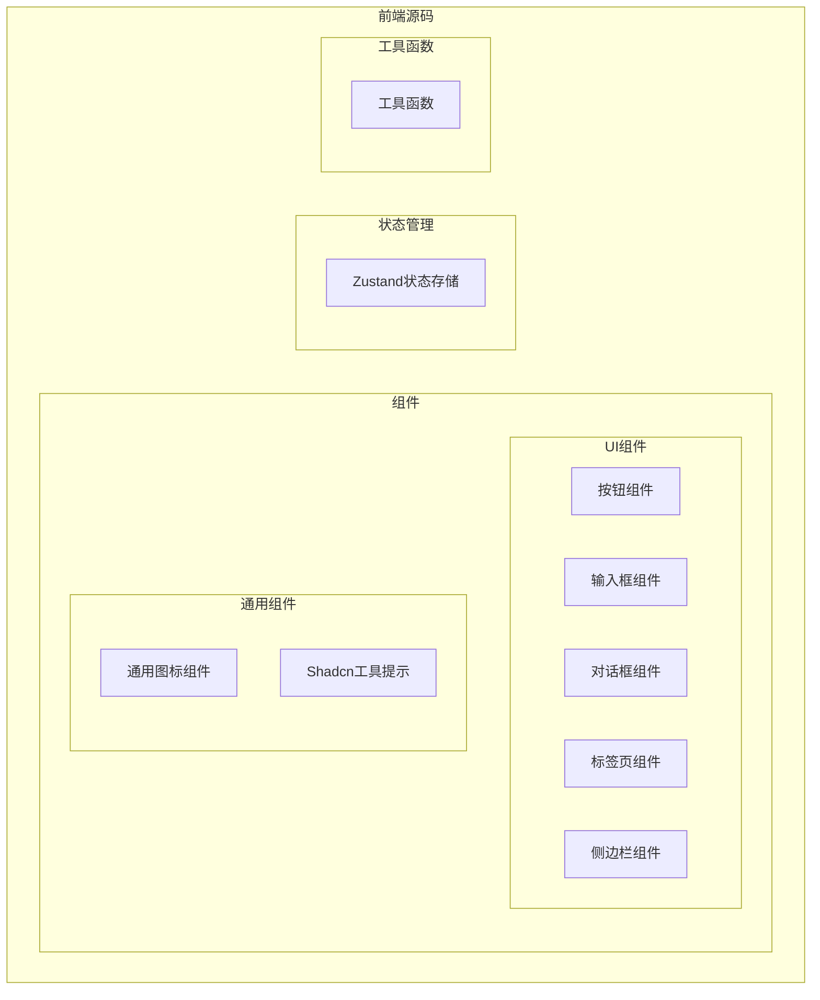
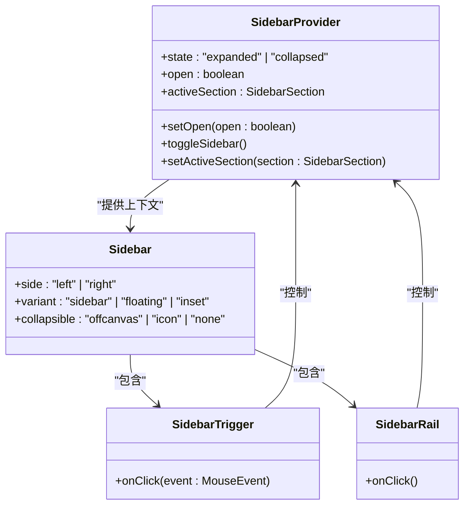
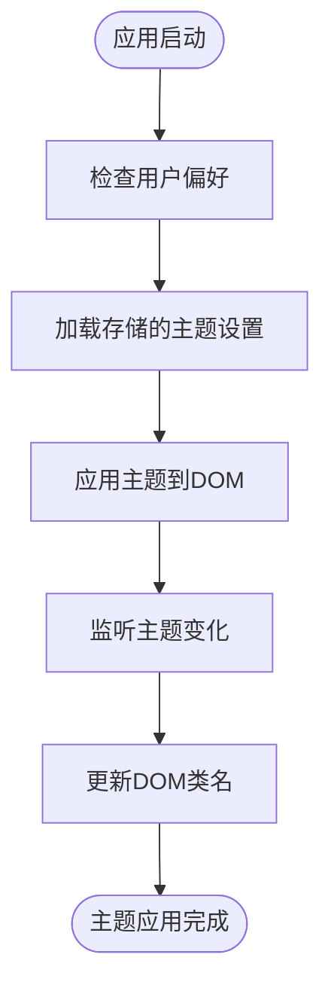
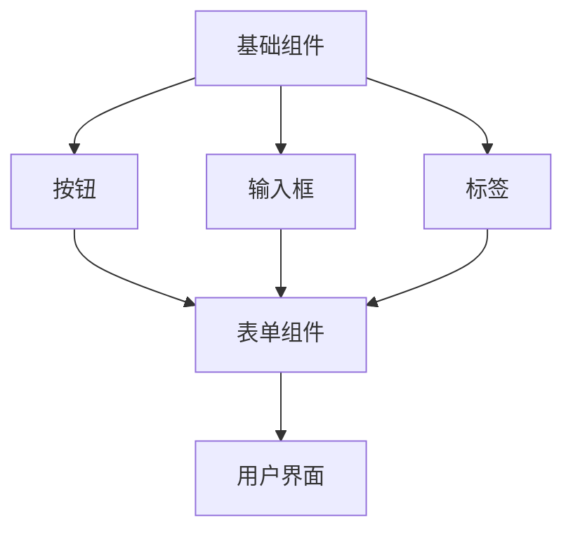

# UI组件库

<cite>
**本文档中引用的文件**  
- [button.tsx](file://vibe_surf/frontend/src/components/ui/button.tsx)
- [input.tsx](file://vibe_surf/frontend/src/components/ui/input.tsx)
- [dialog.tsx](file://vibe_surf/frontend/src/components/ui/dialog.tsx)
- [tabs.tsx](file://vibe_surf/frontend/src/components/ui/tabs.tsx)
- [sidebar.tsx](file://vibe_surf/frontend/src/components/ui/sidebar.tsx)
- [select.tsx](file://vibe_surf/frontend/src/components/ui/select.tsx)
- [checkbox.tsx](file://vibe_surf/frontend/src/components/ui/checkbox.tsx)
- [switch.tsx](file://vibe_surf/frontend/src/components/ui/switch.tsx)
- [dropdown-menu.tsx](file://vibe_surf/frontend/src/components/ui/dropdown-menu.tsx)
- [popover.tsx](file://vibe_surf/frontend/src/components/ui/popover.tsx)
- [App.tsx](file://vibe_surf/frontend/src/App.tsx)
- [index.tsx](file://vibe_surf/frontend/src/index.tsx)
- [custom-App.tsx](file://vibe_surf/frontend/src/customization/custom-App.tsx)
</cite>

## 目录
1. [简介](#简介)
2. [项目结构](#项目结构)
3. [核心原子组件](#核心原子组件)
4. [核心功能组件](#核心功能组件)
5. [样式与主题](#样式与主题)
6. [状态管理集成](#状态管理集成)
7. [可访问性设计](#可访问性设计)
8. [使用示例与最佳实践](#使用示例与最佳实践)
9. [结论](#结论)

## 简介
VibeSurf UI组件库是基于Shadcn UI构建的现代化前端组件库，为开发者提供了一套完整、可复用的UI组件。该组件库遵循原子设计原则，从基础的按钮、输入框到复杂的侧边栏、对话框等组件，都经过精心设计和实现。组件库通过Zustand进行状态管理，支持主题切换和样式隔离，确保了组件在不同上下文中的稳定性和一致性。本文档将全面介绍VibeSurf UI组件库的架构、设计原则、使用方法和最佳实践。

## 项目结构
VibeSurf UI组件库的项目结构遵循现代前端开发的最佳实践，采用模块化设计，便于维护和扩展。组件库的核心位于`vibe_surf/frontend/src/components/ui`目录下，包含了所有基础原子组件和复合组件。

**Diagram sources**
- [button.tsx](file://vibe_surf/frontend/src/components/ui/button.tsx)
- [input.tsx](file://vibe_surf/frontend/src/components/ui/input.tsx)
- [dialog.tsx](file://vibe_surf/frontend/src/components/ui/dialog.tsx)

**Section sources**
- [App.tsx](file://vibe_surf/frontend/src/App.tsx#L1-L23)
- [index.tsx](file://vibe_surf/frontend/src/index.tsx#L1-L20)

## 核心原子组件

VibeSurf UI组件库提供了丰富的基础原子组件，这些组件是构建复杂用户界面的基石。每个组件都经过精心设计，具有良好的可访问性和可定制性。

### 按钮组件
按钮组件是用户界面中最常用的交互元素之一。VibeSurf的按钮组件支持多种变体和尺寸，满足不同场景的需求。

**Section sources**
- [button.tsx](file://vibe_surf/frontend/src/components/ui/button.tsx#L1-L134)

### 输入框组件
输入框组件提供了基本的文本输入功能，支持图标显示和占位符文本。组件通过`ForwardedIconComponent`实现图标的灵活集成。

**Section sources**
- [input.tsx](file://vibe_surf/frontend/src/components/ui/input.tsx#L1-L58)

### 对话框组件
对话框组件基于Radix UI实现，提供了完整的模态对话框功能，包括标题、内容、页脚和关闭按钮。组件特别注重可访问性，使用`VisuallyHidden`组件确保屏幕阅读器能够正确识别。

**Section sources**
- [dialog.tsx](file://vibe_surf/frontend/src/components/ui/dialog.tsx#L1-L171)

### 标签页组件
标签页组件实现了选项卡式界面，支持水平布局和状态切换。组件使用Radix UI的Tabs原语，确保了良好的键盘导航和屏幕阅读器支持。

**Section sources**
- [tabs.tsx](file://vibe_surf/frontend/src/components/ui/tabs.tsx#L1-L52)

## 核心功能组件

除了基础原子组件外，VibeSurf还提供了一系列复杂的复合组件，用于构建完整的用户界面。

### 侧边栏组件
侧边栏组件是VibeSurf UI中最复杂的组件之一，提供了可折叠、可持久化的侧边栏功能。组件使用React Context进行状态管理，支持多种布局模式和响应式设计。

**Diagram sources**
- [sidebar.tsx](file://vibe_surf/frontend/src/components/ui/sidebar.tsx#L1-L800)

**Section sources**
- [sidebar.tsx](file://vibe_surf/frontend/src/components/ui/sidebar.tsx#L1-L800)

### 选择器组件
选择器组件提供了下拉选择功能，支持单选和多选。组件使用Radix UI的Select原语，确保了良好的可访问性和键盘导航。

**Section sources**
- [select.tsx](file://vibe_surf/frontend/src/components/ui/select.tsx#L1-L129)

### 复选框与开关组件
复选框和开关组件提供了布尔值选择功能。复选框组件支持两种样式：标准复选框和自定义的`CheckBoxDiv`。开关组件实现了滑动切换效果。

**Section sources**
- [checkbox.tsx](file://vibe_surf/frontend/src/components/ui/checkbox.tsx#L1-L52)
- [switch.tsx](file://vibe_surf/frontend/src/components/ui/switch.tsx#L1-L29)

### 下拉菜单组件
下拉菜单组件提供了丰富的菜单功能，支持子菜单、复选框项、单选框项和快捷键显示。组件使用Radix UI的DropdownMenu原语，确保了良好的可访问性。

**Section sources**
- [dropdown-menu.tsx](file://vibe_surf/frontend/src/components/ui/dropdown-menu.tsx#L1-L200)

### 弹出框组件
弹出框组件提供了非模态的浮层功能，支持锚点定位和对齐。组件提供了两种内容容器：带Portal的标准弹出框和不带Portal的弹出框。

**Section sources**
- [popover.tsx](file://vibe_surf/frontend/src/components/ui/popover.tsx#L1-L56)

## 样式与主题

VibeSurf UI组件库采用Tailwind CSS进行样式管理，结合`class-variance-authority`实现组件变体的类型安全定义。组件库支持深色/浅色主题切换，通过Zustand状态管理实现主题的全局控制。

### 样式隔离策略
组件库通过以下策略实现样式隔离：
1. 使用BEM命名约定避免样式冲突
2. 为每个组件定义独立的CSS类名
3. 使用`cn`工具函数合并类名，确保样式优先级

### 主题支持
主题支持通过`useDarkStore`实现，该Zustand存储管理应用的深色模式状态。当主题切换时，通过操作DOM类名来应用相应的CSS变量。

**Diagram sources**
- [App.tsx](file://vibe_surf/frontend/src/App.tsx#L1-L23)

**Section sources**
- [App.tsx](file://vibe_surf/frontend/src/App.tsx#L1-L23)
- [custom-App.tsx](file://vibe_surf/frontend/src/customization/custom-App.tsx#L1-L6)

## 状态管理集成

VibeSurf UI组件库与Zustand状态管理紧密集成，通过自定义Hook和Context实现组件间的状态共享。

### Zustand存储
组件库使用多个Zustand存储来管理不同类型的状态：
- `darkStore`：管理深色模式状态
- `shortcutsStore`：管理快捷键配置
- 其他业务相关的状态存储

### 状态共享模式
组件间的状态共享通过以下模式实现：
1. 使用React Context提供全局状态
2. 通过自定义Hook封装状态逻辑
3. 使用Zustand的`useStore` Hook订阅状态变化

**Section sources**
- [App.tsx](file://vibe_surf/frontend/src/App.tsx#L6)
- [sidebar.tsx](file://vibe_surf/frontend/src/components/ui/sidebar.tsx#L10)

## 可访问性设计

VibeSurf UI组件库高度重视可访问性，遵循WCAG 2.1标准，确保所有用户都能有效使用界面。

### 键盘导航
所有交互组件都支持完整的键盘导航：
- 按钮和链接支持Tab键导航和Enter/Space键激活
- 下拉菜单支持方向键导航
- 对话框支持Tab键在可聚焦元素间循环

### 屏幕阅读器支持
组件通过ARIA属性和语义化HTML元素提供屏幕阅读器支持：
- 使用`aria-label`和`aria-labelledby`提供上下文信息
- 使用`role`属性定义组件角色
- 通过`VisuallyHidden`组件为屏幕阅读器提供隐藏的文本内容

### 焦点管理
组件库实现了智能的焦点管理：
- 模态对话框打开时将焦点移动到关闭按钮
- 对话框关闭时将焦点返回到触发元素
- 防止焦点逃逸出模态组件

**Section sources**
- [dialog.tsx](file://vibe_surf/frontend/src/components/ui/dialog.tsx#L37-L51)
- [sidebar.tsx](file://vibe_surf/frontend/src/components/ui/sidebar.tsx#L196-L210)

## 使用示例与最佳实践

### 组件复用
VibeSurf组件库的设计原则是高度可复用。通过组合基础组件，可以构建复杂的用户界面。

### 事件处理
组件库提供了标准化的事件处理模式：
- 使用原生事件处理函数
- 通过props传递自定义事件处理器
- 支持事件冒泡和捕获

### 自定义样式
虽然组件库提供了丰富的样式变体，但也支持通过`className` prop进行自定义样式扩展。

**Section sources**
- [button.tsx](file://vibe_surf/frontend/src/components/ui/button.tsx#L53-L60)
- [input.tsx](file://vibe_surf/frontend/src/components/ui/input.tsx#L5-L10)

## 结论
VibeSurf UI组件库是一个功能完整、设计精良的前端组件库，基于Shadcn UI构建，结合了现代前端开发的最佳实践。组件库通过Zustand实现状态管理，支持主题切换和样式隔离，具有良好的可访问性。通过合理使用这些组件，开发者可以快速构建出专业、一致的用户界面。建议在项目中遵循组件库的设计原则和使用模式，以确保最佳的用户体验和维护性。